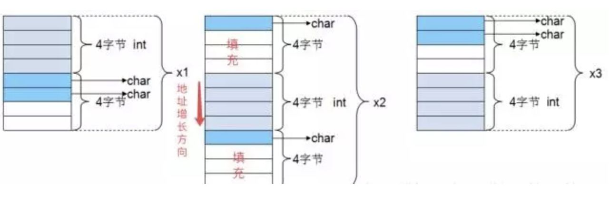

# C 基础知识

## 1. 指针

指针也就是内存地址，指针变量是用来存放内存地址的变量。就像其他变量或常量一样，您必须在使用指针存储其他变量地址之前，对其进行声明。指针变量声明的一般形式为：

```C
type *var-name;
```

### 1.1 函数指针

函数指针是指指向函数的指针变量

```c
typedef int (*fun_ptr)(int,int); // 声明一个指向同样参数、返回值的函数指针类型
```

#### 实例

```c

#include <iostream>
#include <stdio.h>

int max(int x, int y)
{
    return x > y ? x : y;
}

int main(void)
{
    /* p 是函数指针 */
    int (*p)(int, int) = &max; // &可以省略
    int a, b, c, d;

    printf("请输入三个数字:");
    scanf_s("%d %d %d", &a, &b, &c);

    /* 与直接调用函数等价，d = max(max(a, b), c) */
    d = p(p(a, b), c);

    printf("最大的数字是: %d\n", d);

    return 0;
}
```

编译执行，输出结果如下：

``` c
请输入三个数字:1 2 3
最大的数字是: 3
```

### 1.2 指针函数

指针函数是指带指针的函数，本质是一个函数。函数返回类型是某一类型的指针

```c
typedef  *fun_ptr(int,int); 
```

#### 实例

```c
#include <stdio.h>
#include <time.h>
#include <stdlib.h> 
 
/* 要生成和返回随机数的函数 */
int * getRandom( )
{
   static int  r[10];
   int i;
 
   /* 设置种子 */
   srand( (unsigned)time( NULL ) );
   for ( i = 0; i < 10; ++i)
   {
      r[i] = rand();
      printf("%d\n", r[i] );
   }
 
   return r;
}
 
/* 要调用上面定义函数的主函数 */
int main ()
{
   /* 一个指向整数的指针 */
   int *p;
   int i;
 
   p = getRandom();
   for ( i = 0; i < 10; i++ )
   {
       printf("*(p + [%d]) : %d\n", i, *(p + i) );
   }
 
   return 0;
}
```

编译执行，输出如下“

```c
16562
22027
2149
13523
21768
29726
1835
28355
16562
12275
*(p + [0]) : 16562
*(p + [1]) : 22027
*(p + [2]) : 2149
*(p + [3]) : 13523
*(p + [4]) : 21768
*(p + [5]) : 29726
*(p + [6]) : 1835
*(p + [7]) : 28355
*(p + [8]) : 16562
*(p + [9]) : 12275
```

### 1.3 数组指针(行指针)

数组指针，指的是指向数组的指针，即数组首元素地址的指针。

```c
typedef (*p)[n]; 
```

#### 实例

```c
int a[3][4]
int (*p)[4]; //该语句是定义一个数组指针，指向含4个元素的一维数组
p = a; //将该二维数组的首地址赋给p，也就是a[0]或&a[0][0]
p++; //该语句执行过后，也就是p=p+1;跨过行a[0][]指向了行a[1][]
```


## 2. 结构体

**结构体** 是 C 编程中另一种用户自定义的可用的数据类型，它允许您存储不同类型的数据项。为了定义结构，您必须使用 **struct** 语句。struct 语句定义了一个包含多个成员的新的数据类型，struct 语句的格式如下：

```c
struct tag { 
    member-list
    member-list 
    member-list  
    ...
} variable-list ;
```

**tag** 是结构体标签。

**member-list** 是标准的变量定义，比如 int i; 或者 float f，或者其他有效的变量定义。

**variable-list** 结构变量，定义在结构的末尾，最后一个分号之前，您可以指定一个或多个结构变量。

### 2.1 结构体大小

#### 内存对齐

```c
/32位系统
#include<stdio.h>
struct{
    int x;
    char y;
}s;

int main()
{
    printf("%d\n",sizeof(s);  // 输出8
    return 0;
}
```

现代计算机中内存空间都是按照 byte 划分的，从理论上讲似乎对任何类型的变量的访问可以从任何地址开始，但是实际的计算机系统对基本类型数据在内存中存放的位置有限制，它们会要求这些数据的首地址的值是某个数k（通常它为4或8）的倍数，这就是所谓的内存对齐。

#### 内存对齐规则

每个特定平台上的编译器都有自己的默认“对齐系数”（也叫对齐模数）。gcc中默认#pragma pack(4)，可以通过预编译命令#pragma pack(n)，n = 1,2,4,8,16来改变这一系数。

有效对其值：是给定值#pragma pack(n)和结构体中最长数据类型长度中较小的那个。有效对齐值也叫 **对齐单位**。

了解了上面的概念后，我们现在可以来看看内存对齐需要遵循的规则：

(1) 结构体第一个成员的 **偏移量（offset）** 为0，以后每个成员相对于结构体首地址的 offset 都是 **该成员大小与有效对齐值中较小那个** 的整数倍，如有需要编译器会在成员之间加上填充字节。

(3)  **结构体的总大小** 为 有效对齐值 的 **整数倍** ，如有需要编译器会在最末一个成员之后加上填充字节。

```c
//32位系统
#include<stdio.h>
struct
{
    int i;    
    char c1;  
    char c2;  
}x1;

struct{
    char c1;  
    int i;    
    char c2;  
}x2;

struct{
    char c1;  
    char c2; 
    int i;    
}x3;

int main()
{
    printf("%d\n",sizeof(x1));  // 输出8
    printf("%d\n",sizeof(x2));  // 输出12
    printf("%d\n",sizeof(x3));  // 输出8
    return 0;
}
```

上面例子三个结构体的内存布局如下：



> 当结构体需要内存过大，使用动态内存申请。结构体占用字节数和结构体内字段有关，指针占用内存就是4/8字节，因此传指针比传值效果更高

