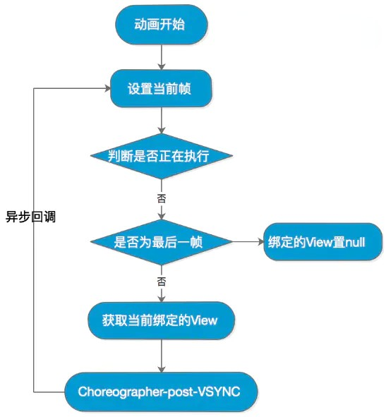
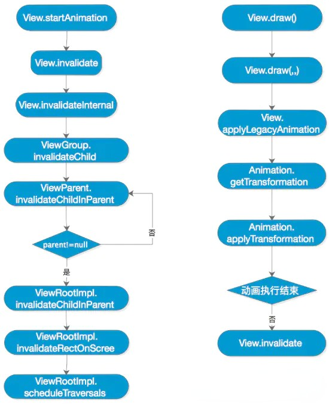

# Android 动画原理

## 1. 逐帧动画 (Frame Animation)

```java
AnimationDrawable animationDrawable = (AnimationDrawable) image.getDrawable();
animationDrawable.start();
```

### 1.1. 原理



## 2. View动画

```kotlin
val anim = TranslateAnimation(0f, 200f, 0f, 0f)
anim.duration = 1000
anim.fillAfter = true    // 设置保留动画后的状态
imageView.startAnimation(anim)
```

### 2.1 原理



## 3. 属性动画

```kotlin
ObjectAnimator.ofFloat(imageView, "translationX", 0f, 200f)
            .setDuration(1000)
            .start()
```

### 3.1 原理


## 4. 相关细节问题

* 属性动画可能会导致内存泄漏

  ValueAnimator.AnimationHandler.doAnimationFrame 每次执行完动画（如果动画没有结束），都在再一次请求Vsync同步信号回调给自己。Choreographer 的回调都post进入了当前线程的looper队列中。mRepeatCount 无穷大，会导致该循环会一直执行下去，即使关闭当前的页面也不会停止。导致由于持有Activity引用而导致泄漏

* 帧动画可能会导致OOM

* 使用了 `TranslateAnimation` 对控件做了移动操作，然后发现在 View 的新位置点击并没有响应自己的点击事件，反倒是之前的位置能够响应

  补间动画仅仅是对 View 在视觉效果上做了移动、缩放、旋转和淡入淡出的效果，其实并没有真正改变 View 的属性

* 为什么属性动画移动一个 View 后，目标位置还可以响应触摸事件呢？

  “既然 `View` 的属性得到了改变，那么经过属性动画后的控件应该所有属性都等同于直接设置在动画后的位置的控件。”这个说法是错误的。

  虽然 `View` 做了属性上的改变，但其实并没有更改 `View` 的 `left`、`right`、`top`、`bottom` 这些属性，而这些属性恰恰决定了 `ViewGroup` 的触摸区域判断。

  虽然 `View` 做了属性上的改变，但其实并没有更改 `View` 的 `left`、`right`、`top`、`bottom` 这些属性，而这些属性恰恰决定了 `ViewGroup` 的触摸区域判断。

  ```kotlin
  tv1.animate().setDuration(1000).translationX(500f)
  ```

  那么，假定我们的 `View` 经过了上面的平移操作后，为什么点击新的位置能够响应到这个点击事件呢？

  我们知道，在 `ViewGroup` 没有重写 `onInterceptTouchEvent()` 方法进行事件拦截的时候，我们一定会通过其 `dispatchTouchEvent()` 方法进行事件分发，而决定我们哪一个子 `View` 响应我们的触摸事件的条件又是 **我们手指的位置必须在这个子 `View` 的边界范围内，也就是 `left`、`right`、`top`、`bottom` 这四个属性形成的矩形区域。**

  那么，如果我们的 `View` 已经进行了属性动画后，现在手指响应的触摸位置区域肯定不是 `View` 自己的`left`、`right`、`top`、`bottom` 这四个属性形成的区域了，但这个 `View` 却神奇的响应了我们的点击事件。

  

  ```java
  /**
   * Returns a MotionEvent that's been transformed into the child's local coordinates.
   *
   * It's the responsibility of the caller to recycle it once they're finished with it.
   * @param event The event to transform.
   * @param child The view whose coordinate space is to be used.
   * @return A copy of the the given MotionEvent, transformed into the given View's coordinate
   *         space.
   */
  private MotionEvent getTransformedMotionEvent(MotionEvent event, View child) {
      final float offsetX = mScrollX - child.mLeft;
      final float offsetY = mScrollY - child.mTop;
      final MotionEvent transformedEvent = MotionEvent.obtain(event);
      transformedEvent.offsetLocation(offsetX, offsetY);
      if (!child.hasIdentityMatrix()) {
          transformedEvent.transform(child.getInverseMatrix());
      }
      return transformedEvent;
  }
  
  /**
   * Returns true if the transform matrix is the identity matrix.
   * Recomputes the matrix if necessary.
   *
   * @return True if the transform matrix is the identity matrix, false otherwise.
   */
  final boolean hasIdentityMatrix() {
      return mRenderNode.hasIdentityMatrix();
  }
  
  /**
   * Utility method to retrieve the inverse of the current mMatrix property.
   * We cache the matrix to avoid recalculating it when transform properties
   * have not changed.
   *
   * @return The inverse of the current matrix of this view.
   * @hide
   */
  public final Matrix getInverseMatrix() {
      ensureTransformationInfo();
      if (mTransformationInfo.mInverseMatrix == null) {
          mTransformationInfo.mInverseMatrix = new Matrix();
      }
      final Matrix matrix = mTransformationInfo.mInverseMatrix;
      mRenderNode.getInverseMatrix(matrix);
      return matrix;
  }   
  ```

  **原来，`ViewGroup` 在 `getTransformedMotionEvent()` 方法中会通过子 `View` 的 `hasIdentityMatrix()` 方法来判断子 `View` 是否应用过位移、缩放、旋转之类的属性动画。如果应用过的话，那还会调用子 `View` 的 `getInverseMatrix()` 做「反平移」操作，然后再去判断处理后的触摸点是否在子 `View` 的边界范围内。**

* 补间动画和属性动画改变的是同一个 Matrix 么

  **肯定不是。**

  属性动画所影响的 `Matrix`，是在 `View` 的 `mRenderNode` 中的 `stagingProperties` 里面的，这个 `Matrix` 在每个 `View` 之间都是独立的，所以可以各自保存不同的变换状态。

  而补间动画所操作的 `Matrix`，其实是借用了它父容器的一个叫 `mChildTransformation` 的属性 ( 里面有 `Matrix` )，通过 `getChildTransformation` 获得。
   也就是说，一个 `ViewGroup` 中，无论它有几个子 `View` 都好，在这些子 `View` 播放补间动画的时候，都是共用同一个 `Transformation` 对象的(也就是共用一个 `Matrix` )，这个对象放在 `ViewGroup` 里面。

## 参考

https://www.jianshu.com/p/5d0899dca46e

https://www.jianshu.com/p/038472aff2d2

