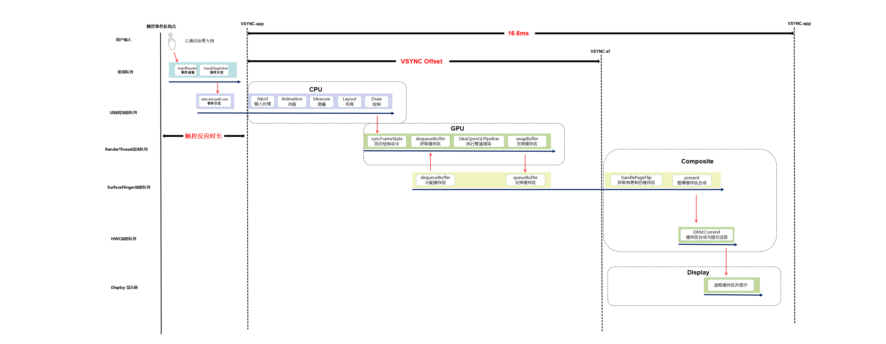
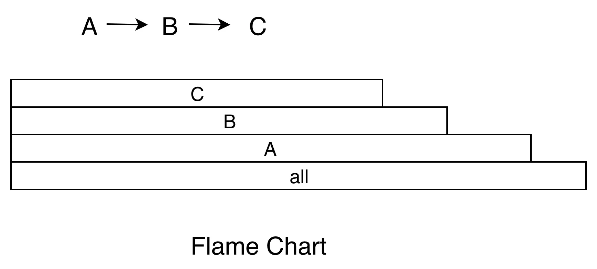

# Android 卡顿优化总结

## 1. 卡顿定义

**稳定帧率输出的画面出现一帧或者多帧没有绘制 。**

比如下图中，App 主线程有在正常绘制的时候（通常是做动画或者列表滑动），有一帧没有绘制，那么我们认为这一帧有可能会导致卡顿（这里说的是有可能，由于 Triple Buffer 的存在，这里也有可能不掉帧）


### 1. 1 系统上帧运行机制

以用户手指上下滑动应用界面的操作场景为例，**整个流程大致如下**：

1. 用户手指触摸屏幕后，屏幕驱动产生`Input`触控事件；框架`system_server`进程中的`EventHub`通过`epoll`机制监听到驱动产生的`Input`触控事件上报，由`InputReader`读取到`Input`事件后，唤醒`InputDispatcher`找到当前触控焦点应用窗口，并通过事先建立的`socket`通道发送`Input`事件到对应的应用进程；
2. 应用进程收到`Input`触控事件后`UI`线程被唤醒进行事件的分发，相关`View`控件中根据多个`ACTION_MOVE`类型的`Input`事件判断为用户手指滑动行为后，通过`Choreographer`向系统注册申请`app`类型的`Vsync`信号，并等待`Vsync`信号到来后触发绘制操作；
3. `app`类型的`Vsync`信号到来后，唤醒应用`UI`线程并向其消息队列中放入一个待执行的绘制任务，在`UI`线程中先后遍历执行`View`控件树的测量、布局和绘制（硬件加速默认开启的状态下会遍历并记录每个`View`的`draw`操作生成对应的绘制命令树）操作；
4. `View`控件树的绘制任务执行完成后会唤醒应用的`RenderThread`渲染线程执行界面渲染任务；整个渲染任务中会先同步`UI`线程中构建好的绘制命令树，然后通过`dequeueBuffer`申请一张处于`free`状态的可用`Buffer`，然后调用`SkiaOpenGLPipeline`渲染管道中使用`GPU`进行渲染操作，渲染完成后`swapBuffer`触发`queueBuffer`动作进行上帧；
5. 应用渲染线程最后的`queueBuffer`上帧动作，会唤醒对端`SurfaceFlinger`进程中的`Binder`处理线程，其中将对应用`BufferQuque`中的`Buffer`标记为`Queued`状态，然后注册申请`sf`类型的`Vsync`信号；
6. 待`sf`类型的`Vsync`信号到来后会唤醒`SurfaceFlinger`的主线程执行一帧的合成任务，其中会先通过`handlePageFlip`操作遍历所有的应用`Layer`找到有上帧操作的处于`Queued`状态的`Buffer`进行`AcquireBuffer`获取标记锁定，然后执行`persent`动作调用唤醒`HWC service`进程的工作线程执行具体的图层的合成送显操作；
7. `HWC service`中最终会收到`SurfaceFlinger`的请求后，进行图层合成操作，最终通过调用`libDrm`库相关接口`Commit`提交`Buffer`数据到Kernel内核中的屏幕驱动，并最终送到屏幕硬件上显示。

**上述过程用一张图描述如下：**




我们可以从三个方面定义卡顿：

1. 从现象上来说，在 `App` 连续的动画播放或者手指滑动列表时（关键是连续），如果连续 `2` 帧或者 `2` 帧以上，应用的画面都没有变化，那么我们认为这里发生了卡顿；
2. 从 `SurfaceFlinger` 的角度来说，在 `App` 连续的动画播放或者手指滑动列表时（关键是连续），如果有一个 `Vsync` 到来的时候 ，`App` 没有可以用来合成的 `Buffer`，那么这个 `Vsync` 周期 `SurfaceFlinger` 就不会走合成的逻辑（或者是去合成其他的 `Layer`），那么这一帧就会显示 `App` 的上一帧的画面，我们认为这里发生了卡顿；
3. 从 `App` 的角度来看，如果渲染线程在一个 `Vsync` 周期内没有 `queueBuffer` 到 `SurfaceFlinger` 中 `App` 对应的 `BufferQueue` 中，那么我们认为这里发生了卡顿。

!!! tips ""

​	关于卡顿的详细原理分析可以查看[原理篇](https://blog.adison.top/android/perf/jank/jank-principle/)	


## 2. 卡顿分析

造成卡顿的原因可能有千百种，不过最终都会反映到 **CPU 时间**上。我们可以把 CPU 时间分为两种：用户时间和系统时间。用户时间就是执行用户态应用程序代码所消耗的时间；系统时间就是执行内核态系统调用所消耗的时间，包括 I/O、锁、中断以及其他系统调用的时间。

评价一个 CPU 的性能，需要看`主频`、`核心数`、`缓存`等参数，具体表现出来的是计算能力和指令执行能力，也就是每秒执行的浮点计算数和每秒执行的指令数。

我们可以通过下面的方法获得设备的 CPU 信息。

``` shell

// 获取 CPU 核心数
cat /sys/devices/system/cpu/possible  

// 获取某个 CPU 的频率
cat /sys/devices/system/cpu/cpu0/cpufreq/cpuinfo_max_freq
```

### 2.1 CPU使用率

我们可以通过`/proc/sta`t得到整个系统的 CPU 使用情况，通过`/proc/[pid]/stat`可以得到某个进程的 CPU 使用情况。

关于 stat 文件各个属性的含义和 CPU 使用率的计算，可以阅读	[《Linux 环境下进程的 CPU 占用率》]()和[Linux 文档](https://man7.org/linux/man-pages/man5/proc.5.html)。其中比较重要的字段有：

```shell
proc/self/stat:
  utime:       用户时间，反应用户代码执行的耗时  
  stime:       系统时间，反应系统调用执行的耗时
  majorFaults：需要硬盘拷贝的缺页次数
  minorFaults：无需硬盘拷贝的缺页次数
```

!!! warning ""
	**如果 CPU 使用率长期大于 60% ，表示系统处于繁忙状态，就需要进一步分析用户时间和系统时间的比例。对于普通应用程序，系统时间不会长期高于 30%，如果超过这个值，我们就应该进一步检查是 I/O 过多，还是其他的系统调用问题。**
	
Android 是站在 Linux 巨人的肩膀上，虽然做了不少修改也砍掉了一些工具，但还是保留了很多有用的工具可以协助我们更容易地排查问题，这里我给你介绍几个常用的命令。例如，[**`top 命令`**](https://blog.adison.top/android/perf/top/)可以帮助我们查看哪个进程是 CPU 的消耗大户；**`vmstat 命令`**可以实时动态监视操作系统的虚拟内存和 CPU 活动；**`strace 命令`**可以跟踪某个进程中所有的系统调用。


### 2.2 CPU 饱和度

CPU 饱和度反映的是线程排队等待 CPU 的情况，也就是 CPU 的 **负载情况**。

CPU 饱和度首先会跟应用的 **线程数**有关，如果启动的线程过多，容易导致系统不断地切换执行的线程，把大量的时间浪费在上下文切换，我们知道每一次 CPU 上下文切换都需要刷新寄存器和计数器，至少需要几十纳秒的时间。

我们可以通过使用`vmstat命令`或者`/proc/[pid]/schedstat文件`来查看 CPU 上下文切换次数，这里特别需要注意 **`nr_involuntary_switches`**被动切换的次数。

``` shell

proc/self/sched:
  nr_voluntary_switches：     
  主动上下文切换次数，因为线程无法获取所需资源导致上下文切换，最普遍的是IO。    
  nr_involuntary_switches：   
  被动上下文切换次数，线程被系统强制调度导致上下文切换，例如大量线程在抢占CPU。
  se.statistics.iowait_count：IO 等待的次数
  se.statistics.iowait_sum：  IO 等待的时间
```


此外也可以通过 `uptime` 命令可以检查 CPU 在 1 分钟、5 分钟和 15 分钟内的平均负载。比如一个 4 核的 CPU，如果当前平均负载是 8，这意味着每个 CPU 上有一个线程在运行，还有一个线程在等待。一般平均负载建议控制在 **0.7 × 核数** 以内。

```she

00:02:39 up 7 days, 46 min,  0 users,  
load average: 13.91, 14.70, 14.32
```

另外一个会影响 CPU 饱和度的是**线程优先级**，线程优先级会影响 Android 系统的调度策略，它主要由 `nice` 和 `cgroup` 类型共同决定。nice 值越低，抢占 CPU 时间片的能力越强。

!!! warning ""
	**当 CPU 空闲时，线程的优先级对执行效率的影响并不会特别明显，但在 CPU 繁忙的时候，线程调度会对执行效率有非常大的影响。**


!!! tips ""
	关于线程优先级，你需要注意 **是否存在高优先级的线程空等低优先级线程，例如主线程等待某个后台线程的锁**。从应用程序的角度来看，无论是用户时间、系统时间，还是等待 CPU 的调度，都是程序运行花费的时间。


### 2.3 排查工具

#### [systrace](http://source.android.com/devices/tech/debug/systrace?hl=zh-cn)

`systrace`是 Android 4.1 新增的性能分析工具。通常使用 `systrace` 跟踪系统的 **I/O 操作**、 **CPU 负载**、 **Surface 渲染**、 **GC 等事 件**。`systrace`利用了 Linux 的ftrace调试工具，相当于在系统各个关键位置都添加了一些性能探针，也就是在代码里加了一些性能监控的埋点。

Android 在 ftrace 的基础上封装了atrace，并增加了更多特有的探针，例如 `Graphics`、`Activity Manager`、`Dalvik VM`、`System Server`等。systrace 工具只能监控特定系统调用的耗时情况，所以它是属于 `sample`类型，而且性能开销非常低。

> 更多介绍见 [systrace 使用](https://blog.adison.top/android/perf/jank/jank-tool/)

#### [Perfetto](https://perfetto.dev/)

在Android 9.0（API级别28）或更高版本的设备上，可以使用 systrace 在设备上记录系统跟踪。Perfetto 工具是Android下一代全新的统一的 trace 收集和分析框架，可以抓取平台和app的 trace 信息，是用来取代 systrace 的，但 systrace 由于历史原因也还会一直存在，并且 Perfetto 抓取的 trace 文件也可以同样转换成 systrace 视图，如果习惯用 systrace 的，可以用 Perfetto UI 的 Open with legacy UI 转换成 systrace 视图来看

> 更多介绍 见 [Perfetto入门](https://www.jianshu.com/p/f4cf101cc64f)

#### [CPU profiler](https://developer.android.com/studio/profile/cpu-profiler?hl=zh-cn)

CPU profiler集成在Android studio 中，更方便开发者使用。可以在可视化界面选择不同配置来跟踪CPU，其中：

* **Sample Java Methods**  的功能类似于 [Traceview](https://developer.android.com/studio/profile/traceview?hl=zh-cn) 的 sample 类型。
* **Trace Java Methods** 的功能类似于  [Traceview](https://developer.android.com/studio/profile/traceview?hl=zh-cn) 的 instrument 类型。
* **Trace System Calls** 的功能类似于 systrace。
* **SampleNative (API Level 26+)** 的功能类似于 [Simpleperf](https://android.googlesource.com/platform/system/extras/+/master/simpleperf/doc/README.md)。


#### 2.4 分析结果展示方式

#### **Call Chart**

 Call Chart 是 Traceview 和 systrace 默认使用的展示方式。它按照应用程序的函数执行顺序来展示，适合用于分析整个流程的调用。举一个最简单的例子，A 函数调用 B 函数，B 函数调用 C 函数，循环三次，就得到了下面的 Call Chart。


!!!note ""
	Call Chart 就像给应用程序做一个心电图，我们可以看到在这一段时间内，各个线程的具体工作，比如是否存在线程间的锁、主线程是否存在长时间的 I/O 操作、是否存在空闲等。

#### **Flame Chart**

Flame Chart 也就是大名鼎鼎的火焰图。它跟 Call Chart 不同的是，Flame Chart 以一个全局的视野来看待一段时间的调用分布，它就像给应用程序拍 X 光片，可以很自然地把时间和空间两个维度上的信息融合在一张图上。上面函数调用的例子，换成火焰图的展示结果如下。

**当我们不想知道应用程序的整个调用流程，只想直观看出哪些代码路径花费的 CPU 时间较多时，火焰图就是一个非常好的选择**。

火焰图还可以使用在各种各样的维度，例如内存、I/O 的分析。**有些内存可能非常缓慢地泄漏，通过一个内存的火焰图，我们就知道哪些路径申请的内存最多**，有了火焰图我们根本不需要分析源代码，也不需要分析整个流程。

## 3. 优化思路

!!! note "锁等待"
	* 通过优化流程尽量的减少流程中不必要的持锁或减小持锁范围
	* 利用一些空间换时间的缓存方案或优化CPU、IO等资源的调度与分配，减少线程的持锁的时长

!!! note "应用UI线程耗时引起卡顿"
	应用`UI`线程耗时引起的卡顿往往涉及的因素比较多，下面列举一些常见原因：
	
	1. **`UI`线程消息队列中存在除`doFrame`绘制任务外的其它耗时任务**，导致`Vsync`信号到来后，无法及时触发`UI`线程执行`doFrame`绘制上帧任务，而导致掉帧。例如界面布局`XML`文件的`inflate`解析，如果界面布局文件比较复杂，就到有大量的`IO`与反射等耗时操作。又或者`UI`线程中有`decodeBitmap`解析大图片的耗时操作。
	2. **`UI`帧的`doFrame`绘制任务处理耗时过长导致掉帧**。最常见的问题就是应用界面布局存在过度绘制，导致`measure/layout/draw`任务的计算 复杂度成倍上升。再比如应用界面布局中的部分`View`控件层面如果关闭了硬件绘制加速，就会触发`View#buildDrawingCache`的耗时操作，从而导致整个`draw`动作耗时过长而引起掉帧。
	3. **`UI`线程存在大量的阻塞等待导致上帧超时**。`UI`线程陷入阻塞等待，常见的原因就是跨进程的`Binder`调用阻塞和进程内的同步锁竞争等待。还有一类情况就是频繁的`GC`内存回收引起(一般为进程内存抖动或内存泄露引起)。
	
	**优化思路**
	
	**针对应用`UI`线程耗时引起卡顿的问题，原则就是尽量减轻`UI`线程的负担**。针对不同的引起问题原因，常见的优化思路大致如下：
	
	1. **异步处理**：各种耗时操作尽量放到子线程异步处理。比如使用`View`的异步线程`inflate`方案；`decodeBitmap`加载图片的耗时操作移到子线程统一处理等。
	2. **逻辑优化**：必须要在主线程执行的逻辑应尽量优化，减少计算频次，避免重复计算。比如采用约束布局解决嵌套过多的问题，避免过度绘制；优化应用的内存占用，避免内存泄露、内存抖动等问题，从而减少`GC`触发的次数；优化内部代码逻辑，尽量减少主线程陷入同步锁竞争等待的状态；原则上不要主动去关闭硬件绘制加速。
	3. **流程复用**：能复用的逻辑尽量复用，以避免多次调用产生的性能开销。比如`ListView`的`Adapter`中实现`View`的复用，减少`View`的`inflate`执行次数。另外`UI`线程中`Binder`请求框架查询一些系统信息，能够一次查完就不要分多次执行。且查询结果应尽量缓存在内存中实现复用，避免多次反复的查询造成主线程频繁陷入`Binder`阻塞等待。

!!! note "磁盘I/O引起卡顿"
	**选择合适的文件读写操作**。对读写速度有较高的要求，并允许低概率的数据丢失问题，就采用系统默认的基于`Page Cache`的缓存`I/O`；对文件读写的速度要求不高，但是需要严格的保证数据不会丢失就使用`Direct I/O`；如果需要对同一块区域进行频繁读写的情况，对读写性能要求极高，可以采用`mmap` 内存映射机制实现读写文件，比如腾讯开源的用于改善原生`SharePreferences`机制性能的存储工具`MMKV`就是这个原理实现的。
	
	**`I/O` 方式的选择**。一个是对于阻塞`I/O`操作尽量放入子线程执行，以免阻塞`UI`线程；二是适当采用异步`I/O`减少读取文件的耗时，提升`CPU`整体利用率，比如`Okio`就支持异步`I/O`操作。
	
	优化数据结构，建立内存缓存，尽量减少不必要的`I/O`；

## 3. 卡顿监控

#### 3.1 **消息队列+插桩**

这里使用微信[Matrix](https://cloud.tencent.com/developer/article/1382771)方案

> Todo: 详细展开


