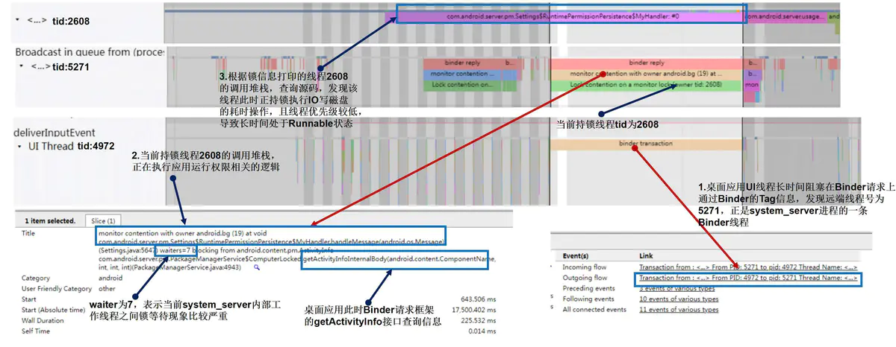
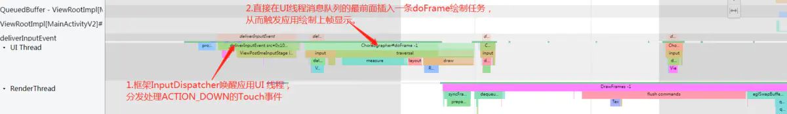
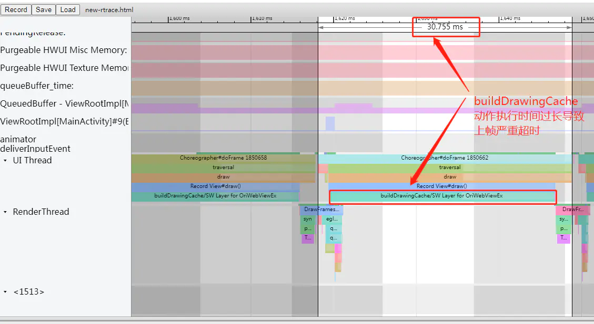
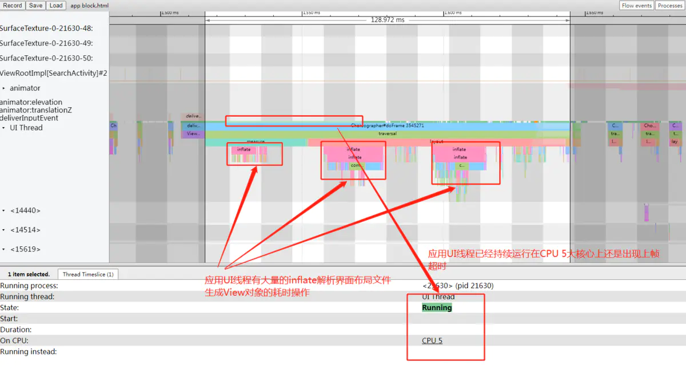
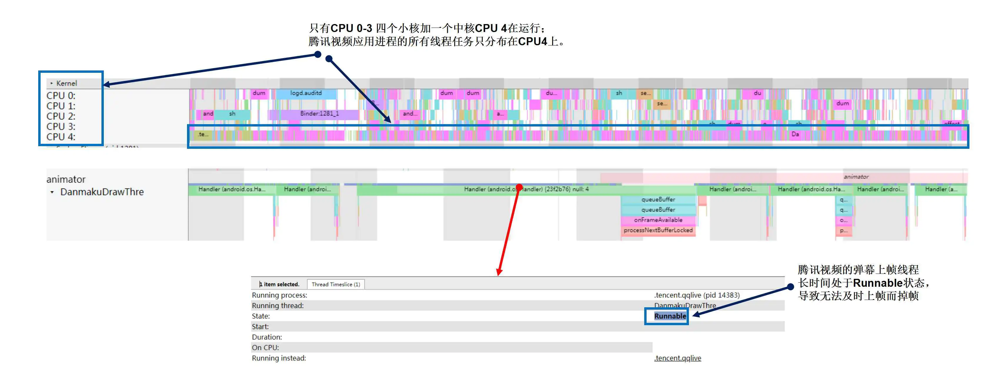
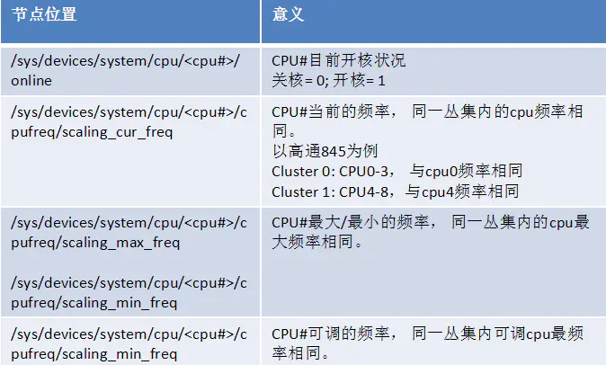
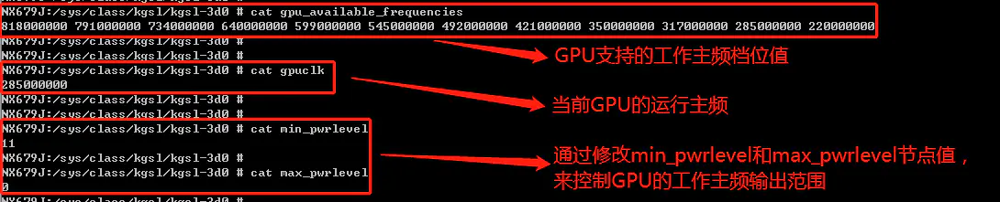
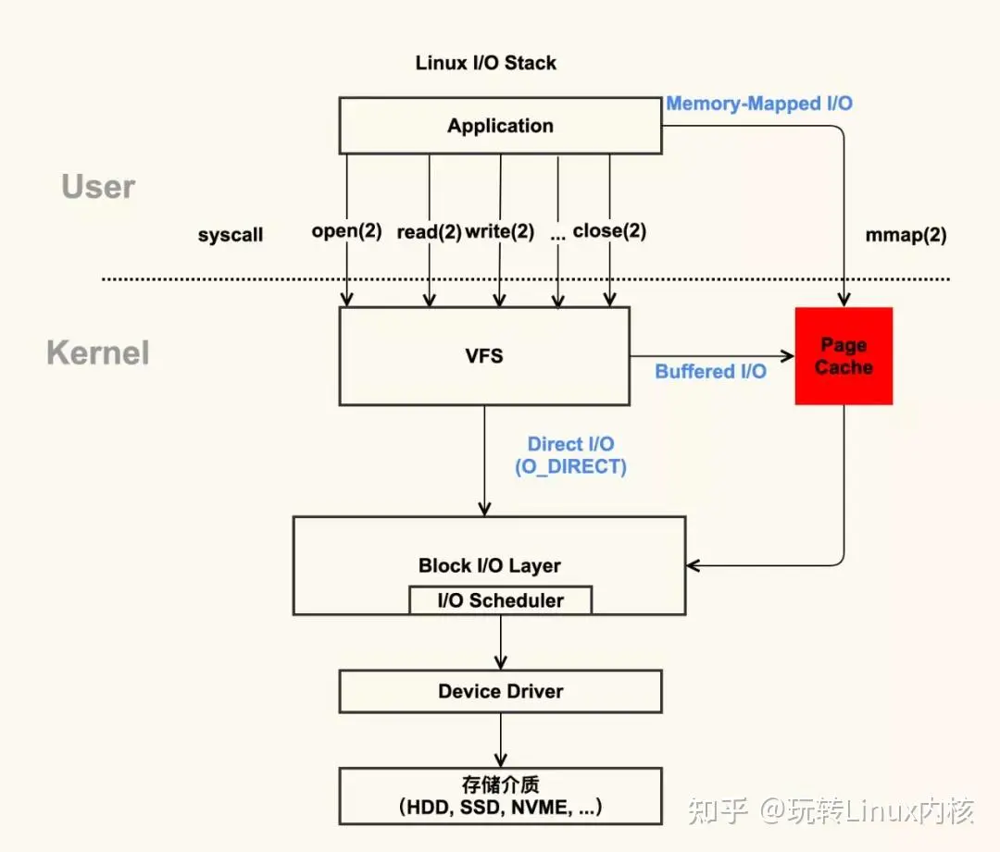
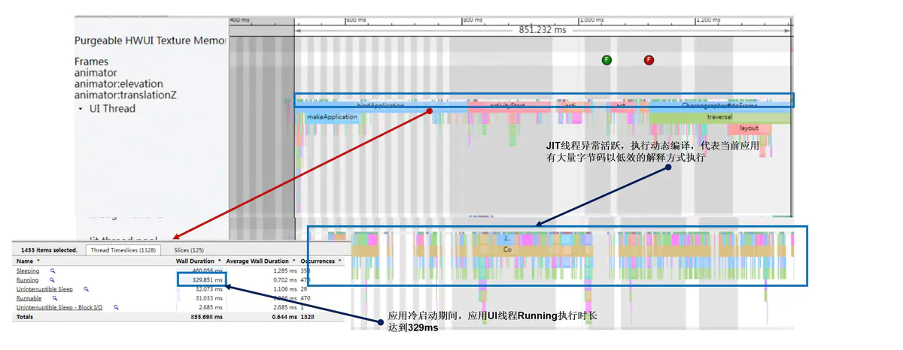

> 摘自 https://www.jianshu.com/p/f1a777551b70

# Android卡顿掉帧问题分析之实战篇

本文是`Android`卡顿问题分析三部曲的最后一篇。在前面两篇文章的理论和工具的分析基础上，本文将结合典型实战案例，分析常见的造成卡顿等性能问题的原因。从系统工程师的总体角度来看 ，造成卡顿等性能问题的原因总体上大致分为三个大类：一类是流程执行异常；二是系统负载异常；三是编译问题引起。

## 1 流程执行异常

在前文`Android`卡顿掉帧问题分析之原理篇的内容中，我们以滑动场景为例完整的分析了`Android`应用上帧显示的全流程（默认开启硬件绘制加速条件下）。下面我们用一张图来看看这个流程上可能引起卡顿、反应延迟等性能问题的点。


从上图可以看出，在`Android`应用上帧显示的各个流程上都可能出现问题导致出现卡顿、反应延迟等性能问题。下面我们分类来分析一下各个流程上可能的引起卡顿等性能问题的点。


### 1.1 system_server引起应用卡顿

**一、理论分析**

框架`system_server`进程内部的各个核心服务`AMS`、`WMS`、`PKMS`等，都有各自的对象锁和工作线程，各个服务运行时相互之间存在交互，可能出现某个线程持锁执行耗时操作而其它线程陷入长时间锁等待的情况。某些情况下当系统框架负载过重或流程出现异常情况下，其工作线程之间相互等锁的现象会非常严重。如果此时应用`App`的`UI`线程中有`Binder`请求，而系统框架内部处理请求的实现又恰好需要持锁，就可能间接导致应用`App`的`UI`线程阻塞在`Binder`请求，而引起`App`应用的卡顿问题。
**二、典型案例分析**

**问题描述**：设备刚开机时，桌面左右滑动出现卡顿。

**问题分析**：结合`Systrace`工具分析问题原因如下：




从以上问题`Systrace`的分析可以看出，出现桌面滑动卡顿的原因是：


1. 桌面应用的`UI`线程（`tid:4927`）中通过`Binder`请求访问框架`PKMS`服务的`getActivityInfo`接口查询`Activity`的相关信息时出现长时间阻塞；
2. 而框架`PKMS`服务中处理此`Binder`请求的线程（`tid:5271`）逻辑需要持锁执行，而当前此锁对象的“锁池”中至少已经有`7`个线程都已经在等待这把锁，所以此线程进入锁对象的“锁池”中阻塞等待锁释；
3. 而此时持有该锁的线程为框架的`android.bg`工作线程（`tid:2608`），此线程中正持锁执行`IO`写磁盘等耗时操作，且线程的优先级较低，在刚开机阶段系统整体负载比较重的场景下，抢不到`CPU`执行时间片而长时间处于`Runnable`状态，导致运行时间较长。

**三、优化思路**

针对此类`system_server`内部的各种锁等待或流程异常导致的性能问题。`Google`在历年的`Android`版本上也在不断针对优化，**通过优化流程尽量的减少流程中不必要的持锁或减小持锁范围**。例如在`Android P`上推出的`LockFreeAnimation`无锁窗口动画，就实现了无需持有`WMS`锁播放窗口动画，从而极大减少窗口动画卡顿的概率；`Android 12`上在 `PackageManager` 中，引入只读快照减少了 `92%` 的锁争用。另外各大手机厂商也会在自家的`ROM`系统上针对这种情况对框架作出持续的优化，**通过分析持锁等待的关系，找到问题源头的当前持锁线程，利用一些空间换时间的缓存方案或优化`CPU`、`IO`等资源的调度与分配，减少线程的持锁的时长，从而改善其它线程锁等待的时长**。

### 1.2 Input事件处理引起卡顿

**一、理论分析**

从前面`Android`卡顿掉帧问题分析之原理篇文章中的分析我们知道，屏幕驱动上报的`Input`事件要经过框架的`InputReader`和`InputDispatcher`线程的读取与分发，然后通过`Socket`发送到应用进程中，再经过界面`View`控件树的层层分发后消费处理。这个过程中任意一个流程出现阻塞就能造成用户的触控操作得不到及时的响应，出现用户感知的系统反应延迟或卡顿现象。

**二、典型案例分析**

**问题描述**：微博应用界面手势滑动退出时，界面卡住几秒钟才有反应。

**问题分析**：结合`Systrace`工具分析问题原因如下：


从以上问题`Systrace`的分析可以看出，退出应用界面时出现卡住几秒的原因：


1. 首先看`Systrace`上`system_server`进程中标识`Input`事件分发的`"iq"`和`“oq`”队列的信息，可以看到框架`InputDispatcher`对事件的分发处理没有出现阻塞或漏报等异常情况；
2. 从微博应用对应的`“wq”`队列可以看到，应用进程一直有没有完成处理消费的`Input`事件，说明问题在微博应用进程侧；
3. 看`Systrace`上微博应用侧的信息，可以看到应用`UI`线程很长一段的`deliverInputEvent`的`tag`（大概持续`2.5`秒左右），且`“aq：ime”`队列中显示有持续很长一段时间的事件处理逻辑。说明应该是在应用进程`UI`线程中判断`Input`事件类型为返回键的`Key`事件，所以先交给输入法应用进行处理，但是输入法进程一直没有完成处理，导致应用`UI`线程一直处于等待状态无法及时处理此`Input`事件，说明问题出现在输入法应用侧；
4. 然后我们用`ps`命令查看当前输入法进程信息，发现输入法进程（`pid：5897`）当前的状态为`“D”`，说明处于进程“冻结”的休眠状态，结合`Systrace`上显示的输入法进程的主线程信息显示，发现其确实是一直处于`Sleeping`状态。**所以此问题出现的原因就是因为输入法进程被异常“冻结”导致的**。和负责维护进程“冻结”功能的同事沟通并分析日志后发现，问题的原因是用户安装并设置了新的输入法应用，进程“冻结”模块没有成功识别，将其认定为普通后台进程所以进行了“冻结”从而导致了异常。

到此还剩一个疑问就是为什么输入法进程都被“冻结”而休眠了，应用`UI`线程在等待`2.5`秒后还是能继续往下处理`Input`事件，并成功退出应用`Activity`界面呢？原因就是应用`UI`线程进入等待输入法处理`Input`事件时会设置一个超时，这个时长就是`2.5`秒，如果超时后输入法进程还是没有处理完，就会强行结束等待的逻辑，由应用`UI`线程继续往下处理`Input`事件。相关源码如下所示：


```csharp
/*frameworks/base/core/java/android/view/inputmethod/InputMethodManager.java*/
...
/**
* Timeout in milliseconds for delivering a key to an IME.
*/
static final long INPUT_METHOD_NOT_RESPONDING_TIMEOUT = 2500;
...
// Must be called on the main looper
int sendInputEventOnMainLooperLocked(PendingEvent p) {
        if (mCurChannel != null) {
           ...
            if (mCurSender.sendInputEvent(seq, event)) {
                ...
                Message msg = mH.obtainMessage(MSG_TIMEOUT_INPUT_EVENT, seq, 0, p);
                msg.setAsynchronous(true);
                mH.sendMessageDelayed(msg, INPUT_METHOD_NOT_RESPONDING_TIMEOUT);//1.处理Input事件时设置一个2500ms的超时检查
                return DISPATCH_IN_PROGRESS;
            }
            ...
        }
      return DISPATCH_NOT_HANDLED;
}
...
case MSG_TIMEOUT_INPUT_EVENT: {
     finishedInputEvent(msg.arg1, false, true);// 2.时间到之后如果输入法还是没有完成Input事件处理，则强行结束输入法对事件的处理逻辑
     return;
}
...
```

**三、优化思路**

对用户触控事件的响应速度直接关系到用户对交互设备性能体验的感知，所以一直以来都是系统性能优化工作的重中之重。多年来谷歌，包括`SOC`厂商都有针对系统`Input`事件的处理流程作出优化，以提升触控响应速度。例如高通基线上在`2018`年左右就有一笔提交，优化应用进程侧的`Input`事件处理流程，大概思路就是识别应用`UI`线程中收到第一个`ACTION_DOWN`的`Touch`事件后，调用`sendMessageAtFrontOfQueue`接口在应用`UI`线程的消息队列的最前面插入一帧`doFrame`绘制任务，这样界面不用等待下一个`Vsync`的信号的到来就能直接上帧显示，从而减少整个`Input`触控事件的响应延迟。从`Systrace`上表现如下图所示：




国内各大手机厂商也有各自的优化方案。比如硬件上采用触控采样率更高的屏幕，屏幕触控采样率达到`240HZ`甚至`480HZ`。再比如监控到触控事件后提升`CPU`主频，提升触控事件处理相关线程和渲染线程的优先级等方式，从而优化事件触控响应速度。而对于应用`APP`开发者来说，需要做的就是避免在`Input`触控事件的分发处理流程中执行耗时操作，以免引起触控延迟或卡顿等性能问题。


### 1.3 应用UI线程耗时引起卡顿

**一、理论分析**

这部分逻辑主要由应用`APP`开发者控制。根据前文Android卡顿掉帧问题分析之原理篇中的分析可知，`UI`线程耗时过长必然会导致`Vsync`周期内应用上帧出现超时。特别是屏幕高刷时代的到来，留给应用`UI`线程处理上帧任务的时长越来越短。例如`120HZ`的高刷屏幕配上，一个`Vsync`信号周期已经缩短到`8ms`左右。这要求应用`APP`开发者能写出更加高性能质量的代码。应用`UI`线程耗时引起的卡顿往往涉及的因素比较多，下面列举一些常见原因：

1. **`UI`线程消息队列中存在除`doFrame`绘制任务外的其它耗时任务**，导致`Vsync`信号到来后，无法及时触发`UI`线程执行`doFrame`绘制上帧任务，而导致掉帧。例如界面布局`XML`文件的`inflate`解析，如果界面布局文件比较复杂，就到有大量的`IO`与反射等耗时操作。又或者`UI`线程中有`decodeBitmap`解析大图片的耗时操作。
2. **`UI`帧的`doFrame`绘制任务处理耗时过长导致掉帧**。最常见的问题就是应用界面布局存在过度绘制，导致`measure/layout/draw`任务的计算复杂度成倍上升。再比如应用界面布局中的部分`View`控件层面如果关闭了硬件绘制加速，就会触发`View#buildDrawingCache`的耗时操作，从而导致整个`draw`动作耗时过长而引起掉帧。
3. **`UI`线程存在大量的阻塞等待导致上帧超时**。`UI`线程陷入阻塞等待，常见的原因就是跨进程的`Binder`调用阻塞和进程内的同步锁竞争等待。还有一类情况就是频繁的`GC`内存回收引起(一般为进程内存抖动或内存泄露引起)。

**二、典型案例分析**

**问题描述**：三方应用书旗小说界面上下滑动严重掉帧卡顿。

**问题分析**：结合`Systrace`工具分析问题原因如下：




从`Systrace`上可以看到，应用`UI`线程上帧的`doFrame`流程中主要耗时点在`buildDrawingCache`的流程上。下面我们结合源码来看看什么情况下`draw`流程中会出现`buildDrawingCache`的动作：


```cpp
/*frameworks/base/core/java/android/view/View.java*/
...
public RenderNode updateDisplayListIfDirty() {
   ...
   if (layerType == LAYER_TYPE_SOFTWARE) { //判断View的layerType为LAYER_TYPE_SOFTWARE，也就是关闭了硬件绘制加速，执行buildDrawingCache
       buildDrawingCache(true);
       ...
    }else{
       ...
       draw(canvas); //走硬件绘制加速的流程
       ...
    }
    ....
}
...
```

从代码可以看出当判断某个`View`空间的`layerType`为`LAYER_TYPE_SOFTWARE`，也就是关闭了硬件绘制加速的情况下，就会触发走到`buildDrawingCache`的耗时逻辑中。所以此问题就是由于书旗小说应用的界面布局中一个名为`OriWebViewEx` 的`View`控件关闭了硬件绘制加速导致。

**问题描述**：`Twitter`应用界面上下滑动严重掉帧卡顿。

**问题分析**：结合`Systrace`工具分析问题原因如下：




从`Systrace`上可以看到，三方应用`Twitter`出现掉帧的主要原因是：其`UI`线程中存在大量耗时的`inflate`解析`xml`布局文件的操作，且出现问题时`UI`线程已经持续`Running`到`CPU 5`大核心上但是还是出现严重的上帧超时。


**三、优化思路**

**针对应用`UI`线程耗时引起卡顿的问题，原则就是尽量减轻`UI`线程的负担**。针对不同的引起问题原因，常见的优化思路大致如下：

1. **异步处理**：各种耗时操作尽量放到子线程异步处理。比如使用`View`的异步线程`inflate`方案；`decodeBitmap`加载图片的耗时操作移到子线程统一处理等。
2. **逻辑优化**：必须要在主线程执行的逻辑应尽量优化，减少计算频次，避免重复计算。比如采用约束布局解决嵌套过多的问题，避免过度绘制；优化应用的内存占用，避免内存泄露、内存抖动等问题，从而减少`GC`触发的次数；优化内部代码逻辑，尽量减少主线程陷入同步锁竞争等待的状态；原则上不要主动去关闭硬件绘制加速。
3. **流程复用**：能复用的逻辑尽量复用，以避免多次调用产生的性能开销。比如`ListView`的`Adapter`中实现`View`的复用，减少`View`的`inflate`执行次数。另外`UI`线程中`Binder`请求框架查询一些系统信息，能够一次查完就不要分多次执行。且查询结果应尽量缓存在内存中实现复用，避免多次反复的查询造成主线程频繁陷入`Binder`阻塞等待。

### 1.4 SurfaceFlinger耗时引起卡顿

**一、理论分析**

从前文的分析可以知道，`SurfaceFlinger`在`Android`系统的整个图形显示系统中是起到一个承上、启下的作用，负责收集不同应用进程`Surface`的绘制缓存数据进行的合成，然后发送到显示设备。所以，如果`SurfaceFlinger`的处理流程上出现耗时或阻塞，必然会导致整个应用的上帧显示的流程出现超时而掉帧。特别是随着屏幕高刷时代的到来，`Vsync`周期不断缩短，留给`SurfaceFlinger`处理的时间也越来越短，对`SurfaceFlinger`的性能提出了更高的要求。这也是谷歌、`SOC`厂商包括各大手机厂商做系统性能优化的重点。

**二、典型案例分析**

**问题描述**：设置`120HZ`高刷模式下，手机录屏、投屏场景下出现帧率下降。

**问题分析**：结合`Systrace`工具分析问题原因如下：


从`Systrace`上可以看到，开启录屏或投屏后，部分`Layer`需要采用效率更低的`GPU`合成方式（主要是因为高通平台`HWC`不支持回写），`SurfaceFlinger`的主线程中需要实现`drawLayers`的动作，还需要将图层数据写入到`MediaCodec`缓存中，总体负载较高，导致在`8ms`（`120HZ`高刷模式下）内无法完成一帧数据的处理而出现帧率下降的问题。


**三、优化思路**

针对`SurfaceFlinger`引起的性能卡顿问题，常见的优化思路有：

1. 谷歌通过`cpuset`的配置，默认场景下`SurfaceFlinger`只能使用`4`个`CPU`小核心运行；部分厂商会在投屏或录屏等负载比较重的场景下放开这个限制，让`SurfaceFlinger`进程能跑到`CPU`大核心上。
2. 部分厂商在开启录屏的情况下，会锁定屏幕刷新率最高不超过`60HZ`，以减轻`SurfaceFlinger`进程的压力。
3. `Android 12`上，谷歌就将各个应用对应的`BufferQueue`的管理工作移动到应用进程侧处理，以减轻`SurfaceFlinger`进程的负载。

## 2 系统负载异常

`CPU`、`GPU`、内存、磁盘等都是系统内各个进程任务的运行所必需的**公共系统资源**。这就涉及到一个复杂的资源调度与分配的问题，实现将系统资源与各个不同进程的需求进行合理的匹配，以保证进程任务能够流畅的运行。这就涉及到两个问题：

1. **这些系统公共资源是否充足**。比如当进程需要时，当前`CPU`核心的运行主频算力是否足够高，系统剩余内存是否足够大，磁盘的读写速度是否足够快。
2. **这些系统资源的分配是否合理**。比如当前优先级更高的前台应用进程相对于后台进程是否能获得更多的`CPU`调度运行时间片和`I/O`带宽等资源，以保证界面的流畅运行。

从软件的角度出发，每个应用任务进程都希望自己获得无限的`CPU`算力、无限的内存资源分配等能力，以保证其能够流畅的运行。但是从硬件的角度出发，各种系统的公共资源配置都是有限的，不可能无限的提供给每个任务进程，且在移动设备上还要考量功耗与发热的问题，需要限制各种系统资源的供给。所以如何协调这种供需关系之间的矛盾，将宝贵的系统资源合理的分配给当前最需要的任务进程，以最小的资源开销保证系统的流畅运行，就是考验操作系统的设计者和性能优化工程师的功力的问题，弄不好就可能出现应用任务进程的运行受限于系统运行资源的分配而出现各种性能问题。

### 2.1 CPU调度引起卡顿

**一、理论分析**

`CPU`算力资源绝对是系统内最重要的公共资源之一，每个应用程序的正常运行都需要`CPU`的调度执行。目前的主流移动设备搭载的`CPU`基本上都是采用多核心架构设计，按照算力的大小设置有多颗`CPU`运算核心（以高通最新的骁龙`8 gen 1`处理器为例，其拥有`8`颗`CPU`运算核心，包含四个小核、三个中核和一个大核，算力依次递增，功耗也逐渐增大）。


且`Linux`操作系统内核中会有相应的`scheduler`和`governor`调度器，来管理每颗`CPU`核心上当前运行的任务的排程，以及每颗`CPU`核心当前运行的主频（每颗`CPU`核心都有一个运行主频参数可以支持在一定的范围内动态调节，主频越高算力越强，相应的功耗也就越大）、节能状态等参数，以达到最佳的性能与功耗的平衡。但是很多时候由于`CPU`运行核心上的任务排布不合理，或运行主频过低导致的算力过低，无法满足应用进程的需求，就可能导致应用出现卡顿掉帧等性能问题。常见的一些原因如下：


1. 后台应用进程任务持续运行抢占`CPU`运行资源，或者处于功耗管控直接关核，导致前台应用的`UI`线程任务无法及时的获得`CPU`运行算力执行，长时间处于`Runnable`状态，而出现上帧超时掉帧问题；
2. 某些时候出于功耗与发热的考量，将`CPU`的运行主频压的过低，导致算力不足。应用的上帧线程上的任务需要`Running`很长一段时间，而出现上帧超时掉帧。

**二、典型案例分析**

**问题描述**：腾讯视频应用中观看视频时，播放弹幕卡顿。

**问题分析**：结合`Systrace`工具分析问题原因如下：




从`Systrace`上可以看到：腾讯视频播放视频时出现掉帧卡顿的原因，是因为其负责弹幕上帧的线程无法获得`CPU`运行资源，而长时间处于`Runnable`状态，导致上帧出现严重超时。
**进一步分析原因发现存在两个问题**：一个就是看`CPU Trace`信息发现此时只有`CPU 0-3`四个小核心和一个`CPU 4`一个中核心在运行，而算力更强的`CPU 5-7`都处于关闭状态，导致系统总体算力受限；另一个问题就是前台应用腾讯视频进程内的所有线程运行任务都只分配到`CPU 4`上运行，其它几个小核心处于空闲状态也没有使用，导致腾讯视频应用的运行严重受限。
**最终经过分析找到问题的根本原因就是**：一、关闭算力更强的`CPU 5-7`的原因，是系统组为了降低用户全屏看视频场景下的功耗而故意为之；二、腾讯视频只能运行在`CPU 4`上的原因，是因为该项目使用的是高通最新的`SM8450`平台，该平台采用`ARM V9`架构设计，`32`位的应用只能使用`CPU4-6`三个中核运行，而应用商店提供的腾讯视频刚好就是`32`位的版本。
**至此问题水落石出，后面解决问题思路就是**：一方面推动应用商店上架腾讯视频`64`位版本；二是系统组那边需要针对`32`位的应用前台全屏看视频的场景下的`CPU`配置做出调整，不再全部关闭`CPU 5-7`三个算力较强的核心。


**问题描述**：桌面界面左右滑动出现卡顿掉帧。

**问题分析**：结合`Systrace`工具分析问题原因如下：


从`Systrace`上可以看到：前台应用桌面出现掉帧的原因是其`UI`线程抢不到`CPU`运算资源而长时间处于`Runnable`状态。而此时，`CPU`上分布有大量后台应用的任务持续运行。出现这个问题的原因是国内部分应用存在很多进程保活机制，会在后台持续运行，并想方设法提升其进程的优先级。所以在系统关闭了相关针对性的管控后就会出现问题。


**三、优化思路**

针对`CPU`调度问题引起的性能卡顿问题，常见的优化思路有：

1. **基于`cgroup`的进程资源隔离**。`Android`系统上继承了`linux`的`cgroup`机制，以控制进程的资源占用，让重要的进程获得更多的系统资源。涉及的系统资源如下图所示：

**其中`cpuset`（可以实现限制进程只能运行在指定的`CPU`核心上）、`cpuctl`（可以实现控制前后台进程的`CPU`用量）和`freezer`（可以实现控制进程处于冻结休眠状态，完全放弃`CPU`执行权）就是对进程`CPU`资源的控制**。后面的`top-app`标识当前进程所属的资源分组。`cgroup`机制中会将不同的运行进程分成不同的资源组，比如前台应用属于`top-app`组，后台应用属于`background`组。不同的组可以支持配置不同的资源使用权限（比如通过`cpuset`的配置，`background`组中的进程被限制只能运行在`cpu 0-3`三个小核心上，而处于`top-app`组中的进程可以使用所有的`cpu`核心资源）。以`cpuset`为例，如下图所示：


通过这种限制后台不重要的进程的`CPU`资源占用，从而让前台重要的应用进程获得更多的`CPU`资源（至于进程的前后台优先级定义，主要是由框架`AMS`服务来管理维护，通过写进程的`oom_score_adj`值来标识）。国内各大手机厂商的系统性能优化的策略中，有很大一部分工作都是依赖于`cgroup`机制来实现的，**通过对系统资源精细的定义划分，和应用进程优先级与功能场景的精准识别，来实现对资源的合理分配，达到性能与功耗的最佳平衡。**
2. **基于场景识别的`CPU`调度策略配置**。主要工作包括：
	- 对`CPU`基础配置影响各核的性能输出：包括`CPU Frequency`运行主频调节、排程器大核小核工作分配策略`upmigrate/downmigrate/sched_boost`的调节（根据`CPU`各核心的任务负载，对线程任务进行大小核分布的迁移调整），以上都是通过`Soc`厂商提供的`Perf`服务接口设置参数，去写相关的设备节点实现，以高通平台为例相关节点如下图所示：
  
   **还有温控策略的配置调整**（出于功耗与发热的考量，移动设备上温控机制`thermal-engine`服务，会根据遍布设备内部的各个温度传感器读取的温度值，按照一定的温度阈值对`CPU`运行主频进行限制，以防止设备过热）；
	- 对场景的定义识别与策略配置：比如定义应用冷启动场景，在框架进行识别，并动态将`CPU`主频进行拉升一段时间，以提升应用打开速度；定义视频播放的场景，在框架进行识别，然后对`CPU`主频进行限频，在保证播放流畅的前提下，尽量降低功耗和发热；这块也属于国内各大手机厂商的系统性能优化的核心工作。**如何实现精确的场景定义与识别，精准控制`CPU`的性能输出，用最小的功耗，保证应用界面的流畅运行，就是对厂商功力的考验**。

3. **对三方应用后台相互唤醒和进程保活机制的限制，防止其在后台持续运行抢占CPU算力资源**。这块也是国内各大手机厂商系统优化的重点工作之一。

### 2.2 GPU调度引起卡顿

**一、理论分析**

`GPU`算力资源是继`CPU`算力外，系统内另一个重要的公共资源，从前文`Android`应用上帧显示的流程分析可知，应用对每一帧画面的渲染处理都离不开`GPU`算力的支撑。和`CPU`类似，设备的`GPU`也有自己的运行主频（运行主频越高，算力越强，同时发热也就越大），且支持在一定的范围内调节，以实现功耗和性能的最佳平衡。以高通`SM8450`平台所搭载的型号为`Adreno 730`的`GPU`为例，其参数信息如下图所示：




从上图可以看到，`GPU`支持在一定的范围内动态调节运行主频，`Soc`厂商和国内的手机厂商会根据任务负载和使用场景，动态调节`GPU`的工作频率以实现功耗与性能的最佳平衡。但是如果调节不合理，就可能引起性能问题，常见的一些原因如下：


1. 部分大型游戏应用（如原神）需要大量的`GPU`算力进行游戏画面的实时渲染处理，如果系统的`GPU`运行主频算力没有及时的跟上来，无法满足应用对`GPU`算力的需求就会导致游戏应用上帧时出现阻塞超时而掉帧；
2. 部分应用在后台利用`GPU`做一些图像处理的并行计算，抢占了系统的`GPU`算力资源；就可能导致前台应用绘制上帧时，由于`GPU`算力不足，使其渲染线程陷入长时间阻塞等待`GPU`渲染完成的`Fence`信号的状态，最终出现上帧超时卡顿的问题。

**二、典型案例分析**

**问题描述**：三方应用`UC`浏览器界面滑动卡顿。

**问题分析**：结合`Systrace`工具分析问题原因如下：


从上图的`Systrace`可以看出，`UC`浏览器出现上帧超时的主要原因是，其`RenderThread`渲染线程长时间阻塞在`queueBuffer`上帧的流程上，而`queueBuffer`阻塞在`SurfaceFlinger`进程那边的`Binder`响应，而`SurfaceFlinger`进程中又需要等待`GPU`那边完成画面渲染处理的`fence`信号的（从应用进程侧的`waiting for GPU completion`的`systrace tag`也能看出）。如下简化代码所示：


```cpp
/*frameworks/native/libs/gui/BufferQueueProducer.cpp*/
status_t BufferQueueProducer::queueBuffer(int slot,
        const QueueBufferInput &input, QueueBufferOutput *output) {
        ATRACE_CALL();
        ...
         // Wait without lock held
    if (connectedApi == NATIVE_WINDOW_API_EGL) {
        // Waiting here allows for two full buffers to be queued but not a
        // third. In the event that frames take varying time, this makes a
        // small trade-off in favor of latency rather than throughput.
        lastQueuedFence->waitForever("Throttling EGL Production"); // 等待GPU fence信号
    }
    return NO_ERROR;
}  
```

也就是说，问题出在系统的`GPU`算力资源比较紧张。后来分析应用掉帧的同一时间段系统的其它运行进程的`systrace`表现，发现系统的图库应用正在执行一些`Bitmap`图像处理的动作。再结合日志分析后与负责图库的同事沟通，**最终找到问题的根本原因所在**：图库应用中有一个事物分类相册的功能，当时正在后台使用`GPU`进行照片图像的特征识别与处理的逻辑，抢占了系统`GPU`算力资源，从而导致前台`UC`浏览器应用的渲染线程阻塞在等待`GPU`的`fence`信号的流程而出现掉帧。

**三、优化思路**

针对`GPU`调度问题引起的性能卡顿问题，常见的优化思路有：

1. **基于场景的`GPU`调度策略配置**。这块主要是结合前台应用场景的需求，动态调节`GPU`的运行主频等参数，以最小的功耗满足应用的性能需求。这块考验各大手机厂商的调教水平，也是厂商进行游戏优化调教的重点工作之一。
2. **后台应用进程抢占`GPU`算力资源的管控**。主要是限制后台应用的运行，防止其出现抢占`GPU`算力资源的行为，以保证前台应用的流畅运行。

### 2.3 低内存引起卡顿

**一、理论分析**

内存也绝对算的上是一个重要的系统公共资源，系统内任何进程的正常运行都需要消耗一定的内存资源。一般来讲设备的`RAM`硬件物理内存的大小是固定且有限的（`4G、8G或12G`等），而系统内运行的所有进程都需要共享这些有限内存资源。如何用有限的内存资源去满足系统各个应用进程无限的需求，这就涉及到一个系统内存管理的逻辑。这是一个复杂的问题，几乎贯穿了整个`Android`系统的各个层级。从`Linux`内核到`Art`虚拟机，再到`Framework`框架，甚至到`APP`应用，都会有各自的内存管理的策略。关于`Android`系统的内存管理的详细逻辑，由于篇幅所限本文就不详细展开。我们以`systemui`应用进程为例，来看看一个普通应用进程的内存占用分布：


**合理的内存的分配与管理无论对系统和应用来讲都至关重要。因为内存问题既能引发稳定性问题，也能引发卡顿性能问题。** 下面我们分别来分析一下：


1. 内存引起的稳定性问题：
	- 因为系统总的内存资源是有限的，为了防止单个应用进程无限制的占用内存资源，`Android`系统设计了很多机制来遏制这种情况的产生。比如在虚拟机层面，谷歌设计对每个应用进程占用的`Dalvik Heap`的内存大小做出了限制，超过一定的阈值（记录在`dalvik.vm.heapgrowthlimit`的`property`中，一般为`256M`），就会触发`OutOfMemeory`的异常，导致应用进程崩溃。此外`Android`系统还引入了`lmkd`低内存守护机制，当系统总的可用内存低于一定的阈值，就会按照进程优先级，将占用内存比较大的应用进程杀掉。
	- `32`位的应用虚拟内存的寻址空间最大为`4G`，当应用进程的虚拟内存占用超过`4G`时，就无法继续为其分配内存，产生`OOM`类型的报错，出现应用崩溃或黑屏等问题。
	- 另外Android系统基于Linux内核，也绩承了Linux系统对应用进程的相关限制。如果应用进程中开启的线程过多（每创建一个空线程也会有一定的内存开销），超过/proc/sys/kernel/threads-max中定义的上限，也会报出OOM异常导致应用进程崩溃；再比如应用进程中打开的文件句柄过多，超过/proc/pid/limits节点中的定义上限，也会报出OOM异常导致应用进程崩溃。如下图所示：

     

     

2. 内存引起的性能性问题：
	- 当应用出现内存抖动或内存泄露的问题时，就会导致虚拟机的`GC`频繁工作，甚至触发`stop-the-world`事件，造成应用的`UI`线程出现挂起阻塞，最终导致上帧出现超时而掉帧。
	- 当后台活跃运行的应用进程过多时，会造成系统总体的剩余内存偏低。此时主要有两个问题可能会造成应用的卡顿：
		- 当内存`zone`处于低水位时，内核会频繁唤醒`kswapd`的线程起来执行内存回收的动作；另外内核`PSI`内存压力信号也会频繁唤醒`lmkd`进程，进行扫描和杀进程。这些动作都会占用`CPU`运行资源，**导致前台应用`UI`线程由于抢不到运行`CPU`资源而出现长时间处于`Runnable`的问题**；
		- 当系统内存不足时，`kswapd`的线程被唤醒进行内存回收，会将`page cache`内存页中已经缓存的磁盘文件信息进行大量释放，导致应用进程中的一些`IO`读文件操作（比如 `view` 读文件，读配置文件、读 `odex` 文件等），由于`page cache`无法命中，触发缺页中断，陷入内核态阻塞等待，一直等到`readahead`机制从磁盘中将文件内容全部读取出来才能释放返回。当大量进程在进行`IO`操作时，又进一步加重底层`IO`的阻塞时长。**最终导致前台应用的`UI`线程长时间处于`Uninterruptible Sleep - Block I/O`的状态而出现上帧超时卡顿问题**。

**二、典型案例分析**

**问题描述**：在三方应用唯品会的首页界面上下滑动严重掉帧卡顿。

**问题分析**：结合`Systrace`工具分析问题原因如下：


从`Systrace`上可以看到，唯品会应用出现掉帧卡顿的主要原因如下：


1. 系统内存紧张，频繁唤醒`kswapd0`线程进行内存回收操作，其持续抢占`CPU 5`大核心运行，导致应用的`UI`线程和`RenderThread`渲染线程频繁出现抢不到`CPU`资源得不到执行，而处于`Runnable`的状态，从而导致应用上帧超时而掉帧；
2. 系统内存紧张时，`page cache`磁盘文件缓存被内存回收，导致应用的`UI`线程和`RenderThread`渲染线程中的一些`IO`读文件操作无法命中`page cache`缓存而频繁陷入内核`Uninterruptible Sleep - Block I/O`的状态，导致应用上帧超时而掉帧。

**三、优化思路**

针对内存问题引起的性能卡顿问题，常见的优化思路有：

1. **在应用进程侧**：作为应用开发者：
	- 需要解决应用自身的 **内存泄漏** 问题，避免频繁的内存分配回收出现的 **内存抖动** 现象；
	- 并尽量 **优化应用的内存占用**，包括优化图片加载占用、采用内存更高效的数据结构（如`ArrayMap`）、采用对象池和图片复用等内存复用机制、功能比较复杂的应用采用多进程方案、尽量优化应用`APK`包体积大小、监听`onTrimMemory`事件并及时释放内存中的不必要缓存等；
	- **尽量不要做一些应用进程保活的机制**，以免增加系统总体的内存负担；
	- **将应用升级适配到64位版本**，以免陷入虚拟内存耗尽而进程崩溃的局面。
   使用`Android Studio`自带的`Profile`分析工具进行内存分析与优化，具体用法可以参考这篇文章：https://www.jianshu.com/p/72b213fa6a26。

2. **在系统总体层面**：这部分内容主要属于谷歌和手机厂商的工作，常见的一些针对性优化手段有：
	- 调整`lowmemorykiller`的杀进程的门限值，让其提前介入清理掉一些低优先级的进程而释放内存，以免系统陷入低内存状态；
	- 适当提高 `extra_free_kbytes` 值，让`kswapd`线程能提前介入进行内存回收，以免系统陷入低内存状态；
	- 框架中设计后台应用查杀功能，定期清理后台低优先级应用进程，并限制三方应用的后台保活机制，从而释放内存，以免系统陷入低内存状态；
	- 通过`cpuset`配置限制`kswapd`不让其使用部分`CPU`大核，从而让出`CPU`资源给前台应用的`UI`和渲染线程使用；
	- 配置和启动`ZRAM`和`app compaction`后台内存压缩机制，从而减少应用进程后台的内存占用，腾出更多的系统可用内存；
	- 优化系统的磁盘`IO`性能，采用`UFS3.1`等性能更强的存储器，以减轻系统出现内存低的情况时，出现`IO`阻塞的时长。

### 2.4 磁盘I/O引起卡顿

**一、理论分析**

磁盘是现代计算机系统实现数据持久化存储的核心硬件模块。也是继`CPU`和内存外系统内另一个重要的公共资源。`Android`系统内应用程序的运行一般都会伴随有大量的磁盘`I/O`读写的操作，比如读写数据库、加载`XML`布局文件、读取配置文件等。但是相对于`CPU`和内存相比，磁盘的读写访问速度是比较慢的，很容易成为`CPU`运行的瓶颈，导致系统被拖累。当应用进程的线程中发生直接`I/O`磁盘读写时，就会导致线程进入`Uninterrupt Sleep-Block I/O`阻塞状态，如下图所示：


在开始分析磁盘`I/O`读写的瓶颈引起性能问题原因之前，我们先借用一张简化图来总体看看`Linux`系统的`I/O`栈：




从上图可以看出，整个`Linux` 下的 `I/O`栈大致有三个层次：


1. **文件系统层**，以 `write` 为例，内核拷贝了 `write` 参数指定的用户态数据到文件系统 `Cache` 中，并适时向下层同步。
2. **块层**，管理块设备的 `I/O` 队列，对 `I/O` 请求进行合并、排序。
3. **设备层**，通过 `DMA` 与内存直接交互，完成数据和具体存储设备之间的交互。

可能存在的性能瓶颈问题如下：

1. 为了优化文件读写的性能，减少磁盘的`I/O` 操作，`Linux`内核系统提供了页缓存（`Page Cache`）技术，以页为单位将磁盘上的文件内容缓存在内存中，从而提供了接近于内存读写速度的文件顺序读写速度，也就是`Buffered I/O`。**但是当系统剩余内存不足时，系统会回收`Page Cache`页缓存内存，导致文件读写操作直接落到磁盘上，从而极大降低`I/O`性能**。这也就前一小节中分析的低内存导致的性能卡顿问题。
2. **上层所有的`I/O` 请求都会放入队列中进行合并排队处理，这样就可能引发不同应用进程之间的资源抢占问题**。比如后台进程存在大量读写磁盘的操作请求，占用系统的`I/O` 资源，这就会导致前台应用的`I/O` 请求出现在队列中阻塞排队等待的现象，最终导致掉帧卡顿问题。
3. **文件系统的性能瓶颈**。比如针对`NAND`闪存特性设计的`f2fs`文件系统，相比于`ext4`文件系统，能够提升小文件的随机读写性能，并能减少碎片化的问题。再比如`Android 11`上引入的`Fuse`文件系统，增加`I/O`读写的开销，导致`sdcard`路径下的部分路径文件的`I/O`读写性能下降。
4. **闪存的读写性能瓶颈**。**一个就是闪存硬件的读写性能差异**，比如`UFS 3.0`相对于`UFS 2.1`来讲顺序读取速度快`90%`，顺序写入速度更是提升`160%`；另外一个问题就是闪存重复写入，需要先进行擦除操作，这样随着时间的推移，**磁盘碎片**变多，剩余空间少，一个内存页的写入会引起整个磁盘块的迁移，造成耗时操作，也就是早期`Android`手机给人形成“越用越卡”的印象的原因之一。

**二、优化思路**

针对`I/O`磁盘性能的瓶颈，总体优化思路从两个角度来看：

1. 从手机厂商角度：
	- **采用更大的内存硬件配置，并从总体上优化系统的内存占用**。以防止出现系统低内存状态下，`Page Cache`页缓存被回收后，应用直接写磁盘而导致的`I/O`阻塞卡顿问题；
	- **启用`Linux`的`cgroup`机制对`I/O`资源的进程隔离机制`blkio`**，将进程按照优先级进行分组（分为前台进程、后台进程、甚至可以根据需求进行更详细的自定义划分），以分配不同的`I/O`带宽资源，从而解决后台应用进程抢占前台应用`I/O`资源造成的卡顿的问题；
	- **采用`f2fs`文件系统**，替换`ext4`文件系统，以提升文件系统的性能；可以针对部分系统文件管理类的应用不走默认的`fuse`路径，而是走`f2fs`，以提升其读写性能表现；
	- 采用读写性能更强的闪存器件，比如最新的`UFS 3.1`；
	- **启用`fstrim`磁盘碎片整理功能**，在息屏、充电等条件下触发磁盘碎片整理的动作，从而减少磁盘碎片，提升磁盘读写性能；系统手机管家模块可以引导用户定期进行垃圾文件的清理，以保证磁盘有充足的剩余空间；
	- 基于mmap内存映射机制，将系统运行常访问的文件Lock锁定到内存缓存中，以提升文件读写的性能，减少真正发生I/O磁盘读写的概率，减轻系统的I/O负载。Android系统框架中的PinnerService服务主要职责就是这个，如下图所示：
     


2. 从应用开发者角度：
	- **选择合适的文件读写操作**。对读写速度有较高的要求，并允许低概率的数据丢失问题，就采用系统默认的基于`Page Cache`的缓存`I/O`；对文件读写的速度要求不高，但是需要严格的保证数据不会丢失就使用`Direct I/O`；如果需要对同一块区域进行频繁读写的情况，对读写性能要求极高，可以采用`mmap` 内存映射机制实现读写文件，比如腾讯开源的用于改善原生`SharePreferences`机制性能的存储工具`MMKV`就是这个原理实现的。
	- **`I/O` 方式的选择**。一个是对于阻塞`I/O`操作尽量放入子线程执行，以免阻塞`UI`线程；二是适当采用异步`I/O`减少读取文件的耗时，提升`CPU`整体利用率，比如`Okio`就支持异步`I/O`操作。
	- 优化数据结构，建立内存缓存，尽量减少不必要的`I/O`；

## 3 编译引起卡顿性能问题

编译引起的性能问题主要分为两类：一类是代码的解释执行耗时，运行时`VerifyClass`执行耗时等引发卡顿；二类是编译本身引起的卡顿问题，比如`dex2oat`编译抢占`CPU`算力资源，进程中的`Jit`编译线程抢占`CPU`算力资源。

### 3.1 代码解释执行耗时

**一、理论分析**

`Art`虚拟机有两种代码执行模式：`quick code` 模式和 `Interpreter` 模式。对于`dex`字节码文件采用的是`Interpreter`解释执行的模式，每次执行代码，虚拟机需要将代码转换成机器指令集，然后交给`CPU`去执行，所以执行效率比较低（早期`Android`系统被诟病性能差的原因之一）。而对于经过编译（`AOT`的`dex2oat`编译或`JIT`运行时及时编译，都需要消耗一定的磁盘空间存储编译出来的机器码文件）后生成的`ELF`格式机器码文件（如`.oat`格式文件、`.art`格式文件），采用`quick code`模式，直接执行`arm` 汇编指令，执行效率较高。**为了做到性能、磁盘空间占用以及应用安装速度之间的最佳平衡，从`Android 7.0` 开始，采用`AOT`+`JIT`+解释执行的混合模式**，其特点如下：

1. 应用在安装的时候`dex`中大部分函数代码不会被编译。
2. `App`运行时，`dex`文件先通过解析器被直接执行，热点函数会被识别并被`JIT`编译后存储在 `jit code cache` 中并生成`profile`文件以记录热点函数的信息。
3. 手机进入 `IDLE`（空闲） 或者 `Charging`（充电） 状态的时候，系统会扫描 `App` 目录下的 `profile` 文件并执行 `AOT` 过程进行编译。

所以`ART`虚拟机在执行一个函数过程中会在 `Interpreter` 解释器模式和`quick code`模式切换，具体切换规则如下图所示：


从上图可以看出，有些时候应用部分代码还是按照`Interpreter` 模式执行，运行效率较低，从而产生一些性能问题。


**二、典型案例分析**

**问题描述**：淘宝等三方应用冷启动速度慢于同平台竞品机型。

**问题分析**：结合`Systrace`工具分析问题原因如下：




从与竞品机器的对比`Systrace`分析可以看到：同一个应用，且在两台手机`CPU`型号和运行主频一致的情况下，竞品机器上应用冷启动期间，`UI`线程的`Running`时长更短，且`Jit`工作线程上的热点代码编译任务明显少很多。从而可以推断出，问题原因在于竞品机器上的应用代码大部分是以机器码直接执行，而我们是以字节码解释执行，所以效率更低，运行时间更长。为什么会出现这个差异呢？后来对比日志分析发现，原因是竞品机上应用第一次安装打开后一段时间后，系统会触发一次`speed-profile`模式的`dex2oat`编译，会根据应用运行期间`JIT`搜集到的热点函数信息保存后生成的`Profile`描述文件进行编译，从而将应用启动期间的大部分代码函数编译成了机器码`.oat`文件，后续再启动应用时即可直接以`quick code` 模式执行机器码，所以执行效率更高。

**三、优化思路**

针对代码解释执行造成的性能问题，大致优化思路是尽量让应用代码以机器码形式运行，部分有效的手段有：

1. 部分手机厂商，在手机预置的应用商店中下载的三方应用，除了`APK`文件外，还会包含保存有应用热点函数信息的`Profile`描述文件，这样在应用`dex2oat`安装时，选择`speed-profile`模式，就会根据`Profile`描述文件，将应用的大部分热点函数直接编译成机器码，从而极大的提升应用的性能表现。
2. 在手机息屏充电，进入`Idle`状态后，通过`JobScheduler`机制，启动后台服务，扫描 `App` 目录下的 `profile` 文件并执行 `AOT` 过程进行编译，以达到手机越用越快的效果。

### 3.2 编译本身耗时

**一、理论分析**

在`dex2oat`进程编译应用的过程中，系统会启动很多线程，消耗大量的`CPU`算力资源。可能会导致前台应用由于抢不到`CPU`算力资源，其`UI`线程长时间处于`Runnable`状态而卡顿。另外应用进程内部，`Jit`工作线程动态编译时持续运行，如果负载较重，持续跑到`CPU`大核上，也会造成`CPU`算力资源抢占。

**二、典型案例分析**

**问题描述**：抖音应用界面严重卡顿。

**问题分析**：结合`Systrace`工具分析问题原因如下：


从上图可以看出：抖音应用界面卡顿的原因是因为其`UI`线程抢不到`CPU`算力资源而长时间处于`Runnbale`状态，而导致这个问题的很大一部分原因就是此时后台`dex2oat`进程创建多个线程持续执行应用编译动作抢占`CPU`算力资源。


**三、优化思路**

针对编译本身耗时引起的性能问题，部分有效的手段有：

1. 通过`cpuset`配置，限制`dex2oat`进程和`Jit`工作线程对`CPU`的使用，使其不抢占`CPU`大核心算力资源，并设置参数限制其创建的线程数。
2. `dex2oat`编译应用的动作尽量放在设备息屏，设备处于`Idle`状态下进行，以免影响前台用户的操作；
3. 限制三方应用在后台触发执行`dex2oat`编译动作（从`Android 10` 开始，谷歌官方通过`Selinux`权限的管控，禁止了三方应用触发`dex2oat`的权限）；

# 参考

Linux系统中I/O操作的数据读写流程介绍 [https://zhuanlan.zhihu.com/p/435406445](https://links.jianshu.com/go?to=https%3A%2F%2Fzhuanlan.zhihu.com%2Fp%2F435406445)
一文读懂直播卡顿优化那些事儿 [https://mp.weixin.qq.com/s?__biz=MzI1MzYzMjE0MQ==&mid=2247491520&idx=1&sn=dbd14f1d0d6107c87c137433ef435b5b&chksm=e9d0d422dea75d34e9788b0355a08132f84e558a6a7fc46bfb8a730f8be80ea77abee1c66e63&mpshare=1&scene=1&srcid=0328FFMqSCGN58JthxnZbEVw&sharer_sharetime=1648435053999&sharer_shareid=3accc00cd7dff7038611325ccc9f75bd&version=4.0.2.6061&platform=win#rd](https://links.jianshu.com/go?to=https%3A%2F%2Fmp.weixin.qq.com%2Fs%3F__biz%3DMzI1MzYzMjE0MQ%3D%3D%26mid%3D2247491520%26idx%3D1%26sn%3Ddbd14f1d0d6107c87c137433ef435b5b%26chksm%3De9d0d422dea75d34e9788b0355a08132f84e558a6a7fc46bfb8a730f8be80ea77abee1c66e63%26mpshare%3D1%26scene%3D1%26srcid%3D0328FFMqSCGN58JthxnZbEVw%26sharer_sharetime%3D1648435053999%26sharer_shareid%3D3accc00cd7dff7038611325ccc9f75bd%26version%3D4.0.2.6061%26platform%3Dwin%23rd)