> 摘自https://www.jianshu.com/p/cf531a3af828

# Android卡顿掉帧问题分析之工具篇

上一篇文章中我们完整的分析了`Android`系统中应用上帧显示的系统运行机制和流程，了解了卡顿问题的基本定义，也就具备了分析卡顿掉帧性能问题的理论知识。但是俗话说“工欲善其事，必先利其器”，在开始着手分析卡顿问题之前，我们还必须要掌握一些分析性能问题的工具与手段，也就是掌握分析问题所使用的“器”，才能帮助我们更好的观测系统运行的状态，找到性能问题的原因。`Systrace` 是谷歌提供的最常用的`Android` 系统级性能分析工具。它以视觉化的方式将系统内所有的**“工作线程”**（内核+框架+应用）与**系统模块状态**（如 `CPU` 调度、`IO` 活动、`Binder` 调用等信息）按**时间轴**铺开展示，并支持在 `Chrome` 浏览器中显示出来。在 `Perfetto` 出现之前，它是最实用、分析最精准、最专业的性能分析工具，是分析`Android`性能问题的首选。本文我们就来详细分析一下这个`Systrace`工具 。

# 1 Systrace内容结构

`Systrace` 可以收集Android关键子系统（如`CPU`调度、`SurfaceFlinger`渲染系统、`System Server`系统框架、`Input`系统等）的运行信息，并以图像的形式按照时间轴铺开展示出来，帮助开发者直观的看到整个系统的运行状态，从而分析出系统的性能问题瓶颈所在。其界面展示的主要信息区域如下：

## 1.1 CPU Trace信息区域


如上图所示，`Systrace` 中 `CPU Trace`一般在最上面显示，展示`Kernel`中的 `CPU Info` 区域信息，一般包含如下信息：


1. `CPU`的组成架构，包含多少颗`CPU`运行核心，以及编号信息。

2. 每颗`CPU`核心的实时运行频率信息；

3. 每颗`CPU`核心当前支持的运行频率的最高与最低的门限值；

4. 每颗`CPU`核心的状态信息，是否进入节能或断电关闭状态；

5. 每颗`CPU`核心上运行的线程任务信息与统计，按时间轴排开；

   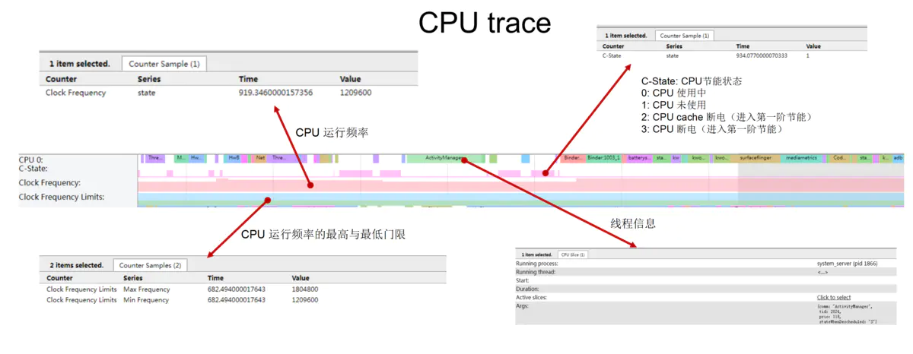

   

   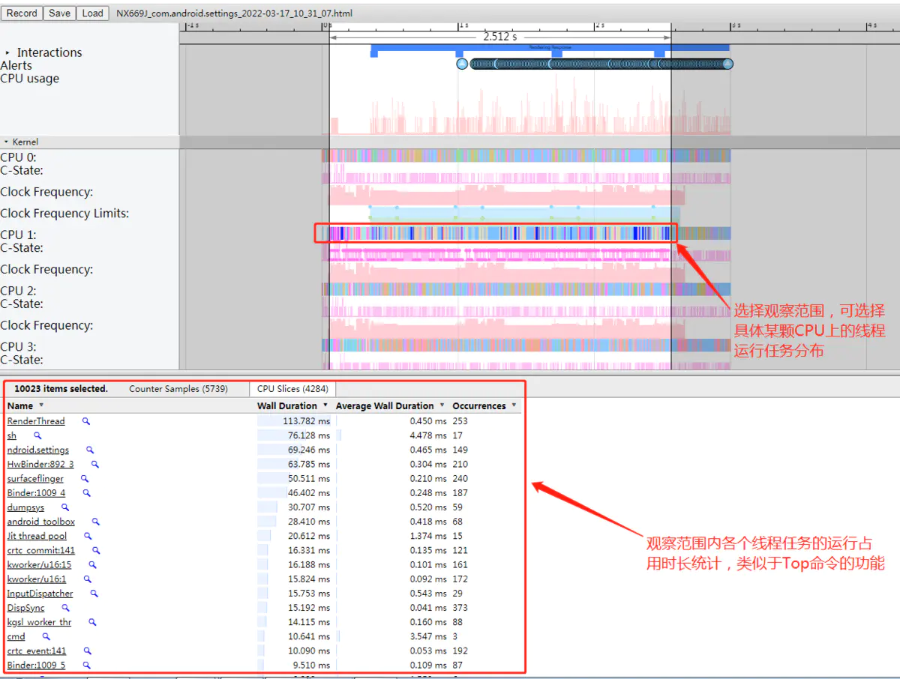

   

总的来说，`Systrace` 中的`CPU Trace` 这里一般是看任务调度信息，**查看是否是`CPU`频率或者是`CPU`调度逻辑导致当前任务出现性能问题**，举例如下：

1. 某个场景的任务执行比较慢，我们就可以查看是不是这个任务被`CPU`调度器安排到了小核上运行？
2. 某个场景的任务执行比较慢，当前执行这个任务的 `CPU` 运行频率是不是不够？是否因为门限值的设置不合理导致`CPU`被限频了？
3. 我的任务对性能要求比较高，比如指纹解锁，能不能把我这个任务持续放到`CPU`超大核去运行？
4. 我的前台应用任务线程长时间处于`Runnable`状态无法执行而卡顿，当前到底是什么任务在抢占了`CPU`资源在运行？

## 1.2 渲染显示系统信息区域

在上一篇文章中我们完整的分析了`Android`应用上帧显示的全部流程，其中包含了`Android`渲染显示系统的核心逻辑，这部分内容在`Systrace`上也有完整的展示，如下图所示：

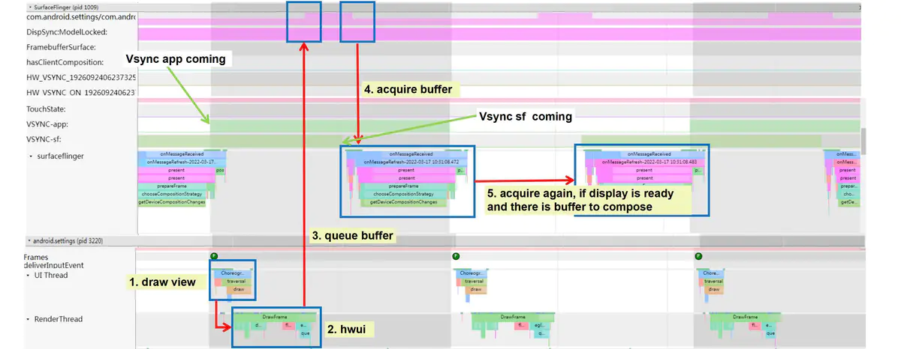


从上面的`Systrace`截图中我们可以看到一个屏幕`Vsync`周期内（屏幕刷新率`60HZ`条件下就是`16.6ms`），应用上帧渲染显示的完整流程信息：


1. `Vsync app`信号到来后唤醒应用`App`的`UI`线程，开始执行一帧画面的`measure`、`layout`、`draw`绘制等动作；
2. 在`HWUI`硬件加速默认开启的条件下，应用`App`的`UI`线程完成`draw`绘制动作后就会唤醒其`RenderThread`渲染线程，触发其使用`SkiaOpenGL`渲染管道执行一帧数据的渲染操作，渲染完成后通过`Binder`调用`queueBuffer`接口将`Buffer`画面缓存数据提交到`SurfaceFlinger`进程；
3. `SurfaceFlinger`进程中在收到应用`queueBuffer`上帧请求后，会先将对应的应用`Layer`中的`BufferQueue`中的`Buffer`置为`Queued`状态，标识应用“生产”了一帧`Buffer`画面数据，然后通过`requestNextVsync`注册下一个`Vsync sf`信号；
4. `Vsync sf`信号到达后，会及时唤醒`SurfaceFlinger`进程的主线程执行一帧的合成任务，其中会先遍历所有的`Layer`图层缓存区，找到处于`Queued`状态的新提交的缓存区，将其置为`Acquired`状态，标识“消费”了一帧`Buffer`画面数据；然后`Binder`唤醒`HWC service`进程的工作线程执行具体的图层的合成送显操作；

总的来说，**`Systrace`中的渲染显示系统这部分能够帮助我们判断界面是否有掉帧以及掉帧产生原因的分析方向**，主要分析流程如下图所示：


## 1.3 System Server框架进程信息区域

### 1.3.1 Input

`Input` 是 `System Server` 进程中非常重要的一部分，主要是由 `InputReader` 和 `InputDispatcher` 这两个 `Native` 子线程组成，关于这一部分在上一篇文章中已经从原理机制并结合`Systrace`详细分析过，这里就不再展开分析。我们回顾一下这边部分内容在`Systrace`上的表现：

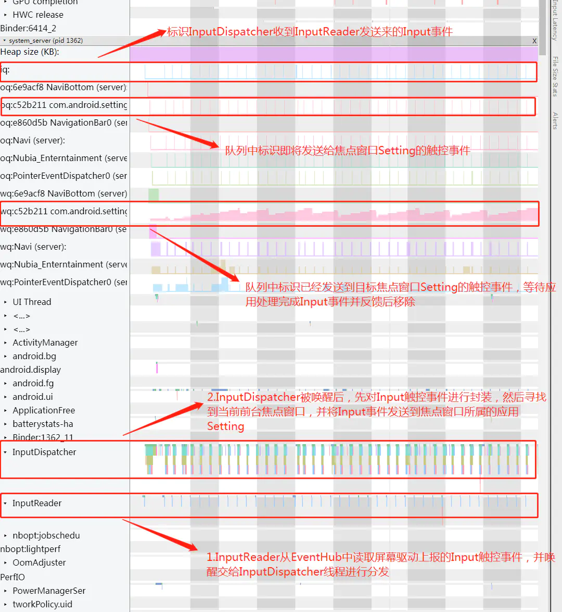


### 1.3.2 ActivityManagerService

`ActivityManagerService`（以下简称`AMS`）属于系统框架`System Server`中运行的核心服务之一，主要负责应用进程和四大组件的管理。是与应用`App`进程之间产生`Binder`交互最多的系统服务之一。谷歌原生的`AOSP`代码中就在`AMS`服务管理的进程和四大组件的各种场景下有对应的`Trace`点来记录，比如大家熟悉的 `ActivityStart`、`ActivityResume`、`activityStop` 等，与`AMS`相关的`Trace`一般会用`TRACE_TAG_ACTIVITY_MANAGER`这个`TAG`，在 `Systrace` 中对应的名字是 `ActivityManager` 。以桌面打开应用冷启动场景为例，`AMS`需要为应用创建一个新的进程，此过程在`AOSP`代码中就有相关的`AMS`相关的`Trace`埋点记录，如下图所示：


对应`Systrace`上表现如下图所示：


### 1.3.3 WindowManagerService

`WindowManagerService`（以下简称`WMS`） 属于系统框架`System Server`中运行的核心服务之一，主要负责应用窗口管理、窗口动画管理、`Surface`管理和`Input`触控事件的管理。也是与应用`App`进程之间产生`Binder`交互最多的系统服务之一。谷歌原生的`AOSP`代码中就在`WMS`窗口管理等核心流程上有对应的`Trace Tag`埋点来记录。与`WMS` 相关的 `Trace` 一般会用 `TRACE_TAG_WINDOW_MANAGER` 这个 `TAG`， 在 `Systrace` 中对应的名字是 `WindowManager` 。继续以上面的桌面打开应用冷启动场景为例，应用启动后创建第一个`Activity`界面后，在绘制第一帧画面时需要通过`Binder`访问框架`WMS`服务的`relayoutWindow`接口，以实现计算应用窗口的大小和申请一张可用`Surface`画布等逻辑，关于这块详细的分析请参考笔者之前的文章https://www.jianshu.com/p/37370c1d17fc。从`Systrace`上看如下图所示：


### 1.3.4 HandlerThread核心工作线程

上面描述的`AMS`、`WMS`等系统框架核心管理服务，其具体逻辑最终都需要运行在具体的线程中。为此`system_server`进程中设计了很多继承于`HandlerThread`（自带`Looper`消息循环的线程）的核心工作线程，负责执行不同分类业务的逻辑。比如有专门负责系统`UI`展示的`UiThread`线程（源码实现位于`framework/base/services/core/java/com/android/server/UiThread.java`），线程名为“`android.ui`”，在`Systrace`上的显示如下图所示：


比如负责窗口动画展示的`AnimationThread`，线程名为“`android.anim`”，在`Systrace`上的显示如下图所示：


还有很多，比如负责`IO`处理的工作线程`“android.io`”，再比如拥有极高优先级，负责系统界面实时显示的工作线程`“android.display`”等，由于篇幅所限，就不再一一展开分析，感兴趣的读者可以自行结合源码去阅读。随着对系统源码逻辑的深入了解，相信对这些框架的核心工作线程也会越来越熟悉。


**由于这些自带消息循环的核心工作线程中执行的都是系统框架`system_server`进程中的核心逻辑，所以这些工作线程运行的是否通畅直接关系到系统的“健康程度”**。通过从`Systrace`上观察这些工作线程的运行任务负载就可以直接反映出系统框架的负载与繁忙程度，如果这些线程出现长时间的阻塞，轻则导致系统反应变慢、界面卡顿等问题，重则会导致系统冻屏。为此`Android`系统设计在开机时会将一些系统框架**核心工作线程加入到`WatchDog`的监控中**，通过定期往这些线程消息循环队列中抛消息，然后检查消息是否得到及时执行来判断其是否正常顺畅运行，如果出现长时间超时得不到执行就会导致系统重启。相关简化代码如下：


```csharp
/*frameworks/base/services/core/java/com/android/server/Watchdog.java*/
private Watchdog() {
        ...
        // The shared foreground thread is the main checker.  It is where we
        // will also dispatch monitor checks and do other work.
        mMonitorChecker = new HandlerChecker(FgThread.getHandler(),
                "foreground thread", DEFAULT_TIMEOUT);
        mHandlerCheckers.add(mMonitorChecker);
        // Add checker for main thread.  We only do a quick check since there
        // can be UI running on the thread.
        mHandlerCheckers.add(new HandlerChecker(new Handler(Looper.getMainLooper()),
                "main thread", DEFAULT_TIMEOUT));
        // Add checker for shared UI thread.
        mHandlerCheckers.add(new HandlerChecker(UiThread.getHandler(),
                "ui thread", DEFAULT_TIMEOUT));
        // And also check IO thread.
        mHandlerCheckers.add(new HandlerChecker(IoThread.getHandler(),
                "i/o thread", DEFAULT_TIMEOUT));
        // And the display thread.
        mHandlerCheckers.add(new HandlerChecker(DisplayThread.getHandler(),
                "display thread", DEFAULT_TIMEOUT));
        // And the animation thread.
        mHandlerCheckers.add(new HandlerChecker(AnimationThread.getHandler(),
                "animation thread", DEFAULT_TIMEOUT));
        // And the surface animation thread.
        mHandlerCheckers.add(new HandlerChecker(SurfaceAnimationThread.getHandler(),
                "surface animation thread", DEFAULT_TIMEOUT));
        // Initialize monitor for Binder threads. //检查系统system_server进程用于Binder通信的线程数量是否充足
        addMonitor(new BinderThreadMonitor());
        ...
    }
```

### 1.3.5 Binder与锁竞争机制

a.**`Binder`是`Android`系统中最广泛使用的跨进程通信机制，应用进程与系统框架`system_server`进程之间的大部分跨进程通信机制都是通过`Binder`来实现的**，它就像“神经网络”一样遍布于`Android`系统的整个运行体系中。例如应用通过`startActvity`启动一个新的`Activity`页面，或者`sendBroadcast`发送一条广播，都需要通过`Binder`发送相关的请求到框架`system_server`进程中具体处理与实现。所以框架`system_server`进程中很多时候都在处理应用进程的各种`Binder`请求与响应的逻辑。关于`Binder`的详细实现原理与架构设计可以参考这篇文章[https://juejin.cn/post/6955298955307515917](https://links.jianshu.com/go?to=https%3A%2F%2Fjuejin.cn%2Fpost%2F6955298955307515917)，本节内容重点在于描述其在`Systrace`上的表现，就不再详细展开分析。在抓取`Systrace`时注意选择开启`binder_lock`和`binder_driver`两个追踪选项，就能在`Systrace`上看到完整的`Binder`调用事件信息流。我们还是以从桌面打开应用冷启动的场景为例，桌面应用中需要启动三方应用时，通过`Binder`调用框架`AMS`服务中的`startActivity`接口来实现，相关`Binder`调用过程在`Systrace`上看如下图所示：

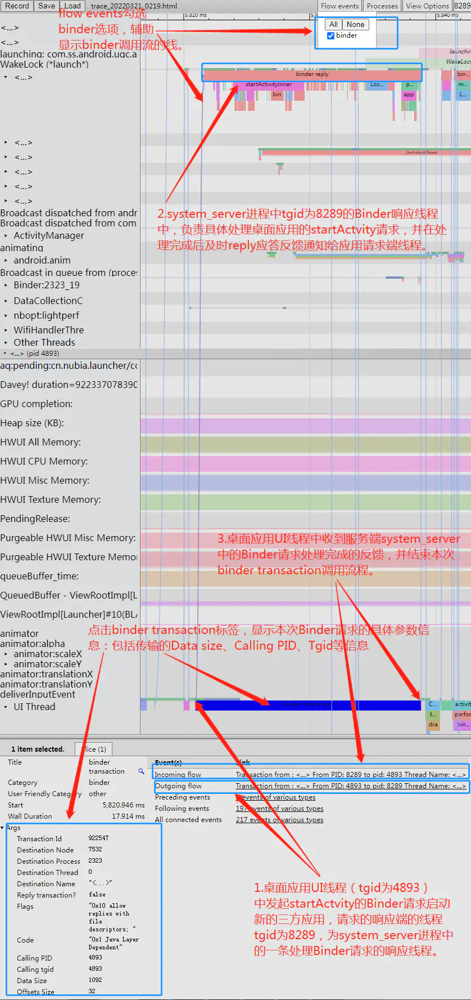


b.从上面的分析可以看到，很多时候框架`system_server`进程中都在阻塞式的处理应用的各种`Binder`跨进程访问与请求。**但是很多时候`system_server`进程在处理应用的`Binder`请求时，内部都是阻塞在了各种同步锁的竞争与等待的流程上（`AMS`和`WMS`等核心服务运行时内部都拥有各自的相关锁对象，且往往很容易存在相互持有锁和锁竞争的逻辑），间接导致对应用的`Binder reply`响应变慢，从而最终导致应用出现卡顿或反应慢等性能问题**。`system_server`进程内部的这些锁竞争与等待的问题，轻则导致应用和系统的卡顿与反应慢的问题，重则出现死锁而导致系统冻屏、重启(`WatchDog`触发）等严重问题。所以`system_server`进程内部的工作线程之间的锁等待问题的优化，一直以来都是谷歌和国内各大手机厂商们做`Android`系统性能优化的重点工作之一。当然要想合理优化减少这些线程之间的锁等待现象，需要在深入分析了解系统相关源码流程的基础上才能作出合理的改善与优化，这是一个考验相关参与系统性能优化人员水平的问题，也需要时间与经验的沉淀。本小节中先带大家来了解一下如何从`Systrace`上的显示来入手分析这种锁竞争等待的问题：
首先我们来看看`Systrace`上显示的锁相关的信息，如下图所示：

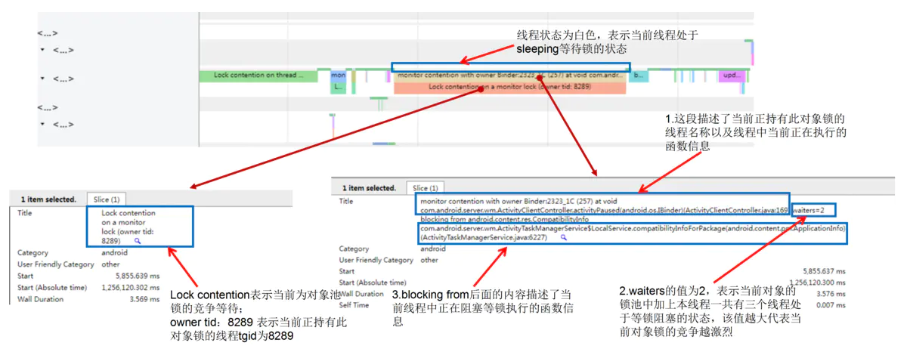


其实`Systrace`上显示的锁相关的信息（谷歌通过在`art`虚拟机的`monitor`对象锁实现的源码流程中增加相关的`Trace TAG`埋点实现，相关源码位于`art/runtime/monitor.cc`中，感兴趣的读者可以自行去阅读一下），已经基本上包含了我们分析锁竞争等待问题所需要的全部有效信息。上图中展示的这段锁相关信息翻译一下描述如下：


1. `system_server`进程中的当前线程（`tgid`为`4147`）正在执行的函数`android.content.res.CompatibilityInfo com.android.server.wm.ActivityTaskManagerService$LocalService.compatibilityInfoForPackage(android.content.pm.ApplicationInfo)(ActivityTaskManagerService.java:6227)`时需要申请持有某个对象锁；当前由于有其它线程正在持有此对象锁，所以本线程进入该对象的锁池中阻塞等待线程释放锁，且对象的锁池中已经有两个线程已经在等待，加上本线程共计有三个线程正在等待该锁对象的释放（**虚拟机为每个`java`对象维护了两个“队列池”，一个叫`Entry Set`（入口集），另外一个叫`Wait Set`（等待集）**；对于任意的对象`objectX`，`objectX`的`Entry Set`用于存储等待获取`objectX`这个锁的所有线程，也就是**锁池**，`objectX`的`Wait Set`用于存储执行了`objectX.wait()/wait(long)`的线程，也就是**等待池**。）。

   

   ```java
   /*frameworks/base/services/core/java/com/android/server/wm/ActivityTaskManagerService.java*/
   ...
   @Override
   public CompatibilityInfo compatibilityInfoForPackage(ApplicationInfo ai) {
        synchronized (mGlobalLock) { // 4147线程中就是此处的执行需要申请持有AMS服务内部的对象锁mGlobalLock
            return compatibilityInfoForPackageLocked(ai);
        }
   }
   ...
   ```

2. 当前对象锁正在被`system_server`进程中名为`Binder:2323_1C`的线程所（`tgid`为`8289`）持有，且该线程中当前正在持锁执行如下函数调用： `void com.android.server.wm.ActivityClientController.activityPaused(android.os.IBinder)(ActivityClientController.java:169)` 。

   

   ```java
   /*frameworks/base/services/core/java/com/android/server/wm/ActivityClientController.java*/
       ...
       @Override
       public void activityPaused(IBinder token) {
           final long origId = Binder.clearCallingIdentity();
           synchronized (mGlobalLock) {// 8289线程中当前正持有锁mGlobalLock，执行activityPaused的逻辑
               Trace.traceBegin(TRACE_TAG_WINDOW_MANAGER, "activityPaused");
               final ActivityRecord r = ActivityRecord.forTokenLocked(token);
               if (r != null) {
                   r.activityPaused(false);
               }
               Trace.traceEnd(TRACE_TAG_WINDOW_MANAGER);
           }
           Binder.restoreCallingIdentity(origId);
       }
       ....
   ```

然后我们再从`Systarce`上总体来看看这个`mGlobalLock`对象锁的竞争等待状态：

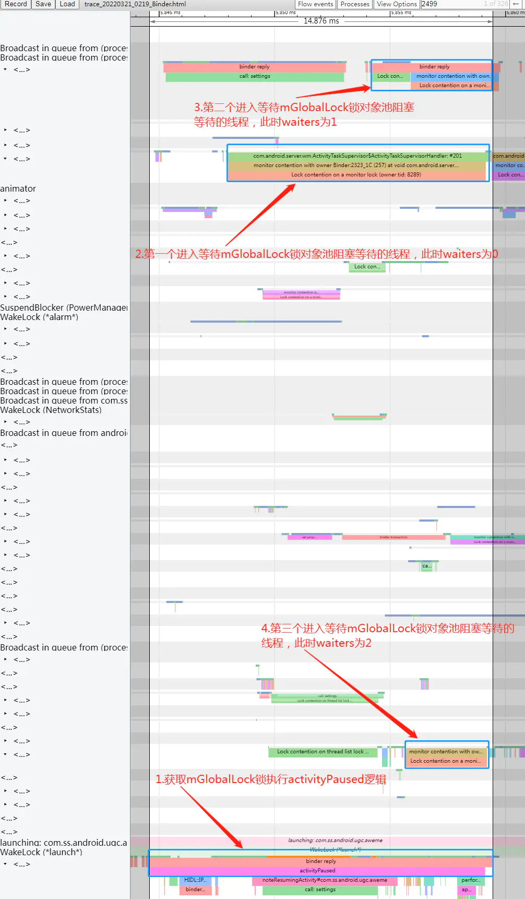


上图中可以看到 `mGlobalLock` 这个对象锁的争夺情况：


1. `Binder:2323_1C`首先开始执行 **activityPaused**，这个方法中是要获取 `mGlobalLock` 对象锁的，由于此时 `mGlobalLock` 没有竞争，所以 `activityPaused` 获取对象锁之后开始执行；
2. `android.display` 线程开始执行 **handleMessage** 方法，这个方法也是要获取 `mGlobalLock` 对象锁的，但是此时`Binder:2323_1C` 的 `activityPaused` 持有 `mGlobalLock` 对象锁 ，所以这里 `android.display` 的 `handleMessage`开始等待，进入 `sleep` 状态；
3. `Binder:2323_1` 线程开始执行 **isControllerAMonkey** 方法，这个方法也是要获取 `mGlobalLock` 对象锁的，但是此时`Binder:2323_1C` 的 `activityPaused` 持有 `mGlobalLock` 对象锁 ，所以这里 ``Binder:2323_1`的 ```isControllerAMonkey```开始等待，进入`sleep` 状态；
4. `GameModeWorkThr` 线程开始执行 **compatibilityInfoForPackage** 方法，这个方法也是要获取 `mGlobalLock` 对象锁的，但是此时`Binder:2323_1C` 的 `activityPaused` 持有 `mGlobalLock` 对象锁 ，所以这里 ``GameModeWorkThr`的 ```compatibilityInfoForPackage```开始等待，进入`sleep` 状态。

经过上面四步，就形成了 `Binder:2323_1C`线程在运行，其他三个争夺 `mGlobalLock` 对象锁失败的线程分别进入 `sleep` 状态，等待 `Binder:2323_1C` 执行结束后释放 `mGlobalLock` 对象锁。**当`Binder:2323_1C`线程中的`activityPaused`逻辑执行完成后会释放`mGlobalLock`锁对象，该对象就会从其锁池中任意取出一个处于等待状态的线程去唤醒，使得线程能成功申请到`mGlobalLock`锁对象去执行，并将该线程从`mGlobalLock`锁池中移除**。后续关于`mGlobalLock`锁释放后，如何从`Systrace`上分析观察锁池中的等待线程之间的相互唤醒关系的流程，会在后文中详细讲解。

## 1.4 应用进程APP Trace信息区域

**如果说前面讲解的`Systrace`上的显示的内容通常`Android`系统开发者们关注的会多一些，那么本节中所描述的`Systrace`上应用进程`APP Trace`信息区域则需要`APP`应用开发者格外的关注**。分析`Systrace`上这块区域的显示内容，我们一般主要看的是`UI Thread`和`Render Thread`两个线程的显示，因为从上一篇文章中关于`Android`应用上帧显示的原理的内容中的分析我们知道，这两个线程是应用进程中直接负责界面上帧显示的工作线程。当然`Systrace`上还有很多应用进程中还有很多其它线程的信息，如与`GC`相关的`HeapTaskDeamon`线程、负责动态编译机器码的`JIT`线程等，甚至很多应用开发者自己创建并定义的工作线程，关于这些线程的分析开发者可以根据自身问题和业务的需要进行，本文就不再涉及。
根据前文的分析可知，`UI Thread`和`Render Thread`都是自带`Looper`的消息循环线程，由系统创建应用进程后统一为应用创建启动，主要负责应用界面的`UI`界面的更新上帧显示和应用四大组件生命周期的处理。`Systrace`上的表现前文中（参考上一篇文章中已经详细分析过）已经分析过，如下图所示：

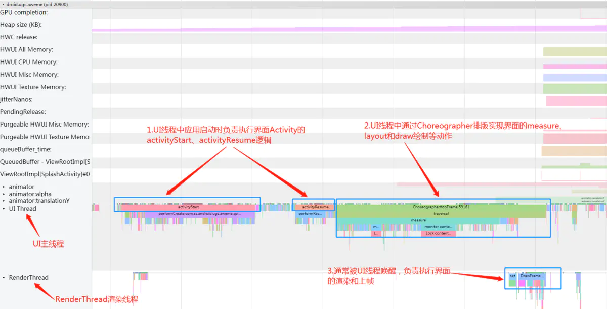


分析`Systrace`线程上每一段`Trace TAG`的详细运行情况如下图所示：

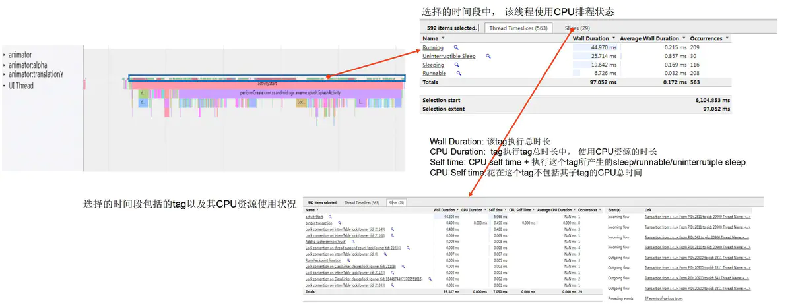


通过分析线程每一段`Trace TAG`执行过程的线程排程使用状态中`Running`、`Sleeping`、`Runnable`以及`Uninterruptible Sleep`占用比例和时长等信息，再结合对应的`tag`信息，我们可以看到：


1. 线程任务是否频繁中断进入`sleeping`状态导致运行变慢？如果是的话，然后结合具体的`tag`信息观察线程`sleeping`原因是`Binder`通信阻塞？或者是等锁释放阻塞？
2. 线程是否长时间处于`Uninterruptible Sleep`阻塞状态导致运行变慢？然后结合`tag`信息观察是否为执行`I/O`操作导致被`Kernel`内核阻塞？
3. 线程是否长时间处于`Runnable`状态得不到执行而导致运行变慢？这个要结合`CPU Trace`信息观察当前`CPU`上任务的分布，是否有`CPU`关核或后台其它线程任务频繁抢占的问题？
4. 如果只是线程`Running`时长过长导致运行变慢，最终出现上帧超时而掉帧？我们就需要结合具体`tag`信息查看到底在执行什么逻辑，然后结合自身的代码实现看是否可以优化？又或者是看看当前`JIT`线程任务是否繁忙，以判断是否是因为应用没有被及时编译成机器码而导致运行时长过长？

**`Systrace`的分析重经验，在深入理解系统运行的基本流程和原理的基础上，无论是系统开发者或应用开发者都需要在平时工作中不断练习与积累**，才能在真正遇到问题时，用`Systrace`工具去分析时做到游刃有余。

# 2 Systrace分析技巧

上一小节中我们详细分析介绍了`Systrace`上显示的各主要信息区域内容的静态构成，但是整个系统的运行往往是一个动态且相互影响的过程。在实际上手使用`Systrace`分析性能问题之前，我们还有一些实用的分析和调试的技巧也是需要掌握的。

## 2.1 线程运行排程状态转换分析

我们先用一张图来总体看看线程运行状态的变化以及引起变化的原因：


从上面的图中可以看出：一个线程在运行过程中会到受各种因素的影响而在**`Running`**、**`Sleeping`**、**`Uninterruptible Sleep`**和**`Runnable`**四个状态之间不断切换。而除了`Running`状态下时线程工作任务有真正运行在`CPU`上去执行，其它几种状态下线程任务都无法得到有效的执行，从而可能会引起一些性能相关的问题。所以我们很多时候在分析性能问题，都需要找到线程任务没有持续处于`Running`状态的原因，还要判断其切换到其它几种状态的原因是否合理。而从`Systrace`上我们就可以清晰的观察到线程运行状态的变化以及引起状态变化的原因。各种线程运行状态切换场景如下所示：


### 2.1.1 Running -> Sleeping


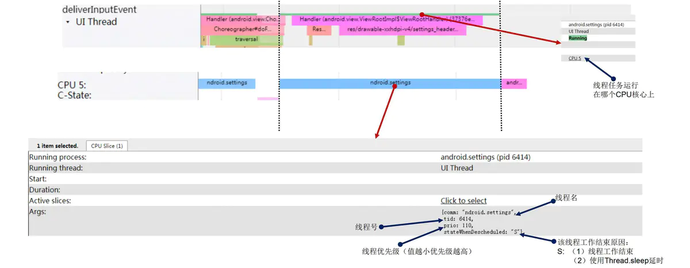


常见于：**线程工作结束，线程使用`Thread.sleep`延时，线程被`Binder`服务端阻塞，线程陷入等锁阻塞状态等**，具体原因需要结合线程`Sleeping`结束后线程被唤醒时的信息分析判断是否合理，后文会详细分析。


### 2.1.2 Sleeping -> Runnable


处于`Sleeping`状态的线程被唤醒，重新进入`Runnable`待执行状态，`Systrace`上会显示出唤醒该线程的线程号。


### 2.1.3 Running->Runnable->Running


正在执行的线程任务被更高优先级的线程任务临时抢占，`Systrace`上可以完整清晰的看到发生抢占的原因。


### 2.1.4 Running -> Uninterruptible Sleeping -> Runnable


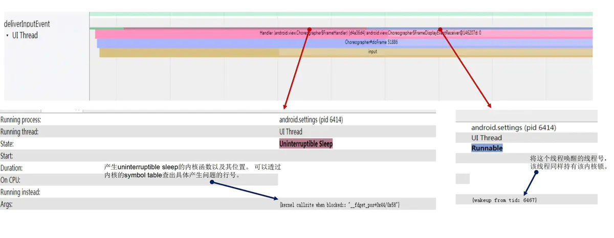


正在执行的线程陷入内核锁等待状态，`Systrace`上可以看到被内核阻塞的详细信息，通过`addr2line`工具结合`symbol table`信息就可以查到产生问题的内核代码行号，帮助进一步定位问题原因。


### 2.1.5 Runnable -> Running


从`Runnable` 到`Running`状态的切换，`Systrace`上会显示出唤醒这个线程的线程号，从而可以进一步根据该线索分析理清楚线程间的相互等待唤醒关系，找到问题的根本原因。


## 2.2 线程等待唤醒关系分析

有了上面的分析基础，本小节中我们还是以桌面打开应用冷启动的场景为例，看看如何通过`Systrace`来分析观察线程之间的唤醒等待关系，从而看清应用进程与系统框架`system_server`进程之间是如何交互的。**只有掌握了如何用`Systrace`分析线程之间的唤醒等待关系，我们才能去追踪并理清系统内跑在各个进程或线程中的各个功能模块之间是如何相互交互配合去完成一次系统事件流程的处理，个人理解这也就是使用`Systrace`工具分析问题的精髓所在**。

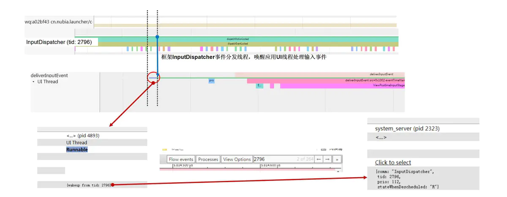


从桌面应用的`UI`线程从`Sleeping`状态切换到`Runnable`状态的`Tag`信息中可以看到该线程是被一个`tid`为`2796`的线程所唤醒，然后我们在`Systrace`界面右上角的搜索框中输入 `2796`后，搜索发现该线程的详细信息是属于框架`system_server`进程中的名为`InputDispatcher`的工作线程。然后我们选中`UI`线程`Runnable`这段时间区域，在`system_server`进程信息显示区域找到其`2796`子线程，根据`Systrace` `TAG`发现其中正是在执行`InputDispatcher#dispatchMotionLocked` 事件分发的逻辑。到此我们就理清了这段Input触控事件的传递逻辑，知道`Input`触控事件是由`system_server`进程中的名为`InputDispatcher`的工作线程，唤醒目标应用的主线程进行分发的，这也和上一篇文章中关于Input事件处理机制的理论分析是相符的。


然后桌面应用`UI`线程中根据连续收到的几条的`Input`事件判断用户在执行点击应用图标启动应用的动作，然后通过`Binder`调用框架的`startActivity`接口尝试去启动应用，从`Systrace`上分析如下所示：


从线程`Runnable`状态切换可以看到，桌面的`UI`线程（线程`tid`为`4893`）中会先唤醒`system_server`进程中的负责处理应用`Binder`请求的`Binder:2323_1C`（`tid`为`8289`）线程，然后进入`Sleeping`状态，然后`Binder:2323_1C`线程中执行完`startActivity`具体内部逻辑后，会唤醒桌面的`UI`线程。这就是一次从`Systarce`上看到的应用`Binder`阻塞调用访问框架服务接口的线程相互等待唤醒的过程。


## 2.3 添加自定义Systrace tag

从上面的分析可以看到，谷歌原生在`Android`系统的很多系统关键流程上都添加了相关的`Systrace tag`，以观察这些流程执行的耗时情况。但是这些信息覆盖的范围毕竟是有限的，有时候并不能满足我们的分析需求。比如我们开发者想观察自己的一些代码逻辑执行的耗时情况，就需要自己定义一些`Systrace tag`去度量，这个`Systrace`机制本身是支持的。如何在代码中添加自定义的`Systrace tag`信息呢？主要有以下几种场景：

## 2.3.1 在APP应用Java代码中添加Systrace tag

在 `Android 4.3`（`API` 级别 `18`）及更高版本中，您可以在代码中使用 `android.os.Trace`类来定义随后会出现在 `Perfetto` 和 `Systrace` 报告中的自定义事件，如以下谷歌官方代码段所示：


```java
    public class MyAdapter extends RecyclerView.Adapter<MyViewHolder> {
        @Override
        public MyViewHolder onCreateViewHolder(ViewGroup parent, int viewType) {
            Trace.beginSection("MyAdapter.onCreateViewHolder");// 1.标识自定义事件开始，title内容可以自定义
            MyViewHolder myViewHolder;
            try {
                myViewHolder = MyViewHolder.newInstance(parent);
            } finally {
                // In try and catch statements, always call "endSection()" in a
                // "finally" block. That way, the method is invoked even when an
                // exception occurs.
                Trace.endSection(); // 2.标识自定义事件结束
                
            }
            return myViewHolder;
        }
        
        @Override
        public void onBindViewHolder(MyViewHolder holder, int position) {
            // 嵌套调用代码示例
            Trace.beginSection("MyAdapter.onBindViewHolder");
            try {
                try {
                    Trace.beginSection("MyAdapter.queryDatabase");
                    RowItem rowItem = queryDatabase(position);
                    dataset.add(rowItem);
                } finally {
                    Trace.endSection();
                }
                holder.bind(dataset.get(position));
            } finally {
                Trace.endSection();
            }
        }
    }
    
```

**注意事项**：

- **在使用`python`脚本抓取`Systrace`时必须提供 `-a` 选项才能跟踪应用**；如果没有此选项，应用的方法将不会显示在 `Systrace` 报告中。如下命令示例所示：


```css
  python systrace.py -a com.example.myapp -b 16384 \
      -o my_systrace_report.html sched freq idle am wm gfx view binder_driver hal \
      dalvik camera input res
```


- `endSection()`建议包裹在`finally`代码块中，以保证中间代码出现异常情况下都能够结束事件；另外如果您多次调用 `beginSection()`，调用 `endSection()` 只会结束最后调用的 `beginSection()` 方法。因此，对于嵌套调用（如以上官方代码段中所示），请务必将每次对 `beginSection()` 的调用与一次对 `endSection()` 的调用正确匹配。否则抓取出来的`Systrace`会出现`Did Not Finish`的显示异常，影响结果分析。如下图所示：


- 不能在一个线程上调用 `beginSection()`，而在另一个线程上结束它；您必须在同一个线程上调用这两个方法。如果就有需要在不同的线程开始和结束一个方法的追踪，请使用`Trace.beginAsyncSection()`和`Trace.endAsyncSection()`。

## 2.3.2 在APP应用Native代码中添加Systrace tag

`Android 6.0`（`API` 级别 `23`）及更高版本支持原生跟踪 `API` `trace.h`，用于将跟踪事件写入系统缓冲区，以供您随后使用 `Perfetto` 或 `Systrace` 进行分析。此 `API` 的常见用例包括观察特定代码块的执行时间以及确定引起不良系统行为的代码块。
在自定义事件的开头和结尾分别调用 `ATrace_beginSection()` 和 `ATrace_endSection()`，看看谷歌官方给出的用法示例：


```cpp
 #include <android/trace.h>
    
 char *customEventName = new char[32];
 sprintf(customEventName, "User tapped %s button", buttonName);

 ATrace_beginSection(customEventName);
 // Your app or game's response to the button being pressed.
 ATrace_endSection();
```

**注意使用`pthread_setname_np`函数为自己的工作线程命名，以便让`Systrace`能识别并显示出来**。详细使用规则请参见`Android`官方文档：[https://developer.android.google.cn/topic/performance/tracing/custom-events](https://links.jianshu.com/go?to=https%3A%2F%2Fdeveloper.android.google.cn%2Ftopic%2Fperformance%2Ftracing%2Fcustom-events)

## 2.3.3 在Framework的Java代码中添加Systrace tag

在`Framework`的`Java`层代码里面添加`Systrace`跟踪方式：


```dart
 import android.os.Trace;
 ...
 Trace.traceBegin(Trace.TRACE_TAG_VIEW, “performTraversals”);// 字符串可以自定义 
 // 自己的代码实现逻辑
 finally {
    Trace.traceEnd(Trace.TRACE_TAG_VIEW);
 }
```

`TRACE_TAG_VIEW`的定义见`android.os.Trace.java`，这个与`Systrace`的脚本的参数是对应的，我们使用`python`脚本抓`Systrace`时可以根据需要选择是否抓取显示。如下图所示：

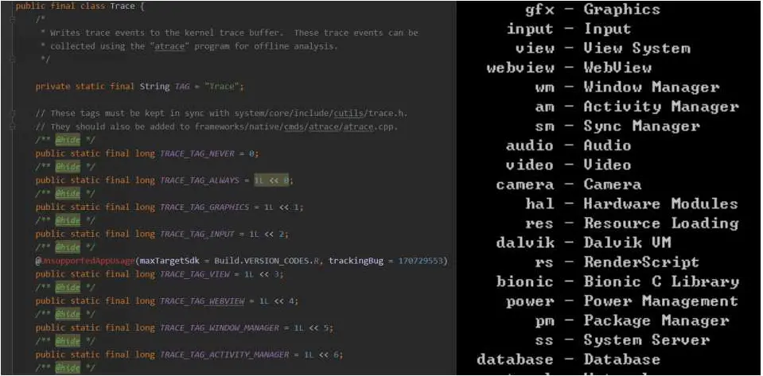


## 2.3.4 在Framework的Native代码中添加Systrace tag

在`Framework`的`Native`层代码里面添加`Systrace`跟踪方式：

- **跟踪整个函数**：在检测调用堆栈或函数计时时，您可能会发现跟踪整个函数非常有用。使用 `ATRACE_CALL()` 或`ATRACE_NAME()`宏可以更轻松地设置此类跟踪。相关用法简化代码示例如下：


```cpp
#define ATRACE_TAG ATRACE_TAG_ALWAYS // 表示一直会打开，如果是ATRACE_TAG_GRAPHICS，则需要在使用脚本抓systrace时参数加上gfx才能看到
#include <utils/Trace.h>
void myExpensiveFunction() {
    ATRACE_CALL(); // or ATRACE_NAME(“myExpensiveFunction”);
    // 想要跟踪的代码逻辑
}
```

另外模块的编译控制脚本`.bp`或`.mk`文件中注意添加引用`libutils`库，如下图所示：

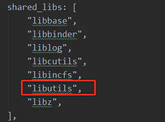


- **跟踪函数中的部分逻辑**：

  相关用法简化代码示例如下：


```cpp
#define ATRACE_TAG ATRACE_TAG_ALWAYS // 表示一直会打开，如果是ATRACE_TAG_GRAPHICS，则需要在使用脚本抓systrace时参数加上gfx才能看到
#include <cutils/trace.h>
void myExpensiveFunction() {
    ATRACE_BEGIN(“TEST”); // 字符串可以自定义
    // 想要跟踪的代码逻辑
    ATRACE_END();
}
```

另外模块的编译控制脚本`.bp`或`.mk`文件中注意添加引用`libcutils`库，如下图所示：


# 3 Systrace原理简介

本着知其然、知其所以然的态度，本小节中我们来简单分析一下系统`Systrace`机制的原理，看看一份`Systrace`文件到底是怎么生成的？我们知道`Android`系统底层是基于`Linux`内核的，所以`Systrace`机制的实现其实也是基于`Linux`内核调试器`ftrace`的。 下面我们从`ftrace`机制开始入手分析。

## 3.1 Linux内核调试器之ftrace机制

`ftrace`，全称`function tracer`，用于帮助开发人员了解 `Linux` 内核的运行时行为，以便进行故障调试或性能分析。最早 `ftrace` 仅能够记录内核的函数调用流程，如今 `ftrace` 已经成为一个 `framework`，采用 `plugin` 的方式支持开发人员添加更多种类的 `trace` 功能。

### 3.1.1 Android系统上是如何开启并使用ftrace的

- 在编译`linux`内核时，需要增加对`ftrace`支持的相关配置选项。我们拿手头的一台手机，`adb shell`进去看看`proc/config.gz`下关于`linux`内核编译的相关配置项：

  

  ```dart
  /*proc/config.gz*/
  ...
  CONFIG_FTRACE=y
  CONFIG_NOP_TRACER=y
  CONFIG_HAVE_FUNCTION_TRACER=y
  CONFIG_HAVE_FUNCTION_GRAPH_TRACER=y
  # CONFIG_FUNCTION_TRACER is not set // 发货版本上一般默认关闭，以免影响整机性能
  ...
  ```

- 系统开机启动时挂载 `tracefs` 文件。我们来看看`init.rc`文件中的相关定义：

  

  ```csharp
  /*system/core/rootdir/init.rc*/
  on early-init
  ...
  # Mount tracefs
  mount tracefs tracefs /sys/kernel/tracing //1.挂载tracefs文件到/sys/kernel/tracing
  ...
  on late-fs
  # Ensure that tracefs has the correct permissions.
  # This does not work correctly if it is called in post-fs.
  chmod 0755 /sys/kernel/tracing
  chmod 0755 /sys/kernel/debug/tracing // 2.修改节点读写权限
  ...
  ```

  更多`tracing`子节点的初始化在`atrace.rc`文件中定义，我们挑重点来看，如下所示：

  

  ```php
  /*frameworks/native/cmds/atrace/atrace.rc*/
  ...
  on late-init
  # Allow writing to the kernel trace log.
      chmod 0222 /sys/kernel/debug/tracing/trace_marker // 配置trace_marker节点读写权限
      chmod 0222 /sys/kernel/tracing/trace_marker 
  ...
  # Grant unix world read/write permissions to kernel tracepoints.
  # Access control to these files is now entirely in selinux policy.
      chmod 0666 /sys/kernel/debug/tracing/trace_clock
      chmod 0666 /sys/kernel/tracing/trace_clock
      chmod 0666 /sys/kernel/debug/tracing/buffer_size_kb
      chmod 0666 /sys/kernel/tracing/buffer_size_kb
      chmod 0666 /sys/kernel/debug/tracing/options/overwrite
      chmod 0666 /sys/kernel/tracing/options/overwrite
      chmod 0666 /sys/kernel/debug/tracing/options/print-tgid
      chmod 0666 /sys/kernel/tracing/options/print-tgid
      chmod 0666 /sys/kernel/debug/tracing/options/record-tgid
      chmod 0666 /sys/kernel/tracing/options/record-tgid
      chmod 0666 /sys/kernel/debug/tracing/saved_cmdlines_size
      chmod 0666 /sys/kernel/tracing/saved_cmdlines_size
  ....
  # Tracing disabled by default
      write /sys/kernel/debug/tracing/tracing_on 0 //开机默认是关闭tracing的
      write /sys/kernel/tracing/tracing_on 0
  ...
  on property:persist.debug.atrace.boottrace=1 // 通过property值配置，动态控制启动atrace服务，实现抓取开机阶段的systrace（可用于分析开机时长问题）
      start boottrace
      
  # Run atrace with the categories written in a file
  service boottrace /system/bin/atrace --async_start -f /data/misc/boottrace/categories
      disabled
      oneshot
  ```

- 经过上面两步后，在设备的`/sys/kernel/debug/tracing` 下就有各种跟踪器（`tracer`）和事件（`event`），相关节点的功能分析如下图所示：

  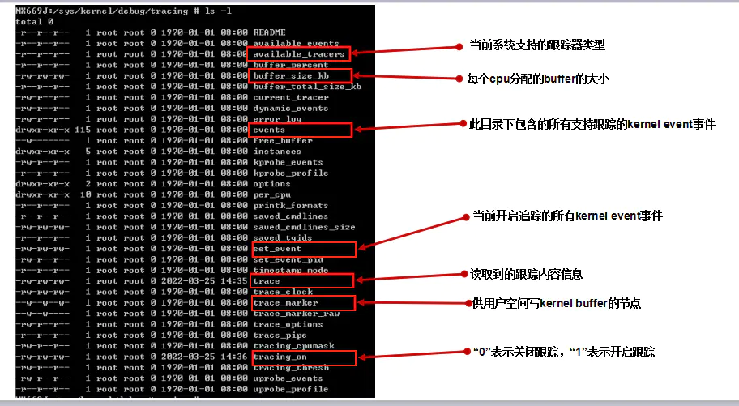

  

- 最后我们看看如何用`adb`命令开启使用`ftrace`跟踪`kernel event`事件，相关操作命令如下：

  

  ```csharp
  一、切换到trace目录：
     adb shell
     #cd sys/kernel/debug/tracing/
     
  二、关闭ftrace:
     #echo 0 >tracing_on
     
  三、清空ftrace内容：
     #echo >trace
     
  四、开启需要ftrace追踪的kernel event事件：
     #echo 1 >events/power/enable
     
  五、开启ftrace:
     #echo 1 >tracing_on  
     
  六、用户操作手机设备
  
  七、关闭ftrace
      #echo 0 >tracing_on
      
  八、导出操作过程的ftrace
      #cat trace
      
  ftrace跟踪到的trace文件格式内容如下所示：  
  # tracer: nop
  #
  # entries-in-buffer/entries-written: 176698/383721   #P:8
  #
  #                                _-----=> irqs-off
  #                               / _----=> need-resched
  #                              | / _---=> hardirq/softirq
  #                              || / _--=> preempt-depth
  #                              ||| /     delay
  #           TASK-PID     CPU#  ||||   TIMESTAMP  FUNCTION
  #              | |         |   ||||      |         |
            <idle>-0       [007] d.h2   588.866977: sched_get_task_cpu_cycles: cpu=7 event=5 cycles=2448000000 exec_time=938 freq=2609808 legacy_freq=843600 max_freq=2841600 task=0 (swapper/7)
            <idle>-0       [007] ...1   588.866979: cpu_idle: state=4294967295 cpu_id=7
            <idle>-0       [007] d..1   588.866989: cpu_idle: state=1 cpu_id=7
            <idle>-0       [007] .N.1   592.944497: cpu_idle: state=4294967295 cpu_id=7
            ...
  ```

### 3.1.2 ftrace工具包含的功能介绍

- **`function trace`功能实现**：

`funtion trace`就是可以跟踪函数调用流程（目前`Android`发货版本出于性能考量，默认`available_tracers`都只支持`nop`追踪器，如果需要开启`function`跟踪器，需要修改`kernel config`编译配置，开启`CONFIG_FUNCTION_TRACER`等配置，然后单独编译版本进行调试），比如类似下面的跟踪输出：


```bash
# tracer: function
#
#                              _-----=> irqs-off
#                             / _----=> need-resched
#                            | / _---=> hardirq/softirq
#                            || / _--=> preempt-depth
#                            ||| /     delay
#           TASK-PID   CPU#  ||||    TIMESTAMP  FUNCTION
#              | |       |   ||||       |         |
          bash-29409 [002] .... 16158426.215771: mutex_unlock <-tracing_set_tracer
          <idle>-0     [039] d... 16158426.215771: call_cpuidle <-do_idle
          <idle>-0     [039] d... 16158426.215772: cpuidle_enter <-call_cpuidle
          <idle>-0     [039] d... 16158426.215773: cpuidle_enter_state <-cpuidle_enter
            bash-29409 [002] .... 16158426.215773: __fsnotify_parent <-vfs_write
          <idle>-0     [039] d... 16158426.215773: sched_idle_set_state <-cpuidle_enter_state
```

`funtion trace`的实现是采用 `gcc` 编译器的 `profile` 特性在所有内核函数的开始部分加入一段 `stub` 代码，`ftrace` 重载这段代码来实现 `trace` 功能（**本质上`funtion trace`就是一种静态代码插桩的思想的应用**）。

比如编译下面的test.c文件：


```cpp
//test.c
void foo(void)
{
   printf("foo");
}
```

`gcc` 的 `-pg` 选项将在每个函数入口处加入对 `mcount` 的调用代码，下图中对比展示了添加`-pg`和不添加`-pg`编译选项的区别：

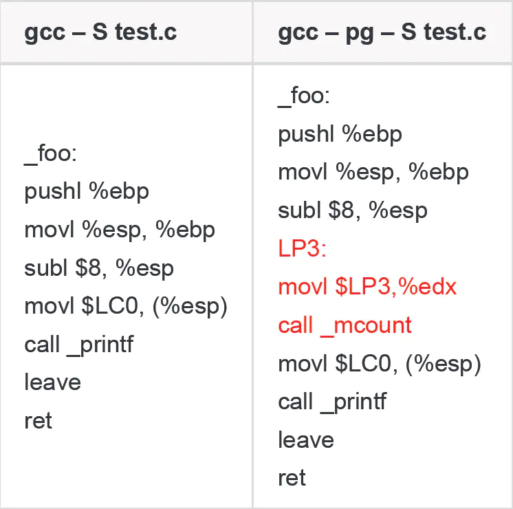


增加 `pg` 选项后，`gcc` 在函数 `foo` 的入口处加入了对 `mcount` 的调用：`call _mcount` 。原本 `mcount` 由`libc` 实现，但内核不会连接 `libc` 库，因此 `ftrace` 编写了自己的 `mcount stub` 函数，并借此实现 `trace`功能。


- **`trace event`功能实现**：

  我们以`sched_switch`这个`event`为例说明一下，内核源码的实现如下（**本质上`trace event`基于内核关键流程上的埋点实现，相关跟踪信息会先写到一块内存`buffer`缓存中，在停止`ftrace`跟踪时再从`buffer`缓存中同一读取写入到`trace`文件节点中**）：

  

  ```cpp
  /*kernel/msm-5.4/kernel/sched/core.c*/
  static void __sched notrace __schedule(bool preempt){
       struct task_struct *prev, *next;
       unsigned long *switch_count;
       //......
       ++*switch_count;
       trace_sched_switch(preempt, prev, next);
       rq = context_switch(rq, prev, next, &rf);
       //......
  }
  ```

  我们用`Notepad++`以文本的形式打开任意一份`Systarce.html`文件，其中关于`trace`开头的一部分如下所示：

  

  ```php
  # tracer: nop
  #
  # entries-in-buffer/entries-written: 1259321/1259321   #P:8
  #
  #                                _-----=> irqs-off
  #                               / _----=> need-resched
  #                              | / _---=> hardirq/softirq
  #                              || / _--=> preempt-depth
  #                              ||| /     delay
  #           TASK-PID     CPU#  ||||   TIMESTAMP  FUNCTION
  #              | |         |   ||||      |         |
            <idle>-0       [000] dn.1    56.916920: ipi_entry: (Rescheduling interrupts)
            <idle>-0       [000] dN.1    56.916925: ipi_exit: (Rescheduling interrupts)
            <idle>-0       [000] dN.1    56.916926: irq_handler_exit: irq=1 ret=handled
            <idle>-0       [000] d..2    56.916938: sched_switch: prev_comm=swapper/0 prev_pid=0 prev_prio=120 prev_state=R ==> next_comm=rcu_preempt next_pid=13 next_prio=120
       rcu_preempt-13      [000] d..4    56.916964: sched_wakeup: comm=rcuog/4 pid=41 prio=120 target_cpu=000
             <...>-5114    [001] d..2    56.916968: sched_switch: prev_comm=systrace-worker prev_pid=5114 prev_prio=110 prev_state=S ==> next_comm=codec_looper next_pid=7431 next_prio=120
             ...
  ```

  我们以`sched_switch()` 函数为例，看一下这个函数的运行，最终是通过什么样的方式写入到`trace`文件中的，这一行输出我们单独拿出来看一下：

  

  ```dart
  <...>-5114    [001] d..2    56.916968: sched_switch: prev_comm=systrace-worker prev_pid=5114 prev_prio=110 prev_state=S ==> next_comm=codec_looper next_pid=7431 next_prio=120
  ```

  打开跟踪`sched_switch`的`trace event`:

  

  ```bash
  #echo 1 > /sys/kernel/tracing/events/sched/sched_switch/enable
  ```

  如果需要跟踪所有关于调度的`trace event:`

  

  ```bash
  #echo 1 > /sys/kernel/tracing/events/sched/enable
  ```

- **`trace marker`功能**：

  内核提供了一个节点`/sys/kernel/debug/tracing/trace_marker` ，此节点允许用户层中写入字符串，`ftrace` 会记录该写入操作时的时间戳，当用户在上层调用不同函数时，写入不同的调用信息，比如函数进入和退出分别写入，那么 `ftrace` 就可以记录跟踪函数的运行时间。比如`atrace`中在开始抓取`trace`之前会将时间戳写入了`trace`文件中，就是写的这个`trace_marker`文件节点，相关代码实现如下：

  

  ```cpp
  /*frameworks/native/cmds/atrace/atrace.cpp*/
  static void writeClockSyncMarker()
  {
    char buffer[128];
    int len = 0;
    int fd = open((g_traceFolder + k_traceMarkerPath).c_str(), O_WRONLY);// sys/kernel/debug/tracing/trace_marker
    if (fd == -1) {
        fprintf(stderr, "error opening %s: %s (%d)\n", k_traceMarkerPath,
                strerror(errno), errno);
        return;
    }
    float now_in_seconds = systemTime(CLOCK_MONOTONIC) / 1000000000.0f;
  
    len = snprintf(buffer, 128, "trace_event_clock_sync: parent_ts=%f\n", now_in_seconds);
    if (write(fd, buffer, len) != len) {
        fprintf(stderr, "error writing clock sync marker %s (%d)\n", strerror(errno), errno);
    }
  
    int64_t realtime_in_ms = systemTime(CLOCK_REALTIME) / 1000000;
    len = snprintf(buffer, 128, "trace_event_clock_sync: realtime_ts=%" PRId64 "\n", realtime_in_ms);
    if (write(fd, buffer, len) != len) { // 时间戳写入trace_marker节点中
        fprintf(stderr, "error writing clock sync marker %s (%d)\n", strerror(errno), errno);
    }
    close(fd);
  }
  ```

  最终在`trace`文件中的输出样式为：

  

  ```bash
  # TASK-PID TGID CPU# |||| TIMESTAMP FUNCTION
  # | | | | |||| | |
     atrace-18345 (18345) [006] .... 678.571923: tracing_mark_write: trace_event_clock_sync: parent_ts=678.571960
     atrace-18345 (18345) [006] .... 678.571926: tracing_mark_write: trace_event_clock_sync: realtime_ts=1596784581543
  ```

### 3.1.3 利用ftrace分析线程唤醒关系

在前文中关于`Systrace`分析技巧中我们讲解了如何从`Systrace`的浏览器图形显示上分析线程之间的唤醒等待关系。其实`ftrace`数据是包含在`Systrace`网页源码中，所以本文再分享一种利用`ftrace`分析线程唤醒关系的方法：

我们用`Notepad++`工具以文本的形式打开任意一份抓取好的`Systrace html`文件源码，其中关于线程之间唤醒关系的跟踪记录信息如下图所示：


- 对应`systrace`与`ftrace`时间：

  `ftrace`包含在`systrace`网页源代码中，在`systrace`中时间起点`0`是”第一行`frace`的时间戳”。例如`ftrace`的第一个时间戳是`2992.249462`, 在`systrace`中时间戳`19,419.622`对应的`ftrace`时间戳为`2992.249462 + 19.419622`。

- 例如要找到唤醒线程号`1234`的线程：

  用`Notepad++`工具打开`systrace`网页源代码, 利用正规表达式 `“sched_wakeup.*pid=1234”`搜索，然后按时间戳匹配一下就能找到某次具体的唤醒关系。

- 找到被线程`1234`唤醒的线程：

  用`Notepad++`工具打开`systrace`网页源代码, 利用正规表达式 `1234.*sched_wakeup`搜索，然后按时间戳匹配一下就能找到某次具体的唤醒关系。

## 3.2 Android系统atrace运行原理

`atrace`是谷歌设计的一个可以实现基于`ftrace`抓取`Trace`文件的`Native`可执行程序，相关代码位于`frameworks/native/cmds/atrace/*`目录下，由于篇幅所限本文就不再展开分析其代码细节，感兴趣的读取可以自行阅读。

首先我们来看看`atrace`抓取的数据源包括哪些，如下图所示：

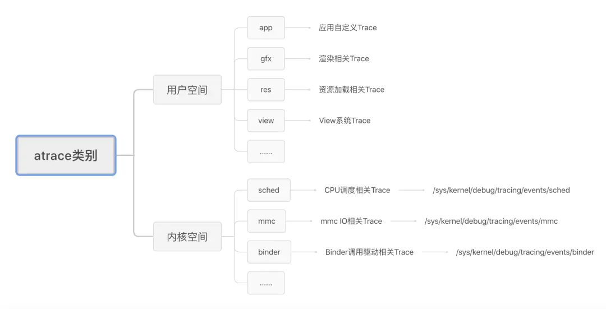


其中：


1. **用户空间的数据**：包括了应用层的自定义 `Trace`、系统层的 `gfx` 渲染相关 `Trace`、系统层打的锁相关的 `Trace` 信息等，其最终都是通过调用 `Android SDK` 提供的`Trace.beginSection`或者 `ATRACE_BEGIN` 记录到同一个文件点`/sys/kernel/debug/tracing/trace_marker` 中的。此节点允许用户层写入字符串，`ftrace` 会记录该写入操作时的时间戳，当用户在上层调用不同函数时，写入不同的调用信息，比如函数进入和退出分别写入，那么 `ftrace` 就可以记录跟踪函数的运行时间（**本质是基于`ftrace`提供的`trace marker`功能实现**）。`atrace` 在处理用户层的多种 `trace` 类别时，只是激活不同的 `TAG`，如选择了 `Graphics`，则激活 `ATRACE_TAG_GRAPHICS`，将渲染事件记录到 `trace_marker`。
2. **内核空间的数据**：**基于`ftrace`的`trace event`功能实现**，当用户用脚本抓取`trace`时给`atrace`传入的参数中包括有`sched`、`mmc`、`binder`等内核`event`相关的事件追踪时，`atrace`进程中就会去写`sys/kernel/debug/tracing/events/`目录下对应的节点去激活`ftrace`抓取对应的`kernel event`。例如选择了`sched`后，`atrace`就会将`sys/kernel/debug/tracing/events/sched/enable`节点的值写为`“1”`，从而激活`ftrace`跟踪内核`CPU`调度相关的所有事件写入`trace`文件。
3. 最终，**上述两大类事件记录都汇集到内核态的同一缓冲中**，`PC` 端上 `Systrace` 工具脚本是通过指定抓取 `trace` 的类别等参数，然后触发手机端的`/system/bin/atrace` 开启对应文件节点的信息，接着 `atrace` 会读取 `ftrace` 的缓存，生成只包含 `ftrace` 信息的 `atrace_raw` 信息，最终通过脚本转换成可视化 `HTML` 文件。

借用一张图描述`Android`系统中生成`Systrace`的可视`html`文件的整个实现流程大致如下图所示：

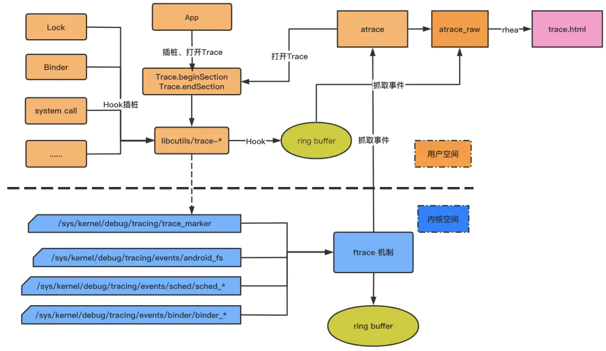


# 4 Systrace抓取方法

开发人员最常用方式是使用`Android`官方`sdk`中提供的名为`systrace.py`的`python`脚本工具抓取`Systrace`报告。

## 4.1 运行环境准备

如需运行 `Systrace`脚本，请先按照如下步骤配置相关运行环境：

1. 从 `Android Studio` [下载并安装最新的 Android SDK 工具](https://links.jianshu.com/go?to=https%3A%2F%2Fdeveloper.android.google.cn%2Fstudio%2Fintro%2Fupdate%23sdk-manager)。
2. 安装 [Python](https://links.jianshu.com/go?to=http%3A%2F%2Fwww.python.org%2F)并将其添加到工作站的 `PATH` 环境变量中。
3. 将 `android-sdk/platform-tools/` 添加到 `PATH` 环境变量。此目录包含由 `systrace` 程序调用的 Android 调试桥二进制文件 (`adb`)。
4. 使用 [USB 调试连接](https://links.jianshu.com/go?to=https%3A%2F%2Fdeveloper.android.google.cn%2Ftools%2Fdevice%23setting-up)将搭载 `Android 4.3`（`API` 级别 `18`）或更高版本的设备连接到开发系统。

## 4.2 命令语法

如需为应用生成`Systrace`的 `HTML` 报告，您需要使用以下语法通过命令行运行 `systrace`：


```css
systrace.py [options] [categories]
```

例如，以下命令会调用 `systrace` 来记录设备活动，并生成一个名为 `mynewtrace.html` 的 `HTML` 报告。此类别列表是大多数设备的合理默认列表。


```css
systrace.py -o mynewtrace.html sched freq idle am wm gfx view binder_driver hal dalvik camera input res
```

常用命令与说明如下：


更多详细的介绍请参见官方使用文档：

[https://developer.android.google.cn/topic/performance/tracing/command-line](https://links.jianshu.com/go?to=https%3A%2F%2Fdeveloper.android.google.cn%2Ftopic%2Fperformance%2Ftracing%2Fcommand-line)

# 参考

Android Systrace 基础知识 - Binder 和锁竞争解读 [https://www.androidperformance.com/2019/12/06/Android-Systrace-Binder/#/Binder-%E6%A6%82%E8%BF%B0](https://links.jianshu.com/go?to=https%3A%2F%2Fwww.androidperformance.com%2F2019%2F12%2F06%2FAndroid-Systrace-Binder%2F%23%2FBinder-%E6%A6%82%E8%BF%B0)
Android Systrace 基础知识 - CPU Info 解读
[https://www.androidperformance.com/2019/12/21/Android-Systrace-CPU#/taskset-%E7%9A%84%E7%94%A8%E6%B3%95](https://links.jianshu.com/go?to=https%3A%2F%2Fwww.androidperformance.com%2F2019%2F12%2F21%2FAndroid-Systrace-CPU%23%2Ftaskset-%E7%9A%84%E7%94%A8%E6%B3%95)
抖音 Android 性能优化系列：新一代全能型性能分析工具 Rhea
[https://mp.weixin.qq.com/s?__biz=MzI1MzYzMjE0MQ==&mid=2247487720&idx=1&sn=4c1dc31b6201e420dcac49250b81055f&chksm=e9d0db0adea7521c9337aacc22877d4e6f33a774499c650f3bfb12ad23ffdc0b8ab6ef40a9a5&scene=21#wechat_redirect](https://links.jianshu.com/go?to=https%3A%2F%2Fmp.weixin.qq.com%2Fs%3F__biz%3DMzI1MzYzMjE0MQ%3D%3D%26mid%3D2247487720%26idx%3D1%26sn%3D4c1dc31b6201e420dcac49250b81055f%26chksm%3De9d0db0adea7521c9337aacc22877d4e6f33a774499c650f3bfb12ad23ffdc0b8ab6ef40a9a5%26scene%3D21%23wechat_redirect)
系统跟踪概览
[https://developer.android.google.cn/topic/performance/tracing](https://links.jianshu.com/go?to=https%3A%2F%2Fdeveloper.android.google.cn%2Ftopic%2Fperformance%2Ftracing)