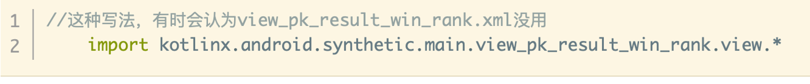
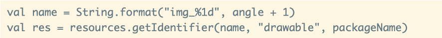

# Android 包体积优化

## 1. 为什么要优化包体积

* **提高应用下载转化率**

据 GooglePlay 平台对外发布相关的包大小对转化率影响的数据，我们可以看到随着包大小的增加，安装转化率总体呈下降的趋势。


* **减少安装时间**

  比如文件拷贝、Library解压，并且，在编译 ODEX 的时候，特别是对于Android 5.0 和 6.0 系统来说，耗费的时间比较久，而Android 7.0 之后有了[混合编译](https://cloud.tencent.com/developer/article/1030971)，相对来说还可以接受。App 变大后，其[签名校验](https://cloud.tencent.com/developer/article/1006237)的时间也会变长

* **降低运行时内存**

​		Resource 资源、Library 以及 Dex 类加载都会占用应用的一部分内存。

## 2. APK 分析

### 2.1 Analyze APK（AS自带）


**适合初期优化定性分析**

- 能够直观地查看到 APK 的组成，譬如大小、占比等等。

- 查看dex文件的组成。

- 对不一样的APK进行对比分析。

### 2.2 [微信APK Checker](https://github.com/Tencent/matrix/wiki/Matrix-Android-ApkChecker)


**Apk分析检测工具,适合分析排查问题以及版本追踪**

- 检测apk是否存在特定的问题

- 输出较为详细的检测结果报告

### 2.3 [android-classshark](https://github.com/google/android-classyshark)


**Apk分析工具，适合优化前期定性分析**

- 可以通过图形化查看整个apk的组成架构

- 可以直观地看到各个包下的方法数和相对大小

- 可以分析动态库依赖和`Dynamic Symbols`


### 2.4 [jadx](https://github.com/skylot/jadx)


**反编译工具，适合优化后验证优化效果**

如编译期间做了字节码修改

### 2.5 [老三套: ApkTool,dex2jar,JD-GUI](https://blog.csdn.net/fengyuzhengfan/article/details/80286704)（不推荐）

反编译工具


## 3. 包体积优化

### 3.1 APK组成

APK 格式，其实质则是一个包含应用所有所需资源的 zip 包，它包含了如下所示的几个组成部分：


我们根据其组成部分各自的特定入手优化。

### 3.2 DEX优化

#### 3.2.1 移除掉所有无用或者功能重复的代码/依赖库

在快速迭代过程中，开发人员可能会不小心引入一些测试代码或者有一些废弃业务已经对用户不可见但代码仍然遗留在代码仓库中，这些代码可能由于虽然不可用，但由于和其他业务有依赖或关联，导致`ProGuard` 过程我们无法`shrink` 掉。

#### 3.2.2 ProGuard

“十个 ProGuard  配置九个坑”，特别是各种第三方 SDK。我们需要仔细检查最终合并的 ProGuard 配置文件，是不是存在 **过度 keep**  的现象。你可以通过下面的方法输出 ProGuard 的最终配置，尤其需要注意各种的` keep *`，很多情况下我们只需要 keep  其中的某个包、某个方法，或者是类名就可以了。

``` shell
-printconfiguration  configuration.txt
```

#### 3.2.3 修改Class 字节码

主要分为两大类：

* 单纯去除无用的代码指令，包括 **去除冗余赋值，无副作用代码删除** 等
* 除了能减少代码指令数量外，同时减少方法和字段的数量，从而有效减少 DEX 的数量。我们知道 DEX 中引用方法数、引用字段数等不能超过 65535，超过之后就需要新开一个 DEX 文件，因此减少 DEX 中方法数、字段数可以减少 DEX 文件数量，像 **短方法内联、常量字段消除、R 常量内联** 就属于这类优化。

> [详细参见ByteX](http://blog.adison.top/android/perf/size/douyin/)

#### 3.2.4 去掉 Debug 信息或者去掉行号

某个应用通过相同的 ProGuard  规则生成一个 Debug 包和 Release 包，其中 Debug 包的大小是 4MB，Release 包只有 3.5MB。既然它们  ProGuard 的混淆与优化的规则是一样的，那它们之间的差异在哪里呢？那就是 `DebugItem`。


DebugItem 里面主要包含两种信息：

* 调试的信息。函数的参数变量和所有的局部变量。

* 排查问题的信息。所有的指令集行号和源文件行号的对应关系。

事实上，在 ProGuard 配置中一般我们也会通过下面的方式保留行号信息。

```she
-keepattributes SourceFile, LineNumberTable
```

对于去除 debuginfo  以及行号信息更详细的分析，可以看一下支付宝的一篇文章 [Android  包大小极致压缩》](https://mp.weixin.qq.com/s/_gnT2kjqpfMFs0kqAg4Qig)。通过这个方法，我们可以实现既保留行号，但是又可以减少大约 5% 的 Dex 体积。事实上，支付宝参考的是 Facebook  的一个开源编译工具[ReDex](https://github.com/facebook/redex)。

### 3.3 资源优化

#### 3.3.1 无用资源删除

应用通过长时间的迭代，总会有一些无用的资源，尽管它们在程序运行过程不会被使用，但是依然占据着安装包的体积。我们可以通过以下方式删除无用资源

* **lint**

  从 Eclipse 时代开始，我们就开始使用Lint这个静态代码扫描工具，它里面就支持 `Unused Resources` 扫描。
  我们既可以通过gradle脚本方式引入
  
  也可以直接直接通过AS执行
  
  然后我们直接选择`“Remove All Unused Resources”`，就可以轻松删除所有的无用资源了。
  
!!! warning "注意"
	* kotlin 兼容性不太好
	  
	* lint扫描工具无法判断出通过反射方式(`android.content.res.Resources#getIdetifier`)来获取的资源，可能会产生误删除
	* 只在application module运行，并且要再次确认资源是否误删
	* 判断是否误删可以通过全局搜索`getIdetifier`或`.view.*`，然后结果和待删除列表进行对比，删除资源后重新编译运行，直到项目完全运行起来

* **shrinkResources**
    * **默认配置** Lint 作为一个静态扫描工具，它最大的问题在于没有考虑到 ProGuard 的代码裁剪。在 ProGuard 过程我们会 shrink 掉大量的无用代码，但是 Lint 工具并不能检查出这些无用代码所引用的无用资源。所以 Android 增加了`shrinkResources`资源压缩功能，它需要配合 ProGurad 的`minifyEnabled`功能同时使用。
      ```shell
      android {
          ...
          buildTypes {
              release {
                  shrinkResources true
                  minifyEnabled true
              }
          }
      }
      ```
    * **开启shrinkResources严格模式** 默认情况下，`Resource shrink` 是 `safe` 模式的，即其会帮助我们识别类似
     
     这样模式的代码，从而保证我们在反射调用资源文件的时候，也是能够安全返回资源的。
     严格模式开启方法：在`res/raw/`目录新建 **keep.xml** ，配置如下
	  
!!! note ""
	**`safe` 模式是通过匹配字符串来确定是否删除资源，例如，以上代码会将所有带` img_` 前缀的资源标记为已使用。但是这也造成了在安全模式下，不小心被某个字符串所匹配到的资源，即使没有被使用也会被保留下来。**
	
!!! warning "注意"
    * **开启严格模式后，如果误删，项目运行时会报`Caused by: java.lang.ClassNotFoundException: android.view.x`，要是发现这样的错误，可以优先考虑是不是严格模式导致**

#### 3.3.2 图片压缩
图片是包体积的其中一个大头，**可以用[cwebp](https://developers.google.com/speed/webp/docs/cwebp)将图片转化成`webp`格式 ，对于不能转化为`webp`格式的图片，`png`图片可以使用[pngquant](https://github.com/kornelski/pngquant)压缩，`jpg`图片可以[guetzli](https://github.com/google/guetzli)压缩**。我们可以通过gradle插件将这一过程通过自动化。

**原理大致如下**：

在 apk 打包过程中，经过 `aapt(Android 资源打包工具)`处理之后，我们的资源文件，包括manifest文件都会被打包成一个压缩包，名字叫做 `resources.ap_`。

了解资源打包原理后，关键就是找到hook点，我们可以直接hook打包任务，也就是 `packageXXX`任务，然后 **`解压 xx.ap_文件 --> 全局压缩资源 --> 重新压缩xx.ap_文件`**。大致hook代码如下：
  
!!! warning "注意"
    网上盛传的hook `mergeResourceXXX`任务不是好时机，需要兼容并行编译，可能编译过程会出现资源找不到的异常

!!! note ""
    * 使用webp的时候需要注意，当图片有渐变和外发光并且通过tinypng压缩，再转webp格式，图片就会变大。原因如下：
        * **Type变更**：原图的Type为Palette，处理之后的Type为TrueColor，即原图为索引类型，处理之后的图片为RGB真彩色，需要编码的像素点个数是索引类型的三倍，因此导致图片变大
        * **Colors变多**：颜色数目由256增长到了67000多个，说明处理前的图片细节上重复较多，导致了处理后的图片比原图还大了很多。
        * [参考](https://juejin.cn/post/6844903685223350279#heading-3)

#### 3.3.3 arsc压缩
这块主要使用[AndResGuard](https://github.com/shwenzhang/AndResGuard)工具。

**resources.arsc原理简述**

可以把它看作一张资源索引表，它和我们的R文件是相关联的，简单来说R.java中的id（`0xPPTTEEEE`）存在于`resources.arsc`文件中的id数组，然后id数组映射字符串常量池，即可找到id对应的值。它会被我们Java层的`AssetManager`加载，如果有过插件化开发经验的同学应该知道，它是通过`addAssetPath`这个方法去加载的。

* **资源混淆**
既然资源 id 与资源全路径的映射关系记录在 arsc 文件中，app 通过资源 id 再通过 Resource 获取对应的资源，所以对于映射关系中的资源路径做名字混淆可以达到减少包体积的效果。例如将`res/drawable/welcome.png`混淆为`r/s/a.png`

* **合并重复资源**
对 md5 相同的资源文件保留一份，删除其余的重复的文件，然后在写入arsc文件时将删除的资源文件对应的资源路径指向唯一保留的那一份资源文件。

* **删除无用Name**
`resources.arsc`文件中的name列在编译之后，大部分情况是用不上的，除非是通过`getIdentifier`调用，我们可以把通过 `getIdentifier` 调用的资源，配置成白名单。遍历 `name` 项，如果不在白名单，那么把`name`列混淆成相同的名字，例如`a`，这样可以减少string常量池的大小，

#### 3.3.4 资源动态下载
将一些图片资源放在服务器，结合图片预加载，这样既能够满足产品的需求，同时也能够减少包大小。

### 3.4 so优化
#### 3.4.1 只引入单一架构文件
目前，Android 一共 支持7种不一样类型的 CPU 架构，好比常见的 `armeabi、armeabi-v7a、X86`等等。理论上来讲，对应架构的 CPU 它的执行效率是最高的，可是这样会致使 在 lib 目录下会多存放了各个平台架构的 So 文件，因此 App 的体积也就更大了。目前手机市场上，`x86 / x86_64/armeabi/mips / mips6` 的架构的手机占用量极低，基本可以不不考虑了，我们在 build.gradle 中配置 去设置 App 支持的 So 架构，其配置代码以下所示：
```shell
defaultConfig {
        ndk {
            abiFilters 'armeabi-v7a','arm64-v8a'
        }
    }

```
#### 3.4.2 裁剪so
* **精简动态符号表**
  正常情况下编译出的共享库包含了所有的符号信息与调试信息，对于开发和调试会非常方便。但系统真正用到的仅仅是部分动态符号表，动态符号表是 so 与外部进行连接的“桥梁”，其中的导出表相当于是 so 对外暴露的接口。我们需要确定动态依赖的 so 依赖了哪些符号，仅保留这些被依赖的符号即可。
* **移除无用代码**
  在实际的项目中，有一些代码在 Release 版中永远不会被使用到, 例如历史遗留代码、用于测试的代码等, 删除无用代码的潜在收益较大。
* **优化指令长度**
  实现某个功能的指令并不是固定的，编译器有可能能用更少的指令完成相同的功能，从而实现优化。由于指令是 so 的主要组成部分，因此优化这一部分的潜在收益也比较大。

#### 3.4.3 提取多 so 共同依赖库
当多个 so 以静态方式依赖了某个相同的库时，可以考虑将此库提取成一个单独的 so，原来的几个 so 改为动态依赖该 so。例如 `liba.so` 和 `libb.so` 都静态依赖了 `libx.a`，可以优化为 `liba.so` 和 `libb.so` 均动态依赖 `libx.so`。提取多 so 共同依赖库，可以对不同 so 内的相同代码进行合并，从而减小总的 so 体积。

这里典型的例子是 `libc++` 库：如果存在多个 so 都静态依赖 libc++ 库的情况，可以优化为这些 so 都动态依赖于 `libc++_shared.so`。

## 4. 包体积监控
1. **大小监控**
    * **实时告警**
    当同一构建环境构建出来的包之间包体积增长达到阈值，通过飞书/企业微信机器人实时告警。
    * **对比分析，问题检测**
    基于[微信APK Checker](https://github.com/Tencent/matrix/wiki/Matrix-Android-ApkChecker)进行定制，二次开发，生成网页报告，对比前后构建size变化，同时检测大文件，大图片等问题
    

2. **依赖监控**
    开发过程中，引入的依赖库可能是需要评估的，如
    * 超大的开源库
    * 和已有库功能重合度较高
    * 只用到依赖库中很小一块功能
    
    所以依赖也是监控的重点，一方面我们也跟大小监控一样，通过IM工具实时获知是否引入了新的依赖库和其大小，另外我们还可以把应用依赖库情况上报APM后台，在APM面板展示版本依赖情况以及建立依赖树
    
3. **版本监控**
我们需要记录每一个release版本的包体积以及包体报告，通过APM面板进行图表展示，以便版本对比和回顾

## 5. 还有
实践过程中，除了以上这些优化方案，还有一些由于某些限制或者暂时验证失败的方案。

* **[R8](https://developer.android.com/studio/build/shrink-code?hl=zh-cn#configuration-files) 开启完全模式**
R8是替代`ProGuard`的Android 混淆工具，若是当前使用的是 Android Studio 3.4 或 Android Gradle 插件 3.4.0 及其更高版本，R8 会做为默认编译器。
通过以下配置可以启用R8额外的优化功能
```shell
android.enableR8.fullMode=true
```
!!! note "实践问题"
    * 这些额外的优化功能会使 R8 的行为与 ProGuard 不同，因此可能会需要添加额外的 ProGuard 规则。目前项目发现某些依赖库的混淆文件和它有冲突，会导致错误。

* **使用[ReDex](https://github.com/facebook/redex)**
Facebook开源的工具包，专门用于 Android 字节码的优化，可以进一步对dex进行混淆压缩
，体积变得更小，运行速度变得更快。
!!! note "实践问题"
    * redex没有提供现成的编译产物，需要使用者⾃⾏源码编译;编译过程会有不少坑，依赖的版本，权限等; 整个编译过程需要花费2个小时左右
    * 默认配置对包体积贡献不大，实践来说仅仅减少了500K
    * 实践过程中无论是默认配置还是自定义配置都遇到各种错误
    * 会对现有打包流程有影响
    * 综合来说，接入性价比比较低，但 redex的确是很硬核的牛逼的库，值得深入研究
    * 抖音[参考实践](https://www.51cto.com/article/710484.html)

* **统一应用风格**
如设定统一的 字体、尺寸、颜色和按钮按压效果、分割线 shape、selector 背景 等等。这样可以减少资源数量。
!!! note "实践问题"
    需要UI设计团队配合
* **使用针对性的图片格式**
使用矢量图片以后，它可以有效的减小应用中图片所占用的大小，矢量图形在 Android 中表示为 `VectorDrawable` 对象。它仅仅需100字节的文件便可以生成屏幕大小的清晰图像，可是，Android 系统渲染每一个 `VectorDrawable` 对象须要大量的时间，而较大的图像须要更长的时间。 所以，建议 只有在显示纯色小 icon 时才考虑使用矢量图形。
**VD（纯色icon）->WebP（非纯色icon）->Png（更好效果） ->jpg（若无alpha通道）**
!!! note "实践问题"
    已经做了图片自动压缩，评估收益不大

* **So 动态下载**
将部分 So 文件使用动态下发的形式进行加载
可以参考腾讯Bugly的[实践](https://mp.weixin.qq.com/s/X58fK02imnNkvUMFt23OAg)
!!! note "实践问题"
    Google play不允许动态下发代码和资源

## 参考
[Android 开发高手课](https://time.geekbang.org/column/article/81202)


 
        

    
