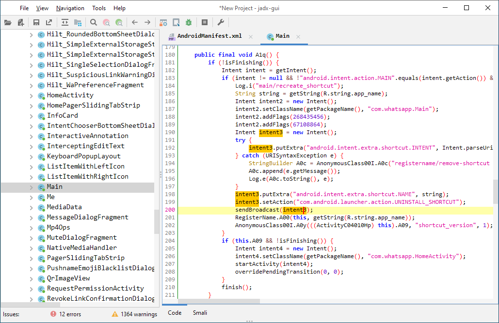

# Android 包体积优化

## 1. 为什么要优化包体积

* **提高应用下载转化率**

据 GooglePlay 平台对外发布相关的包大小对转化率影响的数据，我们可以看到随着包大小的增加，安装转化率总体呈下降的趋势。


* **减少安装时间**

  比如文件拷贝、Library解压，并且，在编译 ODEX 的时候，特别是对于Android 5.0 和 6.0 系统来说，耗费的时间比较久，而Android 7.0 之后有了[混合编译](https://cloud.tencent.com/developer/article/1030971)，相对来说还可以接受。App 变大后，其[签名校验](https://cloud.tencent.com/developer/article/1006237)的时间也会变长

* **降低运行时内存**

​		Resource 资源、Library 以及 Dex 类加载都会占用应用的一部分内存。

## 2. APK 分析

### 2.1 Analyze APK（AS自带）


**适合初期优化定性分析**

- 能够直观地查看到 APK 的组成，譬如大小、占比等等。

- 查看dex文件的组成。

- 对不一样的APK进行对比分析。

### 2.2 [微信APK Checker](https://github.com/Tencent/matrix/wiki/Matrix-Android-ApkChecker)


**Apk分析检测工具,适合分析排查问题以及版本追踪**

- 检测apk是否存在特定的问题

- 输出较为详细的检测结果报告

### 2.3 [android-classshark](https://github.com/google/android-classyshark)


**Apk分析工具，适合优化前期定性分析**

- 可以通过图形化查看整个apk的组成架构

- 可以直观地看到各个包下的方法数和相对大小

- 可以分析动态库依赖和`Dynamic Symbols`


### 2.4 [jadx](https://github.com/skylot/jadx)



**反编译工具，适合优化后验证优化效果**

如编译期间做了字节码修改

### 2.5 [老三套: ApkTool,dex2jar,JD-GUI](https://blog.csdn.net/fengyuzhengfan/article/details/80286704)（不推荐）

反编译工具


## 3. 包体积优化

### 3.1 APK组成

APK 格式，其实质则是一个包含应用所有所需资源的 zip 包，它包含了如下所示的几个组成部分：


我们根据其组成部分各自的特定入手优化。

### 3.2 DEX优化

#### 3.2.1 移除掉所有无用或者功能重复的代码/依赖库

在快速迭代过程中，开发人员可能会不小心引入一些测试代码或者有一些废弃业务已经对用户不可见但代码仍然遗留在代码仓库中，这些代码可能由于虽然不可用，但由于和其他业务有依赖或关联，导致`ProGuard` 过程我们无法`shrink` 掉。

#### 3.2.2 ProGuard

“十个 ProGuard  配置九个坑”，特别是各种第三方 SDK。我们需要仔细检查最终合并的 ProGuard 配置文件，是不是存在**过度 keep**  的现象。你可以通过下面的方法输出 ProGuard 的最终配置，尤其需要注意各种的` keep *`，很多情况下我们只需要 keep  其中的某个包、某个方法，或者是类名就可以了。

``` shell
-printconfiguration  configuration.txt
```

#### 3.2.3 修改Class 字节码

主要分为两大类：

* 单纯去除无用的代码指令，包括**去除冗余赋值，无副作用代码删除**等
* 除了能减少代码指令数量外，同时减少方法和字段的数量，从而有效减少 DEX 的数量。我们知道 DEX 中引用方法数、引用字段数等不能超过 65535，超过之后就需要新开一个 DEX 文件，因此减少 DEX 中方法数、字段数可以减少 DEX 文件数量，像**短方法内联、常量字段消除、R 常量内联**就属于这类优化。

> []
