# Pycharm远程调试

## 动机

1. 一些bug由于本地环境和线上环境的不一致可能导致本地无法复现
2. 本地依赖和线上依赖版本不一致也可以导致一些问题
3. 有时一些bug跟数据相关，本地数据无法和线上数据一致
4. 有些三方平台会验证服务器的合法性或者异步回调结果，如微信支付，这时候本地无法测试

如上所诉，要是有一个很方便调试远程服务器的方法，岂不美哉。通过PyCharm我们可以很方便地实现远程调试，下面详细介绍下PyCharm这个牛叉的功能。

## 添加远程部署

1. 打开pycharm，tools-->Deployment-->Configuration
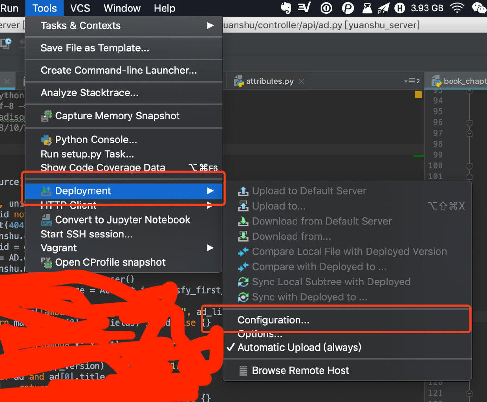

2. 点击左边“+”添加远程服务器，随便起个名字，选择SFTP
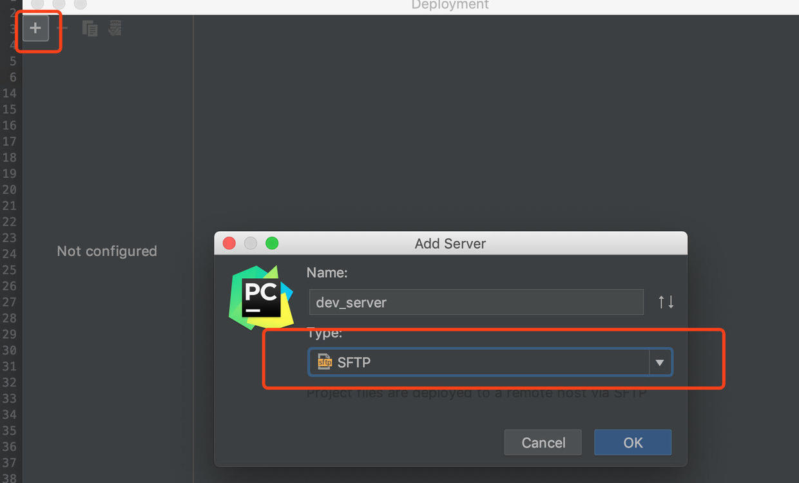

3. 配置connection
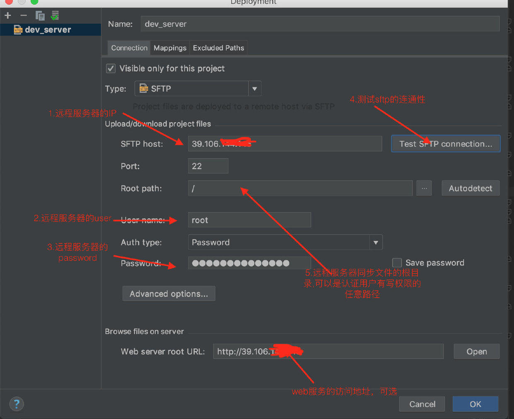

4. 配置Mappings
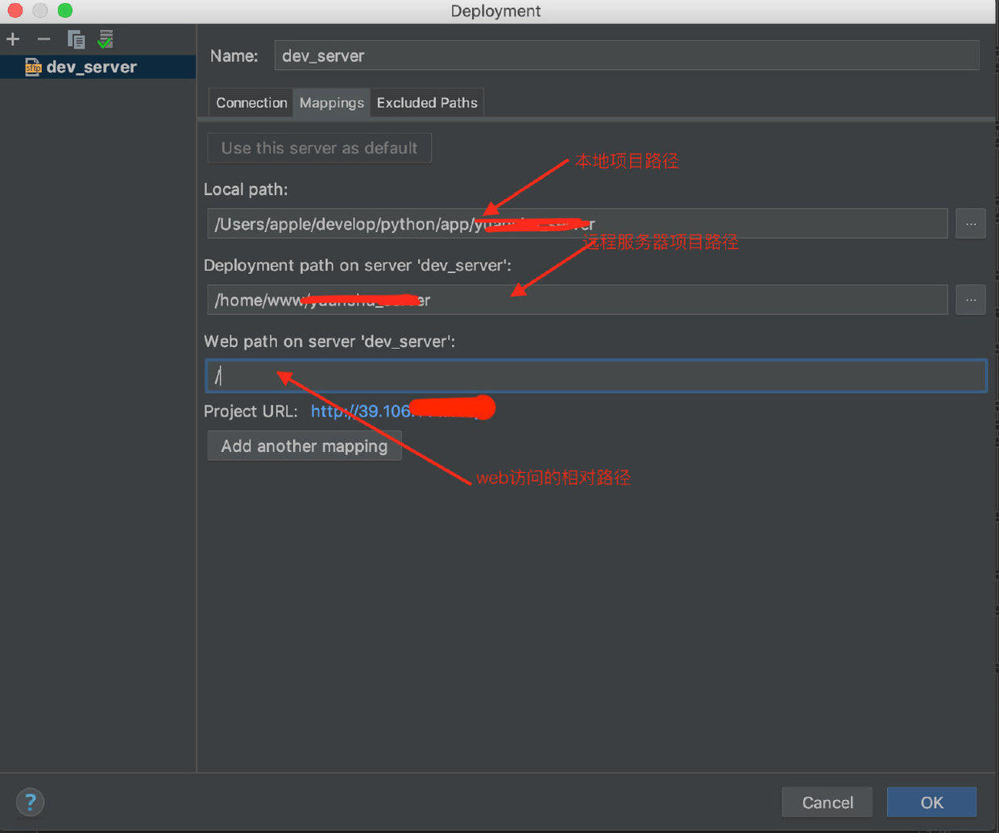

5. 配置Excluded Paths（可选）
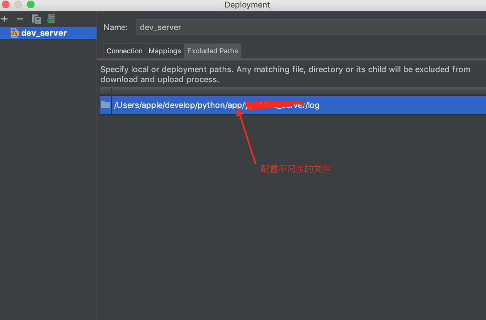

最后点击OK即可

再次打开部署选项，可以发现现在可以直接部署代码到服务器了，也可以直接下载带代码到本地，同时自动上传（Automatic Upload）是默认勾选的，我一般会把它去掉，防止一些本地测试代码上传上去

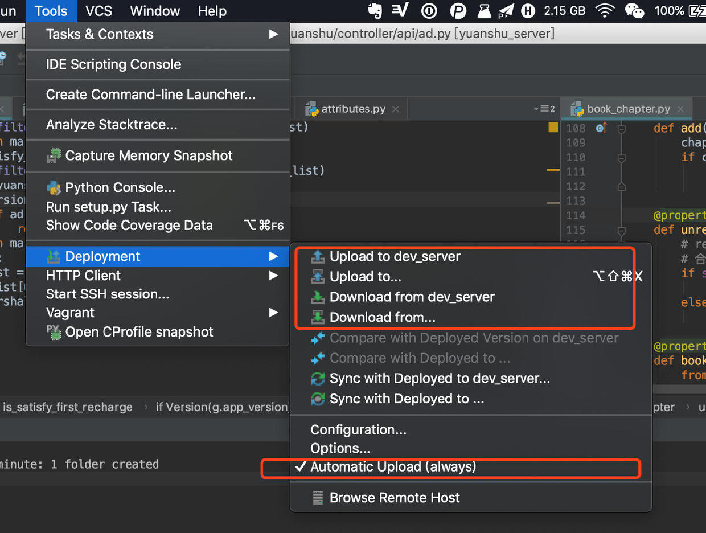

新增一个文件，查看deployment 选项，这时候就可以上传到远程服务器了

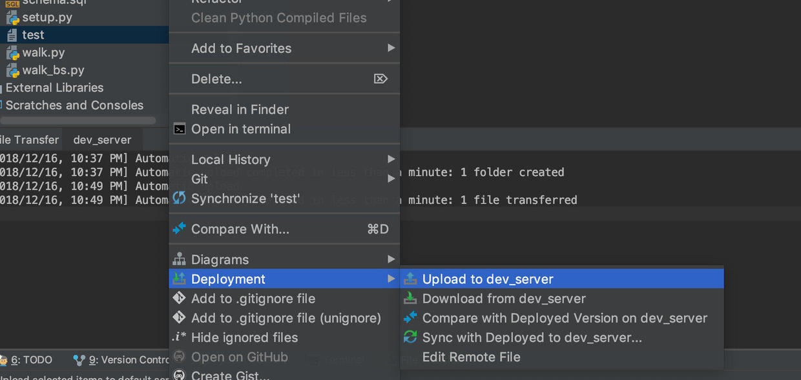


## 添加远程解释器

远程部署仅仅只是同步和拷贝文件，要真正实现远程调试还需要配置远程解释器

1. 设置页面找到“Project Interpreter” --> 设置-->Add
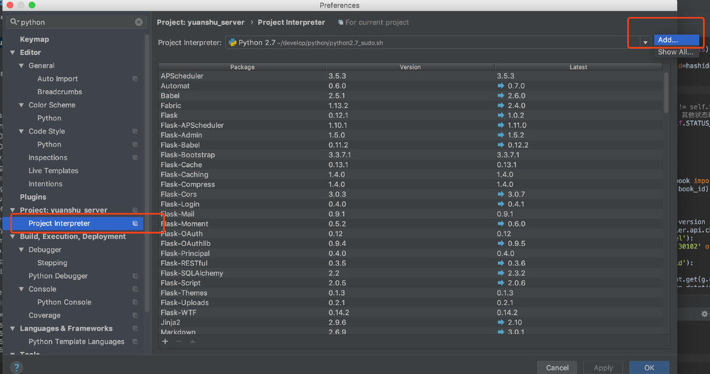

2. 选择“SSH Interpreter” --> "Existing server configuration" --> 选择刚才创建的部署配置，使用‘’Create“或者”Move“ 都OK
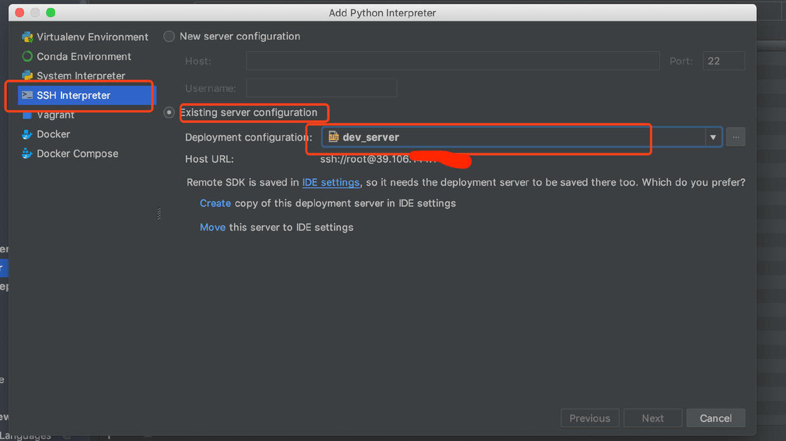

3. 点击下一步，这时会进行连接远程服务器，稍等一会，会出现以下界面，稍微配置下，点击“Finish”即可
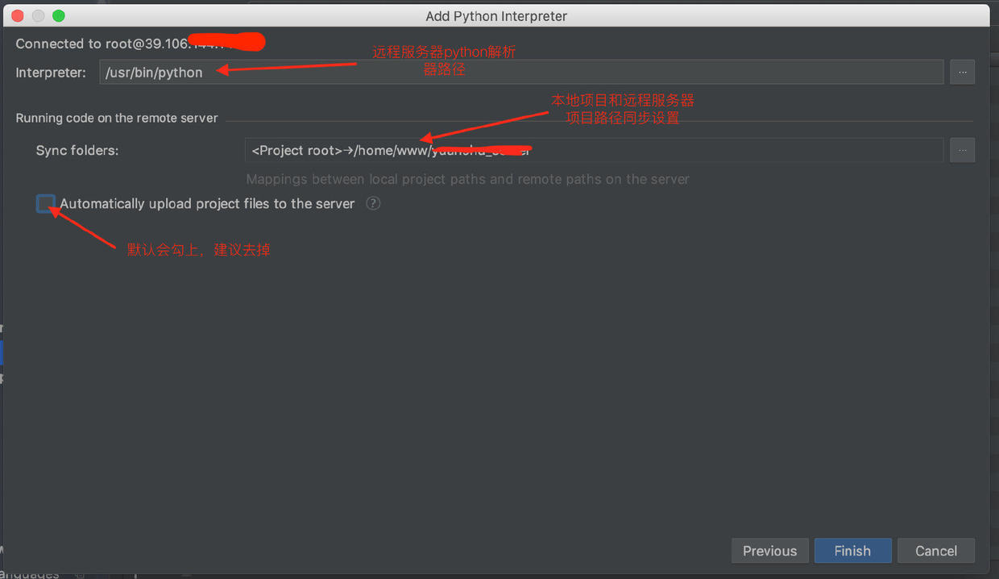

最后使用远程解释器,点击“OK”，返回到项目界面，等待同步完成即可
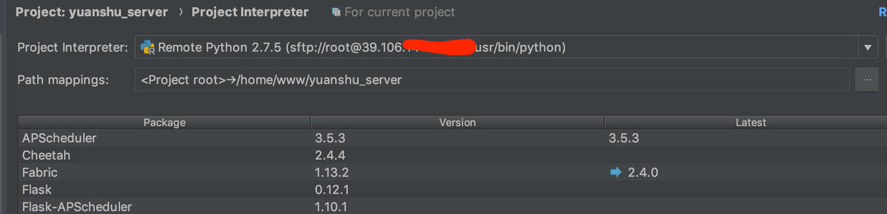


## 远程调试

> 这里根据自己的具体项目情况而定，我这里是 **Flask+阿里云+nginx+运行脚本** 的一个例子

1. 新增一个 run configuration
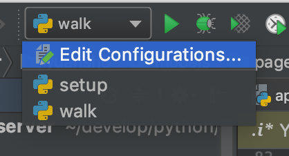
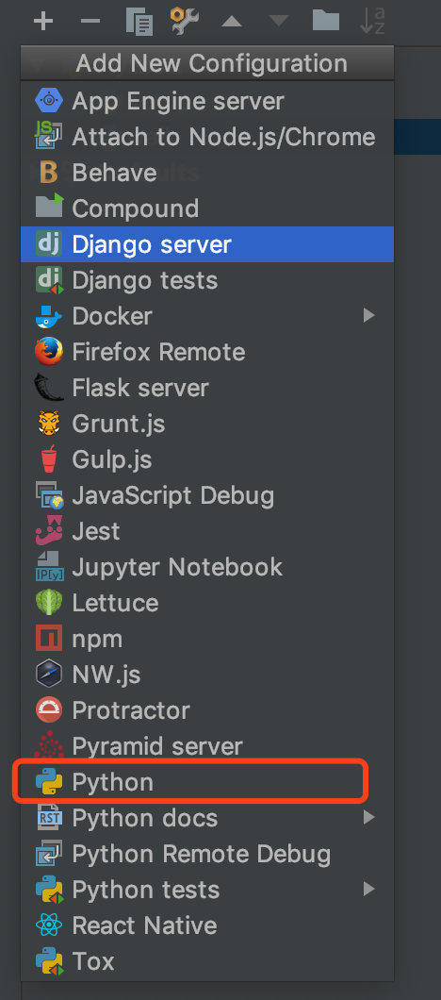
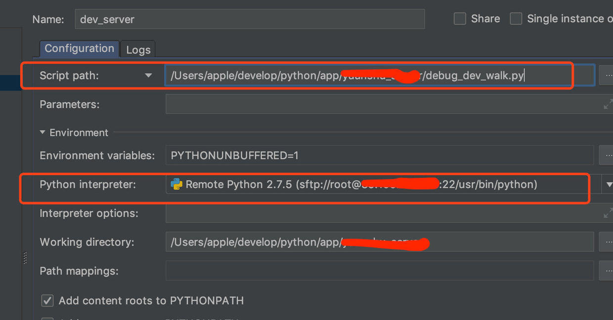
2. 运行脚本代码如下，这里使用了8000的端口
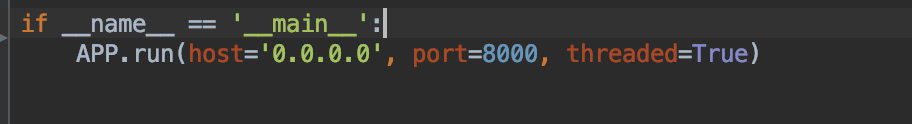
> **Host要配置为0.0.0.0**

3. nginx 配置8000 端口
```shell
    server {
        listen       8000 ;
        listen       [::]:8000 ;
        server_name  _;
        root         /usr/share/nginx/html;
        access_log  /var/log/nginx/access_8000.log  main;
        error_log  /var/log/nginx/error_8000.log;

        # Load configuration files for the default server block.
        include /etc/nginx/default.d/*.conf;
        location / {
		proxy_pass http://127.0.0.1:8000;
		proxy_set_header Host $host;
		proxy_set_header X-Forwarded-For $proxy_add_x_forwarded_for;
        }

        error_page 404 /404.html;
            location = /40x.html {
        }

        error_page 500 502 503 504 /50x.html;
            location = /50x.html {
        }
    }
```

4. 要是使用阿里云，还需要安全组开放8000 端口
5. 断点运行

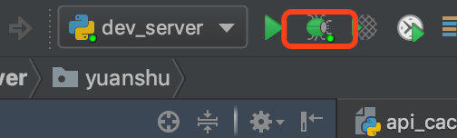


6. 出现上图所示的时候，恭喜你，你已经可以断点调试远程服务器了

我们打一个断点，然后试着访问一个API服务：http://xx.xx.xx.xx:8000/api/pages/bookstore

完美断上

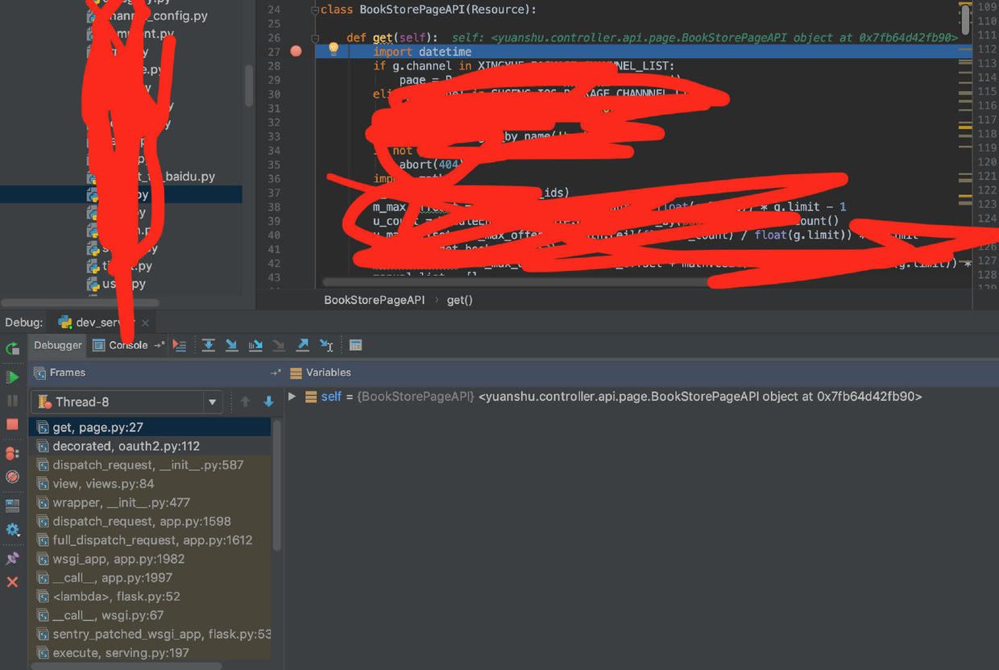

## 补充说明

不建议在正式服务器使用这个功能，可以在测试服务器使用