# 讲清楚5G，这可能是最接地气的一篇了

## 一个简单且神奇的公式

今天的故事，从一个公式开始讲起。

这是一个既简单又神奇的公式。说它简单，是因为它一共只有3个字母。而说它神奇，是因为这个公式蕴含了博大精深的通信技术奥秘，这个星球上有无数的人都在为之魂牵梦绕。

这个公式，就是它——

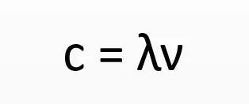

我相信很多同学都认出这个公式了，如果没认出来，而且你又是一个理科生的话，请记得有空多给你的中学物理老师打打电话！

解释一下，上面这个公式，这是物理学的基本公式，**光速=波长×频率**。

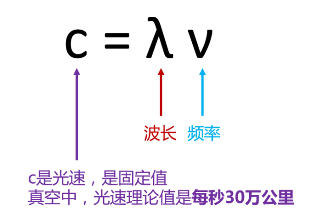

对于这个公式，可以这么说：无论是1G、2G、3G，还是4G、5G，万变不离其宗，全部都是在它身上做文章，没有跳出它的“五指山”。

且听我慢慢道来。。。

## 有线？无线？

通信技术，无论什么黑科技白科技，归根到底，就分为两种——**有线通信和无线通信。**

我和你打电话，信息数据要么在空中传播（看不见、摸不着），要么在实物上传播（看得见、摸得着）。

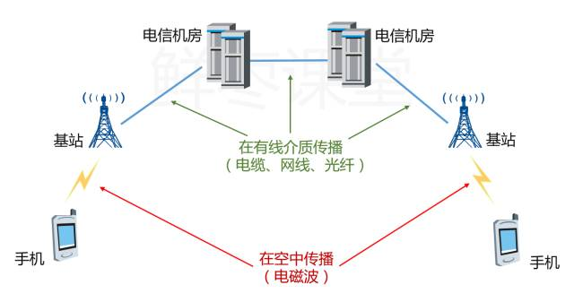

如果是在实体物质上传播，就是有线通信，基本上就是用的铜线、光纤这些线缆，统称为有线介质。

在有线介质上传播数据，速率可以达到很高的数值。 

以光纤为例，在实验室中，单条光纤最大速度已达到了26Tbps。。。是传统网线的两万六千倍。。。

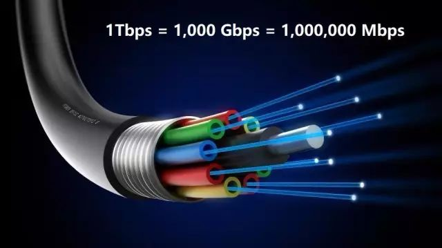

而 **空中传播** 这部分，才是移动通信的瓶颈所在。

目前主流的移动通信标准，是4G LTE，理论速率只有150Mbps（不包括载波聚合）。这个和有线是完全没办法相比的。

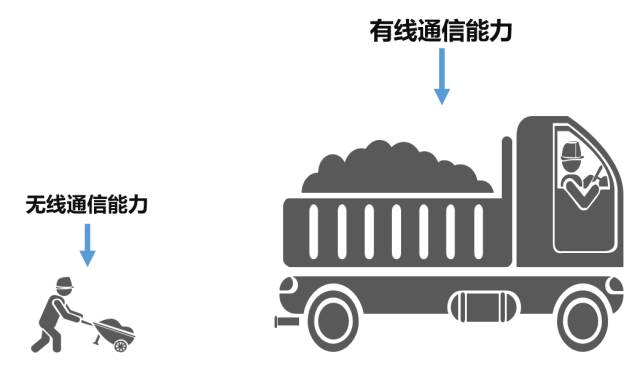

所以，**5G如果要实现端到端的高速率，重点是突破无线这部分的瓶颈**。

## 好大一个波

大家都知道，无线通信就是利用电磁波进行通信。电波和光波，都属于电磁波。

电磁波的功能特性，是由它的频率决定的。不同频率的电磁波，有不同的属性特点，从而有不同的用途。

例如，高频的γ射线，具有很大的杀伤力，可以用来治疗肿瘤。

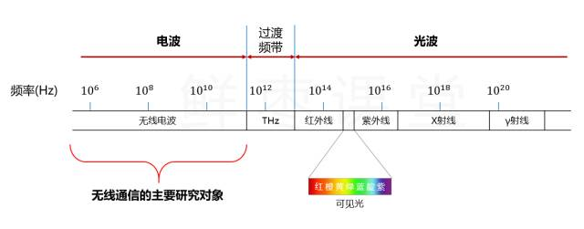

我们目前主要使用 **电波** 进行通信。当然，光波通信也在崛起，例如LiFi（Light Fidelity），可见光通信。

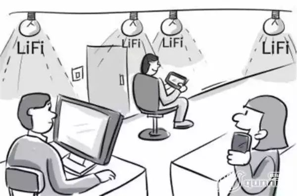

不偏题，回到电波先。

电波属于电磁波的一种，它的频率资源是有限的。

为了避免干扰和冲突，我们在电波这条**公路**上进一步划分**车道**，分配给不同的对象和用途。

 

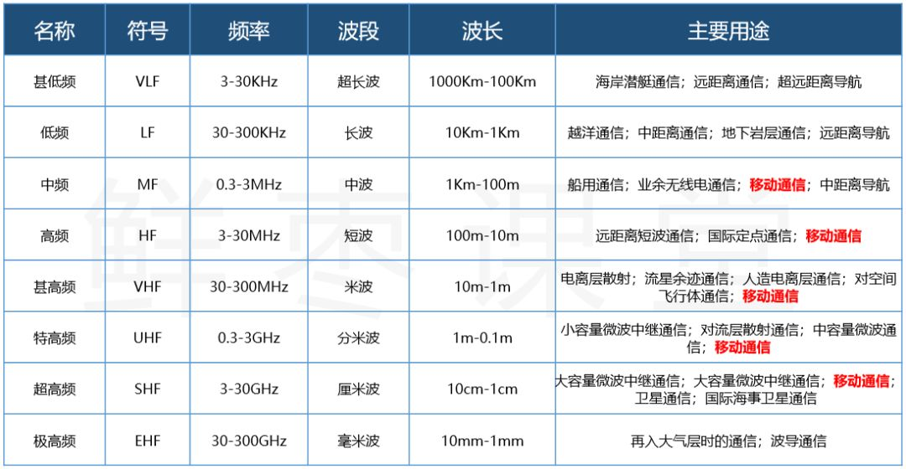

请大家注意上面图中的红色字体。一直以来，我们主要是用**中频~超高频**进行手机通信的。

例如经常说的“**GSM900**”、“**CDMA800**”，其实意思就是指，工作频段在900MHz的GSM，和工作频段在800MHz的CDMA。

目前全球主流的4G LTE技术标准，属于特高频和超高频。

我们国家主要使用超高频：

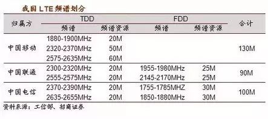

大家能看出来，随着1G、2G、3G、4G的发展，使用的电波频率是越来越高的。

这是为什么呢？

这主要是因为，频率越高，能使用的频率资源越丰富。频率资源越丰富，能实现的传输速率就越高。

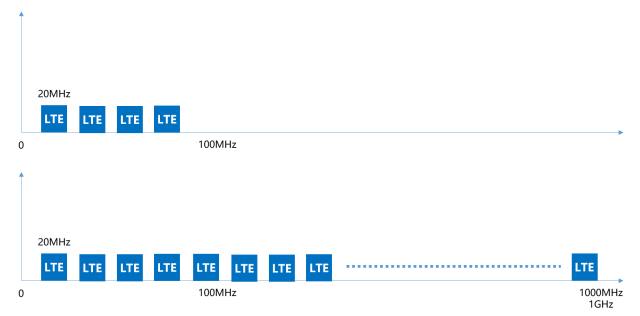

**更高**的频率→**更多**的资源→**更快**的速度

应该不难理解吧？频率资源就像车厢，越高的频率，车厢越多，相同时间内能装载的信息就越多。

那么，5G使用的频率具体是多少呢？

如下图所示：

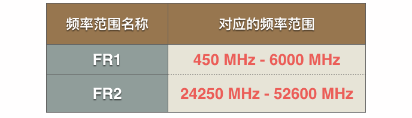

5G的频率范围，分为两种：一种是6GHz以下，这个和目前我们的2/3/4G差别不算太大。还有一种，就很高了，在24GHz以上。

目前，国际上主要使用28GHz进行试验（这个频段也有可能成为5G最先商用的频段）。

如果按28GHz来算，根据前文我们提到的公式：

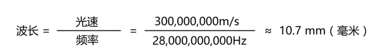

好啦，这个就是5G的第一个技术特点—— 

**毫 米 波**

请允许我再发一遍刚才那个频率对照表：

请注意看最下面一行，是不是就是**“毫米波”**？

继续，继续！

好了，既然，频率高这么好，你一定会问：“为什么以前我们不用高频率呢？”

原因很简单——不是不想用，是用不起。

**电磁波的显著特点：频率越高，波长越短，越趋近于直线传播（绕射能力越差）。频率越高，在传播介质中的衰减也越大。**

你看激光笔（波长635nm左右），射出的光是直的吧，挡住了就过不去了。

再看卫星通信和GPS导航（波长1cm左右），如果有遮挡物，就没信号了吧。

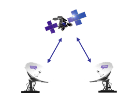

> 卫星那口大锅，必须校准瞄着卫星的方向，否则哪怕稍微歪一点，都会影响信号质量。

移动通信如果用了高频段，那么它最大的问题，就是**传输距离大幅缩短，覆盖能力大幅减弱**。

覆盖同一个区域，需要的5G基站数量，将大大超过4G。

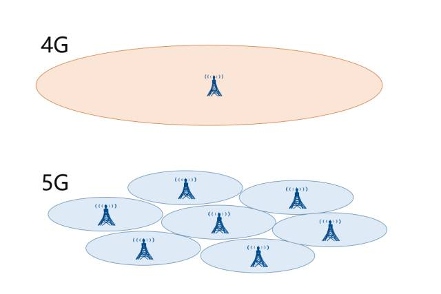

基站数量意味着什么？钱啊！投资啊！成本啊！

频率越低，网络建设就越省钱，竞争起来就越有利。这就是为什么，这些年，电信、移动、联通为了低频段而争得头破血流。

有的频段甚至被称为——**黄金频段**。

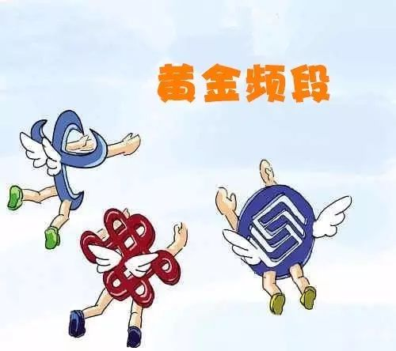

这也是为什么，5G时代，运营商拼命怼设备商，希望基站降价。（如果真的上5G，按以往的模式，设备商就发大财了。）

所以，基于以上原因，在高频率的前提下，为了减轻网络建设方面的成本压力，5G必须寻找新的出路。

出路有哪些呢？

首先，就是微基站。 

**微 基 站**

基站有两种，微基站和宏基站。看名字就知道，微基站很小，宏基站很大！

宏基站：
室外常见，建一个覆盖一大片

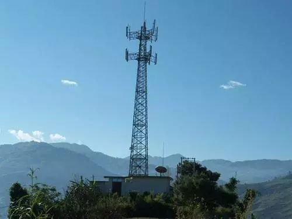

微基站：

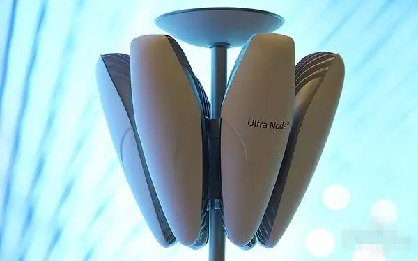

看上去是不是很酷炫？

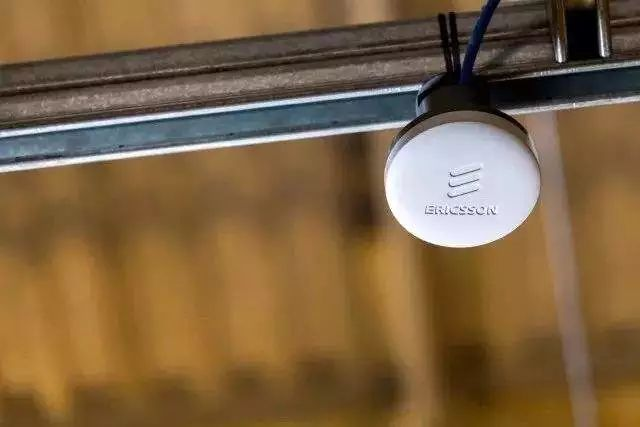

还有更小的，巴掌那么大

其实，微基站现在就有不少，尤其是城区和室内，经常能看到。

以后，到了5G时代，微基站会更多，到处都会装上，几乎随处可见。

你肯定会问，那么多基站在身边，会不会对人体造成影响？

我的回答是——不会。

其实，和传统认知恰好相反，事实上，基站数量越多，辐射反而越小！ 

你想一下，冬天，一群人的房子里，一个大功率取暖器好，还是几个小功率取暖器好？

大功率方案

▼

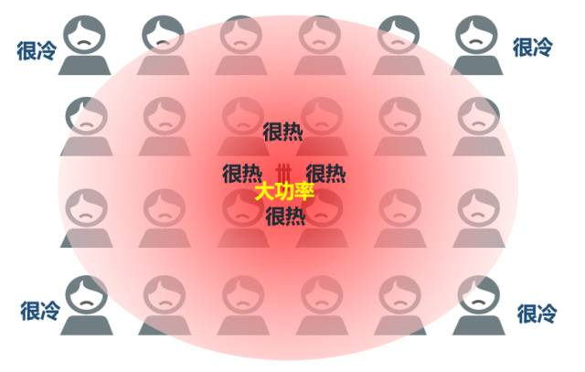

小功率方案

▼

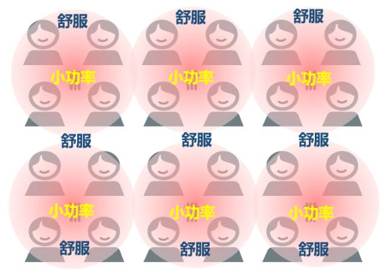

上面的图，一目了然了。基站小，功率低，对大家都好。如果只采用一个大基站，离得近，辐射大，离得远，没信号，反而不好。

## 天线去哪了？

大家有没有发现，以前大哥大都有很长的天线，早期的手机也有突出来的小天线，为什么现在我们的手机都没有天线了？

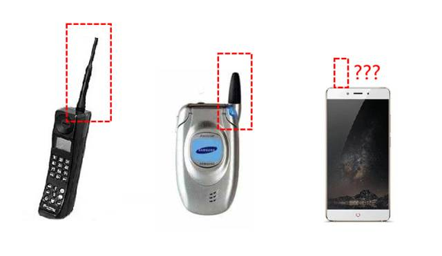

其实，我们并不是不需要天线，而是我们的天线变小了。

**根据天线特性，天线长度应与波长成正比，大约在1/10~1/4之间。**

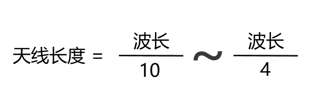

随着时间变化，我们手机的通信频率越来越高，波长越来越短，天线也就跟着变短啦！ 

毫米波通信，天线也变成毫米级。。。

这就意味着，天线完全可以塞进手机的里面，甚至可以塞很多根。。。

这就是5G的第三大杀手锏—— 

**Ｍassive MIMO（多天线技术）**

MIMO就是“多进多出”（Multiple-Input Multiple-Output），多根天线发送，多根天线接收。

在LTE时代，我们就已经有MIMO了，但是天线数量并不算多，只能说是初级版的MIMO。

到了5G时代，继续把MIMO技术发扬光大，现在变成了加强版的**Massive　MIMO**（Massive：大规模的，大量的）。

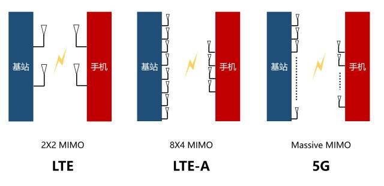

手机里面都能塞好多根天线，基站就更不用说了。

以前的基站，天线就那么几根：

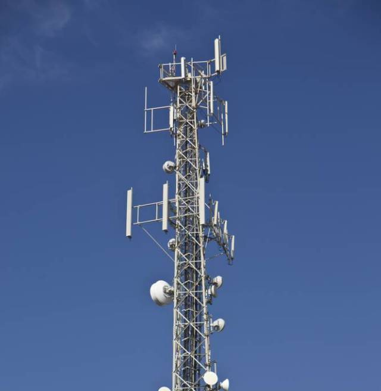

5G时代，天线数量不是按根来算了，是按“阵”。。。“天线阵列”。。。一眼看去，要得密集恐惧症的节奏。。。

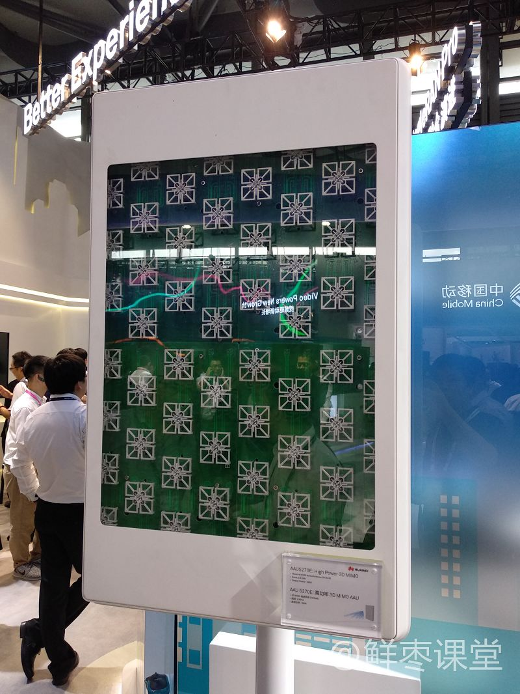

不过，天线之间的距离也不能太近。

**因为天线特性要求，多天线阵列要求天线之间的距离保持在半个波长以上。如果距离近了，就会互相干扰，影响信号的收发**。

## 你是直的？还是弯的？

大家都见过灯泡发光吧？　

其实，基站发射信号的时候，就有点像灯泡发光。

信号是向四周发射的，对于光，当然是照亮整个房间，如果只是想照亮某个区域或物体，那么，大部分的光都浪费了。。。

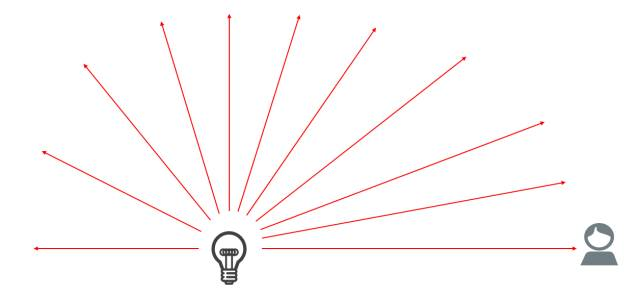

基站也是一样，大量的能量和资源都浪费了。 

我们能不能找到一只无形的手，把散开的光束缚起来呢？ 

这样既节约了能量，也保证了要照亮的区域有足够的光。

答案是：可以。

这就是——

**波 束 赋 形**

!!! notes "波束赋形"

    在基站上布设天线阵列，通过**对射频信号相位的控制**，使得相互作用后的电磁波的波瓣变得非常狭窄，并指向它所提供服务的手机，而且能跟据手机的移动而转变方向。
    
    这种空间复用技术，由全向的信号覆盖变为了精准指向性服务，波束之间不会干扰，在相同的空间中提供更多的通信链路，极大地提高基站的服务容量。

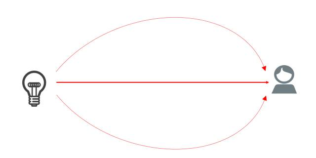

直的都能掰成弯的。。。还有什么是通信砖家干不出来的？

## 别收我钱，行不行？

在目前的移动通信网络中，即使是两个人面对面拨打对方的手机（或手机对传照片），信号都是通过基站进行中转的，包括控制信令和数据包。。。　

而在5G时代，这种情况就不一定了。

5G的第五大特点——D2D，也就是Device to Device（设备到设备）。

**Ｄ２Ｄ**

5G时代，同一基站下的两个用户，如果互相进行通信，他们的数据将不再通过基站转发，而是直接手机到手机。。。

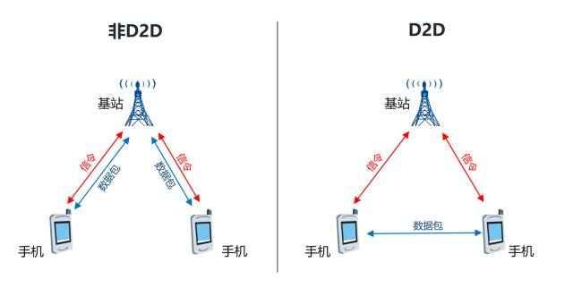

这样，就节约了大量的空中资源，也减轻了基站的压力。 

不过，如果你觉得这样就不用付钱，那你就图样图森破了。

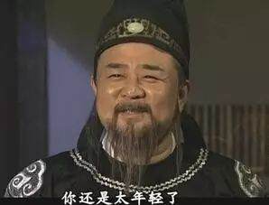

控制消息还是要从基站走的，你用着频谱资源，运营商爸爸怎么可能放过你。。。

## 后记

洋洋洒洒写的有点多。。。

能看到这的，都是真爱啊。。。

相信大家通过本文，对5G和她背后的通信知识已经有了深刻的理解。而这一切，都只是源于一个小学生都能看懂的数学公式。不是么？

通信技术并不神秘，5G作为通信技术皇冠上最耀眼的宝石，也不是什么遥不可及的创新革命技术，它更多是对现有通信技术的演进。

正如一位高人所说——

> 通信技术的极限，并不是技术工艺方面的限制，而是建立在严谨数学基础上的推论，在可以遇见的未来是基本不可能突破的。

如何在科学原理的范畴内，进一步发掘通信的潜力，是通信行业众多奋斗者们孜孜不倦的追求。

## 参考
摘自 https://mp.weixin.qq.com/s/bPNuEbwZZS9uS5bKmHskTw