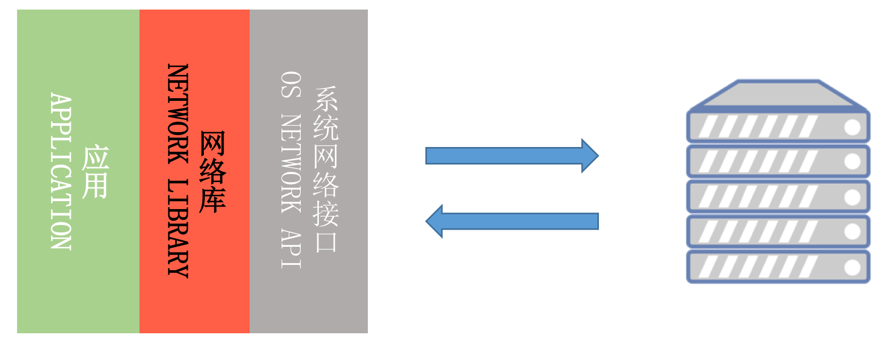

# Okhttp核心原理

在实际的开发工作中，我们很少会像《UNIX 网络编程》那样直接去操作底层的网络接口，一般都会使用网络库。Square 出品的[OkHttp](https://square.github.io/okhttp/)是目前最流行的 Android 网络库，它还被 Google 加入到 Android 系统内部，为广大开发者提供网络服务。那网络库究竟承担着一个什么样的角色呢？在我看来，它屏蔽了下层复杂的网络接口，让我们可以更高效地使用网络请求。



如上图所示，一个网络库的核心作用主要有以下三点：

* **统一编程接口**。无论是同步还是异步请求，接口都非常简单易用。同时我们可以统一做策略管理，
* **统一进行流解析**（JSON、XML、Protocol Buffers）等。全局网络控制。在网络库内部我们可以做统一的网络调度、流量监控以及容灾管理等工作。
* **高性能**。既然我们把所有的网络请求都交给了网络库，那网络库是否实现高性能就至关重要。既然要实现高性能，那我会非常关注速度，CPU、内存、I/O 的使用，以及失败率、崩溃率、协议的兼容性等方面。

一般来说，一个好的网络库会有以下模块：
* DNS 管理
* 连接管理
* 协议处理
* 并发模型
* IO模型
* 预连接
* 错误兼容处理
* 数据解析
* 网络质量监控

下面我们就来一一介绍这些模块。

## 统一编程接口

### 请求整体流程介绍

OkHttp 的核心类是 `OkHttpClient`，它是一个线程安全的类，我们可以通过它来创建一个网络请求。我们可以通过 `new OkHttpClient()` 来创建一个 `OkHttpClient` 对象，也可以通过 `OkHttpClient.Builder` 来创建一个 `OkHttpClient` 对象。`OkHttpClient.Builder` 是一个建造者模式，它可以帮助我们快速创建一个 `OkHttpClient` 对象。

```java
OkHttpClient client = new OkHttpClient.Builder()
    .connectTimeout(10, TimeUnit.SECONDS)
    .writeTimeout(10, TimeUnit.SECONDS)
    .readTimeout(30, TimeUnit.SECONDS)
    .build();
```

`OkHttpClient` 提供了 `newCall` 方法来创建一个 `Call` 对象，`Call` 对象是一个网络请求的抽象，它可以通过 `execute` 方法来同步执行一个网络请求，也可以通过 `enqueue` 方法来异步执行一个网络请求。

```java
Request request = new Request.Builder()
    .url("https://api.github.com/repos/square/okhttp/issues")
    .header("User-Agent", "OkHttp Headers.java")
    .addHeader("Accept", "application/json; q=0.5")
    .addHeader("Accept", "application/vnd.github.v3+json")
    .build();

Call call = client.newCall(request);
Response response = call.execute();

// or
call.enqueue(new Callback() {
  @Override public void onFailure(Call call, IOException e) {
    e.printStackTrace();
  }

  @Override public void onResponse(Call call, Response response) throws IOException {
    if (!response.isSuccessful()) throw new IOException("Unexpected code " + response);

    Headers responseHeaders = response.headers();
    for (int i = 0, size = responseHeaders.size(); i < size; i++) {
      System.out.println(responseHeaders.name(i) + ": " + responseHeaders.value(i));
    }

    System.out.println(response.body().string());
  }
});
```

### 分发器

`OkHttpClient` 通过 `Dispatcher` 来管理 `Call` 对象，它可以帮助我们控制并发的请求数量，以及请求的执行顺序。

```java
Dispatcher dispatcher = new Dispatcher();
dispatcher.setMaxRequests(20);
dispatcher.setMaxRequestsPerHost(5);
OkHttpClient client = new OkHttpClient.Builder()
    .dispatcher(dispatcher)
    .build();
```


## DNS 管理

支持 DNS 缓存，支持自定义 DNS 解析。
DNS（Domain Name System）是域名系统，它是一个分布式数据库，它存储着域名和 IP 地址的映射关系。当我们在浏览器中输入一个域名时，浏览器会先去本地的 DNS 缓存中查找，如果没有找到，那么它会去 DNS 服务器中查找，如果还是没有找到，那么它会去根域名服务器中查找，最后找到对应的 IP 地址。


在 OkHttp 中，我们可以通过 `Dns` 接口来自定义 DNS 解析的实现。默认情况下，OkHttp 会使用系统的 DNS 解析，但是我们也可以自定义 DNS 解析的实现，比如使用 Google 的 DNS 服务器。

```java
public interface Dns {
  List<InetAddress> lookup(String hostname) throws UnknownHostException;
}
```

## 连接管理

对于Http连接， 每个域名最多缓存5个连接，每个连接默认keep-alive 5分钟，如果5分钟内没有请求，那么这个连接就会被关闭。 对于Http/2连接， 每个域名都共用一个H2连接

## 协议处理

OkHttp 支持 HTTP/1.1 和 HTTP/2 , TLS 1.2 和 TLS 1.3

## 并发模型

使用多线程来实现并发，实际执行线程数受队列 机制控制，最大64，单个Host限制5个。

## IO模型

阻塞Socket IO，使用Okio库实现
