# 网络基础知识

## 1. OSI 七层模型

### 1.1. 是什么

**OSI 七层模型** 是国际标准化组织提出一个网络分层模型，其大体结构以及每一层提供的功能如下图所示：

| OSI        | 功能                               |
| ---------- | ---------------------------------- |
| 应用层     | 为计算机用户提供接口和服务。       |
| 表示层     | 数据处理：编解码、加解密等等。     |
| 会话层     | 管理（建立、维护、重连）通信会话。 |
| 传输层     | 管理端到端的通信连接。             |
| 网络层     | 数据路由：决定数据在网络中的路径。 |
| 数据链路层 | 管理相邻节点之间的数据通信。       |
| 物理层     | 数据通信的光电物理特性。           |

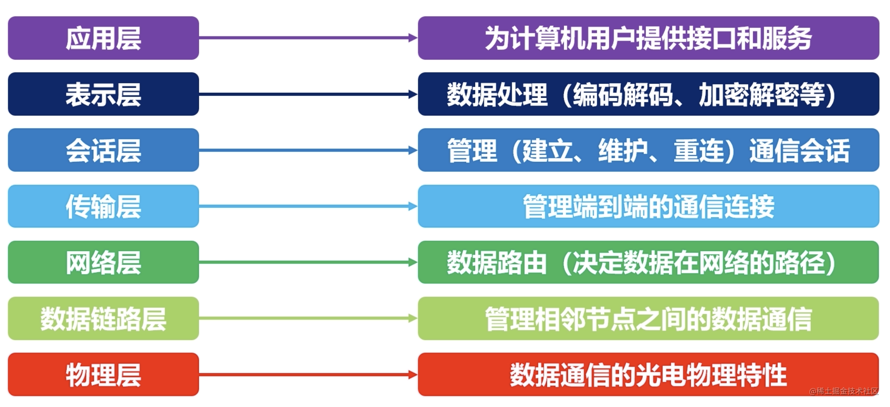

每一层都专注做一件事情，并且每一层都需要使用下一层提供的功能比如传输层需要使用网络层提供的路由和寻址功能，这样传输层才知道把数据传输到哪里去。

### 1.2. TCP/IP 四层模型

**TCP/IP 四层模型** 是目前被广泛采用的一种模型,我们可以将 TCP / IP 模型看作是 OSI 七层模型的精简版本，由以下 4 层组成：

1. 应用层
2. 传输层
3. 网络层
4. 网络接口层

需要注意的是，我们并不能将 TCP/IP 四层模型 和 OSI 七层模型完全精确地匹配起来，不过可以简单将两者对应起来，如下图所示：

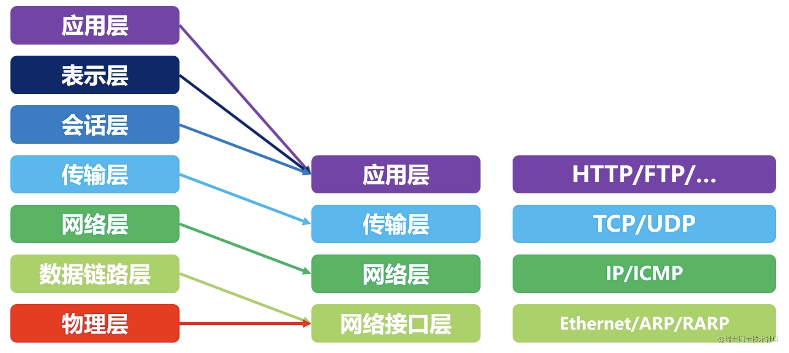

!!! question "既然 OSI 七层模型这么厉害，为什么干不过 TCP/IP 四 层模型呢？"

    的确，OSI 七层模型当时一直被一些大公司甚至一些国家政府支持。这样的背景下，为什么会失败呢？主要有下面几方面原因：
    
    1. OSI 的专家缺乏实际经验，他们在完成 OSI 标准时缺乏商业驱动力
    2. OSI 的协议实现起来过分复杂，而且运行效率很低
    3. OSI 制定标准的周期太长，因而使得按 OSI 标准生产的设备无法及时进入市场（20 世纪 90 年代初期，虽然整套的 OSI 国际标准都已经制定出来，但基于 TCP/IP 的互联网已经抢先在全球相当大的范围成功运行了）
    4. OSI 的层次划分不太合理，有些功能在多个层次中重复出现

#### 1.2.2.应用层（Application layer）

**应用层位于传输层之上，主要提供两个终端设备上的应用程序之间信息交换的服务，它定义了信息交换的格式，消息会交给下一层传输层来传输。** 我们把应用层交互的数据单元称为报文。

#### 1.2.3.传输层（Transport layer）

**传输层的主要任务就是负责向两台终端设备进程之间的通信提供通用的数据传输服务。** 应用进程利用该服务传送应用层报文。“通用的”是指并不针对某一个特定的网络应用，而是多种应用可以使用同一个运输层服务。

运输层主要使用以下两种协议：

1. **传输控制协议 TCP**（Transmisson Control Protocol）--提供 **面向连接** 的，**可靠的** 数据传输服务。
2. **用户数据协议 UDP**（User Datagram Protocol）--提供 **无连接** 的，尽最大努力的数据传输服务（不保证数据传输的可靠性）。

#### 1.2.4.网络层（Network layer）

**网络层负责为分组交换网上的不同主机提供通信服务。** 在发送数据时，网络层把运输层产生的报文段或用户数据报封装成分组和包进行传送。在 TCP/IP 体系结构中，由于网络层使用 IP 协议，因此分组也叫 IP 数据报，简称数据报。

> 注意 ：**不要把运输层的“用户数据报 UDP”和网络层的“IP 数据报”弄混**。

**网络层的还有一个任务就是选择合适的路由，使源主机运输层所传下来的分组，能通过网络层中的路由器找到目的主机。**

这里强调指出，网络层中的“网络”二字已经不是我们通常谈到的具体网络，而是指计算机网络体系结构模型中第三层的名称。

互联网是由大量的异构（heterogeneous）网络通过路由器（router）相互连接起来的。互联网使用的网络层协议是无连接的网际协议（Internet Prococol）和许多路由选择协议，因此互联网的网络层也叫做 **网际层** 或 **IP 层**。

**网络层常见协议** ：

- **IP:网际协议** ：网际协议 IP 是TCP/IP协议中最重要的协议之一，也是网络层最重要的协议之一，IP协议的作用包括寻址规约、定义数据包的格式等等，是网络层信息传输的主力协议。目前IP协议主要分为两种，一种是过去的IPv4，另一种是较新的IPv6，目前这两种协议都在使用，但后者已经被提议来取代前者。
- **ARP 协议** ：ARP协议，全称地址解析协议（Address Resolution Protocol），它解决的是网络层地址和链路层地址之间的转换问题。因为一个IP数据报在物理上传输的过程中，总是需要知道下一跳（物理上的下一个目的地）该去往何处，但IP地址属于逻辑地址，而MAC地址才是物理地址，ARP协议解决了IP地址转MAC地址的一些问题。
- **NAT:网络地址转换协议** ：NAT协议（Network Address Translation）的应用场景如同它的名称——网络地址转换，应用于内部网到外部网的地址转换过程中。具体地说，在一个小的子网（局域网，LAN）内，各主机使用的是同一个LAN下的IP地址，但在该LAN以外，在广域网（WAN）中，需要一个统一的IP地址来标识该LAN在整个Internet上的位置。

#### 1.2.5.网络接口层（Network interface layer）

我们可以把网络接口层看作是数据链路层和物理层的合体。

1. 数据链路层(data link layer)通常简称为链路层（ 两台主机之间的数据传输，总是在一段一段的链路上传送的）。**数据链路层的作用是将网络层交下来的 IP 数据报组装成帧，在两个相邻节点间的链路上传送帧。每一帧包括数据和必要的控制信息（如同步信息，地址信息，差错控制等）。**
2. **物理层的作用是实现相邻计算机节点之间比特流的透明传送，尽可能屏蔽掉具体传输介质和物理设备的差异**

!!! question "为什么网络要分层"
	
    **复杂的系统需要分层，因为每一层都需要专注于一类事情。网络分层的原因也是一样，每一层只专注于做一类事情。**
    
    网络之所以分层主要有 3 方面的原因：
    
    1. **各层之间相互独立**：各层之间相互独立，各层之间不需要关心其他层是如何实现的，只需要知道自己如何调用下层提供好的功能就可以了（可以简单理解为接口调用）**。这个和我们对开发时系统进行分层是一个道理。**
    2. **提高了整体灵活性** ：每一层都可以使用最适合的技术来实现，你只需要保证你提供的功能以及暴露的接口的规则没有改变就行了。**这个和我们平时开发系统的时候要求的高内聚、低耦合的原则也是可以对应上的。**
    3. **大问题化小** ： 分层可以将复杂的网络间题分解为许多比较小的、界线比较清晰简单的小问题来处理和解决。这样使得复杂的计算机网络系统变得易于设计，实现和标准化。 **这个和我们平时开发的时候，一般会将系统功能分解，然后将复杂的问题分解为容易理解的更小的问题是相对应的，这些较小的问题具有更好的边界（目标和接口）定义。

## 2. HTTP 

### 2.1 是什么？

- HyperText 即超文本、超链接，Http 是指在电脑中显示的、**含有可以指向其他文本的链接文本**。
- 对于这些内容都有一个统一的路径，例如： `http(s)://<主机>:<端口>/<路径>`。
- **HTTP 协议底层是 TCP 协议，因此它是可靠的数据传输协议**。


### 2.2. 从输入URL 到页面展示到底发生了什么？

总体来说分为以下几个过程:

1. DNS 解析
2. TCP 连接
3. 发送 HTTP 请求
4. 服务器处理请求并返回 HTTP 报文
5. 浏览器解析渲染页面
6. 连接结束


### 2.3 GET 和 POST 的区别

首先最直观的是语义上的区别。

而后又有这样一些具体的差别:

- 从 **缓存** 的角度，GET 请求会被浏览器主动缓存下来，留下历史记录，而 POST 默认不会。
- 从 **编码** 的角度，GET 只能进行 URL 编码，只能接收 ASCII 字符，而 POST 没有限制。
- 从 **参数** 的角度，GET 一般放在 URL 中，因此不安全，POST 放在请求体中，更适合传输敏感信息。
- 从 **幂等性** 的角度，`GET`是**幂等**的，而`POST`不是。(`幂等`表示执行相同的操作，结果也是相同的)
- 从 **TCP** 的角度，GET 请求会把请求报文一次性发出去，而 POST 会分为两个 TCP 数据包，首先发 header 部分，如果服务器响应 100(continue)， 然后发 body 部分。(**火狐**浏览器除外，它的 POST 请求只发一个 TCP 包)

### 2.4 HTTP 常见状态码

|         | 类别             | 原因短语                   |
| ------- | ---------------- | -------------------------- |
| 100~199 | 信息性状态码     | 接受的请求正在处理         |
| 200~299 | 成功状态码       | 请求正常处理完毕           |
| 300~399 | 重定向状态码     | 需要进行附加操作以完成请求 |
| 400~499 | 客户端错误状态码 | 服务器无法处理请求         |
| 500~599 | 服务端错误状态码 | 服务器处理请求出错         |

- **101**：Switching Protocols，服务器同意将 HTTP 升级为 WebSocket 时发送。

- **200 OK** ：请求被成功处理。比如我们发送一个查询用户数据的HTTP 请求到服务端，服务端正确返回了用户数据。这个是我们平时最常见的一个 HTTP 状态码。
- **201 Created** ：请求被成功处理并且在服务端创建了一个新的资源。比如我们通过 POST 请求创建一个新的用户。
- **202 Accepted** ：服务端已经接收到了请求，但是还未处理。
- **204 No Content** ： 服务端已经成功处理了请求，但是没有返回任何内容。
- **301 Moved Permanently** ： 资源被永久重定向了。比如你的网站的网址更换了。
- **302 Found** ：资源被临时重定向了。比如你的网站的某些资源被暂时转移到另外一个网址。
- **400 Bad Request** ： 发送的HTTP请求存在问题。比如请求参数不合法、请求方法错误。
- **401 Unauthorized** ： 未认证却请求需要认证之后才能访问的资源。
- **403 Forbidden** ：直接拒绝HTTP请求，不处理。一般用来针对非法请求。
- **404 Not Found** ： 你请求的资源未在服务端找到。比如你请求某个用户的信息，服务端并没有找到指定的用户。
- **409 Conflict** ： 表示请求的资源与服务端当前的状态存在冲突，请求无法被处理。
- **500 Internal Server Error** ： 服务端出问题了（通常是服务端出Bug了）。比如你服务端处理请求的时候突然抛出异常，但是异常并未在服务端被正确处理。
- **502 Bad Gateway** ：服务器自身是正常的，只是数据通道有问题。
- **503 Service Unavailable**: 服务器很忙，无法响应服务。

### 2.5 HTTP特点&缺点

#### 2.5.1 HTTP 特点

HTTP 的特点概括如下:

1. 灵活可扩展，主要体现在两个方面。一个是语义上的自由，只规定了基本格式，比如空格分隔单词，换行分隔字段，其他的各个部分都没有严格的语法限制。另一个是传输形式的多样性，不仅仅可以传输文本，还能传输图片、视频等任意数据，非常方便。
2. 可靠传输。HTTP 基于 TCP/IP，因此把这一特性继承了下来。这属于 TCP 的特性，不具体介绍了。
3. 请求-应答。也就是`一发一收`、`有来有回`， 当然这个请求方和应答方不单单指客户端和服务器之间，如果某台服务器作为代理来连接后端的服务端，那么这台服务器也会扮演**请求方**的角色。
4. 无状态。这里的状态是指**通信过程的上下文信息**，而每次 http 请求都是独立、无关的，默认不需要保留状态信息。

#### 2.5.2 HTTP 缺点

**无状态**

所谓的优点和缺点还是要分场景来看的，对于 HTTP 而言，最具争议的地方在于它的**无状态**。

在需要长连接的场景中，需要保存大量的上下文信息，以免传输大量重复的信息，那么这时候无状态就是 http 的缺点了。

但与此同时，另外一些应用仅仅只是为了获取一些数据，不需要保存连接上下文信息，无状态反而减少了网络开销，成为了 http 的优点。

**明文传输**

即协议里的报文(主要指的是头部)不使用二进制数据，而是文本形式。

这当然对于调试提供了便利，但同时也让 HTTP 的报文信息暴露给了外界，给攻击者也提供了便利。`WIFI陷阱`就是利用 HTTP 明文传输的缺点，诱导你连上热点，然后疯狂抓你所有的流量，从而拿到你的敏感信息。

**队头阻塞问题**

当 http 开启长连接时，共用一个 TCP 连接，同一时刻只能处理一个请求，那么当前请求耗时过长的情况下，其它的请求只能处于阻塞状态，也就是著名的**队头阻塞**问题。

### 2.6 常用字段

#### 2.6.1 数据格式

首先需要介绍一个标准——**MIME**(Multipurpose Internet Mail Extensions, **多用途互联网邮件扩展**)。它首先用在电子邮件系统中，让邮件可以发任意类型的数据，这对于 HTTP 来说也是通用的。HTTP 从 **MIME type** 取了一部分来标记报文 body 部分的数据类型，这些类型体现在 **`Content-Type`** 这个字段，当然这是针对于发送端而言，接收端想要收到特定类型的数据，也可以用 **`Accept`** 字段。

具体而言，这两个字段的取值可以分为下面几类:

- text： text/html, text/plain, text/css 等
- image: image/gif, image/jpeg, image/png 等
- audio/video: audio/mpeg, video/mp4 等
- application: application/json, application/javascript, application/pdf, application/octet-stream

#### 2.6.2 压缩方式

采取什么样的压缩方式就体现在了发送方的`Content-Encoding`字段上， 同样的，接收什么样的压缩方式体现在了接受方的`Accept-Encoding`字段上。这个字段的取值有下面几种：

- gzip: 当今最流行的压缩格式
- deflate: 另外一种著名的压缩格式
- br: 一种专门为 HTTP 发明的压缩算法

#### 2.6.3 定长包体

对于定长包体而言，发送端在传输的时候一般会带上 `Content-Length`, 来指明包体的长度。Content-Length`对于 http 传输过程起到了十分关键的作用，如果设置不当可以直接导致传输失败。

#### 2.6.4 不定长包体

对于不定长包体我们使用 **`Transfer-Encoding: chunked`** 表示分块传输数据，设置这个字段后会自动产生两个效果:

- Content-Length 字段会被忽略
- 基于长连接持续推送动态内容

#### 2.6.5 大文件传输

对于几百 M 甚至上 G 的大文件来说，如果要一口气全部传输过来显然是不现实的，会有大量的等待时间，严重影响用户体验。因此，HTTP 针对这一场景，采取了`范围请求`的解决方案，允许客户端仅仅请求一个资源的一部分。

当然，前提是服务器要支持 **范围请求**，要支持这个功能，就必须加上 **`Accept-Ranges: none`** 这样一个响应头，用来告知客户端这边是支持范围请求的。

而对于客户端而言，它需要指定请求哪一部分，通过`Range`这个请求头字段确定，格式为`bytes=x-y`。

- **0-499** 表示从开始到第 499 个字节。
- **500-** 表示从第 500 字节到文件终点。
- **-100** 表示文件的最后100个字节。

服务器收到请求之后，首先验证范围 **是否合法**，如果越界了那么返回`416`错误码，否则读取相应片段，返回`206`状态码。

同时，服务器需要添加`Content-Range`字段，这个字段的格式根据请求头中`Range`字段的不同而有所差异。

#### 2.6.6 表单数据的提交

在 http 中，有两种主要的表单提交的方式，体现在两种不同的`Content-Type`取值:

- application/x-www-form-urlencoded
- multipart/form-data

对于`application/x-www-form-urlencoded`格式的表单内容，有以下特点:

- 其中的数据会被编码成以`&`分隔的键值对
- 字符以 **URL编码方式** 编码。

```shell
// 转换过程: {a: 1, b: 2} -> a=1&b=2 -> 如下(最终形式)
"a%3D1%26b%3D2"
```

对于`multipart/form-data`而言:

- 请求头中的`Content-Type`字段会包含`boundary`，且`boundary`的值有浏览器默认指定。例: `Content-Type: multipart/form-data;boundary=----WebkitFormBoundaryRRJKeWfHPGrS4LKe`。
- 数据会分为多个部分，每两个部分之间通过分隔符来分隔，每部分表述均有 HTTP 头部描述子包体，如`Content-Type`，在最后的分隔符会加上`--`表示结束。

```shell
Content-Disposition: form-data;name="data1";
Content-Type: text/plain
data1
----WebkitFormBoundaryRRJKeWfHPGrS4LKe
Content-Disposition: form-data;name="data2";
Content-Type: text/plain
data2
----WebkitFormBoundaryRRJKeWfHPGrS4LKe--
```


> 在实际的场景中，对于图片等文件的上传，基本采用`multipart/form-data`而不用`application/x-www-form-urlencoded`，因为没有必要做 URL 编码，带来巨大耗时的同时也占用了更多的空间。


### 2.7 Http1.0、Http1.1、 Http2.0、Http3.0区别

#### 2.7.1 HTTP1.0

**特点**

- **无状态**：服务器不维护任何有关客户端过去所发请求的消息
- **无连接/短连接**：一次请求 会建立一个TCP连接，请求完成后主动断开连接。
- **无host头域**，也就是http请求头里的host

**问题**

* **无法复用连接**: 每次发送请求，都需要进行一次TCP连接，而TCP的连接释放过程又是比较费事的。这种无连接的特性会使得网络的利用率变低。
* **队头阻塞（head of line blocking）**: 由于HTTP1.0规定下一个请求必须在前一个请求响应到达之前才能发送，假设前一个请求响应一直不到达，那么下一个请求就不发送，后面的请求就阻塞了。
* **无法断点续传**：由于请求是无状态的，所以无法断点续传，也无法传输对象的一部分，必须一次性传输整个对象。

#### 2.7.2 HTTP1.1

**特点**

* **支持长连接**：解决了HTTP1.0中连接不能复用的问题，支持持久连接——使用 **keep-alive机制**：一次HTTP请求结束后不会立即断开TCP连接，如果此时有新的HTTP请求，且其请求的Host同上次请求相同，那么会直接复用TCP连接。这样就减少了建立和关闭连接的消耗和延迟。keep-alive机制在HTTP1.1中是默认打开的——即在请求头添加：**connection:keep-alive**。（keep-alive不会永久保持连接，它有一个保持时间，可在不同的服务器软件（如Apache）中设定这个时间）
* **缓存处理** ， 在 HTTP1.0 中主要使用 header 里的 If-Modified-Since,Expires 来做为缓存判断的标准，HTTP1.1 则引入了更多的缓存控制策略例如 Entity tag，If-Unmodified-Since, If-Match, If-None-Match 等更多可供选择的缓存头来控制缓存策略。
* **支持断点传输**，HTTP/1.1引入了范围请求（range request）机制，以避免带宽的浪费。当客户端想请求一个文件的一部分，或者需要继续下载一个已经下载了部分但被终止的文件，HTTP/1.1可以在请求中加入`Range`头部，以请求（并只能请求字节型数据）数据的一部分
* **增加了`Host`字段**，使得一个服务器能够用来创建多个Web站点。

**问题**

* **依然有队头阻塞问题**:在大多数情况下,浏览器获取资源都是多份的,HTTP/1.1并没有提供机制来同时请求所有的资源,在仅仅只有一个连接的时候(**实际情况,现代浏览器可能针对单个域名建立多个连接,实现某程度并行**),它需要发起请求,并等待响应.在这之后再发起下一请求,请求响应.即使HTTP/1.1有一个特性为**管道化**,允许发送一组请求,但是只能按照发送顺序依次接收响应;如果在请求应答过程中,出现任何的状况,剩下的所有请求都会被阻塞在出现问题的请求应答之后,这就是"队头阻塞";
* **臃肿的消息首部** :HTTP/1.1能压缩请求内容,但是消息首部不能压缩;


#### 2.7.3 HTTP2.0

**特点**：

- **新的二进制格式（Binary Format）**：http/1.x使用的是明文协议，其协议格式由三部分组成：request line，header，body，其协议解析是基于文本，但是这种方式存在天然缺陷，文本的表现形式有多样性，要做到健壮性考虑的场景必然很多，二进制则不同，只认0和1的组合；基于这种考虑，http/2.0的协议解析决定采用二进制格式，实现方便且健壮
- **多路复用（MultiPlexing）**：即连接共享，使用streamId用来区分请求，一个request对应一个stream并分配一个id，这样一个TCP连接上可以有多个stream，每个stream的frame可以随机的混杂在一起，接收方可以根据stream id将frame再归属到各自不同的request里面
- **优先级和依赖（Priority、Dependency）**：每个stream都可以设置优先级和依赖，优先级高的stream会被server优先处理和返回给客户端，stream还可以依赖其它的sub streams；优先级和依赖都是可以动态调整的，比如在APP上浏览商品列表，用户快速滑动到底部，但是前面的请求已经发出，如果不把后面的优先级设高，那么当前浏览的图片将会在最后展示出来，显然不利于用户体验
- **header压缩**：http2.0使用encoder来减少需要传输的header大小，通讯双方各自cache一份header fields表，既避免了重复header的传输，又减小了需要传输的大小
- **重置连接**：很多APP里都有停止下载图片的需求，对于http1.x来说，是直接断开连接，导致下次再发请求必须重新建立连接；http2.0引入RST_STREAM类型的frame，可以在不断开连接的前提下取消某个request的stream
- **服务器推送**：在 http2.0当中，服务器已经不再是完全被动地接收请求，响应请求，它也能新建 stream 来给客户端发送消息，当 TCP 连接建立之后，比如浏览器请求一个 HTML 文件，服务器就可以在返回 HTML 的基础上，将 HTML 中引用到的其他资源文件一起返回给客户端，减少客户端的等待。

其中涉及了两个新的概念：

- **数据流-stream**：基于TCP连接之上的逻辑双向字节流，用于承载双向消息，对应一个请求及其响应。客户端每发起一个请求就建立一个数据流，后续该请求及其响应的所有数据都通过该数据流传输。每个数据流都有一个唯一的标识符和可选的优先级信息。

- **帧-frame** HTTP/2的最小数据切片单位，承载着特定类型的数据，例如 HTTP 标头、消息负载，等等。 来自不同数据流的帧可以交错发送，然后再根据每个帧头的数据流标识符重新组装，从而在宏观上实现了多个请求或响应并行传输的效果。

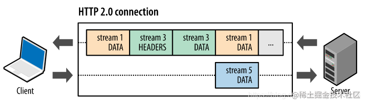

这里的 **多路复用机制 就实现了 在同一个TCP连接上 多个请求 并行执行。**


**问题**

尽管 HTTP2 相比 HTTP 已经有了改进的地方，但是如果你有 2% 的丢包率，那 HTTP2 在性能上就没有优势了。因为HTTP2 协议是基于 TCP 的，但是 TCP 本身是无法解决队头拥塞，为什么呢？因为 HTTP2 会把一次传输所有的文件都放在一个 TCP 连接中，只要这个 TCP 中发生一个丢包，连接就必须重新建立，之前所有传输内容进行必须重传，从而造成拥塞。

#### 2.7.4 HTTP3.0

HTTP3 本质不是对 HTTP 协议本身的改进，它主要是集中在如何提高传输效率。

- **优化了重传策略**：HTTP3 使用 stream 进一步扩展了 HTTP2 的多路复用。在 HTTP3 模式下，一般传输多少个文件就会产生对应数量的 stream。当这些文件中的其中一个发生丢包时，你只需要重传丢包文件的对应 stream 即可。
- **0-RTT**: 使用了基于 Google 的 QUIC 协议， QUIC 协议相比于 HTTP2.0 最大的优势是 0-RTT 建连，即传输层 0-RTT 就能建立连接，而加密层 0-RTT 就能建立加密连接，具体实现为缓存了当前会话的上下文，下次恢复会话的时候，只需要将之前的缓存传递给服务器，验证通过，就可以进行传输了。QUIC 协议实际上是使用 UDP 实现的。
- **更好的移动端表现**: 通过引入 Connection ID，使得 HTTP3 支持连接迁移以及 NAT 的重绑定，同时QUIC在移动端的表现比TCP好，因为 TCP 是基于 IP 识别连接，而QUIC 是通过 ID 识别链接。 无论网络环境如何变化，只要 ID 不便，就能迅速重新连上。
- **加密认证优化**：TCP协议头没有经过任何加密和认证，在传输过程中很容易被中间网络设备篡改、注入和窃听。QUIC的 packet 可以说武装到了牙齿，除了个别报文，比如PUBLIC_RESET 和 CHLO，所有报文头部都是经过认证的，报文 Body 都是经过加密的。所以只要对 QUIC 做任何更改，接收端都能及时发现，有效地降低了安全风险
- **拥塞控制**：TCP 是在内核区实现的，而 HTTP3 将拥塞控制移出了内核，通过用户空间来实现。这样做的好处就是不再需要等待内核更新可以实现很方便的进行快速迭代。
- **头部压缩** ：HTTP2 使用的 HPACK，HTTP3 更换成了兼容 HPACK 的 QPACK 压缩方案。QPACK 优化了对乱序发送的支持，也优化了压缩率。
- **向前纠错机制**：QUIC协议有一个非常独特的特性，称为向前纠错（Foward Error Connec，FEC），每个数据包除了它本身的内容之外还包括了其他数据包的数据，因此少量的丢包可以通过其他包的冗余数据直接组装而无需重传。向前纠错牺牲了每个数据包可以发送数据的上限，但是带来的提升大于丢包导致的数据重传，因为数据重传将会消耗更多的时间（包括确认数据包丢失，请求重传，等待新数据包等步骤的时间消耗）。

**问题**

* NAT 局域网路由、交换机、防火墙等会禁止 UDP 443 通行，因此 QUIC 创建连接成功率只有95%
* 运营商针对 UDP 通道不支持/支持不足。
* 使用 UDP 不一定会比 TCP 更快，客户端可同时使用 TCP 和 QUIC 竞速，从而选择更优链路。

!!! question "HTTP协议是无状态协议,这句话本身到底对不对?"

   实际上,并不全对。HTTP/1.1中有一个 HTTP/1.1 Expect: 100-Continue的功能,它是这么工作的:

   * 在发送大量数据的时候,考虑到服务端有可能直接拒收数据,客户端发出请求头并附带 Expect:100-continue HTTP的HTTP头,不发送请求体,先等待服务器响应

   * 服务器收到 Expect:100-Continue 的请求,如果允许上传,发送100 continue 的HTTP响应(同一个请求可以有任意个1xx的响应,均不是最后的 Response,只起到提示性作用);如果不允许,例如不允许上传数据,或者数据大小超出限制,直接返回4xx/5xx的错误

   * 客户端收到100 Continue的响应之后,继续上传数据
      可以看出,这实际上很明显是一个有状态协议的套路,它需要先进行一次握手,然后再真正发送数据。不过,HTTP协议也规定,如果服务端不进行100 Continue的响应,建议客户端在等待较短的时间之后仍然上传数据,以达成与不支持 Expect:100- Continue功能的服务器的兼容,这样可以算是“能有状态则有状态,否则回到无状态的路上”,这样说HTTP1.x 是无状态的协议也是没错的。

   至于HTTP/2,它应该算是一个有状态的协议了(有握手和 GOAWAY消息,有类似于TCP的流控),所以以后说“HTTP是无状态的协议”就不太对了,最好说HTTP1.x 是无状态的协议


### 2.8 Https

#### 2.8.1 什么是HTTPS？

`HTTPS`其实并不是一个新的协议，而是在 HTTP 下面增加了一层 SSL/TLS 协议，**HTTPS是身披SSL外壳的HTTP**， 简单的讲，**HTTPS = HTTP + SSL/TLS**。

#### 2.8.2 为什么要有HTTPS？

因为HTTP是不安全的。

1. **机密性**，HTTP在通信过程中使用明文，这使得通信过程可能会被窃听。为了防止被窃听，最常见的处理方式就是加密。加密方式如下：
   - **通信加密**：HTTP协议中没有加密机制，可以使用 **SSL** 或者 **TSL** 来进行加密；
   - **内容的加密**：对通信内容进行加密，将报文中所包含的内容进行加密；
2. **完整性**，由于HTTP协议无法验证报文的完整性，因此数据在传输过程中可能已经遭到 **中间人攻击**，导致报文被篡改。
3. **身份认证**，HTTP协议中不会对请求和应答的双方进行身份确认，所以身份有可能遭遇伪装。HTTPS的SSL不仅提供加密服务，还提供 **证书**，用来确定通信方。证书是由值得信任的第三方机构办法，伪造证书异常困难，所以只要能够确认通信方持有的证书，则可以确认对方身份

#### 2.8.3 什么是SSL/TLS

SSL即 **安全套接层**，是一个非常好的安全通信协议，其发展到v3版本的时候，互联网工程组将其改名为TLS**传输层安全**，目前应用最广泛的版本是1.2，除了HTTP，SSL/TLS还承接了其他应用协议，比如FTP=>FTPS等。

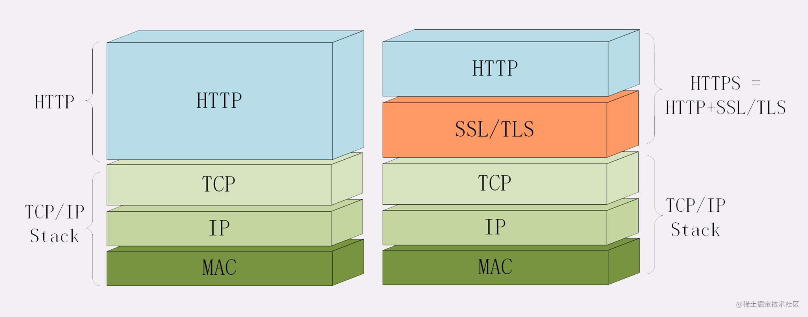

#### 2.8.4 HTTPS是如何解决上面的三个风险的呢？

**1. 通过混合加密，保证了信息的机密性**

按照密钥的使用方式，常见加密有两种方式：对称加密和非对称加密。
 **对称加密**以共享密钥的方式加密，也就是说必须要将密钥发送给对方，可是在互联网环境中，如何转发密钥呢？如果被窃听密钥落入攻击者之手，加密就失去了意义。
 **非对称加密**使用一对非对称的密钥，一把叫做**私钥**，一把叫做**公钥**。顾名思义，私钥不能让任何人知道，公钥任何人都可以获得。使用方式是：发送方将报文用**公钥**进行**加密**处理，对方收到后用**私钥**进行**解密**，也不用担心密钥被攻击者窃听而盗走。因为非对称加密是基于大数运算，所以速度很**慢**，还有一个缺点是相同强度的加密，非对称加密需要更多的位数。
 所以HTTPS利用了两者的优势，将两种方式组合起来用于通信。**在交换密钥阶段使用非对称加密的方式，之后建立通信交换报文阶段则使用对称加密方式。**

**2. 摘要算法用来实现完整性**

摘要算法是常说的散列函数和哈希函数，可以为数据生成独一无二的指纹，用于校验数据的完整性。客户端在发送数据之前通过摘要算法算出明文的 **指纹**，发送的时候将 **明文+指纹** 一同加密，发送给服务器，服务器接收到后进行解密，在用相同的摘要算法得到接收到的明文的 **指纹**，与消息中携带的指纹进行对比，若指纹相同，则说明是完整的。

**3.将服务器公钥放在数字证书中，解决了冒充的风险**

上文写到利用加密可以保证报文的机密性，这个过程中还有一个 **公钥信任** 的问题，如何保证公钥没有被修改呢？为了解决上述问题，可以使用由数字证书认证机构颁发的公开密钥认证证书，即CA认证。只要证书是可信的，那么公钥就是可信的。

#### 2.8.5 HTTPS链接的建立过程

在HTTP协议中，建立连接后会立即发送请求报文，但是HTTPS还需要另外一个“握手”的过程，即 **TLS握手**。TLS的握手过程如下图所示：

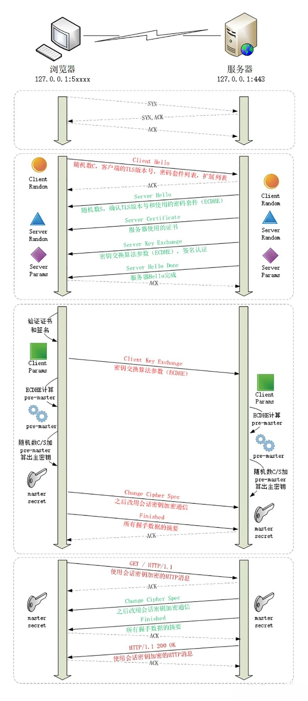

TLS通过两次往返（四个消息），完成了握手的过程。结合上图我们分析一下握手过程：

1. 浏览器发送

   Client Hello

   消息，信息如下：

   - 客户端支持的SSL/TLS版本号，如TLS1.2版本
   - 支持的密码套件，如ECDHE
   - 客户端产生的**随机数**C，用于生成后续的会话密钥

2. 服务器收到Client Hello消息后，会发送

   Server Hello

   - 确实SSL/TLS协议版本，如果浏览器不支持，则关闭加密通信
   - 确认密码套件列表，选择最合适的加密算法，如ECDHE
   - 服务器产生的**随机数**S，用于生成后续的会话密钥
   - 服务端为了证明身份，把证书也发送给客户端

3. 客户端回应，Client Key Exchange。客户端收到服务器的消息后，用浏览器或者系统中的CA公钥验证数字证书的真实性，如果证书没问题，客户端从数字证书中取出服务器的公钥，用其加密报文。

   - 一个 **随机数**，该随机数会被上面提到的服务器的公钥加密，以防被黑客破解。这个随机数加上上文生成的其他两个随机数，使用会话中约定的加密算法，会 **各自** 生成 **加密会话的主密钥**。
   - 加密通信算法改变通知，随后的信息都将用会话密钥加密通信
   - Finished消息，结束通知。把之前所有发送的数据做一个摘要再加密一下，让服务器做验证

4. 服务器的最后回应。

   - 加密通信算法改变通知
   - Finished消息，结束通知。把之前所有发送的数据做一个摘要再加密一下，让客户端做验证

!!! question "为什么需要证书？"
	
    防止“中间人”攻击，确定会话双方的身份

!!! question "使用 HTTPS还会被抓包吗？"
	
    可以被抓包，只不过抓包后看不到明文，无法篡改

!!! question "HTTPS的加密过程是怎么样的？"
	
    客户端向服务端索要并验证其公钥，用公钥对TLS握手过程中产生的随机数进行加密生成会话密钥，双方采用会话密钥进行加密通信。

!!! question "HTTPS 握手过程中，客户端如何验证证书的合法性"
	
    数字证书包括序列号、用途、颁发者、有效时间、公钥，如果只是简单的将这些信息发送给浏览器，中间人可以很轻易的将公钥改成自己的公钥，解决办法就是使用数字签名。将证书的信息生成摘要，将摘要用CA的私钥进行加密，生成数字签名。服务器将数字证书和数字签名一同发送给浏览器，因为有数字签名，所以数字证书无法被中间人修改（修改后的话会导致摘要变了，数字签名实现了不可否认）。浏览器拿到数字证书，根据“证书链”去验证其可信度。

## 3. DNS 

### 3.1 是什么

**域名系统**（英语：**Domain Name System**，缩写：**DNS**）是互联网)的一项服务。它作为将域名相互映射的一个分布式数据库，能够使人更方便地访问互联网

DNS由 `解析器` 和 `域名服务器` 组成的。域名服务器是指保存有该网络中所有主机的域名和对应IP地址，并具有将域名转换为IP地址功能的服务器。

现代的网络通信通常会使用到 `域名+IP地址+MAC地址`。

而两台主机要进行通信就必须要知道对方的IP地址，通常我们访问一个网站就只是输入一个域名，例如 `ww.baidu.com`，那么计算机是如何知道这个域名对应的 `IP` 地址呢？这就是 `DNS` 协议要干的事情。

> 通过 `IP` 地址找到 `MAC` 地址是 `ARP` 协议干的事

### 3.2 DNS查询的完整过程是怎么样的？

1. 浏览器将会检查缓存中有没有这个域名对应的解析过的 IP 地址，如果有该解析过程将会结束。浏览器缓存域名也是有限制的，包括缓存的时间、大小，可以通过 TTL 属性来设置。
2. 如果用户的浏览器中缓存中没有，操作系统会先检查自己本地的 DNS 解析器缓存和 hosts 文件是否有这个网址映射关系，如果有，就先调用这个 IP 地址映射，完成域名解析。
3. 如果都没有，会找 TCP/IP 参数中设置的首选 DNS 服务器，我们叫它本地 DNS 服务器。通过递归查询的方式向本地 DNS 服务器发起查询，如果本地 DNS 服务器中有 A记录 或者该域名的映射缓存，则返回
4. 如果都没有，本地域名服务器会开始迭代查询的过程，会先向 13 台根域名服务器查询该域名，根域名服务器会返回该域名的顶级域名服务器的 IP 地址，也就是 NS 记录(NS记录指向该级域名的域名服务器)。然后本地域名服务器再向顶级域名服务器发起查询，顶级域名服务器返回二级域名服务器的 NS 记录，重复这个过程直到返回 A 记录为止，最后把 A 记录中的 IP 地址返回给主机

> 可以通过 `dig` 命令来迭代跟踪DNS过程
>
> ```shell
> dig +trace www.baidu.com
> ```

###3.3 DNS使用UDP还是TCP

`DNS` 同时使用 `TCP` 和 `UDP` 协议的 `53` 号端口。`DNS` 在 `区域传输` （同步解析记录）和 `DNS` 响应大于 `UDP` 报文最大长度的时候使用 `TCP` 协议，其他时候使用 `UDP` 协议。

#### **为什么使用UDP**

快，是UDP的最大优势

客户端向 `DNS` 服务器查询域名，一般返回的内容都不超过 `512字节` ，用 `UDP` 传输即可。不用经过三次握手，这样 `DNS` 服务器负载更低，响应更快。

理论上说，客户端也可以指定向 `DNS` 服务器查询时用 `TCP`，但事实上，很多 `DNS` 服务器进行配置的时候，仅支持 `UDP` 查询包。

####**何时使用TCP**

**传输数据大于UDP最大报文长度的时候使用TCP协议：**

首先了解一下 `TCP` 与 `UDP` 传送字节的长度限制：

`UDP` 报文的最大长度为 `512` 字节，而 `TCP` 则允许报文长度超过 `512` 字节。当 `DNS` 查询超过 `512` 字节时会将后面的数据部分丢掉，所以这时需要使用 `TCP` 发送。但是通常传统的 `UDP` 报文一般不会大于 `512` 字节。即使 `DNS` 服务器中符合条件的记录很多， `DNS` 服务器也会限制最多返回 `13条` 来防止报文大于 `512` 字节。

**DNS区域传输的时候使用TCP协议**

DNS的规范规定了 2 种类型的 DNS 服务器，一个叫 `主 DNS 服务器`，一个叫 `辅助DNS服务器`。 在一个 `区` 中 `主 DNS 服务器` 从自己本机的数据文件中读取该区的 `DNS` 数据信息，而 `辅助DNS服务器` 则从区的 `主 DNS 服务器` 中读取该区的 `DNS` 数据信息。当一个 `辅助 DNS 服务器` 启动时，它需要与 `主 DNS 服务器` 通信，并加载数据信息，这就叫做 `区传送（zone transfer）`。

辅域名服务器会定时（一般 3 小时）向主域名服务器进行查询以便了解数据是否有变动。如有变动，会执行一次区域传输，进行数据同步。区域传输使用 TCP 而不是 UDP，因为数据同步传送的数据量比一个请求应答的数据量要多得多，且需要保证数据的 `可靠性` 和 `完整性`

### 3.4 CDN

**CDN** 的全称是 **Content Delivery Network**，即内容分发网络。其目的是通过在现有的internet中增加一层新的网络架构，将网站的内容发布到最接近用户的网络边缘，使用户可以就近取得所需的内容，提高用户访问网站的响应速度。

#### CDN 的原理

当用户访问 CDN 的资源时，首先也是需要经过 DNS 解析过程

CDN 就是在 DNS 解析时，其内部的 DNS 智能调度系统通过负载均衡、网路等情况来选择出与主机最合适的资源服务器的 IP 作为 DNS 解析结果。


## 4. TCP&UDP
### 4.1 定义

**TCP** 是传输控制协议（Transmission Control Protocol）的缩写，是一种面向连接的、可靠的、基于字节流的传输层通信协议。TCP 为应用层提供可靠的字节流服务。建立在 IP 协议之上，为 IP 协议中无连接服务的缺陷提供了解决方案。

**UDP** 是用户数据报协议（User Datagram Protocol）的缩写，是一种无连接的、不可靠的传输层通信协议。UDP 为应用层提供无连接的服务。

#### 4.1.1 TCP的重要性

IP 层是「不可靠」的，它不保证⽹络包的交付、不保证⽹络包的按序交付、也不保证⽹络包中的数据的完整性。
如果需要保障⽹络数据包的可靠性，那么就需要由上层（传输层）的 TCP 协议来负责。
因为 TCP 是⼀个⼯作在传输层的可靠数据传输的服务，它能确保接收端接收的⽹络包是⽆损坏、⽆间隔、⾮冗余和按序的。

### 4.2 TCP 与 UDP 的区别

| TCP                    | UDP            |            |
| ---------------------- | -------------- | ---------- |
| 是否面向连接           | 是             | 否         |
| 是否可靠               | 是             | 否         |
| 是否有状态             | 是             | 否         |
| 传输效率               | 较慢           | 较快       |
| 传输形式               | 字节流         | 数据报文段 |
| 首部开销               | 20 ～ 60 bytes | 8 bytes    |
| 是否提供广播或多播服务 | 否             | 是         |

**是否面向连接** ：UDP 在传送数据之前不需要先建立连接。而 TCP 提供面向连接的服务，在传送数据之前必须先建立连接，数据传送结束后要释放连接。

**是否是可靠传输**：远地主机在收到 UDP 报文后，不需要给出任何确认，并且不保证数据不丢失，不保证是否顺序到达。TCP 提供可靠的传输服务，TCP 在传递数据之前，会有三次握手来建立连接，而且在数据传递时，有确认、窗口、重传、拥塞控制机制。通过 TCP 连接传输的数据，无差错、不丢失、不重复、并且按序到达。

**是否有状态** ：这个和上面的“是否可靠传输”相对应。TCP 传输是有状态的，这个有状态说的是 TCP 会去记录自己发送消息的状态比如消息是否发送了、是否被接收了等等。为此 ，TCP 需要维持复杂的连接状态表。而 UDP 是无状态服务，简单来说就是不管发出去之后的事情了。

**传输效率** ：由于使用 TCP 进行传输的时候多了连接、确认、重传等机制，所以 TCP 的传输效率要比 UDP 低很多。

**传输形式** ： TCP 是面向字节流的，UDP 是面向报文的。

**首部开销** ：TCP 首部开销（20 ～ 60 字节）比 UDP 首部开销（8 字节）要大。

**是否提供广播或多播服务** ：TCP 只支持点对点通信，UDP 支持一对一、一对多、多对一、多对多；

### 4.3 TCP 与 UDP 的应用场景

#### 4.3.1 什么时候选择 TCP,什么时候选 UDP

- **UDP 一般用于即时通信**，比如： 语音、 视频 、直播等等。这些场景对传输数据的准确性要求不是特别高，比如你看视频即使少个一两帧，实际给人的感觉区别也不大。
- **TCP 用于对传输准确性要求特别高的场景**，比如文件传输、发送和接收邮件、远程登录等等。

#### 4.3.2 HTTP 基于 TCP 还是 UDP？

**HTTP 协议是基于 TCP 协议的**，所以发送 HTTP 请求之前首先要建立 TCP 连接也就是要经历 3 次握手。

#### 4.3.3 使用 TCP 的协议有哪些?使用 UDP 的协议有哪些?

**运行于 TCP 协议之上的协议** ：

1. **HTTP 协议** ：超文本传输协议（HTTP，HyperText Transfer Protocol)主要是为 Web 浏览器与 Web 服务器之间的通信而设计的。当我们使用浏览器浏览网页的时候，我们网页就是通过 HTTP 请求进行加载的。
2. **HTTPS 协议** ：更安全的超文本传输协议(HTTPS,Hypertext Transfer Protocol Secure)，身披 SSL 外衣的 HTTP 协议
3. **FTP 协议**：文件传输协议 FTP（File Transfer Protocol），提供文件传输服务，**基于 TCP** 实现可靠的传输。使用 FTP 传输文件的好处是可以屏蔽操作系统和文件存储方式。
4. **SMTP 协议**：简单邮件传输协议（SMTP，Simple Mail Transfer Protocol）的缩写，**基于 TCP 协议**，用来发送电子邮件。注意 ⚠️：接受邮件的协议不是 SMTP 而是 POP3 协议。
5. **POP3/IMAP 协议**： POP3 和 IMAP 两者都是负责邮件接收的协议。
6. **Telent 协议**：远程登陆协议，通过一个终端登陆到其他服务器。被一种称为 SSH 的非常安全的协议所取代。
7. **SSH 协议** : SSH（ Secure Shell）是目前较可靠，专为远程登录会话和其他网络服务提供安全性的协议。利用 SSH 协议可以有效防止远程管理过程中的信息泄露问题。SSH 建立在可靠的传输协议 TCP 之上。


**运行于 UDP 协议之上的协议** ：

1. **DHCP 协议**：动态主机配置协议，动态配置 IP 地址
2. **DNS** ： **域名系统（DNS，Domain Name System）将人类可读的域名 (例如，www.baidu.com) 转换为机器可读的 IP 地址 (例如，220.181.38.148)。** 我们可以将其理解为专为互联网设计的电话薄。实际上 DNS 同时支持 UDP 和 TCP 协议。

### 4.4.TCP 报文头部

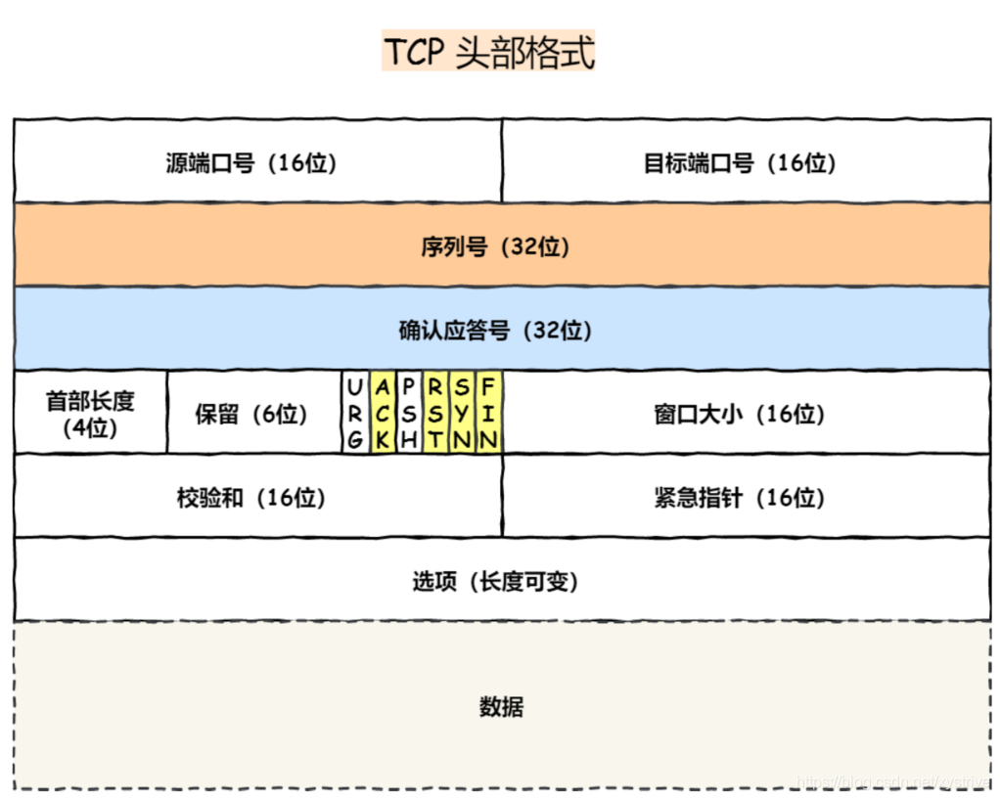

* **序列号（32位）**：TCP用序列号来解决网络传输中可能会出现的乱序问题，在建⽴连接时由计算机⽣成的随机数作为其初始值，通过 SYN 包传给接收端主机，每发送⼀次数据，就「累加」⼀次该「数据字节数」的⼤⼩。⽤来解决⽹络包乱序问题。
* **确认应答号（32位）**：指下⼀次「期望」收到的数据的序列号，发送端收到这个确认应答以后可以认为在这个序号以前的数据都已经被正常接收。⽤来解决不丢包的问题。
* **控制位 **：不同控制位只有一位，其只能为0、1
* **ACK**：当其为1，确认应答字段变为有效字段，由于TCP需要确认应答，可以想象除了建立连接的第一个包以外，所有包的ACK都为1
* **SYN**： 当其为1，表示其想建立连接，设置序列号初始值以便开始建立连接。
* **FIN**：当其为1，表示发送FIN的一方没有数据发送了，希望断开连接。由此可见TCP断开连接必定需要4次挥手，由于TCP是全双工的，其一次FIN一次ack只能断开一方，所以双方都断开则需要4次。
* **RST**：当其为1，代表连接异常，必须强制断开连接。
* **窗口大小**：占用两个字节，也就是 16 位，但实际上是不够用的。因此 TCP 引入了窗口缩放的选项，作为窗口缩放的比例因子，这个比例因子的范围在 0 ~ 14，比例因子可以将窗口的值扩大为原来的 2 ^ n 次方。
* **校验和**：占用两个字节，也就是 16 位，用于校验 TCP 报文头部和数据的完整性，防止传输过程中数据包有损坏，如果遇到校验和有差错的报文，TCP 直接丢弃之，等待重传。
* **源端口、目标端口**：如何标识唯一标识一个连接？答案是 **TCP 连接的四元组——源 IP、源端口、目标 IP 和目标端口**。那 TCP 报文怎么没有源 IP 和目标 IP 呢？这是因为在 IP 层就已经处理了 IP 。TCP 只需要记录两者的端口即可。

> 源地址和⽬的地址的字段（32位）是在 IP 头部中，作⽤是通过 IP 协议发送报⽂给对⽅主机。
> 源端⼝和⽬的端⼝的字段（16位）是在 TCP 头部中，作⽤是告诉 TCP 协议应该把报⽂发给哪个进程。


### 4.4 建立连接-TCP 三次握手

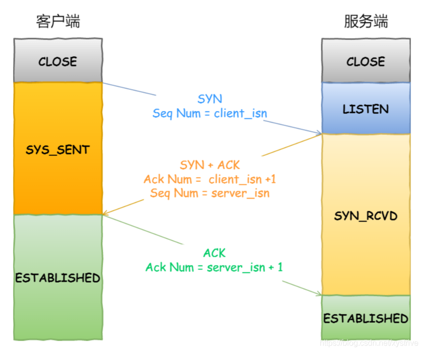

一开始两端都CLOSED，然后服务器端主动监听某个端口之后，服务器端就处于LISEN状态。

* **一次握手**:客户端随机初始化一个序列号，置于字段中，同时把SYN标志置位1，发送SYN报文（不包含应用层数据），表示其想建立连接。之后客户端处于SYN_SENT状态。

​	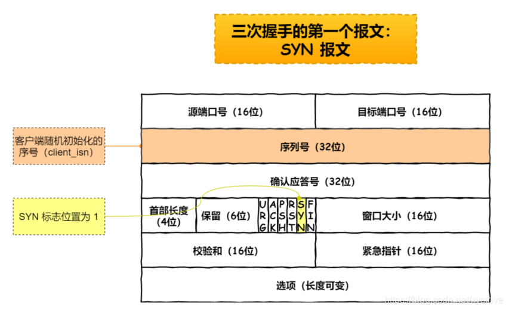

* **二次握手**：服务器收到客户端的SYN报文之后，其也随机初始化一个序列号，SYN置1，然后在确认应答号字段填入刚才听到的客户端发来的序号+1，ACK置1，发送报文（不包含应用层数据）。之后服务器端就处于SYN_RCVD状态。

  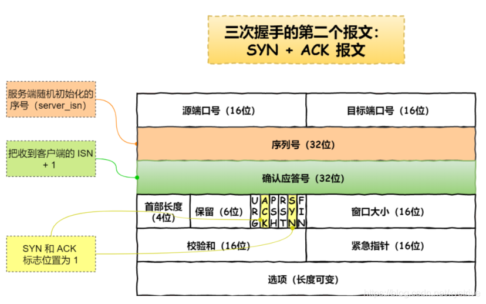

* **三次握手**：客户端此时收到服务器端发送的报文，还要ACK一次，同上ack的序列号+1并且ACK置为1即可。
  这次发送的报文，可以携带应用层数据了，之后客户端处于ESTABLISHED状态。
  当服务器端收到ACK之后也进入ESTABLISHED状态。⼀旦完成三次握⼿，双⽅都处于 ESTABLISHED 状态，此时连接就已建⽴完成，客户端和服务端就可以相互发送数据了


当建立了 3 次握手之后，客户端和服务端就可以传输数据啦！

#### 初始序列号的产生

   起始序列号ISN的产生是基于时钟的，然后再经过hash算法，得到一个初始序列号。
   为什么不使用相同的初始序列号

1. 为了避免历史连接
2. 为了安全考虑，防止黑客伪造序列号


!!! question "为什么要三次握手?"
   
      三次握手的目的是建立可靠的通信信道，说到通讯，简单来说就是数据的发送与接收，而三次握手最主要的目的就是双方确认自己与对方的发送与接收是正常的。

      1. **第一次握手** ：Client 什么都不能确认；Server 确认了对方发送正常，自己接收正常
      2. **第二次握手** ：Client 确认了：自己发送、接收正常，对方发送、接收正常；Server 确认了：对方发送正常，自己接收正常
      3. **第三次握手** ：Client 确认了：自己发送、接收正常，对方发送、接收正常；Server 确认了：自己发送、接收正常，对方发送、接收正常

      三次握手就能确认双方收发功能都正常，缺一不可。

!!! question "两次握手会有什么问题"

      **会造成历史连接的初始化，和多个冗余的无效连接，且无法同步双方初始序列号**

      比如有一个客户端，在网络情况不是很好产生了拥塞的情况下，连续多次发送的发送了SYN建立连接的报文。

      * 客户端发送seq=90，网络拥塞，服务器没收到
      * 客户端接着发送seq=100，网络拥塞服务器又没收到。
      * 过了一会儿，网络畅通了，这个时候客户端本来想着等第二个报文的ACK，没想到旧的SYN（seq=90）这个时候到了服务器，服务器自然就回复一个SYN（随机）+ACK(seq=91)。此时客户端发现自己期望收到的ACK是101而不是91，便可以发起RST，表示连接异常，强行终止了这次连接。（所以客户端在第二次握手结束的时候判断出了这是一个历史连接）
      * 等再过一会儿，新的SYN到了服务器端，其开始按照客户端需要正常进行握手建立tcp连接。

      如果是两次握手：

      **客户端在刚才的第二次握手就不会发现异常，其就建立了历史连接，而三次握手就不会。**


!!! question "第2次握手传回了ACK，为什么还要传回SYN？"

      服务端传回发送端所发送的 ACK 是为了告诉客户端：“我接收到的信息确实就是你所发送的信号了”，这表明从客户端到服务端的通信是正常的。回传 SYN 则是为了建立并确认从服务端到客户端的通信。

      > SYN 同步序列编号(Synchronize Sequence Numbers) 是 TCP/IP 建立连接时使用的握手信号。在客户机和服务器之间建立正常的 TCP 网络连接时，客户机首先发出一个 SYN 消息，服务器使用 SYN-ACK 应答表示接收到了这个消息，最后客户机再以 ACK(Acknowledgement）消息响应。这样在客户机和服务器之间才能建立起可靠的 TCP 连接，数据才可以在客户机和服务器之间传递。

!!! question "三次握手过程中可以携带数据么？"

      **从上⾯的过程可以发现第三次握⼿是可以携带数据的，前两次握⼿是不可以携带数据的**

      如果前两次握手能够携带数据，那么一旦有人想攻击服务器，那么他只需要在第一次握手中的 SYN 报文中放大量数据，那么服务器势必会消耗更多的时间和内存空间去处理这些数据，增大了服务器被攻击的风险。

      第三次握手的时候，客户端已经处于`ESTABLISHED`状态，并且已经能够确认服务器的接收、发送能力正常，这个时候相对安全了，可以携带数据。

#### SYN攻击

TCP连接需要三次握手，假设攻击者短时间伪造不同IP发送大量的SYN报文，以占用服务器资源，攻击者在服务器SYN_RCVD并发送ACK之后却不回复第三次握手的应答，久而久之 **服务器的SYN接收队列就会占满**，从而无法为别的用户提供服务。

**解决方法**

出问题之后解决方法：

1. 修改Linux 内核参数，控制等待数据包队列大小，SYN_RCVD连接数目，队列满时直接丢弃。
   * 网卡接收数据包速度大于内核处理速度时，会将数据包放入一个队列中，我们可以控制该队列的最大值。
   * 可以修改SYN_RCVD连接的最大个数。
   * 当超出处理能力时，所有新的SYN直接回复RST丢弃。

2. 启用tcp_syncookies

   我们发现受到SYN攻击时可能会导致，SYN队列满但是ACCEPT队列可能为空，这时我们启动syncookies，使后续SYN包不进入SYN队列，而是计算cookies，返回客户端一个序列号为（SYN+ACK）的包，此时如果客户端回复的ACK合法，证明其是合法客户端，直接将其加入Accept队列。
      之后就可以顺利进行。


### 4.5 断开连接-TCP 四次挥手

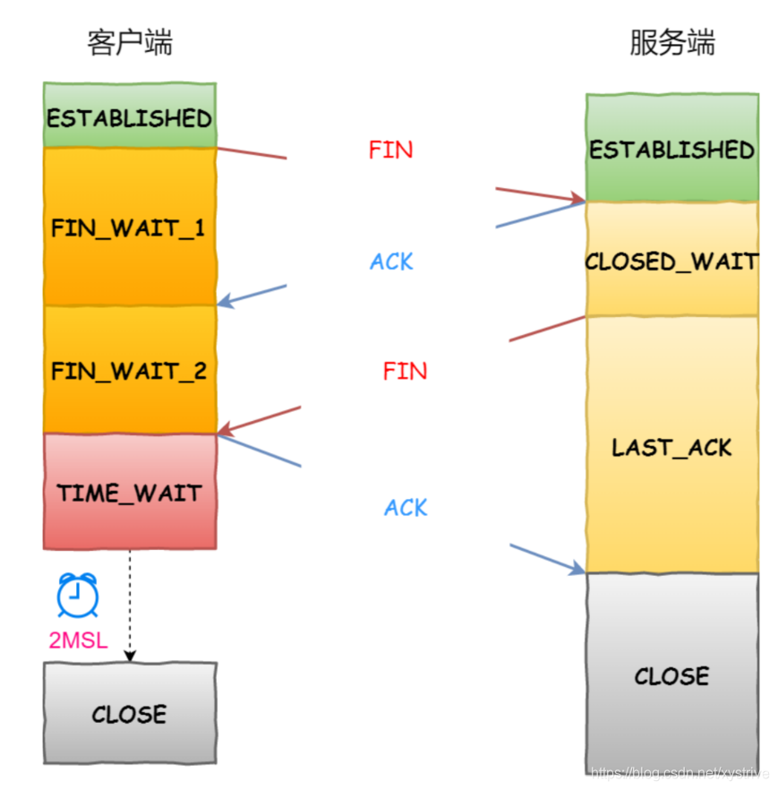

断开一个 TCP 连接则需要“四次挥手”，缺一不可 ：
1. **第一次挥手** ：客户端没有数据需要发送了，打算关闭连接，此时发送`FIN=1`的报文，随后其进入`FIN_WAIT_1`状态
2. **第二次挥手** ：服务器端收到后，就应答`ACK`，然后自己进入`CLOSED_WAIT`状态。客户端收到``ACK`之后，进入第二阶段的等待`FIN_WAIT_2`状态。
3. **第三次挥手** ：服务器处理完数据之后，自己也没有数据需要发送了，向客户端发送`FIN`报文，随后自己进入`LAST_ACK`状态。
4. **第四次挥手**：客户端收到FIN报文回复`ACK`，随后进入`TIME_WAIT`，等待`2MSL`就CLOSE. 服务器端收到`ACK`就可以CLOSE.

至此，每个方向的关闭都需要一个FIN和一个ACK，所以总共4次挥手。
**注意主动关闭连接的一方才有TIME_WAIT状态**（可以理解成主动提出分手的一方会等对方挽回一会儿）

!!! question "为什么要四次挥手?"

      * 关闭连接时，客户端向服务器端发送FIN，表示自己没数据发了，但是自己还能收。
      * 服务器端收到FIN时，先应答一下ACK，表示自己知道你要走了，但服务器端可能自己还有数据需要处理和发送，等自己忙完了，才发送FIN给客户端表示自己也没有数据要发送了。

      服务端通常需要等待完成数据的发送和处理，所以服务端的 ACK 和 FIN ⼀般都会分开发送，从⽽⽐三次握⼿导致多了⼀次。

!!! question "为什么不能把服务器发送的 ACK 和 FIN 合并起来，变成三次挥手？"

      因为服务器收到客户端断开连接的请求时，可能还有一些数据没有发完，这时先回复 ACK，表示接收到了断开连接的请求。等到数据发完之后再发 FIN，断开服务器到客户端的数据传送。

!!! question "如果第二次挥手时服务器的 ACK 没有送达客户端，会怎样？"

      客户端没有收到 ACK 确认，会重新发送 FIN 请求。

!!! question "为什么第四次挥手客户端需要等待 2*MSL（报文段最长寿命）时间后才进入 CLOSED 状态？"

      第四次挥手时，

      1. 客户端发送给服务器的 ACK 有可能丢失，如果服务端没有因为某些原因而没有收到 ACK 的话，服务端就会重发 FIN; 
      
      2. 如果服务端收到自己的ACK，也不会再发任何消息，包括ACK

      无论是1还是2，客户端都需要等待，要取这两种情况等待时间的最大值，以应对最坏的情况发生，这个最坏情况是：**去向ACK消息最大存活时间（MSL) + 来向FIN消息的最大存活时间(MSL)**。这恰恰就是`2MSL`( Maximum Segment Life)。

      等待2MSL时间，客户端就可以放心地释放TCP占用的资源、端口号，此时可以使用该端口号连接任何服务器。

      > MSL(Maximum Segment Lifetime) : 一个片段在网络中最大的存活时间，2MSL 就是一个发送和一个回复所需的最大时间。如果直到 2MSL，Client 都没有再次收到 FIN，那么 Client 推断 ACK 已经被成功接收，则结束 TCP 连接。

!!! question "如果不等待 2MSL，会有什么问题？"

      如果不等待 2MSL，客户端可能会在 2MSL 时间内重用该端口，这样可能会导致服务器端收到一个来自客户端的新的 TCP 连接请求，这时服务器端可能会误认为这是一个新的连接，而不是一个断开后重新建立的连接，这样就会导致服务器端的资源分配错误，从而导致服务器端的资源浪费。

### 4.6 TCP 如何保证传输的可靠性

* **基于数据块传输** ：应用数据被分割成 TCP 认为最适合发送的数据块，再传输给网络层，数据块被称为报文段或段。
* **对失序数据包重新排序以及去重**：TCP 为了保证不发生丢包，就给每个包一个序列号，有了序列号能够将接收到的数据根据序列号排序，并且去掉重复序列号的数据就可以实现数据包去重。
* **校验和** : TCP 将保持它首部和数据的检验和。这是一个端到端的检验和，目的是检测数据在传输过程中的任何变化。如果收到段的检验和有差错，TCP 将丢弃这个报文段和不确认收到此报文段。
* **超时重传** : 当发送方发送数据之后，它启动一个定时器，等待目的端确认收到这个报文段。接收端实体对已成功收到的包发回一个相应的确认信息（ACK）。如果发送端实体在合理的往返时延（RTT）内未收到确认消息，那么对应的数据包就被假设为已丢失open in new window并进行重传。
* **流量控制** : TCP 连接的每一方都有固定大小的缓冲空间，TCP 的接收端只允许发送端发送接收端缓冲区能接纳的数据。当接收方来不及处理发送方的数据，能提示发送方降低发送的速率，防止包丢失。TCP 使用的流量控制协议是可变大小的滑动窗口协议（TCP 利用滑动窗口实现流量控制）。
* **拥塞控制** : 当网络拥塞时，减少数据的发送。

### 4.7 重传机制（序列号与确认应答）

#### 4.7.1 超时重传

设定⼀个定时器，当超过指定的时间后，没有收到对⽅的 ACK确认应答报⽂，就会重发该数据，也就是我们常说的超时重传。
所以要么自己的数据包对面没有收到，要么对面回应的消息自己没有收到。

**超时时间如何设置**

RTT（Round-Trip Time 往返时延）：是数据包的往返时间

RTO（Retransmission Timeout 超时重传时间）

* 如果RTO太小：会造成很多不必要的重传，比如对方其实已经收到了，正在处理，你就催催催，不必要的重传会导致网络负荷增大。

* 如果RTO太大：会使网络空隙时间增大，降低了网络传输的效率。

* RTO应该略大于数据包往返时间RTT。但由于RTT根据网络情况时常变化，所以RTO也随之动态变化。

**超时重传的数据再次超时怎么办？**

每次遇到超时重传，会将下一次的RTO加倍，如果两次超时，说明网络环境差

#### 4.7.2 快速重传

快速重传以数据驱动重传。
如果接收方某一次没有收到预定Seq的包却收到了大于其的包，这说明中间有个包丢了，它会一直回复丢了的那个包的ACK，**当发送方收到三个序号同样的ACK就直接触发重传**，这个过程是比超时重传快的。

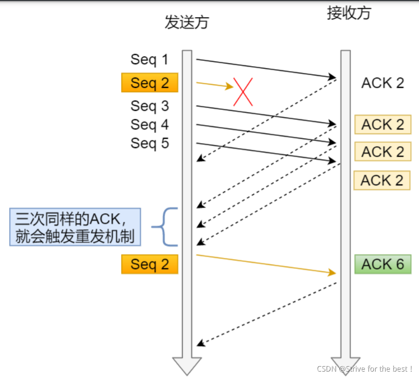


### 4.8 滑动窗口

滑动窗口作用是 **避免发送方每个包都要等着被ACK一下。**

窗口大小代表着：**无需等待接收方确认，发送发可以连续发送数据的数目最大值**

所以滑动窗口下的ACK，**代表着该序号之前的所有数据包接收方都已经收到，这个模式称之为累计应答**

**双方通信的窗口大小如何确定？**

按接收方窗口大小确定。发送方的数据大小不能超过接收方窗口大小。

#### 4.8.1 发送方窗口

发送方一旦按照对方接收窗口确认窗口大小后，窗口内的所有数据包都可以直接发送，每当收到ACK，就用`ACK-当前窗口最小序号=num`，代表现在num个数被收到了，窗口就可以右移num个位置。

发送方主要靠三个指针来确认己方窗口的四种状态

1. 已发送，已ACK；
2. 已发送，未ACK；
3. 未发送，但是可发送 ；
4. 未发送，但超出窗口大小的

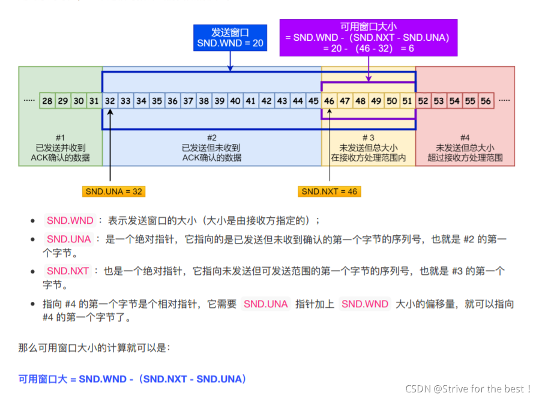

* **SND.WND**：表示发送窗口大小。
* **SND.UNA**:指向已发送但未ACK的第一个序号
* **SND.NXT**:指向未发送但可发送的第一个序号。

#### 4.8.2 接收方窗口：

状态：

* `#1 + #2` 是已成功接收并确认的数据（等待应⽤进程读取）；
* `#3` 是未收到数据但可以接收的数据；
* `#4` 未收到数据并不可以接收的数据；

接收方只需要两个指针就可：

* RCV.WND ：表示接收窗⼝的⼤⼩，它会通告给发送⽅。
* RCV.NXT ：是⼀个指针，它指向期望从发送⽅发送来的下⼀个数据字节的序列号，也就是 #3 的第⼀个字节。
* 指向 #4 的第⼀个字节是个相对指针，它需要 RCV.NXT 指针加上 RCV.WND ⼤⼩的偏移，就可以指向#4 的第⼀个字节了。

!!! question "接收窗口和发送窗口是不是完全相等"

    不是完全相等，是约等于，因为接收方可以按自己的接收能力扩大或缩小接收窗口大小，通过TCP报文的Windows字段告诉发送方，这个过程是有延迟的。

### 4.9 流量控制

流量控制主要是为了发送方根据接收方的实际接收能力控制发送的数据量。

在实际情况下，发送窗口和接收窗口中存放的存放的，都放在操作系统内存缓冲区中，会被操作系统调整。

主要是接收方虽然收到了数据，但是应用层没有把收到的数据读走这样接收方不敢贸然继续接收接收窗口以外的数据，只能不断缩小接收窗口，并回复的时候告诉发送方自己的接收窗口缩小了。

这种情况可能导致接收窗口和发送窗口都逐渐缩小到0；

更极端的情况，如果发送方还没有收到接收方缩小接收窗口（因为接收方应用层缩小了缓存空间）的通知就已经把超出现在接收窗口大小的数据发出去了，接收的数据包大于接收窗口大小，此时接收方直接丢包

#### 4.9.1 窗口关闭现象

假设接收方利用流量控制，不断缩小自己的接收窗口，直到0，这个时候发送方也收到了窗口大小。此时双方的窗口都关闭了

过了一段时间，接收方处理能力上来了，把接收窗口增大了，发消息告诉发送方却丢包了。那么双方进入了持续等待状态，形成死锁

!!!  question "如何解决潜在死锁现象"

    TCP为每个连接设有一个持续定时器，只要TCP某一方收到对方的0窗口通知，就启动计时器。计时器超时的时候，就会发送窗口探测报文 以用来询问对方现在的接收窗口到底是多少。如果三次之后接收窗口还是0，就RST中断连接。

#### 4.9.2 糊涂窗口综合征（粘包问题、nagle）

假设有一个大巴车队，每辆车刚上一两个人就发车了，显然不经济。

**糊涂窗口综合征** 就是：如果接收方每次刚腾出一小块儿几个字节的空间，就告诉发送方，发送方又发送了几个字节，这样的发送体量相对于TCP+IP头部总共40字节的成本来说，显然开销太大。

造成上述原因有两个：

* 接收方可以通告发送方小窗口
* 而发送方也可以发送小数据

解决办法就是：

1. 不让接收方通告小窗口
  **接收方策略**：如果当前窗口大小<min(MSS,缓存空间的一半)时，直接关闭窗口通知发送方窗口为0，阻止数据再发过来。当大于这个min值的时候，就把窗口打开让发送方发
2. 不让发送方发送小数据
  **发送方策略**：`Nagle`算法：延时处理，必需满足以下某一种条件才能发数据：
   
     1. 窗口或数据大小>=MSS
     2. 收到之前数据回复的ACK包（因为如果接收方已经不会通告小窗口了，所以ACK时接收方必定准备好了）
	
	只要没有满足上述两个条件之一，发送方就一直囤积数据。

### 4.10. 拥塞控制

#### 4.10.1 拥塞控制与流量控制的关系

流量控制是 **接收方对发送方发送窗口的调整**，避免发送方的数据填满接收方的缓存。**但对于发送方来说，他并不清楚为什么接收方要做这样的调整**

因为计算机网络处在一个共享的环境之中，所以，发送方发送窗口不一定是因为接收方的调整，还有可能是其他主机之间的通信使得网络发生了拥堵，这个时候发送方如果继续发送大量数据，则会进一步加重网络的负担。形成恶性循环。

所以，**发送方的发送速率不仅仅要看接收方的接收能力，还要看整个网络的接收能力**。

#### 4.10.2 拥塞窗口与发送窗口

拥塞窗口cwnd是发送方维护的一个状态变量，它会根据网络的拥塞程度动态变化。

前面提过的发送窗口与接收窗口是一个约等于的关系。而加入了拥塞窗口之后，发送窗口的值发送了变化

***发送窗口=min(拥塞窗口,接收窗口)***

拥塞窗口主要网络中没有出现拥堵，就增大，反之则减小。
那么如何判断网络是否出现了拥塞呢，**出现超时重传报文，就认为网络出现了拥塞**

#### 4.10.3 拥塞控制四大算法

**1. 慢启动**

当TCP刚建立一个连接的时候，它并不清楚发送多少数据比较合适，所以有个慢启动的过程，一点点的试探自己能发多少比较合适。（即 **避免上来就发送大量的数据**）

**发送方每收到一个ACK，拥塞窗口cwnd就增加一。也就是说，每经过一个 RTT，cwnd 翻倍。如果说初始窗口为 10，那么第一轮 10 个报文传完且发送端收到 ACK 后，cwnd 变为 20，第二轮变为 40，第三轮变为 80，依次类推。拥塞窗口线性增长，实际每次发包数量是一个指数型增长**

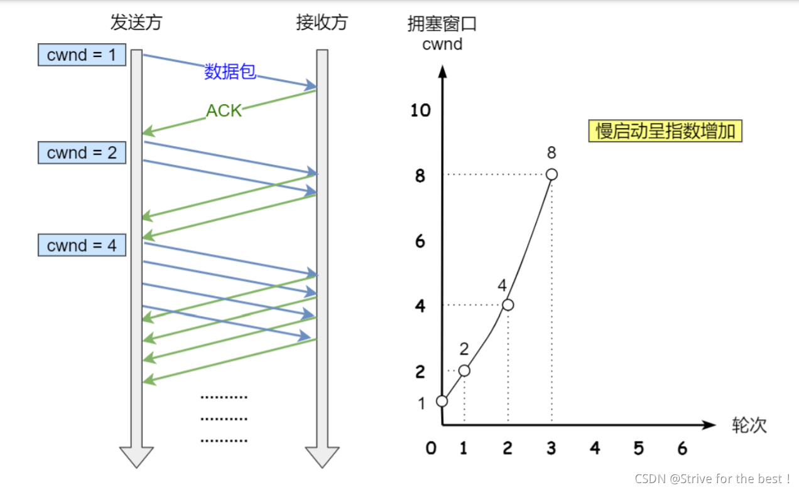

因为指数爆炸性增长，我们得设置一个上限，避免其一直慢启动指数型增长：
**慢启动门限ssthresh（slow start threshold）:**

- 拥塞窗口cwnd<慢启动门限ssthresh,使用慢启动算法。
- **cwnd>=ssthresh,使用拥塞避免算法**

一般来说ssthreash的大小是65535字节。

**2.拥塞避免**

拥塞避免算法：**每收到一个ACK，拥塞窗口只增加1/cwnd**
由于发生拥塞避免的时候，拥塞窗口大于慢启动门限，当收到cwnd个ACK确认时，cwnd增加一。
**拥塞避免算法使得数据变成了线性增长**

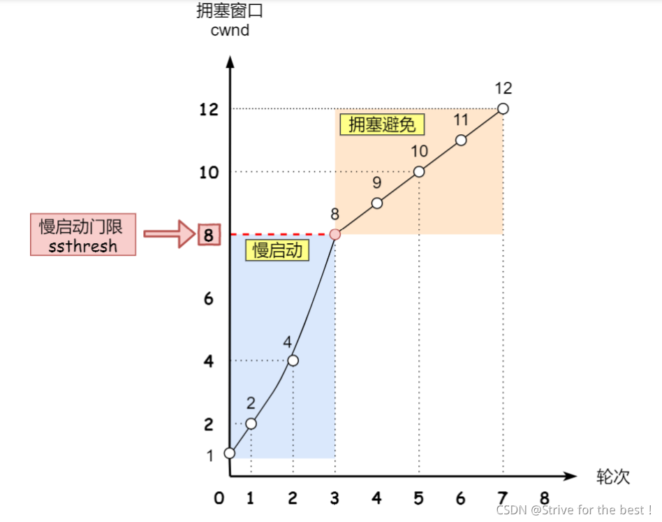

**3.拥塞发生**

**一旦发生了重传，即拥塞发生**
重传分为两种：

- **超时重传**

  超时重传发生时，门限和拥塞窗口都发生变化：

  - 门限ssthresh变为拥塞窗口cwnd的一半
  - 而后拥塞窗口重置为1

  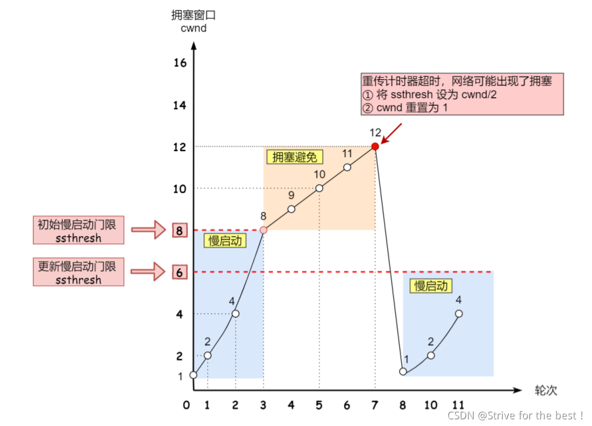

  随后就是正常的慢启动了。

- **快速重传**

  当连续收到三个同样的ACK，这时代表接收方发现丢了中间某一个包，发送方就可以快速的重传这个包。
  此时有三个反应：

  1. 将拥塞窗口减半。cwnd/=2;

  2. 将门限和拥塞窗口相等。ssthresh=cwnd。

  3. 开始快速恢复算法

     当发生快速重传的时候，你发送方还能收到三个一样的ACK，说明网络情况没有超时重传那么糟糕。
     按快速重传，拥塞窗口减半了，慢启动门限等同于拥塞窗口了。

     此时快速恢复：

     * 拥塞窗口cwnd=ssthresh+3;拥塞窗口在刚才减半之后先加3，代表已经收到了三个ACK.（如还有重复ACK,cwnd再加一）；
     * 重传数据。
     * 如果收到新数据的ACK说明网络已经恢复，此时门限值恢复重传之前的值，并开始拥塞避免。

     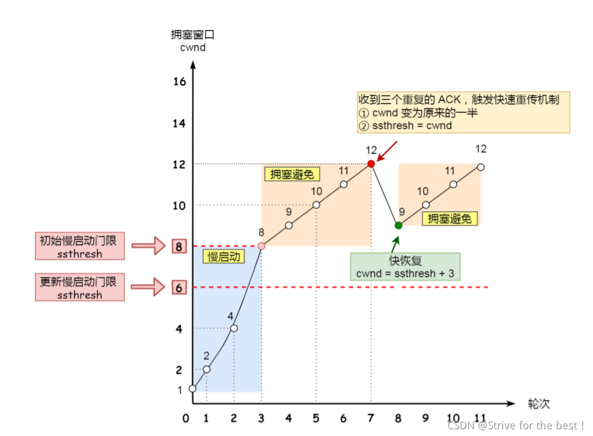

**拥塞算法总体如下图**

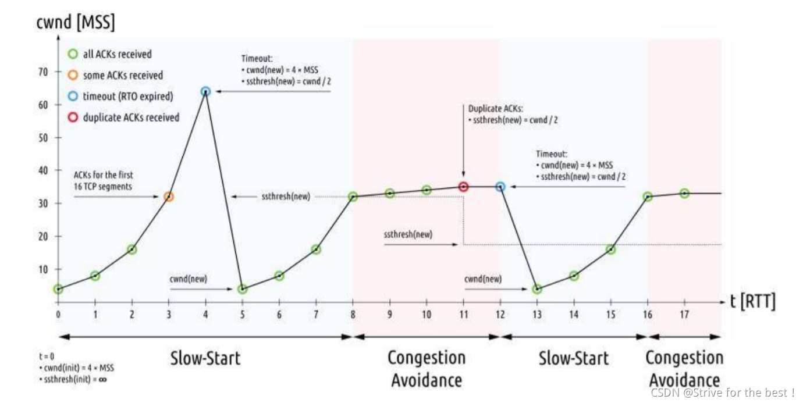

1. 慢启动
2. 发生超时重传，门限变为拥塞窗口的一半，拥塞窗口重置为1.
3. 慢启动
4. 达到慢启动门限，开始拥塞避免，线性增长。
5. 发生快速重传，门限减半，拥塞窗口减半之后加3.快速恢复，门限恢复。拥塞避免。

### 4.11 Socket

#### 4.11.1 是什么

* Socket 是 **对 TCP/IP 协议族的一种封装，是应用层与TCP/IP协议族通信的中间软件抽象层**。从设计模式的角度看来，Socket其实就是一个门面模式，它把复杂的TCP/IP协议族隐藏在Socket接口后面，对用户来说，一组简单的接口就是全部，让Socket去组织数据，以符合指定的协议。
* Socket 还可以认为是一种网络间不同计算机上的 **进程通信的一种方法**，利用三元组（ip地址，协议，端口）就可以唯一标识网络中的进程，网络中的进程通信可以利用这个标志与其它进程进行交互。
* Socket 起源于 Unix ，Unix/Linux 基本哲学之一就是“一切皆文件”，都可以用“打开(open) –> 读写(write/read) –> 关闭(close)”模式来进行操作。因此 **Socket 也被处理为一种特殊的文件**。

#### 4.11.2 Socket 编程

**服务端编程**

1. **创建 Socket**。
2. **绑定 Socket**。
3. **监听 Socket**。
4. **接收 & 处理信息**。

其代码如下所示：

```python
import socket

def server():
  # 1、创建 Socket
  s = socket.socket()
  host = "127.0.0.1"
  port = 5678

  # 2、绑定 Socket
  s.bind(host, port)

  # 3、监听
  s.listen()

  # 4、发送数据
  while True:
  c, addr = s.accept()
  print("connect addr", addr)
  c.send(b'Socket Study.')
  c.close()
```

**客户端编程**

1. **创建 Socket**。
2. **连接 Socket**。
3. **发送消息**。

其代码如下所示：

```python
import socket


def client(i):
  # 1、创建 Socket
  s = socket.socket()

  # 2、连接 Socket
  s.connect(('127.0.0.1', 5678))

  # 3、接收消息
  print("Received message:%s, client Id:%d" % (s.recv(1024), i))
  s.close()


if __name__ == '__main__':
  for i in range(10):
  client(i)
```


## 6. WebSocket

## 6.1  是什么

WWebSocket，是一种网络传输协议，位于`OSI`模型的应用层。可在单个`TCP`连接上进行全双工通信，能更好的节省服务器资源和带宽并达到实时通迅

客户端和服务器只需要完成一次握手，两者之间就可以创建持久性的连接，并进行双向数据传输

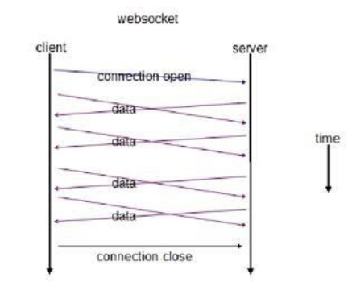

从上图可见，`websocket`服务器与客户端通过握手连接，连接成功后，两者都能主动的向对方发送或接受数据

而在`websocket`出现之前，开发实时`web`应用的方式为轮询

不停地向服务器发送 HTTP 请求，问有没有数据，有数据的话服务器就用响应报文回应。如果轮询的频率比较高，那么就可以近似地实现“实时通信”的效果

轮询的缺点也很明显，反复发送无效查询请求耗费了大量的带宽和 `CPU `资源

### 6.2 特点

#### 6.2.1 全双工

通信允许数据在两个方向上同时传输，它在能力上相当于两个单工通信方式的结合

例如指 A→B 的同时 B→A ，是瞬时同步的

#### 6.2.2 二进制帧

采用了二进制帧结构，语法、语义与 HTTP 完全不兼容，相比`http/2`，`WebSocket `更侧重于“实时通信”，而`HTTP/2` 更侧重于提高传输效率，所以两者的帧结构也有很大的区别

不像 `HTTP/2` 那样定义流，也就不存在多路复用、优先级等特性

自身就是全双工，也不需要服务器推送

#### 6.2.3 协议名

引入`ws`和`wss`分别代表明文和密文的`websocket`协议，且默认端口使用80或443，几乎与`http`一致

```
ws://www.chrono.com
ws://www.chrono.com:8080/srv
wss://www.chrono.com:445/im?user_id=xxx
```

#### 6.2.4 握手

`WebSocket `也要有一个握手过程，然后才能正式收发数据

客户端发送数据格式如下：

```
GET /chat HTTP/1.1
Host: server.example.com
Upgrade: websocket
Connection: Upgrade
Sec-WebSocket-Key: dGhlIHNhbXBsZSBub25jZQ==
Origin: http://example.com
Sec-WebSocket-Protocol: chat, superchat
Sec-WebSocket-Version: 13
```

- Connection：必须设置Upgrade，表示客户端希望连接升级
- Upgrade：必须设置Websocket，表示希望升级到Websocket协议
- Sec-WebSocket-Key：客户端发送的一个 base64 编码的密文，用于简单的认证秘钥。要求服务端必须返回一个对应加密的“Sec-WebSocket-Accept应答，否则客户端会抛出错误，并关闭连接
- Sec-WebSocket-Version ：表示支持的Websocket版本

服务端返回的数据格式：

```
HTTP/1.1 101 Switching Protocols
Upgrade: websocket
Connection: Upgrade
Sec-WebSocket-Accept: s3pPLMBiTxaQ9kYGzzhZRbK+xOo=Sec-WebSocket-Protocol: chat
```

- HTTP/1.1 101 Switching Protocols：表示服务端接受 WebSocket 协议的客户端连接
- Sec-WebSocket-Accep：验证客户端请求报文，同样也是为了防止误连接。具体做法是把请求头里“Sec-WebSocket-Key”的值，加上一个专用的 UUID，再计算摘要

#### 6.2.5 优点

- 较少的控制开销：数据包头部协议较小，不同于http每次请求需要携带完整的头部
- 更强的实时性：相对于HTTP请求需要等待客户端发起请求服务端才能响应，延迟明显更少
- 保持创连接状态：创建通信后，可省略状态信息，不同于HTTP每次请求需要携带身份验证
- 更好的二进制支持：定义了二进制帧，更好处理二进制内容
- 支持扩展：用户可以扩展websocket协议、实现部分自定义的子协议
- 更好的压缩效果：Websocket在适当的扩展支持下，可以沿用之前内容的上下文，在传递类似的数据时，可以显著地提高压缩率

### 6.3 应用场景

基于`websocket`的事实通信的特点，其存在的应用场景大概有：

- 弹幕
- 媒体聊天
- 协同编辑
- 基于位置的应用
- 体育实况更新
- 股票基金报价实时更新

## 参考

[(建议收藏)TCP协议灵魂之问，巩固你的网路底层基础](https://juejin.cn/post/6844904070889603085)

[（建议精读）HTTP灵魂之问，巩固你的 HTTP 知识体系](https://juejin.cn/post/6844904100035821575)
[HTTP详解之HTTPS](https://juejin.cn/post/6939183379238060069)

[TCP详解](https://blog.csdn.net/xystrive/article/details/116427300)

[说说对WebSocket的理解](https://github.com/febobo/web-interview/issues/152)

