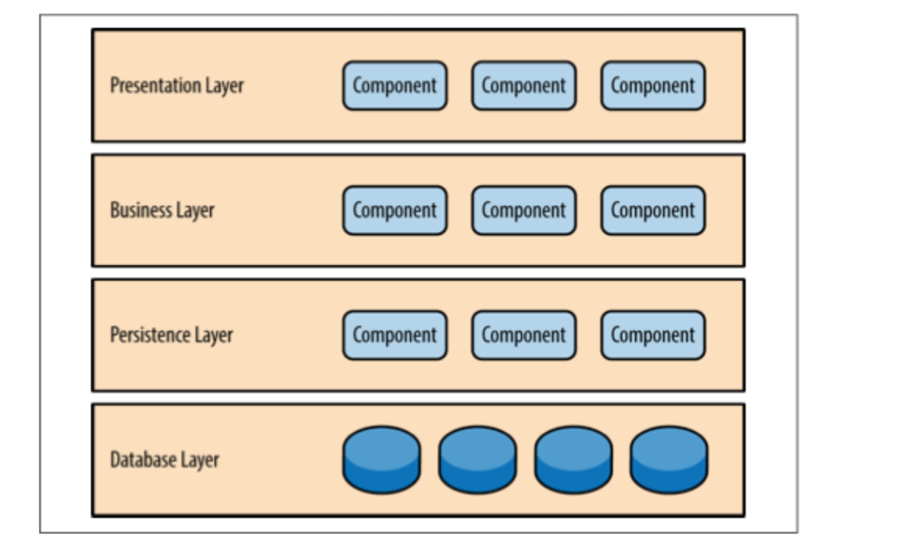

## 1.系统、模块、组件、框架

系统是由一组实体和这些实体的关系所构成的集合，其功能要大于这些实体各自的功能之和。

>  举例说，一堆砖瓦木头不能遮风挡雨，但它们可以组成一个温暖的房子，房子的功能大于这一堆材料的功能之和，所以房子是一个系统。

模块与组件都是系统的组成部分，从不同角度拆分系统而已。模块是逻辑单元，从业务维度上职责的划分；组件是物理单元，从技术维度上的复用。

框架是为了实现某个业界标准或完成特定基本任务的 **软件组件规范**，也指为了实现某个软件组件规范时，提供规范所要求之 **基础功能的软件产品**，如`flask`、`Django`、`Spring`

## 2. 什么是架构

架构是有关软件 **整体结构与组件的抽象描述**，用于指导大型软件系统各个方面的设计。架构只是设计的抽象，对于具体的实现，我们可以称之为框架。好的框架可以隐藏大家不需要关心的部分，提升我们的效率。可以看出框架和架构都和组件有关系，但架构关注的是“结构”，框架关注的是“规范”。

面对业务需求场景给出合适的解决方案，使业务能够快速迭代，从而达到“提质增效”的目标。架构是一个介于需求与实现中间的步骤，既要分析需求，又要可以提出可行的实现方案，是软件系统的顶层结构。

##3. 架构选型

* 框架的成熟度

  框架是否已经被大量应用所实践，特别是亿级以上的应用。还有就是框架目前是否还在维护、框架的性能如何等

* 工具链的成熟度

  配套的工具链是否成熟、完善。例如 Flutter 作为一门新的技术，从开发、编译、测试到发布，是否有完善的工具链支持

* 人员的学习成本、文档是否完备

  结合团队的现状，需要考虑框架的学习成本是否可以接受、学习路径是否平滑、有没有足够的文档和社区支持

> 组织架构、代码架构以及流程都应该跟我们团队的规模相匹配。
>
> 架构设计或者架构选型不能好高骛远，我们有多大的规模，就做多少的支撑。警惕长期的事情短期做，或者短期的事情长期做。
>
> ["康威定律"](https://blog.csdn.net/junecauzhang/article/details/61427915)

## 4. 架构设计3个阶段

* 预备阶段

需求分析，建立需求大局观、确定架构设计方向

* 概念阶段

划分子系统和模块，完成实体抽象，定义系统边界和系统所处的环境。

* 细化阶段

定义交互机制，也就是要定义内、外部接口。

持续关注非功能需求

预测最终功能实现、验证架构并作出调整

### 4.1  预备阶段

架构设计毫无疑问是需求驱动的。全面理解需求，从而把握需求特点，对架构设计至关重要。

#### 4.1.1 需求类型：

从纵向(需求层次)来区分需求可以划分为三种类别

> 不同层次的涉众提出需求所站立场不同

* 业务级需求

  我们要干什么：愿景/产品故事，制定业务目标、工期要求，以及要符合哪些标准

* 用户级需求

  用户要干什么/能完成什么：围绕业务级的愿景，拆分用户在不同场景的不同需求，着重场景的梳理

* 开发级

  开发人员要干什么：基于用户级需求进一步拆分，输出功能列表，评估开发质量

从横向(需求方面)来区分需求可以也划分为三种类别

> 需求定义了直接目标还是间接目标

* 功能需求

  更多体现了上面各级直接目标要求

* 质量属性

  运行期质量+开发期质量

* 约束需求： 

  业务环境+使用环境+构建环境+技术环境

任何需求都可定位于业务级需求、用户级需求、开发级需求这3个需求层次的某一层，同时也必属于功能、质量、约束这3类需求的某一类。  

需求层次和需求方面关系可以用以下表格来表示

|            |   功能   |    质量    |                         约束                         |
| ---------- | :------: | :--------: | :--------------------------------------------------: |
| 业务级需求 | 业务目标 | 快、好、省 |      技术性约束、法规性约束、竞争因素与竞争对手      |
| 用户级需求 | 用户需求 | 运行期质量 |                 用户群特点、用户水平                 |
| 开发级需求 | 行为需求 | 开发期质量 | 开发团队技术水平、开发团队磨合程度、开发团队业务知识 |

不同需求，影响架构的原理不同

| 需求 | 基本原理                     | 对架构设计的影响                                             |
| ---- | ---------------------------- | ------------------------------------------------------------ |
| 功能 | 功能是发现职责的依据         | 每个功能都是由一条“职责协作链”完成的 — 将职责分配到子系统，为子系统界定接口、确定基于接口的交互机制 |
| 质量 | 质量是完善架构设计的动力     | 基于当前的架构设计中间成果，进一步考虑具体质量要求，对架构设计中间成果进行细化、调整、甚至推倒重来，一步步地使架构设计完善起来 |
| 约束 | 约束对架构设计的影响分为几类 | 1. 直接制约设计决策的约束（例如：“系统运行在Unix平台之上”）2.转化为功能需求的约束（例如：”本银行系统执行现有利率“引出“利率调整”功能）3. 转化为质量属性需求的约束（例如：“柜员机计算机水平不高” 引出易用性需求） |

> **对需求理解不透、遗漏需求往往是架构设计失败的重要原因**

#### 4.1.2  关键需求决定架构，其余需求验证架构

- 功能需求做减法。在所有功能中挑选一个“ **关键功能子集**”
  	* 核心功能
  	* 必做功能
  	* 高风险功能
- 质量属性需求做减法。根据系统所在领域的特点及系统规模等因素，确定架构设计重点支持那些质量属性
- 约束性需求做加法。充分考虑需求方及业务环境因素、用户群及使用环境因素、开发方及构建环境因素、业界当前技术环境等“4类约束”，以“做加法”的思维分析约束影响、识别约束背后的衍生需求。

#### 4.1.3  B2C 案例

### 4.2 概念阶段

### 4.2.1 子系统划分原则

- 职责分离原则

  职责之间常常是上层使用下层的关系---但是根本不关心上层和下层是否“能分布”在不同的机器上。

- 通用专用分离原则

  将通用性不同的部分划归不同的层，一般而言，通用程度越大，所处的层次就越靠下。

- 技能分离原则

  需要不同开发技能的单元划归不同子系统

- 工作量均衡原则

  兼顾工作量的相对均衡，进一步切分太大的子系统

> 概念阶段满足“架构=组件+交互”的基本定义，只不过概念架构仅关注高层组件
>
> 概念阶段对高层组件的“职责”进行笼统的界定，并给出了高层组件之间的相互关系
>
> 概念架构不应该涉及接口细节

### 4.3 细节阶段

 * 定义交互机制

基于接口编程？消息机制？远程方法调用？

 * 持续关注非功能需求

速度？吞吐量？CPU使用率？网络IO？

 * 预测最终功能实现、验证架构并作出调整

质疑—> 验证 —> 改进

## 5. 架构演进

### 5.1 为什么

架构是为了业务需求场景服务，那它也要顺应业务的变化而适时调整。也就是说，架构需要跟随业务的发展而演进。

### 5.2 好处

* 打破不满

  需要打破保守的做法，要积极面对不合理的地方。团队定期需要着手开启重构，将大家平日对代码的不满释放出来。将架构的腐化（效率降低、抱怨上升）转化为架构优化的动力。

* 重构信任

  重构开发者之间的心态，不定期的推动模块重构。一些问题的解决，往往可以推动更多人去尝试。

* 团队培养

  重构也是团队进步的机会，让更多的成员掌握架构能力，培养全员架构意识，实现“人人都是架构师”

### 5.3 技术视野（辨别能力）

结合业务和团队当前的情况，做出合理的判断，要清楚的知道做什么事情收益最大。

* 技术栈的选择和比较
* 架构设计的考虑

### 5.4 怎么做

* 演进式的，符合团队现状的

  需要权衡性能、成本、时间三者的关系

* 可度量的，每个阶段都要有成果

​		分阶段实施，并且每个阶段都要有成果

##6.  架构风格、架构模式、设计模式、代码模式

### 6.1  架构风格

  架构风格非常粗略地告诉我们应该如何组织代码。它的粒度比较大，说明了应用的分层和高层级的模块，这些模块和层次之间如何交互，以及它们的关系。架构风格的例子有：

  - 基于组件
  - 单体应用
  - 分层
  - 管道和过滤器
  - 事件驱动
  - 发布订阅
  - 插件
  - 客户端服务器
  - 面向服务

### 6.2 架构模式

> **模式** — 在某种场景下重复发生的问题的解决办法

  架构模式解决的就是和架构风格相关的问题。例如，“ *要实现一个特定层次组合的系统，我们需要哪些类，它们又如何交互*”，或者“ *我们的面向服务架构中需要多少高层级的模块，而它们应该如何通信*”，又或者“ *我们的客户端服务器架构要分成多少个物理层*”。架构模式是一个系统的高层次策略，涉及到大尺度的组件以及整体性质和力学。架构模式的好坏可以影响到总体布局和框架性结构。

  * MVC
  * MVP
  * MVVM
  * 微内核

### 6.3 设计模式

  设计模式是适用于软件设计和开发领域的一种模式，是对软件开发过程中重复发生的问题的解决办法。设计模式是中等尺度的结构策略。这些中等尺度的结构实现了一些大尺度组件的行为和它们之间的关系。模式的好坏不会影响到系统的总体布局和总体框架。设计模式定义出子系统或组件的微观结构。

### 6.4 代码模式（或成例）

  代码模式（或成例）是特定的范例和与特定语言有关的编程技巧。代码模式的好坏会影响到一个中等尺度组件的内部、外部的结构或行为的底层细节，但不会影响到一个部件或子系统的中等尺度的结构，更不会影响到系统的总体布局和大尺度框架。

##7. 常见架构模式

###7.1 分层

分层架构模式里的组件被分成⼏个平行的层次，每一层都代表了应用的一个功能(展⽰示逻辑或者业务逻辑)。
尽管分层架构没有规定⾃自⾝身要分成几层几种，大多数的结构都分成四个层次:展⽰层，业务层，持久层，和数
据库层。

分层架构的一个突出特性是组件间关注点分离。一个层中的组件只会处理本层的逻辑。比如说，展⽰层的组件只会处理展示逻辑，业务层中的组件只会去处理业务逻辑

分层架构的另外一个特性是层隔离，就是说架构中的某一层的改变不会影响到其他层:这些变化的影响范围限于当前层次。如果展示层能够直接访问持久层了，假如持久层中的SQL变化了，这对业务层和展⽰示层都有一定的影响。

###7.2 事件驱动架构

事件驱动架构模式是一种主流的异步分发事件架构模式，常用于设计高度可拓展的应⽤。当然了，它有很高
的适应性，使得它在小型应用、大型应用、复杂应用中都能表现得很好。事件驱动架构模式由高度解耦、单
⼀目的的事件处理组件构成，这些组件负责异步接收和处理事件。

###7.3 微内核架构

微内核架构模式可以通过插件的形式添加额外的特性到核⼼心系统中，这提供了很好的扩展性，也使得新特性与核⼼系统隔离开来。( 比如，著名的Eclipse IDE就是基于插件化开发的，eclipse核心更像是一个微内核，
或者我们可把它叫做开放平台，其他的功能通过安装插件的形式添加到eclipse中。 )

###7.4 微服务架构

 **服务组件**

不要考虑微服务架构内部的服务，⽽最好是考虑服务组件，从粒度上讲它可以小到单⼀的模块，或者⼤至一个应用程序。服务组件包含⼀个或多个模块(如Java类)，这些模块可以提供⼀个单一功能(如，为特定的城市或城镇提供天⽓气情况)，或也可以作为一个大型商业应用的⼀个独⽴部分(如，股票交易布局或测定汽⻋车保险的费率)。在微服务架构中，正确设计服务组件的粒度是⼀个很大的挑战。

**分布式**

微服务架构模式的另⼀个关键概念是它是一个分布式的架构，这意味着架构内部的所有组件之间是完全解耦
的，并通过某种远程访问协议(如， JMS, AMQP, REST, SOAP, RMI等)进⾏行访问。这种架构的分布式特性
是它实现⼀些优越的可扩展性和部署特性的关键所在。

> 微服务架构模式的主要挑战之一就是决定服务组件的粒度级别。如果服务组件粒度过粗，那你可能不会意识 到这个架构模式带来的好处(部署、可扩展性、可测试性和松耦合)，然而,服务组件粒度过细将导致很快将微服务架构模式变成⼀个复杂、容易混淆、代价昂贵并易于出错的重量级面向服务架构。 

## 8小结

架构设计不一定是整个应用或者系统的设计，也可以是一个模块或者一个需求的设计。每接手一个需求，我们可以对自己提更高的要求，更加细致地考虑问题。例如如何对现有代码的影响最小，如何快捷清晰的实现功能，在开发过程中如何对组件、控件做更好的封装，如何去优化性能，有没有哪些新的技术可以帮助开发这个需求等。

## 参考

《一线架构师实践指南》