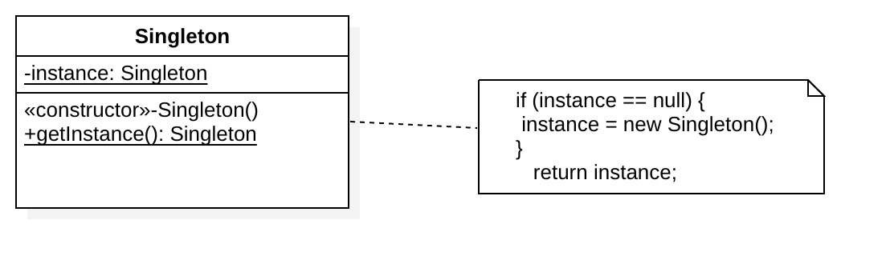

## 1. 定义

一个类只有一个实例，并且自行提供一个访问该实例的全局访问点

## 2. 类图



## 3. 范例

### 3.1  Java

```java
public class Singleton {

    private static Singleton instance;

    private Singleton() {
         System.out.println("Singleton class created");
    }

    public static Singleton getInstance() {
        if (instance == null) {
            instance = new Singleton();
        }
        return instance;
    }
}

# test
void test() {
    Singleton singleton1 = Singleton.getInstance();
    Singleton singleton2 = Singleton.getInstance();
    System.out.println(singleton1 instanceof Singleton);
    System.out.println(singleton2 instanceof Singleton);
    System.out.println(singleton1 == singleton2);
}

# 输出：
Singleton class created
true
true
true
```

### 3.2 JS

```javascript
'use strict';
let _singlenton = null
class Singleton{
    constructor(){
        if(! _singlenton){
            _singlenton=this
        }
        return _singlenton
        console.log("Singleton class created");
    }
}
# test
function test() {
    var singleton1 = new Singleton()
    var singleton2 = new Singleton()
    console.log(singleton1 instanceof Singleton)
    console.log(singleton2 instanceof Singleton)
    console.log(singleton1 === singleton2)
}

# 输出：
Singleton class created
true
true
true
```

##4.注意点

1. 单例类的构造函数为私有 
2. 提供一个自身的静态私有成员变量；
3. 提供一个公有的静态工厂方法。

## 5.优点

1. 节约系统资源、提高系统的性能--不需要频繁创建和销毁的对象。
2. 共享实例，减少不必要的bug-- 当应用存在多个实例，实例间互相作用，可能会有意想不到的bug。

## 6.缺点

1. 没有抽象层，扩展困难

2. 违背“单一职责”原则，既是工厂---创建对象，又是业务管理员--涉及产品业务逻辑

3. 处理不当，可能会出现内存泄露（Android）

## 7.适用场景

1. 资源共享
   * 日志服务，日志服务一般从应用启动后就处于打开状态，可以随时输出和输入日志，不需要重复创建和销毁
   * 应用配置，配置文件是共享的资源，一般在应用内是公用的
2. 资源管理，状态控制
   * 计数器，维护同步状态
   * 线程池，控制线程通信和数量


