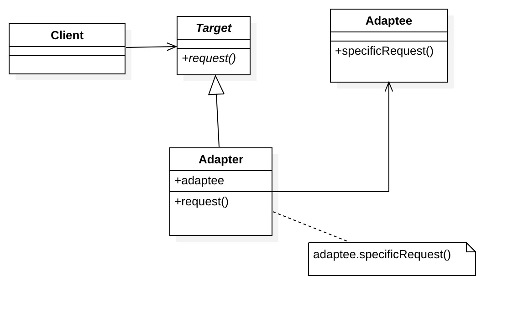
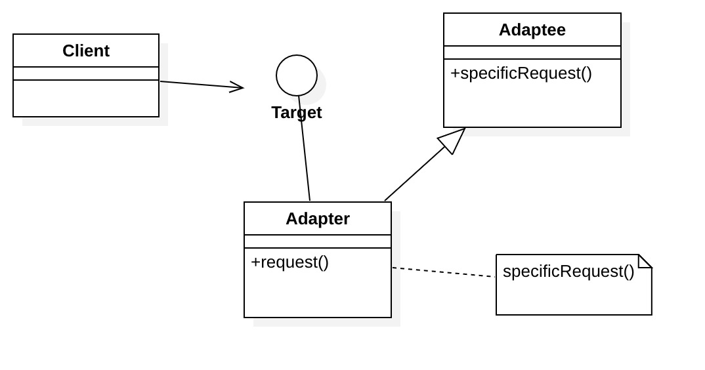

## 1. 动机

有时，存在由于接口不兼容而不能一起工作的类，这时候需要一个“桥梁”去包装其中一个接口，使其转换成能兼容另外一个接口，从而两个类能一起工作。

## 2. 定义

将一个类的接口转接成用户所期待的，使得因接口不兼容而不能在一起工作的类能在一起工作。

## 3. 角色

* Target： 目标抽象类

> 客户所期待的接口

* Adapter： 适配器类

> 核心成员，使用Adaptee的方法来满足Target的需求

* Adaptee：被适配者

> 需要被适配的角色

* Client： 客户类

### 3.1. 对象适配模式

适配器容纳一个它包裹的类的实例。在这种情况下，就形成一种适配器调用被包裹对象的实例。



代码实现如下

```java
public abstract class Target {
    public abstract void showStrongA();
    public abstract void showStrongB();
}

public class Adaptee {
    public void showA(){
        System.out.println("A");
    }

    public void showB(){
        System.out.println("B");
    }
}
public class Adapter extends Target{
    private Adaptee adaptee;

    public Adapter(Adaptee adaptee) {
        this.adaptee = adaptee;
    }


    @Override
    public void showStrongA() {
        adaptee.showA();
    }

    @Override
    public void showStrongB() {
        adaptee.showB();
    }
}

/** "Client" */

    public static void main(String[] args){
        Adapter adapter = new Adapter(new Adaptee());
        adapter.showStrongA();
        adapter.showStrongB();
    }
```

### 3.2. 类适配器模式

这种适配器模式下，适配器类实现了目标抽象类接口并继承了适配者类，并在目标抽象类的实现方法中调用所继承的适配者类的方法。



代码实现如下：

```java
public interface Target {
    void showStrongA();
    void showStrongB();
}

public class Adaptee {
    public void showA(){
        System.out.println("A");
    }

    public void showB(){
        System.out.println("B");
    }
}

public class Adapter extends Adaptee implements Target {
    @Override
    public void showStrongA() {
        showA();
    }
    @Override
    public void showStrongB() {
        showB();
    }
}

public class Main {
    public static void main(String[] args){
        Adapter adapter = new Adapter();
        adapter.showStrongA();
        adapter.showStrongB();
    }
}
```

## 4.优点

* 解耦

将目标类和适配者类解耦，通过引入一个适配器类来重用现有的适配者类，而无须修改原有代码。

* 增加了类的透明性和复用性

将具体的实现封装在适配者类中，对于客户端类来说是透明的，而且提高了适配者的复用性。

* 增加灵活性和扩展性

可以在不修改原有代码的基础上增加新的适配器类，完全符合“开闭原则”

**类适配器模式**

* 代码简洁
* 适配器类是适配者的子类，适配器可以更换适配者的方法实现

**对象适配器模式**

* 根据 *“里氏代换原则”* ，同一个适配器可以把适配者类和它的子类都适配到目标接口。

## 5.缺点

**类适配器模式**

* 对于Java、C\#等不支持多重继承的语言，一次最多只能适配一个适配者类，而且目标抽象类必须是接口，有一定局限性

**对象适配器模式**

* 与类适配器相比，如果需要更换适配者的方法实现，需要先创建一个适配者的子类，然后把适配者的子类当做真正的适配者进行适配，实现过程较为复杂。

## 6.适用场景

* 想要建立一个可以重复使用的类，用于与一些彼此之间没有太大关联的一些类一起工作。

> 譬如 ，Android 的Adapter可以连接后端数据和前端显示，从而将各种数据以合适的形式显示到view上。

* 需要使用系统现有正常运行的类，但这些类的接口不符合系统的需要


