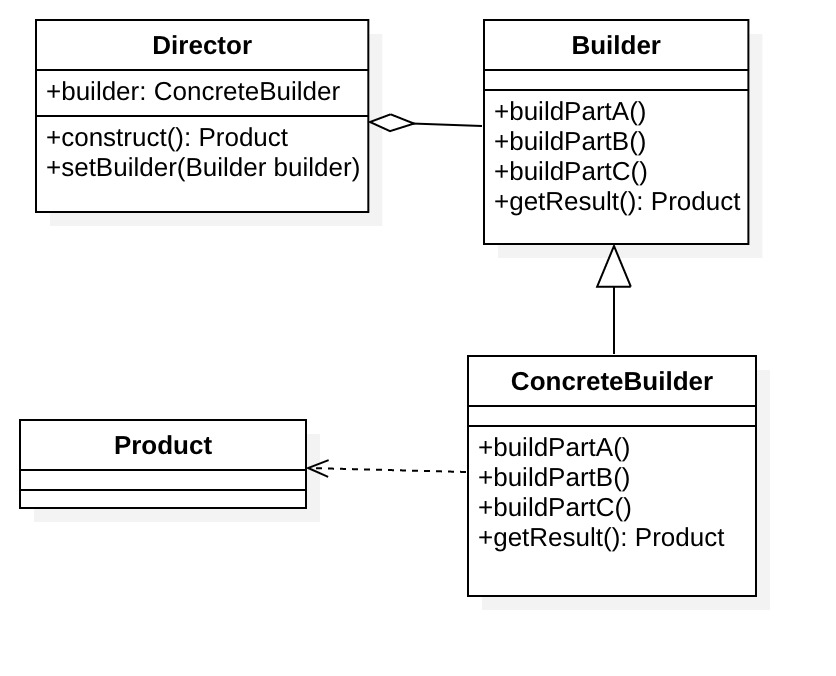
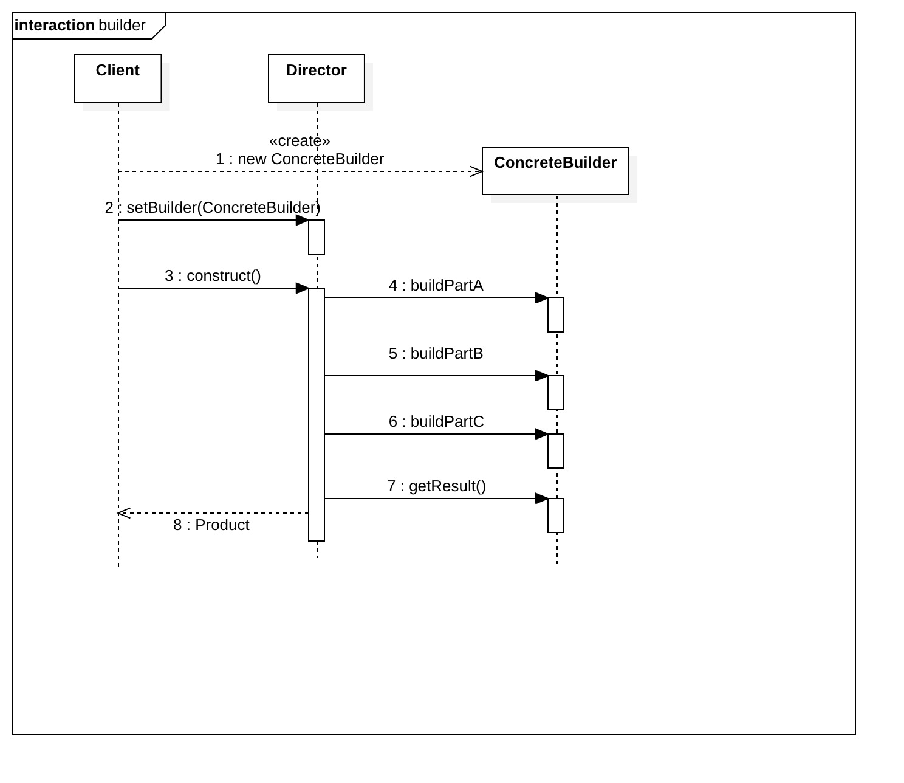

## 1.定义

将复杂对象的建造过程抽象出来，使这个抽象过程的不同实现方法可以构造出不同表现（属性）的对象。

## 2.角色

- Builder：抽象建造者，为创建一个Product对象的各个部件指定抽象接口。

- ConcreteBuilder：具体建造者，实现Builder的接口以构造和装配该产品的各个部件。定义并明确它所创建的表示。

- Director：指挥者/导演，构造一个使用Builder接口的对象。

- Product：产品，表示被构造的复杂对象。



## 3.时序图



## 4.范例

> 肯德基套餐

在肯德基，有主食(汉堡、鸡肉卷)、饮料(可乐、果汁)，它们经常组合成一个个“套餐”，不同的套餐有不同的组成，服务员会根据顾客的要求，搭配这些主食和饮料，组合成一份完整的套餐，这个场景可以通过建造者模式来描述

代码实现如下：

```java
/** "Product" */
public class Meal {
    private String food;
    private String drink;
    public String getFood() { return food; }
    public void setFood(String food) { this.food = food; }
    public String getDrink() { return drink; }
    public void setDrink(String drink) { this.drink = drink; }
}

/** "Abstract Builder" */
public abstract class MealBuilder {
    protected Meal mMeal;
    public MealBuilder() { mMeal = new Meal(); }
    public Meal getMeal() { return mMeal; }
    public abstract void buildFood();
    public abstract void buildDrink();
}

/** "ConcreteBuilder" */
public class HamburgerBuilder extends MealBuilder{
    @Override
    public void buildFood() { mMeal.setDrink("hamburger"); }
    @Override
    public void buildDrink() { mMeal.setDrink("cola"); }
}

/** "ConcreteBuilder" */
public class ChickenRollBuilder extends MealBuilder {
    @Override
    public void buildFood() { mMeal.setFood("Chicken Roll"); }
    @Override
    public void buildDrink() { mMeal.setDrink("fruit juice");}
}

/** "Director" */
public class Waiter {
    private MealBuilder mMealBuilder;
    public void setMealBuilder (MealBuilder mealBuilder) { mMealBuilder = mealBuilder; }
    public Meal constructMeal() {
        mMealBuilder.buildFood();
        mMealBuilder.buildDrink();
        return mMealBuilder.getMeal();
    }
}

/** 一个套餐例子**/
public static void main(String[] args) {
    Waiter waiter = new Waiter();
    MealBuilder hamburgerBuilder = new HamburgerBuilder();
    waiter.setMealBuilder(hamburgerBuilder);
    Meal meal = waiter.constructMeal();
}
 
```

## 5.注意点

1. 抽象建造者要足够普遍，以便为各种类型的具体建造者构造产品。
2. 一般来说，建造者方法默认为空，因为定义为空方法可以使客户端只定义他们所感兴趣的操作。

## 6.优点

1. 客户端不必知道产品内部组成的细节，将产品本身与产品的创建过程解耦，使得相同的创建过程可以创建不同的产品对象。
2. 可以更加精细地控制产品的创建过程，便于控制细节风险
3. 建造者独立，易扩展，用不同的具体建造者即可得到不同的产品对象。

## 7.缺点

1. 要求由具体建造者生成的产品有较多的共同点，使用范围有一定限制
2. 如果产品内部变化复杂，会生成很多具体的建造者，导致系统臃肿

## 8.适用场景

1. 生成的产品对象有复杂的内部结构，这些产品对象通常包含多个成员属性
2. 生成的产品对象允许根据不同的构造过程有不同的表示

> 举例：
>
> 游戏人物角色：由人体、服装、装备等组成，可以替换组合，
>
> 前端或移动端的弹窗：由标题，内容，按钮组成，可以各种定义不同样式。Android中的Dialog就是使用建造者模式实现


