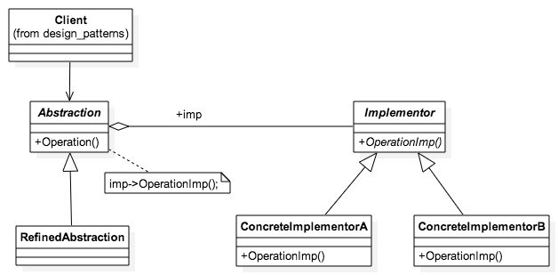

# 桥接模式

## 1.定义

**桥接模式**是一种结构型设计模式， 可将一个大类或一系列紧密相关的类拆分为抽象和实现两个独立的层次结构， 从而能在开发时分别使用。

## 2. 角色

1. **抽象部分** （Abstrac­tion） 提供高层控制逻辑， 依赖于完成底层实际工作的实现对象。

2. **实现部分** （Imple­men­ta­tion） 为所有具体实现声明通用接口。 抽象部分仅能通过在这里声明的方法与实现对象交互。

   抽象部分可以列出和实现部分一样的方法， 但是抽象部分通常声明一些复杂行为， 这些行为依赖于多种由实现部分声明的原语操作。

3. **具体实现** （Con­crete Imple­men­ta­tions） 中包括特定于平台的代码。

4. **精确抽象** （Refined Abstrac­tion） 提供控制逻辑的变体。 与其父类一样， 它们通过通用实现接口与不同的实现进行交互。

5. 通常情况下， **客户端** （Client） 仅关心如何与抽象部分合作。 但是， 客户端需要将抽象对象与一个实现对象连接起来。

## 3. 示例

## 4. 适用场景

## 5.  桥接模式优缺点

