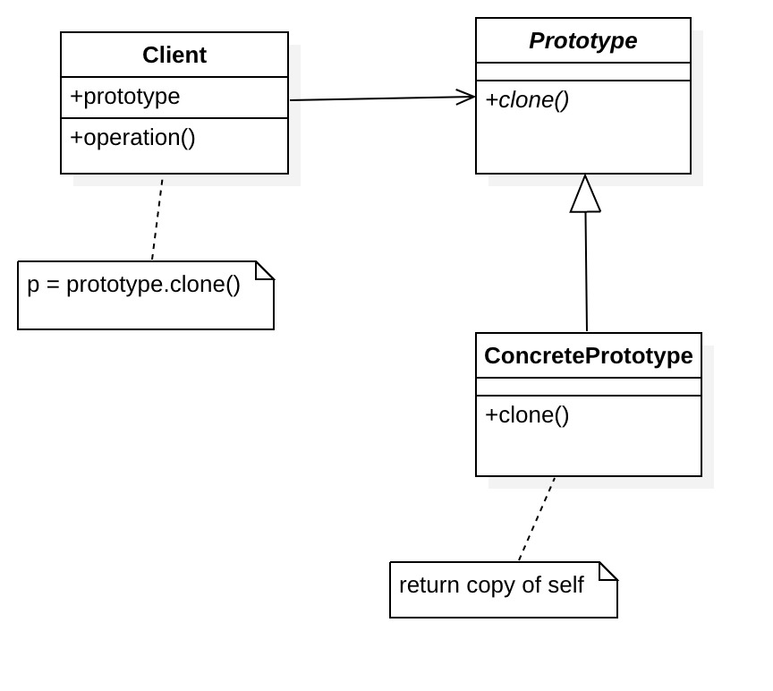

## 1. 定义

通过“复制”一个已经存在的实例来返回新的实例，被复制的实例就是我们所称的“原型”。

## 2. 角色

* Prototype: 原型

  定义用于复制现有实例来生成新实例的方法

* ConcretePrototype:具体原型

  具体负责复制任务的类

* Client：使用者

  让一个原型对象克隆自身从而创建一个新的对象



## 3. 示例

java中提供了对象复制的方法，通过实现`clonable`接口和调用对象的`clone`方法就可以实现对象复制，下面就以这个为基础简单实现一下原型模式

```java
/** “Prototype“ **/
public class Prototype implements Cloneable {
    @Override
    protected Object clone() throws CloneNotSupportedException {
        return (Prototype) super.clone();
    }
}
 
 /** ”Concrete Prototypes“ **/
 public class ConcretePrototype extends Prototype {}
 
 /** ”Client“**/
 public class PrototypeManager {
    private Prototype prototype;

    public PrototypeManager(Prototype prototype) {
        this.prototype = prototype;
    }

    public Prototype create() {
        try {
            return (Prototype) prototype.clone();
        } catch (CloneNotSupportedException e) {
            e.printStackTrace();
        }
        return null;
    }
}

 /** 调用**/ 
public static void main(String[] args) {
    Prototype prototype = new ConcretePrototype();
    PrototypeManager pm = new PrototypeManager(prototype); //设置原型
    Prototype tempProt = pm.create(); //通过复制原型返回对象
}
```

> 注意：java 对象clone方法进行的是浅复制，所谓的浅拷贝就是拷贝指向对象的引用。假设对象中有一个数组字段，那么拷贝出来的对象和原来的对象的确不是同一个对象（引用不同），但两个对象里面的数组字段都指向同一个引用。要实现真正的深拷贝，可以通过重写`clone`方法实现自己的复制方法实现。


## 4. 优点

* 提高性能和效率

  当创建新的对象实例较为复杂时（需要非常繁琐的数据准备），通过复制一个已有实例可以提高新实例的创建效率。

* 可以保存对象的状态

  使用原型模式将对象复制一份并将其状态保存起来，以便在需要的时候使用（如恢复到某一历史状态），可辅助实现撤销操作。

  > 我们日常用到的复制(Ctrl + C)和粘贴(Ctrl + V)操作、开发用到的IDE提供的撤销和恢复历史操作就是原型模式的典型应用

## 5. 缺点

* 实现麻烦

  要是想实现深复制，当对象存在多层嵌套引用时，每一层对象对应的类都必须支持深复制，实现比较麻烦

## 6. 适用场景

* 创建复杂的或者耗时的实例

这种情况下，通过复制一个已经存在的实例更高效

