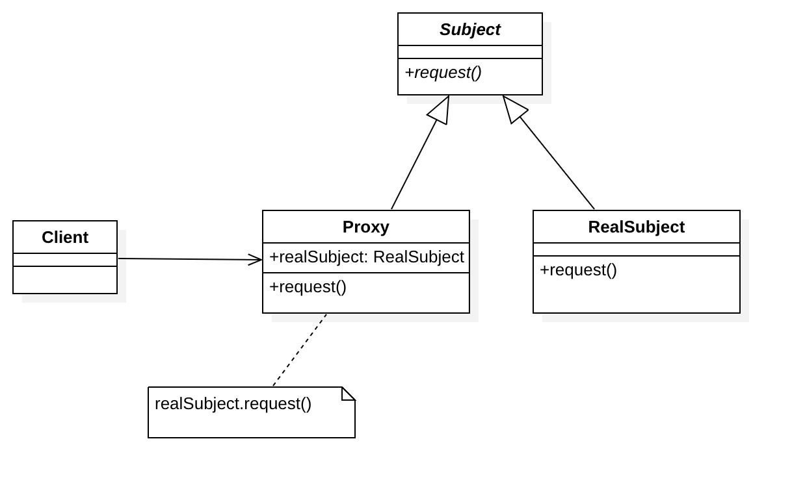

##  定义

给某一个对象提供一个代理，并由代理对象控制对原对象的引用，代理对象作为原对象的接口，代表原对象的功能。

## 角色

- Subject: 抽象主体

  定义使Proxy角色和RealSubject角色之间具有一致性的接口

- Proxy: 代理

  代理会尽量处理客户请求，当其不能处理时，交由RealSubject处理

- RealSubject: 真实主体

  Proxy的真实引用，在Proxy不能完成任务时出场

- Client：请求者



## 示例

经纪人负责安排明星工作，对明星进行包装炒作，品牌商、广告商也是通过经纪人联系上明星，而明星只需要专注于演出。经纪人和明星的关系就是代理和真实主体的关系。我们试着用代码描述一下：

```java
/**"Subject"**/
public interface Subject {
    void show();//演出
}
/**"RealSubject"**/
public class Star implements Subject {
    @Override
    public void show() {
        System.out.println("明星演出");
    }
}
/**"Proxy"**/
public class Agent implements Subject {
    private Subject star;

    public void arrangeWork(){
        System.out.println("安排工作:接广告");
    }

    public void takeMoney(){
        System.out.println("收款");
    }

    @Override
    public void show() {
        if (star==null){
            star =new Star();
        }
        arrangeWork();
        star.show();
        takeMoney();
    }
}
/**"Client"**/
public static void main(String[] args) {
    Subject star = new Agent();
    star.show();
}

//输出
安排工作:接广告
明星演出
收款
```

由上面例子可以看出，明星只需要关注演出，而经纪人完成演出前后要做的协调沟通、收尾工作，**职责清晰**。

## 优点

- 协调调用者和被调用者，在一定程度上降低了系统的耦合度。
- 真实主体完成最核心的工作，代理完成控制和协调工作，职责清晰，符合“单一职责”原则。
- 作为对象和客户的中介，代理可以起到保护对象，减少对象资源的消耗

## 缺点

* 在客户和真实主体之间增加了代理，可能会导致请求的速度变慢
* 实现代理模式需要额外的工作，有些代理模式的实现非常复杂。

## 适用场景

- 远程(Remote)代理：为一个位于不同的地址空间的对象提供一个本地 的代理对象，这个不同的地址空间可以是在同一台主机中，也可是在 另一台主机中，远程代理又叫做大使(Ambassador)。

  > android Binder机制

- 虚拟(Virtual)代理：如果需要创建一个资源消耗较大的对象，先创建一个消耗相对较小的对象来表示，真实对象只在需要时才会被真正创建。

  > 网页图片延迟加载

- Copy-on-Write代理：它是虚拟代理的一种，把复制（克隆）操作延迟 到只有在客户端真正需要时才执行。一般来说，对象的深克隆是一个 开销较大的操作，Copy-on-Write代理可以让这个操作延迟，只有对象被用到的时候才被克隆。

  > StringBuilder

- 保护(Protect or Access)代理：控制对一个对象的访问，可以给不同的用户提供不同级别的使用权限。

  > 反向代理：nginx

- 缓冲(Cache)代理：为某一个目标操作的结果提供临时的存储空间，以便多个客户端可以共享这些结果。

  > 图片缓存、Http缓存

- 智能引用(Smart Reference)代理：当一个对象被引用时，提供一些额外的操作，如将此对象被调用的次数记录下来等。

  > 引用计数

- 防火墙(Firewall)代理：保护目标不让恶意用户接近。

- 同步化(Synchronization)代理：使几个用户能够同时使用一个对象而没有冲突。


## 相关设计模式对比

* 适配器模式

  适配器模式适配了两种具有**不同接口**的对象，以使它们可以一起工作。而在代理模式中，代理对象和真实主体的接口是相同的。

* 装饰器模式

  装饰器模式在实现上很相似，不过它们的使用目的不一样。装饰器模式的目的在于为本体增加新的功能，而在代理模式中，与增加新功能相比，它更注重通过设置代理的方式减轻本体的工作负担。
