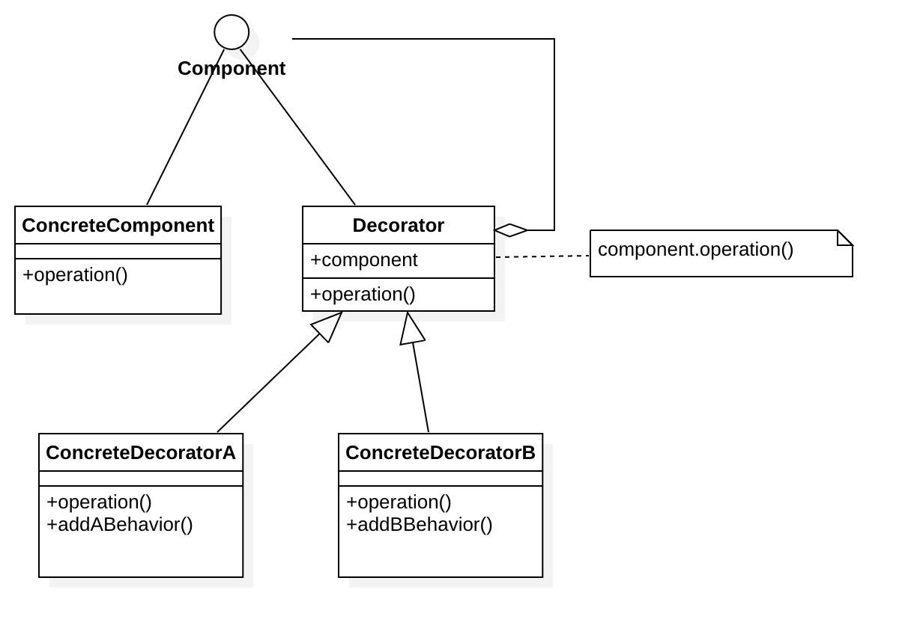

## 定义

动态地往一个类中添加新的行为，同时又不改变其结构。

## 角色

- Component: 抽象构件

  定义被装饰类的接口

- ConcreteComponent: 具体构件

  要被装饰器装饰的具体对象

- Decorator: 抽象装饰类

  维护被装饰类的引用

- ConcreteDecorator: 具体装饰类

  向被装饰类添加新的职责



## 举例

> 蛋糕

蛋糕的抽象构件，定义了蛋糕的接口

```java
/** "Component" **/
public interface Cake {
    void taste();
}
```

蛋糕的具体构件：原味蛋糕

```java
/** "ConcreteComponent" **/
public class OriginalCake implements Cake {
    @Override
    public void taste() {
        System.out.println("原味");
    }
}
```

味道抽象装饰类

```java
/** "Decorator" **/
public abstract class TasteWrapper implements Cake {
    protected Cake cake;
    public TasteWrapper(Cake cake) {
        this.cake = cake;
    }
}
```

具体味道装饰：奶油味道蛋糕

```java
/** "ConcreteDecorator" **/
public class CreamWrapper extends TasteWrapper {
    public CreamWrapper(Cake cake) {
        super(cake);
    }
    @Override
    public void taste() {
        cake.taste();
        System.out.println("奶油");
    }
}
```

具体味道装饰：草莓味道蛋糕

```java
/** "ConcreteDecorator" **/
public class StrawberryWrapper extends TasteWrapper {
    public StrawberryWrapper(Cake cake) {
        super(cake);
    }
    @Override
    public void taste() {
        cake.taste();
        System.out.println("草莓");
    }
}
```

Client：

```java
public static void main(String[] args){
    Cake cake = new OriginalCake();
    //奶油蛋糕
    Cake creamCake = new CreamWrapper(cake);
    creamCake.taste();
    //草莓蛋糕
    Cake strawberryCake = new StrawberryWrapper(cake);
    strawberryCake.taste();
    //草莓奶油蛋糕
    Cake strawberryCreamCake = new StrawberryWrapper(creamCake);
    strawberryCreamCake.taste();
}

//输出

原味
奶油
-------
原味
草莓
-------
原味
奶油
草莓
-------
```

上面例子中，把蛋糕从一块普通的蛋糕（原味）加上草莓就变成了草莓蛋糕，涂上奶油就变成了奶油蛋糕，要是在奶油蛋糕上面加上草莓就变成了草莓奶油蛋糕。它们的核心都是蛋糕，但通过不断的装饰，蛋糕的味道变得更加的甜美，目的也变得更加明确。

## 优点

* 提高灵活性和接口(API)透明度

  装饰器和被装饰物具有相同的接口(API)，这样就算被装饰物被装饰器装饰起来，接口(API)也不会变化，不会破坏类的封装性

* 动态增加功能

  装饰模式使用了委托，使得类之间形成了弱关联。通过使用不同的具体装饰类的排列组合，可以创建很多不同行为的组合，从而得到功能更加强大的对象

* 装饰类和被装饰类可以独立发展，不会相互耦合

  用户可以根据需要增加新的具体构件类和具体装饰类，在使用时再对其进行组合，原有代码无须改变，符合“开闭原则”

## 缺点

* 增加许多很小的类

  这些对象的区别在于它们之间相互连接的方式有所不同，而不是它们的类或者属性值有所不同，同时还将产生很多具体装饰类。这些装饰类和小对象的产生将增加系统的复杂度，加大学习与理解的难度。

* 多层装饰比较复杂

  调试时寻找错误可能需要逐级排查，较为烦琐。

## 适用场景
* 在不影响其他对象的情况下，以动态、透明的方式给单个对象添加职责。

* 需要动态给一个对象增加功能，也可以动态撤销

* 当使用继承扩展不合适或者无法使用继承的时候

  >  继承是一种耦合度比较大的静态关系，组合/聚合可以使系统更加灵活，降低类与类之间的耦合度。

## 模式简化

大多数情况下，装饰模式的实现都比上面例子简单 --- 只有一个`ConcreteComponent`类和一个`ConcreteDecorator`类。这时候可以去掉考虑去掉抽象的`Component`类(接口)，然后把`Decorator`和`ConcreteDecorator`合并成一个类
