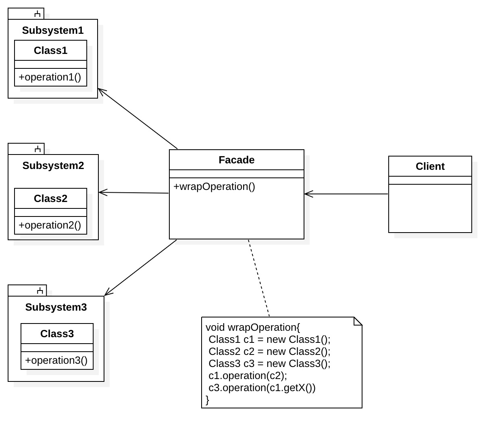

## 定义

为相互关联在一起的子系统中的一组接口提供一个统一的高层接口，使得子系统更容易使用

## 角色

* Facade： 外观类

为子系统提供一个共同的对外接口

* SubSystem：子系统

客户可以通过外观接口读取的内部数据资源,子系统各自完成自己的工作

* Client：客户

调用`Facade`接口



## 代码示例

我们去医院看病，要去挂号、门诊、付款、取药，每个流程都很复杂，假设未来AI技术发展迅猛，看一些小病只需要在一台智能医疗机前扫描全身就可以完成所有流程，这样是不是很方便。代码模拟如下：

```java
/* "Subsystem1" */
public class RegisterSystem {
    public UserRecord register(String id_card){
        ....
        ....
        return UserRecord;
    }
}
/* "Subsystem2" */
public class DiagnosisSystem {
    public DiagnosticResult diagnose(UserRecord userRecord){
            ....
            ....
          return DiagnosticResult;
    }
}
/* "Subsystem3" */
public class PaySystem {
    public PayResult pay(User user,DiagnosticResult diagnosticResult){
        ....
        ....
        return PayResult;
    }
}
/* "Subsystem3" */
public class MedicineSystem {
    public Medicine take(DiagnosticResult diagnosticResult) {
        ....
        ....
        return Medicine;
    }
}
/* "Facade" */
public class AIDoctor {
    public Result startCure(String id_card){
        RegisterSystem registerSystem = new RegisterSystem();
        DiagnosisSystem diagnosisSystem = new DiagnosisSystem();
        PaySystem paySystem = new PaySystem();
        MedicineSystem medicineSystem = new MedicineSystem();
        //挂号，生成用户记录
        UserRecord userRecord=registerSystem.register(id_card);
        //诊断，生成诊断记录
        DiagnosticResult diagnosticResult= diagnosisSystem.diagnose(userRecord);
        //根据用户和诊断结果，自动计算价钱并支付
        Payresult payResult=paySystem.pay(userRecord.user,diagnosticResult);
        Medicine medicine =null;
        if (payResult.success){
            // 支付成功，取药
            medicine= medicineSystem.take(diagnosticResult);
        }
        //生成输出给用户的结果
        Result showResult= new Result(diagnosticResult,payResult,medicine);
        return showResult;
    }
}

/* "Client" */
public static void main(String[] args) {
    AIDoctor facade = new AIDoctor();
    //客户输入身份证号，然后就开始自动治疗就可以了
    Result result=facade.startCure("xxxxxxxx");
}


```

挂号、诊断、付款、取药是**相互关联**在一起的**错综复杂**的子系统，`AIDoctor`处理它们之间的依赖和分配责任，按照正确的顺序去调用它们，这些对于客户都是透明的，客户只需要简单执行下`AIDoctor`的自动治疗，然后就可以得到诊断结果、扣款情况和药。`AIDoctor`在这个过程中充当的就是`Facade`角色。

## 优点

* 让复杂的东西看起来简单

  对客户屏蔽子系统组件，接口（API）变少了，使得子系统更加容易使用

* 提高子系统的独立性和可移植性

  将子系统和客户解耦，降低系统依赖性

## 缺点

增加新的子系统可能需要修改外观类或客户端的源代码，违背了“开闭原则”。

## 适用场景

* 为相互关系比较多、复杂的子系统提供统一的简单接口
* 客户程序与多个子系统之间存在很大的依赖性。引入外观类将子系统与客户以及其他子系统解耦，可以提高子系统的独立性和可移植性。
* 在层次化结构中，可以使用外观模式定义系统中每一层的入口，层与层之间不直接产生联系，而通过外观类建立联系，降低层之间的耦合度。