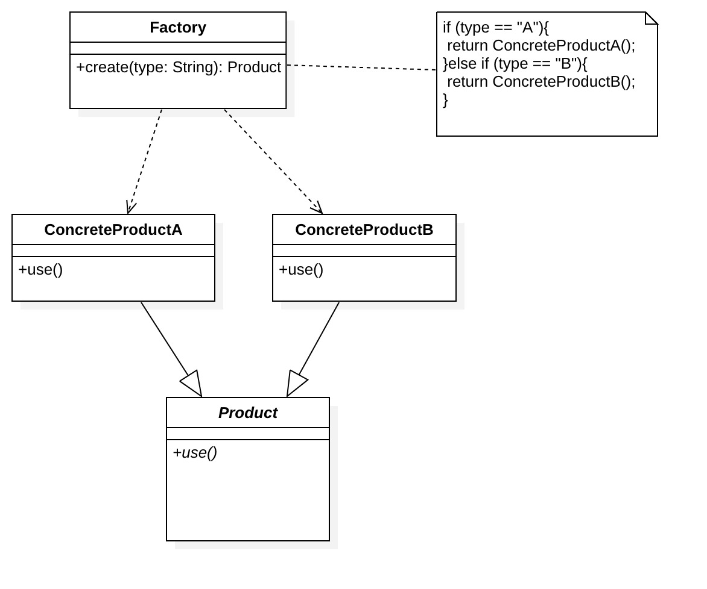
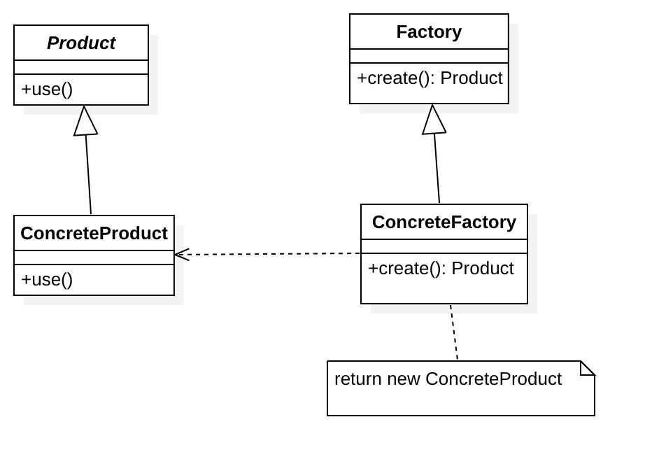
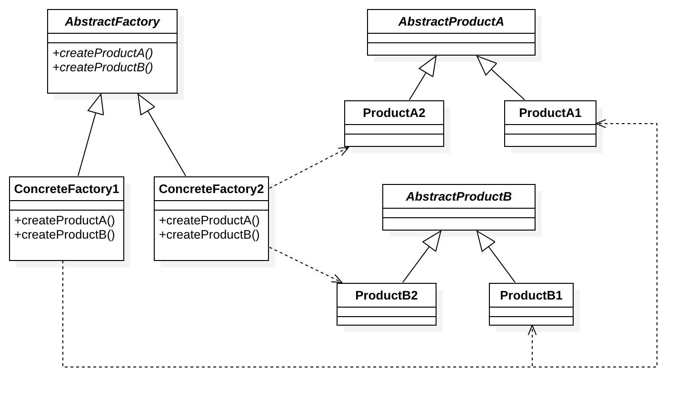

## 1. <font color=CornflowerBlue >静态工厂/简单工厂模式</font>

### 1.1.动机

假设有一家手机厂商创立了“香蕉手机”这个品牌，这个品牌手机有TS、TS Max、TR三种型号。这些手机核心模块相同，但外观、做工、配置不一样，它们都是由同一家工厂“香蕉一厂”生产。手机销售商每次都直接从“香蕉一厂”取货，手机销售商不知道手机是怎么做出来的，他们只需要告诉工厂他们需要三种型号中哪一种，工厂就会把手机送到手机销售商那。这就是一个简单工厂模式。

### 1.2.定义

根据不同参数返回不同类的实例

> 简单工厂模式不属于设计模式，应该说是一种编程习惯，当创建的实例都具有共同的父类，这时候可以考虑使用简单工厂模式来封装

### 1.3.角色

- Factory：工厂角色

    工厂角色负责实现创建所有实例的内部逻辑

- Product：抽象产品角色

    抽象产品角色是所创建的所有对象的父类，负责描述所有实例所共有的公共接口

- ConcreteProduct：具体产品角色

    具体产品角色是创建目标，所有创建的对象都充当这个角色的某个具体类的实例。



### 1.4.代码实现

根据之前提到的香蕉手机的例子，我们可以实现以下代码

```java
/** "Product"**/
public abstract class Mobile {
    public abstract void type();
}

/** "ConcreteProduct"**/
public class TRMobile extends Mobile {
    @Override
    public void type() {
        System.out.print("TR MODEL");
    }
}
/** "ConcreteProduct"**/
public class TSMAXMobile extends Mobile {
    @Override
    public void type() {
        System.out.print("TS MAX MODEL");
    }
}

/** "ConcreteProduct"**/
public class TSMobile extends Mobile {
    @Override
    public void type() {
        System.out.print("TS MODEL");
    }
}

/** "Factory"**/
public class MobileFactory {
    public Mobile createMobile(String type){
        if (type == "TS"){
            return new TSMobile();
        }else if(type=="TS MAX"){
            return new TSMAXMobile();
        }else if(type=="TR"){
            return new TRMobile();
        }else {
            throw new IllegalArgumentException();
        }
    }
}
```

当我们需要一台TR 型号的手机，只需要如下调用即可

```java
MobileFactory.createMobile("TR")
```


### 1.5.优点

1. 客户端可以免除直接创建产品对象的责任，而仅仅“消费”产品。明确了各自的职责和权利，有利于整个软件体系结构的优化。
2. 通过引入配置文件，可以在不修改任何客户端代码的情况下更换和增加新的具体产品类，在一定程度上提高了系统的灵活性。

### 1.6.缺点

1. 工厂类不够灵活，增加新的具体产品需要修改工厂类的判断逻辑代码，违背了“开闭原则”，而且产品较多时，工厂方法代码将会非常复杂
2. 增加系统中类的个数，在一定程序上增加了系统的复杂度和理解难度。

### 1.7.适用场景

工厂类负责创建的对象比较少：由于创建的对象较少，不会造成工厂方法中的业务逻辑太过复杂。


##  2.<font color=CornflowerBlue >工厂方法模式</font>

### 2.1.动机

由于香蕉手机的研发人员牛逼，很快他们就研发出了跨时代手机 ---- 胶囊手机（使用时跟正常手机一样，不使用的时候可以缩小成胶囊大小），引发了一波购机热潮。这时候之前的工厂“香蕉一厂”有点力不从心了,首先，由于业绩越来越好，每个型号的手机都有大批量的订单，然后既要生产旧型号的手机，还要生产新的手机。所以公司决定开分厂，每个分厂使用同样的核心技术，但各自负责某一个型号的手机。这样一来，以后要是有新手机研发成功，就可以快速建厂扩张业务。这就是一个‘’工厂方法模式“。

### 2.2.定义

工厂方法模式又称为工厂模式或者多态工厂模式。工厂是构造方法的抽象，用来实现不同的分配方案。让其子类自己决定实例化哪一个工厂类，工厂模式使其创建过程延迟到子类进行。

### 2.3.角色

- Product：抽象产品

  同简单工厂

- ConcreteProduct：具体产品

  同简单工厂

- Factory：抽象工厂

  定义具体工厂必须实现的接口

- ConcreteFactory：具体工厂

  具体工厂负责实现创建特定类型实例的内部逻辑

  

### 2.4.代码实现

还是根据之前提到的香蕉手机的例子，我们可以实现以下代码

```java
/** "Product"**/
public abstract class Mobile {
    public abstract void type();
}

/** "ConcreteProduct"**/
public class TRMobile extends Mobile {
    @Override
    public void type() {
        System.out.print("TR MODEL");
    }
}
/** "ConcreteProduct"**/
public class TSMAXMobile extends Mobile {
    @Override
    public void type() {
        System.out.print("TS MAX MODEL");
    }
}

/** "ConcreteProduct"**/
public class TSMobile extends Mobile {
    @Override
    public void type() {
        System.out.print("TS MODEL");
    }
}
/** 新增 "ConcreteProduct"**/
public class CapsuleMobile extends Mobile {
    @Override
    public void type() {
        System.out.print("Capsule MOBILE");
    }
}

/** "Abstract Factory"**/
public abstract class Factory {
    public abstract Mobile createMobile();
}
/** "ConcreteFactory"**/
public class TRMobileFactory extends Factory {
    @Override
    public Mobile createMobile() {
        return new TRMobile();
    }
}
/** "ConcreteFactory"**/
public class TSMAXMobileFactory extends Factory {

    @Override
    public Mobile createMobile() {
        return new TSMAXMobile();
    }
}
/** "ConcreteFactory"**/
public class TSMobileFactory extends Factory {

    @Override
    public Mobile createMobile() {
        return new TSMobile();
    }
}
/** "ConcreteFactory"**/
public class CapsuleMobileFactory extends Factory {

    @Override
    public Mobile createMobile() {
        return new CapsuleMobile();
    }
}
```


这时候当我们需要一台TR 型号的手机，变成以下调用

```java
TRMobileFactory.createMobile()
```

> 看到这里，有没有感觉想吐槽：“就为了把new包装下，类个数陡然上涨呀，无非就是把new对象时的构造函数和参数屏蔽下，有必要非要搞个听起来高大上的模式么，不就是生成个多态对象么，简单封装一个方法就好了呀或者直接new感觉也没多麻烦呀“
>
> OK，我能理解大家的吐槽，但稍安勿躁，让我讲完再回答这些问题

### 2.5.优点

工厂方法模式可以说是简单工厂的改进版，有简单工厂的所有优点，同时避免了简单工厂的缺点：在系统中加入新产品时，只要添加一个具体工厂和具体产品就可以了。这样，系统的可扩展性也就变得非常好，完全符合“开闭原则”。

### 2.6.缺点

每次增加一个产品时，都需要增加一个具体类和对象实现工厂，使得系统中类的个数成倍增加，在一定程度上增加了系统的复杂度，同时也增加了系统具体类的依赖。

### 2.7.适用场景

客户端在使用时可以无须关心是哪一个工厂子类创建产品子类，需要时再动态指定

如 日志记录器：记录可能记录到本地硬盘、系统事件、远程服务器等，用户可以选择记录日志到什么地方。


## 3. <font color=CornflowerBlue > 抽象工厂模式</font>

### 3.1.动机

“香蕉”公司业务蒸蒸日上，胶囊手机也异常火爆。公司决定做两件事情：1.发展子业务：做电视机。2.把“胶囊”分拆出去，做成独立品牌。这样一来，“香蕉”公司旗下产品有手机和电视机，品牌有“香蕉”和“胶囊”。为了建立品牌认知和辨别度，同时也为了品牌能独立发展，品牌之间的工厂是独立的；随着工厂的工程化和集成度越来越高，同时为了节约成本，一间工厂现在既可以生产手机，也可以生产电视机了。这时候就形成了抽象工厂模式。

### 3.2.定义

为了更清晰地理解抽象工厂模式，需要先引入两个概念：

* 产品等级结构 ：产品等级结构即产品的继承结构，如上面描述，一个抽象类是电视机，其子类有香蕉电视机和胶囊电视机，则抽象电视机与具体品牌的电视机之间构成了一个产品等级结构，抽象电视机是父类，而具体品牌的电视机是其子类。
* 产品族 ：在抽象工厂模式中，产品族是指由同一个工厂生产的，位于不同产品等级结构中的一组产品，如香蕉电器工厂生产的香蕉电视机、香蕉手机，香蕉电视机位于电视机产品等级结构中，香蕉手机位于手机产品等级结构中。

抽象工厂模式提供一个创建一系列相关或相互依赖对象的接口，而无需指定它们具体的类。

### 3.3.角色



### 3.4.代码实现

根据香蕉公司的新改动，代码如下：

```java
/** "Abstract Factory"**/
public abstract class Factory {
    public abstract Mobile createMobile();
    public abstract TV createTV();
}
/** "Abstract ProductA"**/
public abstract class Mobile {
    public abstract void type();
}
/** "Abstract ProductB"**/
public abstract class TV {
    public abstract void type();
}
/** "ProductA1"**/
public class BananaMobile extends Mobile {
    @Override
    public void type() {
        System.out.print("Banana MOBILE");
    }
}
/** "ProductA2"**/
public class CapsuleMobile extends Mobile {
    @Override
    public void type() {
        System.out.print("Capsule MOBILE");
    }
}
/** "ProductB1"**/
public class BananaTV extends TV {
    @Override
    public void type() {
        System.out.print("Banana TV");
    }
}
/** "ProductB2"**/
public class CapsuleTV extends TV {
    @Override
    public void type() {
        System.out.print("Capsule TV");
    }
}

/** "Factory1"**/
public class BananaFactory extends Factory {

    @Override
    public Mobile createMobile() {
        return new BananaMobile();
    }

    @Override
    public TV createTV() {
        return new BananaTV();
    }
}
/** "Factory2"**/
public class CapsuleFactory extends Factory {

    @Override
    public Mobile createMobile() {
        return new CapsuleMobile();
    }

    @Override
    public TV createTV() {
        return new CapsuleTV();
    }
}

```

这时候当我们需要胶囊手机和胶囊电视，变成以下调用

```java
Mobile mobile=CapsuleFactory.createMobile()
TV tv=CapsuleFactory.createTV()  
```

### 3.5.优点

1. 具体产品从客户代码中被分离出来
2. 增加新的具体工厂和产品族很方便，无须修改已有系统，符合“开闭原则”。
3. 将一个系列的产品族统一到一起创建，保证客户端始终只使用同一个产品族中的对象。

### 3.6.缺点

在产品族中扩展新的产品是很困难的，需要修改抽象工厂的接口

### 3.7.适用场景

系统中有多于一个的产品族，而每次只使用其中某一产品族。

如 QQ秀换皮肤，一整套一起换


## 3.8.为什么要用工厂模式

> 回应上面的吐槽问题

设计模式是一群技术大拿经过无数实践经验总结出来的，我等小菜，尽管用即可，不要问为什么，哈哈[白眼]。

但作为一名有追求有理想的程序员，还是希望刨根问底下，以下是一些我的理解：

1. 工厂模式是符合“开闭原则”的，这在代码设计里面是非常重要的一个原则
2. 有时，创建不仅仅是创建，控制过程比简单地创建一个对象更复杂。工厂对象可能会动态地创建产品对象的类，或者从对象池中返回一个对象，或者对所创建的对象进行复杂的配置，或者应用其他的操作。这其实是个复杂的过程，在这种情况下，工厂对象就派上用场了，它把这些过程抽象了并对客户端屏蔽了，使得客户端使用起来更简单。
3. 降低维护成本，由于创建过程都由工厂统一管理，所以要是类名或者构造过程发生变化，可以统一通过工厂去修改，而不用在每个创建的地方逐个修改
4. “甩锅”。当一个项目足够大的时候，人员会很多，每个人都负责不同的东西，各自都有自己的利益，谁都不想因为自己的改动导致项目出问题，所以，“我不希望去new 你的对象，你直接给我就好了”其实是个强需求，哈哈。

所以，当你觉得不需要或者没必要用工厂模式的时候，可能仅仅是因为你的项目还不够大而已。


## 参考

https://design-patterns.readthedocs.io


