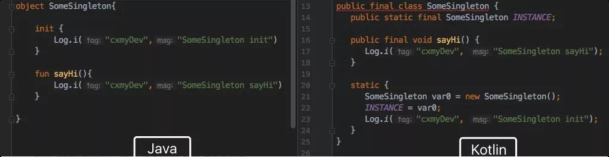
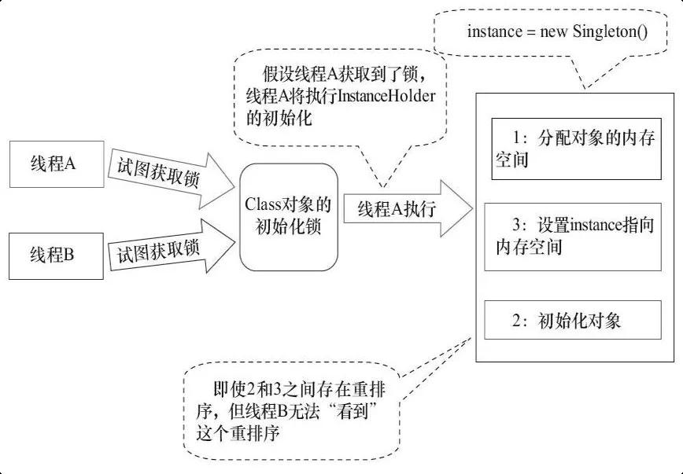

## 1.懒汉式，线程不安全

当被问到要实现一个单例模式时，很多人的第一反应是写出如下的代码，包括教科书上也是这样教我们的。

```java
public class Singleton {
    private static Singleton instance;
    private Singleton (){}

    public static Singleton getInstance() {
     if (instance == null) {
         instance = new Singleton();
     }
     return instance;
    }
}
```

这段代码简单明了，而且使用了懒加载模式，但是却存在致命的问题。当有多个线程并行调用 getInstance() 的时候，就会创建多个实例。也就是说在多线程下不能正常工作。


## 2.懒汉式，线程安全

为了解决上面的问题，最简单的方法是将整个 getInstance() 方法设为同步（synchronized）。

```
public static synchronized Singleton getInstance() {
    if (instance == null) {
        instance = new Singleton();
    }
    return instance;
}
```

虽然做到了线程安全，并且解决了多实例的问题，但是它并不高效。因为在任何时候只能有一个线程调用 getInstance() 方法。但是同步操作只需要在第一次调用时才被需要，即第一次创建单例实例对象时。这就引出了双重检验锁。

## 3.双重检验锁

双重检验锁模式（double checked locking pattern），是一种使用同步块加锁的方法。程序员称其为双重检查锁，因为会有两次检查 `instance == null`，一次是在同步块外，一次是在同步块内。为什么在同步块内还要再检验一次？因为可能会有多个线程一起进入同步块外的 if，如果在同步块内不进行二次检验的话就会生成多个实例了。

```
public static Singleton getSingleton() {
    if (instance == null) {                         //Single Checked
        synchronized (Singleton.class) {
            if (instance == null) {                 //Double Checked
                instance = new Singleton();
            }
        }
    }
    return instance ;
}
```

这段代码看起来很完美，很可惜，它是有问题。主要在于`instance = new Singleton()`这句，这并非是一个原子操作，事实上在 JVM 中这句话大概做了下面 3 件事情。

1. 给 instance 分配内存
2. 调用 Singleton 的构造函数来初始化成员变量
3. 将instance对象指向分配的内存空间（执行完这步 instance 就为非 null 了）

但是在 JVM 的即时编译器中存在指令重排序的优化。也就是说上面的第二步和第三步的顺序是不能保证的，最终的执行顺序可能是 1-2-3 也可能是 1-3-2。如果是后者，则在 3 执行完毕、2 未执行之前，被线程二抢占了，这时 instance 已经是非 null 了（但却没有初始化），所以线程二会直接返回 instance，然后使用，然后顺理成章地报错。

我们只需要将 instance 变量声明成 volatile 就可以了。

```
public class Singleton {
    private volatile static Singleton instance; //声明成 volatile
    private Singleton (){}

    public static Singleton getSingleton() {
        if (instance == null) {                         
            synchronized (Singleton.class) {
                if (instance == null) {       
                    instance = new Singleton();
                }
            }
        }
        return instance;
    }
   
}
```

有些人认为使用 volatile 的原因是可见性，也就是可以保证线程在本地不会存有 instance 的副本，每次都是去主内存中读取。但其实是不对的。使用 volatile 的主要原因是其另一个特性：禁止指令重排序优化。也就是说，在 volatile 变量的赋值操作后面会有一个内存屏障（生成的汇编代码上），读操作不会被重排序到内存屏障之前。比如上面的例子，取操作必须在执行完 1-2-3 之后或者 1-3-2 之后，不存在执行到 1-3 然后取到值的情况。从「先行发生原则」的角度理解的话，就是对于一个 volatile 变量的写操作都先行发生于后面对这个变量的读操作（这里的“后面”是时间上的先后顺序）。

但是特别注意在 Java 5 以前的版本使用了 volatile 的双检锁还是有问题的。其原因是 Java 5 以前的 JMM （Java 内存模型）是存在缺陷的，即时将变量声明成 volatile 也不能完全避免重排序，主要是 volatile 变量前后的代码仍然存在重排序问题。这个 volatile 屏蔽重排序的问题在 Java 5 中才得以修复，所以在这之后才可以放心使用 volatile。

相信你不会喜欢这种复杂又隐含问题的方式，当然我们有更好的实现线程安全的单例模式的办法。

## 4.饿汉式 static final field

这种方法非常简单，因为单例的实例被声明成 static 和 final 变量了，在第一次加载类到内存中时就会初始化，所以创建实例本身是线程安全的。

```
public class Singleton{
    //类加载时就初始化
    private static final Singleton instance = new Singleton();
    
    private Singleton(){}

    public static Singleton getInstance(){
        return instance;
    }
}
```

这种写法如果完美的话，就没必要在啰嗦那么多双检锁的问题了。缺点是它不是一种懒加载模式（lazy initialization），单例会在加载类后一开始就被初始化，即使客户端没有调用 getInstance()方法。饿汉式的创建方式在一些场景中将无法使用：譬如 Singleton 实例的创建是依赖参数或者配置文件的，在 getInstance() 之前必须调用某个方法设置参数给它，那样这种单例写法就无法使用了。

## 5.静态内部类 static nested class

我比较倾向于使用静态内部类的方法，这种方法也是《Effective Java》上所推荐的。

```
public class Singleton {  
    private static class SingletonHolder {  
        private static final Singleton INSTANCE = new Singleton();  
    }  
    private Singleton (){}  
    public static final Singleton getInstance() {  
        return SingletonHolder.INSTANCE; 
    }  
}
```

这种写法仍然使用JVM本身机制保证了线程安全问题；由于 SingletonHolder 是私有的，除了 getInstance() 之外没有办法访问它，因此它是懒汉式的；同时读取实例的时候不会进行同步，没有性能缺陷；也不依赖 JDK 版本。

## 6.枚举 Enum

用枚举写单例实在太简单了！这也是它最大的优点。下面这段代码就是声明枚举实例的通常做法。

```
public enum EasySingleton{
    INSTANCE;
}
```

我们可以通过EasySingleton.INSTANCE来访问实例，这比调用getInstance()方法简单多了。创建枚举默认就是线程安全的，所以不需要担心double checked locking，而且还能防止反序列化导致重新创建新的对象。

## 7. Kotlin Object类

在 Kotlin 中，实现单例非常简单，只需要将关键字 class 替换为 object 即可。

```kotlin
object SomeSingleton{ 
  fun sayHi(){} 
} 
```

Kotlin 的 object 其实就是饿汉式单例。通过工具将Kotlin代码还原为 Java 代码，如下:



可以看到，INSTANCE 使用 static final 声明，并且在 static 代码块内对其进行初始化，标准的饿汉式单例。

## 8. 双重检测就比饿汉式高级？

### 8.1.饿汉式如何保证唯一和线程安全?Kotlin 的 object 为什么用饿汉式？

饿汉式单例的原理，其实是基于 JVM 的类加载机制来保证其符合单例的规范的。

简单来说，JVM 在加载类的时候，会经过初始化阶段(即 Class 被加载后，且被线程使用前)。在初始化期间，JVM 会获取一把锁，这个锁可以同步多个线程，对一个类的初始化，确保只有一个线程完成类的加载过程。这个步骤是线程安全的。



### 8.2 懒加载

加载的目的，说白了就是为了避免，无必要的资源浪费，在不需要的时候不加载，等什么时候业务真的需要使用到它的时候，再加载资源。

虽然饿汉式依赖虚拟机加载类的策略，但虚拟机本身也会有优化项，那就是「按需加载」的策略。

虚拟机在运行程序时，并不时在启动时，就将所有的类都加载并初始化完成，而是采用「按需加载」的策略，在真正使用时，才会进行初始化。

例如 显式的 new Class()、调用类的静态方法、反射、Class.forName() 等，这些事件首次发生时，都会触发虚拟机加载类。

例如前文中，`Kotlin SomeSingleton` 这个单例类，我们放到一个 App 中运行一下，App 先启动，点击按钮执行 `SomeSingleton.sayHi() `方法。

```shell
15:39:34.539 I/cxmyDev: App running 
15:39:44.606 I/cxmyDev: SomeSingleton init 
15:39:44.606 I/cxmyDev: SomeSingleton sayHi 
1.2.3.
```

注意 Log 的时间，只有点击按钮执行 SomeSingleton.sayHi() 时，该单例类才被虚拟机加载。

也就是说，通常只有在你真实使用这个类时，它才会真的被虚拟机初始化，我们并不需要担心会被提前加载而导致资源浪费。

当然，不同虚拟机的实现方式不同，这并不是强制的，但是大多数为了性能都会准守此规则。

既然饿汉式的单例，也是在首次使用时初始化，这自然就是一种类懒加载的效果。

**Kotlin 的 object 选择饿汉式单例，在性能和实现上都不存在问题，使用它无需顾虑。**

## 参考

[如何正确地写出单例模式](http://wuchong.me/blog/2014/08/28/how-to-correctly-write-singleton-pattern/)

[Kotlin 的 object 为什么用饿汉式？](https://www.51cto.com/article/621465.html)

