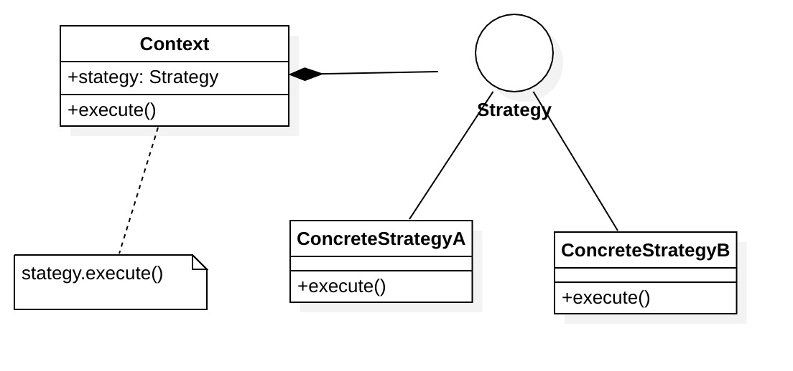

## 定义

对象有某个行为，但是在不同的场景中，该行为有不同的实现算法，也就是我们可以根据环境或者条件的不同选择不同的策略来完成该行为。

## 角色

- Context: 环境类

  使用策略

- Strategy: 抽象策略类

  决定实现策略所必需的接口

- ConcreteStrategy: 具体策略类

  实现实现具体策略/算法

  

## 代码示例

假设现在要设计一个虚拟币充值系统，充值根据会员的等级打折。如对高级VIP会员提供30%折扣，VIP会员10%折扣，普通会员没有折扣。

所以，这里会有三个算法：

1. 高级VIP会员30%折扣
2. VIP会员10%折扣
3. 普通会员没有折扣

代码实现如下：

```java
/**"Strategy"**/
public interface MemberStrategy {
    public float calAmount(float originAmount);
}

/**"ConcreteStrategy"**/
public class AdvanceVipMemberStragy implements MemberStrategy {
    @Override
    public float calAmount(float originAmount) {
        System.out.println("高级VIP会员30%折扣");
        return originAmount * 0.7f;
    }
}
/**"ConcreteStrategy"**/
public class VipMemberStragy implements MemberStrategy {
    @Override
    public float calAmount(float originAmount) {
        System.out.println("VIP会员10%折扣");
        return originAmount * 0.9f;
    }
}
/**"ConcreteStrategy"**/
public class CommonMemberStragy implements MemberStrategy {
    @Override
    public float calAmount(float originAmount) {
        System.out.println("普通会员没有折扣");
        return originAmount;
    }
}

/**"Context"**/
public class Recharge {
    private MemberStrategy memberStrategy;
    
    public Recharge(MemberStrategy memberStrategy) {
        this.memberStrategy = memberStrategy;
    }

    public float calAmount(float originAmount){
        return memberStrategy.calAmount(originAmount);
    }
}
/**"client"**/
public static void main(String[] args) {
    MemberStrategy strategy = new AdvanceVipMemberStragy();
    Recharge recharge = new Recharge(strategy);
    float amount = recharge.calAmount(100);
    System.out.println("用户最终要付的金额为：" + amount);
}
//输出
高级VIP会员30%折扣
用户最终要付的金额为：70
```

从上面代码可以看出，策略类仅仅封装算法，并不决定在何时使用何种算法，何时使用何种算法是由客户端确定的。

> 策略模式的重心不是如何实现算法，而是如何组织、调用这些算法，从而让程序结构更灵活，具有更好的维护性和扩展性

## 优点

* 对“开闭原则”的完美支持,可以在不修改原有系统的基础上选择算法或行为，也可以灵活地增加新的算法或行为。
* 提供了管理相关的算法族（业务规则）的办法
* 避免使用多重条件(if-else)语句

## 缺点

* 客户端必须知道所有的策略类，并自行决定使用哪一个策略类。这就意味着客户端必须理解这些算法的区别，以便适时选择恰当的算法类。换言之，策略模式只适用于客户端知道算法或行为的情况。
* 策略模式将造成产生很多策略类

## 适用场景

* 如果在一个系统里面有许多类，它们之间的区别仅在于它们的行为，那么使用策略模式可以动态地让一个对象在许多行为中选择一种行为。
* 一个系统需要动态地在几种算法中选择一种。
* 如果一个对象有很多的行为，如果不用恰当的模式，这些行为就只好使用多重的条件选择语句来实现。
* 不希望客户端知道复杂的、与算法相关的数据结构，在具体策略类中封装算法和相关的数据结构，提高算法的保密性与安全性。