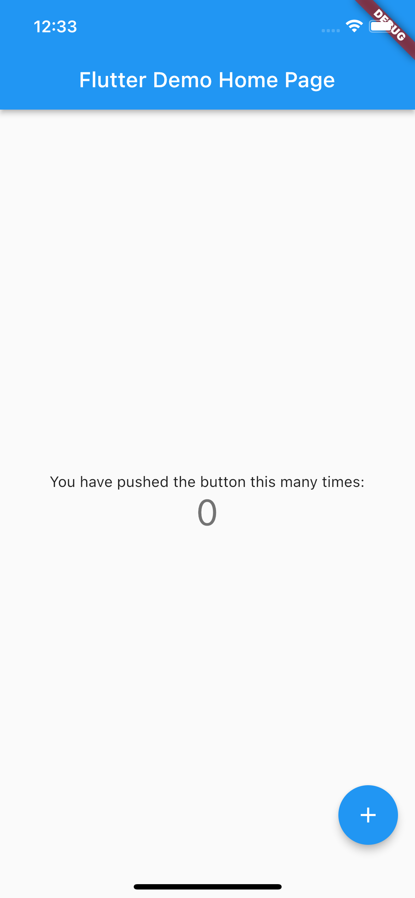

# 起步
## flutter简介
Flutter 是 Google 开源的应用开发框架，仅通过一套代码库，就能构建精美的、原生平台编译的多平台应用。

flutter提供了一整套从底层渲染逻辑到上层开发语言的完整解决方案：视图渲染完全闭环在其框架内部，不依赖于底层操作系统提供的任何组件，从根本上保证了视图渲染在 Android 和 iOS 上的高度一致性；Flutter 的开发语言 Dart，是 Google 专门为（大）前端开发量身打造的专属语言，借助于先进的工具链和编译器，成为了少数同时支持 JIT 和 AOT 的语言之一，开发期调试效率高，发布期运行速度快、执行性能好，在代码执行效率上可以媲美原生 App。

## 搭建flutter工作环境（macOS、VS code）
### 安装flutter
1. 下载[Flutter SDK](https://storage.flutter-io.cn/flutter_infra_release/releases/stable/windows/flutter_windows_3.0.5-stable.zip)
2. 将文件解压到目标路径, 比如:
```shell
cd ~/development
unzip ~/Downloads/flutter_macos_3.0.5-stable.zip

```
3. 配置 flutter 的 PATH 环境变量：
修改`$HOME/.zshrc`或`$HOME/.bashrc`文件，添加如下代码：
```shell
export PATH="$HOME/development/flutter/bin:$PATH"
```

4. 运行 flutter doctor 命令检查当前环境是否需要安装其他的依赖：
```shell
flutter doctor
```
根据输出提示安装相应的依赖即可。

> 升级flutter 到最新版本：
```shell
flutter upgrade
```

### VS Code
1. 安装[VSCode](https://code.visualstudio.com/download)
2. **安装flutter插件**：在扩展搜索输入框中输入「flutter」，然后在列表中选择 Flutter 并安装。此过程中会自动安装必需的 Dart 插件   

   
### 创建flutter项目
1. 在目标路径下执行：
```shell
//--org指定你的包名
flutter create --org com.adison.funsplash funsplash
```
2. 打开ios模拟器：
```shell
open -a Simulator
```
3. 运行flutter项目：
命令行执行：
```shell
flutter run
```
VS Code执行：
```shell
通过F5快捷键以调试模式运行
```
运行效果如下



> 多个设备时，可以使用命令：
```shell
flutter run -d devices_id/devices_name
```
指定对应设备运行，devices_id为设备的id，devices_name为设备的名称。
通过`flutter devices`命令可以查看设备信息。
