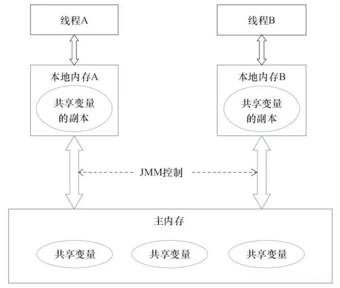

# 并发基础
## 1. 基础概念
### 1.1. 进程
进程是具有一定独立功能的程序关于某个数据集合上的一次运行活动，进程是系统进行资源分配和调度的一个独立单位。每个进程都有自己的独立内存空间，不同进程通过进程间通信来通信。由于进程比较重量级，开销大，占据独立的内存，所以上下文进程间的切换开销（栈、寄存器、虚拟内存、文件句柄等）比较大，但相对比较稳定安全。

### 1.2 线程
线程与进程相似，但线程是一个比进程更小的执行单位。一个进程在其执行的过程中可以产生多个线程。与进程不同的是同类的多个线程共享进程的堆和方法区资源，但每个线程有自己的程序计数器、虚拟机栈和本地方法栈，所以系统在产生一个线程，或是在各个线程之间作切换工作时，负担要比进程小得多，也正因为如此，线程也被称为轻量级进程。

### 1.3 协程
协程（coroutine）是一种程序运行的方式，即在单线程里多个函数并发地执行.
协程是一种用户态的轻量级线程，协程的调度完全由用户控制。从技术的角度来说，“协程就是你可以暂停执行的函数”。协程拥有自己的寄存器上下文和栈。协程调度切换时，将寄存器上下文和栈保存到其他地方，在切回来的时候，恢复先前保存的寄存器上下文和栈，直接操作栈则基本没有内核切换的开销，可以不加锁的访问全局变量，所以上下文的切换非常快。

### 1.4 进程、线程、协程的对比
* 线程是处理器调度的基本单位，但进程不是
* 协程既不是进程也不是线程，协程仅是一个特殊的函数。协程、进程和线程不是一个维度的。
* 一个进程可以包含多个线程，一个线程可以包含多个协程。虽然一个线程内的多个协程可以切换但是这多个协程是串行执行的，某个时刻只能有一个线程在运行，没法利用CPU的多核能力。
* 协程与进程一样，也存在上下文切换问题。
* 进程的切换者是操作系统，切换时机是根据操作系统自己的切换策略来决定的，用户是无感的。进程的切换内容包括页全局目录、内核栈和硬件上下文，切换内容被保存在内存中。 进程切换过程采用的是“从用户态到内核态再到用户态”的方式，切换效率低。
* 线程的切换者是操作系统，切换时机是根据操作系统自己的切换策略来决定的，用户是无感的。线程的切换内容包括内核栈和硬件上下文。线程切换内容被保存在内核栈中。线程切换过程采用的是“从用户态到内核态再到用户态”的方式，切换效率中等。
* 协程的切换者是用户(编程者或应用程序),切换时机是用户自己的程序来决定的。协程的切换内容是硬件上下文，切换内存被保存在用自己的变量(用户栈或堆)中。协程的切换过程只有用户态(即没有陷入内核态),因此切换效率高。

### 1.5 用户态和内核态
* **内核空间（Kernal Space）**，这个空间只有内核程序可以访问；
* **用户空间（User Space）**，这部分内存专门给应用程序使用。

用户空间中的代码被限制了只能使用一个局部的内存空间，我们说这些程序在用户态（User Mode） 执行。内核空间中的代码可以访问所有内存，我们称这些程序在内核态（Kernal Mode） 执行。
#### 1.5.1 为什么要区分用户态与内核态
在CPU的所有指令中，有一些指令是非常危险的，如果错用，将导致整个系统崩溃。比如：清内存、设置时钟等。如果所有的程序都能使用这些指令，那么你的系统一天死机N回就不足为奇了。所以，CPU将指令分为特权指令和非特权指令，对于那些危险的指令，只允许操作系统及其相关模块使用，普通的应用程序只能使用那些不会造成灾难的指令。
#### 1.5.2 用户态到内核态怎样切换？
从用户态到内核态切换可以通过三种方式：

* **系统调用：** 这是用户态进程主动要求切换到内核态的一种方式，用户态进程通过系统调用申请使用操作系统提供的服务程序完成工作，比如`fork()`实际上就是执行了一个创建新进程的系统调用。而系统调用的机制其核心还是使用了操作系统为用户特别开放的一个中断来实现，例如Linux的`int 80h`中断。

* **异常：** 当CPU在执行运行在用户态下的程序时，发生了某些事先不可知的异常，这时会触发由当前运行进程切换到处理此异常的内核相关程序中，也就转到了内核态，比如缺页异常。

* **外设中断：** 当外围设备完成用户请求的操作后，会向CPU发出相应的中断信号，这时CPU会暂停执行下一条即将要执行的指令转而去执行与中断信号对应的处理程序，如果先前执行的指令是用户态下的程序，那么这个转换的过程自然也就发生了由用户态到内核态的切换。比如硬盘读写操作完成，系统会切换到硬盘读写的中断处理程序中执行后续操作等。

这3种方式是系统在运行时由用户态转到内核态的最主要方式，其中系统调用可以认为是用户进程主动发起的，异常和外围设备中断则是被动的。


### 1.6 同步VS异步
同步和异步通常用来形容一次方法调用。同步方法调用一开始，调用者必须等待被调用的方法结束后，调用者后面的代码才能执行。而异步调用，指的是，调用者不用管被调用方法是否完成，都会继续执行后面的代码，当被调用的方法完成后会通知调用者。比如，在超时购物，如果一件物品没了，你得等仓库人员跟你调货，直到仓库人员跟你把货物送过来，你才能继续去收银台付款，这就类似同步调用。而异步调用了，就像网购，你在网上付款下单后，什么事就不用管了，该干嘛就干嘛去了，当货物到达后你收到通知去取就好。

### 1.7 并发与并行
并发和并行是十分容易混淆的概念。并发指的是多个任务交替进行，而并行则是指真正意义上的“同时进行”。实际上，如果系统内只有一个CPU，而使用多线程时，那么真实系统环境下不能并行，只能通过切换时间片的方式交替进行，而成为并发执行任务。真正的并行也只能出现在拥有多个CPU的系统中。

### 1.8 阻塞和非阻塞
阻塞和非阻塞通常用来形容多线程间的相互影响，比如一个线程占有了临界区资源，那么其他线程需要这个资源就必须进行等待该资源的释放，会导致等待的线程挂起，这种情况就是阻塞，而非阻塞就恰好相反，它强调没有一个线程可以阻塞其他线程，所有的线程都会尝试地往前运行。
### 1.9 临界区
临界区用来表示一种公共资源或者说是共享数据，可以被多个线程使用。但是每个线程使用时，一旦临界区资源被一个线程占有，那么其他线程必须等待。

## 2. 线程基础
### 2.1 线程的生命周期和状态

Java 线程在运行的生命周期中的指定时刻只可能处于下面 6 种不同状态的其中一个状态。


线程在生命周期中并不是固定处于某一个状态而是随着代码的执行在不同状态之间切换。Java 线程状态变迁如下图所示：


由上图可以看出：线程创建之后它将处于 **NEW（新建）** 状态，调用 `start()` 方法后开始运行，线程这时候处于 **READY（可运行）** 状态。可运行状态的线程获得了 CPU 时间片（timeslice）后就处于 **RUNNING（运行）** 状态。

当线程执行 `wait()`方法之后，线程进入 **WAITING（等待）** 状态。进入等待状态的线程需要依靠其他线程的通知才能够返回到运行状态，而 **TIME_WAITING(超时等待)** 状态相当于在等待状态的基础上增加了超时限制，比如通过 `sleep（long millis）`方法或 `wait（long millis）`方法可以将 Java 线程置于 TIMED WAITING 状态。当超时时间到达后 Java 线程将会返回到 RUNNABLE 状态。当线程调用同步方法时，在没有获取到锁的情况下，线程将会进入到 **BLOCKED（阻塞）** 状态。线程在执行 Runnable 的`run()`方法之后将会进入到 **TERMINATED（终止）** 状态。

### 2.2 上下文切换
多线程编程中一般线程的个数都大于 CPU 核心的个数，而一个 CPU 核心在任意时刻只能被一个线程使用，为了让这些线程都能得到有效执行，CPU 采取的策略是为每个线程分配时间片并轮转的形式。当一个线程的时间片用完的时候就会重新处于就绪状态让给其他线程使用，这个过程就属于一次上下文切换。

概括来说就是：当前任务在执行完 CPU 时间片切换到另一个任务之前会先保存自己的状态，以便下次再切换回这个任务时，可以再加载这个任务的状态。**任务从保存到再加载的过程就是一次上下文切换**。

上下文切换通常是计算密集型的。也就是说，它需要相当可观的处理器时间，在每秒几十上百次的切换中，每次切换都需要纳秒量级的时间。所以，上下文切换对系统来说意味着消耗大量的 CPU 时间，事实上，可能是操作系统中时间消耗最大的操作。

Linux 相比与其他操作系统（包括其他类 Unix 系统）有很多的优点，其中有一项就是，其上下文切换和模式切换的时间消耗非常少。

### 2.3 sleep() VS wait()
* sleep()方法是Thread的静态方法，而wait是Object实例方法
* wait()方法必须要在同步方法或者同步块中调用，也就是必须已经获得对象锁。而sleep()方法没有这个限制可以在任何地方种使用。另外，**wait()方法会释放占有的对象锁，使得该线程进入等待池中，等待下一次获取资源。而sleep()方法只是会让出CPU并不会释放掉对象锁；**
* sleep()方法在休眠时间达到后如果再次获得CPU时间片就会继续执行，而wait()方法必须等待Object.notift/Object.notifyAll通知后，才会离开等待池，并且再次获得CPU时间片才会继续执行。

### 2.4 为什么我们调用 start() 方法时会执行 run() 方法，为什么我们不能直接调用 run() 方法？

new 一个 Thread，线程进入了新建状态。调用 `start()`方法，会启动一个线程并使线程进入了就绪状态，当分配到时间片后就可以开始运行了。 `start()` 会执行线程的相应准备工作，然后自动执行 `run()` 方法的内容，这是真正的多线程工作。 但是，直接执行 `run()` 方法，会把 `run()` 方法当成一个 main 线程下的普通方法去执行，并不会在某个线程中执行它，所以这并不是多线程工作。

### 2.5 线程死锁

线程死锁描述的是这样一种情况：多个线程同时被阻塞，它们中的一个或者全部都在等待某个资源被释放。由于线程被无限期地阻塞，因此程序不可能正常终止。

如下图所示，线程 A 持有资源 2，线程 B 持有资源 1，他们同时都想申请对方的资源，所以这两个线程就会互相等待而进入死锁状态。


#### 2.5.1 如何避免线程死锁?
1. **破坏互斥条件** ：这个条件我们没有办法破坏，因为我们用锁本来就是想让他们互斥的（临界资源需要互斥访问）。
2. **破坏请求与保持条件** ：一次性申请所有的资源。
3. **破坏不剥夺条件** ：占用部分资源的线程进一步申请其他资源时，如果申请不到，可以主动释放它占有的资源。
4. **破坏循环等待条件** ：靠按序申请资源来预防。按某一顺序申请资源，释放资源则反序释放。破坏循环等待条件。

## 3. Java 内存模型(JMM)
### 3.1 内存模型抽象结构


如图为JMM抽象示意图，线程A和线程B之间要完成通信的话，要经历如下两步：

1. 线程A从主内存中将共享变量读入线程A的工作内存后并进行操作，之后将数据重新写回到主内存中；
2. 线程B从主存中读取最新的共享变量

这就可能造成一个线程在主存中修改了一个变量的值，而另外一个线程还继续使用它在寄存器中的变量值的拷贝，造成数据的不一致。这就是 **“脏读”** 现象。
可以通过同步机制（控制不同线程间操作发生的相对顺序）来解决或者通过volatile关键字使得每次volatile变量都能够强制刷新到主存，从而对每个线程都是可见的。

### 3.2 happens-before规则
如果A **happens-before** B，那么Java内存模型将向程序员保证——A操作的结果将对B可见，且A的执行顺序排在B之前。

具体的一共有八项规则：

1. 程序顺序规则：一个线程中的每个操作，happens-before于该线程中的任意后续操作。
2. 监视器锁规则：对一个锁的解锁，happens-before于随后对这个锁的加锁。
3. volatile变量规则：对一个volatile域的写，happens-before于任意后续对这个volatile域的读。
4. 传递性：如果A happens-before B，且B happens-before C，那么A happens-before C。
5. start()规则：如果线程A执行操作ThreadB.start()（启动线程B），那么A线程的ThreadB.start()操作happens-before于线程B中的任意操作。
6. join()规则：如果线程A执行操作ThreadB.join()并成功返回，那么线程B中的任意操作happens-before于线程A从ThreadB.join()操作成功返回。
7. 程序中断规则：对线程interrupted()方法的调用先行于被中断线程的代码检测到中断时间的发生。
8. 对象finalize规则：一个对象的初始化完成（构造函数执行结束）先行于发生它的finalize()方法的开始。

### 3.3 原子性，有序性和可见性
#### 3.3.1  原子性
原子性是指 **一个操作是不可中断的，要么全部执行成功要么全部执行失败，有着“同生共死”的感觉**。
java内存模型中定义了8中操作都是原子的，不可再分的。

1. lock(锁定)：作用于主内存中的变量，它把一个变量标识为一个线程独占的状态；
2. unlock(解锁):作用于主内存中的变量，它把一个处于锁定状态的变量释放出来，释放后的变量才可以被其他线程锁定
3. read（读取）：作用于主内存的变量，它把一个变量的值从主内存传输到线程的工作内存中，以便后面的load动作使用；
4. load（载入）：作用于工作内存中的变量，它把read操作从主内存中得到的变量值放入工作内存中的变量副本
5. use（使用）：作用于工作内存中的变量，它把工作内存中一个变量的值传递给执行引擎，每当虚拟机遇到一个需要使用到变量的值的字节码指令时将会执行这个操作；
6. assign（赋值）：作用于工作内存中的变量，它把一个从执行引擎接收到的值赋给工作内存的变量，每当虚拟机遇到一个给变量赋值的字节码指令时执行这个操作；
7. store（存储）：作用于工作内存的变量，它把工作内存中一个变量的值传送给主内存中以便随后的write操作使用；
8. write（操作）：作用于主内存的变量，它把store操作从工作内存中得到的变量的值放入主内存的变量中。

```java
int a = 10; //1
a++; //2
int b=a; //3
a = a+1; //4
```

!!! note ""
    上面这四个语句中只 **有第1个语句是原子操作**，将10赋值给线程工作内存的变量a,而语句2（a++），实际上包含了三个操作：1. 读取变量a的值；2：对a进行加一的操作；3.将计算后的值再赋值给变量a，而这三个操作无法构成原子操作。对语句3,4的分析同理可得这两条语句不具备原子性。

!!! tip ""
    1. 可以大致认为 **基本数据类型的访问读写具备原子性**
    2. 如果我们需要更大范围的原子性操作就可以使用lock和unlock原子操作。尽管jvm没有把lock和unlock开放给我们使用，但jvm以更高层次的指令monitorenter和monitorexit指令开放给我们使用，反应到java代码中就是---synchronized关键字，也就是说 **synchronized满足原子性**。
    3. **volatile并不能保证原子性**
        如果让volatile保证原子性，必须符合以下两条规则：
        1. **运算结果并不依赖于变量的当前值，或者能够确保只有一个线程修改变量的值；**
        2. **变量不需要与其他的状态变量共同参与不变约束**

#### 3.3.2  有序性
为了性能优化，编译器和处理器会进行指令重排序；也就是说java程序天然的有序性可以总结为：**如果在本线程内观察，所有的操作都是有序的；如果在一个线程观察另一个线程，所有的操作都是无序的。**


* **synchronized具有有序性。**
synchronized语义表示锁在同一时刻只能由一个线程进行获取，当锁被占用后，其他线程只能等待。因此，synchronized语义就要求线程在访问读写共享变量时只能“串行”执行，因此synchronized具有有序性。
* **volatile包含禁止指令重排序的语义，其具有有序性。** (双重检验锁)

#### 3.3.3 可见性
可见性是指当一个线程修改了共享变量后，其他线程能够立即得知这个修改。


* synchronized具有可见性
当线程获取锁时会从主内存中获取共享变量的最新值，释放锁的时候会将共享变量同步到主内存中
* volatile具有可见性
通过在指令中添加`lock`指令，以实现内存可见性


## 4. 并发关键字
### 4.1 synchronized
#### 4.1.1 定义
**`synchronized` 关键字解决的是多个线程之间访问资源的同步性，`synchronized`关键字可以保证被它修饰的方法或者代码块在任意时刻只能有一个线程执行。**

另外，在 Java 早期版本中，`synchronized` 属于 **重量级锁**，效率低下。

**为什么呢？**

因为监视器锁（monitor）是依赖于底层的操作系统的 `Mutex Lock` 来实现的，Java 的线程是映射到操作系统的原生线程之上的。如果要挂起或者唤醒一个线程，都需要操作系统帮忙完成，而操作系统实现线程之间的切换时需要从用户态转换到内核态，这个状态之间的转换需要相对比较长的时间，时间成本相对较高。

庆幸的是在 Java 6 之后 Java 官方对从 JVM 层面对 `synchronized` 较大优化，所以现在的 `synchronized` 锁效率也优化得很不错了。JDK1.6 对锁的实现引入了大量的优化，如自旋锁、适应性自旋锁、锁消除、锁粗化、偏向锁、轻量级锁等技术来减少锁操作的开销。

所以，你会发现目前的话，不论是各种开源框架还是 JDK 源码都大量使用了 `synchronized` 关键字。

#### 4.1.2 底层原理
**`synchronized` 同步语句块的实现使用的是 `monitorenter` 和 `monitorexit` 指令，其中 `monitorenter` 指令指向同步代码块的开始位置，`monitorexit` 指令则指明同步代码块的结束位置。**

当执行 `monitorenter` 指令时，线程试图获取锁也就是获取 **对象监视器 `monitor`** 的持有权。

> 在 Java 虚拟机(HotSpot)中，Monitor 是基于 C++实现的，由[ObjectMonitor](https://github.com/openjdk-mirror/jdk7u-hotspot/blob/50bdefc3afe944ca74c3093e7448d6b889cd20d1/src/share/vm/runtime/objectMonitor.cpp)实现的。每个对象中都内置了一个 `ObjectMonitor`对象。
>
> 另外，**`wait/notify`等方法也依赖于`monitor`对象，这就是为什么只有在同步的块或者方法中才能调用`wait/notify`等方法，否则会抛出`java.lang.IllegalMonitorStateException`的异常的原因。**

在执行`monitorenter`时，会尝试获取对象的锁，如果锁的计数器为 0 则表示锁可以被获取，获取后将锁计数器设为 1 也就是加 1。

在执行 `monitorexit` 指令后，将锁计数器设为 0，表明锁被释放。如果获取对象锁失败，那当前线程就要阻塞等待，直到锁被另外一个线程释放为止。

#### 4.1.3 使用注意
* 能锁区块，就不要锁整个方法体；
* 能用对象锁，就不要用类锁。
* 构造方法不能使用 synchronized 关键字修饰。（构造方法本身就属于线程安全的，不存在同步的构造方法一说。）


### 4.2 volatile
被volatile修饰的变量能够保证每个线程能够获取该变量的最新值，从而避免出现数据脏读的现象。


### 4.3 synchronized 关键字和 volatile 关键字的区别

`synchronized` 关键字和 `volatile` 关键字是两个互补的存在，而不是对立的存在！

- `volatile` 关键字是线程同步的 **轻量级实现**，所以`volatile`性能肯定比`synchronized`关键字要好。但是`volatile` 关键字只能用于变量而 `synchronized` 关键字可以修饰方法以及代码块。
- `volatile` 关键字能保证数据的可见性，但不能保证数据的原子性。`synchronized` 关键字两者都能保证。
- `volatile`关键字主要用于解决变量在多个线程之间的可见性，而 `synchronized` 关键字解决的是多个线程之间访问资源的同步性。

### 4.4 CAS
使用锁时，线程获取锁是一种悲观锁策略，即假设每一次执行临界区代码都会产生冲突，所以当前线程获取到锁的时候同时也会阻塞其他线程获取该锁。而CAS操作（又称为无锁操作）是一种乐观锁策略，它假设所有线程访问共享资源的时候不会出现冲突，既然不会出现冲突自然而然就不会阻塞其他线程的操作。因此，线程就不会出现阻塞停顿的状态。那么，如果出现冲突了怎么办？无锁操作是使用 **CAS(compare and swap)** 又叫做比较交换来鉴别线程是否出现冲突，出现冲突就重试当前操作直到没有冲突为止。
#### 4.4.1  CAS 操作过程
CAS比较交换的过程可以通俗的理解为CAS(V,O,N)，包含三个值分别为：**V 内存地址存放的实际值；O 预期的值（旧值）；N 更新的新值**。当V和O相同时，也就是说旧值和内存中实际的值相同表明该值没有被其他线程更改过，即该旧值O就是目前来说最新的值了，自然而然可以将新值N赋值给V。反之，V和O不相同，表明该值已经被其他线程改过了则该旧值O不是最新版本的值了，所以不能将新值N赋给V，返回V即可。当多个线程使用CAS操作一个变量是，只有一个线程会成功，并成功更新，其余会失败。失败的线程会重新尝试，当然也可以选择挂起线程

CAS的实现需要硬件指令集的支撑，在JDK1.5后虚拟机才可以使用处理器提供的 **CMPXCHG** 指令实现。

#### 4.4.2 Synchronized VS CAS
* 元老级的Synchronized(未优化前)最主要的问题是：在存在线程竞争的情况下会出现线程阻塞和唤醒锁带来的性能问题，因为这是一种互斥同步（阻塞同步）。
* 而CAS并不是武断的间线程挂起，当CAS操作失败后会进行一定的尝试，而非进行耗时的挂起唤醒的操作，因此也叫做非阻塞同步。这是两者主要的区别。

#### 4.4.3 CAS的问题

1. **ABA问题** 
因为CAS会检查旧值有没有变化，这里存在这样一个有意思的问题。比如一个旧值A变为了成B，然后再变成A，刚好在做CAS时检查发现旧值并没有变化依然为A，但是实际上的确发生了变化。解决方案可以沿袭数据库中常用的乐观锁方式，添加一个版本号可以解决。原来的变化路径A->B->A就变成了1A->2B->3C。java这么优秀的语言，当然在java 1.5后的atomic包中提供了`AtomicStampedReference`来解决ABA问题。

2. **自旋时间过长**
使用CAS时非阻塞同步，也就是说不会将线程挂起，会自旋（无非就是一个死循环）进行下一次尝试，如果这里自旋时间过长对性能是很大的消耗。如果JVM能支持处理器提供的`pause`指令，那么在效率上会有一定的提升。

3. **只能保证一个共享变量的原子操作**
当对一个共享变量执行操作时CAS能保证其原子性，如果对多个共享变量进行操作,CAS就不能保证其原子性。有一个解决方案是利用对象整合多个共享变量，即一个类中的成员变量就是这几个共享变量。然后将这个对象做CAS操作就可以保证其原子性。atomic中提供了`AtomicReference`来保证引用对象之间的原子性。

## 5. AQS(AbstractQueuedSynchronizer)
AQS 是一个用来构建锁和同步器的框架，使用 AQS 能简单且高效地构造出应用广泛的大量的同步器，比如我们提到的 `ReentrantLock`，`Semaphore`，其他的诸如 `ReentrantReadWriteLock`，`SynchronousQueue`，`FutureTask` 等等皆是基于 AQS 的。当然，我们自己也能利用 AQS 非常轻松容易地构造出符合我们自己需求的同步器。
### 5.1 AQS 原理
**AQS 核心思想是，如果被请求的共享资源空闲，则将当前请求资源的线程设置为有效的工作线程，并且将共享资源设置为锁定状态。如果被请求的共享资源被占用，那么就需要一套线程阻塞等待以及被唤醒时锁分配的机制，这个机制 AQS 是用 CLH 队列锁实现的，即将暂时获取不到锁的线程加入到队列中。**

> CLH(Craig,Landin,and Hagersten)队列是一个虚拟的双向队列（虚拟的双向队列即不存在队列实例，仅存在结点之间的关联关系）。AQS 是将每条请求共享资源的线程封装成一个 CLH 锁队列的一个结点（Node）来实现锁的分配。


AQS 使用一个 int 成员变量来表示同步状态，通过内置的 FIFO 队列来完成获取资源线程的排队工作。AQS 使用 CAS 对该同步状态进行原子操作实现对其值的修改。

```java
private volatile int state;//共享变量，使用volatile修饰保证线程可见性
```

状态信息通过 protected 类型的 getState，setState，compareAndSetState 进行操作

```java
//返回同步状态的当前值
protected final int getState() {
        return state;
}
 // 设置同步状态的值
protected final void setState(int newState) {
        state = newState;
}
//原子地（CAS操作）将同步状态值设置为给定值update如果当前同步状态的值等于expect（期望值）
protected final boolean compareAndSetState(int expect, int update) {
        return unsafe.compareAndSwapInt(this, stateOffset, expect, update);
}
```
### 5.2 AQS 对资源的共享方式
**AQS 定义两种资源共享方式**

- **Exclusive**（独占）：只有一个线程能执行，如 `ReentrantLock`。又可分为公平锁和非公平锁：
  - 公平锁：按照线程在队列中的排队顺序，先到者先拿到锁
  - 非公平锁：当线程要获取锁时，无视队列顺序直接去抢锁，谁抢到就是谁的
- **Share**（共享）：多个线程可同时执行，如`CountDownLatch`、`Semaphore`、`CountDownLatch`、 `CyclicBarrier`、`ReadWriteLock`。

不同的自定义同步器争用共享资源的方式也不同。自定义同步器在实现时只需要实现共享资源 state 的获取与释放方式即可，至于具体线程等待队列的维护（如获取资源失败入队/唤醒出队等），AQS 已经在顶层实现好了。

### 5.3 CountDownLatch的使用
`CountDownLatch` 的作用就是 允许 count 个线程阻塞在一个地方，直至所有线程的任务都执行完毕。

例如，我们要读取处理 6 个文件，这 6 个任务都是没有执行顺序依赖的任务，但是我们需要返回给用户的时候将这几个文件的处理的结果进行统计整理。

为此我们定义了一个线程池和 count 为 6 的`CountDownLatch`对象 。使用线程池处理读取任务，每一个线程处理完之后就将 count-1，调用`CountDownLatch`对象的 `await()`方法，直到所有文件读取完之后，才会接着执行后面的逻辑。

伪代码是下面这样的：
```java
public class CountDownLatchExample1 {
  // 处理文件的数量
  private static final int threadCount = 6;

  public static void main(String[] args) throws InterruptedException {
    // 创建一个具有固定线程数量的线程池对象（推荐使用构造方法创建）
    ExecutorService threadPool = Executors.newFixedThreadPool(10);
    final CountDownLatch countDownLatch = new CountDownLatch(threadCount);
    for (int i = 0; i < threadCount; i++) {
      final int threadnum = i;
      threadPool.execute(() -> {
        try {
          //处理文件的业务操作
          ......
        } catch (InterruptedException e) {
          e.printStackTrace();
        } finally {
          //表示一个文件已经被完成
          countDownLatch.countDown();
        }

      });
    }
    countDownLatch.await();
    threadPool.shutdown();
    System.out.println("finish");
  }

}
```

**有没有可以改进的地方呢？**

可以使用 `CompletableFuture` 类来改进！Java8 的 `CompletableFuture` 提供了很多对多线程友好的方法，使用它可以很方便地为我们编写多线程程序，什么异步、串行、并行或者等待所有线程执行完任务什么的都非常方便。


