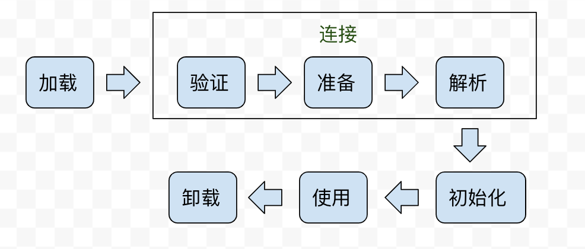
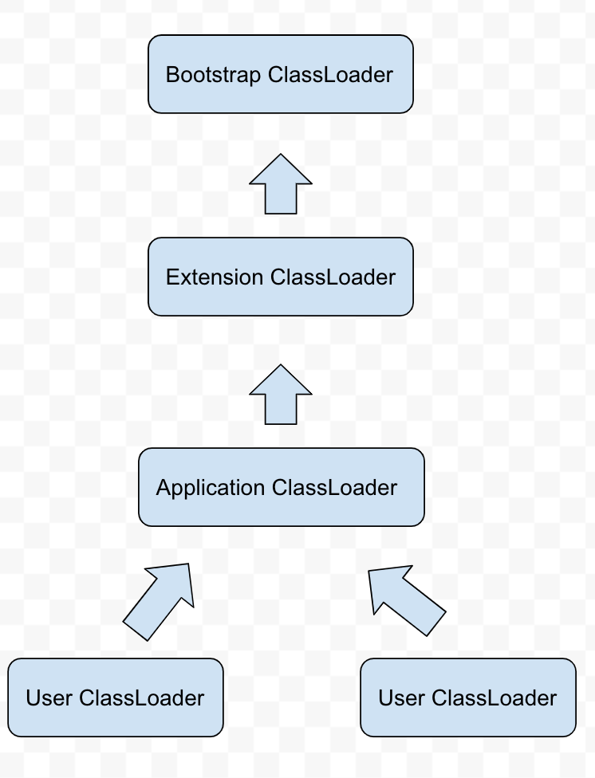
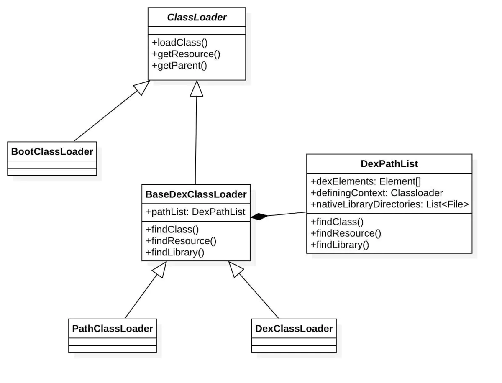

# Android ClassLoader机制

## 1. 传统Jvm

java虚拟机把描述类的数据从Class文件加载到内存，并对数据进行校验、转换解析和初始化，最终形成可以被虚拟机直接使用的Java类型，这就是虚拟机的类加载机制。 

### 1.1 类的生命周期 

类从被加载到虚拟机内存中开始，到卸载出内存为止，它的整个生命周期包括：加载（Loading）、验证（Verification）、准备（Preparation）、解析（Resolution）、初始化（Initialization）、使用（Using）和卸载（Unloading）7个阶段。其中验证、准备、解析3个部分统称为连接（Linking)，这7个阶段的发生顺序如图所示 



### 1.2 类加载器 

对于任意一个类，都需要由加载它的类加载器和这个类本身一同确立其在Java虚拟机中的唯一性，每一个类加载器，都拥有一个独立的类名称空间。这句话可以表达得更通俗一些： **比较两个类是否“相等”，只有在这两个类是由同一个类加载器加载的前提下才有意义，否则，即使这两个类来源于同一个Class文件，被同一个虚拟机加载，只要加载它们的类加载器不同，那这两个类就必定不相等。 **

### 1.3 双亲委派模型 

绝大部分Java程序都会使用到以下3种系统提供的类加载器: 

* **启动类加载器（`Bootstrap ClassLoade`）** 

这个类将器负责将存放在`＜JAVA_HOME＞\lib`目录中的，或者被`-Xbootclasspath`参数所指定的路径中的，并且是虚拟机识别的（仅按照文件名识别，如rt.jar，名字不符合的类库即使放在lib目录中也不会被加载）类库加载到虚拟机内存中。启动类加载器无法被Java程序直接引用，用户在编写自定义类加载器时，如果需要把加载请求委派给引导类加载器，那直接使用null代替即可。 

* **扩展类加载器（`Extension ClassLoader`）** 

这个加载器由`sun.misc.Launcher $ExtClassLoade`r实现，它负责加载`＜JAVA_HOME＞\lib\ext`目录中的，或者被`java.ext.dirs`系统变量所指定的路径中的所有类库，开发者可以直接使用扩展类加载器。 

* **应用程序类加载器（Application ClassLoader） **

这个类加载器由`sun.misc.Launcher $App-ClassLoader`实现。由于这个类加载器是`ClassLoader`中的`getSystemClassLoader（）`方法的返回值，所以一般也称它为系统类加载器。它负责加载用户类路径（`ClassPath`）上所指定的类库，开发者可以直接使用这个类加载器，如果应用程序中没有自定义过自己的类加载器，一般情况下这个就是程序中默认的类加载器。 

java应用程序一般都是由这3种类加载器互相配合进行加载的，如果有必要，还可以加入自己定义的类加载器。这些类加载器之间的关系一般如图所示。 

 

上图中展示的类加载器之间的这种层次关系，称为类加载器的 **双亲委派模型（Parents Delegation Model）**。双亲委派模型要求除了顶层的启动类加载器外，其余的类加载器都应当有自己的父类加载器。这里类加载器之间的父子关系一般不会以继承（Inheritance）的关系来实现，而是都使用组合（Composition）关系来复用父加载器的代码。 

双亲委派模型的 **工作过程** 是：如果一个类加载器收到了类加载的请求，它首先不会自己去尝试加载这个类，而是把这个请求委派给父类加载器去完成，每一个层次的类加载器都是如此，因此所有的加载请求最终都应该传送到顶层的启动类加载器中，只有当父加载器反馈自己无法完成这个加载请求（它的搜索范围中没有找到所需的类）时，子加载器才会尝试自己去加载。 

## 2. Android的ClassLoader机制 

本质上，Android和传统的JVM是一样的，也需要通过ClassLoader 将目标类加载到内存，类加载器之间也符合双亲委派模型，类也有对应的生命周期。但基于移动设备的特点，如内存以及电量等诸多方面跟一般的 PC 设备都有本质的区别，Google开发了更符合移动设备的用于执行 Java 代码的虚拟机，也就是Dalvik和 ART，Android从5.0开始就采用AR虚拟机替代Dalvik。

>  传统Jvm主要是通过读取class字节码来加载, 而ART则是从dex字节码来读取. 这是一种更为优化的方案, 可以将多个.class文件合并成一个classes.dex文件。

### 2.1 Android Classloader种类




#### 2.1.1 BaseDexClassLoader

```java
public class BaseDexClassLoader extends ClassLoader {
    private final DexPathList pathList; //记录dex文件路径信息
    public BaseDexClassLoader(String dexPath, File optimizedDirectory,
            String librarySearchPath, ClassLoader parent) {
        super(parent);
        this.pathList = new DexPathList(this, dexPath, librarySearchPath, null);
    }
    @Override
    protected Class<?> findClass(String name) throws ClassNotFoundException {
        ...
        ...
        Class c = pathList.findClass(name, suppressedExceptions);
        ...
        ...
        return c;
    }
    @Override
    protected URL findResource(String name) {
        return pathList.findResource(name);
    }
    @Override
    public String findLibrary(String name) {
        return pathList.findLibrary(name);
    }
}
```

可以看到在构造函数里初始化了DexPathList对象，而在BaseDexClassLoader中的操作`findClass`、`findResource`执行的都是这个DexPathList对象的操作

> 从DexPathList的构造过程可以看到，无论optimizedDirectory是何值，传递给DexPathList都是空，所以optimizedDirectory参数是无效的（从Android8.0开始）

参数说明：

- dexPath: 包含目标类或资源的apk/jar列表;当有多个路径则采用:分割;
- optimizedDirectory: 优化后dex文件存在的目录, 可以为null;
- libraryPath: native库所在路径列表;当有多个路径则采用:分割;
- ClassLoader:父类的类加载器.

#### 2.1.2 PathClassLoader

```java
public class PathClassLoader extends BaseDexClassLoader {

    public PathClassLoader(String dexPath, ClassLoader parent) {
        super(dexPath, null, null, parent);
    }

    public PathClassLoader(String dexPath, String librarySearchPath, ClassLoader parent) {
        super(dexPath, null, librarySearchPath, parent);
    }
}
```

PathClassLoader比较简单, 继承于BaseDexClassLoader. 默认 optimizedDirectory=null.

#### 2.1.3 DexClassLoader

```java
public class DexClassLoader extends BaseDexClassLoader {
    public DexClassLoader(String dexPath, String optimizedDirectory,
            String librarySearchPath, ClassLoader parent) {
        super(dexPath, null, librarySearchPath, parent);
    }
}
```

DexClassLoader也比较简单, 只是简单封装,和PathClassLoader唯一区别就是多了optimizedDirectory参数，但从上面`BaseDexClassLoader`分析可以知道，从8.0开始optimizedDirectory已经弃用。从理论上来说，PathClassLoader应该可以完全替代DexClassLoader。但网上有这样的结论：

> DexClassLoader：能够加载未安装的apk
> PathClassLoader：只能加载系统中已经安装过的apk

那么在8.0以上这个结论还成立吗，事实上PathClassLoader也可以加载未安装的apk，验证过程比较简单，不在此累赘。


>  BootClassLoader：Android系统启动时会使用BootClassLoader来预加载常用类，与Java中的Bootstrap ClassLoader不同的是，它并不是由C/C++代码实现，而是由Java实现的。BootClassLoader是ClassLoader的一个内部类。


### 2.2 类加载过程

类加载经过一系列前置调用会走到`ClassLoader#loadClass`:

```java
public abstract class ClassLoader {

    public Class<?> loadClass(String className) throws ClassNotFoundException {
        return loadClass(className, false);
    }

    protected Class<?> loadClass(String className, boolean resolve) throws ClassNotFoundException {
        //判断当前类加载器是否已经加载过指定类，若已加载则直接返回
        Class<?> clazz = findLoadedClass(className);

        if (clazz == null) { 
            //如果没有加载过，则调用parent的类加载递归加载该类，若已加载则直接返回
            clazz = parent.loadClass(className, false);
            
            if (clazz == null) {
                //还没加载，则调用当前类加载器来加载
                clazz = findClass(className);
            }
        }
        return clazz;
    }
}
```

```java
public class BaseDexClassLoader extends ClassLoader {
    protected Class<?> findClass(String name) throws ClassNotFoundException {
        Class c = pathList.findClass(name, suppressedExceptions);
        ...
        return c;
    }
}
```

最后会调用到`DexPathList.findClass`

```java
public Class findClass(String name, List<Throwable> suppressed) {
    for (Element element : dexElements) {
        DexFile dex = element.dexFile;
        if (dex != null) {
            //找到目标类，则直接返回
            Class clazz = dex.loadClassBinaryName(name, definingContext, suppressed);
            if (clazz != null) {
                return clazz;
            }
        }
    }
    return null;
}
```

这里是 **核心逻辑**，一个Classloader可以包含多个dex文件，每个dex文件被封装到一个Element对象，这些Element对象排列成有序的数组 dexElements。当查找某个类时，会遍历所有的dex文件，如果找到则直接返回，不再继续遍历dexElements。也就是说当两个类不同的dex中出现，会优先处理排在前面的dex文件，这便是热修复的核心精髓，将需要修复的类所打包的dex文件插入到dexElements前面。


## 参考

[Android类加载器](http://gityuan.com/2017/03/19/android-classloader/)


