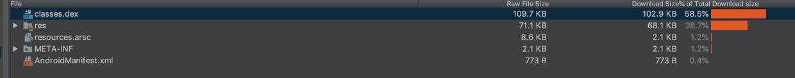
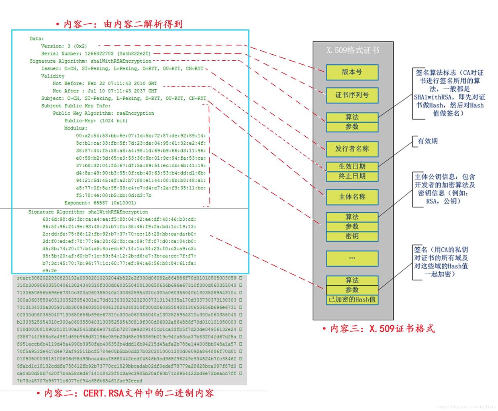

# APK 文件分析

## 概述

我们通过 Android studio APK  Analyze 可以展开一个APK文件


- META-INF
- res
   - anim
   - color
   - drawable
   - drawable-hdpi
   - drawable-land
   - drawable-land-hdpi
   - drawable-mdpi
   - drawable-port
   - drawable-port-hdpi
   - layout
   - layout-land
   - layout-port
   - xml
- AndroidManifest.xml
- classes.dex
- resources.arsc

## META-INF

META-INF目录下存放的是签名信息，用来保证apk包的完整性和系统的安全。里面包含了三个文件，MANIFEST.MF、CERT.SF、CERT.RSA。 

*  MANIFEST.MF

apk中的这个MANIFEST.MF，列出了apk的所有文件，以及这些文件内容所对应的base64-encoded SHA1 哈希值，

``` java
Name: classes.dex
SHA1-Digest: l8Lc+gtdLvtxJ1K+kscUmWQGQ1E=
```

上述表示classes.dex这个文件的SHA1的哈希值为l8Lc+gtdLvtxJ1K+kscUmWQGQ1E=

*  CERT.SF

CERT.SF和MANIFEST.MF很相似，但是它描述的不是文件内容的hash值，而是列出了MANIFEST.MF这个文件中每条信息的hash值，举例会明白些：

```java
Name: classes.dex
SHA1-Digest: ubmMiUS24rU/6K5JloMVG4vHKIU=
```

上面这条hash值`ubmMiUS24rU/6K5JloMVG4vHKIU=`对应的是MANIFEST.MF中下面这几行字符串的hash值

``` java
Name: classes.dex
SHA1-Digest: l8Lc+gtdLvtxJ1K+kscUmWQGQ1E=
```

> 注：计算SHA1-Digest-Manifest时，输入的字符串是三行，还要包括一行空白行，即’\r\n’。！

 * CERT.RSA

 包含了公钥和私钥签名后的一些信息
 它的基本格式是这样的：
 

## res目录
res目录存放资源文件

| 目录        | 资源类型                                                     |
| ----------- | ------------------------------------------------------------ |
| `animator/` | 用于定义[属性动画](https://developer.android.com/guide/topics/graphics/prop-animation.html?hl=zh-cn)的 XML 文件。 |
| `anim/`     | 定义[渐变动画](https://developer.android.com/guide/topics/graphics/view-animation.html?hl=zh-cn#tween-animation)的 XML 文件。（属性动画也可以保存在此目录中，但是为了区分这两种类型，属性动画首选 `animator/` 目录。） |
| `color/`    | 用于定义颜色状态列表的 XML 文件。请参阅[颜色状态列表资源](https://developer.android.com/guide/topics/resources/color-list-resource.html?hl=zh-cn) |
| `drawable/` | 位图文件（`.png`、`.9.png`、`.jpg`、`.gif`）或编译为以下可绘制对象资源子类型的 XML 文件：位图文件九宫格（可调整大小的位图）状态列表形状动画可绘制对象其他可绘制对象请参阅 [可绘制对象资源](https://developer.android.com/guide/topics/resources/drawable-resource.html?hl=zh-cn)。 |
| `mipmap/`   | 适用于不同启动器图标密度的可绘制对象文件。如需了解有关使用 `mipmap/` 文件夹管理启动器图标的详细信息，请参阅[管理项目概览](https://developer.android.com/tools/projects/index.html?hl=zh-cn#mipmap)。 |
| `layout/`   | 用于定义用户界面布局的 XML 文件。 请参阅[布局资源](https://developer.android.com/guide/topics/resources/layout-resource.html?hl=zh-cn)。 |
| `menu/`     | 用于定义应用菜单（如选项菜单、上下文菜单或子菜单）的 XML 文件。请参阅[菜单资源](https://developer.android.com/guide/topics/resources/menu-resource.html?hl=zh-cn)。 |
| `raw/`      | 要以原始形式保存的任意文件。要使用原始 `InputStream` 打开这些资源，请使用资源 ID（即 `R.raw.*filename*`）调用 `Resources.openRawResource()`。但是，如需访问原始文件名和文件层次结构，则可以考虑将某些资源保存在 `assets/` 目录下（而不是 `res/raw/`）。`assets/` 中的文件没有资源 ID，因此您只能使用 `AssetManager` 读取这些文件。 |
| `values/`   | 包含字符串、整型数和颜色等简单值的 XML 文件。其他 `res/` 子目录中的 XML 资源文件是根据 XML 文件名定义单个资源，而 `values/` 目录中的文件可描述多个资源。对于此目录中的文件，`<resources>` 元素的每个子元素均定义一个资源。例如，`<string>` 元素创建 `R.string` 资源，`<color>` 元素创建 `R.color` 资源。由于每个资源均用其自己的 XML 元素定义，因此您可以根据自己的需要命名文件，并将不同的资源类型放在一个文件中。但是，为了清晰起见，您可能需要将独特的资源类型放在不同的文件中。 例如，对于可在此目录中创建的资源，下面给出了相应的文件名约定：arrays.xml，用于资源数组（[类型化数组](https://developer.android.com/guide/topics/resources/more-resources.html?hl=zh-cn#TypedArray)）。colors.xml：[颜色值](https://developer.android.com/guide/topics/resources/more-resources.html?hl=zh-cn#Color)。dimens.xml：[尺寸值](https://developer.android.com/guide/topics/resources/more-resources.html?hl=zh-cn#Dimension)。strings.xml：[字符串值](https://developer.android.com/guide/topics/resources/string-resource.html?hl=zh-cn)。styles.xml：[样式](https://developer.android.com/guide/topics/resources/style-resource.html?hl=zh-cn)。请参阅[字符串资源](https://developer.android.com/guide/topics/resources/string-resource.html?hl=zh-cn)、[样式资源](https://developer.android.com/guide/topics/resources/style-resource.html?hl=zh-cn)和[更多资源类型](https://developer.android.com/guide/topics/resources/more-resources.html?hl=zh-cn)。 |
| `xml/`      | 可以在运行时通过调用 `Resources.getXML()` 读取的任意 XML 文件。各种 XML 配置文件（如[可搜索配置](https://developer.android.com/guide/topics/search/searchable-config.html?hl=zh-cn)）都必须保存在此处。 |

## resources.arsc

编译后的二进制资源文件，主要作用是App的资源索引表，可以从二进制的文件中查找到资源的相关信息，或者根据资源的id可以定位到二进制文件中的位置

## classes.dex文件

简单来说就是android系统的可执行文件，类似于window系统的xx.exe,它包含应用程序的全部操作指令以及运行时数据

## 题外：ART 和 Dalvik

我们知道Java程序都是通过Java虚拟机执行的，Android应用是采用Java开发的，基于移动设备的特点，如内存以及电量等诸多方面跟一般的 PC 设备都有本质的区别，所以需要开发更符合移动设备的用于执行 Java 代码的虚拟机，也就是Dalvik和 ART。
Dalvik和 ART 并不是完全按照JVM的规范开发的，一般JVM虚拟机运行的是 .class 文件，而 Dalvik和 ART 运行的是DEX文件。

> Java 虚拟机执行 .class 格式的字节码。每一个 Java 文件对应一个 .class 的字节码文件，JVM 在运行时为每一个执行到的类装载字节码。而 Android 设备上为了提高执行效率，在编译 Android 项目时，Android 通过 SDK 提供的工具 dex.jar 会把所有的 .class 文件最终打包成一个或者多个 .dex 文件

### ART 和 Dalvik 区别

Dalvik 是 ART 的前身 ，从 Android L 开始，Android 开始启用了新设计的虚拟机 ART 。
ART 比起 Dalvik 有以下优势：

* 预先 (AOT) 编译

ART 引入了预先编译机制，可提高应用的性能。在安装时，ART 使用设备自带的 `dex2oat` 工具来编译应用，并为目标设备生成经过编译的应用可执行文件

* 垃圾回收方面的优化

我们知道**执行GC操作的时候，任何线程的任何操作都会需要暂停，等待GC操作完成之后，其他操作才能够继续运行**，所以GC在 Dalvik 时代也是经常被人诟病的，它会导致界面卡顿。而ART 在GC导致显示不稳定、界面响应速度缓慢以及其他问题都做了优化


## 参考
[android中签名原理和安全性分析之meta-inf文件讲解](http://www.chenglong.ren/2016/12/30/android%E4%B8%AD%E7%AD%BE%E5%90%8D%E5%8E%9F%E7%90%86%E5%92%8C%E5%AE%89%E5%85%A8%E6%80%A7%E5%88%86%E6%9E%90%E4%B9%8Bmeta-inf%E6%96%87%E4%BB%B6%E8%AE%B2%E8%A7%A3/)
[https://source.android.com/devices/tech/dalvik](https://source.android.com/devices/tech/dalvik)