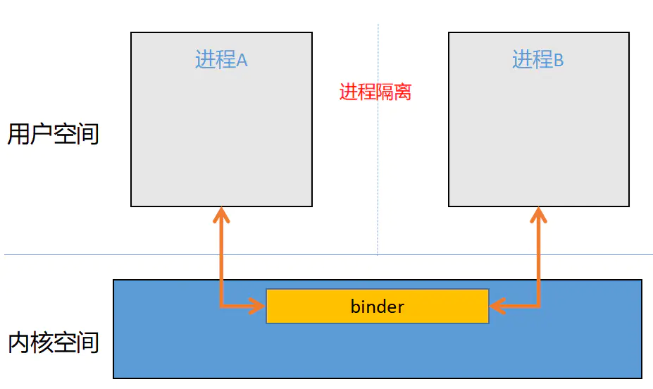
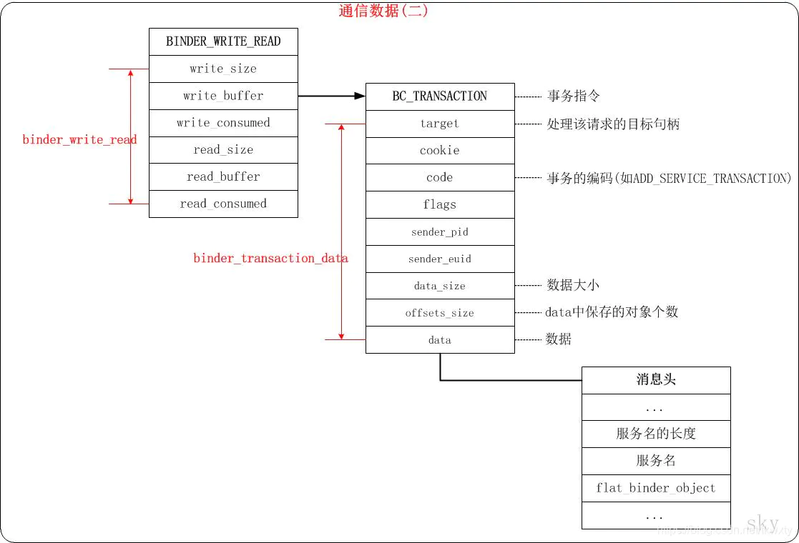
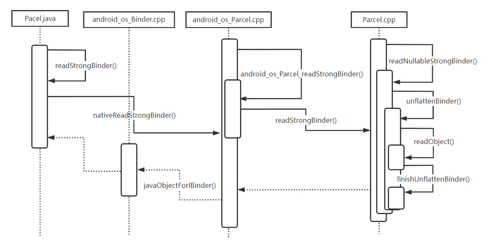
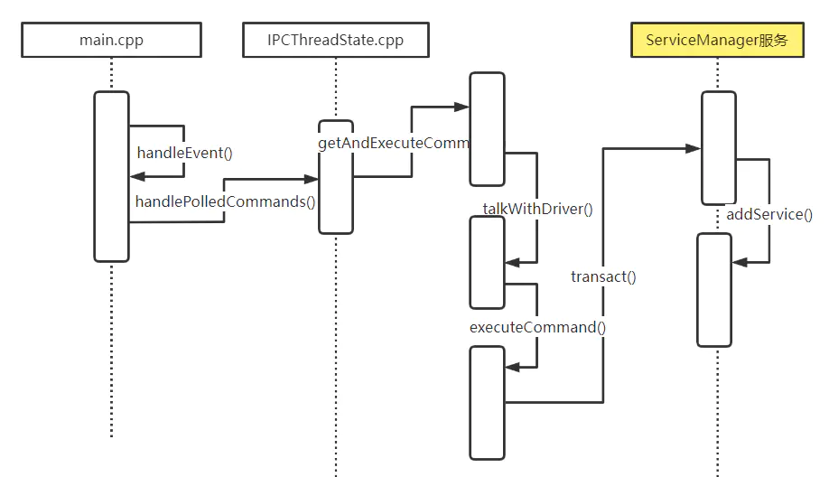
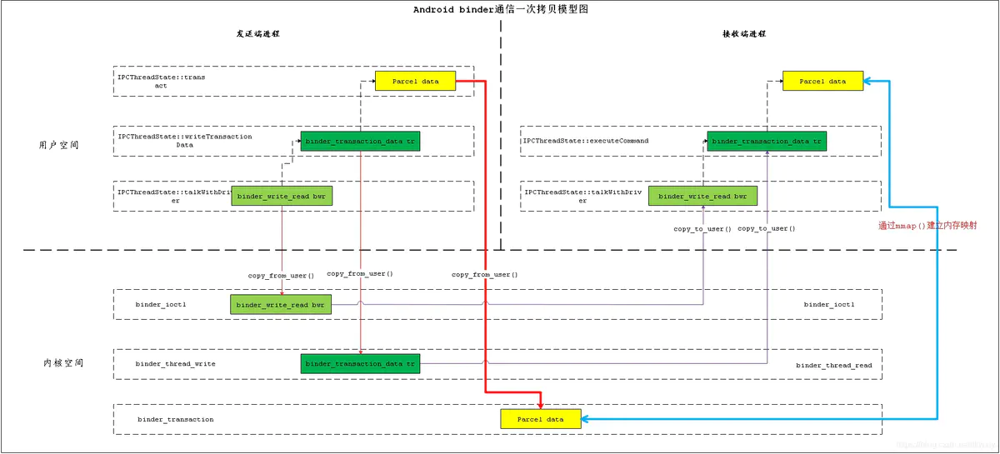

## 第一节:了解一些基础

### 进程隔离

在操作系统中，进程与进程之间的内存和数据都是不共享的，称之为 **进程隔离** 机制。


关于进程隔离知识请参考：[Linux预备知识（一）：进程隔离 - 简书 (jianshu.com)](https://www.jianshu.com/p/63828d891f31)

如果进程之间需要进行通信，那么需要使用IPC机制，操作系统中的IPC机制很多，比如共享内存，socket等，在安卓系统中，最常见的进程间通信就是binder了。

### 虚拟地址空间

进程隔离机制的主要实现方式是使用虚拟地址空间，以32位操作系统为例，总共有4G虚拟地址空间，操作系统将虚拟地址空间划分为2部分，最高的1G字节（`0xC0000000~0xFFFFFFFF`）为内核空间，较低的3G字节（`0x00000000~0xBFFFFFFF`）由各个进程使用，称为用户空间，如下图所示：


### 为什么会划分这些空间

操作系统主要是为了系统的安全性考虑，规定内核空间可以执行CPU的任何指令，而普通进程运行的用户空间则受到很多限制。

> 在CPU的指令中，有些指令是非常危险的，如果调用出错，可能导致系统崩溃。CPU指令分为特权指令和非特权指令，对于特权指令，只允许操作系统和相关模块使用，对于普通应用程序，只能使用那些不会造成灾难的指令。CPU特权等级分为4个级别：Ring0~Ring4。Linux系统中只使用了Ring0和Ring3两个级别。

关于虚拟地址知识请参考：[Linux内核虚拟地址空间 - 简书 (jianshu.com)](https://www.jianshu.com/p/174c1da40c03)

### binder驱动是什么

传统的 Linux 通信机制，比如 Socket，管道等都是内核支持的；但是 Binder 并不是 Linux 内核的一部分，它是怎么做到访问内核空间的呢？ Linux 的动态可加载内核模块（Loadable Kernel Module，LKM）机制解决了这个问题；模块是具有独立功能的程序，它可以被单独编译，但不能独立运行。它在运行时被链接到内核作为内核的一部分在内核空间运行。这样，Android系统可以通过添加一个内核模块运行在内核空间，用户进程之间的通过这个模块作为桥梁，就可以完成通信了。

所以，在 Android 系统中，这个运行在内核空间的，负责各个用户进程通过 Binder 通信的内核模块叫做 Binder 驱动;

> 驱动程序一般指的是设备驱动程序（Device Driver），是一种可以使计算机和设备通信的特殊程序。相当于硬件的接口，操作系统只有通过这个接口，才能控制硬件设备的工作；

### binder如何进行通信

内核中提供了binder驱动模块，为进程间通信提供基础框架，如下图：



## 第二节:系统调用和mmap

在Linux系统中，系统调用(System Call)是用户空间访问内核的唯一手段，也是惟一的合法入口。用户进程与内核之间使用系统调用进行沟通。

### 常用的系统调用

binder机制中常用的系统调用如下表如示：

| 方法    | 描述                                                       | 定义位置                        |
| ------- | ---------------------------------------------------------- | ------------------------------- |
| open()  | 打开设备文件方法                                           | kernel/drivers/android/binder.c |
| mmap()  | memory map，内存映射方法，实现用户空间和内核空间内存共享。 | kernel/drivers/android/binder.c |
| ioctl() | 对设备文件实现读，写等一些扩展功能。                       | kernel/drivers/android/binder.c |

### mmap和一次拷贝

binder作为安卓系统中最常用的IPC技术，其中比较重要的一个优势在于进程间通信时数据的一次拷贝。

由于系统中进程隔离的原因，用户进程之间不能拷贝数据，所以只能依赖内核空间做为辅助，间接传递数据，如下步骤：

1. 数据从client端拷贝到内核。
2. 数据从内核拷贝到server端。

完成上面的2次拷贝之后，才能达到client和server进行数据传递的目的。如下图所示：


而binder使用了内存映射(memory map)技术，只拷贝一次就可以达到用户进程之间传递数据的目的。如下图所示：


mmap是操作系统中成熟的技术，只不过安卓把它巧妙的用在了binder中。映射关系如下图所示：

1. client进程通过copy_from_user()将数据从用户空间拷贝到了内核空间。
2. server进程通过mmap将内核空间的内存地址映射到了用户空间。
3. 只要client将数据拷贝到内核空间，那么server进程就可以直接读取到内核空间的数据，无需再次拷贝。

结构关系如下图所示：


## 第三节:binder整体流程

### 基本架构

在安卓系统中，实现binder架构采用的是Client/Server架构模型，主要有下面几个角色：Client，Server，ServiceManager，Binder驱动。

1. client，server和ServiceManager存在于用户空间中，binder驱动在内核空间中。
2. binder驱动提供设备文件/dev/binder与用户空间进行交互。
3. client，server和ServiceManager通过系统调用open()和ioctl()等操作与binder驱动进行通信。
4. ServiceManager是一个守护进程，用来管理server，并向client提供查询server接口的能力。


### 整体流程

再进一步，如果要使用binder，一次完整的流程主要有以下几个步骤：

1. SM启动并注册为context manager.
2. server进程通过binder向SM中注册服务
3. client进程查询server进程的地址
4. client进程得到SM返回的server进程的地址
5. client进程通过binder使用服务
6. server进程向client进程返回数据


过程看起来没有几步，但是整个流程涉及复杂，从Java , jni ,native，再到内核，到binder驱动，会涉及很多代码文件。
 如下列表所示：
 **1.Framework Java层：（**[**/frameworks/base/core/java/android/os/**](https://links.jianshu.com/go?to=http%3A%2F%2Faospxref.com%2Fandroid-12.0.0_r3%2Fxref%2Fframeworks%2Fbase%2Fcore%2Fjava%2Fandroid%2Fos%2F)**）**：

| 相关文件                                                     |
| ------------------------------------------------------------ |
| [Binder.java](https://links.jianshu.com/go?to=http%3A%2F%2Faospxref.com%2Fandroid-12.0.0_r3%2Fxref%2Fframeworks%2Fbase%2Fcore%2Fjava%2Fandroid%2Fos%2FBinder.java)(实现IBinder) |
| [BinderProxy.java](https://links.jianshu.com/go?to=http%3A%2F%2Faospxref.com%2Fandroid-12.0.0_r3%2Fxref%2Fframeworks%2Fbase%2Fcore%2Fjava%2Fandroid%2Fos%2FBinderProxy.java) |
| [IInterface.java](https://links.jianshu.com/go?to=http%3A%2F%2Faospxref.com%2Fandroid-12.0.0_r3%2Fxref%2Fframeworks%2Fbase%2Fcore%2Fjava%2Fandroid%2Fos%2FIInterface.java) |
| [IBinder.java](https://links.jianshu.com/go?to=http%3A%2F%2Faospxref.com%2Fandroid-12.0.0_r3%2Fxref%2Fframeworks%2Fbase%2Fcore%2Fjava%2Fandroid%2Fos%2FIBinder.java) |
| [Parcel.java](https://links.jianshu.com/go?to=http%3A%2F%2Faospxref.com%2Fandroid-12.0.0_r3%2Fxref%2Fframeworks%2Fbase%2Fcore%2Fjava%2Fandroid%2Fos%2FParcel.java) |
| [ServiceManager.java](https://links.jianshu.com/go?to=http%3A%2F%2Faospxref.com%2Fandroid-12.0.0_r3%2Fxref%2Fframeworks%2Fbase%2Fcore%2Fjava%2Fandroid%2Fos%2FServiceManager.java) |
| [ServiceManagerNative.java](https://links.jianshu.com/go?to=http%3A%2F%2Faospxref.com%2Fandroid-12.0.0_r3%2Fxref%2Fframeworks%2Fbase%2Fcore%2Fjava%2Fandroid%2Fos%2FServiceManagerNative.java) |
| ServiceManagerNative.ServiceManagerProxy                     |

**2.Framework Jni层（**[**/frameworks/base/core/jni/**](https://links.jianshu.com/go?to=http%3A%2F%2Faospxref.com%2Fandroid-12.0.0_r3%2Fxref%2Fframeworks%2Fbase%2Fcore%2Fjni%2F)**）**：

| 相关文件                                                     |
| ------------------------------------------------------------ |
| [android_os_Parcel.cpp](https://links.jianshu.com/go?to=http%3A%2F%2Faospxref.com%2Fandroid-12.0.0_r3%2Fxref%2Fframeworks%2Fbase%2Fcore%2Fjni%2Fandroid_os_Parcel.cpp) |
| [android_util_Binder.cpp](https://links.jianshu.com/go?to=http%3A%2F%2Faospxref.com%2Fandroid-12.0.0_r3%2Fxref%2Fframeworks%2Fbase%2Fcore%2Fjni%2Fandroid_util_Binder.cpp) |
| AndroidRuntime.cpp                                           |

**3.Framework Native层（**[**/frameworks/native/libs/binder**](https://links.jianshu.com/go?to=http%3A%2F%2Faospxref.com%2Fandroid-12.0.0_r3%2Fxref%2Fframeworks%2Fnative%2Flibs%2Fbinder%2F)**）**：

| 相关文件                                                     |
| ------------------------------------------------------------ |
| [IServiceManager.cpp](https://links.jianshu.com/go?to=http%3A%2F%2Faospxref.com%2Fandroid-12.0.0_r3%2Fxref%2Fframeworks%2Fnative%2Flibs%2Fbinder%2FIServiceManager.cpp) |
| [Binder.cpp](https://links.jianshu.com/go?to=http%3A%2F%2Faospxref.com%2Fandroid-12.0.0_r3%2Fxref%2Fframeworks%2Fnative%2Flibs%2Fbinder%2FBinder.cpp)(实现Binder.h) |
| [BpBinder.cpp](https://links.jianshu.com/go?to=http%3A%2F%2Faospxref.com%2Fandroid-12.0.0_r3%2Fxref%2Fframeworks%2Fnative%2Flibs%2Fbinder%2FBpBinder.cpp)(实现BpBinder.h) |
| [Binder.cpp](https://links.jianshu.com/go?to=http%3A%2F%2Faospxref.com%2Fandroid-12.0.0_r3%2Fxref%2Fframeworks%2Fnative%2Flibs%2Fbinder%2FBinder.cpp)(BBinder) |
| [IPCThreadState.cpp](https://links.jianshu.com/go?to=http%3A%2F%2Faospxref.com%2Fandroid-12.0.0_r3%2Fxref%2Fframeworks%2Fnative%2Flibs%2Fbinder%2FIPCThreadState.cpp) |
| [ProcessState.cpp](https://links.jianshu.com/go?to=http%3A%2F%2Faospxref.com%2Fandroid-12.0.0_r3%2Fxref%2Fframeworks%2Fnative%2Flibs%2Fbinder%2FProcessState.cpp) |
| [Parcel.cpp](https://links.jianshu.com/go?to=http%3A%2F%2Faospxref.com%2Fandroid-12.0.0_r3%2Fxref%2Fframeworks%2Fnative%2Flibs%2Fbinder%2FParcel.cpp) |
| [/aidl/android/os/IServiceManager.aidl](https://links.jianshu.com/go?to=http%3A%2F%2Faospxref.com%2Fandroid-12.0.0_r3%2Fxref%2Fframeworks%2Fnative%2Flibs%2Fbinder%2Faidl%2Fandroid%2Fos%2FIServiceManager.aidl) |
| [/include/binder/Binder.h](https://links.jianshu.com/go?to=http%3A%2F%2Faospxref.com%2Fandroid-12.0.0_r3%2Fxref%2Fframeworks%2Fnative%2Flibs%2Fbinder%2Finclude%2Fbinder%2FBinder.h) (**BBinder** : IBinder; BpRefBase : RefBase) |
| [/include/binder/BpBinder.h](https://links.jianshu.com/go?to=http%3A%2F%2Faospxref.com%2Fandroid-12.0.0_r3%2Fxref%2Fframeworks%2Fnative%2Flibs%2Fbinder%2Finclude%2Fbinder%2FBpBinder.h)(**BpBinder** : IBinder) |
| [/include/binder/IBinder.h](https://links.jianshu.com/go?to=http%3A%2F%2Faospxref.com%2Fandroid-12.0.0_r3%2Fxref%2Fframeworks%2Fnative%2Flibs%2Fbinder%2Finclude%2Fbinder%2FIBinder.h)(**IBinder** : RefBase) |
| [/include/binder/IInterface.h](https://links.jianshu.com/go?to=http%3A%2F%2Faospxref.com%2Fandroid-12.0.0_r3%2Fxref%2Fframeworks%2Fnative%2Flibs%2Fbinder%2Finclude%2Fbinder%2FIInterface.h)(**BpInterface**:BpRefBase; **BnInterface**:BBinder) |
| [/include/binder/IServiceManager.h](https://links.jianshu.com/go?to=http%3A%2F%2Faospxref.com%2Fandroid-12.0.0_r3%2Fxref%2Fframeworks%2Fnative%2Flibs%2Fbinder%2Finclude%2Fbinder%2FIServiceManager.h)(继承IInterface.h) |

**4.ServiceManager Native层（**[**frameworks/native/cmds/servicemanager**](https://links.jianshu.com/go?to=http%3A%2F%2Faospxref.com%2Fandroid-12.0.0_r3%2Fxref%2Fframeworks%2Fnative%2Fcmds%2Fservicemanager%2F)**）**：

| 相关文件                                                     |
| ------------------------------------------------------------ |
| [ServiceManager.cpp](https://links.jianshu.com/go?to=http%3A%2F%2Faospxref.com%2Fandroid-12.0.0_r3%2Fxref%2Fframeworks%2Fnative%2Fcmds%2Fservicemanager%2FServiceManager.cpp) |
| [ServiceManager.h](https://links.jianshu.com/go?to=http%3A%2F%2Faospxref.com%2Fandroid-12.0.0_r3%2Fxref%2Fframeworks%2Fnative%2Fcmds%2Fservicemanager%2FServiceManager.h) |
| [main.cpp](https://links.jianshu.com/go?to=http%3A%2F%2Faospxref.com%2Fandroid-12.0.0_r3%2Fxref%2Fframeworks%2Fnative%2Fcmds%2Fservicemanager%2Fmain.cpp) |

**5.内核层（**[**kernel/drivers/android/binder.c**](https://links.jianshu.com/go?to=https%3A%2F%2Felixir.bootlin.com%2Flinux%2Fv5.3.18%2Fsource%2Fdrivers%2Fandroid)**)**：

| 相关文件                                                     |
| ------------------------------------------------------------ |
| [binder.c](https://links.jianshu.com/go?to=https%3A%2F%2Felixir.bootlin.com%2Flinux%2Fv5.3.18%2Fsource%2Fdrivers%2Fandroid%2Fbinder.c) |

------

## 第四节:环境初始化

正如汽车要行驶，必须先有路，同样的，binder这套机制要运行起来，也要有基础环境。这个环境就是binder驱动和ServiceManager服务，这两个模块在手机开机时就运行起来了。我们分别来看一下。

### 4.1.binder驱动初始化

binder驱动是在kernel的binder.c中初始化的。


```c
//kernel/drivers/android/binder.c
device_initcall(binder_init);
```

#### 4.1.1.初始化入口binder_init()

该函数里面调用了binder_init函数如下：


```c
static int __init binder_init(void)
{
  int ret;
  char *device_name, *device_names, *device_tmp;
  struct binder_device *device;
  struct hlist_node *tmp;

  ret = binder_alloc_shrinker_init();
  if (ret)
    return ret;

  atomic_set(&binder_transaction_log.cur, ~0U);
  atomic_set(&binder_transaction_log_failed.cur, ~0U);

  binder_debugfs_dir_entry_root = debugfs_create_dir("binder", NULL);
  if (binder_debugfs_dir_entry_root)
    binder_debugfs_dir_entry_proc = debugfs_create_dir("proc", binder_debugfs_dir_entry_root);
  ......
  /*
   * Copy the module_parameter string, because we don't want to
   * tokenize it in-place.
   */
  device_names = kstrdup(binder_devices_param, GFP_KERNEL);
  if (!device_names) {
    ret = -ENOMEM;
    goto err_alloc_device_names_failed;
  }

  device_tmp = device_names;
  while ((device_name = strsep(&device_tmp, ","))) {
    ret = init_binder_device(device_name);
    if (ret)
      goto err_init_binder_device_failed;
  }

  return ret;
  ......
}
```

#### 4.1.2.初始设备init_binder_device(name)

binder_init()函数中最重要的就是调用了init_binder_device()函数来初始化binder设备：


```c
static int __init init_binder_device(const char *name)
{
  int ret;
  struct binder_device *binder_device;

  binder_device = kzalloc(sizeof(*binder_device), GFP_KERNEL);
  if (!binder_device)
    return -ENOMEM;

  binder_device->miscdev.fops = &binder_fops;
  binder_device->miscdev.minor = MISC_DYNAMIC_MINOR;
  binder_device->miscdev.name = name;

  binder_device->context.binder_context_mgr_uid = INVALID_UID;
  binder_device->context.name = name;
  mutex_init(&binder_device->context.context_mgr_node_lock);

  ret = misc_register(&binder_device->miscdev);
  if (ret < 0) {
    kfree(binder_device);
    return ret;
  }

  hlist_add_head(&binder_device->hlist, &binder_devices);

  return ret;
}
```

#### 4.1.3.配置binder_fops

init_binder_device()函数里面生成了binder设备对象binder_device，设置了binder设备的操作列表binder_fops如下，这些就是binder设备常用的一些操作。


```c
const struct file_operations binder_fops = {
  .owner = THIS_MODULE,
  .poll = binder_poll,
  .unlocked_ioctl = binder_ioctl,
  .compat_ioctl = binder_ioctl,
  .mmap = binder_mmap,
  .open = binder_open,
  .flush = binder_flush,
  .release = binder_release,
};
```

名称name从CONFIG_ANDROID_BINDER_DEVICES配置中来，配置文件在/kernel/configs/android-base.config文件中，其配置为：


```c
CONFIG_ANDROID_BINDER_DEVICES=binder,hwbinder,vndbinder
```

我们可以在binder_init()函数中可以看到CONFIG_ANDROID_BINDER_DEVICES被逗号切分后，使用while循环逐个初始化。

#### 4.1.4.注册misc_register

init_binder_device()函数最后调用了misc_register(&binder_device→miscdev)来注册生成的binder设备，misc_register具体定义如下。


```c
//kenel/driver/char/misc.c
/**
 *  misc_register  -  register a miscellaneous device
 *  @misc: device structure
 *
 *  Register a miscellaneous device with the kernel. If the minor
 *  number is set to %MISC_DYNAMIC_MINOR a minor number is assigned
 *  and placed in the minor field of the structure. For other cases
 *  the minor number requested is used.
 *
 *  The structure passed is linked into the kernel and may not be
 *  destroyed until it has been unregistered. By default, an open()
 *  syscall to the device sets file->private_data to point to the
 *  structure. Drivers don't need open in fops for this.
 *
 *  A zero is returned on success and a negative errno code for
 *  failure.
 */
int misc_register(struct miscdevice *misc)
{
  dev_t dev;
  int err = 0;
  bool is_dynamic = (misc->minor == MISC_DYNAMIC_MINOR);

  INIT_LIST_HEAD(&misc->list);

  mutex_lock(&misc_mtx);

  if (is_dynamic) {
    int i = find_first_zero_bit(misc_minors, DYNAMIC_MINORS);

    if (i >= DYNAMIC_MINORS) {
      err = -EBUSY;
      goto out;
    }
    misc->minor = DYNAMIC_MINORS - i - 1;
    set_bit(i, misc_minors);
  } else {
    struct miscdevice *c;

    list_for_each_entry(c, &misc_list, list) {
      if (c->minor == misc->minor) {
        err = -EBUSY;
        goto out;
      }
    }
  }

  dev = MKDEV(MISC_MAJOR, misc->minor);

  misc->this_device =
    device_create_with_groups(misc_class, misc->parent, dev,
            misc, misc->groups, "%s", misc->name);
  if (IS_ERR(misc->this_device)) {
    if (is_dynamic) {
      int i = DYNAMIC_MINORS - misc->minor - 1;

      if (i < DYNAMIC_MINORS && i >= 0)
        clear_bit(i, misc_minors);
      misc->minor = MISC_DYNAMIC_MINOR;
    }
    err = PTR_ERR(misc->this_device);
    goto out;
  }

  /*
   * Add it to the front, so that later devices can "override"
   * earlier defaults
   */
  list_add(&misc->list, &misc_list);
 out:
  mutex_unlock(&misc_mtx);
  return err;
}
```

#### 4.1.5.总结流程

经过上面的步骤之后，client和server才能使用binder驱动进行跨进程通信，相当于是铺垫好了沟通的道路。binder驱动初始化主要流程都在kernel/drivers/android/binder.c文件中，调用的主要流程如下：


### 4.2.ServiceManager服务初始化

ServiceManager服务启动相关的流程都在frameworks/native/cmds/servicemanager目录下面。

首先是开机由init进程解析init.rc文件启动servicemanager.rc.


```c
//frameworks/native/cmds/servicemanager/servicemanager.rc
service servicemanager /system/bin/servicemanager
    class core animation
    user system
    group system readproc
    critical
    onrestart restart apexd
    onrestart restart audioserver
    onrestart restart gatekeeperd
    onrestart class_restart main
    onrestart class_restart hal
    onrestart class_restart early_hal
    writepid /dev/cpuset/system-background/tasks
    shutdown critical
```

启动会调用main.cpp的main函数：


```c
//frameworks/native/cmds/servicemanager/main.cpp
int main(int argc, char** argv) {
    if (argc > 2) {
        LOG(FATAL) << "usage: " << argv[0] << " [binder driver]";
    }

    const char* driver = argc == 2 ? argv[1] : "/dev/binder";
    //打开/dev/binder设备;并且通过mmap映射设备的内存空间到SM进程中
    sp<ProcessState> ps = ProcessState::initWithDriver(driver);
    ps->setThreadPoolMaxThreadCount(0);
    ps->setCallRestriction(ProcessState::CallRestriction::FATAL_IF_NOT_ONEWAY);

    sp<ServiceManager> manager = sp<ServiceManager>::make(std::make_unique<Access>());
    if (!manager->addService("manager", manager, false /*allowIsolated*/, IServiceManager::DUMP_FLAG_PRIORITY_DEFAULT).isOk()) {
        LOG(ERROR) << "Could not self register servicemanager";
    }

    IPCThreadState::self()->setTheContextObject(manager);
    //设置SM为context manager。
    ps->becomeContextManager();

    sp<Looper> looper = Looper::prepare(false /*allowNonCallbacks*/);

    BinderCallback::setupTo(looper);
    ClientCallbackCallback::setupTo(looper, manager);
    //进入循环，等待接收数据来进行处理。
    while(true) {
        looper->pollAll(-1);
    }

    // should not be reached
    return EXIT_FAILURE;
}
```

这个main函数里面主要做了以下几件事情 ：

1. 打开/dev/binder设备;
2. 通过mmap映射设备的内存空间到ServiceManager进程中。
3. 设置ServiceManager为context manager。
4. ServiceManager服务进入循环，等待接收数据来进行处理。

我们分别来看一下：

#### 4.2.1.打开/dev/binder设备;

第1步和第2步骤都是通过ProcessState::initWithDriver(driver);这一行代码来实现的。这一行会触发创建ProcessState对象。

ProcessState 对象构造方法如下：


```c
//frameworks/native/libs/binder/ProcessState.cpp
ProcessState::ProcessState(const char *driver)
    : mDriverName(String8(driver))
    , mDriverFD(open_driver(driver))
    , mVMStart(MAP_FAILED)
    , mThreadCountLock(PTHREAD_MUTEX_INITIALIZER)
    , mThreadCountDecrement(PTHREAD_COND_INITIALIZER)
    , mExecutingThreadsCount(0)
    , mWaitingForThreads(0)
    , mMaxThreads(DEFAULT_MAX_BINDER_THREADS)
    , mStarvationStartTimeMs(0)
    , mThreadPoolStarted(false)
    , mThreadPoolSeq(1)
    , mCallRestriction(CallRestriction::NONE)
{
    if (mDriverFD >= 0) {
        // mmap the binder, providing a chunk of virtual address space to receive transactions.
        mVMStart = mmap(nullptr, BINDER_VM_SIZE, PROT_READ, MAP_PRIVATE | MAP_NORESERVE, mDriverFD, 0);
        if (mVMStart == MAP_FAILED) {
            // *sigh*
            ALOGE("Using %s failed: unable to mmap transaction memory.\n", mDriverName.c_str());
            close(mDriverFD);
            mDriverFD = -1;
            mDriverName.clear();
        }
    }
}
```

我们可以看到构建方法调用了open_driver()和mmap()这两个步骤。

我们看一下open_driver()函数定义如下:


```c
//frameworks/native/libs/binder/ProcessState.cpp
static int open_driver(const char *driver)
{
    int fd = open(driver, O_RDWR | O_CLOEXEC);
    if (fd >= 0) {
        int vers = 0;
        status_t result = ioctl(fd, BINDER_VERSION, &vers);
        if (result == -1) {
            ALOGE("Binder ioctl to obtain version failed: %s", strerror(errno));
            close(fd);
            fd = -1;
        }
        if (result != 0 || vers != BINDER_CURRENT_PROTOCOL_VERSION) {
          ALOGE("Binder driver protocol(%d) does not match user space protocol(%d)! ioctl() return value: %d",
                vers, BINDER_CURRENT_PROTOCOL_VERSION, result);
            close(fd);
            fd = -1;
        }
        size_t maxThreads = DEFAULT_MAX_BINDER_THREADS;
        result = ioctl(fd, BINDER_SET_MAX_THREADS, &maxThreads);
        if (result == -1) {
            ALOGE("Binder ioctl to set max threads failed: %s", strerror(errno));
        }
        uint32_t enable = DEFAULT_ENABLE_ONEWAY_SPAM_DETECTION;
        result = ioctl(fd, BINDER_ENABLE_ONEWAY_SPAM_DETECTION, &enable);
        if (result == -1) {
            ALOGD("Binder ioctl to enable oneway spam detection failed: %s", strerror(errno));
        }
    } else {
        ALOGW("Opening '%s' failed: %s\n", driver, strerror(errno));
    }
    return fd;
}
```

上面的函数调用了open()来打开设备文件，通过ioctl()向binder驱动查询或者设置了一些信息，比如BINDER_VERSION，BINDER_SET_MAX_THREADS等操作。

ioctl()接口是用户空间和binder内核空间进行交互的主要接口，其中一些重要的命令如下表：

| 命令                   | 描述                                                         |
| ---------------------- | ------------------------------------------------------------ |
| BINDER_WRITE_READ      | 该命令由用户空间向binder驱动写入或者读取数据。 里面包含两部分：写和读。 当write_size不为0时，表示要将write_buffer里面的数据写入binder驱动。 当read_size不为0时，表示要从binder驱动中读取数据到read_buffer中。 |
| BINDER_SET_MAX_THREADS | 设置Server端线程池中支持的最大线程数，保存在binder驱动中的binder_proc结构体中。 由于Client端是并发向Server发送请求的，所以Server端必须有线程池来处理并发请求。binder驱动中会记录Client端请求的线程数，如果超过最大线程数，则不再处理Client端发送的请求。 |
| BINDER_SET_CONTEXT_MGR | 该命令将当前进程设置为ContextManager，最终保存到binder驱动中的binder_context结构体中的**binder_context_mgr_node**变量中。系统中有且只能有一个Context Manager。由于ServiceManager服务是在开机时启动并且通过此命令将自己设置为ContextManager，所以可以保证ServiceManager是惟一且正确的ContextManager。 |
| BINDER_THREAD_EXIT     | Client通知binder驱动当前线程退出时发送此命令。 如果Client端线程执行结束了，那么会由线程**IPCThreadState**发送此命令，通知binder驱动将对应的线程释放掉. |
| BINDER_VERSION         | 获取binder驱动的版本号。 从用户空间打开binder驱动时，首先会获取binder驱动的版本号，如果和用户空间的版本号不一致，则无法打开binder驱动 。 |

#### 4.2.2.通过mmap映射设备的内存空间到SM进程中。

上面的构造函数在函数体中调用了mmap()来映射内存，返回的mVMStart 为虚拟内存的首地址。参数BINDER_VM_SIZE如下定义：


```c
#define BINDER_VM_SIZE ((1 * 1024 * 1024) - sysconf(_SC_PAGE_SIZE) * 2)
```

binder驱动中对应mmap函数：


```c
//kernel/drivers/android/binder.c
static int binder_mmap(struct file *filp, struct vm_area_struct *vma){
  int ret;
  struct binder_proc *proc = filp->private_data;
  if(proc->tsk != current->group_leader)
      return -EINVAL;
  if((vma->vm_end - vma->vm_start) > SZ_4M)
      vma->vm_end = vma->vm_start +SZ_4M;
  ...
  if(vma->vm_flags & FORBIDDEN_MMAP_FLAGS){
      ret = -EPERM;
      failure_string = "bad vm_flags"
      goto err_bad_arg;
  }
  vma->vm_flags |= VM_DONTCOPY | VM_MIXEDMAP;
  vma->vm_flags &= ~VM_MAYWRITE;
  
  vma->vm_ops = &binder_vm_ops;
  vma->vm_private_data = proc;
  ret = binder_alloc_mmap_handler(&proc->alloc, vma);
  if(ret)
      return ret;
  return 0;
}
```

#### 4.2.3.设置SM为context manager

再来看第3步设置SM为context manager，首先创建了一个ServiceManager实例，


```c
sp<ServiceManager> manager = sp<ServiceManager>::make(std::make_unique<Access>());
```

然后将自己设置到SM中：


```c
manager->addService("manager", manager, false /*allowIsolated*/, IServiceManager::DUMP_FLAG_PRIORITY_DEFAULT)
```

看一下ServiceManager的addService()，由于服务端ServiceManager继承于IBinder接口，所以这里传递的是IBinder接口，然后将自己以name为manager字符保存起来的:


```c
//frameworks/native/cmds/servicemanager/ServiceManager.cpp
Status ServiceManager::addService(const std::string& name, const sp<IBinder>& binder, bool allowIsolated, int32_t dumpPriority){
    ......
    mNameToService[name] = Service {
        .binder = binder,
        .allowIsolated = allowIsolated,
        .dumpPriority = dumpPriority,
        .debugPid = ctxt.debugPid,
    };
    ......
    return Status::ok();
}
```

然后调用ProcessState的becomeContextManager()函数：


```c
ps->becomeContextManager();
```

我们看一下上面这个becomeContextManager()函数的实现，函数里面调用到ioctl()，传递BINDER_SET_CONTEXT_MGR命令将SM设置到binder驱动中，


```c
//frameworks/native/libs/binder/ProcessState.cpp
bool ProcessState::becomeContextManager()
{
    AutoMutex _l(mLock);

    flat_binder_object obj {
        .flags = FLAT_BINDER_FLAG_TXN_SECURITY_CTX,
    };
    ......
    int unused = 0;
    result = ioctl(mDriverFD, BINDER_SET_CONTEXT_MGR, &unused);

    return result == 0;
}
```

我们继续跟进到binder驱动中看一下，在binder驱动中调用到binder_ioctl()函数，


```c
///drivers/android/binder.c
static long binder_ioctl(struct file *filp, unsigned int cmd, unsigned long arg)
{
  int ret;
  struct binder_proc *proc = filp->private_data;
  ......
  case BINDER_SET_CONTEXT_MGR:
    ret = binder_ioctl_set_ctx_mgr(filp);
    if (ret)
      goto err;
    break;
  ......
}
```

上面函数里面的binder_ioctl_set_ctx_mgr()函数就是设置SM为context manager，如下:


```c
///drivers/android/binder.c
static int binder_ioctl_set_ctx_mgr(struct file *filp)
{
  int ret = 0;
  struct binder_proc *proc = filp->private_data;
  struct binder_context *context = proc->context;
  struct binder_node *new_node;
  kuid_t curr_euid = current_euid();

  mutex_lock(&context->context_mgr_node_lock);
  if (context->binder_context_mgr_node) {
    pr_err("BINDER_SET_CONTEXT_MGR already set\n");
    ret = -EBUSY;
    goto out;
  }
  ret = security_binder_set_context_mgr(proc->tsk);
  if (ret < 0)
    goto out;
  if (uid_valid(context->binder_context_mgr_uid)) {
    if (!uid_eq(context->binder_context_mgr_uid, curr_euid)) {
      pr_err("BINDER_SET_CONTEXT_MGR bad uid %d != %d\n",
             from_kuid(&init_user_ns, curr_euid),
             from_kuid(&init_user_ns,
           context->binder_context_mgr_uid));
      ret = -EPERM;
      goto out;
    }
  } else {
    context->binder_context_mgr_uid = curr_euid;
  }
  new_node = binder_new_node(proc, NULL);
  if (!new_node) {
    ret = -ENOMEM;
    goto out;
  }
  binder_node_lock(new_node);
  new_node->local_weak_refs++;
  new_node->local_strong_refs++;
  new_node->has_strong_ref = 1;
  new_node->has_weak_ref = 1;
  context->binder_context_mgr_node = new_node;
  binder_node_unlock(new_node);
  binder_put_node(new_node);
out:
  mutex_unlock(&context->context_mgr_node_lock);
  return ret;
}
```

#### 4.2.4.设置SM循环

在main.cpp的main函数中，继续调用生成looper，进入循环：


```c
    //frameworks/native/cmds/servicemanager/main.cpp
    int main(int argc, char** argv) {
        ......
        sp<Looper> looper = Looper::prepare(false /*allowNonCallbacks*/);
    
        BinderCallback::setupTo(looper);
        ClientCallbackCallback::setupTo(looper, manager);
    
        while(true) {
            looper->pollAll(-1);
        }
        // should not be reached
        return EXIT_FAILURE;
    }
```

看一下BinderCallback定义：


```java
//frameworks/native/cmds/servicemanager/main.cpp
class BinderCallback : public LooperCallback{
public:
    static sp<BinderCallback> setupTo(const sp<Looper>& looper){
        sp<BinderCallback> cb = sp<BinderCallback>::make();
        int binder_fd = -1;
        IPCThreadState::self()->setupPolling(&binder_fd);
        int ret = looper->addFd(binder_fd, Looper::POLL_CALLBACK, Looper::EVENT_INPUT, cb, nullptr);
        return cb;
    }
    int handleEvent(int/*fd*/, int/*events*/, void*/*data*/) override{
        IPCThreadState::self()->handlePolledCommands();
        return 1; // Continue receiving callbacks;
    }
}
```

looper将binder的fd添加进去，监听fd的消息，如果有消息，就会触发looper回调handleEvent方法，接着调用IPCThreadState里面的handlePolledCommands来处理消息：


```c
//frameworks/native/libs/binder/IPCThreadState.cpp
status_t IPCThreadState::handlePolledCommands(){
    status_t result;
    do{
        result = getAndExecuteCommand();
    }while(mIn.dataPosition() < mIn.dataSize());
    processPendingDerefs();
    flushCommands();
    return result;
}
```

#### 4.2.5.总结流程

综上，整个SM初始化流程如下所示：


## 第五节：解析框架

经过上面一节环境初始化完成后，binder驱动已经准备就绪，ServiceManager服务也启动起来，等待client的请求，同时，ServiceManager在binder驱动中也对应有一个binder_proc对象，还有一个binder_node结构体，名字为binder_context_mgr_node。

### 5.1框架中的主要结构体

有些读者可能会有疑问，用户进程和binder驱动到底是怎样进行沟通的？具体是哪些类或者对象在其中起作用呢？

用户进程和binder驱动离得最近的，其实是**ProcessState**和**IPCThreadState**，属于native层，ProcessState代表在用户进程中的对象，每个用户进程有且只有一个ProcessState对象，属于单例。IPCThreadState代表在用户进程中操作binder的线程对象。IPCThreadState对象中主要通过**transact()** 函数通过系统调用与binder驱动进行沟通。

系统调用主要使用的是**ioctl()**，这一个系统调用就承担了读任务和写任务，使用起来比较方便。

当ProcessState对象创建的时候，就会通过系统调用open()来打开binder驱动，并且在binder驱动中创建对应的**binder_proc**结构体对象。如果有多个用户进程，那么在binder驱动中就会存在多个binder_proc结构体对象，这些binder_proc对象保存在**binder_procs**链表中。

由于binder驱动中可以并发的处理用户进程的请求，所以binder驱动中每一个binder_proc对象中有多个线程来处理请求业务。这些线程结构体为**binder_thread**，它们保存在红黑树结构的threads对象中进行管理。

每一个binder_proc中的todo列表表示将要做的工作，其中保存的是binder_work结构体，类似的，每一个binder_thread结构体中也有一个todo列表，列表中也是保存着一个个binder_work结构体。

不论对于ServiceManager服务，还是Client进程，它们和binder驱动交互都是使用的这些对象。

把以上概念的关系整理一下，可以通过下面这张图来表示：


### 5.2框架中传输的数据

前文说了，系统调用ioctl()既承担了写任务，又兼有读的功能，那么它是怎么做到的呢？这就依赖于它的参数——binder_write_read。它的结构如下：




如果client要向binder驱动发送数据，那么client就会填充write_size和write_buffer（参考代码[talkWithDriver](https://links.jianshu.com/go?to=http%3A%2F%2Faospxref.com%2Fandroid-12.0.0_r3%2Fxref%2Fframeworks%2Fnative%2Flibs%2Fbinder%2FIPCThreadState.cpp%23talkWithDriver)），这样通过ioctl()调用到binder驱动中时，binder驱动通过copy_from_user()将client的bwr数据拷贝到binder驱动中的bwr中，然后判断如果bwr的write_size大于0的话，说明client要向binder驱动发送数据，binder驱动就从write_buffer中将数据读取出来进行处理，完成一次数据传递（参考代码[binder_ioctl_write_read](https://links.jianshu.com/go?to=https%3A%2F%2Felixir.bootlin.com%2Flinux%2Fv5.3.18%2Fsource%2Fdrivers%2Fandroid%2Fbinder.c%23L4842)）。

由于binder框架中各对象关系复杂，我们继续通过一张经典网图来整理一下其中的相互关系：


前面章节我们已经对某些概念有所涉及，我们这里再补充一下其中的一些重要概念：

#### 1.binder实体

binder实体是各个server和ServiceManager在内核中的表现形式。binder实体在内核中是binder_node结构体的对象。它的作用是在内核中保存server和ServiceManager的信息，比如binder实体中保存了server对象在用户空间的地址。内核可以通过binder实体找到用户空间的server对象。

binder_node结构体描述：


```c
//kernel/drivers/android/binder.c
/**
 * struct binder_node - binder node bookkeeping
 * Bookkeeping structure for binder nodes.
 */
struct binder_node {
  int debug_id;                 //@debug_id:             unique ID for debugging.(invariant after initialized)
  spinlock_t lock;              //@lock:                 lock for node fields
  struct binder_work work;      //@work:                 worklist element for node work.(protected by @proc->inner_lock)
  union {
    struct rb_node rb_node;     //@rb_node:              element for proc->nodes tree.(protected by @proc->inner_lock)
    struct hlist_node dead_node;//@dead_node:            element for binder_dead_nodes list.(protected by binder_dead_nodes_lock)
  };
  struct binder_proc *proc;     //@proc:                 binder_proc that owns this node.(invariant after initialized)
  struct hlist_head refs;       //@refs:                 list of references on this node.(protected by @lock)
  int internal_strong_refs;     //@internal_strong_refs: used to take strong references when initiating a transaction.(protected by proc->inner_lock if proc and by lock)
  int local_weak_refs;          //@local_weak_refs:      weak user refs from local process.(protected by proc->inner_lock if proc and by lock)
  int local_strong_refs;        //@local_strong_refs:    strong user refs from local process.(protected by proc->inner_lock if proc and by lock)
  int tmp_refs;                 //@tmp_refs:             temporary kernel refs.(protected by @proc->inner_lock while @proc is valid, and by binder_dead_nodes_lock if @proc is NULL. During inc/dec and node release it is also protected by @lock to provide safety as the node dies and @proc becomes NULL)
  binder_uintptr_t ptr;         //@ptr:                  userspace pointer for node.(invariant, no lock needed)
  binder_uintptr_t cookie;      //@cookie:               userspace cookie for node.(invariant, no lock needed)
  struct {
    /*
     * bitfield elements protected by
     * proc inner_lock
     */
    u8 has_strong_ref:1;        //@has_strong_ref:       userspace notified of strong ref.(protected by @proc->inner_lock if @proc and by @lock)
    u8 pending_strong_ref:1;    //@pending_strong_ref:   userspace has acked notification of strong ref.(protected by @proc->inner_lock if @proc and by @lock)
    u8 has_weak_ref:1;          //@has_weak_ref:         userspace notified of weak ref.(protected by @proc->inner_lock if @proc and by @lock)
    u8 pending_weak_ref:1;      //@pending_weak_ref:     userspace has acked notification of weak ref.(protected by @proc->inner_lock if @proc and by @lock)
  };
  struct {
    /*
     * invariant after initialization
     */
    u8 accept_fds:1;            //@accept_fds:           file descriptor operations supported for node.(invariant after initialized)
    u8 min_priority;            //@min_priority:         minimum scheduling priority.(invariant after initialized)
  };
  bool has_async_transaction;   //@has_async_transaction: async transaction to node in progress.(protected by @lock)
  struct list_head async_todo;  //@async_todo:           list of async work items.(protected by @proc->inner_lock)
};
```

#### 2.binder引用

binder引用，是内核中的binder_ref结构体对象，表示是binder实体的引用，每一个binder_ref都是某一个binder实体的引用，通过binder_ref可以在内核中找到对应的binder实体。binder_node和binder_ref都是内核中的数据结构。每一个server在内核中就表现为一个binder实体，而每一个client则表现为一个binder引用，这样，每个binder引用都对应一个binder实体，而每个binder实体可以对应多个binder引用。

binder_ref结构体描述：


```c
//kernel/drivers/android/binder.c
/**
 * struct binder_ref - struct to track references on nodes
 * Structure to track references from procA to target node (on procB). This structure is unsafe to access without holding @proc->outer_lock.
 */
struct binder_ref {
  /* Lookups needed: */
  /*   node + proc => ref (transaction) */
  /*   desc + proc => ref (transaction, inc/dec ref) */
  /*   node => refs + procs (proc exit) */
  struct binder_ref_data data;     //@data: binder_ref_data containing id, handle, and current refcounts
  struct rb_node rb_node_desc;     //@rb_node_desc: node for lookup by @data.desc in proc's rb_tree
  struct rb_node rb_node_node;     //@rb_node_node: node for lookup by @node in proc's rb_tree
  struct hlist_node node_entry;    //@node_entry:  list entry for node->refs list in target node. (protected by @node->lock)
  struct binder_proc *proc;        //@proc: binder_proc containing ref
  struct binder_node *node;        //@node: binder_node of target node. When cleaning up a ref for deletion in binder_cleanup_ref, a non-NULL node indicates the node must be freed
  struct binder_ref_death *death;  //@death:pointer to death notification (ref_death) if requested. (protected by @node->lock)
};
```

#### 3.远程服务

server都是以服务的形式注册到ServiceManager中进行管理的。如果将server看作是本地服务的话，那么client中的远程服务就是本地服务的代理，可以回忆一下设计模式中的代理模式就好理解了，远程服务就是本地服务的一个代理，通过该远程服务client就能和server进行通信。

### 5.3 server如何生成和保存

这里还要解释另外一个问题，就是server是怎么在ServiceManager里面存储的，client端又是怎样拿到server进而进行调用的呢？

server通过SM的addService()保存到SM的列表中，由于SM是服务的管家，里面存储了很多服务，这些服务就一个集合存储起来。这个集合叫ServiceMap，如下所示：


```c
///frameworks/native/cmds/servicemanager/ServiceManager.cpp
using ServiceMap = std::map<std::string, Service>;

struct Service {
    sp<IBinder> binder; // not null
    bool allowIsolated;
    int32_t dumpPriority;
    bool hasClients = false; // notifications sent on true -> false.
    bool guaranteeClient = false; // forces the client check to true
    pid_t debugPid = 0; // the process in which this service runs

    // the number of clients of the service, including servicemanager itself
    ssize_t getNodeStrongRefCount();
};
```

addService()接口主要有2个参数，一个是string，表示服务的名字，一个是服务本身，这样在map中就以"名字"和"服务"映射起来，client端在获取服务的时候，直接可以通过"名字"就可以方便的获取到对应的服务。我们观察Service结构体，发现最关键的属性就是binder，它是一个IBinder接口类型，那么我们的“服务”都是一个IBinder的实现吗？我们以熟悉的ActivityManagerService为例看一下。


```c
//frameworks/base/services/core/java/com/android/server/am/ActivityManagerService.java
public class ActivityManagerService extends IActivityManager.Stub{
    ......
}
```

AMS继承于IActivityManager.Stub，IActivityManager这个java类我们找不到，只找到IActivityManager.aidl，aidl文件可以通过系统编译生成IActivityManager.java文件，我们看一下：


```java
//gen/android/app/IActivityManager.java
public interface IActivityManager extends android.os.IInterface{
    /** Local-side IPC implementation stub class. */
    public static abstract class Stub extends android.os.Binder implements android.app.IActivityManager{
        
        private static final java.lang.String DESCRIPTOR = "android.app.IActivityManager";

        static final int TRANSACTION_startActivity = (android.os.IBinder.FIRST_CALL_TRANSACTION + 7);

        /** Construct the stub at attach it to the interface. */
        public Stub(){
            this.attachInterface(this, DESCRIPTOR);
        }
        
        /** Cast an IBinder object into an android.app.IActivityManager interface, generating a proxy if needed. */
        public static android.app.IActivityManager asInterface(android.os.IBinder obj){
            if(obj==null){return null;}
            android.os.IInterface iin = obj.queryLocalInterface(DESCRIPTOR);
            if(iin!=null && (iin instanceof android.app.IActivityManager)){
                return (android.app.IActivityManager)iin;
            }
            return new android.app.IActivityManager.Stub.Proxy(obj);
        }
        
        @Override public android.os.IBinder asBinder(){
            return this;
        }
        
        @Override public boolean onTransact(int code, android.os.Parcel data, android.os.Parcel reply, int flags) throws android.os.RemoteException{
            java.lang.String descriptor = DESCRIPTOR;
            switch(code){
                case TRANSACTION_startActivity:{
                    data.enforceInterface(descriptor);
                    android.app.IApplicationThread _arg0;
                    _arg0 = android.app.IApplicationThread.Stub.asInterface(data.readStrongBinder());
                    java.lang.String _arg1;
                    _arg1 = data.readString();
                    ......
                    int _result = this.startActivity(_arg0, _arg1, _arg2, _arg3, _arg4, _arg5, _arg6, _arg7, _arg8, _arg9);
                    reply.writeNoException();
                    reply.writeInt(_result);
                    return true;
                }
            }
        }
        private static class Proxy implements android.app.IActivityManager{
            private android.os.IBinder mRemote;
            Proxy(android.os.IBinder remote){ 
                mRemote = remote;
            }
            @Override public android.os.IBinder asBinder(){return mRemote;}
            public java.lang.String getInterfaceDescriptor(){return DESCRIPTOR;}
            public static android.app.IActivityManager sDefaultImpl;
            @Override public int startActivity(android.app.IApplicationThread caller, java.lang.String callingPackage, android.content.Intent intent, java.lang.String resolvedType, android.os.IBinder resultTo, java.lang.String resultWho, int requestCode, int flags, android.app.ProfilerInfo profilerInfo, android.os.Bundle options) throws android.os.RemoteException{
                ......
                boolean _status = mRemote.transact(Stub.TRANSACTION_startActivity, _data, _reply, 0);
                if(!_status && getDefaultImpl()!=null){
                    return getDefaultImpl().startActivity(caller, callingPackage, intent, resolvedType, resultTo, resultWho, requestCode, flags, profiler, options);
                }
                return _result;
            }
       }
       public static android.app.IActivityManager getDefaultImpl(){
           return Stub.Proxy.sDefaultImpl;
       }
    }
    public int startActivity(android.app.IApplicationThread caller, java.lang.String callingPackage, android.content.Intent intent, java.lang.String resolvedType, android.os.IBinder resultTo, java.lang.String resultWho, int requestCode, int flags, android.app.ProfilerInfo profilerInfo, android.os.Bundle options) throws android.os.RemoteException;
}
```

我们看到Sub这个内部类是继承于android.os.Binder的。而android.os.Binder是实现了android.os.IBinder的。


```java
//frameworks/base/core/java/android/os/Binder.java
public class Binder implements IBinder{
......
}
```

而android.os.IBinder是一个接口类。


```java
//frameworks/base/core/java/android/os/IBinder.java
public interface IBinder{
}
```

继承关系如下：


其实，整个binder架构在java层，jni层，native层都有设计，为了让开发者更方便的使用binder，为了对上层更透明，google下了一盘大棋。

如果把binder按照java层和native层划分，那么：

在java层面，binder继承关系如下图所示：


在native层面，binder的继承关系如下图所示：


按照client端和server端划分：

- 在java层面，client端要访问server端，持有的是**BinderProxy**代理，在server端是**Binder**。
- 在native层面，client端是**BpBinder**代理，在server端是**BBinder**。
- java层和native层之间通过**Jni**层面进行衔接。

从另一个角度看，如果把binder按照客户端进程和服务端进程划分，那么client端和server端有不同的对应关系，其对应关系如下图所示：


### 5.4 对象如何传递

我们知道， 同进程内的对象传递一般是传递引用，本质上就是一个内存地址，但是对于跨进程通信，引用传递就不能使用了，由于虚拟内存地址的存在，不同的进程都有自己独立的内存空间，所以进程间传递地址值是无效的。这里就是涉及序列化与反序列化了。在android中，最常用的就是Parcel了。在binder进行跨进程通信时，通常会将数据打包在Parcel对象中，然后通过binder驱动进行传递。

Parcel字面意思就是打包的意思，对于基本数据类型，比如string,int等，可以直接写入到parcel中，但实际传输过程不是真正将这些基本数据类型传递过去了，还是值传递。对于复杂的数据类型，需要序列化和反序列化。我们打个比方，比如我们用一个传真机发送一个纸盒子到远方，先是将三维纸盒子“拍扁”成二维平面纸盒子，再通过传真机传真到远端，远端再将二维平面的纸盒子“还原”成一个三维的纸盒子，如下图所示：


对于具体实现的话，flatten过程主要就是Pacel的writeStrongBinder()的实现：


```c
//frameworks/native/libs/binder/Parcel.cpp
status_t Parcel::writeStrongBinder(const sp<IBinder>& val){
    return flattenBinder(val);
}
```

从java层到native层的调用时序图如下：


相对应的，在远端需要有unflatten的过程：


```c
//frameworks/native/libs/binder/Parcel.cpp
status_t Parcel::readNullableStrongBinder(sp<IBinder* val) const{
    return unflattenBinder(val);
}
```

从java层调用到native层的时序图如下：




对象打包好之后，从用户空间和内核空间之间传输使用如下两个接口：

| copy_from_user() | Copy a block of data from user space to kernel space.        | kernel/lib/usercopy.c |
| ---------------- | ------------------------------------------------------------ | --------------------- |
| copy_to_user()   | User context only. Copy data from kernel space to user space. | kernel/lib/usercopy.c |

### 5.5client-server交互模型：

下面详细说一下client进程和server进程是如何通过binder驱动进行交互的。

1. server进程启动之后，会进入中断等待状态，等待client的请求。
2. 当client需要和server通信时，会将请求发送给binder驱动。
3. binder驱动收到请求之后，会唤醒server进程。
4. 同时，binder驱动会返回消息给client，告诉client：它发送给binder驱动的请求，binder驱动已经接收到。
5. client将请求发送成功后，就进入等待状态，等待server的回复。
6. binder驱动唤醒server后，就将请求转发给server进程。
7. server进程解析出请求的内容，并将回复内容发送给binder驱动。
8. binder驱动收到回复之后，唤醒client进程。
9. 同时，binder驱动会返回消息给server，告诉server：它发送给binder驱动的回复，binder驱动已经收到。
10. server将回复发送成功后，就再次进入等待状态，继续等待client的请求。
11. 最终，binder驱动将回复转发给client。


## 第六节：AMS设置到SM流程

ServiceManager服务启动之后，通过BINDER_SET_CONTEXT_MGR命令将自己设置为ContextManager，即“Service的大管家”，这样后面启动的服务就可以通过ServiceManager来管理，每当Client需要使用Server的功能时，首先通过ServiceManager获取到这个Server服务，然后再调用Server的相关功能。

我们以ActivityManagerService这个服务为例，看一下它的设置过程以及client端调用流程。

我们先看一下AMS是怎么设置到ServiceManager服务中的。

AMS是开机启动的系统服务，所以在开机这一阶段就将自己创建好，并设置到了SM中。

系统主要服务都在framework/base/service文件夹下面，目录结构如下：

/frameworks/base/services

[/java/com/android/server/SystemServer.java](https://links.jianshu.com/go?to=http%3A%2F%2Faospxref.com%2Fandroid-12.0.0_r3%2Fxref%2Fframeworks%2Fbase%2Fservices%2Fjava%2Fcom%2Fandroid%2Fserver%2FSystemServer.java)

[/core/java/com/android/server/am/ActivityManagerService.java](https://links.jianshu.com/go?to=http%3A%2F%2Faospxref.com%2Fandroid-12.0.0_r3%2Fxref%2Fframeworks%2Fbase%2Fservices%2Fcore%2Fjava%2Fcom%2Fandroid%2Fserver%2Fam%2FActivityManagerService.java)

------

**系统启动时，SystemServer.java中的run()方法会启动系统的一些服务，会依次调用下面三个方法：**


```java
//frameworks/base/services/java/com/android/server/SystemServer.java
private void run() {
    ......
  // Start services.
  try {
    t.traceBegin("StartServices");
    startBootstrapServices(t);
    startCoreServices(t);
    startOtherServices(t);
  } catch (Throwable ex) {
    Slog.e("System", "******************************************");
    Slog.e("System", "************ Failure starting system services", ex);
    throw ex;
  } finally {
    t.traceEnd(); // StartServices
  }
  ......
}
```

在SystemServer.java的`startBootstrapServices()`方法中首先创建了AMS的实例，创建最终是在SystemServiceManager.java里面通过newInstance方式创建：


```c
//frameworks/base/services/core/java/com/android/server/SystemServiceManager.java
public final class SystemServiceManager implements Dumpable {
    public <T extends SystemService> T startService(Class<T> serviceClass) {
        Constructor<T> constructor = serviceClass.getConstructor(Context.class);
        service = constructor.newInstance(mContext);
        startService(service);
        return service;
    }
}
```

创建了AMS实例之后 ，接着调用了AMS的`setSystemProcess()`方法：


```java
//frameworks/base/services/java/com/android/server/SystemServer.java
private void startBootstrapServices(@NonNull TimingsTraceAndSlog t) {
    ......
    mActivityManagerService.setSystemProcess();
    .......
}
```

AMS中处理`setSystemProcess()`方法，将AMS自身实例设置到了ServiceManager中，


```java
//frameworks/base/services/core/java/com/android/server/am/ActivityManagerService.java
public class ActivityManagerService extends IActivityManager.Stub{
  ......
  public void setSystemProcess() {
    ......
    ServiceManager.addService(Context.ACTIVITY_SERVICE, this, /* allowIsolated= */ true, DUMP_FLAG_PRIORITY_CRITICAL | DUMP_FLAG_PRIORITY_NORMAL | DUMP_FLAG_PROTO);
    ......
  }
}
```

我们注意到ActivityManagerService是继承于IActivityManager.Stub这个类的，而IActivityManager.Stub其实也是继承于IBinder的，因为addService()是一个通用接口，任何服务都可以调用，所以基于面向对象原理，这里要用统一的IBinder接口来传递，后面我们会继续了解这点。

### 6.1.client获取ServiceManager服务

那么现在问题来了，ServiceManager是作为一个服务存在的，而我们现在是在AMS服务中调用ServiceManager提供的addService()服务，所以AMS在这里其实是作为client端的，那在client端怎么获取到ServiceManager服务并调用呢？

第5节说的BinderProxy，BpBinder这些可以简单理解为通用协议，也就是说不论哪个client，哪个server都会用到这些对象，但是针对具体的服务，它们所实现的业务和功能肯定是不一样的，所以必须在其上再封装一层，将业务接口和业务逻辑封装在里面，比如client端的ServerManager，在java层有ServiceManagerProxy，在native层有BpServiceManager，如下图所示。其中特别说明一下，0在binder框架中是一个比较特殊的标识，它代表的就是ServiceManager服务。


这里不贴具体代码，只通过时序图梳理主要流程，如下图所示。


从流程中我们可以看出，framework层的ServiceManager的实现调用工作其实是交给ServiceManagerProxy的成员变量BinderProxy来处理，而BinderProxy则通过jni的方式，最终会调用到BpBinder对象来处理。

我们看到，native向java层对象的转换是通过Jni层来进行沟通，BpBinder转成BinderProxy可以参考下图：


### 6.2client调用addService()

上一小节分析了一下怎么在java层"获取"到ServiceManager，这样在我们"拿到"ServiceManager之后，就可以调用其addService()接口来实现我们的需求，由上一节所知，最终执行任务的是native层的BpBinder对象。我们看一下addService()的流程：


重点流程说明：

1.在flattenBinder的时候，localBinder不为空，所以flat_binder_object.type等于BINDER_TYPE_BINDER。查看[flattenBinder源码](https://links.jianshu.com/go?to=http%3A%2F%2Faospxref.com%2Fandroid-12.0.0_r3%2Fxref%2Fframeworks%2Fnative%2Flibs%2Fbinder%2FParcel.cpp%23flattenBinder)。

2.从client端传递到binder驱动的，其实是在client端生成的JavaBBinder对象，而且是被"拍扁了的"(flatten)。[查看JavaBBinder源码](https://links.jianshu.com/go?to=http%3A%2F%2Faospxref.com%2Fandroid-12.0.0_r3%2Fxref%2Fframeworks%2Fbase%2Fcore%2Fjni%2Fandroid_util_Binder.cpp%23JavaBBinder)。

### 6.3binder驱动处理addService

上面只是在client端的一部分流程，在调用BpBinder的transaction()之后，就是交给IPCThreadState去和binder驱动接着处理，如下图所示：


解析一下其中的重点步骤：

1.通过copy_from_user()将client端的buffer数据等拷贝到内核中。

2.在binder_init_node_ilocked()函数中初始化binder_node对象，并将binder_node对象添加到列表中进行管理。[查看binder_init_node_ilocked()源码](https://links.jianshu.com/go?to=https%3A%2F%2Felixir.bootlin.com%2Flinux%2Fv5.3.18%2Fsource%2Fdrivers%2Fandroid%2Fbinder.c%23L1121)。

3.为binder_node创建一个binder_ref，如果不存在的话。[查看binder_get_ref_for_node_olocked()源码](https://links.jianshu.com/go?to=https%3A%2F%2Felixir.bootlin.com%2Flinux%2Fv5.3.18%2Fsource%2Fdrivers%2Fandroid%2Fbinder.c%23L1453)。

4.通过binder_proc_transaction()函数通知ServiceManager服务继续处理。[查看binder_proc_transaction()源码](https://links.jianshu.com/go?to=https%3A%2F%2Felixir.bootlin.com%2Flinux%2Fv5.3.18%2Fsource%2Fdrivers%2Fandroid%2Fbinder.c%23L2771)。

### 6.4SM处理addService请求

上一步唤醒ServiceManager之后，ServiceManager则将binder传递过来的"service"读取出来保存到map中。




## 第七节：client获取AMS

client获取AMS服务使用的是SM提供的getService()接口，这里可以分为3个步骤，

第1步client端先发送请求到binder驱动，唤醒SM，等待SM处理完成。

第2步是SM处理getService()逻辑，并将service返回给binder驱动，并唤醒client线程。

第3步，binder驱动将service返回给client端，整个流程完毕。

### 7.1client端发送请求


重点步骤说明：

1.ServiceManager默认是在binder驱动中处于休眠状态，等待client发送请求过来唤醒它进行处理。

2.client端发起getService()流程后，经过ioctl()接口发送write命令，将请求命令等传递到binder驱动中，然后binder驱动唤醒ServiceManager线程进行处理。

3.唤醒SM后，binder驱动写入BR_NOOP和BR_TRANSACTION_COMPLETE命令通过copy_to_user()返回给client端，client端读取到命令后，知道SM已经在处理请求了。

4.client端又通过ioctl()接口向binder驱动发送read命令，在binder_thread_read中等待SM处理返回的数据。

### 7.2SM处理请求

SM进程在随着开机启动后，在binder驱动中处于read休眠状态，等待client线程来唤醒它。经过7.1节的步骤后，SM的binder线程就被唤醒了，处理它的checkService()工作。


重点步骤说明：

1.SM线程被binder驱动的client线程唤醒之后，读取到了checkService的命令，然后SM进程通过talkWithDriver()读取到命令进行处理。查看[checkService()源码](https://links.jianshu.com/go?to=http%3A%2F%2Faospxref.com%2Fandroid-12.0.0_r3%2Fxref%2Fframeworks%2Fnative%2Fcmds%2Fservicemanager%2FServiceManager.cpp%23checkService)。

2.SM进程通过checkService()获取到ams服务对象，通过BC_REPLY命令写入到parcel中，然后通过ioctl()命令通知binder驱动进行处理。

3.binder驱动收到SM的消息后，读取出数据，然后唤醒client的binder线程进行下一步处理，同时将BR_TRANSACTION_COMPLETE消息回复给SM，表示SM处理完成。

### 7.3client收到返回的服务

上一节SM端处理完成后，binder驱动中的SM线程唤醒了之前等待的client线程进行下一步处理。


重点步骤说明：

1.client线程终于从binder_thread_read()中被SM唤醒了，线程通过copy_to_user()系统调用将数据拷贝到client用户进程处理。

2.client从reply中读取到数据后，通过ipcSetDataReference()将数据保存到parcel中，再返回给最初调用的地方处理，这样整个getService()流程就算处理完了。查看[ipcSetDataReference()源码](https://links.jianshu.com/go?to=http%3A%2F%2Faospxref.com%2Fandroid-12.0.0_r3%2Fxref%2Fframeworks%2Fnative%2Flibs%2Fbinder%2FParcel.cpp%3Ffi%3DipcSetDataReference%23ipcSetDataReference)。

### 7.4总结

我们回头看看，仅仅是getService()这一个接口的调用，中间的处理流程就这么冗长，后面拿到服务后还要调用相关功能接口，不过主要流程都大致是类似的，只是一些参数和命令不一样，后面就不详细说了，通过7.1节client端发送请求，7.2节处理请求，7.3节反馈结果，我们再将这3个步骤统一整合一下，如下图交互所示：


## 第八节：解释一些问题

### 8.1为什么使用binder机制作为IPC通信方式

传统的IPC方式有很多，比如管道，socket，共享内存，消息队列，信号量等，但为何google就选中了binder作为IPC方式呢？

#### 1.binder可以很好的实现c-s架构

android系统提供的各种服务实现都由不同的server提供，当client需要获取某个server的服务时，只需要client向server发送相应的请求，server收到请求后进行处理，再将结果返回给client.但是传统的IPC通信手段中，只有socket支持c-s的通信方式，但是socket主要用于网络间通信和本机进程间的低速通信，传输效率太低。

#### 2.binder的传输效率和可操作性好

传统的IPC通信，比如消息队列，管道采用的存储-转发的方式，使用它们进行IPC通信时，需要经过2次内存拷贝，效率太低。而采用binder机制的话，只需要一次内存拷贝即可，而共享内存虽然进行内存拷贝的次数为0，但是共享内存操作复杂，也不适合这种场景。当然，socket也要其适用的场景，比如android系统中的Input系统，而管道也在android looper中发挥着重要作用。

#### 3.binder的安全性高

传统的IPC机制没有安全措施，完全依赖上层协议来保证。接收方无法获得对方进程可靠的UID/PID，从而无法鉴别对方身份，而binder机制则为每个进程分配了UID/PID来作为鉴别身份的标识，并且在binder通信时会根据UID/PID进行有效性检测，这样就保证了通信的安全性，是其它IPC通信方式所不能及的。

### 8.2一次拷贝的具体含义

我们看到从client到binder驱动，再到server 端，有大量的copy过程，不论是copy_to_user()，还是copy_from_user()，好像拷贝过程无处不在，那么我们常见的说binder的优势在于一次拷贝，到底优在何处呢？其实这个拷贝说的是一次binder通信过程，即client到binder驱动，再到server端，这是一次binder通信过程，在这个过程中，从client把数据拷贝到binder驱动，是一次拷贝过程，不论这个过程中调用了多少次copy_from_user()，而从binder驱动到server，是一次映射过程，不用拷贝，这就是所谓的一次拷贝。而拷贝的数据，也仅仅是业务所需要的parcel数据，而用于binder驱动交互的一些命令等数据，还是需要拷贝的。具体流程可以用下图说明：




## 结尾

binder架构代码繁多，结构复杂，追源码很容易陷入代码的重重包围，无法自拔，看网上文章冗长没有头绪，经常从入门到放弃，本文将binder流程大致过一遍，希望读者能够大致了解一下binder架构。

## 参考文章：

当然，一篇文章不可能将binder的方方面面都涉及到，本篇只是带领大家比较容易的摸到binder的大门，如果大家要继续深入了解，下面有一些参考文章，可以继续学习一下，本篇文章的完成也是参考了下面文章的一些内容，算是站在前人的基础上完成的。

[Binder从入门到放弃（细节篇） - 内核工匠 - 博客园 (cnblogs.com)](https://links.jianshu.com/go?to=https%3A%2F%2Fwww.cnblogs.com%2FLinux-tech%2Fp%2F12961294.html)

[Binder从入门到放弃（框架篇） - 内核工匠 - 博客园 (cnblogs.com)](https://links.jianshu.com/go?to=https%3A%2F%2Fwww.cnblogs.com%2FLinux-tech%2Fp%2F12961297.html)

[Android Binder通信一次拷贝你真的理解了吗？_IT先森-CSDN博客_binder通信数据会拷贝几次](https://links.jianshu.com/go?to=https%3A%2F%2Fblog.csdn.net%2Ftkwxty%2Farticle%2Fdetails%2F112325376)

[Android Binder框架实现之Binder中的数据结构_IT先森-CSDN博客_binder数据结构](https://links.jianshu.com/go?to=https%3A%2F%2Fblog.csdn.net%2Ftkwxty%2Farticle%2Fdetails%2F102843741)

[Android Bander设计与实现 - 设计篇_universus的专栏-CSDN博客_android binder](https://links.jianshu.com/go?to=https%3A%2F%2Fblog.csdn.net%2Funiversus%2Farticle%2Fdetails%2F6211589)

[Binder学习指南 | Weishu's Notes](https://links.jianshu.com/go?to=https%3A%2F%2Fweishu.me%2F2016%2F01%2F12%2Fbinder-index-for-newer%2F)

[一篇文章了解相见恨晚的 Android Binder 进程间通讯机制_jeanboy-CSDN博客_android binder机制](https://links.jianshu.com/go?to=https%3A%2F%2Fblog.csdn.net%2Ffreekiteyu%2Farticle%2Fdetails%2F70082302)

[红茶一杯话Binder（传输机制篇_上） - 悠然红茶的个人页面 - OSCHINA - 中文开源技术交流社区](https://links.jianshu.com/go?to=https%3A%2F%2Fmy.oschina.net%2Fyouranhongcha%2Fblog%2F152233)

[红茶一杯话Binder（初始篇） - 悠然红茶的个人页面 - OSCHINA - 中文开源技术交流社区](https://links.jianshu.com/go?to=https%3A%2F%2Fmy.oschina.net%2Fyouranhongcha%2Fblog%2F149575)

[Binder系列—开篇 - Gityuan博客 | 袁辉辉的技术博客](https://links.jianshu.com/go?to=http%3A%2F%2Fgityuan.com%2F2015%2F10%2F31%2Fbinder-prepare%2F)

[Android进程间通信（IPC）机制Binder简要介绍和学习计划_老罗的Android之旅-CSDN博客_android进程间通信](https://links.jianshu.com/go?to=https%3A%2F%2Fblog.csdn.net%2Fluoshengyang%2Farticle%2Fdetails%2F6618363%2F)

[Android深入浅出之Binder机制 - innost - 博客园 (cnblogs.com)](https://links.jianshu.com/go?to=https%3A%2F%2Fwww.cnblogs.com%2Finnost%2Farchive%2F2011%2F01%2F09%2F1931456.html)

[Android跨进程通信IPC之6——Binder框架 - 简书 (jianshu.com)](https://www.jianshu.com/p/b4a8be5c6300)

[Android Binder原理从开始到放弃_三木仔-CSDN博客_android binder原理](https://links.jianshu.com/go?to=https%3A%2F%2Fblog.csdn.net%2Fqq_15893929%2Farticle%2Fdetails%2F85340124)

[深入Android系统（三）Binder-2-使用_apigfly的博客-CSDN博客](https://links.jianshu.com/go?to=https%3A%2F%2Fblog.csdn.net%2Flijie2664989%2Farticle%2Fdetails%2F108418764)

[使用 Binder IPC  |  Android 开源项目  |  Android Open Source Project (google.cn)](https://links.jianshu.com/go?to=https%3A%2F%2Fsource.android.google.cn%2Fdevices%2Farchitecture%2Fhidl%2Fbinder-ipc%3Fhl%3Dzh_cn)

[01. Android Binder图解 小米系统专家 解析Service 的addService注册过程 （安卓12） - 简书 (jianshu.com)](https://www.jianshu.com/p/807da3708055)

[04. Android Binder图解 小米系统专家 解析binder机制 java层（安卓12） - 简书 (jianshu.com)](https://www.jianshu.com/p/1c97c0bde1f9)

[(11条消息) Android10.0 Binder通信原理(三)-ServiceManager篇_IngresGe的博客-CSDN博客_servicemanager](https://links.jianshu.com/go?to=https%3A%2F%2Fblog.csdn.net%2Fyiranfeng%2Farticle%2Fdetails%2F105210069)

[serviceManager介绍 - 简书 (jianshu.com)](https://www.jianshu.com/p/1bb2e9a87300)

[图解Android中的Binder机制_HankingHu的博客-CSDN博客_android binder](https://links.jianshu.com/go?to=https%3A%2F%2Fhanking.blog.csdn.net%2Farticle%2Fdetails%2F105328743)

[深度剖析Android IPC原理 (qq.com)](https://links.jianshu.com/go?to=https%3A%2F%2Fmp.weixin.qq.com%2Fs%3F__biz%3DMzA5MzI3NjE2MA%3D%3D%5C%26mid%3D2650262589%5C%26idx%3D1%5C%26sn%3D0279e74fa5ea47c629f679c28c8b6ec8%5C%26chksm%3D88633d52bf14b444c16719336bc7e0d570727afe76d3c5cd321585f1b5d8794d6ac91fd17437%5C%26mpshare%3D1%5C%26scene%3D1%5C%26srcid%3D0331AcDq3hjlpRHUJxjM83vZ%5C%26sharer_sharetime%3D1648693053518%5C%26sharer_shareid%3Df129a9e16072c58e9b8204454c664761%5C%26version%3D4.0.3.6007%5C%26platform%3Dwin%23rd)

[android分析之Binder 01 - 徐小鱼 - 博客园 (cnblogs.com)](https://links.jianshu.com/go?to=https%3A%2F%2Fwww.cnblogs.com%2Flittlefishxu%2Fp%2F4003337.html)

[理解Android Binder机制(1/3)：驱动篇 (paul.pub)](https://links.jianshu.com/go?to=https%3A%2F%2Fpaul.pub%2Fandroid-binder-driver%2F)

## 参考
摘自https://www.jianshu.com/p/a676a4378250