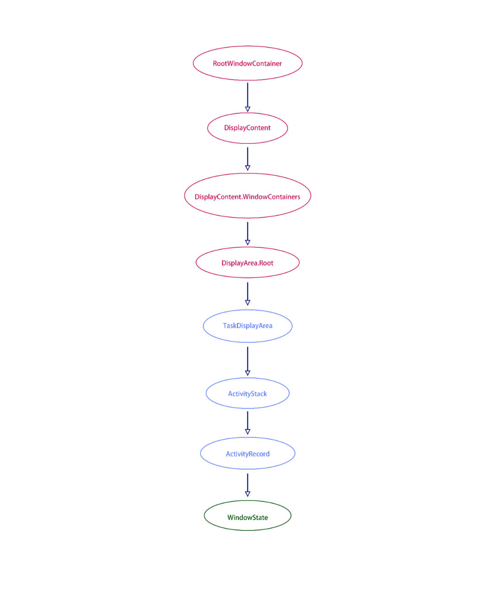
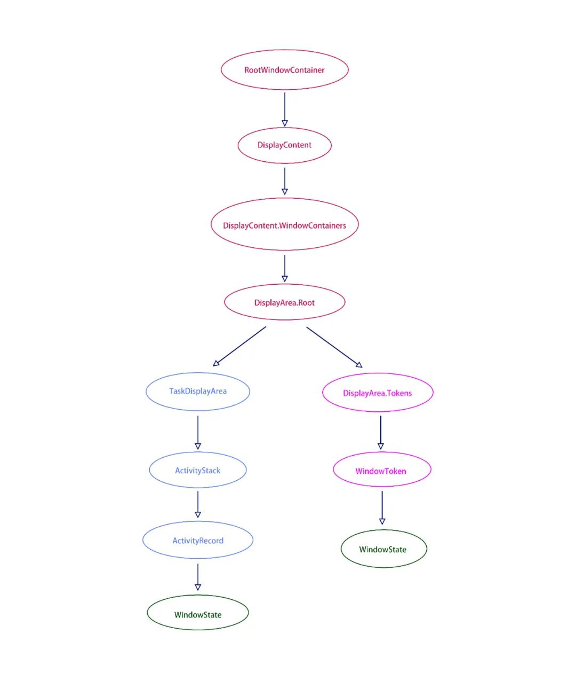
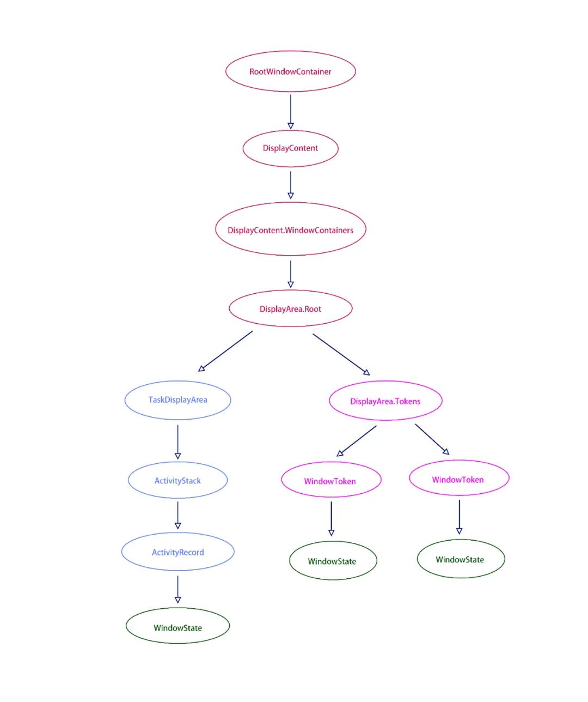
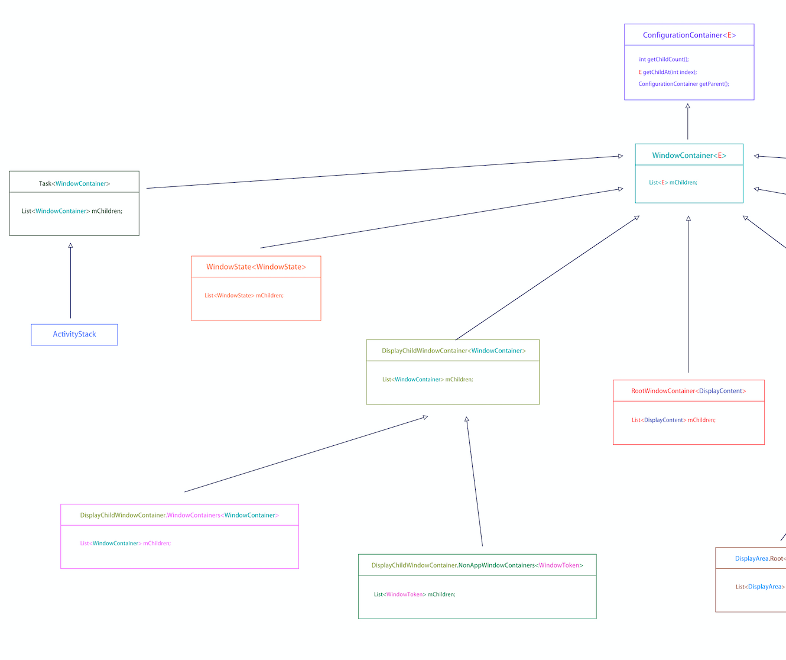
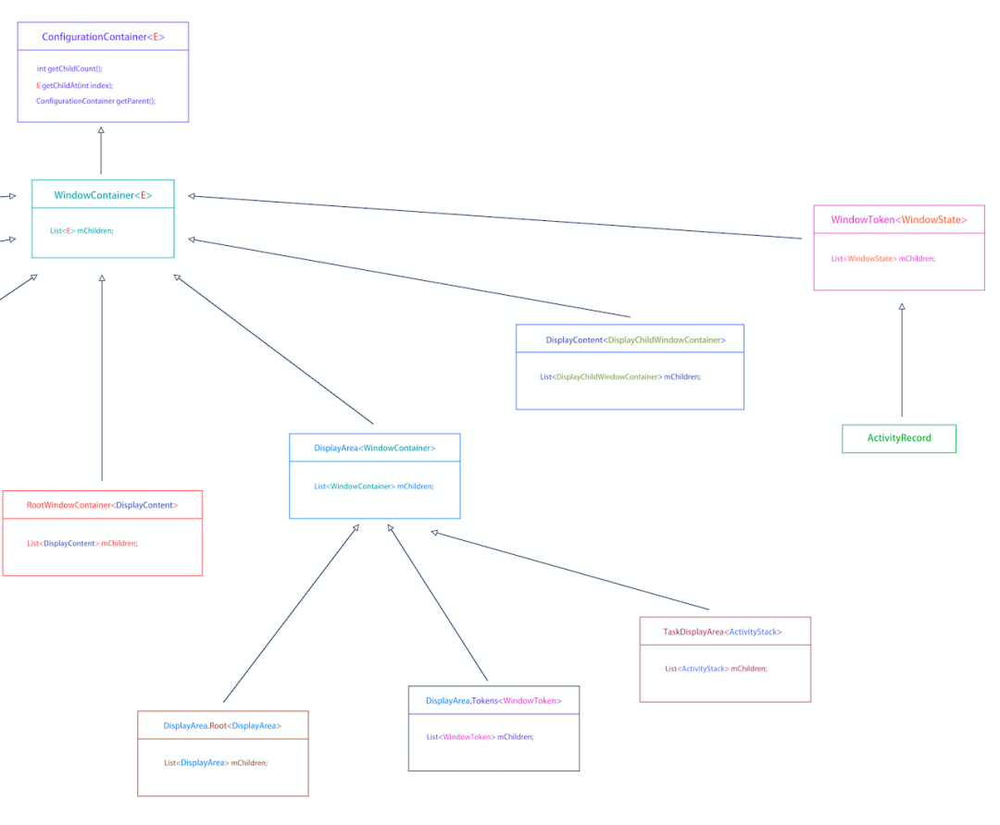

# Dialog 对应的 Context 必须是 Activity吗？

### 问题

在我们的印象里，如果构造一个 Dialog 传入一个非 Activiy 的 context，则可能会出现 bad token exception。

今天我们就来彻底搞清楚这一块，**问题来了：**

1、为什么传入一个非 Activity 的 context 会出现错误？ 

2、传入的 context 一定要是 Activity 吗？

### 解答

#### **1.先来看第二问：创建Dialog对象依赖的Context必须是Activity吗？**

相信大家曾经都有遇到过需要在Application或者Service里弹出Dialog的情景，就算平时做的正式项目没有这种需求，那也应该在刚开始学习Android或者写Demo的时候试过。

所以对于这个问题，回答肯定是：**不是的。**

**在创建Dialog对象时，context参数传Activity和传Service或Application之类的非Activity的Context对象有什么区别呢？**

有经验的同学会说，想要通过非Activity对象创建并正常显示Dialog，首先必须拥有SYSTEM_ALERT_WINDOW权限，还有，在调用Dialog.show方法之前，必须把Dialog的Window的type指定为SYSTEM_WINDOW类型，比如TYPE_SYSTEM_ALERT或TYPE_APPLICATION_OVERLAY。

没有满足第一个条件的话，那肯定会报permission denied啦。

如果在show之前没有指定Window的type为SYSTEM_WINDOW类型，一样会发生BadTokenException的，message是token null is not valid; is your activity running?。

**为什么会这样？**

常规的Dialog的容器是Activity，所以它窗口属性的token引用的就是Activity的Token。到了WMS那边会根据这个Activity的Token来找到对应的ActivityRecord实例（其实是根据Token来查找对应的容器），然后把Dialog对应的WindowState添加到ActivityRecord里面。注意！ 如果在查找容器这一步，没有找到对应实例的话，就会抛出一个BadTokenException(token null is not valid; is your activity running?)

**查找容器还跟Context实例有关系吗？使用Service或Application就找不到容器，换成Activity就能找到，这是为什么？**

肯定有关系啦，别忘了Dialog在show方法里是通过WindowManager来添加View的，而这个WindowManager对象就是从Context的getSystemService(WINDOW_SERVICE)方法获得的。

**重点来了：**因为Activity重写了Context的getSystemService方法，在获取的WINDOW_SERVICE的时候返回了Activity主Window的WindowManager对象。当然了，这个主Window的WindowManager对象也没有什么特别之处，只是它里面的mParentWindow指向的是主Window（其他非Activity的Context的WindowManager.mParentWindow默认都是null）。

WindowManagerGlobal在addView的时候，如果检查到mParentWindow不为null的话，就会对窗口属性（即上一个回答中说到的mWindowAttributes）的token进行赋值，它的逻辑是这样的：

- 如果窗口类型为SUB_WINDOW（即子窗口），就会把mParentWindow对应的ViewRootImpl的mWindow赋值给token（上一个回答也有相关介绍）；
- 窗口类型为SYSTEM_WINDOW（系统级别的窗口，比如ANR Dialog），则不会对token进行赋值。因为普通应用的Window等级比系统Window低，所谓小庙容不下大佛；
- 窗口类型为APPLICATION_WINDOW（Activity主Window和普通的Dialog就是这个类型），会把mParentWindow的mAppToken（也就是所属Activity的mToken）赋值给token；

根据上面这个规则，可以联想到会有两种情况导致窗口属性的token为null（token为null就肯定找不到容器啦），一种是创建Dialog时传了非Activity的Context，另一种是Dialog的Window.type指定为SYSTEM_WINDOW。

**为什么非要一个Token？**

这是因为在WMS那边需要根据这个Token来确定Window的位置（不是说坐标），如果没有Token的话，就不知道这个窗口应该放到哪个容器上了。

**那为什么把Window的type指定为SYSTEM_WINDOW类型就能找到容器了呢？**

其实一样没有找到，只是在获得SYSTEM_ALERT_WINDOW权限之后，会即时创建一个WindowToken而已（ActivityRecord也是继承自WindowToken），然后会把这个新创建的WindowToken附加到特定的容器上。

来看图：

常规的Dialog显示，是这样的。

最底的那个绿色的WindowState，就是Dialog的窗口。

把Dialog的Window.type指定为SYSTEM_WINDOW之后，是这样的：

右边最底的那个WindowState就是SYSTEM_WINDOW类型的Dialog窗口，在层级关系上，跟隔壁的ActivityRecord是相等的。

Dialog窗口所在容器，就是刚刚说到的那个即时创建的WindowToken。

其实其他系统级别的窗口也是放置在这个WindowToken的父级容器DisplayArea.Tokens里面的，就像这样：

噢对了，来了解一下WMS这边的各个容器的关系吧（深色箭头是extends的意思）：

(试了好多办法，一张完整的图都没法让大家在手机上看清，于是我干了成两半)

#### **2.现在来回答第一问：为什么使用非Activity来创建并弹出Dialog，有时会发生BadTokenException？**

主要是因为非Activity的Context它的WindowManger没有ParentWindow，导致在WMS那边找不到对应的容器，也就是不知道要把Dialog的Window放置在何处。

还有一个原因是没有SYSTEM_ALERT_WINDOW权限（当然要加权限啦，DisplayArea.Tokens的子容器，级别比普通应用的Window高，也就是会显示在普通应用Window的前面，如果不加权限控制的话，被滥用还得了）。

在获得SYSTEM_ALERT_WINDOW权限并将Dialog的Window.type指定为SYSTEM_WINDOW之后能正常显示，是因为WMS会为SYSTEM_WINDOW类型的窗口专门创建一个WindowToken（这下就有容器了），并放置在DisplayArea.Tokens里面（这下知道放在哪里了）。

### **总结**

Show一个普通的Dialog需要的并不是Activity本身，而是一个容器的token，我们平时会传Activity，只不过是Activity刚好对应WMS那边的一个WindowState的容器而已。

### 参考

摘自https://cloud.tencent.com/developer/article/1839903