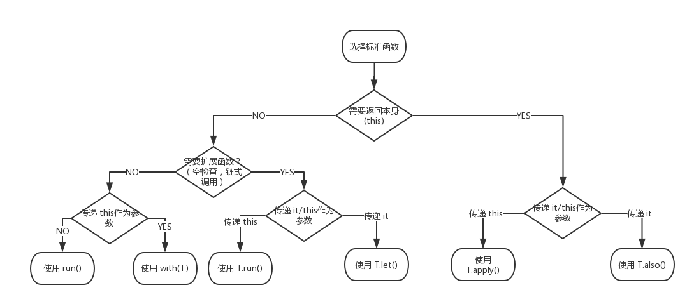

# 掌握Kotlin标准函数：run, with, let, also and apply

Kotlin的一些[标准函数](https://github.com/JetBrains/kotlin/blob/master/libraries/stdlib/src/kotlin/util/Standard.kt)非常相似，我们不确定使用哪个函数。在这里我将介绍一个简单的方法来清楚地区分他们的差异和如何选择使用。

## 范围函数

我重点关注 *run*, *with*, *T.run*, *T.let*, *T.also* and *T.apply* 函数。我称他们为范围函数，因为我认为他们的主要功能是为调用函数提供一个内部范围。

*run* 函数是说明最简单的范围方法

```kotlin
fun test() {
    var mood = "I am sad"

    run {
        val mood = "I am happy"
        println(mood) // I am happy
    }
    println(mood)  // I am sad
}
```
有了这个函数，在`test`函数内部，你可以有一个单独的范围，`mood`在重新定义为`I am happy`并打印之前，它被完全封闭在`run`范围内。

这个范围函数本身似乎不是很有用。但是相比范围，还有一点不错的是，它返回范围内最后一个对象。

因此，下面代码将是很纯洁的，我们可以像下面一样，将`show()`方法应用到两个 view，而不是 调用两次。


```kotlin
run {
      if (firstTimeView) introView else normalView
    }.show()
```

### 范围函数的3个属性

为了使范围函数更有趣，让我用3个属性将他们的行为分类，并且使用这些属性来区分它们。

#### 1.正常vs.扩展函数

如果我们看看定义，`with`并且`T.run`这两个函数实际上非常相似。下面示例实现功能是一样的。

```kotlin
with(webview.settings) {
    javaScriptEnabled = true
    databaseEnabled = true
}
// 相似
webview.settings.run {
    javaScriptEnabled = true
    databaseEnabled = true
}
```

然而，它们的不同之处在于`with`是正常函数，而`T.run`是扩展函数。

那么问题是，每个的优点是什么？

想象一下，如果`webview.settings`可能是空的，那么看起来就像下面一样了。

```kotlin
with(webview.settings) {
      this?.javaScriptEnabled = true
      this?.databaseEnabled = true
   }
}

webview.settings?.run {
    javaScriptEnabled = true
    databaseEnabled = true
}
```

在这种情况下，显然`T.run`扩展功能比较好，因为在使用之前我们可以判空。


#### 2.This vs. it参数

如果我们看看定义，，`T.run`并且`T.let`这两个函数除了接受参数的方式不一样外几乎是一样的。以下两个函数的逻辑是相同的。

```kotlin
stringVariable?.run {
      println("The length of this String is $length")
}

stringVariable?.let {
      println("The length of this String is ${it.length}")
}
```

如果你检查`T.run`函数签名，你会注意到`T.run`只是作为扩展函数调用`block: T.()`。因此，所有的范围内，`T`可以被称为`this`。在编程中，`this`大部分时间可以省略。因此，在我们上面的例子中，我们可以在`println`声明中使用`$length`，而不是`${this.length}`。我把这称为传递 **this参数**。

然而，对于`T.let`函数签名，你会注意到`T.let`把自己作为参数传递进去，即`block: (T)`。因此，这就像传递一个lambda参数。它可以在作用域范围内使用`it`作为引用。所以我把这称为传递 **it参数**。

从上面看，它似乎`T.run`是更优越，因为`T.let`更隐含，但是这是`T.let`函数有一些微妙的优势如下： 

- `T.let`相比外部类函数/成员，使用给定的变量函数/成员提供了更清晰的区分
- 在`this`不能被省略的情况下，例如当它作为函数的参数被传递时`it`比`this`更短，更清晰。
- 在`T.let`允许使用更好的变量命名，你可以转换`it`为其他名称。

```kotlin
stringVariable?.let {
      nonNullString ->
      println("The non null string is $nonNullString")
}
```

#### 3.返回当前类型 vs.其他类型

现在，我们来看看`T.let`和`T.also`，如果我们看它们的内部函数范围，使用起来是一样的

```kotlin
stringVariable?.let {
      println("The length of this String is ${it.length}")
}
stringVariable?.also {
      println("The length of this String is ${it.length}")
}
```

然而，他们微妙的不同是他们的返回值。`T.let`返回不同类型的值，而`T.also`返回`T`本身即`this`。

两者对于链接函数都是有用的，通过`T.let`你可以演变操作，通过`T.also`你在同一个变量`this`上执行操作。

简单的例子如下

```kotlin
val original = "abc"
// 改变值并且传递到下一链条
original.let {
    println("The original String is $it") // "abc"
    it.reversed() // 改变参数并且传递到下一链条
}.let {
    println("The reverse String is $it") // "cba"
    it.length   // 改变类型
}.let {
    println("The length of the String is $it") // 3
}
// 错误
// 在链中发送相同的值（打印的答案是错误的）
original.also {
    println("The original String is $it") // "abc"
    it.reversed() // 即使我们改变它，也是没用的
}.also {
    println("The reverse String is ${it}") // "abc"
    it.length  // 即使我们改变它，也是没用的
}.also {
    println("The length of the String is ${it}") // "abc"
}

// also通过修改原始字符串也可以达到同样目的
// 在链中发送相同的值
original.also {
    println("The original String is $it") // "abc"
}.also {
    println("The reverse String is ${it.reversed()}") // "cba"
}.also {
    println("The length of the String is ${it.length}") // 3
}
```


在上面看来`T.also`好像毫无意义，因为我们可以很容易地将它们组合成一个功能块。但仔细想想，它也有一些优点：

1. 它可以在相同的对象上提供一个非常清晰的分离过程，即制作更小的功能部分。
2. 在使用之前，它可以实现非常强大的自我操纵，实现链条建设者操作(builder 模式)。

当两者结合在一起时，即一个自我演变，一个自我保留，可以变得非常强大，例如下面

```kotlin
// 正常方法
fun makeDir(path: String): File  {
    val result = File(path)
    result.mkdirs()
    return result
}
// 改进方法
fun makeDir(path: String) = path.let{ File(it) }.also{ it.mkdirs() }
```

### 所有的属性

通过说明这3个属性，我们应该可以了解这些函数的行为了。让我们再来看看`T.apply`函数，因为上面没有提到。这3个属性在`T.apply`定义如下...

1. 这是一个扩展函数
2. 把`this`作为参数传递。
3. 它返回`this`（即它本身）

因此，可以想象，它可以像下面一样被使用

```kotlin
// 正常方法
fun createInstance(args: Bundle) : MyFragment {
    val fragment = MyFragment()
    fragment.arguments = args
    return fragment
}
// 改进方法
fun createInstance(args: Bundle) 
              = MyFragment().apply { arguments = args }
```

或者我们也可以创建链式调用。

```kotlin
// 正常方法
fun createIntent(intentData: String, intentAction: String): Intent {
    val intent = Intent()
    intent.action = intentAction
    intent.data=Uri.parse(intentData)
    return intent
}
//  改进实现
fun createIntent(intentData: String, intentAction: String) =
        Intent().apply { action = intentAction }
                .apply { data = Uri.parse(intentData) }
```

### 函数选择

因此，显然，有了这三个属性，我们现在可以对上述函数进行相应的分类。在此基础上，我们可以在下面形成一个决策树，可以帮助我们决定使用哪个函数。



------

希望上面的决策树可以清晰说明函数区别，也简化您的决策，使您能够恰当掌握这些函数的使用。


[原文链接](https://medium.com/mobile-app-development-publication/mastering-kotlin-standard-functions-run-with-let-also-and-apply-9cd334b0ef84)