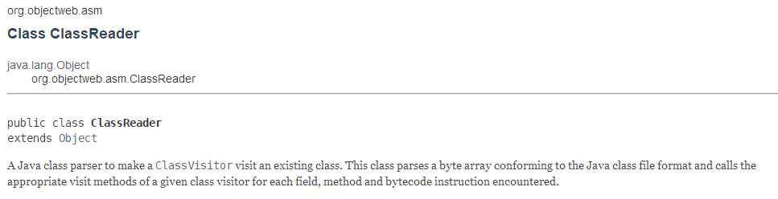
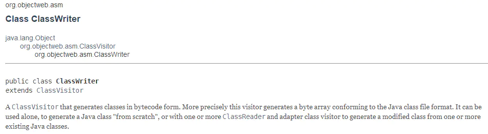
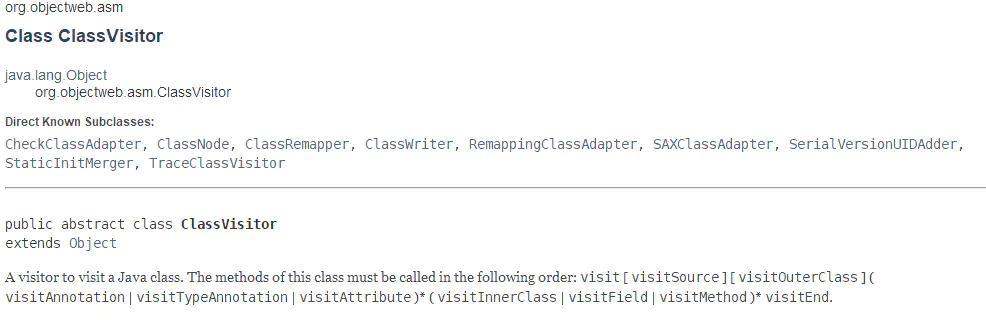
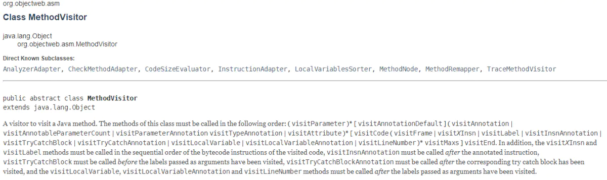
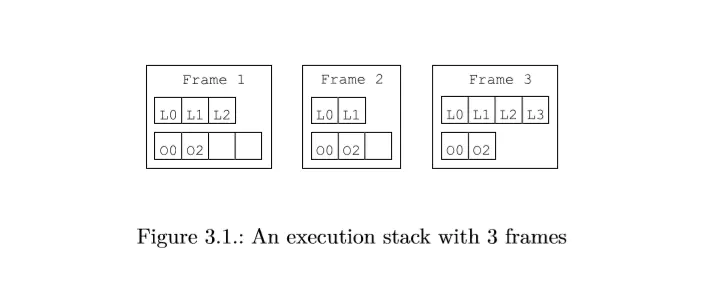
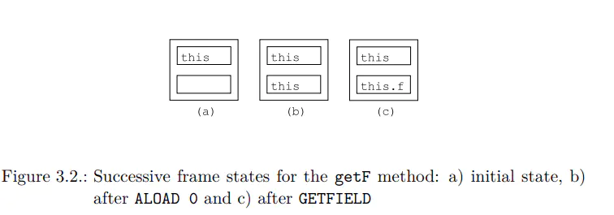
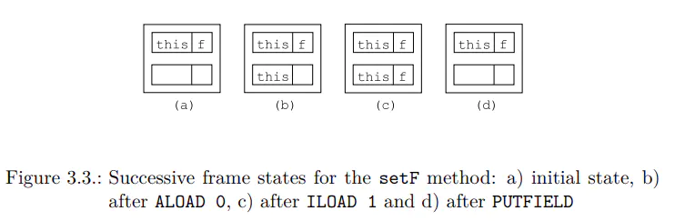
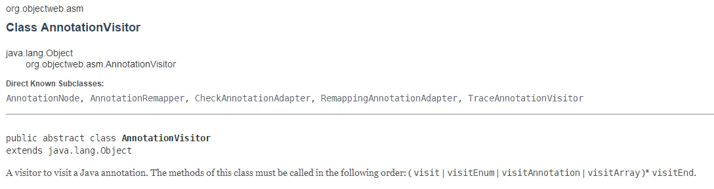
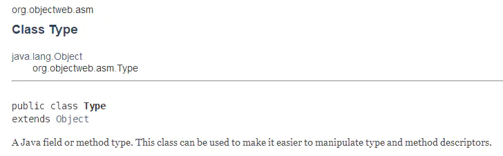

# ASM Core Api 详解

## 前言

前面一篇文章 [ASM 简介](https://blog.adison.top/front-end/android/system/asm-basic/) 对 [ASM](https://links.jianshu.com/go?to=http%3A%2F%2Fasm.ow2.org%2Fu) 框架做了简单的介绍。

本篇文章主要对该框架的 Core Api 其中重要的一些类进行详细的介绍，让大家可以更得心应手的使用 [ASM](https://links.jianshu.com/go?to=http%3A%2F%2Fasm.ow2.org%2Fu)。

在开始之前，让我们先回顾一下 [ASM](https://links.jianshu.com/go?to=http%3A%2F%2Fasm.ow2.org%2Fu) Core Api 调用流程：

1. [ASM](https://links.jianshu.com/go?to=http%3A%2F%2Fasm.ow2.org%2Fu) 提供了一个类`ClassReader`可以方便地让我们对`class`文件进行读取与解析；
2. [ASM](https://links.jianshu.com/go?to=http%3A%2F%2Fasm.ow2.org%2Fu) 在`ClassReader`解析`class`文件过程中，解析到某一个结构就会通知到`ClassVisitor`的相应方法（eg：解析到类方法时，就会回调`ClassVisitor.visitMethod`方法）；
3. 可以通过更改`ClassVisitor`中相应结构方法返回值，实现对类的代码切入（eg：更改`ClassVisitor.visitMethod()`方法的默认返回值`MethodVisitor`实例，通过操作该自定义`MethodVisitor`从而实现对原方法的改写）；
4. 其它的结构遍历也如同`ClassVisitor`；
5. 通过`ClassWriter`的`toByteArray()`方法，得到`class`文件的字节码内容，最后通过文件流写入方式覆盖掉原先的内容，实现`class`文件的改写。

以上，就是 [ASM](https://links.jianshu.com/go?to=http%3A%2F%2Fasm.ow2.org%2Fu) Core Api 的整体运作流程。

接下来，我将对其中涉及到的重要的类进行详细解析。

## [ClassReader](https://links.jianshu.com/go?to=http%3A%2F%2Fasm.ow2.org%2Fasm50%2Fjavadoc%2Fuser%2Findex.html)



这个类会提供你要转变的类的字节数组，它的`accept`方法，接受一个具体的`ClassVisitor`，并调用实现中具体的 **visit**,
 **visitSource**, **visitOuterClass**, **visitAnnotation**, **visitAttribute**, **visitInnerClass**,**visitField**, **visitMethod**和 **visitEnd** 方法。

`ClassReader.accept(ClassVisitor classVisitor, int parsingOptions)`中，第二个参数`parsingOptions`的取值有以下选项：

- **`ClassReader.SKIP_DEBUG`**：表示不遍历调试内容，即跳过源文件，源码调试扩展，局部变量表，局部变量类型表和行号表属性，即以下方法既不会被解析也不会被访问（`ClassVisitor.visitSource`，`MethodVisitor.visitLocalVariable`，`MethodVisitor.visitLineNumber`）。使用此标识后，*类文件调试信息会被去除*，请警记。
- **`ClassReader.SKIP_CODE`**：设置该标识，则代码属性将不会被转换和访问，例如方法体代码不会进行解析和访问。
- **`ClassReader.SKIP_FRAMES`**：设置该标识，表示跳过栈图（StackMap）和栈图表（StackMapTable）属性，即`MethodVisitor.visitFrame`方法不会被转换和访问。当设置了`ClassWriter.COMPUTE_FRAMES`时，设置该标识会很有用，因为他避免了访问帧内容（这些内容会被忽略和重新计算，无需访问）。
- **`ClassReader.EXPAND_FRAMES`**：该标识用于设置扩展栈帧图。默认栈图以它们原始格式（V1_6以下使用扩展格式，其他使用压缩格式）被访问。如果设置该标识，栈图则始终以扩展格式进行访问（此标识在`ClassReader`和`ClassWriter`中增加了解压/压缩步骤，会大幅度降低性能）。

## [ClassWriter](https://links.jianshu.com/go?to=http%3A%2F%2Fasm.ow2.io%2Fjavadoc%2Forg%2Fobjectweb%2Fasm%2FClassWriter.html)



这个类是`ClassVisitor`的一个实现类，这个类中的`toByteArray`方法会将最终修改的字节码以 byte 数组形式返回。它可以单独使用，也可以传递给一个或多个`ClassReader`或`ClassVisitor`适配器修改一个或多个已存在的Java类的类文件。

我们知道，类文件有着自己严格的格式，当我们想要注入相关代码时，不是直接注入相关指令就可以的，比如对于方法注入，我们可能还需要对栈帧图（ stack map frames）进行计算：你需要计算所有的帧，找到有对象跳转或者绝对跳转的帧，最后还要压缩剩余的帧。同样，对于栈帧的局部变量表和操作数栈的大小也要自己进行计算。这些计算操作具备一定的难度，幸运的是，当我们创建一个`ClassWriter`时，可以配置 [ASM](https://links.jianshu.com/go?to=http%3A%2F%2Fasm.ow2.org%2Fu) 自动帮我们对指定的内容进行计算。具体的配置标识如下：

`ClassWriter`的构造函数需要传入一个 flag，其含义为：

- **`ClassWriter(0)`**：表示 [ASM](https://links.jianshu.com/go?to=http%3A%2F%2Fasm.ow2.org%2Fu) 不会自动自动帮你计算栈帧和局部变量表和操作数栈大小。
- **`ClassWriter(ClassWriter.COMPUTE_MAXS)`**：表示 [ASM](https://links.jianshu.com/go?to=http%3A%2F%2Fasm.ow2.org%2Fu) 会自动帮你计算局部变量表和操作数栈的大小，但是你还是需要调用`visitMaxs`方法，但是可以使用任意参数，因为它们会被忽略。带有这个标识，对于栈帧大小，还是需要你手动计算。
- **`ClassWriter(ClassWriter.COMPUTE_FRAMES)`**：表示 [ASM](https://links.jianshu.com/go?to=http%3A%2F%2Fasm.ow2.org%2Fu) 会自动帮你计算所有的内容。你不必去调用`visitFrame`，但是你还是需要调用`visitMaxs`方法（参数可任意设置，同样会被忽略）。

使用这些标识很方便，但是会带来一些性能上的损失：`COMPUTE_MAXS`标识会使`ClassWriter`慢10%，`COMPUTE_FRAMES`标识会使`ClassWriter`慢2倍，

## ClassVisitor



一个可以访问`Java`类的访问者。其方法被调用次序必须满足：

> visit visitSource? visitOuterClass? ( visitAnnotation | visitAttribute )* ( visitInnerClass | visitField | visitMethod )* visitEnd

即`visit`必须第一个被调用，然后最多调用一次`visitSource`，同样接着最多调用一次`visitOuterClass`，~~接下来按任意顺序可多次调用`visitAnnotation`和`visitAttribute`；接下来`visitInnerClass`，`visitField`，`visitMethod`同样按任意顺序可多次调用~~；最后调用一次`visitEnd`，表示类访问结束。

**注:** [ASM](https://links.jianshu.com/go?to=http%3A%2F%2Fasm.ow2.org%2Fu) 文档原文内容为：

> This means that visit must be called first, followed by at most one call to visitSource, followed by at most one call to visitOuterClass, followed by any number of calls in any order to visitAnnotation and visitAttribute, followed by any number of calls ***in any order to visitInnerClass,visitField and visitMethod\*** , and terminated by a single call to visitEnd.

黑体加粗句子我的翻译是：以任意顺序访问`visitInnerClass`,`visitField`和`visitMethod`，但是在我机器上试验得到的结果是这3者的访问顺序是固定的：`visitInnerClass`->`visitField`->`visitMethod`，所以，此处可能是翻译有问题，应该是***以一定的顺序可多次调用 `visitInnerClass`,`visitField` 和`visitMethod`\***。如有差错，烦请指正，感谢！ ^-^

## [MethodVisitor](https://links.jianshu.com/go?to=http%3A%2F%2Fasm.ow2.io%2Fjavadoc%2Forg%2Fobjectweb%2Fasm%2FMethodVisitor.html)



[ASM](https://links.jianshu.com/go?to=http%3A%2F%2Fasm.ow2.org%2Fu) 生成和转换`class`文件方法使用的是抽象类`MethodVisitor`，`ClassVisitor.visitMethod`方法返回的就是该实例。

其方法调用时序为：

> visitAnnotationDefault?
>  ( visitAnnotation | visitParameterAnnotation | visitAttribute )*
>  ( visitCode
>  ( visitTryCatchBlock | visitLabel | visitFrame | visitXxxInsn |
>  visitLocalVariable | visitLineNumber )*
>  visitMaxs )?
>  visitEnd

即如果有`annotations`或者`attributes`，它们必须被第一个访问，接下来对于非抽象方法访问的就是方法内部字节码（`visitCode`)，然后在`visitCode`和`visitMaxs`中的那些指令会按上面所示方法顺序访问，最后类方法访问结束回调`visitEnd`。

在`class`文件中，方法中的代码是以一系列的字节码指令组成的。如果要生成或者改变类内容，则需要先了解下这些指令的工作模型。

下面简单介绍指令的工作模型，了解这些内容就基本能够完成对类的一些简单的变换操作。如需更详细介绍，请参考 [JVM 规范](https://links.jianshu.com/go?to=https%3A%2F%2Fdocs.oracle.com%2Fjavase%2Fspecs%2Fjvms%2Fse7%2Fhtml%2F)。

- **JVM 执行模型**
   在介绍字节码指令之前，有必要先介绍下 JVM 的执行模型。我们都知道，Java 代码是运行在线程中的，每条线程都拥有属于自己的运行栈，栈是由一个或多个帧组成的，也叫栈帧（StackFrame）。每个栈帧代表一个方法调用：每当线程调用一个Java方法时，JVM就会在该线程对应的栈中压入一个帧；当执行这个方法时，它使用这个帧来存储参数、局部变量、中间运算结果等等；当方法执行结束（无论是正常返回还是抛异常）时，该栈帧就会弹出，然后继续运行下一个栈帧（栈顶栈帧）的方法调用。
- **栈帧**
   栈帧由三部分组成：*局部变量表*、*操作数栈*、*帧数据区*。
   **局部变量表** 被组织为以一个字长（32 bit）为单位、从0开始计数的数组，类型为`short`、`byte`和`char`的值在存入数组前要被转换成`int`值，而`long`和 `double`在数组中占据连续的两项，在访问局部变量中的`long`或`double`时，只需取出连续两项的第一项的索引值即可,如某个`long`值在局部变量 区中占据的索引时3、4项，取值时，指令只需取索引为3的`long`值即可。
   **操作数栈** 和局部变量表一样，操作数栈也被组织成一个以字长为单位的数组。但和前者不同的是，它不是通过索引来访问的，而是通过入栈和出栈来访问的。可把操作数栈理解为存储计算时，临时数据的存储区域。
   **帧数据区** 帧数据区除了局部变量表和操作数栈外，Java栈帧还需要一些数据来支持常量池解析、正常方法返回以及异常派发机制。这些数据都保存在Java栈帧的帧数据区中。
   当JVM执行到需要常量池数据的指令时，它都会通过帧数据区中指向常量池的指针来访问它。
   除了处理常量池解析外，帧里的数据还要处理Java方法的正常结束和异常终止。如果是通过return正常结束，则当前栈帧从Java栈中弹出，恢复发起调用的方法的栈。如果方法有返回值，JVM会把返回值压入到发起调用方法的操作数栈。
   为了处理Java方法中的异常情况，帧数据区还必须保存一个对此方法异常引用表的引用。当异常抛出时，JVM给catch块中的代码。如果没发现，方法立即终止，然后JVM用帧区数据的信息恢复发起调用的方法的帧。然后再发起调用方法的上下文重新抛出同样的异常。

局部变量表和操作数栈的大小决于方法代码，它们在编译时进行计算，并与类中的字节码指令一起存储。因此，对于同一个方法调用，所有帧的大小都是一样的，但是对于不同的方法调用，各个栈帧都拥有不同大小的局部变量表和操作数栈。




表 3.1 展示一个带有3个帧的运行栈样例。第一个帧包含3个局部变量，其操作数栈为4个字长大小，包含2个值。第二个帧包含2个局部变量和2个操作数值。第三个帧处于栈顶（当前帧），包含4个局部变量和2个操作数值。

当空栈压入一个帧时，其局部变量表会被初始化压入目标对象实例`this`（对于非静态方法）和方法参数变量。比如，调用`a.equals(b)`时，会创建一个帧，其局部变量表初始化有2个局部变量`a`和`b`（其他变量为被初始化）。

- **字节码指令**
   参考 [Jvm系列2—字节码指令](https://links.jianshu.com/go?to=http%3A%2F%2Fgityuan.com%2F2015%2F10%2F24%2Fjvm-bytecode-grammar%2F)
   在基于堆栈的的虚拟机中，指令的主战场便是操作数栈，**除了load是从局部变量表加载数据到操作数栈以及store储存数据到局部变量表，其余指令基本都是用于操作数栈的**。
- **示例**


```java
package pkg;
public class Bean {
    private int f;
    public int getF() {
     return this.f;
}
  public void setF(int f) {
    this.f = f;
  }
}
```

上面代码的`getF`方法的字节码如下：


```undefined
ALOAD 0
GETFIELD pkg/Bean f I
IRETURN
```

第一条指令读取局部变量表索引0的局部变量`this`，并将值压入到操作数栈中。第二条指令先获取操作数栈栈顶值`this`(弹出栈），获取该实例类成员`f`，并将其压入栈中。最后一条指令将操作数栈弹出，将值返回给调用者。具体过程如下图3.2 所示：




上面代码的`setF(int f)`方法的字节码如下：


```java
ALOAD 0
ILOAD 1
PUTFIELD pkg/Bean f I
RETURN
```

第一条指令将局部变量表索引0的变量`this`压入到操作数栈；第二条指令将局部变量表索引1的变量`f`压入到操作数栈；第三条指令弹出这个值，并且将一个`int`值付给`this.f`；最后一条指令将当前栈帧销毁并将结果返回给调用者。具体过程如下图3.3 所示：




## [AnnotationVisitor](https://links.jianshu.com/go?to=http%3A%2F%2Fasm.ow2.io%2Fjavadoc%2Forg%2Fobjectweb%2Fasm%2FAnnotationVisitor.html)



`AnnotationVisitor` api 访问时序如下：

> ( visit | visitEnum | visitAnnotation | visitArray )* visitEnd

## [Type]()



Type

`Type`对应的是 Java 类型，该类提供一些方法方便我们操控 Java 类型和描述符转换。
 比如：

- [`Type.INT_TYPE`](https://links.jianshu.com/go?to=http%3A%2F%2Fasm.ow2.org%2Fasm50%2Fjavadoc%2Fuser%2Forg%2Fobjectweb%2Fasm%2FType.html%23INT_TYPE)表示一个`int`类型的`Type`实例。
- **Class -> Type**：`Type.getType(String.class)`会返回`String`对应的`Type`类型。
- **Descriptor -> Type**：`Type.getType("Ljava/lang/String;)`会返回类型描述符对应的`Type`类型。
- **InternalName -> Type**：`Type.getObjectType("java/lang/String")`会返回参数 InternalName 对应的`Type`类型。
- **Type -> ClassName**：`Type.getType(String.class).getClassName()`会返回`java.lang.String`。
- **Type -> InternalName**：`Type.getType(String.class).getInternalName()`会返回`String.class`的 InternalName，即`java/lang/String`，该方法只适用于`class`类型或者`interface`类型。
- **Type -> Descriptor**：`Type.getType(String.class).getDescriptor()`会返回`String.class`的 Descriptor，即`Ljava/lang/String;`
- **MethodDescriptor -> ArgumentType**：`Type.getArgumentTypes("(I)V")`会返回方法描述符对应的参数`Type[]`数组，比如此处返回的是`{Type.INT_TYPE}`。
- **MethodDescriptor -> ReturnType**：`Type.getReturnType("(I)V")`会返回方法描述符对应的函数返回值`Type`类型，比如此处返回的是`Type.VOID_TYPE`。

## Notice

1. 通常我们绑定`ClassVisitor`到`ClassReader`的代码如下：


```csharp
byte[] b1 = ...; 
ClassWriter cw = new ClassWriter(0); 
// cv forwards all events to cw 
ClassVisitor cv = new ClassVisitor(ASM4, cw) { }; 
ClassReader cr = new ClassReader(b1); 
cr.accept(cv, 0);
byte[] b2 = cw.toByteArray(); // b2 represents the same class as b1 
```

假设我们并不想做出改动类本身行为，那么按照上面的代码，效率会比较低，因为必须解析字节数组并且要经历事件循环；如果可以直接复制原本的字节数组`b1`到`b2`，那么效率将大大提升。幸运的是，[ASM](https://links.jianshu.com/go?to=http%3A%2F%2Fasm.ow2.org%2Fu) 已考虑到这种情况，并为我们提供了优化方法，如下所示：


```csharp
byte[] b1 = ... 
ClassReader cr = new ClassReader(b1); 
ClassWriter cw = new ClassWriter(cr, 0); //pass cr to cw directly
ChangeVersionAdapter ca = new ChangeVersionAdapter(cw); 
cr.accept(ca, 0);
byte[] b2 = cw.toByteArray(); 
```

原理如下：

- 如果`ClassReader`组件检测到作为其`accept`参数的`ClassVisitor`返回的`MethodVisitor`是来自`ClassWriter`的，这表明该方法没有被改动，事实上甚至不会被程序感知。
- 这种情况下，`ClassReader`组件就不去解析该方法内容，并且不会产生相应事件，只是从`ClassWriter`复制这部分方法的字节码数组。

使用优化方法，性能上比前者提升有2倍多速度。需要注意的是，这种优化方法需要复制类中所有常量到新的字节数组中，这种优化对于增加成员，方法和指令来说，是没有问题的，但是对于删除或者更改类元素名称来说，会大大增加类文件大小，因此，建议对于 **增加** 动作的转换使用优化方法。

## 参考
摘自 https://www.jianshu.com/p/abd1b1b8d3f3