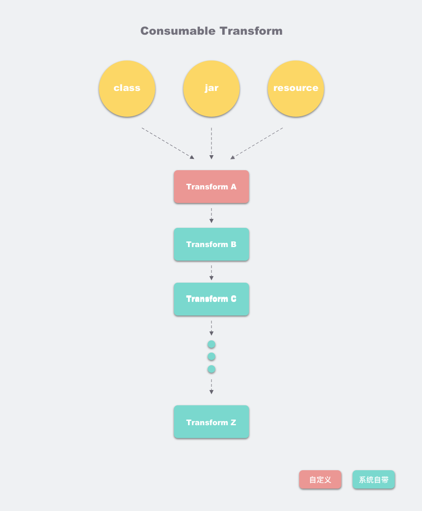
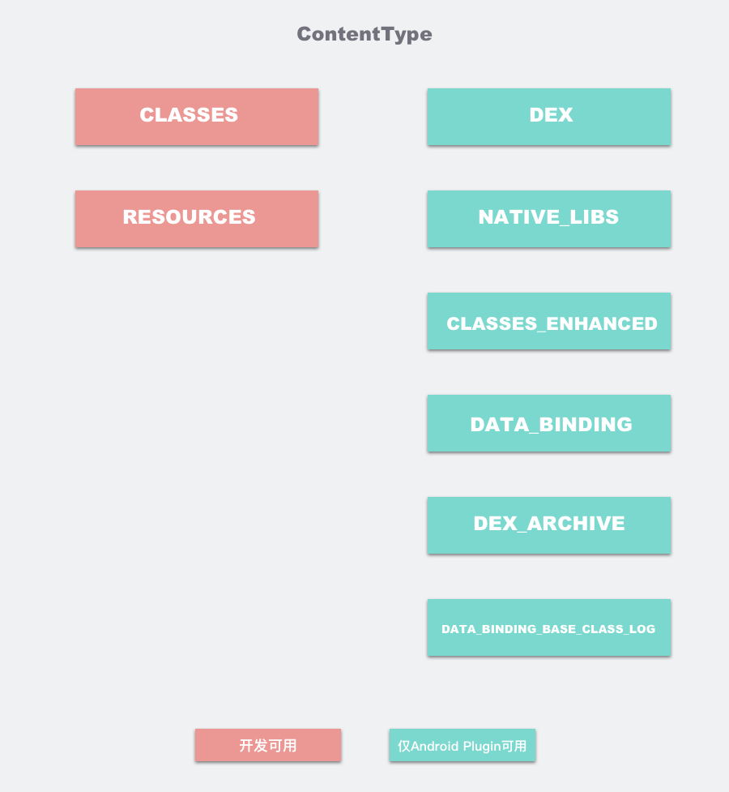
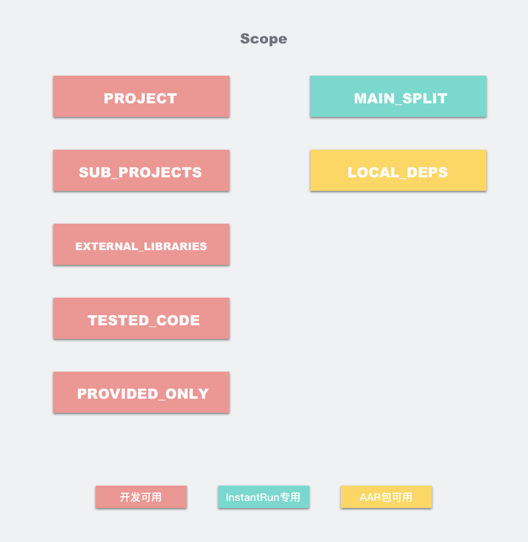

# Android Transform

## 1.1 什么是 Transform？

Transform API 是 Android Gradle Plugin 1.5 就引入的特性，主要用于在 Android 构建过程中，在 Class→Dex 这个节点修改 Class 字节码。利用 Transform API，我们可以拿到所有参与构建的 Class 文件，借助 Javassist 或 ASM 等字节码编辑工具进行修改，插入自定义逻辑。一般来说，这些自定义逻辑是与业务逻辑无关的。

使用 Transform 的常见的应用场景有：

- **埋点统计：** 在页面展现和退出等生命周期中插入埋点统计代码，以统计页面展现数据；
- **耗时监控：** 在指定方法的前后插入耗时计算，以观察方法执行时间；
- **方法替换：** 将方法调用替换为调用另一个方法。

我们可以在自定义插件中注册一个自定义Transform

```java
public class CustomPlugin implements Plugin<Project> {

    ("NullableProblems")
    
    public void apply(Project project) {
        AppExtension appExtension = (AppExtension)project.getProperties().get("android");
        appExtension.registerTransform(new CustomTransform(), Collections.EMPTY_LIST);
    }

}
```
## 1.2 Transform的原理与应用

介绍如何应用Transform之前，我们先介绍Transform的原理，一图胜千言


每个Transform其实都是一个gradle task，Android编译器中的TaskManager将每个Transform串连起来，第一个Transform接收来自javac编译的结果，以及已经拉取到在本地的第三方依赖（jar. aar），还有resource资源，注意，这里的resource并非android项目中的res资源，而是asset目录下的资源。这些编译的中间产物，在Transform组成的链条上流动，每个Transform节点可以对class进行处理再传递给下一个Transform。我们常见的混淆，Desugar等逻辑，它们的实现如今都是封装在一个个Transform中，而我们自定义的Transform，会插入到这个Transform链条的最前面。

但其实，上面这幅图，只是展示Transform的其中一种情况。而Transform其实可以有两种输入，一种是消费型的，当前Transform需要将消费型型输出给下一个Transform，另一种是引用型的，当前Transform可以读取这些输入，而不需要输出给下一个Transform，比如Instant Run就是通过这种方式，检查两次编译之间的diff的。至于怎么在一个Transform中声明两种输入，以及怎么处理两种输入，后面将有示例代码。

为了印证Transform的工作原理和应用方式，我们也可以从Android gradle plugin源码入手找出证据，在TaskManager中，有一个方法`createPostCompilationTasks`.为了避免贴篇幅太长的源码，这里附上链接

[TaskManager#createPostCompilationTasks](https://android.googlesource.com/platform/tools/base/+/studio-master-dev/build-system/gradle-core/src/main/java/com/android/build/gradle/internal/TaskManager.java#2154)

这个方法的脉络很清晰，我们可以看到，Jacoco，Desugar，MergeJavaRes，AdvancedProfiling，Shrinker，Proguard, JarMergeTransform, MultiDex, Dex都是通过Transform的形式一个个串联起来。其中也有将我们自定义的Transform插进去。

讲完了Transform的数据流动的原理，我们再来介绍一下Transform的输入数据的过滤机制，Transform的数据输入，可以通过Scope和ContentType两个维度进行过滤。


ContentType，顾名思义，就是数据类型，在插件开发中，我们一般只能使用CLASSES和RESOURCES两种类型，注意，其中的CLASSES已经包含了class文件和jar文件



从图中可以看到，除了CLASSES和RESOURCES，还有一些我们开发过程无法使用的类型，比如DEX文件，这些隐藏类型在一个独立的枚举类ExtendedContentType中，这些类型只能给Android编译器使用。另外，我们一般使用TransformManager中提供的几个常用的ContentType集合和Scope集合，如果是要处理所有class和jar的字节码，ContentType我们一般使用TransformManager.CONTENT_CLASS。

Scope相比ContentType则是另一个维度的过滤规则，



我们可以发现，左边几个类型可供我们使用，而我们一般都是组合使用这几个类型，TransformManager有几个常用的Scope集合方便开发者使用。
如果是要处理所有class字节码，Scope我们一般使用TransformManager.SCOPE_FULL_PROJECT。

好，目前为止，我们介绍了Transform的数据流动的原理，输入的类型和过滤机制，我们再写一个简单的自定义Transform，让我们对Transform可以有一个更具体的认识

```java
public class CustomTransform extends Transform {

    public static final String TAG = "CustomTransform";

    public CustomTransform() {
        super();
    }

    @Override
    public String getName() {
        return "CustomTransform";
    }

    @Override
    public void transform(TransformInvocation transformInvocation) throws TransformException, InterruptedException, IOException {
        super.transform(transformInvocation);
        //当前是否是增量编译
        boolean isIncremental = transformInvocation.isIncremental();
        //消费型输入，可以从中获取jar包和class文件夹路径。需要输出给下一个任务
        Collection<TransformInput> inputs = transformInvocation.getInputs();
        //引用型输入，无需输出。
        Collection<TransformInput> referencedInputs = transformInvocation.getReferencedInputs();
        //OutputProvider管理输出路径，如果消费型输入为空，你会发现OutputProvider == null
        TransformOutputProvider outputProvider = transformInvocation.getOutputProvider();
        for(TransformInput input : inputs) {
            for(JarInput jarInput : input.getJarInputs()) {
                File dest = outputProvider.getContentLocation(
                        jarInput.getFile().getAbsolutePath(),
                        jarInput.getContentTypes(),
                        jarInput.getScopes(),
                        Format.JAR);
                //将修改过的字节码copy到dest，就可以实现编译期间干预字节码的目的了        
                FileUtils.copyFile(jarInput.getFile(), dest);
            }
            for(DirectoryInput directoryInput : input.getDirectoryInputs()) {
                File dest = outputProvider.getContentLocation(directoryInput.getName(),
                        directoryInput.getContentTypes(), directoryInput.getScopes(),
                        Format.DIRECTORY);
                //将修改过的字节码copy到dest，就可以实现编译期间干预字节码的目的了        
                FileUtils.copyDirectory(directoryInput.getFile(), dest);
            }
        }

    }


    @Override
    public Set<QualifiedContent.ContentType> getInputTypes() {
        return TransformManager.CONTENT_CLASS;
    }

    @Override
    public Set<? super QualifiedContent.Scope> getScopes() {
        return TransformManager.SCOPE_FULL_PROJECT;
    }

    @Override
    public Set<QualifiedContent.ContentType> getOutputTypes() {
        return super.getOutputTypes();
    }

    @Override
    public Set<? super QualifiedContent.Scope> getReferencedScopes() {
        return TransformManager.EMPTY_SCOPES;
    }


    @Override
    public Map<String, Object> getParameterInputs() {
        return super.getParameterInputs();
    }

    @Override
    public boolean isCacheable() {
        return true;
    }

	
    @Override
    public boolean isIncremental() {
        return true; //是否开启增量编译
    }

}
```

可以看到，在transform方法中，我们将每个jar包和class文件复制到dest路径，这个dest路径就是下一个Transform的输入数据，而在复制时，我们就可以做一些狸猫换太子，偷天换日的事情了，先将jar包和class文件的字节码做一些修改，再进行复制即可，至于怎么修改字节码，就要借助我们后面介绍的ASM了。而如果开发过程要看你当前transform处理之后的class/jar包，可以到
/build/intermediates/transforms/CustomTransform/下查看，你会发现所有jar包命名都是123456递增，这是正常的，这里的命名规则可以在OutputProvider.getContentLocation的具体实现中找到

```java
public synchronized File getContentLocation(
        @NonNull String name,
        @NonNull Set<ContentType> types,
        @NonNull Set<? super Scope> scopes,
        @NonNull Format format) {
    // runtime check these since it's (indirectly) called by 3rd party transforms.
    checkNotNull(name);
    checkNotNull(types);
    checkNotNull(scopes);
    checkNotNull(format);
    checkState(!name.isEmpty());
    checkState(!types.isEmpty());
    checkState(!scopes.isEmpty());

    // search for an existing matching substream.
    for (SubStream subStream : subStreams) {
        // look for an existing match. This means same name, types, scopes, and format.
        if (name.equals(subStream.getName())
                && types.equals(subStream.getTypes())
                && scopes.equals(subStream.getScopes())
                && format == subStream.getFormat()) {
            return new File(rootFolder, subStream.getFilename());
        }
    }
    //按位置递增！！	
    // didn't find a matching output. create the new output
    SubStream newSubStream = new SubStream(name, nextIndex++, scopes, types, format, true);

    subStreams.add(newSubStream);

    return new File(rootFolder, newSubStream.getFilename());
}
```

## 1.3 Transform的优化：增量与并发

到此为止，看起来Transform用起来也不难，但是，如果直接这样使用，会大大拖慢编译时间，为了解决这个问题，摸索了一段时间后，也借鉴了Android编译器中Desugar等几个Transform的实现，发现我们可以使用增量编译，并且上面transform方法遍历处理每个jar/class的流程，其实可以并发处理，加上一般编译流程都是在PC上，所以我们可以尽量敲诈机器的资源。

想要开启增量编译，我们需要重写Transform的这个接口，返回true。

```java
@Override
public boolean isIncremental() {
    return true;
}
```

虽然开启了增量编译，但也并非每次编译过程都是支持增量的，毕竟一次clean build完全没有增量的基础，所以，我们需要检查当前编译是否是增量编译。

如果不是增量编译，则清空output目录，然后按照前面的方式，逐个class/jar处理
如果是增量编译，则要检查每个文件的Status，Status分四种，并且对这四种文件的操作也不尽相同


* NOTCHANGED: 当前文件不需处理，甚至复制操作都不用；
* ADDED、CHANGED: 正常处理，输出给下一个任务；
* REMOVED: 移除outputProvider获取路径对应的文件。

大概实现可以一起看看下面的代码

```java
@Override
public void transform(TransformInvocation transformInvocation){
    Collection<TransformInput> inputs = transformInvocation.getInputs();
    TransformOutputProvider outputProvider = transformInvocation.getOutputProvider();
    boolean isIncremental = transformInvocation.isIncremental();
    //如果非增量，则清空旧的输出内容
    if(!isIncremental) {
        outputProvider.deleteAll();
    }	
    for(TransformInput input : inputs) {
        for(JarInput jarInput : input.getJarInputs()) {
            Status status = jarInput.getStatus();
            File dest = outputProvider.getContentLocation(
                    jarInput.getName(),
                    jarInput.getContentTypes(),
                    jarInput.getScopes(),
                    Format.JAR);
            if(isIncremental && !emptyRun) {
                switch(status) {
                    case NOTCHANGED:
                        break;
                    case ADDED:
                    case CHANGED:
                        transformJar(jarInput.getFile(), dest, status);
                        break;
                    case REMOVED:
                        if (dest.exists()) {
                            FileUtils.forceDelete(dest);
                        }
                        break;
                }
            } else {
                transformJar(jarInput.getFile(), dest, status);
            }
        }

        for(DirectoryInput directoryInput : input.getDirectoryInputs()) {
            File dest = outputProvider.getContentLocation(directoryInput.getName(),
                    directoryInput.getContentTypes(), directoryInput.getScopes(),
                    Format.DIRECTORY);
            FileUtils.forceMkdir(dest);
            if(isIncremental && !emptyRun) {
                String srcDirPath = directoryInput.getFile().getAbsolutePath();
                String destDirPath = dest.getAbsolutePath();
                Map<File, Status> fileStatusMap = directoryInput.getChangedFiles();
                for (Map.Entry<File, Status> changedFile : fileStatusMap.entrySet()) {
                    Status status = changedFile.getValue();
                    File inputFile = changedFile.getKey();
                    String destFilePath = inputFile.getAbsolutePath().replace(srcDirPath, destDirPath);
                    File destFile = new File(destFilePath);
                    switch (status) {
                        case NOTCHANGED:
                            break;
                        case REMOVED:
                            if(destFile.exists()) {
                                FileUtils.forceDelete(destFile);
                            }
                            break;
                        case ADDED:
                        case CHANGED:
                            FileUtils.touch(destFile);
                            transformSingleFile(inputFile, destFile, srcDirPath);
                            break;
                    }
                }
            } else {
                transformDir(directoryInput.getFile(), dest);
            }

        }
    }
}
```

这就能为我们的编译插件提供增量的特性。

实现了增量编译后，我们最好也支持并发编译，并发编译的实现并不复杂，只需要将上面处理单个jar/class的逻辑，并发处理，最后阻塞等待所有任务结束即可。

```java
private WaitableExecutor waitableExecutor = WaitableExecutor.useGlobalSharedThreadPool();


//异步并发处理jar/class
waitableExecutor.execute(() -> {
    bytecodeWeaver.weaveJar(srcJar, destJar);
    return null;
});
waitableExecutor.execute(() -> {
    bytecodeWeaver.weaveSingleClassToFile(file, outputFile, inputDirPath);
    return null;
});  


//等待所有任务结束
waitableExecutor.waitForTasksWithQuickFail(true);
```

## 参考
摘自 http://quinnchen.cn/2018/09/13/2018-09-13-asm-transform/