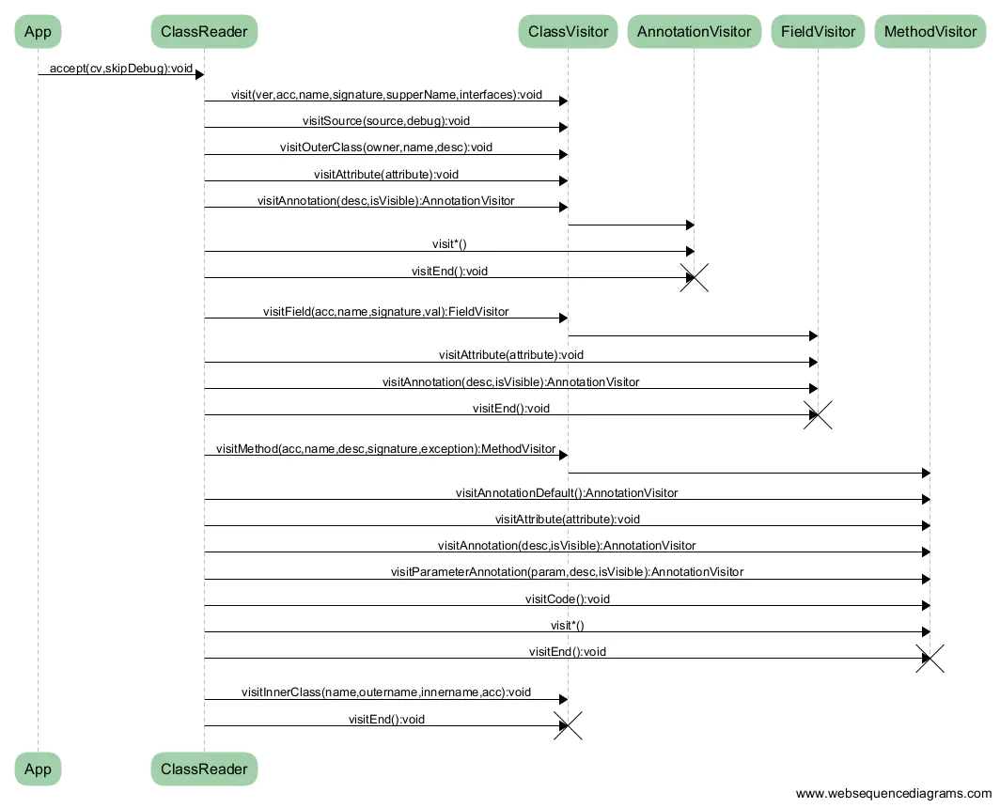
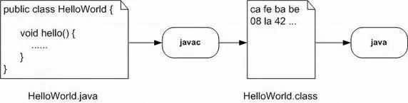
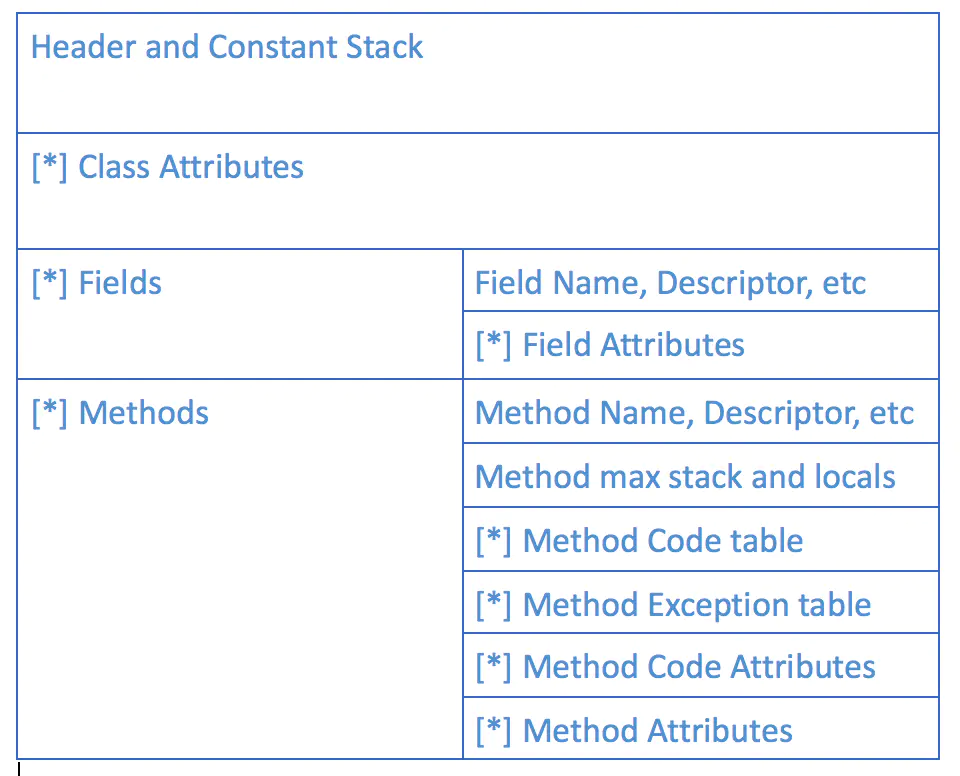
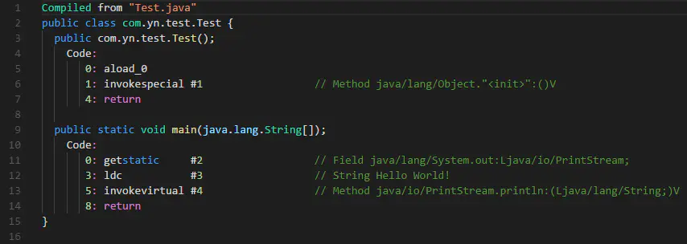

# ASM 简介

## 1. [ASM](https://links.jianshu.com/go?to=http%3A%2F%2Fasm.ow2.org%2F) 简介

> [ASM](https://links.jianshu.com/go?to=http%3A%2F%2Fasm.ow2.org%2F) 是一个 Java 字节码操控框架。它能被用来动态生成类或者增强既有类的功能。ASM 可以直接产生二进制 class 文件，也可以在类被加载入 Java 虚拟机之前动态改变类行为。Java class 被存储在严格格式定义的 .class 文件里，这些类文件拥有足够的元数据来解析类中的所有元素：类名称、方法、属性以及 Java 字节码（指令）。ASM 从类文件中读入信息后，能够改变类行为，分析类信息，甚至能够根据用户要求生成新类。

简单的说，[ASM](https://links.jianshu.com/go?to=http%3A%2F%2Fasm.ow2.org%2F) 可以读取解析`class`文件内容，并提供接口让你可以对`class`文件字节码内容进行CRUD操作······

**注:** `class`文件存储的是`java`字节码，[ASM](https://links.jianshu.com/go?to=http%3A%2F%2Fasm.ow2.org%2F) 是对`java`字节码操作的一层封装，因此，如果你很了解 `class`文件格式的话，你甚至可以通过直接使用文本编辑器（eg:Vim）来改写`class`文件。

知道了 [ASM](https://links.jianshu.com/go?to=http%3A%2F%2Fasm.ow2.org%2F) 的作用后，接下来我们就来看下 [ASM](https://links.jianshu.com/go?to=http%3A%2F%2Fasm.ow2.org%2F) 的执行模式，了解它的执行模式后，我们才能更好地使用。

## 2. [ASM](https://links.jianshu.com/go?to=http%3A%2F%2Fasm.ow2.org%2F) 框架执行流程

[ASM](https://links.jianshu.com/go?to=http%3A%2F%2Fasm.ow2.org%2F) 提供了两组API：Core和Tree：

- Core是基于访问者模式来操作类的
- Tree是基于树节点来操作类的

**本文我们主要讨论的是 [ASM](https://links.jianshu.com/go?to=http%3A%2F%2Fasm.ow2.org%2F) 的 CoreAPI。**

[ASM](https://links.jianshu.com/go?to=http%3A%2F%2Fasm.ow2.org%2F) 内部采用 **访问者模式** 将 `.class` 类文件的内容从头到尾扫描一遍，每次扫描到类文件相应的内容时，都会调用`ClassVisitor`内部相应的方法。
 比如：

- 扫描到类文件时，会回调`ClassVisitor`的`visit()`方法；
- 扫描到类注解时，会回调`ClassVisitor`的`visitAnnotation()`方法；
- 扫描到类成员时，会回调`ClassVisitor`的`visitField()`方法；
- 扫描到类方法时，会回调`ClassVisitor`的`visitMethod()`方法；
   ······
   扫描到相应结构内容时，会回调相应方法，该方法会返回一个对应的字节码操作对象（比如，`visitMethod()`返回`MethodVisitor`实例），通过修改这个对象，就可以修改`class`文件相应结构部分内容，最后将这个`ClassVisitor`字节码内容覆盖原来`.class`文件就实现了类文件的代码切入。

具体关系如下：

|  树形关系  |    使用的接口     |
| :--------: | :---------------: |
|   Class    |   ClassVisitor    |
|   Field    |   FieldVisitor    |
|   Method   |   MethodVisitor   |
| Annotation | AnnotationVisitor |

整个具体的执行时序如下图所示：



通过时序图可以看出[ASM](https://links.jianshu.com/go?to=http%3A%2F%2Fasm.ow2.org%2F)在处理`class`文件的整个过程。[ASM](https://links.jianshu.com/go?to=http%3A%2F%2Fasm.ow2.org%2F)通过树这种数据结构来表示复杂的字节码结构，并利用 **Push模型** 来对树进行遍历。

- [ASM](https://links.jianshu.com/go?to=http%3A%2F%2Fasm.ow2.org%2F) 中提供一个`ClassReader`类，这个类可以直接由字节数组或者`class`文件间接的获得字节码数据。它会调用`accept()`方法，接受一个实现了抽象类`ClassVisitor`的对象实例作为参数，然后依次调用`ClassVisitor`的各个方法。字节码空间上的偏移被转成各种`visitXXX`方法。使用者只需要在对应的的方法上进行需求操作即可，无需考虑字节偏移。
- 这个过程中`ClassReader`可以看作是一个事件生产者，`ClassWriter`继承自`ClassVisitor`抽象类，负责将对象化的class文件内容重构成一个二进制格式的`class`字节码文件，`ClassWriter`可以看作是一个事件的消费者。

至此，相信读者已经对 [ASM](https://links.jianshu.com/go?to=http%3A%2F%2Fasm.ow2.org%2F) 框架的执行过程有一定了解了。接下来我们还剩的一点内容就是如何实现`class`文件字节码的修改。

## 3. [ASM](https://links.jianshu.com/go?to=http%3A%2F%2Fasm.ow2.org%2F) 字节码修改

由于 [ASM](https://links.jianshu.com/go?to=http%3A%2F%2Fasm.ow2.org%2F) 是直接对`class`文件的字节码进行操作，因此，要修改`class`文件内容时，也要注入相应的`java`字节码。

所以，在注入字节码之前，我们还需要了解下`class`文件的结构，JVM指令等知识。

### 3.1 `class`文件结构
    `Java`源文件经过`javac`编译器编译之后，将会生成对应的二进制`.class`文件，如下图所示：



ASM – Javac 流程

`Java`类文件是 8 位字节的二进制流。数据项按顺序存储在`class`文件中，相邻的项之间没有间隔，这使得`class`文件变得紧凑，减少存储空间。在`Java`类文件中包含了许多大小不同的项，由于每一项的结构都有严格规定，这使得 class 文件能够从头到尾被顺利地解析。

每个`class`文件都是有固定的结构信息，而且保留了源码文件中的符号。下图是`class`文件的格式图。其中带 * 号的表示可重复的结构。



class文件结构图

- 类结构体中所有的修饰符、字符常量和其他常量都被存储在class文件开始的一个常量堆栈(Constant Stack)中，其他结构体通过索引引用。
- 每个类必须包含headers（包括：class name, super class, interface, etc.）和常量堆栈（Constant Stack）其他元素，例如：字段（fields）、方法（methods）和全部属性（attributes）可以选择显示或者不显示。
- 每个字段块（Field section）包括名称、修饰符（public, private, etc.）、描述符号(descriptor)和字段属性。
- 每个方法区域（Method section）里面的信息与header部分的信息类似，信息关于最大堆栈（max stack）和最大本地变量数量（max local variable numbers）被用于修改字节码。对于非abstract和非native的方法有一个方法指令表，exceptions表和代码属性表。除此之外，还可以有其他方法属性。
- 每个类、字段、方法和方法代码的属性有属于自己的名称记录在类文件格式的JVM规范的部分，这些属性展示了字节码多方面的信息，例如源文件名、内部类、签名、代码行数、本地变量表和注释。JVM规范允许定义自定义属性，这些属性会被标准的VM（虚拟机）忽略，但是可以包含附件信息。
- 方法代码表包含一系列对java虚拟机的指令。有些指令在代码中使用偏移量，当指令从方法代码被插入或者移除时，全部偏移量的值可能需要调整。

### 3.2 `Java`类型与`class`文件内部类型对应关系
    `Java`类型分为基本类型和引用类型，在 JVM 中对每一种类型都有与之相对应的类型描述，如下表：

| Java type  | JVM Type descriptor  |
| :--------: | :------------------: |
|  boolean   |          Z           |
|    char    |          C           |
|    byte    |          B           |
|   short    |          S           |
|    int     |          I           |
|   float    |          F           |
|    long    |          J           |
|   double   |          D           |
|   Object   |  Ljava/lang/Object;  |
|   int[]    |          [I          |
| Object[][] | [[Ljava/lang/Object; |

在 [ASM](https://links.jianshu.com/go?to=http%3A%2F%2Fasm.ow2.org%2F) 中要获得一个类的 JVM 内部描述，可以使用`org.objectweb.asm.Type`类中的`getDescriptor(final Class c)`方法，如下：


```java
public class TypeDescriptors {    
    public static void main(String[] args) {    
        System.out.println(Type.getDescriptor(TypeDescriptors.class));    
        System.out.println(Type.getDescriptor(String.class));    
    }        
}
```

运行结果：


```dart
Lorg/victorzhzh/core/structure/TypeDescriptors;    
Ljava/lang/String;    
```

### 3.3 `Java`方法声明与`class`文件内部声明的对应关系
    在·Java·的二进制文件中，方法的方法名和方法的描述都是存储在Constant pool 中的，且在两个不同的单元里。因此，方法描述中不含有方法名，只含有参数类型和返回类型。

格式：(参数描述符)返回值描述符

| Method declaration in source file |    Method descriptor    |
| :-------------------------------: | :---------------------: |
|      void m(int i, float f)       |          (IF)V          |
|          int m(Object o)          |  (Ljava/lang/Object;)I  |
|     int[] m(int i, String s)      | (ILjava/lang/String;)[I |
|         Object m(int[] i)         | ([I]Ljava/lang/Object;  |
|            String m()             |  ()Ljava/lang/String;   |

### 3.4 JVM 指令

假设现在我们有如下一个类：

```java
package com.yn.test;
public class Test {
    public static void main(String[] agrs){
        System.out.println("Hello World!");
    }
}
```

我们先用`javac com/yn/test/Test.java`编译得到`Test.class`文件，然后再使用`javap -c com/yn/test/Test`来查看下这个`Test.class`文件的字节码，结果如下图所示：



1. 上图中第3行到第7行，是类`Test`的默认构造函数（由编译器默认生成），`Code`以下部分是构造函数内部代码，其中：

	* **aload_0**：  这个指令是LOAD系列指令中的一个，它的意思表示装载当前第 0 个元素到堆栈中。代码上相当于“this”。而这个数据元素的类型是一个引用类型。这些指令包含了：ALOAD，ILOAD，LLOAD，FLOAD，DLOAD。区分它们的作用就是针对不用数据类型而准备的LOAD指令，此外还有专门负责处理数组的指令 SALOAD。
	* **invokespecial**： 这个指令是调用系列指令中的一个。其目的是调用对象类的方法。后面需要给上父类的方法完整签名。“#1”的意思是 .class 文件常量表中第1个元素。值为：“java/lang/Object."<init>":()V”。结合ALOAD_0。这两个指令可以翻译为：“super()”。其含义是调用自己的父类构造方法。

2. 第9到14行是`main`方法，`Code`以下是其字节码表示：

	*	**getstatic**：   这个指令是GET系列指令中的一个其作用是获取静态字段内容到堆栈中。这一系列指令包括了：GETFIELD、GETSTATIC。它们分别用于获取动态字段和静态字段。此处表示的意思获取静态成员`System.out`到堆栈中。
	* **ldc**：这个指令的功能是从常量表中装载一个数据到堆栈中。此处表示从常量池中获取字符串"Hello World!"。
	* **invokevirtual**：也是一种调用指令，这个指令区别与 invokespecial 的是它是根据引用调用对象类的方法。此处表示调用`java.io.PrintStream.println(String)`方法，结合前面的操作，这里调用的就是`System.out.println("Hello World!")`。
	* **return**： 这也是一系列指令中的一个，其目的是方法调用完毕返回：可用的其他指令有：IRETURN，DRETURN，ARETURN等，用于表示不同类型参数的返回。

更多详细内容，请参考：[JVM字节码指令理解](https://links.jianshu.com/go?to=http%3A%2F%2Fkingj.iteye.com%2Fblog%2F1451008)，[JVM指令](https://www.jianshu.com/p/9f09a0c21542)，[深入字节码 -- 使用 ASM 实现 AOP](https://links.jianshu.com/go?to=https%3A%2F%2Fmy.oschina.net%2Fu%2F1166271%2Fblog%2F162796)
 更多字节码指令详情，请参考官网：[The Java Virtual Machine Instruction Set](https://links.jianshu.com/go?to=https%3A%2F%2Fdocs.oracle.com%2Fjavase%2Fspecs%2Fjvms%2Fse7%2Fhtml%2Fjvms-6.html%23jvms-6.5.aaload)

接下来，我们就可以根据上面所讲的内容，将代码字节码注入到`class`文件中了。

现在假设我们想要在类`Test`的`main`方法前后动态插入代码，如下所示：

```java
package com.yn.test;
public class Test {
    public static void main(String[] agrs){
        System.out.println("asm insert before");
        System.out.println("Hello World!");
        System.out.println("asm insert after");
    }
}
```

要完成在`main`方法前后插入输出代码，需要以下几步操作：

1. **读取`Test.class`文件，可以通过 [ASM](https://links.jianshu.com/go?to=http%3A%2F%2Fasm.ow2.org%2F) 提供的`ClassReader`类进行`class`文件的读取与遍历。**
```java
// 使用全限定名，创建一个ClassReader对象
ClassReader classReader = new ClassReader("com.yn.test.Test");

// 构建一个ClassWriter对象，并设置让系统自动计算栈和本地变量大小
ClassWriter classWriter = new ClassWriter(ClassWriter.COMPUTE_MAXS);

//创建一个自定义ClassVisitor，方便后续ClassReader的遍历通知
ClassVisitor classVisitor = new TestClassVisitor(classWriter);

//开始扫描class文件
classReader.accept(classVisitor, ClassReader.SKIP_DEBUG);
```

2. **构造`System.out.println(String)`的 [ASM](https://links.jianshu.com/go?to=http%3A%2F%2Fasm.ow2.org%2F) 代码。**

	上面我们从`javap`反编译得到的字节码可以知道，实现`System.out.println("Hello World!");`的字节码总共需要3步操作：

	(1). 获取`System`静态成员`out`，其对应的指令为`getstatic`，对应的 [ASM](https://links.jianshu.com/go?to=http%3A%2F%2Fasm.ow2.org%2F) 代码为：
  ```kotlin
  mv.visitFieldInsn(Opcodes.GETSTATIC,
                    Type.getInternalName(System.class), //"java/lang/System"
                    "out",
                    Type.getDescriptor(PrintStream.class) //"Ljava/io/PrintStream;"
              );
  ```

	(2). 获取字符串常量"Hello World!"，其对应的指令为`ldc`，对应的 [ASM](https://links.jianshu.com/go?to=http%3A%2F%2Fasm.ow2.org%2F) 代码为：
  ```bash
  mv.visitLdcInsn("Hello World!");
  ```

	(3). 获取`PrintStream.println(String)`方法，其对应的指令为`invokervirtual`，对应的 [ASM](https://links.jianshu.com/go?to=http%3A%2F%2Fasm.ow2.org%2F) 代码为：
  ```kotlin
  mv.visitMethodInsn(Opcodes.INVOKEVIRTUAL,
                     Type.getInternalName(PrintStream.class), //"java/io/PrintStream"
                     "println",
                     "(Ljava/lang/String;)V",//方法描述符
                     false);
  ```

3.  **在`main`方法进入前，进行代码插入，可以通过`MethodVisitor.visitCode()`方法。**
```java
// 在源方法前去修改方法内容,这部分的修改将加载源方法的字节码之前
@Override
public void visitCode() {
mv.visitCode();
System.out.println("method start to insert code");
sop("asm insert before");//this is the insert code
}
```

4. **在`main`方法退出前，进行代码插入，可以通关过`MethodVisitor.visitInsn()`方法，通过判断当前的指令为`return`时，表明即将执行`return`语句，此时插入字节码即可。**
```java
@Override
public void visitInsn(int opcode) {
    //检测到return语句
    if (opcode == Opcodes.RETURN) {
        System.out.println("method end to insert code");
        sop("asm insert after");
    }
        //执行原本语句
        mv.visitInsn(opcode);
  }
```

5. **字节码插入`class`文件成功后，导出字节码到原文件中。**
```java
//获取改写后的class二进制字节码
byte[] classFile = classWriter.toByteArray();
// 将这个类输出到原先的类文件目录下，这是原先的类文件已经被修改
File file = new File("E:/code/Android/Projects/AsmButterknife/sample-java/build/classes/java/main/com/yn/test/Test.class");
FileOutputStream fos = new FileOutputStream(file);
fos.write(classFile);
fos.close();
```

至此，我们已经完成了对`Test.class`的代码注入。
 详细代码请参见：[AsmTest](https://links.jianshu.com/go?to=https%3A%2F%2Fgithub.com%2FWhy8n%2FAsmButterknife%2Fblob%2Fmaster%2Fsample-java%2Fsrc%2Fmain%2Fjava%2Fcom%2Fyn%2Ftest%2FAsmTest.java)

**注:** [asm-commons](https://links.jianshu.com/go?to=http%3A%2F%2Fsearch.maven.org%2F%23search%7Cga%7C1%7Ca%3A%22asm-commons%22) 包中提供了一个类`AdviceAdapter`，使用该类可以更加方便的让我们在方法前后注入代码，因为其提供了方法`onMethodEnter()`和`onMethodExit()`。

通过上面介绍的内容，我们已经成功使用 [ASM](https://links.jianshu.com/go?to=http%3A%2F%2Fasm.ow2.org%2F) 动态注入字节码到`class`文件中。但是如果直接采用 [ASM](https://links.jianshu.com/go?to=http%3A%2F%2Fasm.ow2.org%2F) 代码注入字节码，还是相对困难的，幸运的是 [ASM](https://links.jianshu.com/go?to=http%3A%2F%2Fasm.ow2.org%2F) 给我们提供了 [ASMifier](https://links.jianshu.com/go?to=http%3A%2F%2Fasm.ow2.org%2Fdoc%2Ffaq.html%23Q10) 工具，使得我们可以直接通过`.class`文件反编译为 [ASM](https://links.jianshu.com/go?to=http%3A%2F%2Fasm.ow2.org%2F) 代码。

因此，当我们要使用 [ASM](https://links.jianshu.com/go?to=http%3A%2F%2Fasm.ow2.org%2F) 框架往`class`文件注入字节码时，我们通常是将要注入的`java`源码先写出来，然后通过`javac`编译出目标`.class`文件，然后再通过 [ASMifier](https://links.jianshu.com/go?to=http%3A%2F%2Fasm.ow2.org%2Fdoc%2Ffaq.html%23Q10) 工具反编译该`.class`文件，得到所需的 [ASM](https://links.jianshu.com/go?to=http%3A%2F%2Fasm.ow2.org%2F) 注入代码。

[ASMifier](https://links.jianshu.com/go?to=http%3A%2F%2Fasm.ow2.org%2Fdoc%2Ffaq.html%23Q10) 存在于`asm-util.jar`中，同时需要依赖`asm.jar`，幸运的是 [ASM](https://links.jianshu.com/go?to=http%3A%2F%2Fasm.ow2.org%2F) 提供了一个`asm-all.jar`包，可以方便我们直接运行 [ASMifier](https://links.jianshu.com/go?to=http%3A%2F%2Fasm.ow2.org%2Fdoc%2Ffaq.html%23Q10)。

`asm-all.jar`下载地址：[asm-all](https://links.jianshu.com/go?to=http%3A%2F%2Fcentral.maven.org%2Fmaven2%2Forg%2Fow2%2Fasm%2Fasm-all%2F)

运行命令如下：

```shell
java -classpath "asm-all.jar" org.objectweb.asm.util.ASMifier org/domain/package/YourClass.class
```

## 参考
摘自 https://www.jianshu.com/p/a85e8f83fa14