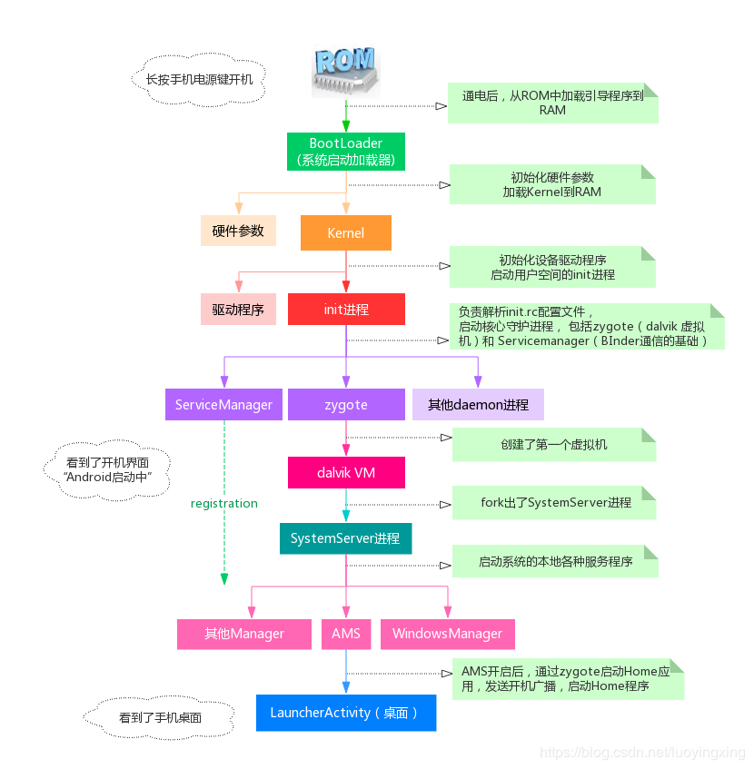
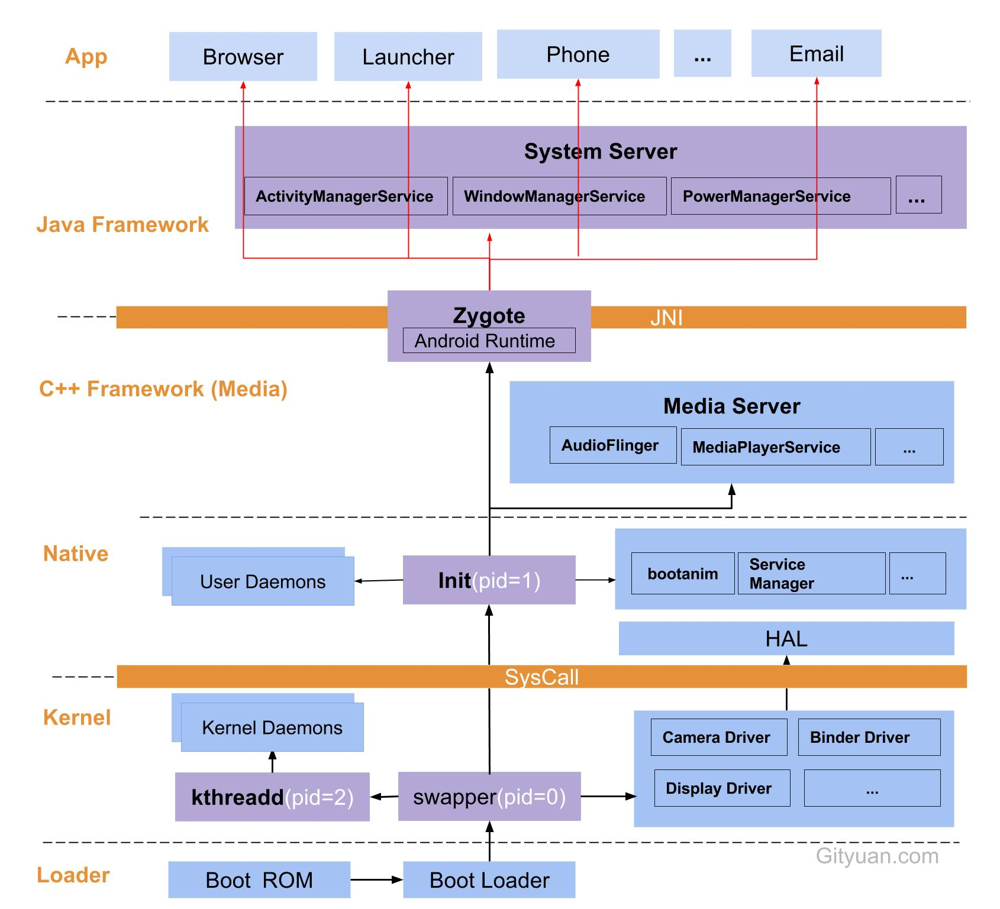

##  Android开机流程

1. 板子上电后运行固化在 ROM 中的代码，加载 Bootloader 到 RAM。

2. Bootloader 启动，引导进入 Linux 内核。

3. Kernel 启动 swapper 进程。即 idle 进程，pid = 0，系统初始化过程中的第一个进程，用于初始化 进程管理、内存管理、加载 Display、Camera Driver、Binder Driver 的工作。 
   Kernel 启动 init 进程（用户进程的祖宗）。pid = 1，用来孵化用户空间的守护进程、HAL、开机动画等。 
   Kernel 启动 threadd 进程（内核进程的祖宗）。pid = 2，创建内核工程线程 kworkder，软中断线程等。

4. init 进程 fork 出 Daemon 进程：孵化出ueventd、logd、healthd、installd、adbd、lmkd 等用户守护进程； 
   init 进程启动servicemanager(binder服务管家)、bootanim(开机动画)等重要服务; 
   init 进程孵化出Zygote进程，Zygote进程是Android系统的第一个Java进程，Zygote是所有Java进程的父进程（Android 应用程序的祖宗），Zygote进程本身是由 init 进程孵化而来的。

   	> 每当系统要求执行一个Android应用程序，Zygote就会FORK出一个子进程来执行该应用程序。这样做的好处显而易见：Zygote进程是在系统启动时产生的，它会完成虚拟机的初始化，库的加载，预置类库的加载和初始化等等操作，而在系统需要一个新的虚拟机实例时，Zygote通过复制自身，最快速的提供个系统。另外，对于一些只读的系统库，所有虚拟机实例都和Zygote共享一块内存区域，大大节省了内存开销。

5. Zygote 孵化出 System Server 和 App。 
   System Server 它是 Android 系统的核心进程，提供了应用程序生命周期管理，地理位置信息等各种 Service（这些 Service 同样需要注册到 Context Manager）。
   

