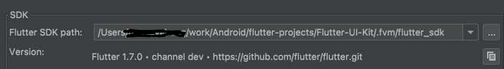

# 使用[fvm](https://github.com/fluttertools/fvm) 管理多个版本flutter

> 以下所有操作均在Mac上

## 1. 安装

```she
brew tap leoafarias/fvm
brew install fvm
```

## 2 . 配置 **FVM_HOME**（非必需）

fvm 默认缓存目录在`$HOME/fvm`, 可以通过环境变量`FVM_HOME`自定义，

编辑`~/.bash_profile`或者`~/.zshrc` ， 加入以下命令

```shell
export FVM_HOME= xxx
```

## 3. 安装所需版本

进入对应项目根目录，执行

```shell
fvm install
```

会自动安装项目所需版本

也可以执行`fvm install {version}` 安装特定版本的flutter

## 4. 配置项目

进入对应项目根目录，执行

```shell
# version 为上面安装的版本
fvm use {version}
```

FVM 将在项目中创建一个相对符号链接`.fvm/flutter_sdk`到所选版本的缓存

### 配置IDE

#### VS Code

在项目根目录创建`.vscode/settings.json`

```shell
{
  "dart.flutterSdkPath": ".fvm/flutter_sdk",
  // Remove .fvm files from search
  "search.exclude": {
    "**/.fvm": true
  },
  // Remove from file watching
  "files.watcherExclude": {
    "**/.fvm": true
  }
}
```

#### Android Studio

Preferences ->Languages & Frameworks > Flutter, 修改sdk 路径 `/absolute-project-path/.fvm/flutter_sdk`



## 5. 运行

* IDE：通过正常快捷键或运行按钮运行即可
* 命令行
  ```shell
  # 使用
  > fvm flutter {command}
  # 代替
  > flutter {command}
  
  # 使用
  > fvm dart {command}
  # 代替
  > dart {command}
  ```


## 6. 其他

*  查看支持的flutter版本

```shell
fvm releases
```
会输出如下版本信息
```shell
Apr 13 22  │ 2.13.0-0.1.pre
Apr 18 22  │ 2.10.5
Apr 20 22  │ 2.13.0-0.2.pre
Apr 27 22  │ 2.13.0-0.3.pre
May 5 22   │ 2.13.0-0.4.pre
May 11 22  │ 3.0.0
May 20 22  │ 3.0.1
May 26 22  │ 3.1.0
Jun 10 22  │ 3.0.2
Jun 15 22  │ 3.1.0-9.0.pre
Jun 22 22  │ 3.0.3
Jul 1 22   │ 3.0.4
Jul 13 22  │ 3.0.5
Jul 20 22  │ 3.3.0-0.0.pre
Jul 27 22  │ 3.3.0-0.1.pre
Aug 3 22   │ 3.3.0-0.2.pre
Aug 10 22  │ 3.3.0-0.3.pre
Aug 20 22  │ 3.3.0-0.4.pre
--------------------------------------
Aug 23 22  │ 3.3.0-0.5.pre     beta
--------------------------------------
--------------------------------------
Aug 30 22  │ 3.3.0             stable
```

* 查看已经安装的版本

```shell
fvm list
```

* 全局配置

```she
fvm global {version}
```

这时通过`flutter` 命令执行的就是指定的版本 
