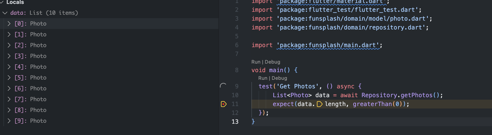
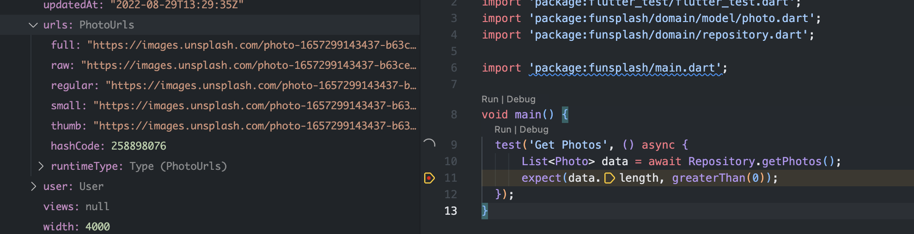

# Flutter 现学现用 之unsplash客户端实战（二）

## unsplash api注册

在https://unsplash.com/developers注册app，获取Access Key和Secret key


https://unsplash.com/documentation api 文档

## 前置知识

### 网络请求

在 Flutter 中，Http 网络编程的实现方式主要分为三种：`dart:io 里的 HttpClient 实现`、`Dart 原生 http 请求库实现`、`第三方库 dio 实现`。
HttpClient 和 http 使用方式虽然简单，但其暴露的定制化能力都相对较弱，很多常用的功能都不支持（或者实现异常繁琐），比如取消请求、定制拦截器、Cookie 管理等。因此对于复杂的网络请求行为，我推荐使用目前在 Dart 社区人气较高的第三方 dio 来发起网络请求。
https://pub.dev/packages/dio

### 依赖管理

Dart 提供了包管理工具 Pub，用来管理代码和资源。从本质上说，包（package）实际上就是一个包含了 pubspec.yaml 文件的目录，其内部可以包含代码、资源、脚本、测试和文档等文件。包中包含了需要被外部依赖的功能抽象，也可以依赖其他包。与 Android 中的 JCenter/Maven、iOS 中的 CocoaPods、前端中的 npm 库类似，Dart 提供了官方的包仓库 Pub。通过 Pub，我们可以很方便地查找到有用的第三方包。

在 Dart 中，库和应用都属于包。pubspec.yaml 是包的配置文件，包含了包的元数据（比如，包的名称和版本）、运行环境（也就是 Dart SDK 与 Fluter SDK 版本）、外部依赖、内部配置（比如，资源管理）。	

```dart
name: funsplash #应用名称
description: A unsplash client project. #应用描述
https://developer.apple.com/library/archive/documentation/General/Reference/InfoPlistKeyReference/Articles/CoreFoundationKeys.html
#应用版本及构建number
version: 1.0.0+1
#Dart运行环境区间
environment:
  sdk: ">=2.17.6 <3.0.0"
#Flutter依赖库    
dependencies:
  flutter:
    sdk: flutter
  dio: ^4.0.6  
```

~~运行环境和依赖库 cupertino_icons 冒号后面的部分是版本约束信息，由一组空格分隔的版本描述组成，可以支持指定版本、版本号区间，以及任意版本这三种版本约束方式。比如上面的例子中，cupertino_icons 引用了大于 0.1.1 的版本。需要注意的是，由于元数据与名称使用空格分隔，因此版本号中不能出现空格；同时又由于大于符号“>”也是 YAML 语法中的折叠换行符号，因此在指定版本范围的时候，必须使用引号， 比如">=2.1.0 < 3.0.0"。~~


对于包，我们通常是指定版本区间，而很少直接指定特定版本，因为包升级变化很频繁，如果有其他的包直接或间接依赖这个包的其他版本时，就会经常发生冲突。而对于运行环境，如果是团队多人协作的工程，建议将 Dart 与 Flutter 的 SDK 环境写死，统一团队的开发环境，避免因为跨 SDK 版本出现的 API 差异进而导致工程问题。

### 异步编程

异步编程常用于网络请求、缓存数据加载、本地File图片加载、定时与延时任务等，在Flutter开发中 ，使用async开启一个异步开始处理，使用await来等待处理结果，如处理一个网络请求，代码如下：

```js
  //代码清单 1-1
  //HTTP的get请求返回值为Future<String>类型，即其返回值未来是一个String类型的值
  //async关键字声明该函数内部有代码需要延迟执行
  Future<String> getData() async {    
    //await关键字声明运算为延迟执行，然后return运算结果
    return await http.get(Uri.encodeFull(url), headers: {"Accept": "application/json"});
  }
```

或者可以这样来写：

```js
  //代码清单 1-2 
  Future<String> getData() async {    
    //await关键字声明运算为延迟执行，然后return运算结果
    //异步执行 1-2-1
    String  result = await http.get(Uri.encodeFull(url1), headers: {"Accept": "application/json"});
     //异步执行 1-2-2
    String result2 = await http.get(Uri.encodeFull(url2), headers: {"Accept": "application/json"});
    return 
  }
```

在代码清单1-2中执行了两个异步任务，这两个异步任务是串行的，也就是异步 1-2-1 执行完毕后，获取到结果 result ，然后再开启异步执行 1-2-2，在实际项目可应用于使用第一个网络请求的结果来动态加载第二个网络请求或者是其他分类别的异步任务，代码清单1-2也可以拆分成如下代码清单1-3中的写法

```js
  //代码清单 1-3
  Future<String> getData() async {    
    //await关键字声明运算为延迟执行，然后return运算结果
    //异步执行 1-2-1
    String  result = await getDataA();
    String result2 = await getDataB();
    return  Future.value(result2);
  }
 Future<String> getDataA() async {    
    //await关键字声明运算为延迟执行，然后return运算结果
    return await http.get(Uri.encodeFull(url1), headers: {"Accept": "application/json"});
  }
    Future<String> getDataB() async {    
    //await关键字声明运算为延迟执行，然后return运算结果
    return await http.get(Uri.encodeFull(url1), headers: {"Accept": "application/json"});
  }
```

然后对于代码清单1-3中异步处理getDataA()与getDataB()可以分别加入异常捕捉机制（如下代码清单1-4），以确保在异步处理之间不会相互影响，如在在这的异步处理getDataA()与getDataB(),如果getDataA()方法出现了异常，在Flutter中就会直接报错，而不再执行异步处理getDataB()。

```js
//代码清单 1-4
  Future<String> getDataA() async {
    String result = "";
    try {
      return  await http.get(Uri.encodeFull(url1), headers: {"Accept": "application/json"});
    } catch (e) {
      result = "出现异常";
    } finally {
      return Future.value(result);
    }
  }
    Future<String> getDataB() async {    
      String result = "";
	    try {
	      return  await http.get(Uri.encodeFull(url2), headers: {"Accept": "application/json"});
	    } catch (e) {
	      result = "出现异常";
	    } finally {
	      return Future.value(result);
	    }
  }
```

串行调用 两个异步任务的一般写法如下代码清单1-5中所示

```js
///代码清单 1-5
void test() async{
   await getDataA();
   await getDataB();
}
```

也可以用另一种方式来写如下代码清单1-6

```js
///代码清单 1-6
  void test() async {
    getDataA().then((value1) {
      ///值value1就是getDataA中返回的结果
      getDataB().then((value2) {
        ///值value2就是getDataB中返回的结果
      });
    });
  }
```


## 实践

我们首先需要把 dio 加到 pubspec 中的依赖里：

```dart

dependencies:
  dio: ^4.0.6 
```


我们对dio api简单封装下：

```dart
class Http {
  late Dio _dio;
  factory Http() => _instance;

  static final Http _instance = Http._internal();
  
  Http._internal() {
    BaseOptions options = BaseOptions(
      baseUrl: Constants.BASE_URL,
      connectTimeout: 5000,
      receiveTimeout: 3000,
      contentType: Headers.jsonContentType,
      headers: {
        "Authorization": "Client-ID ${Constants.ACCESS_KEY}",
      },
    );
    _dio = Dio(options);
  }

  Future<Response> get(String url, {Map<String, dynamic>? queryParameters}) async {
   return await _dio.get(url, queryParameters: queryParameters);
  }
}
```

获取图片列表

```dart
class Repository {
  static Future<List<Photo>> getPhotos() async {
    Response response = await Http().get(Constants.GET_PHOTO);
    if (response.statusCode == 200) {
      return Future.value(
        List.from(response.data).map((photo) => Photo.fromMap(photo)).toList(),
      );
    } else {
      throw Exception('Failed to load post');
    }
  }
}
```

返回数据转换成数据对象

```dart
factory Photo.fromMap(Map data) {
    return Photo(
      id: data['id'],
      createdAt: data['created_at'],
      updatedAt: data['updated_at'],
      promotedAt: data['promoted_at'],
      width: data['width'],
      height: data['height'],
      color: data['color'],
      description: data['description'],
      alternativeDescription: data['alternative_description'],
      urls: PhotoUrls.fromMap(data['urls']),
      links: PhotoLink.fromMap(data['links']),
      categories: data['categories'],
      likes: data['likes'],
      likedByUser: data['liked_by_user'],
      currentUserCollections: data['current_user_collections'],
      user: User.fromMap(data['user']),
      exif: PhotoExif.fromMap(data['exif']),
      location: PhotoLocation.fromMap(data['location']),
      tags: data['tags'].runtimeType == 'List'
          ? List.from(data['tags']).map((tag) => PhotoTag.fromMap(tag)).toList()
          : null,
      sponsorship: data['sponsorship'],
      relatedCollections: data['related_collections'],
      views: data['views'],
      downloads: data['downloads'],
    );
  }
```


测试

http_test.dart

```dart

void main() {
  test('Get Photos', () async {
      List<Photo> data = await Repository.getPhotos();
      expect(data.length, greaterThan(0));
  });
}
```

运行通过，我们再断点看看解析结果，



