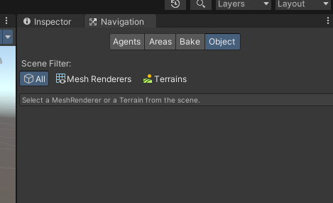
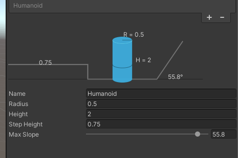
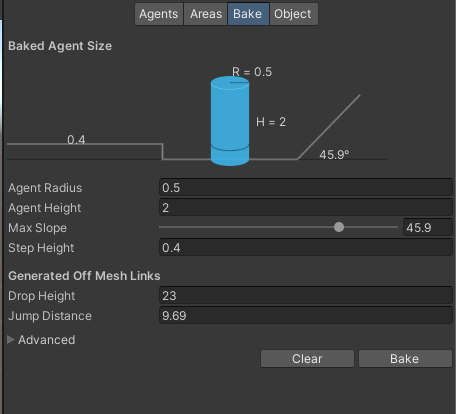
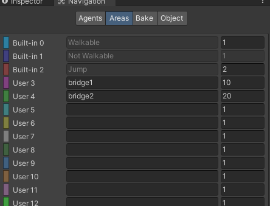
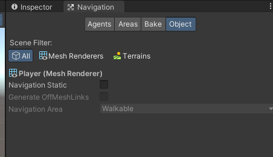
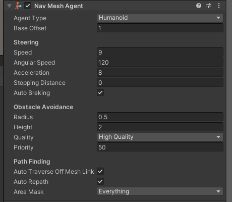

# [自动寻路和导航](https://docs.unity3d.com/cn/2021.1/Manual/Navigation.html)

## NavMesh 简介

NavMesh(导航网格)是3D游戏世界中用于实现动态物体自动寻路的一种技术，将游戏中复杂的结构组织关系简化为带有一定信息的网格，在这些网格的基础上通过一系列的计算来实现自动寻。。导航时，只需要给导航物体挂载导航组件，导航物体便会自行根据目标点来寻找最直接的路线，并沿着该线路到达目标点。

## Navigation面板

依次选择菜单栏中的Windows -AI- Navigation ，打开后面板如下。

### Agents

* **Name**：设置烘培Agents的名字

* **Radius**：烘培的半径，也就是物体的烘培的半径。这个值影响物体能通过的路径的大小

越小，能行走的路径越大，边缘区域越小

* **Height**：	具有代表性的物体的高度，可以通过的最低的空间高度。这个值越小，能通过的最小高度越小。打个比方就是，1m7的人能通过1m7的洞是正常的，你可以设置height为1m，就能通过1m的高度
* **Step Height** ：步行跨越高度
* **Max Slope**：最大坡度，表示能在多高的坡爬行

> 该组件在新版navmesh才生效，旧版直接使用bake组件处理

### **Bake**

  **前面的参数在旧版充当Agents作用**

* **Drop Height**：允许最大的下落距离。

* **Jump Distance**：允许最大的跳跃距离。

* **Min Region Area**：网格面积小于该值则不生成导航网格。

* **Height Mesh**：勾选后会保存高度信息，同时会消耗一些性能和存储空间。

### Areas

这个是可以设置自动寻路烘培的层

## **Object**

这个是设置去烘培哪个对象，比如地形之类的，就是可以行走的范围路径

* **Scene Filter**: 选择场景中那些对象，可以选择全部(All)，地形(Terrains),有网格对象(Mesh Renderers)

* **Navigation Static**:可以烘培

* **Generate OffMeshLinks**：可以跳跃的地方
* **Navigation Area**：表示是哪个Area，这个需要先设置，系统默认是Walkble、Jump、NotWalkble三种

## NavMeshAgent组件

* **Base Offset**

  偏移值

* **Speed**

  物体自动寻路的速度

* **Angular Speed**

  转角的速度，就是转弯的速度

* **Acceleration**

  加速度, 譬如从静止到运动

* **Stopping Distance**

  物体停下来的距离，设置为0就是跟目标点的距离为0(也就是目标点的中心点)时停下来

* **Auto Braking**

  物体行走过程中，改换方向时重新规划路径

* **Radius**

​		物体的半径

*  **Height**

​		物体的高度，如果AgentHeight的值大于这个值，那么就不能通过

* **Quality**

  如果要防止一群寻路的物体围住目标点

  可以设置Quality为None，即可以让寻路物体互相穿过

* **Priority**

  优先权

* **Auto Traverse Off Mesh Link**

  自动跳跃链接

* **Auto Repath**

  自动重新路径

* **Area Mask**

  能通过的Maks层，这个可以配合Navigation组件中Areas使用

