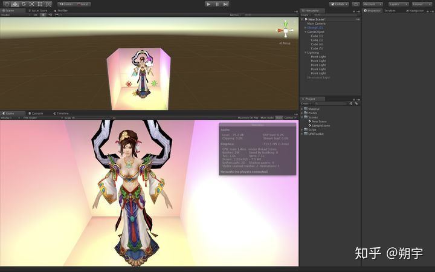

# Unity3D性能优化——渲染篇

## **渲染优化**

在了解优化渲染前，我们需要了解在unity中，每一帧的渲染CPU和GPU都做了些什么：

1）CPU检查场景中每个对象，决定他们是否应该被渲染。（这些对象只有满足一定的条件才会被渲染。）

2）CPU收集即将被渲染的对象信息，并把这些信息分类为渲染指令（也就是draw calls，我们在之前的文章中也有提到，Draw Call实际上就是一个命令）。一个draw call包含网格数据以及网格如何被渲染。在某些场景，共享设置的一些对象可能会被合并为一个draw call。合并不同对象的数据到同一个draw call被称作batching。

3）CPU给每个draw call创建一个数据包，称为batch。每一个batch必须包含一个draw call。

4）CPU会发出指令，使GPU改变一些渲染状态。这个指令被称为SetPass call。SetPass call通知GPU，如何去渲染下一个网格。只有在渲染下一个网格时，其渲染状态相对于渲染上一个网格发生了变化时，才会调用SetPass call。

5）CPU把draw call发送给GPU。draw call通知GPU使用最近的SetPass call去渲染指定的网格。

6）有时，batch可能需要不止一个的pass。pass是shader代码的一部分，而新的pass需要改变渲染状态。对于batch中的每个pass，CPU必须发送一个新的SetPass call然后必须要再次发送draw call。

7）GPU按照CPU发送的指令顺序处理这些指令。

8）如果当前任务是SetPass call，那么GPU更新渲染状态。

9）如果当前任务是draw call，那么GPU渲染网格。渲染网格发生在很多阶段，不同阶段的shader代码可以定义渲染。其中：顶点着色器vertex shader告诉GPU怎么处理网格的顶点。片元着色器fragment shader告诉GPU怎么绘制单独的像素。

10）以上过程会重复执行，直到所有CPU发送的任务都被GPU完成。

> 理解渲染最重要的是：为了渲染一帧，CPU和GPU必须都完成他们的任务。他们中的任何一个花费了过长的时间去完成任务，都会造成渲染延迟。渲染问题有两个基本的原因。第一类问题是由低效的渲染管线引起。当渲染管线中一步或者多步花费了太长时间，打断了平滑的数据流时，渲染管线会很低效。渲染管线的低效被称为瓶颈。第二类问题是由于，渲染管线被塞入了太多的数据。即使是最高效的渲染管线，对于一帧中可以处理的数据量也是有限制的。
>
> 渲染优化的主要目的就是**减少渲染的工作量**，控制渲染的工作量是保证效率的根本，而每帧渲染的顶点数量是衡量渲染工作量最直观的标准之一：
>
> 每帧可渲染的顶点数量主要取决于设备的CPU和GPU。 不过通常来说PC游戏每帧渲染的顶点个数不宜超过2M，移动游戏每帧渲染的顶点数量不宜超过0.1M。

------

## **CPU渲染优化**

- 了解CPU和GPU的渲染工作后，我们再来了解Unity中具体优化问题，当我们确定是性能问题是渲染所引起后，首先要确定是CPU限制还是GPU限制，不同的问题就需要不同的解决方案。

## **CPU限制**：

- 在渲染每一帧中CPU会完成三个任务：确定绘制的物体 —> 为GPU准备命令 —> 发送命令给GPU。

- 这些任务通过多线程完成。多线程允许不同的任务同时执行；当一个线程执行一个任务时，另一个线程可以同时执行其他任务。这意味着工作能够更快的完成。当渲染任务被分发到不同的线程时，称为多线程渲染。

- Unity渲染过程中和三类线程相关：主线程，渲染线程和工作线程。主线程用于我们游戏的主要CPU任务，包括一些渲染任务。渲染进程是专门用于发送命令给GPU的。每个工作线程执行一个单独的任务，例如剔除和网格蒙皮。哪些任务执行在哪个线程，取决于我们游戏运行的硬件和游戏的设置。例如，CPU的核心数量越多，就会生成越多的工作线程数。因此，在我们的目标硬件上进行性能分析是十分重要的。在不同的设备上，我们项目的表现可能相差很多。

- 由于多线程渲染非常复杂并且依赖硬件，在我们尝试改进性能时，必须首先找到是哪些任务导致了CPU问题（可以通过Profiler来检查）。如果我们的游戏运行缓慢是因为在一个线程上剔除操作花费了太长的时间，那如果我们在另一个线程上降低发送给GPU命令的时间是不会有什么帮助的。

- 发送命令到GPU花费时间过长是引起CPU限制的最常见的原因，其最耗时的操作是SetPass call。如果CPU限制是由发送命令到GPU引起的，那么降低SetPass的数量通常是最好的改善性能的方式。我们可以在Statistics窗口中观察到其数量，如下图所示：

- 降低SetPass call和batches数量，我们通常可以从以下几个方面来进行：
- 减少要渲染的对象数量，通常可以同时降低SetPass call和batches的数量。
- 减少每个要渲染的对象的渲染次数，通常可以降低SetPass call
- 合并要渲染的对象的数据，可以降低batches数量不同的技术适用于不同的项目，我们在项目开发中因该从项目本身需求出发来选择最合适的方法。

我们下面列举以上几个方面具体的优化方法及技术

## **减少要渲染的对象数量**

**1**.**手动减少场景中物体的数量**

这是一个最直观且有效的方法，比如在多人游戏中，我们可以减少可见玩家的数量，如果不影响游戏性和玩家体验，那这是就是一个即方便又快捷的方法。

**2.Occlusion Culling（遮挡剔除）**

遮挡剔除的原理就是当一个物体被其他物体遮挡住，不在摄像机的可视范围内时不对其进行渲染。具体方法如下所示：
把所有物体选中，Inspector面板中的static下拉菜单中勾选Occlusion Static 和 Occludee Static。

在Window中选择Occlusion Culling。

然后在Occlusion Culling面板中选择Bake，并点击右下角Bake按钮

在bake后，我们可以对比遮挡剔除前后的差别
(遮挡剔除前)

(遮挡剔除后)

可以看到，在场景中被遮挡部分并没有被渲染。

- 在Occlusion bake中有三个参数：
  Smallest Occluder：设置最小遮挡物的尺寸，当遮挡物的长度或者宽大于设定值时，该物体才能够遮挡住后面的物体。
  Smallest Hole：设置最小孔的尺寸，当穿过物体内部的孔或者多个物体堆叠形成的孔的大小小于设定的值时，遮挡剔除烘焙将忽略该孔的存在。
  Backface Threshold：设置背面移除阈值，用于优化场景，当该值为100时，摄像机拍摄不到的背面信息也会完整保留；当该值较小时，系统将对背面信息进行优化甚至去掉背景信息。

> **Occlusion Culling（遮挡剔除）**是对于场景优化最重要的技术之一，对于较大的场景一定要使用遮挡剔除，大场景中过多的绘制渲染会造成很大的性能损耗。

**3.摄像机Clipping Planes**

我们可以通过摄像机的Clipping Planes 的Far裁剪远端，从而降低摄像机的绘制范围，如同所示：

为了降低性能损耗同时保证游戏质量，Far的值应该合理控制，不要造成不好的游戏体验，或者我们可以用雾来掩盖不被渲染的远端。

## **减少渲染对象的渲染次数**

在游戏中，实时的光照、阴影、反射可以极大的提升观感，但这些操作需要耗费极高的性能。

**1**.**Lightmap(光照贴图)**

Unity灯光默认是实时光照，也就是说物体在灯光下不同位置会产生不同灯光效果，由于动态光源在实时光照下会友大量的Setpass Calls，为了减小Setpass Calls，我们可以烘焙灯光效果，Unity会为我们生成光照贴图，这样大大减少了Setpass Calls。

为了了解光照贴图，我们先新建一个项目

我们有五个点光源，在运行的时候可以看到Setpass Calls比较大。而我们的目的就是减少Setpass Calls。

首先我们把被光照到的物体勾选上Lightmap Static。

然后把所有光源的Mode设置为Baked

> Realtime： 实时（默认）/ Baked： 烘焙 / Mixed： 混合

选择window ——> Lighting ——> Settings

我们在Lighting设置面板中可以进行一些Lightmapping设置，这里我们点击右下角的Generate Lighting，也可以勾选旁边的Auto Genenrate（不建议勾选）然后开始生成光照贴图，完成后会出现以下文件

并且可以看到Setpass Calls也从之前的23降到了8

> **Lightmapping**更多的使用方法请参照[Unity 官方文档](https://link.zhihu.com/?target=https%3A//docs.unity3d.com/Manual/GIIntro.html) 这里只介绍基本的优化相关

**2.阴影**

在unity中，阴影相关的优化我们可以在质量设置中进行

1. ）阴影 (Shadows)：此项决定应该使用哪种阴影类型。
   硬阴影和软阴影 (Hard and Soft Shadows)：硬阴影和软阴影都将得到渲染。
   仅硬阴影 (Hard Shadows Only)：仅硬阴影 (hard shadows) 将得到渲染。
   禁用阴影 (Disable Shadows)：没有阴影会被渲染。
2. ）阴影分辨率 (Shadow resolution)：阴影可以按以下几种不同分辨率进行渲染： 低 (Low) 、中 (Medium) 、高 (High) 和很高 (Very High)。分辨率越高，处理开销就越大。
3. ）阴影投射 (Shadow Projection)：从平行光源投射阴影有两种方法。紧密配合 (Close Fit) 渲染分辨率更高的阴影，但是如果摄影机移动，这些阴影有时就会有些许摇晃。稳定配合 (Stable Fit) 渲染分辨率更低的阴影，而阴影不会随摄影机的移动而摇晃。
4. ）阴影距离 (Shadow Distance)：从摄影机处可以看见阴影的最大距离。超出此距离的阴影将不会被渲染。
5. ）阴影层叠 (Shadow Cascades)：阴影层叠 (shadow cascades) 数可设置为零、二或四。层叠数越高质量越好，但这要以处理开销为代价。

**3.反射探头**

反射探头没有很好的优化方法，在我们实际的项目中却常会用到，以创建更真实的反射，但却会增加batches， 所以我们应该在性能消耗较大的场合尽量最小化其使用率。

## **合并要渲染的对象的数据**

1. **动态批处理和静态批处理**

- 在Unity中如果动态物体共用相同的材质，那么Unity会自动对这些物体进行批处理。动态批处理操作是自动完成的。在下面的两幅图中，我在场景里放入两个物体，分别用同一材质球和不同的材质球，请注意Setpass Calls。

但同时我们注意CPU时间，同一材质的CPU时间明显更高，所以我们要注意增加的CPU时间是否会高于优化节省的时间。

- 我们进行静态批处理时，其网格会合并，这也是进行静态批处理的一个重要过程，我们需要他们使用同一个网格同一个材质。静态批处理没动态批处理的诸多限制，且不会造成CPU损耗，但会有更高的内存占用。
  使用静态批处理时，只需要同一个材质且批处理的物体处于静态，同时勾上Static。

可以从下图看到，Setpass Calls同样降低，且CPU时间也没有增加。

**2.纹理图集**

纹理图集是把大量的小纹理合并为一张大的纹理图的技术，当我们使用这个技术为游戏创建美术资源时，我们可以确保物体共享同一图集，因此适合合并。Unity内置了图集工具老版本为Sprite Packer，新版本为SpriteAtlas。具体使用方法如下图。

------

## **GPU渲染优化**

- 优化GPU渲染问题主要从三个方面来进行，分别是**顶点，填充，带宽**。我们需要明确这三个方面的概念。

**1.顶点处理。**顶点处理是指GPU需要渲染网格中每一个顶点的工作。
顶点处理的消耗受两方面影响：必须渲染的顶点数量，以及在每个顶点上要进行的操作数量。

**2.填充率。**填充率是指GPU在屏幕上每秒可以渲染的像素数。如果我们的游戏受到填充率的限制，意味着我们的游戏每帧尝试绘制的像素数量超过了GPU的处理能力。

**3.显存带宽。**显存带宽是指GPU读写其专用内存的速度。如果我们的游戏速度受限于显存带宽，通常可能是我们使用的纹理太大，以至于GPU无法快速处理。

- 对于GPU性能的优化问题，我们可以通过Profiler分析，并关注GPU时间，来锁定引起性能问题的原因，从而进行优化。

对于GPU优化问题我们主要可以通过下面几个技术来进行

> GPU渲染优化中，我们常会进行一些shader的优化，这部分内容我希望放到后续shader相关的文章中，以便新手可以有更清晰的概念。

**1.纹理压缩**

纹理压缩技术可以同时极大的降低纹理在磁盘和内存中的大小。如果是显存带宽的问题，那么使用纹理压缩减小纹理在内存的大小可以帮助改善性能，Unity提供了很多纹理压缩的格式和设置，运用也十分简单，根据不同的需求、机器和场景我们使用的方式也有所不同，具体可以参照[Unity 官方文档](https://link.zhihu.com/?target=https%3A//docs.unity3d.com/Manual/class-TextureImporter.html)

**2.Mipmap**

如果我们的场景包含距离摄像机很远的物体，我们可以通过使用miapmap来缓解显存带宽的问题，mipmap的主要作用便是模型的贴图会根据摄像机距离模型的远近而调整不同质量的贴图显示，以达到优化目的。其用法如下图所示

注意这张图片的大小（右下角）
选中Generate Mip maps，点击Apply确定

这里可以发现图片大小发生了变化，这是因为我们使用MipMap技术之后，会对此贴图生成八张精度质量不同的贴图，所以内存占用变大。

下图中两个物体其一没有设置mipmap，我们来查看发生了什么变化

很明显，左边没有设置mipmap的物体，即使摄像机拉远，其清晰度也并没有发生变化

**3**.**LOD**

LOD与Mipmap类似，根据距离的远近使用不同精度模型，远处选择低精度的模型，近的时候选择高精度模型，这样就可以减少模型上面的顶点和面片数量从而提高性能。
其和Mipmap的差异主要在一Mipmap针对贴图，而LOD针对模型。Mipmap可以自动生成八张精度不同的贴图，而LOD必须由我们自己提供三个不同精度的模型。
我们来了解一下LOD的用法，首先需要三个相同的模型，但是这三个模型他们的三角面和顶点数都不同，这样就可以代表三种从高—中—低的层级(这里我使用粒子来代替， 分别用rate 50-20-5)

在TestLOD中添加组件LOD Group

在LOD Group中，我们把对应百分比可见度的物体添加到进去

接下来我们看运行时的效果及性能分析

可以看到随着摄像机位置的移动，我们的粒子会发生大、中、小三种变化（如果我们使用三种精度的模型，同样，随着摄像机的位置改变，模型的精度也就会发生变化。那么可想而知，性能损耗也就会发生改变）

## 参考

摘自https://zhuanlan.zhihu.com/p/40900056