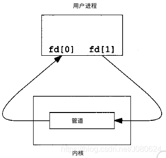
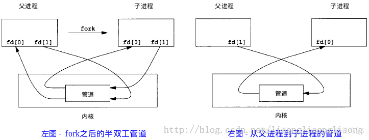
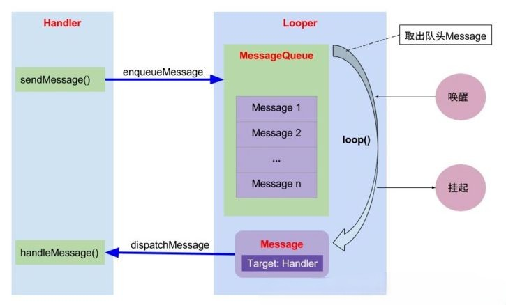

# Android通信
!!! question "说下进程间通信方式"
??? note "回答"
    进程间通信又称`IPC(Inter-Process Communication)`,指多个进程之间相互通信，交换信息的方法。根据进程通信时信息量大小的不同,可以将进程通信划分为两大类型:

    * **低级通信**,控制信息的通信(主要用于进程之间的同步,互斥,终止和挂起等等控制信息的传递)

    * **高级通信**,大批数据信息的通信(主要用于进程间数据块数据的交换和共享,常见的高级通信有管道,消息队列,共享内存等)。

    IPC的方式通常有管道（包括无名管道和命名管道）、消息队列、信号量、共享存储、Socket、Streams等。其中 Socket和Streams支持不同主机上的两个进程IPC。

    * **管道(Pipe)及有名管道(named pipe)**

        管道通常指无名管道，是 UNIX 系统IPC最古老的形式，是一种半双工的通信方式，数据只能单向流动，而且只能在具有亲缘关系的进程间使用。进程的亲缘关系通常是指父子进程关系。有名管道也是半双工的通信方式，但是它允许无亲缘关系进程间的通信。
        它可以看成是一种特殊的文件，对于它的读写也可以使用普通的read、write 等函数。但是它不是普通的文件，并不属于其他任何文件系统，并且只存在于内存中。

        当一个管道建立时，它会创建两个文件描述符：`fd[0]为读而打开，fd[1]为写而打开`。如下图：
        
        
        要关闭管道只需将这两个文件描述符关闭即可。

        单个进程中的管道几乎没有任何用处。所以，通常调用 pipe 的进程接着调用 fork，这样就创建了父进程与子进程之间的 IPC 通道。如下图所示：
        
        若要数据流从父进程流向子进程，则关闭父进程的读端（fd[0]）与子进程的写端（fd[1]）；反之，则可以使数据流从子进程流向父进程。

        **FIFO，也称为命名管道，它是一种文件类型。**   

        FIFO可以在无关的进程之间交换数据，与无名管道不同。FIFO有路径名与之相关联，它以一种特殊设备文件形式存在于文件系统中。

        管道可用于具有亲缘关系进程间的通信，有名管道克服了管道没有名字的限制，因此，除具有管道所具有的功能外，它还允许无亲缘关系进程间的通信。

    * **消息队列(Message Queue)**

        消息队列是消息的链接表，包括Posix消息队列system V消息队列，存放在内核中并由消息队列标识符(即队列ID)标识。有足够权限的进程可以向队列中添加消息，被赋予读权限的进程则可以读走队列中的消息。消息队列克服了信号承载信息量少，管道只能承载无格式字节流以及缓冲区大小受限等缺点。

        特点如下：

        * 消息队列是面向记录的，其中的消息具有特定的格式以及特定的优先级。
        * 消息队列独立于发送与接收进程。进程终止时，消息队列及其内容并不会被删除。
        * 消息队列可以实现消息的随机查询,消息不一定要以先进先出的次序读取,也可以按消息的类型读取。   

    * **共享内存**

      共享内存就是映射一段能被其他进程所访问的内存，这段共享内存由一个进程创建，但多个进程都可以访问。共享内存是最快的 IPC 方式，它是针对其他进程间通信方式运行效率低而专门设计的。它往往与其他通信机制，如信号两，配合使用，来实现进程间的同步和通信。  

    * **信号(Signal)**

      信号是比较复杂的通信方式，用于通知接受进程有某种事件发生，除了用于进程间通信外，进程还可以发送信号给进程本身。linux除了支持Unix早期信号语义函数signal外，还支持语义符合Posix.1标准的信号函数sigaction（实际上，该函数是基于BSD的，BSD为了实现可靠信号机制，又能够统一对外接口，用sigaction函数重新实现了signal函数）。
      
    * **信号量(semaphore)**

      信号量是一个计数器，可以用来控制多个进程对共享资源的访问。不是用于交换大批数据,而用于多线程之间的同步。常作为一种锁机制,防止某进程在访问资源时其它进程也访问该资源。因此，主要作为进程间以及同一进程内不同线程之间的同步手段。

    * **套接口(Socket)**

      更为一般的进程间通信机制，可用于不同机器之间的进程间通信。起初是由Unix系统的BSD分支开发出来的，但现在一般可以移植到其它类Unix系统上,Linux和System V的变种都支持套接字。  
!!! question "说下线程间通信方式"
??? note "回答"
    * **锁机制：包括互斥锁、条件变量、读写锁**

    互斥锁提供了以排他方式防止数据结构被并发修改的方法。 读写锁允许多个线程同时读共享数据，而对写操作是互斥的。 条件变量可以以原子的方式阻塞进程，直到某个特定条件为真为止。对条件的测试是在互斥锁的保护下进行的。条件变量始终与互斥锁一起使用。
    
    * **wait/notify 等待**

    等待通知机制是基于wait和notify方法来实现的，在一个线程内调用该线程锁对象的wait方法，线程将进入等待队列进行等待直到被通知或者被唤醒。
    * **Volatile 内存共享**

    volatile有两大特性，一是可见性，二是有序性，禁止指令重排序，其中可见性就是可以让线程之间进行通信。

    * **使用消息实现通信**

    如Android的Handler机制，通过消息队列来实现线程间的通信。

!!! question "说下Binder"
??? note "回答"
    1.直观来说，Binder是Android中的一个类，它继承了IBinder接口
    
    2.从IPC角度来说，Binder是Android中的一种跨进程通信方式，Binder还可以理解为一种虚拟的物理设备，它的设备驱动是/dev/binder，该通信方式在linux中没有

    3.从Android Framework角度来说，Binder是ServiceManager连接各种Manager（ActivityManager、WindowManager，etc）和相应ManagerService的桥梁
    
    4.从Android应用层来说，Binder是客户端和服务端进行通信的媒介，当你bindService的时候，服务端会返回一个包含了服务端业务调用的Binder对象，通过这个Binder对象，客户端就可以获取服务端提供的服务或者数据，这里的服务包括普通服务和基于AIDL的服务。


!!! question "简单讲讲 binder 驱动"
??? note "回答"
    * Binder驱动是Linux内核中的一个模块，它的设备驱动是/dev/binder，它的作用是实现进程间的通信，它的实现原理是通过内核中的一个链表来管理进程间的通信，当一个进程向另一个进程发送数据时，它会在链表中创建一个binder_node结构，当另一个进程接收到数据时，它会在链表中创建一个binder_proc结构，当两个进程的通信结束时，它们会在链表中删除对应的binder_node和binder_proc结构。
        


!!! question "Binder框架中ServiceManager的作用"
??? note "回答" 
    * ServiceManager是一个单例，它的作用是管理各种Manager和ManagerService，它的实现是一个HashMap，key是Manager的名字，value是ManagerService的Binder对象，当客户端需要获取某个ManagerService的时候，就通过ServiceManager的getService方法获取，这个方法的实现就是从HashMap中获取对应的Binder对象，然后返回给客户端。

!!! question "为什么要使用Binder"
??? note "回答"
    * **性能方面**

    在移动设备上（性能受限制的设备，比如要省电），广泛地使用跨进程通信对通信机制的性能有严格的要求，Binder相对出传统的Socket方式，更加高效。Binder数据拷贝只需要一次，而管道、消息队列、Socket都需要2次，共享内存方式一次内存拷贝都不需要，但实现方式又比较复杂。

    * **安全方面**

    传统的进程通信方式对于通信双方的身份并没有做出严格的验证，比如Socket通信ip地址是客户端手动填入，很容易进行伪造，而Binder机制从协议本身就支持对通信双方做身份校检，因而大大提升了安全性。

    * 还有一些好处，如实现面象对象的调用方式，在使用Binder时就和调用一个本地实例一样。

!!! question "Binder中是如何进行线程管理的"
??? note "回答"
    * 每个Binder的Server进程会创建很多线程来处理Binder请求，可以简单的理解为创建了一个Binder的线程池吧（虽然实际上并不完全是这样简单的线程管理方式），而真正管理这些线程并不是由这个Server端来管理的，而是由Binder驱动进行管理的。
  
    * 一个进程的Binder线程数默认最大是16，超过的请求会被阻塞等待空闲的Binder线程。理解这一点的话，你做进程间通信时处理并发问题就会有一个底，比如使用ContentProvider时（又一个使用Binder机制的组件），你就很清楚它的CRUD（创建、检索、更新和删除）方法只能同时有16个线程在跑。

!!! question "binder 一次拷贝原理"
??? note "回答"
    * 一次拷贝的原理是通过Binder驱动的mmap实现的，当客户端调用服务端的方法时，服务端会将数据拷贝到Binder驱动的内存中，然后客户端通过Binder驱动的mmap将数据拷贝到自己的内存中，这样就实现了一次拷贝。

!!! question "aidl实现原理"
??? note "回答" 
    * aidl是一个工具，它会根据你定义的接口生成一个Java类，这个类实现了你定义的接口，然后在这个类中实现了一个transact方法，这个方法就是真正的跨进程通信方法，它会将你传入的参数打包成一个Parcel对象，然后调用Binder驱动的transact方法，将这个Parcel对象传递给服务端，服务端再将这个Parcel对象解析出来，然后调用你定义的方法，最后将结果返回给客户端。

!!! question "谈谈消息机制Hander"
??? note "回答" 
    * **作用**：

    跨线程通信。当子线程中进行耗时操作后需要更新UI时，通过Handler将有关UI的操作切换到主线程中执行。


    * **四要素**：

    Message（消息）：需要被传递的消息，其中包含了消息ID，消息处理对象以及处理的数据等，由MessageQueue统一列队，最终由Handler处理。

    MessageQueue（消息队列）：用来存放Handler发送过来的消息，内部通过单链表的数据结构来维护消息列表，等待Looper的抽取。

    Handler（处理者）：负责Message的发送及处理。通过 Handler.sendMessage() 向消息池发送各种消息事件；通过 Handler.handleMessage() 处理相应的消息事件。

    Looper（消息泵）：通过Looper.loop()不断地从MessageQueue中抽取Message，按分发机制将消息分发给目标处理者。


    * **具体流程**

        * Handler.sendMessage()发送消息时，会通过MessageQueue.enqueueMessage()向MessageQueue中添加一条消息；

        * 通过Looper.loop()开启循环后，不断轮询调用MessageQueue.next()；

        * 调用目标Handler.dispatchMessage()去传递消息，目标Handler收到消息后调用Handler.handlerMessage()处理消息。

        

!!! question "一个线程是否可以有多个Looper、多个个MessageQueue，多个Handler？"
??? note "回答"    
    Android中一个线程最多仅仅能有一个Looper，若在已有Looper的线程中调用Looper.prepare()会抛出RuntimeException(“Only one Looper may be created per thread”)。
    ```java
    public static void prepare() {
    prepare(true);
    }

    private static void prepare(boolean quitAllowed) {
        if (sThreadLocal.get() != null) {
            throw new RuntimeException("Only one Looper may be created per thread");
        }
        sThreadLocal.set(new Looper(quitAllowed));
    }
    ```
    而 Looper有一个MessageQueue，但可以处理来自多个Handler的Message。
    所以 一个线程只有一个Looper、只有一个MessageQueue，可以有多个Handler

!!! question "Looper.loop是一个死循环，拿不到需要处理的Message就会阻塞，那在UI线程中为什么不会导致ANR？"
??? note "回答"      
    因为Android 的是由事件驱动的，looper.loop() 不断地接收事件、处理事件，每一个点击触摸或者说Activity的生命周期都是运行在 Looper.loop() 的控制之下，如果它停止了，应用也就停止了。只能是某一个消息或者说对消息的处理阻塞了 Looper.loop()，而不是 Looper.loop() 阻塞它。

!!! question "Looper.loop是一个死循环，消耗性能吗"
??? note "回答" 
    主线程Looper从消息队列读取消息，当读完所有消息时，主线程阻塞。子线程往消息队列发送消息，并且往管道文件写数据，主线程即被唤醒，从管道文件读取数据，主线程被唤醒只是为了读取消息，当消息读取完毕，再次睡眠。因此loop的循环并不会对CPU性能有过多的消耗。

!!! question "Handler 如何避免内存泄漏"
??? note "回答"     
    Handler造成内存泄露的原因：**非静态内部类，或者匿名内部类**，使得Handler默认持有外部类的引用。在Activity销毁时，由于Handler可能有未执行完/正在执行的Message。导致Handler持有Activity的引用。进而导致GC无法回收Activity。

    * 解决方法

        1. Activity销毁时，清空Handler中，未执行或正在执行的Callback以及Message。
        ```java
            // 清空消息队列，移除对外部类的引用
        @Override
        protected void onDestroy() {
            super.onDestroy();
            mHandler.removeCallbacksAndMessages(null);

        }
        ```

        2. 静态内部类+弱引用
        ```java
        private static class AppHandler extends Handler {
            //弱引用，在垃圾回收时，被回收
            WeakReference<Activity> activity;

            AppHandler(Activity activity){
                this.activity=new WeakReference<Activity>(activity);
            }

            public void handleMessage(Message message){
                switch (message.what){
                    //todo
                }
            }
        } 
        ```
!!! question "主线程 Looper 什么时候退出循环"
??? note "回答" 
      当 ActivityThread 内部的 Handler 收到了 EXIT_APPLICATION 消息后，就会退出 Looper 循环

      ```java
      public void handleMessage(Message msg) {
              switch (msg.what) {
                  case EXIT_APPLICATION:
                      if (mInitialApplication != null) {
                          mInitialApplication.onTerminate();
                      }
                      Looper.myLooper().quit();
                      break;
              }
      }
      ```


