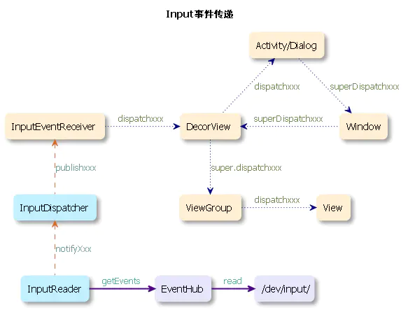
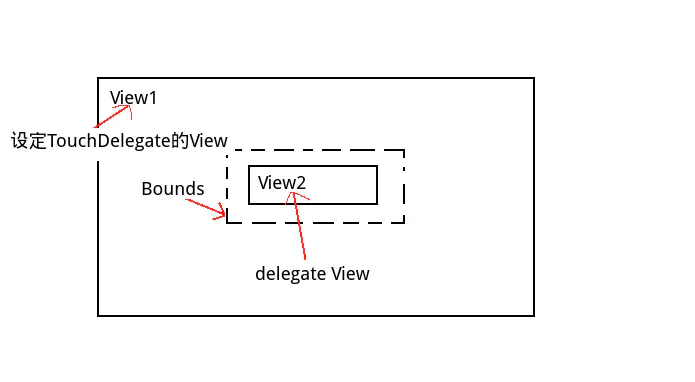

# Android 事件相关

!!! question "简单描述输入事件传递的系统原理"
??? note "回答"
    

    1. `eventhub`构建的时候会遍历整个`/dev/input`路径下的fd，并将其添加到`epoll`中，同时还会监听此路径下新的设备的创建和卸载

    2. 当driver向特定描述符写入事件后，会触发唤醒`epoll`起来工作，这时候`eventHub`通过`read`方法从描述符中读取原始事件，然后通过简单封装成rawEvent并传递给`InputReader`。

    3. `InputReader`中的threadLoop中会调用eventHub的getEvents来获取输入事件，然后通过调用`notifyxxx`方法将事件传递到`InputDispater`并最终通过`notifyxxx`方法传递到上层

    4. 在`InputEventReceiver`中的`dispatchInputEvent`方法中会调用`onInputEvent`方法进行事件的处理,具体实现类是`ViewRootImpl#WindowInputEventReceiver`，其内部会调用`enqueueInputEvent`方法对事件进行入队

    5. 对事件进一步处理之后，通过`mView#dispatchxxxEvent`将事件分发到`DecorView`中, 

    6. `DecorView`通过Window.Callback#dispatchxxxEvent会将事件传递到`Window.Callback`（Activity或者Dialog）里，

    7. `Window.Callback`（Activity或者Dialog）通过`mDecor#superDispatchKeyEvent`方法将事重新传递到`DecorView`中

    8. `DecorView` 直接调用DecorView的父类的`dispatchKeyEvent`方法，将事件传递到`ViewGroup`中， 如果事件没有被处理掉的话，就会通过`ViewRootImpl`将其作为`UnhandledEvent`进行处理。

    9. `ViewGroup`通过`dispatchxxxEvent`方法将事件传递到`View`中

!!! question "简单描述按键事件派发流程"
??? note "回答"
    * 首先按键事件将通过`View.dispatchKeyEventPreIme()`派发给控件树。此时开发者可以进行事件处理的场所是`View.dispatchKeyEventPreIme()`或`View.onKeyPreIme()`。

    * 然后按键事件将通过`InputManager.dispatchKeyEvent()`派发给输入法。此时处理事件的场所是当前输入法所在的`InputMethodService的onKeyDown()/onKeyUp()`等系列回调。

    * 之后按键事件将被`View.checkForLeavingTouchModeAndConsume()`方法用来尝试退出触摸模式。

    * 再之后按键事件将被`View.dispatchKeyEvent()`在此派发给控件树。此时开发者可以进行事件处理的场所是`View.dispatchKeyEvent()`,通过`View.setOnKeyListener()`方法设置的`OnKeyListener`,以及`View.onKeyDown()/onKeyUp()`等系列回调。

    * `PhoneFallbackEventHandler`将在上述对象都没有消费事件时尝试对事件进行处理。

    * 最后`ViewRootImpl`将尝试通过按键事件使焦点在控件之间游走。
    
!!! question "简单描述触摸事件派发机制"
??? note "回答"

    **派发流程**

    * 事件最先被发送到你的Activity中

    * 再由Activity发送给RootView

    * 父View调用dispatchTouchEvent开启事件分发

    * 父View调用onInterceptTouchEvent判断是否拦截该事件，一旦拦截后该事件的后续事件(如DOWN之后的MOVE和UP)都直接拦截，不会再进行判断。

    * 如果父View进行拦截，父View调用onTouchEvent进行处理。

    * 如果父View不拦截，会调用子View的dispatchTouchEvent进行事件的层层分发。

    * 如果onTouchEvent()返回true，表示事件被消费，事件的传递就会停止。 否则，onTouchEvent一层一层往上返回，直到Activity。

    **重要原则：事件序列的不可中断性**

    一旦一个控件决定了接受一个触控点的`ACTION_DOWN`/或`ACTION_POINTER_DOWN`事件(在事件处理函数中返回true),表示控件将接受序列的所有后续事件,即便触控点移动到控件区域之外也是如此。

    触摸事件的序列除ACTION_UP以外还有一种结束标志——`ACTION_CANCEL`。比如,一个正在接受事件序列的控件从控件树中被移除,或者发生了Activity切换等,那么它将收到ACTION_CANCEL而不是ACTION_UP,此时控件**需要中断对事件的处理并将自己恢复到接受事件序列之前的状态。**

!!! question "ViewGroup确定触摸事件派发目标的原则"
??? note "回答"

    * 仅当事件的动作为ACTION_DOWN或ACTION_POINTER_UP时才会进行派发目标的查找。因为这些动作标志着新的事件子序列的开始,ViewGroup仅需要对新的序列查找一个派发目标。

    * ViewGroup会沿着绘制顺序相反的方向,即从上到下进行查找。毕竟用户往往都是希望点击在他能看得到的东西上。因此ZOrder越靠上的控件拥有越高的接受事件的优先级。

    * ViewGroup会将一个控件作为派发目标候选的先决条件是事件的坐标位于其边界内部。当事件落入子控件内部并且它接受过另外一条事件序列时,则直接认定它就是此事件序列的派发目标。因为当用户将手指按在一个控件上,再把另一根手指也按在其上时,很可能是他想对此控件进行多点操作。      

    * ViewGroup会首先通过dispatchTransformedTouchEvent()尝试将事件派发给候选控件,倘若控件在其事件处理函数中返回true,则可以确定它就是派发目标,否则继续测试下一个子控件。

    * 当遍历了所有子控件后都无法找到一个合适的派发目标时(事件落在了所有子控件之外,或者所有子控件对此事件都不感兴趣),ViewGroup会强行将接受了上一条事件序列的子控件作为派发目标。因为ViewGroup猜测用户以相邻次序按下的两根手指应该包含着能够共同完成某种任务的期望。可以看出,ViewGroup尽其所能地将事件派发给子控件,而不是将事件留给自己处理。不过当目前没有任何一个子控件正在接受事件序列时(mFirstTouchTarget为null),ViewGroup便不得不将事件交给自己处理了

!!! question "说下onInterceptTouchEvent()的作用"
??? note "回答" 
    
    > 手指按下(DOWN)，到手指抬起(UP)，中间由零个、一个或者无数个移动(MOVE)连接起来称之为一个事件序列

    作用对象仅为ViewGroup。意为拦截操作。事件传递过来之后，根据返回值的不同来判断是否需要进行拦截操作。

    * **true**：代表拦截这个事件。事件不会再往下传递，而是交给了ViewGroup自身的onTouch去处理。此方法返回true时，一个事件序列只调用一次，等于说后面的MOVE与UP不会再执行onInterceptTouchEvent方法，而是直接去执行onTouch方法。

    * **super/false**：代表不拦截这个事件，事件传递给子类View的dispatchTouchEvent去处理。

    在使用拦截方法onInterceptTouchEvent的时候，需要注意两种特殊情况。

    * 一次事件序列中，该方法一旦被调用返回了true就不会在调用了。假设在Down事件被调用时返回了true，那么Move与Up事件便不会再去调用这个方法，而是直接去执行onTouchEvent方法。

    * 假设ViewGroup没有拦截Down事件，而是拦截了Move事件，那么这个Down会直接传递给子类View，而后面的Move由于被拦截了，但是他并不会传递给自身的onTouchEvent方法，而是被作为一个Cancel方法传递给子类的View，而后面再来的Move则会被传递给自身的View去处理，而子类的View也不再会收到后续事件。
        

!!! question "说下requestDisallowTouchIntercept()的作用"
??? note "回答"
    ViewGroup可以通过`onInterceptTouchEvent`对触控事件进行中断或者窃取子 View 的触控事件。但是有时候我们希望子 View 能够完全接管触控事件，这时候就需要调用`requestDisallowInterceptTouchEvent`方法来禁止父 View 对触控事件的拦截。

    **例子：**
    ScrollView（内部有一个 Button），当手指放到 Button 上，然后进行上下滑动，会发现手势交给了 ScrollView，并且开始滚动（ScrollView 优先于 Button 的响应）。如果你自定义的子视图出于某些原因,也准备处理一些拖拽事件时，这样的话,你希望暂时的由子视图去处理拖拽，从而需要阻止ScrollView去处理拖拽，这时可以把`requestDisallowInterceptTouchEvent`标识置为true一段时间,之后再清掉此标识。
    
    需要注意的是,这个标识只对当前的手势有效， 当`ACTION_UP`发生，又一个新的`ACTION_DOWN`到来时，这意味着一个新的手势的开始,那么之前设置的标识就会被置空 , 如果仍需要拦截，需要再次调用`requestDisallowTouchIntercept()`方法，也就是说，需要针对某个手势，每次都调用该方法去设置中断标识


!!! question "说下ViewConfiguration的作用"
??? note "回答"

    ViewConfiguration 有很多常量.这些常量供框架使用，而当你在做自定义手势时，你也需要在你的程序中把这些常量拿来用，来使你的事件处理跟系统的体验一致。
    这里的大多数常量是跟触摸事件有关的,但不全是，有些也会跟画图或其他方面相关。就大部分而言,这些常量是基于触摸的
    接下来我来讲几个非常重要的常量

    * getScaledTouchSlop()

    移动事件可能会在被视为拖动之前发生变化的距离

    * getScaledMinimumFlingVelocity()

    系统认为阻力可以变为甩尾的最小速度

    * getScaledPagingTouchSlop()

    此常量在ViewPager中有被用到,这个touch slop指的是横向滑动翻页。也不是说所有横向的slop都用这个常量。比方说横向的ScrollView用的还是第一种slop来做检查，起初设计这两个不同的常量的主要原因是**当把ScrollView放到ViewPager中时，怎样才能使两者都工作的好，在x轴跟y轴上,分别有两种不同的slop检查，这样就很容易判断出哪个轴胜出,以便决定你是上划还是侧滑**。

    * getLongPressTimeout()

    系统长按事件超时时间

    > 就不同的手机屏幕而言,用这些预定义的常量另外一个好处就是,这些常量都是像dp之类的,其值是跟分辨率无关的,所以你不用自己去找一些随机的像素点数, 来充当你自己的slop检查了   


!!! question "说下滑动冲突"
??? note "回答"

    **滑动冲突有哪些场景？**

    - 内层和外层滑动方向不一致：一个垂直，一个水平。比如轮播图ViewPager和ScrollView

    - 内层和外层滑动方向一致：均垂直or水平。比如scrollView和RecyclerView

    - 前两者层层嵌套。比如ScrollView和RecyclerView(recyclerView中又嵌套recyclerView)

    **滑动冲突处理原则**

    - 对于内外层滑动方向不同，只需要根据滑动方向来给相应控件拦截

    - 对于内外层滑动方向相同，需要根据业务来进行事件拦截，规定何时让外部View拦截事件何时由内部View拦截事件。

    - 前两者嵌套的情况，根据前两种原则层层处理即可。

    **滑动冲突解决办法有哪些？**

    - 外部拦截法：指点击事件都先经过父容器的拦截处理，如果父容器需要此事件就拦截，否则就不拦截。具体方法：需要重写父容器的onInterceptTouchEvent方法，在内部做出相应的拦截。

    - 内部拦截法：指父容器不拦截任何事件，而将所有的事件都传递给子容器，如果子容器需要此事件就直接消耗，否则就交由父容器进行处理。具体方法：需要配合requestDisallowInterceptTouchEvent方法。

    **外部拦截解决滑动冲突法**

    - 外部拦截法要点
    
        - 父容器的onInterceptTouchEvent方法中处理

        - ACTION_DOWN不拦截，一旦拦截会导致后续事件都直接交给父容器处理。

        - ACTION_MOVE中根据情况进行拦截，拦截：return true，不拦截：return false（外部拦截核心）

        - ACTION_UP不拦截，如果父控件拦截UP，会导致子元素接收不到UP进一步会让onClick方法无法触发。此外UP拦截也没什么用。


!!! question "onTouch()、onTouchEvent()和onClick()关系是怎样的，哪一个先执行"
??? note "回答"
    
    **onTouch->onTouchEvent->onClick**

    - 当一个View需要处理事件时，如果它设置了OnTouchListener，那么OnTouchListener的onTouch方法会被回调。

    - 这时事件如何处理还得看onTouch的返回值，如果返回false，则当前View的onTouchEvent方法会被调用；如果返回true，那么onTouchEvent方法将不会被调用。由此可见，给View设置的onTouchListener，其优先级比onTouchEvent要高。

    - 如果当前方法中设置了onClickListener，那么它的onClick方法会被调用。可以看出，常用的OnClickListener，其优先级别最低。

!!! question "如果设置了onClickListener, 但是onClick()没有调用，可能产生的原因"
??? note "回答"
    
    * 父View拦截了事件，没有传递到当前View

    * View的Enabled = false(setEnabled(false)): view处于不可用状态，会直接返回。

    * View的Clickable = false(setClickable\setLongClickable(false)):view不可以点击，不会执行onClick

    * View设置了onTouchListener，且消耗了事件。会提前返回。

    * View设置了TouchDelegate，且消耗了事件。会提前返回。


!!! question "View滑动有哪些方法？"
??? note "回答"
    - **layout**：对View进行重新布局定位。在onTouchEvent()方法中获得控件滑动前后的偏移。然后通过layout方法重新设置。

    - **offsetLeftAndRight和offsetTopAndBottom**:系统提供上下/左右同时偏移的API。onTouchEvent()中调用

    - **LayoutParams**: 更改自身布局参数

    - **scrollTo/scrollBy**: 本质是移动View的内容，需要通过父容器的该方法来滑动当前View

    - **Scroller**: 平滑滑动，通过重载computeScroll()，使用scrollTo/scrollBy完成滑动效果。

    - **属性动画**: 动画对View进行滑动

    - **ViewDragHelper**: 谷歌提供的辅助类，用于完成各种拖拽效果


!!! question "说下Scroller"
??? note "回答"
    Scroller用于封装滑动, 提供了基于时间的滑动偏移值，但是实际滑动需要我们去负责。

    **Scroller工作原理？**

    - Scroller本身不能实现View的滑动，View重绘之后draw方法会调用自己实现的computeScroll()，才真正实现了滑动

    - 不断让View重绘，每一次重绘距离滑动的开始时间有一个时间间隔，通过该时间可以得到View当前的滑动距离

    - View的每次重绘都会导致View的小幅滑动，多次小幅滑动就组成了弹性滑动

!!! question "说下TouchDelegate"
??? note "回答"
    TouchDelegate让父视图能够将子视图的可轻触区域扩展到子视图的边界之外。当子视图必须较小，同时又应该具有较大的轻触区域时，此方法很有用。

    TouchDelegate的使用方法很简单，考虑以下这种情形

    

    我们想扩大View2的点击区域至View1内部的Bounds区域，代码如下：

    ```java
    view1.post(new Runnable() {
    @Override
    public void run() {
        Rect bounds = new Rect();
        // 获取View2占据的矩形区域在其父View（也就是View1）中的相对坐标
        view2.getHitRect(bounds);
        // 计算扩展后的j矩形区域Bounds相对于View1的坐标，left、top、right、bottom分别为View2在各个方向上的扩展范围
        bounds.left -= left;
        bounds.top -= top;
        bounds.right += right;
        bounds.bottom += bottom;
        // 创建TouchDelegate，delegateView为View2
        TouchDelegate touchDelegate = new TouchDelegate(bounds, view2);
        // 为View1设置TouchDelegate，原因可以参考View.java中mTouchDelegate的注释
        // The delegate to handle touch events that are physically in this view but should be handled by another view.
        view1.setTouchDelegate(touchDelegate);
    }
    });
    ```