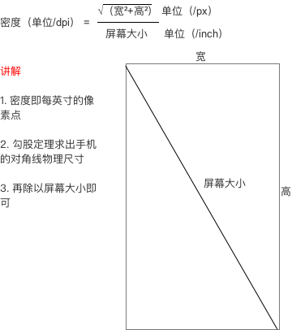
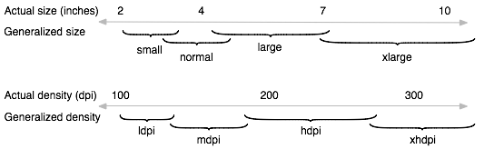

# android 屏幕适配
!!! question "基础概念：像素、屏幕尺寸、分辨率、dpi、dp、sp"  
??? note "回答"
    1. **像素**：通常所说的像素，就是CCD/CMOS上光电感应元件的数量，一个感光元件经过感光，光电信号转换，A/D转换等步骤以后，在输出的照片上就形成一个点，我们如果把影像放大数倍，会发现这些连续色调其实是由许多色彩相近的小方点所组成，这些小方点就是构成影像的最小单位“像素”（Pixel）。简而言之，像素就是手机屏幕的最小构成单元。  
    2. **分辨率**：屏幕的像素点的数量，单位是像素。比如：19201080 分辨率，表示当前设备的屏幕是由 横向1080 纵向1920 个像素点 组合而成。
    3. **屏幕尺寸**：屏幕对角线的长度，单位是英寸。  
    4. **屏幕尺寸、分辨率、像素密度三者关系** 
    4. **屏幕像素密度(dpi)**：每英寸的像素点的数量，单位是dpi。**标准屏幕分辨率** ：160dpi 。即：一平方英寸面积，存在160像素点。（mdpi）.
    5. **dp：density-independent pixels，密度无关像素**，是一种抽象的单位，它的大小不受屏幕密度的影响，它的大小是根据屏幕密度来计算的。可以保证在不同的屏幕像素密度的手机上显示 很相似的效果。
    6. **sp：scale-independent pixels，缩放无关像素**，是一种抽象的单位，它的大小不受屏幕密度的影响，它的大小是根据屏幕密度来计算的。**专门用于字体大小表示。**
    > 推荐使用12sp以上的偶数作为 字体大小, 不要使用奇数，或者浮点型小数，因为容易造成精度丢失。

!!! question "dp与px的转换"
??? note "回答"
    在Android中，规定以160dpi（即屏幕分辨率为320x480）为基准：1dp=1px
    
    |     密度类型      | 代表的分辨率（px) | 屏幕密度（dpi） | 换算（px/dp）  |
      | :-----------: | :--------: | :-------: | ---------- |
    |   低密度（ldpi）   |  240x320   |    120    | 1dp=0.75px |
    |   中密度（mdpi）   |  320x480   |    160    | 1dp=1px    |
    |   高密度（hdpi）   |  480x800   |    240    | 1dp=1.5px  |
    |  超高密度（xhdpi）  |  720x1280  |    320    | 1dp=2px    |
    | 超超高密度（xxhdpi） | 1080x1920  |    480    | 1dp=3px    |
    
    >  官方说明
    >
    >  - *ldpi* (low) ~120dpi
    >  - *mdpi* (medium) ~160dpi
    >  - *hdpi*(high) ~240dpi
    >  - *xhdpi* (extra-high) ~320dpi
    >  - *xxhdpi* (extra-extra-high) ~480dpi
    >  - *xxxhdpi* (extra-extra-extra-high) ~640dpi
    >
    >  
    >
    >  - *xlarge* screens are at least 960dp x 720dp
    >  - *large* screens are at least 640dp x 480dp
    >  - *normal* screens are at least 470dp x 320dp
    >  - *small* screens are at least 426dp x 320dp
    >

!!! question "为什么 有了dp单位，依然要适配呢"
??? note "回答"
    dp是密度无关像素，但是不是屏幕无关像素，不同的屏幕尺寸、分辨率、密度，dp的大小是不一样的，所以需要适配。
    
    以320*480 dpi160的屏幕为标准，画了一条长度为160px的线，长度为屏幕宽度的一半，这个时候，你直接用 160dp，一般就能完成适配。但是如果这样的布局 运行在320x480分辨率，但是屏幕密度为150dpi 略小于 160dpi，这个时候 你布局里面写的160dp就会实际超过160px 不再是占屏幕宽的一半，而是略微超过。

!!! question "sp和dp有什么区别？"
??? note "回答"
    通常情况下，dp和sp效果类似，但是有一点，如果用户 调整了手机字体，比如 从标准，变成了 超大，那么，1dp 原本等于1px依然不变，但是1sp就会从1px变成3px（只是举个例子，数值不必认真）.
    因此，在用户调整字体的情况下，同样的布局，可能出现 窗口大小不变，但是文字尺寸发生变化的情况。
    
!!! question "屏幕适配注意事项"
??? note "回答"
    使用相对布局，很有可能出现 第一次测量"不满意"的情况，从而会测量第二次。如果两者都可以达成目的，并且两者的布局层级相同，并且线性布局中没有使用到权重(权重可能也会触发第二次测量)，此时，优先使用线性布局。 除此之外，都选择相对布局。

!!! question "主流适配方案"
??? note "回答"
    * 头条方案（直接变更DisplayMetrics中的density）
    * 多套dimens适配方案

