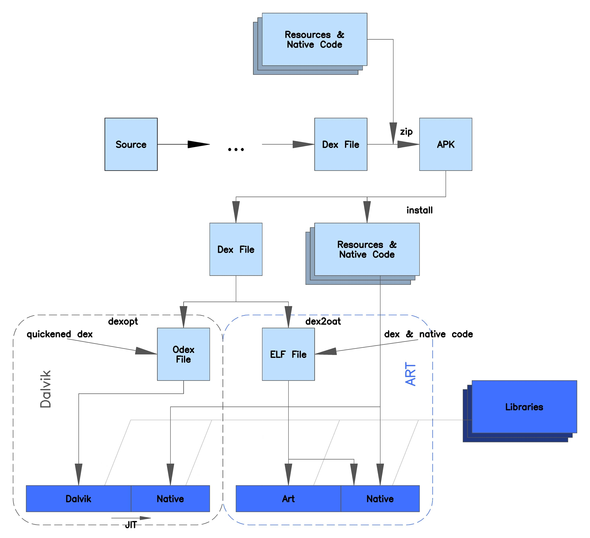

# Android 系统原理
## 系统相关

!!! question "说说Android 系统开机流程"

??? note "回答"

## AMS相关
!!! question "说说Android app 启动流程"

??? note "回答"

## 编译相关
!!! question "简单说说 dexopt 与 dex2oat 的区别？"

??? note "回答"

      * 

      通过上图可以很明显的看出 `dexopt` 与 `dex2oat` 的区别，前者针对 Dalvik 虚拟机，后者针对 Art 虚拟机。

      * 在5.0以前的版本，Android 使用Dalvik虚拟机，在加载Dex时会触发dexopt生成odex文件，实际上是对 dex 文件 进行 `verification` 和 `optimization `操作（譬如优化调用虚拟指令等）, 在运行时，通过JIT编译器将热点代码编译成native代码，其余的一边运行，一边编译。
      
      * 在5.0之后的版本，Android 使用ART虚拟机，APK在安装的过程中，会通过dex2oat工具生成一个OAT文件。oat文件是一种Android私有ELF文件格式，它遵循ELF格式，ELF是Unix系统上可执行文件，可以直接被本地处理器执行