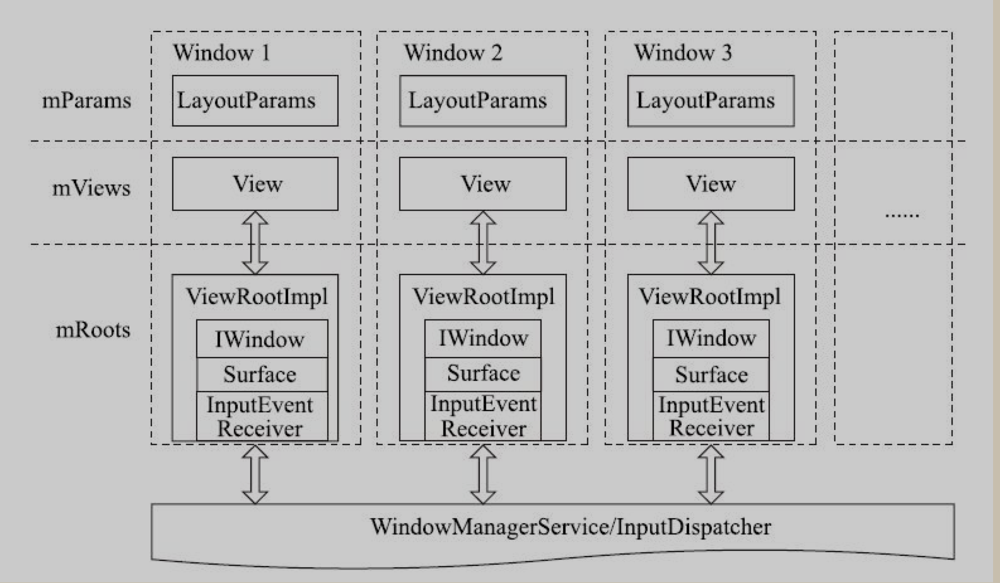

# Android 视图相关

!!! question "说下对Window的理解"
??? note "回答"
    Window是一个抽象概念，每一个Window都对应一个View和一个ViewRootImpl，Window和View通过ViewRootImpl来建立联系，因此Window不是实际存在的，他是以View的形式存在的，不能直接访问Window，只有通过WindowManager才能访问

    Window表示窗口的概念，他是一个抽象类，他的真正实现类是PhoneWindow，WindowManager用来对Window进行管理，是外接访问Window的入口，Window操作的具体实现是在WindowManagerService中，WindowMager和WindowManagerService交互是IPC的过程

    Android中所有的视图都是附加在Window上上呈现的，不管Activity,Dialog,Toast,他们的视图都是附加在Window上的,因此Window实际上是View的直接管理者

    Window有几种类型：

    * 应用Window：对应一个Activity。

    * 子Window：不能单独存在，需附属特定的父Window。如Dialog。

    * 系统Window： 需申明权限才能创建。如Toast。

    

!!! question "Activity、View、Window三者之间的关系"
??? note "回答"
    在Activity启动过程其中的attach()方法中初始化了PhoneWindow，而PhoneWindow是Window的唯一实现类，然后Activity通过setContentView将View设置到了PhoneWindow上，而View通过WindowManager的addView()、removeView()、updateViewLayout()对View进行管理。

!!! question "说下对ViewRootImpl的理解"
??? note "回答"

    * ViewRootImpl实现了一个控件树的根。它负责与WMS直接通信,负责管理Surface,负责触发控件的测量与布局,负责触发控件的绘制,同时也是输入事件的中转站。控件、布局参数以及ViewRootImpl三者共同组成了客户端的一个窗口。或者说,在控件系统中的窗口就是控件、布局参数与ViewRootImpl对象的一个三元组。
   
    * 它既非View的子类，也非View的父类，但是，它实现了ViewParent接口，这让它可以作为View的名义上的父视图

    

!!! question "说下DecorView的理解"
??? note "回答" 
    * 什么是DecorView
        * DecorView是顶级View，本质就是一个FrameLayout，它可以被认为是Android视图树的根节点视图。
        * 包含了两个部分，标题栏和内容栏, 内容栏id是content，也就是activity中setContentView所设置的部分，最终将布局添加到id为content的FrameLayout中

    * DecorView的职责

    Activity就像个控制器，不负责视图部分。Window像个承载器，装着内部视图。DecorView就是个顶层视图，是所有View的最外层布局。ViewRoot像个连接器，负责沟通，通过硬件的感知来通知视图，进行用户之间的交互。

!!! question "Dialog和Window有什么关系"
??? note "回答"
    看源码可知在Dialog的构造方法中直接直接构造了一个PhoneWindow，并赋值给Dialog的成员变量mWindow，从这里可以看出其实Dialog和Activity的显示逻辑都是类似的，都是通过对应的Window变量来实现窗口的加载与显示的。然后我们执行了一些Window对象的初始化操作，比如设置回调函数为本身，然后调用Window类的setWindowManager方法，并传入了WindowManager。然后创建一个对话框监听handler对象
    ```java
        Dialog(@NonNull Context context, @StyleRes int themeResId, boolean createContextThemeWrapper) {
        if (createContextThemeWrapper) {
            if (themeResId == 0) {
                final TypedValue outValue = new TypedValue();
                context.getTheme().resolveAttribute(R.attr.dialogTheme, outValue, true);
                themeResId = outValue.resourceId;
            }
            //创建一个Context
            mContext = new ContextThemeWrapper(context, themeResId);
        } else {
            mContext = context;
        }

        //获取一个WindowManager对象
        mWindowManager = (WindowManager) context.getSystemService(Context.WINDOW_SERVICE);
        //创建一个Window对象
        final Window w = new PhoneWindow(mContext);
        //将Window对象w赋值给mWindow
        mWindow = w;
        //为Windowd对象设置回调，并且它本身实现了这些回调函数
        w.setCallback(this);
        w.setOnWindowDismissedCallback(this);
        //为Window对象设置WindowManager对象
        w.setWindowManager(mWindowManager, null, null);
        w.setGravity(Gravity.CENTER);
        //创建一个对话框监听Handler
        mListenersHandler = new ListenersHandler(this);
    }
    ```

!!! question "PopupWindow和Dialog有什么区别"
??? note "回答"
    1. **AlertDialog 是非阻塞式对话框；而PopupWindow 是阻塞式对话框**。AlertDialog 弹出时，后台还可以做事情；PopupWindow 弹出时，程序会等待，在PopupWindow 退出前，程序一直等待，只有当我们调用了 dismiss() 方法的后，PopupWindow 退出，程序才会向下执行。我们在写程序的过程中可以根据自己的需要选择使用 Popupwindow 或者是 Dialog.
    2. **两者最根本的区别在于有没有新建一个 window**，PopupWindow 没有新建，而是通过 WMS 将 View 加到 DecorView；Dialog 是新建了一个 window (PhoneWindow)，相当于走了一遍 Activity 中创建 window 的流程。

!!! question "说下对View的理解"
??? note "回答"
    View 实际上是一个抽象类，他负责对**渲染、布局以及触摸事件进行抽象**
    
    * **布局抽象**
    布局，是 View 最重要的特性，诸如层级控制、矩形大小、Matrix 变换都属于布局抽象的范畴，布局是渲染、触摸两者的基础。
    * **触摸事件抽象**
    所谓触控，有触才有控，一方面 View 要负责接收触摸事件，另一方面 View 要负责反馈接收到的触摸事件。简单来说就是主要有两个过程，**冒泡、向上递归。**

    冒泡的主要作用是为了找出触摸点所在的 View，在找的过程中会形成响应链，一旦确定好响应者和响应链，触摸的过程就开始了。可以通过重写 `dispatchTouchEvent(MotionEvent event)` 验证。

    冒泡过程完成后，我们会得到响应者 A，紧接着 `touchstart / touchmove / touchend / touchcancel` 事件就会分发到这个响应者身上。 A 会根据事件类型，调用 `onTouchEvent(MotionEvent event)` 或者 `onInterceptTouchEvent(MotionEvent event)` 来处理事件。如果 A 没有处理事件，那么事件就会向上递归，一直到根 View，如果根 View 也没有处理事件，那么事件就会被丢弃。

    * **渲染抽象**
    渲染，是 View 最基本的特性，View 要负责把自己绘制到屏幕上，这个过程就是渲染。一般来说 View 不会直接面向 底层图形库（如OpenGL） 进行封装，而是通过中间层，在 iOS 上，使用的是 `CALayer(CoreGraphics)`，而在 Android 上，使用的是 `Canvas (Skia)`。

!!! question "简单说下View的绘制流程"
??? note "回答"
    View的绘制流程是从ViewRoot的PerformTraversals方法开始的。大概的流程如下所示

    * **预测量阶段**。

    这是进入performTraversals（）方法后的第一个阶段，它会对控件树进行第一次测量。测量结果可以通过mView.getMeasuredWidth（）/Height（）获得。在此阶段中将会计算出控件树为显示其内容所需的尺寸，即期望的窗口尺寸。在这个阶段中，View及其子类的onMeasure（）方法将会沿着控件树依次得到回调。

    * **布局窗口阶段**。

     根据预测量的结果，通过IWindowSession.relayout（）方法向WMS请求调整窗口的尺寸等属性，这将引发WMS对窗口进行重新布局，并将布局结果返回给ViewRootImpl。

    * **最终测量阶段**。

    预测量的结果是控件树所期望的窗口尺寸。然而由于在WMS中影响窗口布局的因素很多,WMS不一定会将窗口准确地布局为控件树所要求的尺寸,而迫于WMS作为系统服务的强势地位,控件树不得不接受WMS的布局结果。因此在这个阶段,performTraversals()将以窗口的实际尺寸对控件进行最终测量。在这个阶段中,View及其子类的onMeasure()方法将会沿着控件树依次被回调。

    * **布局控件树阶段**。

    完成最终测量之后便可以对控件树进行布局。测量确定的是控件的尺寸,而布局则是确定控件的位置。在这个阶段中,View及其子类的onLayout()方法将会被回调。

    * **绘制阶段**。

    这是performTraversals（）的最终阶段。确定控件的位置与尺寸后，便可以对控件树进行绘制。在这个阶段中，View及其子类的onDraw（）方法将会被回调。

!!! question "说下MeasureSpec的理解"
??? note "回答"
    MeasureSpec用于指导控件对自身进行测量， 代表一个32位int值，高2位代表SpecMode，低30位代表SpecSize,SpecMode是指测量模式，而SpecSize是指在某种测量模式下的规格大小,是父控件建议尺寸 ，建议尺寸对测量结果的影响依`SPEC_MODE`的不同而不同。`SPEC_MODE`的取值取决于此控件的`LayoutParams.width/height`的设置,可以是如下三种值之一。

    * **MeasureSpec.UNSPECIFIED(0)**:表示控件在进行测量时,可以无视SPEC_SIZE的值。控件可以是它所期望的任意尺寸。

    * **MeasureSpec.EXACTLY(1)**:表示子控件必须为SPEC_SIZE所指定的尺寸。当控件的LayoutParams.width/height为一确定值,或者是MATCH_PARENT时,对应的MeasureSpec参数会使用这个SPEC_MODE。

    * **MeasureSpec.AT_MOST(2)**:表示子控件可以是它所期望的尺寸,但是不得大于SPEC_SIZE。当控件的LayoutParams.width/height为WRAP_CONTENT时,对应的MeasureSpec参数会使用这个SPEC_MODE。

!!! question "说下CPU和GPU的区别"
??? note "回答"

    * **CPU（Central Processing Unit，中央处理器）** 是计算机设备核心器件，用于执行程序代码；CPU的控制器较为复杂，而ALU数量较少。因此CPU擅长各种复杂的逻辑运算，但不擅长数学尤其是浮点运算

    * **GPU（Graphics Processing Unit，图形处理器** 主要用于处理图形运算，通常所说“显卡”的核心部件就是GPU。 和CPU不同的是，GPU就是为实现大量数学运算设计的。GPU的控制器比较简单，但包含了大量ALU。GPU中的ALU使用了并行设计，且具有较多浮点运算单元, 更擅长数学运算
    
    > **控制器**，用于协调控制整个CPU的运行，包括取出指令、控制其他模块的运行等
    > **ALU（Arithmetic Logic Unit）**是算术逻辑单元，用于进行数学、逻辑运算
       
       


!!! question "说下硬件加速"
??? note "回答"
    硬件加速直观上说是依赖GPU实现图形绘制加速，软硬件加速的区别是指图形绘制究竟是GPU来处理还是CPU，如果是GPU就认为是硬件加速，反之用CPU就是软件绘制。

    硬件渲染情况下，app 存在主线程和渲染线程；软件渲染情况下， app 只有主线程没有渲染线程

    硬件渲染情况下，会将Canvas的绘制指令(`Canvas的drawXxx()`)编译并优化为硬件绘制指令序列(`DisplayList`),  CPU用于控制复杂绘制逻辑、构建或更新DisplayList；GPU用于完成图形计算、渲染DisplayList

    硬件渲染情况下，App 的性能是要优于软件渲染的

!!! question "说下离屏缓存(HardwareLayer)"
??? note "回答"    
    很多人会把 Android 中的硬件加速和 Hardware Layer 搞混，会以为启用了硬件加速，就是启用了 Hardware Layer. 其实这个概念主要是针对 View 来说的， 与此时 App 是硬件渲染还是软件渲染没有直接关系，但是会有依赖关系。

    一个 View 的 layerType 共有三种状态:

    * **LAYER_TYPE_NONE**：默认状态，不使用 Hardware Layer，View 的绘制内容直接绘制在屏幕上

    * **LAYER_TYPE_SOFTWARE**：Software layerType , 标识这个 View 有一个软件实现的 Layer ，怎么个软件实现法呢，实际上就是把这个 View，根据一定的条件，变成一个 Bitmap 对象

    * **LAYER_TYPE_HARDWARE**：Hardware layerType ，标识这个 View 有一个硬件实现的 Layer ，这里的硬件指的是 GPU ，那么硬件实现的 Layer 顾名思义就是通过 GPU 来实现的，通常是OpenGL硬件上的**帧缓冲对象或FBO（离屏渲染 Buffer）** 。

    注意：这里 Hardware layerType 是依赖硬件加速的，如果硬件加速开启，那么才会有 FBO 或者帧缓冲 ； 如果硬件加速关闭，那么就算你设置一个 View 的 LayerType 是 Hardware Layer ，也会按照 Software Layer 去做处理

    **Hardware layer 的作用：**

        * 硬件层可用于将特定颜色过滤器和/或混合模式和/或半透明应用于视图及其所有子视图

        * 硬件层可用于将复杂视图树缓存到纹理中，并降低绘制操作的复杂性。 例如，在使用转换动画复杂视图树时，可以使用硬件层仅渲染视图树一次，这个是最主要的一个点

        * 在视图上应用旋转变换时，还可以使用硬件层来提高渲染质量。 它还可用于在视图上应用3D变换时防止潜在的剪切问题

    ** 应用**

    Hardware Layer 对 `alpha \ translation \ scale \ rotation \ pivot` 这几个属性动画性能有帮助，这也是 `Hardware Layer` 使用最频繁的优化 
    (也就是我们常说的 ： 在做上述动画的时候，在动画开始前，将这个 View 的 LayerType 设置为 LAYER_TYPE_HARDWARE ，在动画结束后，将 layerType 重新设置为 LAYER_TYPE_NONE , 设置回来的原因是 Hardware Layer 使用的是 Video Memory，设置为 NONE 之后这部分使用的内存将会回收 )

    **注意属性动画的过程中( 比如 AnimationUpdate 回调中)，不要做除了上述属性更新之外的其他事情，比如添加删除子 View、修改 View 的显示内容等，这会使得 `FBO` 失效，性能反而变差**

    > Software Layer 是对 Hardware Layer 的一个补充，如果 App 处于某种情况不能使用 Hardware Layer ，那么 Software Layer 就会派上用场 。 Hardware Layer 不支持的 API 的实现也得用 Software Layer 来实现。
    > 在某些情况下，实际上 Hardware Layer 可能要做非常多的工作，而不仅仅是渲染视图。缓存一个层需要花费时间，因为这一步要划分为两个过程：首先，视图渲染入 GPU 上的一个层中，然后，GPU 再渲染那个层到窗口，如果 View 的渲染十分简单（比如一个纯色），那么在初始化的时候设置 Hardware Layer 可能增加不必要的开销

!!! question "说下RenderThread"
??? note "回答"
    在说`RenderThread`之前， 先要知道硬件加速。启动硬件加速后，在 Measure、Layout、Draw 的 Draw 这个环节，Android 使用 DisplayList 进行绘制而非直接使用 CPU 绘制每一帧。DisplayList 是一系列绘制操作的记录，抽象为 `RenderNode` 类，这样间接的进行绘制操作的优点如下
    
    * DisplayList 可以按需多次绘制而无须同业务逻辑交互

    * 特定的绘制操作（如 translation， scale 等）可以作用于整个 DisplayList 而无须重新分发绘制操作

    * 当知晓了所有绘制操作后，可以针对其进行优化：例如，所有的文本可以一起进行绘制一次。

    * 以将对 display list 的处理转移至另一个线程（非 UI 线程）。

    最后一点恰好是 RenderThread 负责的：**在 UI 线程外执行优化操作与将绘制操作分发给 GPU。**

    正常情况下，硬件加速是开启的，主线程的 draw 函数并没有真正的执行 drawCall ，而是把要 draw 的内容记录到 DIsplayList 里面，同步到 RenderThread 中，一旦同步完成，主线程就可以被释放出来做其他的事情，RenderThread 则继续进行渲染工作:

    1. 上传Bitmap到GPU（如果有的话）

    2. 对DisplayList进行优化、加工

    3. 与SurfaceFliFlinger通信，获取Buffer

    4. 调用 OpenGL 的绘制接口，执行真正的DrawOp

    5. 将绘制好的Buffer swap 给SurfaceFliFlinger进行合成，由它负责将Buffer显示到屏幕上
    
!!! question "说下Invalidate"
??? note "回答"
    invalidate()方法必须在主线程执行,而scheduleTraversals()所引发的“遍历”也是在主线程执行(因为scheduleTraversals()是向主线程的Handler发送消息)。
    所以**调用invalidate()方法并不会使得“遍历”立即开始**,这是因为在调用invalidate()的方法执行完毕之前(准确地说是主线程的Looper处理完其他消息之前),主线程根本没有机会处理scheduleTraversals()所发出的消息。
    这种机制带来的好处是:

    * 在一个方法中可以连续调用多个控件的invalidate()方法,而不用担心会由于多次重绘而产生的的效率问题。

    * 另外,多次调用invalidate()方法会使得ViewRootImpl多次接收到设置脏区域的请求,ViewRootImpl会将这些脏区域累加到mDirty中,进而在随后的“遍历”中一次性地完成所有脏区域的重绘。

    View.invalidate()在回溯到ViewRootImpl的过程中会将沿途的控件标记为脏的,也就是将`PFLAG_DIRTY`或`P`FLAG_DIRTY_OPAQUE`两者之一添加到`View.mPrivateFlags`成员中。
    两者都表示控件需要随后进行重绘,不过二者在重绘效率上有区别。
    在invalidate()的过程中,如果控件是“实心”的,则会将此控件标记为`PFLAG_DIRTY_OPAQUE`,否则为`PFLAG_DIRTY`。
    控件系统在重绘过程中区分这两种标记以决定是否为此控件绘制背景。对“实心”控件来说,其背景是被onDraw()的内容完全遮挡的,因此便可跳过背景的绘制工作从而提高效率。

    > View有一个方法isOpaque()供其子类进行重写,用于通过返回值确认此控件是否为“实心”的。所谓的“实心”控件,是指在其onDraw()方法中能够保证此控件的所有区域都会被其所绘制的内容完全覆盖。换句话说,透过此控件所属的区域无法看到此控件之下的内容,也就是既没有半透明也没有空缺的部分。

    invalidate()该方法递归调用父View的invalidateChildInParent()方法，直到调用ViewRootImpl的invalidateChildInParent()方法，最终触发ViewRootImpl的performTraversals()方法，从而触发View的draw()方法。

    ```java
    private void draw(boolean fullRedrawNeeded) {
    ...
    if (!dirty.isEmpty() || mIsAnimating || accessibilityFocusDirty) {
        <!--关键点1 是否开启硬件加速-- 
        if (mAttachInfo.mHardwareRenderer != null && mAttachInfo.mHardwareRenderer.isEnabled()) {
        ...
        dirty.setEmpty();
        mBlockResizeBuffer = false;
        <!--关键点2 硬件加速绘制-- 
        mAttachInfo.mHardwareRenderer.draw(mView, mAttachInfo, this);
        } else {
        ...
        <!--关键点3 软件绘制-- 
        if (!drawSoftware(surface, mAttachInfo, xOffset, yOffset, scalingRequired, dirty)) {
            return;
        }
    ...
    ```
    关键点1是启用硬件加速的条件，必须支持硬件并且开启了硬件加速才可以，满足，就利用 HardwareRenderer.draw，否则 drawSoftware（软件绘制）

    **drawSoftware**
    drawSoftware()主要有4步工作:

        1. 通过Surface.lockCanvas()获取一个用于绘制的Canvas。
        
        2. 对Canvas进行变换以实现滚动效果。

        3. 通过mView.draw()将根控件绘制在Canvas上。

        4. 通过Surface.unlockCanvasAndPost()显示绘制后的内容。

    其中 draw()主要执行以下工作

        * 绘制背景,注意背景不会受到滚动的影响。

        * 通过调用onDraw()方法绘制控件自身的内容

        * 通过调用dispatchDraw()绘制其子控件。

        * 绘制控件的装饰,即滚动条     

    **HardwareRender.draw**

    * 获取Canvas。
    
    不同于软件绘制时用Surface.lockCanvas()新建一个Canvas,HardwareCanvas在HardwareRenderer创建之初便已被创建并绑定在由Surface创建的EGLSurface上。

    * 对Canvas进行变换以实现滚动效果。
    
    由于硬件绘制的过程位于HardwareRenderer内部,因此ViewRootImpl需要在onHardwarePreDraw()回调中完成这个操作。

    * 绘制控件内容。**这是硬件加速绘制与软件绘制最根本的区别**。软件绘制是通过View.draw()以递归的方式将整个控件树用给定的Canvas直接绘制在Surface上。而硬件加速绘制则先通过View.getDisplayList()获取根控件的DisplayList,然后再将这个DisplayList绘制在Surface上。通过View.getDisplayList()所获取的DisplayList中包含了已编译过的用于绘制整个控件树的绘图指令。如果说软件绘制是直接绘制,那么硬件加速绘制则是通过过DisplayList间接绘制。

    * 将绘制结果显示出来。硬件加速绘制通过sEgl.swapBuffers()将绘制内容显示出来。其本质与Surface.unlockCanvasAndPost()方法一致,都是通过ANativeWindow::queueBuffer()将绘制内容发布给SurfaceFlinger。


!!! question "requestLayout()、invalidate()与postInvalidate()有什么区别？"
??? note "回答"

    **invalidate() &postInvalidate()**

    - invalidate()该方法递归调用父View的invalidateChildInParent()方法，直到调用ViewRootImpl的invalidateChildInParent()方法，最终触发ViewRootImpl的performTraversals()方法，此时mLayoutRequestede为false，不会触发onMesaure()与onLayout()方法，有可能会触发onDraw()方法。

    - 共同点：都是调用onDraw()方法，然后去达到重绘view的目的

    - 区别：invalidate()用于主线程，postInvalidate()可以在UI线程调用，也可以在子线程中调用，postInvalidate()方法内部通过Handler发送了一个消息将线程切回到UI线程通知重新绘制，并不是说postInvalidate()可以在子线程更新UI,本质上还是在UI线程发生重绘，只不过我们使用postInvalidate()它内部会帮我们切换线程

    **requestLayout()**

    - 该方法会递归调用父窗口的requestLayout()方法，直到触发ViewRootImpl的performTraversals()方法，此时mLayoutRequestede为true，会触发onMesaure()与onLayout()方法，不一定会触发onDraw()方法。

    - 当view确定自身已经不再适合现有的区域时，该view本身调用这个方法要求parent view(父类的视图)重新调用他的onMeasure、onLayout来重新设置自己位置。
    特别是当view的layoutparameter发生改变，并且它的值还没能应用到view上时，这时候适合调用这个方法requestLayout()。requestLayout调用onMeasure和onLayout，不一定调用onDraw

    **requestLayout()何时不会触发onDraw()？**

    - 如果没有改变控件的`left\right\top\bottom`就不会触发onDraw()

    **invalidate()在什么情况下不会触发onDraw？**

    - 在ViewGroup中，invalidate默认不重新绘制子view。

    **如何让ViewGroup在invalidate时会触发onDraw？**

    - 本质需要将ViewGroup的dirtyOpaque设置为false
        - 1.在构造函数中调用setWillNotDraw(false);
        - 2.给ViewGroup设置背景。调用setBackground。

!!! question "getWidth()方法和getMeasureWidth()区别呢？为什么有时候用getWidth()或者getMeasureWidth()得到0？"
??? note "回答"
    **getMeasureWidth()**

    getMeasureWidth()方法在measure()过程结束后就可以获取到了，另外，getMeasureWidth()方法中的值是通过setMeasuredDimension()方法来进行设置的

    **getWidth()**

    getWidth()方法要在layout()过程结束后才能获取到，getWidth()方法中的值则是通过视图右边的坐标减去左边的坐标计算出来的。

    **为什么有时候用getWidth()或者getMeasureWidth()得到0**

    一般来说，我们会在Activity的`onCreate`调用`setContentView`来初始化view，通过分析`setContentView`源码可以知道，最终其会调用到`requestLayout`, 其会调用`scheduleTraversals`,从而执行控件的测量、布局、绘制，而`scheduleTraversals()`是向主线程的Handler发送消息，所以在主线程的Looper处理完其他消息之前，,主线程根本没有机会处理`scheduleTraversals()`所发出的消息，所以无法保证Activity执行了onCreate()、onStart()、onResume()时某个View已经测量完毕了，如果View还没有测量完毕，那么获得宽／高就是０


!!! question "获得View宽高的办法"
??? note "回答"
    **onWindowFocusChanged**

    View已经初始化完毕，可以获得宽高；Activity得到焦点和失去焦点均会调用一次(频繁onResume和onPause会导致频繁调用)


    **view.post(runnable)**

    通过post将一个runnable投递到消息队列尾部；等到Looper调用次runnable时，View已经完成初始化


    **ViewTreeObserver**

    使用ViewTreeObserver的接口，可以在View树状态改变或者View树内部View的可见性改变时，onGlobalLayout会被回调；能正确获取View宽/高

    **view.measure**

!!! question "自定义View的注意事项"
??? note "回答"

    * 不应该在onDraw做内存分配的事情，因为它会导致GC，从而导致卡顿

    * View需要支持wrap_content、padding

    * ViewGroup需要支持子View的margin和自身的padding

    * 尽量不要在View中使用Handler，View已经有post系列方法

    * View如果有线程或者动画，需要及时停止(onDetachedFromWindow会在View被remove时调用)——避免内存泄露

    * View如果有滑动嵌套情形，需要处理好滑动冲突

!!! question "说下SurfaceView"
??? note "回答"
    SurfaceView是从View基类中派生出来的显示类，他和View的区别有：

        - View需要在UI线程对画面进行刷新，而SurfaceView可在子线程进行页面的刷新

        - View适用于主动更新的情况，而SurfaceView适用于被动更新，如频繁刷新，这是因为如果使用View频繁刷新会阻塞主线程，导致界面卡顿
        
        - SurfaceView在底层已实现双缓冲机制，而View没有，因此SurfaceView更适用于需要频繁刷新、刷新时数据处理量很大的页面


!!! question "RecyclerView LayoutManager作用？"
??? note "回答"

    **LayoutManager作用是什么？**

    - LayoutManager的职责是摆放Item的位置，并且负责决定何时回收和重用Item。

    - RecyclerView 允许自定义规则去放置子 view，这个规则的控制者就是 
    LayoutManager。一个 RecyclerView 如果想展示内容，就必须设置一个 LayoutManager

    **LayoutManager样式有哪些？**

    - LinearLayoutManager 水平或者垂直的Item视图。

    - GridLayoutManager 网格Item视图。

    - StaggeredGridLayoutManager 交错的网格Item视图。

!!! question "RecyclerView的多级缓存机制，每级缓存到底起到什么样的作用？"
??? note "回答"
    
    大概了解下 Recycler 的几个缓存变量：
    ```java
        public final class Recycler {
        private ArrayList<ViewHolder> mChangedScrap = null; 
        final ArrayList<ViewHolder> mAttachedScrap = new ArrayList<>();      
        final ArrayList<ViewHolder> mCachedViews = new ArrayList<ViewHolder>(); 
        private ViewCacheExtension mViewCacheExtension;
        private RecycledViewPool mRecyclerPool;
    } 
    ```
    RecyclerView在获取ViewHolder时,优先会到这 mAttachedScrap 与 mChangedScrap 两个缓存来找。其次才是 mCachedViews，最后才是RecyclerViewPool。

    |       缓存级别       | createVH | bindVH |        变量        |                             含义                             |
    | :------------------: | :------: | :----: | :----------------: | :----------------------------------------------------------: |
    | 一级缓存(Scrap View) |    否    |   否   |   mAttachedScrap   | mAttachedScrap存储的是当前还在屏幕中的ViewHolder。匹配机制按照position和id进行匹配 |
    | 一级缓存(Scrap View) |    否    |   是   |   mChangedScrap    | mChangedScrap存储的是数据被更新的ViewHolder,比如说调用了Adapter的 notifyXXX 方法 |
    | 二级缓存(Cache View) |    否    |   否   |    mCachedViews    | 默认大小为2，缓存离开屏幕的viewHolder. 解决两点： 1. 频繁进入/离开屏幕的ViewHolder导致的内存抖动的问题；2.还有用于保存Prefetch的ViewHoder. |
    | 三级缓存(可选可配置) |    否    |   否   | ViewCacheExtension | 自定义缓存，通常用不到，getViewForPositionAndType 来实现自己的缓存 使用场景：位置固定 内容不变 数量有限 |
    |   四级缓存(缓存池)   |    否    |   是   |  RecyclerViewPool  | 根据ViewType来缓存ViewHolder，每个ViewType的数组大小默认为5，可以动态的改变 缓存的ViewHolder需要重新绑定(bindView). 也可以 RecyclerView之间共享ViewHolder的缓存池Pool. |

!!! question "RecyclerView常见的优化方式？"
??? note "回答"

     **RecyclerView 优化 最重要是 减少 `createViewHolder`, `bindViewHolder` 的耗时(时间)和调用次数**

     1. 通过 RecycleView.setItemViewCacheSize(size); 来加大 RecyclerView 的缓存，用空间换时间来提高滚动的流畅性。

     2. 如果多个 RecycledView 的 Adapter 是一样的，比如嵌套的 RecyclerView 中存在一样的 Adapter，可以通过设置 RecyclerView.setRecycledViewPool(pool); 来共用一个 RecycledViewPool。

     3. 如果 Item 高度是固定的话，可以使用 RecyclerView.setHasFixedSize(true); 来避免 requestLayout 浪费资源；

     4. 设置 RecyclerView.addOnScrollListener(listener); 来对滑动过程中停止加载的操作

     5. 如果不要求动画，可以通过 ((SimpleItemAnimator) rv.getItemAnimator()).setSupportsChangeAnimations(false); 把默认动画关闭来提高效率。

     6. 通过重写 RecyclerView.onViewRecycled(holder) 来回收资源。比如释放一些图片资源,Glid,ImageView等等.

     7. 对itemView中孩子View的点击事件优化

        onBindViewHolder() 中频繁创建新的 onClickListener 实例没有必要，建议实际开发中应该在 onCreateViewHolder() 中每次为新建的 View 设置一次就行。
        
     8. 使用预加载 `Prefetch`   

     9. DiffUtil刷新优化

        * 分页拉取远端数据，对拉取下来的远端数据进行缓存，提升二次加载速度；对于新增或者删除数据通过 DiffUtil 来进行局部刷新数据，而不是一味地全局刷新数据。

     10. 布局优化

        - 减少 xml 文件 inflate 时间
        
        这里的 xml 文件不仅包括 layout 的 xml，还包括 drawable 的 xml，xml 文件 inflate 出 ItemView 是通过耗时的 IO 操作，尤其当 Item 的复用几率很低的情况下，随着 Type 的增多，这种 inflate 带来的损耗是相当大的，此时我们可以用代码去生成布局，即 new View() 的方式，只要搞清楚 xml 中每个节点的属性对应的 API 即可。

        - 减少 View 对象的创建
        
        一个稍微复杂的 Item 会包含大量的 View，而大量的 View 的创建也会消耗大量时间，所以要尽可能简化 ItemView；设计 ItemType 时，对多 ViewType 能够共用的部分尽量设计成自定义 View，减少 View 的构造和嵌套。


     