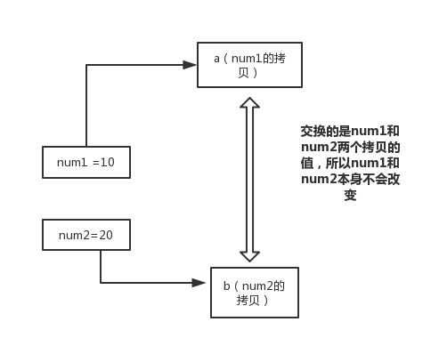
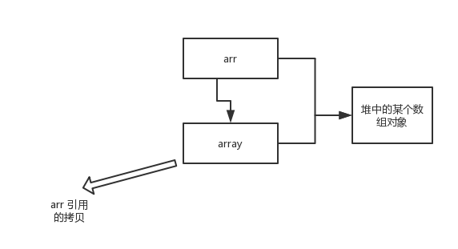
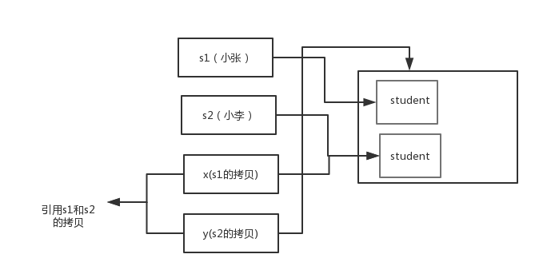

# JAVA基础问题
!!! question "成员变量与局部变量的区别有哪些？"
??? note "回答"
    1. 从语法形式上看:成员变量是属于类的，而局部变量是在方法中定义的变量或是方法的参数；成员变量可以被 `public`,`private`,`static` 等修饰符所修饰，而局部变量不能被访问控制修饰符及 `static` 所修饰；但是，成员变量和局部变量都能被 `final` 所修饰。
    2. 从变量在内存中的存储方式来看:如果成员变量是使用`static`修饰的，那么这个成员变量是属于类的，如果没有使用`static`修饰，这个成员变量是属于实例的。对象存于堆内存，如果局部变量类型为基本数据类型，那么存储在栈内存，如果为引用数据类型，那存放的是指向堆内存对象的引用或者是指向常量池中的地址。
    3. 从变量在内存中的生存时间上看:成员变量是对象的一部分，它随着对象的创建而存在，而局部变量随着方法的调用而自动消失。
    4. 成员变量如果没有被赋初值:则会自动以类型的默认值而赋值（一种情况例外:被 `final` 修饰的成员变量也必须显式地赋值），而局部变量则不会自动赋值。
    
!!! question "构造器 **Constructor** 是否可被 override"
??? note "回答"
    Constructor 不能被 override(重写),但是可以 overload(重载),所以你可以看到一个类中有多个构造函数的情况。
    
!!! question "==与equals区别"
??? note "回答"
    *  对于==，如果作用于基本数据类型的量，则直接比较其存储的 “值”是否相等；如果作用于引用类型的变量，则比较的是所指向的对象的地址
    *  对于equals方法，注意：equals方法不能作用于基本数据类型的变量;如果没有对equals方法进行重写，则比较的是引用类型的变量所指向的对象的地址；诸如String、Date等类对equals方法进行了重写的话，比较的是所指向的对象的内容。

!!! question "说一下hashcode的作用？为什么重写 equals 时必须重写 hashCode 方法"
??? note "回答"
    * **hashCode()介绍:**
    `hashCode()` 的作用是获取哈希码，也称为散列码；它实际上是返回一个 int 整数。这个哈希码的作用是确定该对象在哈希表中的索引位置。`hashCode()`定义在 JDK 的 `Object` 类中，这就意味着 Java 中的任何类都包含有 `hashCode()` 函数。另外需要注意的是： `Object` 的 hashcode 方法是本地方法，也就是用 c 语言或 c++ 实现的，该方法通常用来将对象的 内存地址 转换为整数之后返回。
    ```java
    public native int hashCode();
    ```
    散列表存储的是键值对(key-value)，它的特点是：能根据“键”快速的检索出对应的“值”。这其中就利用到了散列码！（可以快速找到所需要的对象）

    * **为什么要有 hashCode？**
    我们以“`HashSet` 如何检查重复”为例子来说明为什么要有 hashCode？
    当你把对象加入 `HashSet` 时，`HashSet` 会先计算对象的 hashcode 值来判断对象加入的位置，同时也会与其他已经加入的对象的 hashcode 值作比较，如果没有相符的 hashcode，`HashSet` 会假设对象没有重复出现。但是如果发现有相同 hashcode 值的对象，这时会调用 `equals()` 方法来检查 hashcode 相等的对象是否真的相同。如果两者相同，`HashSet` 就不会让其加入操作成功。如果不同的话，就会重新散列到其他位置。这样我们就大大减少了 equals 的次数，相应就大大提高了执行速度。
    * **为什么重写 `equals` 时必须重写 `hashCode` 方法？**
     如果两个对象相等，则 hashcode 一定也是相同的。两个对象相等,对两个对象分别调用 equals 方法都返回 true。但是，两个对象有相同的 hashcode 值，它们也不一定是相等的 。**因此，equals 方法被覆盖过，则 `hashCode` 方法也必须被覆盖。**
    > `hashCode()`的默认行为是对堆上的对象产生独特值。如果没有重写 `hashCode()`，则该 class 的两个对象无论如何都不会相等（即使这两个对象指向相同的数据）
    * **为什么两个对象有相同的 hashcode 值，它们也不一定是相等的？**
    因为 `hashCode()` 所使用的杂凑算法也许刚好会让多个对象传回相同的杂凑值。越糟糕的杂凑算法越容易碰撞，但这也与数据值域分布的特性有关（所谓碰撞也就是指的是不同的对象得到相同的 `hashCode`。
    我们刚刚也提到了 `HashSet`,如果 `HashSet` 在对比的时候，同样的 hashcode 有多个对象，它会使用 `equals()` 来判断是否真的相同。也就是说 `hashcode` 只是用来缩小查找成本。


!!! question "请手写equal方法【String类】，讲讲具体的原理？Object类的equla方法是怎样的？"
??? note "回答"
    * 代码如下所示
    ```java
    public boolean equals(Object anObject) {
      // 1、 跟自身比较
        if (this == anObject) {
            return true;
        }
        //  2、 否是字符串类型
        if (anObject instanceof String) {
            String anotherString = (String) anObject;
            int n = count;
            // 3、 是否长度一致
            if (n == anotherString.count) {
                int i = 0;
                while (n-- != 0) {
                  // 4、对比每个字符串
                    if (charAt(i) != anotherString.charAt(i))
                            return false;
                    i++;
                }
                return true;
            }
        }
        return false;
    }
    ```
    * Object类的equla方法是怎样的
    ```java
    public boolean equals(Object obj) {
        return (this == obj);
    }
    ```
!!! question "为什么 Java 中的 String 是不可变的（Immutable）？String不可变的好处？"
??? note "回答"
    * **不可变类String的原因**
        * String主要的三个成员变量 `char value[]`， `int offset`, `int count`均是private，final的，并且没有对应的 getter/setter;
        *  String 对象一旦初始化完成，上述三个成员变量就不可修改；并且其所提供的接口任何对这些域的修改都将返回一个新对象；
        *  是典型的 `Immutable` 类，被声明成为 `final class`，所有属性也都是final的。也由于它的不可变，类似拼接、裁剪字符串等动作，都会产生新的 String 对象。
    * **String不可变的好处**
        - **可以缓存 hash 值**
            -  因为 String 的 hash 值经常被使用，例如 String 用做 HashMap 的 key。不可变的特性可以使得 hash 值也不可变，因此只需要进行一次计算。
        - **String Pool 的需要**
            - 如果一个String对象已经被创建过了，那么就会从 String Pool 中取得引用。只有 String 是不可变的，才可能使用 String Pool。
        - **安全性**
          - String 经常作为参数，String 不可变性可以保证参数不可变。例如在作为网络连接参数的情况下如果 String 是可变的，那么在网络连接过程中，String 被改变，改变 String 对象的那一方以为现在连接的是其它主机，而实际情况却不一定是。
        - **线程安全**
          - String 不可变性天生具备线程安全，可以在多个线程中安全地使用。
    * **有什么办法能够改变String**
        * 通过反射来改变String的`value`变量 

!!! question "请说下String与StringBuffer区别"
??? note "回答"
    - String是字符串常量，而StringBuffer、StringBuilder都是字符串变量，即String对象一创建后不可更改，而后两者的对象是可更改的：
    - StringBuffer是线程安全的，而StringBuilder是非线程安全的，这是由于StringBuffer对方法加了同步锁或者对调用的方法加了同步锁
    - String更适用于少量的字符串操作的情况，StringBuilder适用于单线程下在字符缓冲区进行大量操作的情况，StringBuffer适用于多线程下在字符缓冲区进行大量操作的情况

!!! question "String a=""和String a=new String("")的的关系和异同"  
??? note "回答"
    - 通过`String a=""`直接赋值的方式得到的是一个字符串常量，存在于常量池；**注意，相同内容的字符串在常量池中只有一个，即如果池已包含内容相等的字符串会返回池中的字符串，反之会将该字符串放入池中**
    - 通过`new String("")`创建的字符串不是常量是实例对象，会在堆内存开辟空间并存放数据，且每个实例对象都有自己的地址空间      

!!! question "如何实现对象克隆？克隆有哪些方式？深克隆和浅克隆有何区别？"
??? note "回答"
    * **克隆有哪些方式**
        - 克隆（复制）在Java中是一种常见的操作，目的是快速获取一个对象副本。克隆分为深克隆和浅克隆。
        - 浅克隆：创建一个新对象，新对象的属性和原来对象完全相同，对于非基本类型属性，仍指向原有属性所指向的对象的内存地址。
        - 深克隆：创建一个新对象，属性中引用的其他对象也会被克隆，不再指向原有对象地址。
    * **深克隆和浅克隆有何区别**
        - 深浅克隆都会在堆中新分配一块区域，**区别在于对象属性引用的对象是否需要进行克隆（递归性的）**。
    * **Java的clone()方法**
       一般而言，clone（）方法满足
        - 1.对任何的对象x，都有`x.clone() !=x`  因为克隆对象与原对象不是同一个对象
        - 2.对任何的对象x，都有`x.clone().getClass()==x.getClass()` ,克隆对象与原对象的类型一样
        - 3. 如果对象x的equals()方法定义恰当，那么`x.clone().equals(x)`应该成立
    * **注意:**
        * 如果对象实现Cloneable并重写clone方法 **不进行任何操作** 时,调用clone是进行的浅克隆。而使用对象流将对象写入流然后再读出是进行的深克隆。
        * 基于序列化和反序列化实现的克隆不仅仅是深度克隆，更重要的是通过泛型限定，可以检查出要克隆的对象是否支持序列化，这项检查是编译器完成的，不是在运行时抛出异常，这种是方案明显优于使用Object类的clone方法克隆对象。
        
!!! question "new Integer(123) 与 Integer.valueOf(123)有何区别，请从底层实现分析两者区别？"
??? note "回答"
    * **区别在于：**
        * `new Integer(123)` 每次都会新建一个对象；
        * `Integer.valueOf(123)` 会使用缓存池中的对象，多次调用会取得同一个对象的引用。
    ```java
    Integer x = new Integer(123);
    Integer y = new Integer(123);
    System.out.println(x == y);    // false
    Integer z = Integer.valueOf(123);
    Integer k = Integer.valueOf(123);
    System.out.println(z == k);   // true
    ```
    
    * **valueOf() 实现原理**
    valueOf() 方法的实现比较简单，就是先判断值是否在缓存池中，如果在的话就直接返回缓存池的内容。
    ```java
    public static Integer valueOf(int i) {
        if (i >= IntegerCache.low && i <= IntegerCache.high)
            return IntegerCache.cache[i + (-IntegerCache.low)];
        return new Integer(i);
    }
    ```
    
        * 在 Java 8 中，Integer 缓存池的大小默认为 -128~127。
        ```java
        static final int low = -128;
        static final int high;
        static final Integer cache[];
        
        static {
            // high value may be configured by property
            int h = 127;
            String integerCacheHighPropValue =
                sun.misc.VM.getSavedProperty("java.lang.Integer.IntegerCache.high");
            if (integerCacheHighPropValue != null) {
                try {
                    int i = parseInt(integerCacheHighPropValue);
                    i = Math.max(i, 127);
                    // Maximum array size is Integer.MAX_VALUE
                    h = Math.min(i, Integer.MAX_VALUE - (-low) -1);
                } catch( NumberFormatException nfe) {
                    // If the property cannot be parsed into an int, ignore it.
                }
            }
            high = h;
        
            cache = new Integer[(high - low) + 1];
            int j = low;
            for(int k = 0; k < cache.length; k++)
                cache[k] = new Integer(j++);
        
            // range [-128, 127] must be interned (JLS7 5.1.7)
            assert IntegerCache.high >= 127;
        }
        ```
        
        * 编译器会在自动装箱过程调用 valueOf() 方法，因此多个Integer实例使用自动装箱来创建并且值相同，那么就会引用相同的对象。
        ```java
        Integer m = 123;
        Integer n = 123;
        System.out.println(m == n); // true
        ```
    
        * 基本类型对应的缓冲池如下：
            - boolean values true and false
            - all byte values
            - short values between -128 and 127
            - int values between -128 and 127
            - char in the range \u0000 to \u007F
            
        在使用这些基本类型对应的包装类型时，就可以直接使用缓冲池中的对象。
    
!!! question "说一下对final的理解"
??? note "回答"
    * final 关键字主要⽤在三个地⽅：变量、⽅法、类。
        *  对于⼀个 final 变量，如果是基本数据类型的变量，则其数值⼀旦在初始化之后便不能更 改；如果是引⽤类型的变量，则在对其初始化之后便不能再让其指向另⼀个对象。 
        *  当⽤ final 修饰⼀个类时，表明这个类不能被继承。final 类中的所有成员⽅法都会被隐式地 指定为 final ⽅法。 
        *  使⽤ final ⽅法的原因有两个。第⼀个原因是把⽅法锁定，以防任何继承类修改它的含义； 第⼆个原因是效率。在早期的 Java 实现版本中，会将 final ⽅法转为内嵌调⽤。但是如果⽅ 法过于庞⼤，可能看不到内嵌调⽤带来的任何性能提升（现在的 Java 版本已经不需要使⽤ final ⽅法进⾏这些优化了）。类中所有的 private ⽅法都隐式地指定为 final。
        
!!! question "为什么Java中只有值传递"
??? note "回答"
    * **值传递**
        *  **按值调⽤ (call by value)** 表示⽅法接收的是调⽤者提供的值，⽽ **按引⽤调⽤（call by reference)** 表示⽅法接收的是调⽤者提供的变量地址。⼀个⽅法可以修改传递引⽤所对应的变量值，⽽不能修改传递值调⽤所对应的变量值。 **Java 程序设计语⾔总是采⽤按值调⽤。也就是说，⽅法得到的是所有参数值的⼀个拷⻉，也就是说，⽅法不能修改传递给它的任何参数变量的内容。**
    * 示例
        * **下面通过 3 个例子来给说明**
        
    **example 1**
    ```java
    public static void main(String[] args) {
        int num1 = 10;
        int num2 = 20;
    
        swap(num1, num2);
    
        System.out.println("num1 = " + num1);
        System.out.println("num2 = " + num2);
    }
    
    public static void swap(int a, int b) {
        int temp = a;
        a = b;
        b = temp;
        System.out.println("a = " + a);
        System.out.println("b = " + b);
    }
    ```
    **结果：**
    ```
    a = 20
    b = 10
    num1 = 10
    num2 = 20
    ```
    **解析：**
    
    
    在 swap 方法中，a、b 的值进行交换，并不会影响到 num1、num2。因为，a、b 中的值，只是从 num1、num2 的复制过来的。也就是说，a、b 相当于 num1、num2 的副本，副本的内容无论怎么修改，都不会影响到原件本身。
    
    **通过上面例子，我们已经知道了一个方法不能修改一个基本数据类型的参数，而对象引用作为参数就不一样，请看 example2.**
    
    > **example 2**
    
    ```java
    	public static void main(String[] args) {
    		int[] arr = { 1, 2, 3, 4, 5 };
    		System.out.println(arr[0]);
    		change(arr);
    		System.out.println(arr[0]);
    	}
    
    	public static void change(int[] array) {
    		// 将数组的第一个元素变为0
    		array[0] = 0;
    	}
    ```
    
    **结果：**
    
    ```
    1
    0
    ```
    
    **解析：**
    
    
    
    array 被初始化 arr 的拷贝也就是一个对象的引用，也就是说 array 和 arr 指向的是同一个数组对象。 因此，外部对引用对象的改变会反映到所对应的对象上。
    
    **通过 example2 我们已经看到，实现一个改变对象参数状态的方法并不是一件难事。理由很简单，方法得到的是对象引用的拷贝，对象引用及其他的拷贝同时引用同一个对象。**
    
    **很多程序设计语言（特别是，C++和 Pascal)提供了两种参数传递的方式：值调用和引用调用。有些程序员认为 Java 程序设计语言对对象采用的是引用调用，实际上，这种理解是不对的。由于这种误解具有一定的普遍性，所以下面给出一个反例来详细地阐述一下这个问题。**
    
    > **example 3**
    
    ```java
    public class Test {
    
    	public static void main(String[] args) {
    		// TODO Auto-generated method stub
    		Student s1 = new Student("小张");
    		Student s2 = new Student("小李");
    		Test.swap(s1, s2);
    		System.out.println("s1:" + s1.getName());
    		System.out.println("s2:" + s2.getName());
    	}
    
    	public static void swap(Student x, Student y) {
    		Student temp = x;
    		x = y;
    		y = temp;
    		System.out.println("x:" + x.getName());
    		System.out.println("y:" + y.getName());
    	}
    }
    ```
    
    **结果：**
    
    ```
    x:小李
    y:小张
    s1:小张
    s2:小李
    ```
    
    **解析：**
    
    交换之前：
    
    
    
    交换之后：
    
    
    
    通过上面两张图可以很清晰的看出： **方法并没有改变存储在变量 s1 和 s2 中的对象引用。swap 方法的参数 x 和 y 被初始化为两个对象引用的拷贝，这个方法交换的是这两个拷贝**
    
    > **总结**
    
    Java 程序设计语言对对象采用的不是引用调用，实际上，对象引用是按
    值传递的。
    
    下面再总结一下 Java 中方法参数的使用情况：
    
    - **一个方法不能修改一个基本数据类型的参数（即数值型或布尔型）**。
    - **一个方法可以改变一个对象参数的状态。**
    - **一个方法不能让对象参数引用一个新的对象。**

!!! question "说一下异常处理机制？"
??? note "回答"
    * Java 异常类层次结构
    
    在 Java 中，所有的异常都有一个共同的祖先 `java.lang` 包中的 `Throwable` 类。`Throwable` 类有两个重要的子类 `Exception`（异常）和 `Error`（错误）。`Exception` 能被程序本身处理(`try-catch`)， `Error` 是无法处理的(只能尽量避免)。
    `Exception` 和 `Error` 二者都是 Java 异常处理的重要子类，各自都包含大量子类。
        - **`Exception`** :程序本身可以处理的异常，可以通过 `catch` 来进行捕获。`Exception` 又可以分为 受检查异常(必须处理) 和 不受检查异常(可以不处理)。
        - **`Error`** ：`Error` 属于程序无法处理的错误 ，我们没办法通过 `catch` 来进行捕获 。例如，Java 虚拟机运行错误（`Virtual MachineError`）、虚拟机内存不够错误(`OutOfMemoryError`)、类定义错误（`NoClassDefFoundError`）等 。这些异常发生时，Java 虚拟机（JVM）一般会选择线程终止。

!!! question "Java中检查异常和非检查异常的区别"
??? note "回答"    
    * **受检查异常**
    Java 代码在编译过程中，如果受检查异常没有被 `catch`/`throw` 处理的话，就没办法通过编译 。比如下面这段 IO 操作的代码。
    除了`RuntimeException`及其子类以外，其他的`Exception`类及其子类都属于检查异常 。常见的受检查异常有： IO 相关的异常、`ClassNotFoundException` 、`SQLException`...。
    * **不受检查异常**
    Java 代码在编译过程中 ，我们即使不处理不受检查异常也可以正常通过编译。
    `RuntimeException` 及其子类都统称为非受检查异常，例如：`NullPoin​terException`、`NumberFormatException`（字符串转换为数字）、`ArrayIndexOutOfBoundsException`（数组越界）、`ClassCastException`（类型转换错误）、`ArithmeticException`（算术错误）等。

!!! question "什么情况下 finally 块不会被执行"
??? note "回答"
    1. 在 `try` 或 `finally `块中用了 `System.exit(int)`退出程序。但是，如果 `System.exit(int)` 在异常语句之后，`finally` 还是会被执行
    2. 程序所在的线程死亡。
    3. 关闭 CPU。

!!! question "当在 try 块或 catch 块中遇到 return 语句时 finally 块会不会被执行"
??? note "回答"
    会，在方法返回之前，finally 语句的内容将被执行，并且 finally 语句的返回值将会覆盖原始的返回值。
    ```java 
        public static int f(int value) {
        try {
            return value * value;
        } finally {
            if (value == 2) {
                return 0;
            }
        }
    }
    ```
    如果调用 `f(2)`，返回值将是 0，因为 finally 语句的返回值覆盖了 try 语句块的返回值。

!!! question "说下IO流"
??? note "回答"
    - 按照流的流向分，可以分为输入流和输出流；
    - 按照操作单元划分，可以划分为字节流和字符流；
    - 按照流的角色划分为节点流和处理流。

    Java Io 流共涉及 40 多个类，这些类看上去很杂乱，但实际上很有规则，而且彼此之间存在非常紧密的联系， Java I0 流的 40 多个类都是从如下 4 个抽象类基类中派生出来的。

    - InputStream/Reader: 所有的输入流的基类，前者是字节输入流，后者是字符输入流。
    - OutputStream/Writer: 所有输出流的基类，前者是字节输出流，后者是字符输出流。
    
!!! question "既然有了字节流,为什么还要有字符流?"
??? note "回答"
    问题本质想问：**不管是文件读写还是网络发送接收，信息的最小存储单元都是字节，那为什么 I/O 流操作要分为字节流操作和字符流操作呢？**

    字符流是由 Java 虚拟机将字节转换得到的，问题就出在这个过程还算是非常耗时，并且，如果我们不知道编码类型就很容易出现乱码问题。所以， I/O 流就干脆提供了一个直接操作字符的接口，方便我们平时对字符进行流操作。如果音频文件、图片等媒体文件用字节流比较好，如果涉及到字符的话使用字符流比较好。

!!! question "BIO,NIO,AIO 有什么区别?"
??? note "回答"
    - **BIO (Blocking I/O):** 同步阻塞 I/O 模式，数据的读取写入必须阻塞在一个线程内等待其完成。在活动连接数不是特别高（小于单机 1000）的情况下，这种模型是比较不错的，可以让每一个连接专注于自己的 I/O 并且编程模型简单，也不用过多考虑系统的过载、限流等问题。线程池本身就是一个天然的漏斗，可以缓冲一些系统处理不了的连接或请求。但是，当面对十万甚至百万级连接的时候，传统的 BIO 模型是无能为力的。因此，我们需要一种更高效的 I/O 处理模型来应对更高的并发量。
    - **NIO (Non-blocking/New I/O):** NIO 是一种同步非阻塞的 I/O 模型，在 Java 1.4 中引入了 NIO 框架，对应 java.nio 包，提供了 Channel , Selector，Buffer 等抽象。NIO 中的 N 可以理解为 Non-blocking，不单纯是 New。它支持面向缓冲的，基于通道的 I/O 操作方法。 NIO 提供了与传统 BIO 模型中的 `Socket` 和 `ServerSocket` 相对应的 `SocketChannel` 和 `ServerSocketChannel` 两种不同的套接字通道实现,两种通道都支持阻塞和非阻塞两种模式。阻塞模式使用就像传统中的支持一样，比较简单，但是性能和可靠性都不好；非阻塞模式正好与之相反。对于低负载、低并发的应用程序，可以使用同步阻塞 I/O 来提升开发速率和更好的维护性；对于高负载、高并发的（网络）应用，应使用 NIO 的非阻塞模式来开发
    - **AIO (Asynchronous I/O):** AIO 也就是 NIO 2。在 Java 7 中引入了 NIO 的改进版 NIO 2,它是异步非阻塞的 IO 模型。异步 IO 是基于事件和回调机制实现的，也就是应用操作之后会直接返回，不会堵塞在那里，当后台处理完成，操作系统会通知相应的线程进行后续的操作。AIO 是异步 IO 的缩写，虽然 NIO 在网络操作中，提供了非阻塞的方法，但是 NIO 的 IO 行为还是同步的。对于 NIO 来说，我们的业务线程是在 IO 操作准备好时，得到通知，接着就由这个线程自行进行 IO 操作，IO 操作本身是同步的。

