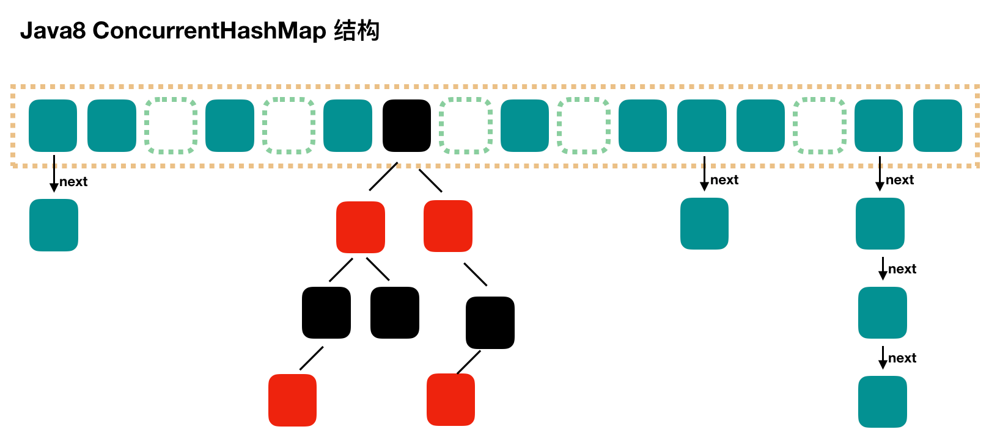
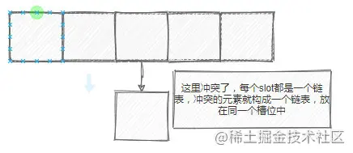
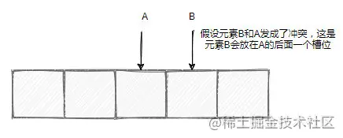

# Java 集合
!!! question "容器中的设计模式"
??? noet "回答"
    * **迭代器模式**
        * Collection 继承了 Iterable 接口，其中的 iterator() 方法能够产生一个 Iterator 对象，通过这个对象就可以迭代遍历 Collection 中的元素。
    * **适配器模式**
        * `java.util.Arrays#asList()` 可以把数组类型转换为 List 类型。

!!! question "ArrayList 与 Vector、LinkedList 区别"
??? noet "回答"
    * ArrayList 是 List 的主要实现类，底层使用 `Object[ ]`存储，支持随机访问，适用于频繁的查找工作，线程不安全
    * Vector 是 List 的古老实现类，底层使用 `Object[ ]` 存储，线程安全的
    * LinkedList基于双向链表实现，只能顺序访问，但是可以快速地在链表中间插入和删除元素。不仅如此，LinkedList 还可以用作栈、队列和双向队列

!!! question "说一说 ArrayList 的扩容机制吧"
??? noet "回答"
    * 添加元素时使用 `ensureCapacityInternal()` 方法来保证容量足够，如果不够时，需要使用 `grow()` 方法进行扩容，新容量的大小为 `oldCapacity + (oldCapacity >> 1)`，即 `oldCapacity+oldCapacity/2`。其中 oldCapacity >> 1 需要取整，所以新容量大约是旧容量的 1.5 倍左右。（oldCapacity 为偶数就是 1.5 倍，为奇数就是 1.5 倍-0.5）
    * 扩容操作需要调用 Arrays.copyOf() 把原数组整个复制到新数组中，这个操作代价很高，因此最好在创建 ArrayList 对象时就指定大概的容量大小，减少扩容操作的次数
    ```java
    public boolean add(E e) {
    ensureCapacityInternal(size + 1);  // Increments modCount!!
    elementData[size++] = e;
    return true;
    }

    private void ensureCapacityInternal(int minCapacity) {
        if (elementData == DEFAULTCAPACITY_EMPTY_ELEMENTDATA) {
            minCapacity = Math.max(DEFAULT_CAPACITY, minCapacity);
        }
        ensureExplicitCapacity(minCapacity);
    }
    
    private void ensureExplicitCapacity(int minCapacity) {
        modCount++;
        // overflow-conscious code
        if (minCapacity - elementData.length > 0)
            grow(minCapacity);
    }
    
    private void grow(int minCapacity) {
        // overflow-conscious code
        int oldCapacity = elementData.length;
        int newCapacity = oldCapacity + (oldCapacity >> 1);
        if (newCapacity - minCapacity < 0)
            newCapacity = minCapacity;
        if (newCapacity - MAX_ARRAY_SIZE > 0)
            newCapacity = hugeCapacity(minCapacity);
        // minCapacity is usually close to size, so this is a win:
        elementData = Arrays.copyOf(elementData, newCapacity);
    }
    ```

!!! question "HashMap 和 Hashtable 的区别"
??? noet "回答"
    * **线程是否安全**： HashMap 是非线程安全的，HashTable 是线程安全的,因为 HashTable 内部的方法基本都经过synchronized 修饰。
    * **效率**： 因为线程安全的问题，HashMap 要比 HashTable 效率高一点。另外，HashTable 基本被淘汰，不要在代码中使用它；
    * **对 Null key 和 Null value 的支持**： HashMap 可以存储 null 的 key 和 value，但 null 作为键只能有一个，null 作为值可以有多个；HashTable 不允许有 null 键和 null 值，否则会抛出 NullPointerException。
    * **初始容量大小和每次扩充容量大小的不同** ： ① 创建时如果不指定容量初始值，Hashtable 默认的初始大小为 11，之后每次扩充，容量变为原来的 2n+1。HashMap 默认的初始化大小为 16。之后每次扩充，容量变为原来的 2 倍。② 创建时如果给定了容量初始值，那么 Hashtable 会直接使用你给定的大小，而 HashMap 会将其扩充为 2 的幂次方大小
    * **底层数据结构**： JDK1.8 以后的 HashMap 在解决哈希冲突时有了较大的变化，当链表长度大于阈值（默认为 8）（将链表转换成红黑树前会判断，如果当前数组的长度小于 64，那么会选择先进行数组扩容，而不是转换为红黑树）时，将链表转化为红黑树，以减少搜索时间。Hashtable 没有这样的机制。

!!! question "HashMap 和 HashSet区别"
??? noet "回答"
    HashSet 底层就是基于 HashMap 实现的。（HashSet 的源码非常非常少，因为除了 clone()、writeObject()、readObject()是 HashSet 自己不得不实现之外，其他方法都是直接调用 HashMap 中的方法。

!!! question "HashMap的底层实现"
??? noet "回答"
    * **JDK1.8 之前**
    JDK1.8 之前 `HashMap` 底层是 **数组和链表** 结合在一起使用也就是 **链表散列**。**HashMap 通过 key 的 hashCode 经过扰动函数处理过后得到 hash 值，然后通过 (n - 1) & hash 判断当前元素存放的位置（这里的 n 指的是数组的长度），如果当前位置存在元素的话，就判断该元素与要存入的元素的 hash 值以及 key 是否相同，如果相同的话，直接覆盖，不相同就通过拉链法解决冲突。**

    **所谓扰动函数指的就是 HashMap 的 hash 方法。使用 hash 方法也就是扰动函数是为了防止一些实现比较差的 hashCode() 方法 换句话说使用扰动函数之后可以减少碰撞。**
    **JDK 1.8 HashMap 的 hash 方法源码:**
    
    JDK 1.8 的 hash 方法 相比于 JDK 1.7 hash 方法更加简化，但是原理不变。
    
    ```java
        static final int hash(Object key) {
        int h;
        // key.hashCode()：返回散列值也就是hashcode
        // ^ ：按位异或
        // >>>:无符号右移，忽略符号位，空位都以0补齐
        return (key == null) ? 0 : (h = key.hashCode()) ^ (h >>> 16);
    }
    ```
    
    对比一下 JDK1.7 的 HashMap 的 hash 方法源码.
    
    ```java
    static int hash(int h) {
        // This function ensures that hashCodes that differ only by
        // constant multiples at each bit position have a bounded
        // number of collisions (approximately 8 at default load factor).
    
        h ^= (h >>> 20) ^ (h >>> 12);
        return h ^ (h >>> 7) ^ (h >>> 4);
    }
    ```
    
    相比于 JDK1.8 的 hash 方法 ，JDK 1.7 的 hash 方法的性能会稍差一点点，因为毕竟扰动了 4 次。
    
    所谓 **“拉链法”** 就是：将链表和数组相结合。也就是说创建一个链表数组，数组中每一格就是一个链表。若遇到哈希冲突，则将冲突的值加到链表中即可。
    
    
    * **JDK1.8 之后**
    相比于之前的版本， JDK1.8 之后在解决哈希冲突时有了较大的变化，当链表长度大于阈值（默认为 8）（将链表转换成红黑树前会判断，如果当前数组的长度小于 64，那么会选择先进行数组扩容，而不是转换为红黑树）时，将链表转化为红黑树，以减少搜索时间。
    
    > TreeMap、TreeSet 以及 JDK1.8 之后的 HashMap 底层都用到了红黑树。红黑树就是为了解决二叉查找树的缺陷，因为二叉查找树在某些情况下会退化成一个线性结构。

!!! question "HashMap 的长度为什么是2的幂次方"
??? noet "回答"
    为了能让 HashMap 存取高效，尽量较少碰撞，也就是要尽量把数据分配均匀。我们上面也讲到了过了，Hash 值的范围值-2147483648到2147483647，前后加起来大概40亿的映射空间，只要哈希函数映射得比较均匀松散，一般应用是很难出现碰撞的。但问题是一个40亿长度的数组，内存是放不下的。所以这个散列值是不能直接拿来用的。用之前还要先做对数组的长度取模运算，得到的余数才能用来要存放的位置也就是对应的数组下标。这个数组下标的计算方法是“ `(n - 1) & hash`”。（n代表数组长度）。这也就解释了 HashMap 的长度为什么是2的幂次方。

    **这个算法应该如何设计呢？**
    
    我们首先可能会想到采用%取余的操作来实现。但是，重点来了：**“取余(%)操作中如果除数是2的幂次则等价于与其除数减一的与(&)操作（也就是说 hash%length==hash&(length-1)的前提是 length 是2的 n 次方；）。”** 并且 **采用二进制位操作 &，相对于%能够提高运算效率，这就解释了 HashMap 的长度为什么是2的幂次方。**

!!! question "HashMap 多线程操作导致死循环问题"
??? noet "回答"
    主要原因在于 并发下的Rehash 会造成元素之间会形成一个循环链表。不过，jdk 1.8 后解决了这个问题，但是还是不建议在多线程下使用 HashMap,因为多线程下使用 HashMap 还是会存在其他问题比如数据丢失。并发环境下推荐使用 ConcurrentHashMap 。

!!! question "说一下ConcurrentHashMap"
??? noet "回答"
    * **JDK1.8之前**
    
    底层采用 `分段的数组+链表` 实现， 首先将数据分为一段一段的存储，然后给每一段数据配一把锁，当一个线程占用锁访问其中一个段数据时，其他段的数据也能被其他线程访问
    **`ConcurrentHashMap` 是由 `Segment` 数组结构和 `HashEntry` 数组结构组成**。
    Segment 实现了 `ReentrantLock`,所以 `Segment` 是一种可重入锁，扮演锁的角色。`HashEntry` 用于存储键值对数据。
    ```java
    static class Segment<K,V> extends ReentrantLock implements Serializable {
    }
    ```
    一个 `ConcurrentHashMap` 里包含一个 `Segment` 数组。`Segment` 的结构和 `HashMap` 类似，是一种数组和链表结构，一个 `Segment` 包含一个 `HashEntry` 数组，每个 `HashEntry` 是一个链表结构的元素，每个 `Segment` 守护着一个 `HashEntry` 数组里的元素，当对 `HashEntry` 数组的数据进行修改时，必须首先获得对应的 `Segment` 的锁。

    * **JDK1.8之后**
    
    `ConcurrentHashMap` 取消了 `Segment` 分段锁，采用 CAS 和 `synchronized` 来保证并发安全。数据结构跟 HashMap1.8 的结构类似，数组+链表/红黑二叉树。Java 8 在链表长度超过一定阈值（8）时将链表（寻址时间复杂度为 O(N)）转换为红黑树（寻址时间复杂度为 O(log(N))）
    `synchronized` 只锁定当前链表或红黑二叉树的首节点，这样只要 hash 不冲突，就不会产生并发，效率又提升 N 倍（JDK1.6 以后 对 synchronized 锁做了很多优化） 。


!!! question "说一下WeakHashMap"
??? noet "回答"
    * **原理**： WeakHashMap 的 Entry 继承自 WeakReference，被 WeakReference 关联的对象在下一次垃圾回收时会被回收。
    
    * **作用**： WeakHashMap 主要用来实现缓存，通过使用 WeakHashMap 来引用缓存对象，由 JVM 对这部分缓存进行回收。
    ```java
    private static class Entry<K,V> extends WeakReference<Object> implements Map.Entry<K,V>
    ```
    
     * **Entry的Value是否会导致内存泄漏**：WeakHashMap会在在访问内容（`put`,`get`）的时候释放内部不用的对象（实则是通过访问调用了它的`expungeStaleEntries`函数）
    ```java
        private void expungeStaleEntries() {
        for (Object x; (x = queue.poll()) != null; ) {
            synchronized (queue) {
                @SuppressWarnings("unchecked")
                    Entry<K,V> e = (Entry<K,V>) x;
                int i = indexFor(e.hash, table.length);
                  Entry<K,V> prev = table[i];
                Entry<K,V> p = prev;
                while (p != null) {
                    Entry<K,V> next = p.next;
                    if (p == e) {
                        if (prev == e)
                            table[i] = next;
                        else
                            prev.next = next;
                        // Must not null out e.next;
                        // stale entries may be in use by a HashIterator
                        e.value = null; // Help GC
                        size--;
                        break;
                    }
                    prev = p;
                    p = next;
                }
            }
        }
    }
    ```
    
!!! question "说一下LinkedHashMap"
??? noet "回答"
    * 继承自 HashMap，因此具有和 HashMap 一样的快速查找特性。
    * 内部维护了一个双向链表，用来维护插入顺序或者 LRU 顺序。
    * 当维护 LRU 顺序时可以实现LRU缓存
        * 当一个节点被访问时，通过`afterNodeAccess`方法保证在每次访问一个节点时，会将这个节点移到链表尾部，保证链表尾部是最近访问的节点，那么链表首部就是最近最久未使用的节点。
        * `afterNodeInsertion`在 put 等操作之后执行，当 `removeEldestEntry()` 方法返回 true 时会移除最晚的节点，也就是链表首部节点 first
    * LRU 示例
    ```java
    class LRUCache<K, V> extends LinkedHashMap<K, V> {
        private static final int MAX_ENTRIES = 3;

        protected boolean removeEldestEntry(Map.Entry eldest) {
            return size() > MAX_ENTRIES;
        }
    
        LRUCache() {
            super(MAX_ENTRIES, 0.75f, true);
        }
    }
    ```


!!! question "说一下CopyOnWriteArrayList"
??? noet "回答" 
    * 读写分离
    写操作在一个复制的数组上进行，读操作还是在原始数组中进行，读写分离，互不影响。
    写操作需要加锁，防止并发写入时导致写入数据丢失。
    写操作结束之后需要把原始数组指向新的复制数组。
    * 适用场景
    CopyOnWriteArrayList 在写操作的同时允许读操作，大大提高了读操作的性能，因此很适合读多写少的应用场景。
    但是 CopyOnWriteArrayList 有其缺陷：
        * 内存占用：在写操作时需要复制一个新的数组，使得内存占用为原来的两倍左右；
        * 数据不一致：读操作不能读取实时性的数据，因为部分写操作的数据还未同步到读数组中。
    > 所以 CopyOnWriteArrayList 不适合内存敏感以及对实时性要求很高的场景。

!!! question "说一下CopyOnWriteArrayList和读写锁区别"
??? noet "回答" 
	* 相同点：1. 两者都是通过读写分离的思想实现；2.读线程间是互不阻塞的
	* 不同点：**对读写锁而言，为了实现数据实时性，在写锁被获取后，读线程会等待或者当读锁被获取后，写线程会等待，从而解决“脏读”等问题。也就是说如果使用读写锁依然会出现读线程阻塞等待的情况。而 COW 则完全放开了牺牲数据实时性而保证数据最终一致性，即读线程对数据的更新是延时感知的，因此读线程不会存在等待的情况。**


!!! question "比较 HashSet、LinkedHashSet 和 TreeSet 三者的异同"
??? noet "回答"
    * **TreeSet**：基于红黑树实现，支持有序性操作，例如根据一个范围查找元素的操作。但是查找效率不如 HashSet，HashSet 查找的时间复杂度为 O(1)，TreeSet 则为 O(logN)。
    * **HashSet**：基于哈希表实现，支持快速查找，但不支持有序性操作。并且失去了元素的插入顺序信息，也就是说使用 Iterator 遍历 HashSet 得到的结果是不确定的。
    * **LinkedHashSet**：具有 HashSet 的查找效率，并且内部使用双向链表维护元素的插入顺序。

!!! question "说一下ThreadLocal"
??? noet "回答"
    * **使用**
    
	 通常情况下，我们创建的变量是可以被任何一个线程访问并修改的。**如果想实现每一个线程都有自己的专属本地变量该如何解决呢？** JDK 中提供的`ThreadLocal`类正是为了解决这样的问题。 **`ThreadLocal`类主要解决的就是让每个线程绑定自己的值，可以将`ThreadLocal`类形象的比喻成存放数据的盒子，盒子中可以存储每个线程的私有数据。**
	 
	 **ThreadLocal 不是用来解决共享对象的多线程访问问题的**，数据实质上是放在每个 thread 实例引用的 threadLocalMap,也就是说**每个不同的线程都拥有专属于自己的数据容器（threadLocalMap），彼此不影响**。因此 threadLocal 只适用于 **共享对象会造成线程安全** 的业务场景。
	 
	 * **实现原理**
	 
	我们先从最基本的get()方法说起：
	```java
	    public T get() {
	      //获得当前线程
	      Thread t = Thread.currentThread();
	      //每个线程 都有一个自己的ThreadLocalMap，
	      //ThreadLocalMap里就保存着所有的ThreadLocal变量
	      ThreadLocalMap map = getMap(t);
	      if (map != null) {
	          //ThreadLocalMap的key就是当前ThreadLocal对象实例，
	          //多个ThreadLocal变量都是放在这个map中的
	          ThreadLocalMap.Entry e = map.getEntry(this);
	          if (e != null) {
	              @SuppressWarnings("unchecked")
	              //从map里取出来的值就是我们需要的这个ThreadLocal变量
	              T result = (T)e.value;
	              return result;
	          }
	      }
	      // 如果map没有初始化，那么在这里初始化一下
	      return setInitialValue();
	  }
	```
	可以看到，每个Thread中都具备一个`ThreadLocalMap`，而 **ThreadLocalMap可以存储以ThreadLocal为 key ，Object 对象为 value 的键值对**
	
	* **内存泄漏问题**
	
	ThreadLocal.ThreadLocalMap是一个比较特殊的Map，它的每个Entry的key都是一个弱引用：
	```java
	     static class Entry extends WeakReference<ThreadLocal<?>> {
	      /** The value associated with this ThreadLocal. */
	      Object value;
	      //key就是一个弱引用
	      Entry(ThreadLocal<?> k, Object v) {
	          super(k);
	          value = v;
	      }
	  }
	```
	
	这样设计的好处是，如果这个变量不再被其他对象使用时，可以自动回收这个ThreadLocal对象，避免可能的内存泄露。
	
	虽然ThreadLocalMap中的key是弱引用，当不存在外部强引用的时候，就会自动被回收，但是Entry中的value依然是强引用。
	
	这样一来，`ThreadLocalMap` 中就会出现 key 为 null 的 Entry。假如我们不做任何措施的话，value 永远无法被 GC 回收，这个时候就可能会产生内存泄露。ThreadLocalMap 实现中已经考虑了这种情况，在调用 `set()`、`get()`、`remove()` 方法的时候，会清理掉 key 为 null 的记录。
	
	以getEntry()为例：
	
	```java
	 private Entry getEntry(ThreadLocal<?> key) {
	  int i = key.threadLocalHashCode & (table.length - 1);
	  Entry e = table[i];
	  if (e != null && e.get() == key)
	      //如果找到key，直接返回
	      return e;
	  else
	      //如果找不到，就会尝试清理，如果你总是访问存在的key，那么这个清理永远不会进来
	      return getEntryAfterMiss(key, i, e);
	}
	```
	
	下面是getEntryAfterMiss()的实现：
	
	```java
	private Entry getEntryAfterMiss(ThreadLocal<?> key, int i, Entry e) {
	  Entry[] tab = table;
	  int len = tab.length;
	
	  while (e != null) {
	      // 整个e是entry ，也就是一个弱引用
	      ThreadLocal<?> k = e.get();
	      //如果找到了，就返回
	      if (k == key)
	          return e;
	      if (k == null)
	          //如果key为null，说明弱引用已经被回收了
	          //那么就要在这里回收里面的value了
	          expungeStaleEntry(i);
	      else
	          //如果key不是要找的那个，那说明有hash冲突，这里是处理冲突，找下一个entry
	          i = nextIndex(i, len);
	      e = tab[i];
	  }
	  return null;
	}
	```
	
	真正用来回收value的是expungeStaleEntry()方法，在remove()和set()方法中，都会直接或者间接调用到这个方法进行value的清理：
	
	从这里可以看到，ThreadLocal为了避免内存泄露，也算是花了一番大心思。不仅使用了弱引用维护key，还会在每个操作上检查key是否被回收，进而再回收value。
	
	但是从中也可以看到，ThreadLocal并不能100%保证不发生内存泄漏。
	
	比如，很不幸的，你的get()方法总是访问固定几个一直存在的ThreadLocal，那么清理动作就不会执行，如果你没有机会调用set()和remove()，那么这个内存泄漏依然会发生。
	
	因此，一个良好的习惯依然是：**当你不需要这个ThreadLocal变量时，主动调用remove()，这样对整个系统是有好处的**。
	
	* **Hash冲突处理**
	
	ThreadLocalMap作为一个HashMap和java.util.HashMap的实现是不同的。对于java.util.HashMap使用的是链表法来处理冲突：
	
	
	
	但是，对于ThreadLocalMap，它使用的是简单的线性探测法，如果发生了元素冲突，那么就使用下一个槽位存放：
	
	
	
	之所以采用不同的方式主要是因为：**在 ThreadLocalMap 中的散列值分散的十分均匀，很少会出现冲突。并且 ThreadLocalMap 经常需要清除无用的对象，使用纯数组更加方便。**
