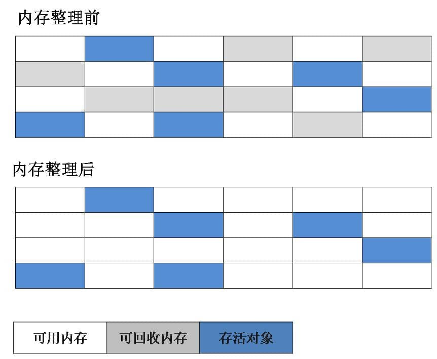
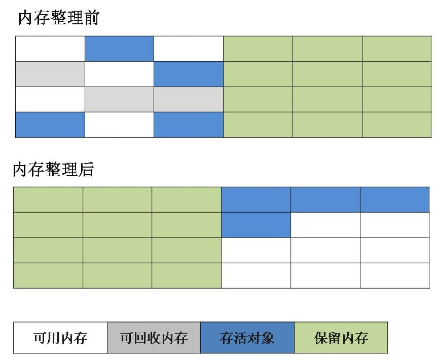

# JVM 相关
!!! question "介绍下 Java 内存区域(运行时数据区)"
??? note "回答"
    Java虚拟机管理的内存包括几个运行时数据内存：**方法区、虚拟机栈、本地方法栈、堆、程序计数器，其中方法区和堆是由线程共享的数据区，其他几个是线程隔离的数据区**
    
    * **程序计数器** 程序计数器是一块较小的内存，他可以看做是当前线程所执行的行号指示器。字节码解释器工作的时候就是通过改变这个计数器的值来选取下一条需要执行的字节码的指令，分支、循环、跳转、异常处理、线程恢复等基础功能都需要依赖这个计数器来完成。如果线程正在执行的是一个Java方法，这个计数器记录的是正在执行的虚拟机字节码指令的地址；如果正在执行的是Native方法，这个计数器则为空。此内存区域是唯一一个在Java虚拟机规范中没有规定任何OutOfMemotyError情况的区域
    
    * **Java虚拟机栈** 虚拟机栈描述的是Java方法执行的内存模型：每个方法在执行的同时都会创建一个栈帧用于储存局部变量表、操作数栈、动态链接、方法出口等信息。每个方法从调用直至完成的过程，就对应着一个栈帧在虚拟机栈中入栈到出栈的过程。栈内存就是虚拟机栈，或者说是虚拟机栈中局部变量表的部分。局部变量表存放了编辑期可知的各种基本数据类型（boolean、byte、char、short、int、float、long、double）、对象引用（refrence）类型和returnAddress类型（指向了一条字节码指令的地址）。其中64位长度的long和double类型的数据会占用两个局部变量空间，其余的数据类型只占用1个。Java虚拟机规范对这个区域规定了两种异常状况：如果线程请求的栈深度大于虚拟机所允许的深度，将抛出StackOverflowError异常。如果虚拟机扩展时无法申请到足够的内存，就会跑出OutOfMemoryError异常
    
    * **本地方法栈** 本地方法栈和虚拟机栈发挥的作用是非常类似的，他们的区别是虚拟机栈为虚拟机执行Java方法（也就是字节码）服务，而本地方法栈则为虚拟机使用到的Native方法服务。本地方法栈区域也会抛出StackOverflowError和OutOfMemoryErroy异常
    
    * **Java堆** 堆是Java虚拟机所管理的内存中最大的一块。Java堆是被所有线程共享的一块内存区域，在虚拟机启动的时候创建，此内存区域的唯一目的是存放对象实例，几乎所有的对象实例都在这里分配内存。所有的对象实例和数组都在堆上分配。Java堆是垃圾收集器管理的主要区域。Java堆细分为新生代和老年代。不管怎样，划分的目的都是为了更好的回收内存，或者更快地分配内存。Java堆可以处于物理上不连续的内存空间中，只要逻辑上是连续的即可。如果在堆中没有完成实例分配，并且堆也无法在扩展时将会抛出OutOfMemoryError异常
    
    * **方法区** 方法区它用于储存已被虚拟机加载的类信息、常量、静态变量、即时编译器编译后的代码等数据。除了Java堆一样不需要连续的内存和可以选择固定大小或者可扩展外，还可以选择不实现垃圾收集。这个区域的内存回收目标主要是针对常量池的回收和对类型的卸载。当方法区无法满足内存分配需求时，将抛出OutOfMemoryErroy异常
    
    * **运行时常量池** 它是方法区的一部分。Class文件中除了有关的版本、字段、方法、接口等描述信息外、还有一项信息是常量池，用于存放编辑期生成的各种字面量和符号引用，这部分内容将在类加载后进入方法区的运行时常量池中存放。Java语言并不要求常量一定只有编辑期才能产生，也就是可能将新的常量放入池中，这种特性被开发人员利用得比较多的便是String类的intern()方法。当常量池无法再申请到内存时会抛出OutOfMemoryError异常

!!! question " 程序计数器为什么是私有的?"
??? note "回答"
    程序计数器主要有下面两个作用：
    
    1. 字节码解释器通过改变程序计数器来依次读取指令，从而实现代码的流程控制，如：顺序执行、选择、循环、异常处理。
    
    2. 在多线程的情况下，程序计数器用于记录当前线程执行的位置，从而当线程被切换回来的时候能够知道该线程上次运行到哪儿了。

    需要注意的是，如果执行的是 native 方法，那么程序计数器记录的是 undefined 地址，只有执行的是 Java 代码时程序计数器记录的才是下一条指令的地址。

    所以，程序计数器私有主要是为了 **线程切换后能恢复到正确的执行位置**。

!!! question " 虚拟机栈和本地方法栈为什么是私有的?"
??? note "回答"
    - **虚拟机栈：** 每个 Java 方法在执行的同时会创建一个栈帧用于存储局部变量表、操作数栈、常量池引用等信息。从方法调用直至执行完成的过程，就对应着一个栈帧在 Java 虚拟机栈中入栈和出栈的过程。
    
    - **本地方法栈：** 和虚拟机栈所发挥的作用非常相似，区别是： **虚拟机栈为虚拟机执行 Java 方法 （也就是字节码）服务，而本地方法栈则为虚拟机使用到的 Native 方法服务。** 在 HotSpot 虚拟机中和 Java 虚拟机栈合二为一。

    所以，为了 **保证线程中的局部变量不被别的线程访问到**，虚拟机栈和本地方法栈是线程私有的。

!!! question " 说一下Java对象的创建过程"
??? note "回答"

    
    
    1. **类加载检查**
    虚拟机遇到一条 new 指令时，首先将去检查这个指令的参数是否能在常量池中定位到这个类的符号引用，并且检查这个符号引用代表的类是否已被加载过、解析和初始化过。如果没有，那必须先执行相应的类加载过程。
    
    
    2. **分配内存**
    在类加载检查通过后，接下来虚拟机将为新生对象分配内存。对象所需的内存大小在类加载完成后便可确定，为对象分配空间的任务等同于把一块确定大小的内存从 Java 堆中划分出来。分配方式有 **“指针碰撞”** 和 **“空闲列表”** 两种，选择哪种分配方式由 Java 堆是否规整决定，而 Java 堆是否规整又由所采用的垃圾收集器是否带有压缩整理功能决定。
    
    选择以上两种方式中的哪一种，取决于 Java 堆内存是否规整。而 Java 堆内存是否规整，取决于 GC 收集器的算法是"标记-清除"，还是"标记-整理"（也称作"标记-压缩"），值得注意的是，复制算法内存也是规整的
        * **内存分配并发问题**
        在创建对象的时候有一个很重要的问题，就是线程安全，因为在实际开发过程中，创建对象是很频繁的事情，作为虚拟机来说，必须要保证线程是安全的，通常来讲，虚拟机采用两种方式来保证线程安全：
            * **CAS+失败重试**： CAS 是乐观锁的一种实现方式。所谓乐观锁就是，每次不加锁而是假设没有冲突而去完成某项操作，如果因为冲突失败就重试，直到成功为止。虚拟机采用 CAS 配上失败重试的方式保证更新操作的原子性。
            * **TLAB**： 为每一个线程预先在 Eden 区分配一块儿内存，JVM 在给线程中的对象分配内存时，首先在 TLAB 分配，当对象大于 TLAB 中的剩余内存或 TLAB 的内存已用尽时，再采用上述的 CAS 进行内存分配
        
    3. **初始化零值**
    内存分配完成后，虚拟机需要将分配到的内存空间都初始化为零值（不包括对象头），这一步操作保证了对象的实例字段在 Java 代码中可以不赋初始值就直接使用，程序能访问到这些字段的数据类型所对应的零值。
    
    4. **设置对象头**
    初始化零值完成之后，虚拟机要对对象进行必要的设置，例如这个对象是哪个类的实例、如何才能找到类的元数据信息、对象的哈希码、对象的 GC 分代年龄等信息。 这些信息存放在对象头中。 另外，根据虚拟机当前运行状态的不同，如是否启用偏向锁等，对象头会有不同的设置方式。
    
    5. **执行 init 方法**
    在上面工作都完成之后，从虚拟机的视角来看，一个新的对象已经产生了，但从 Java 程序的视角来看，对象创建才刚开始，<init> 方法还没有执行，所有的字段都还为零。所以一般来说，执行 new 指令之后会接着执行 <init> 方法，初始化成员变量值，同时执行搜集到的{}代码块逻辑，最后执行对象构造方法。执行对象的构造方法，这里做的操作才是程序员真正想做的操作，例如初始化其他对象啊等等操作，至此，对象创建成功。

!!! question " 说一下堆内存中对象的分配的基本策略"
??? note "回答"
    
    Java 堆是垃圾收集器管理的主要区域，因此也被称作GC 堆（Garbage Collected Heap）。从垃圾回收的角度，由于现在收集器基本都采用分代垃圾收集算法，在 Java 中，堆被划分成两个不同的区域：新生代 ( Young )、老年代 ( Old )。新生代 ( Young ) 又被划分为三个区域：Eden、From Survivor、To Survivor。这样划分的目的是为了使 JVM 能够更好的管理堆内存中的对象，包括内存的分配以及回收。
    
    堆的内存模型大致为：
    
    
    1. **对象优先在 eden 区分配**
    大多数情况下，对象在新生代中 eden 区分配。当 eden 区没有足够空间进行分配时，虚拟机将发起一次 `Minor GC`。经过这次 GC 后，Eden 区和"From"区已经被清空。如果对象还存活，则会进入"To"区。这个时候，"From"和"To"会交换他们的角色，也就是新的"To"就是上次 GC 前的“From”，新的"From"就是上次 GC 前的"To"。不管怎样，都会保证名为 To 的 Survivor 区域是空的。Minor GC 会一直重复这样的过程，直到“To”区被填满，"To"区被填满之后，会将所有对象移动到老年代中。
    
    2. **大对象直接进入老年代**
    大对象就是需要大量连续内存空间的对象（比如：字符串、数组）。
    
        * **为什么要这样呢？**
        为了避免为大对象分配内存时由于分配担保机制带来的复制而降低效率。
        
    3. **长期存活的对象将进入老年代**
    如果对象在 Eden 出生并经过第一次 Minor GC 后仍然能够存活，并且能被 Survivor 容纳的话，将被移动到 Survivor 空间中，并将对象年龄设为 1.对象在 Survivor 中每熬过一次 MinorGC,年龄就增加 1 岁，当它的年龄增加到一定程度（默认为 15 岁），就会被晋升到老年代中
    
    
!!! question "简单的介绍一下强引用,软引用,弱引用,虚引用"
??? note "回答"  
    * **强引用(StrongReference)**
    如果一个对象具有强引用，那就类似于必不可少的生活用品，垃圾回收器绝不会回收它。当内存空 间不足，Java虚拟机宁愿抛出OutOfMemoryError错误，使程序异常终止，也不会靠随意回收具有强引用的对象来解决内存不足问题。
    
    * **软引用(SoftReference)**  
    如果一个对象只具有软引用，那就类似于可有可无的生活用品。如果内存空间足够，垃圾回收器就不会回收它，如果内存空间不足了，就会回收这些对象的内存。只要垃圾回收器没有回收它，该对象就可以被程序使用。软引用可用来实现内存敏感的高速缓存。软引用可以和一个引用队列（ReferenceQueue）联合使用，如果软引用所引用的对象被垃圾回收，JAVA虚拟机就会把这个软引用加入到与之关联的引用队列中。
    
    * **弱引用(WeakReference)**
    如果一个对象只具有弱引用，那就类似于可有可无的生活用品。弱引用与软引用的区别在于：只具有弱引用的对象拥有更短暂的生命周期。在垃圾回收器线程扫描它所管辖的内存区域的过程中，一旦发现了只具有弱引用的对象，不管当前内存空间足够与否，都会回收它的内存。不过，由于垃圾回收器是一个优先级很低的线程， 因此不一定会很快发现那些只具有弱引用的对象。弱引用可以和一个引用队列（ReferenceQueue）联合使用，如果弱引用所引用的对象被垃圾回收，Java虚拟机就会把这个弱引用加入到与之关联的引用队列中。
    
    * **虚引用（PhantomReference**
    "虚引用"顾名思义，就是形同虚设，与其他几种引用都不同，虚引用并不会决定对象的生命周期。如果一个对象仅持有虚引用，那么它就和没有任何引用一样，在任何时候都可能被垃圾回收。**虚引用主要用来跟踪对象被垃圾回收的活动。** 
        * **虚引用与软引用和弱引用的一个区别在于**： 虚引用必须和引用队列（ReferenceQueue）联合使用。当垃 圾回收器准备回收一个对象时，如果发现它还有虚引用，就会在回收对象的内存之前，把这个虚引用加入到与之关联的引用队列中。程序可以通过判断引用队列中是 否已经加入了虚引用，来了解被引用的对象是否将要被垃圾回收。程序如果发现某个虚引用已经被加入到引用队列，那么就可以在所引用的对象的内存被回收之前采取必要的行动。

!!! question "垃圾收集有哪些算法，各自的特点？"
??? note "回答"
    * **标记-清除算法**
    该算法分为“标记”和“清除”阶段：首先标记出所有不需要回收的对象，在标记完成后统一回收掉所有没有被标记的对象。它是最基础的收集算法，后续的算法都是对其不足进行改进得到。这种垃圾收集算法会带来两个明显的问题：
        1. **效率问题**
        2. **空间问题（标记清除后会产生大量不连续的碎片）**
     

    * **复制算法**    
    为了解决效率问题，“复制”收集算法出现了。它可以将内存分为大小相同的两块，每次使用其中的一块。当这一块的内存使用完后，就将还存活的对象复制到另一块去，然后再把使用的空间一次清理掉。这样就使每次的内存回收都是对内存区间的一半进行回收。
    
       
    * **标记-整理算法** 
    根据老年代的特点提出的一种标记算法，标记过程仍然与“标记-清除”算法一样，但后续步骤不是直接对可回收对象回收，而是让所有存活的对象向一端移动，然后直接清理掉端边界以外的内存。
    
    
    * **分代收集算法**    
    当前虚拟机的垃圾收集都采用分代收集算法，这种算法没有什么新的思想，只是根据对象存活周期的不同将内存分为几块。一般将 java 堆分为新生代和老年代，这样我们就可以根据各个年代的特点选择合适的垃圾收集算法。**比如在新生代中，每次收集都会有大量对象死去，所以可以选择复制算法，只需要付出少量对象的复制成本就可以完成每次垃圾收集。而老年代的对象存活几率是比较高的，而且没有额外的空间对它进行分配担保，所以我们必须选择“标记-清除”或“标记-整理”算法进行垃圾收集。**

       