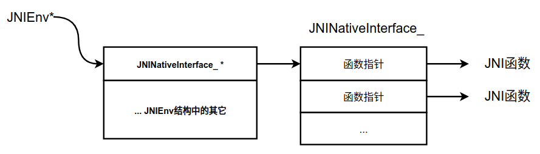

# Android JNI 使用总结

## 1. JNI 和 NDK 的区别

JNI 全称是 Java Native Interface，即 Java 本地接口。它是用来使得 Java 语言和 C/C++ 语言相互调用的。它本身和 Android 并无关系，只是在 Android 开发中会用到，在其他地方也会用到的。

而 NDK 的全称是 Native Development Kit，和 SDK 的全称是 Software Development Kit 一样，都是开发工具包。NDK 是 Android 开发的工具包，主要用作 C/C++ 开发，提供了相关的动态库。

## 2. JNI数据类型

###2.1 基本数据类型转换

在 Java 中传递的参数类型是 int，而在 JNI 中就成了 jint，这就涉及到 Java 到 JNI 的数据类型转换。

如下表所示：

| Java 类型 | Native 类型 | 符号属性 | 字长 |
| :-------- | :---------- | :------- | :--- |
| boolean   | jboolean    | 无符号   | 8位  |
| byte      | jbyte       | 无符号   | 8位  |
| char      | jchar       | 无符号   | 16位 |
| short     | jshort      | 有符号   | 16位 |
| int       | jnit        | 有符号   | 32位 |
| long      | jlong       | 有符号   | 64位 |
| float     | jfloat      | 有符号   | 32位 |
| double    | jdouble     | 有符号   | 64位 |

我们传递的基本数据类型在 JNI 中都有相对的数据类型。

###2.2. 引用数据类型转换

除了基本数据类型之外，引用数据类型也有着一一对应。

| Java 引用类型       | Native 类型   | Java 引用类型 | Native 类型  |
| :------------------ | :------------ | :------------ | :----------- |
| All objects         | jobject       | char[][]      | jcharArray   |
| java.lang.Class     | jclass        | short[][]     | jshortArray  |
| java.lang.String    | jstring       | int[][]       | jintArray    |
| Object[][]          | jobjectArray  | long[][]      | jlongArray   |
| boolean[][]         | jbooleanArray | float[][]     | jfloatArray  |
| byte[][]            | jbyteArray    | double[][]    | jdoubleArray |
| java.lang.Throwable | jthrowable    |               |              |

可以看到，除了 Java 中基本数据类型的数组、Class、String 和 Throwable 外，其余所有 Java 对象的数据类型在 JNI 中都用 jobject 表示。

## 3. JNI参数分析

在 AS 新建工程时若选择了 Include C++ Support，就会自带配置好的 C++ 开发环境。

在声明 native 方法时还是用 Java 来写比较好，比 Kotlin 的 external 关键字要友好多了，可以直接快捷键生成对用的 C++ 方法。

声明 native 方法如下：

```java
public static native int plus(int a, int b);
```

快捷键便会生成对应的 C++ 方法

```cpp
extern "C"
JNIEXPORT jint JNICALL
Java_com_adison_notes_NativeClass_plus(JNIEnv *env, jclass clazz, jint a, jint b) {
    jint sum = a + b;
    return sum;
}
```

在 Java 层中只有两个参数，而在 C++ 代码就有四个参数了，至少都会包含前面两个参数，下面讲解这些参数意义。

### 3.1 JNIEnv 

`JNIEnv*` 是定义任意 native 函数的第一个参数，它是一个指针，通过它可以访问虚拟机内部的各种数据结构，同时它还指向 JVM 函数表的指针，函数表中的每一个入口指向一个 JNI 函数，每个函数用于访问 JVM 中特定的数据结构。

#### JNIEnv 类型声明 

```c
#if defined(__cplusplus)
typedef _JNIEnv JNIEnv;
typedef _JavaVM JavaVM;
#else
typedef const struct JNINativeInterface* JNIEnv;
typedef const struct JNIInvokeInterface* JavaVM;
#endif

```

由上面的代码可知 , JNIEnv 是通过 typedef 将其它的类型定义为 JNIEnv 类型的 ;

`__cplusplus` 是 C++ 编译器中定义的宏 , C 语言编译器中没有定义该宏 , 通过该宏定义 , 可以区分当前是 C++ 环境还是 C语言环境 ;

##### C语言环境

**在C 语言 环境下**结构如下图所示：



可以看到这里面涉及了三类指针，JNIEnv * 本身就是指针，而它指向的也是指针，在 JVM 函数表里面的每一项又都是指针。


**JNINativeInterface 结构体部分代码示例 : 该结构体定义在 jni.h 头文件中 ;**

```c
struct JNINativeInterface {
    void*       reserved0;
    void*       reserved1;
    void*       reserved2;
    void*       reserved3;

    jint        (*GetVersion)(JNIEnv *);

    jclass      (*DefineClass)(JNIEnv*, const char*, jobject, const jbyte*,
                        jsize);
    jclass      (*FindClass)(JNIEnv*, const char*);

    jmethodID   (*FromReflectedMethod)(JNIEnv*, jobject);
    jfieldID    (*FromReflectedField)(JNIEnv*, jobject);
    /* spec doesn't show jboolean parameter */
    jobject     (*ToReflectedMethod)(JNIEnv*, jclass, jmethodID, jboolean);

    jclass      (*GetSuperclass)(JNIEnv*, jclass);
    jboolean    (*IsAssignableFrom)(JNIEnv*, jclass, jclass);

    /* spec doesn't show jboolean parameter */
    jobject     (*ToReflectedField)(JNIEnv*, jclass, jfieldID, jboolean);

    jint        (*Throw)(JNIEnv*, jthrowable);
    jint        (*ThrowNew)(JNIEnv *, jclass, const char *);
    jthrowable  (*ExceptionOccurred)(JNIEnv*);
    void        (*ExceptionDescribe)(JNIEnv*);
    void        (*ExceptionClear)(JNIEnv*);
    void        (*FatalError)(JNIEnv*, const char*);
	
	...
	jstring     (*NewStringUTF)(JNIEnv*, const char*);
	...
};

```

##### C++ 环境

而在 C++ 中 , 将 _JNIEnv 结构体类型 通过 typedef 为其声明别名 JNIEnv ;

**_JNIEnv 结构体 部分代码示例 :**

```c++
struct _JNIEnv {
    /* do not rename this; it does not seem to be entirely opaque */
    const struct JNINativeInterface* functions;

#if defined(__cplusplus)

    jint GetVersion()
    { return functions->GetVersion(this); }

    jclass DefineClass(const char *name, jobject loader, const jbyte* buf,
        jsize bufLen)
    { return functions->DefineClass(this, name, loader, buf, bufLen); }

    jclass FindClass(const char* name)
    { return functions->FindClass(this, name); }

    jmethodID FromReflectedMethod(jobject method)
    { return functions->FromReflectedMethod(this, method); }

    jfieldID FromReflectedField(jobject field)
    { return functions->FromReflectedField(this, field); }

    jobject ToReflectedMethod(jclass cls, jmethodID methodID, jboolean isStatic)
    { return functions->ToReflectedMethod(this, cls, methodID, isStatic); }

    jclass GetSuperclass(jclass clazz)
    { return functions->GetSuperclass(this, clazz); }

    ...
    jstring NewStringUTF(const char* bytes)
    { return functions->NewStringUTF(this, bytes); }
	...
}

```

### 3.2 jclass 参数

jclass 是 native 函数里的第二个参数类型，但却不是一定的。

如果该 native 方法是一个静态 static 方法，那么第二个参数就是 jclass 类型，指的是调用该函数的类。

如果是一个实例方法，那么第二个参数就是 jclass 类型，指的是调用该函数的对象。

### 3.3 JNIEXPORT和JNICALL

JNIEXPORT和JNICALL都是JNI的关键字，表示此函数是要被JNI调用的。

#### JNIEXPORT 宏定义作用

Windows 中如果需要生成动态库 , 并且需要将该动态库交给其它项目使用 , 需要在方法前加入特殊标识 , 才能 在外部 程序代码中 调用该 DLL 动态库中定义的方法 ;

1. Windows 平台 : 需要将方法 返回值 之前加入 `__declspec(dllexport)` 标识 ;

2. Linux 平台 : 需要将方法 返回值 之前加入 `attribute ((visibility (“default”)))` 标识 ;

**该声明的作用是保证在本动态库中声明的方法 , 能够在其他项目中可以被调用 ;**

#### JNICALL宏定义作用 :

1. Windows 平台   : JNICALL 被定义为`__stdcall` , `__stdcall` 是一种函数调用参数的约定 , 在 Windows 中调用函数时 , 该函数的参数是以 栈 的形式保存的 , 栈 中元素是后进先出的 , `__stdcall` 表示参数是从右到左保存的 ;

> __stdcall 用于 定义 函数入栈规则 ( 从右到左 ) , 和 堆栈清理规则 ;

2. Linux 平台 : JNICALL 没有进行定义 , 直接置空 ; 在 Linux 中可以不用写 JNIEXPORT 和 JNICALL 宏 ;

## 4. JNI基本操作

### 4.1 获取 JavaVM

`JavaVM` 是JNI定义的除JNIEnv之外另一核心数据接口，理论上你可以为每个进程创建多个 `JavaVM`的实例，但是安卓只允许一个。获取这个实例的方式比较简单，你需要在Java代码 中像下面这样加载动态库：

```
static {
    System.loadLibrary("your-native-lib");
}
```

在库加载的时候，下面这个函数会被调用：

```
jint JNI_OnLoad(JavaVM* vm, void* reserved);
```

你可以在这个函数中把参数`vm`缓存下来，因为每个进程只允许有一个`JavaVM`的实例，所以把它当成全局变量`cache`下来应该是安全的。

### 4.2 从 native 层直接调用 Java 代码

很多时候，你的native代码建立自己的线程（比如建立线程监听），并在合适的时候回调 Java 代码，我们没有办法像上面那样直接获得 `JNIEnv`，获取它的实例需要把你的线程 `Attach`到`JavaVM`上去，调用的方法是 `JavaVM::AttachCurrentThread`

```
JNIEnv* env;
GetJVM()->AttachCurrentThread(&env, nullptr);
```

这里你需要用到`JavaVM`的实例，这个实例的获取方式可以参考上一个小节。使用完之后你 需要调用 `JavaVM::DetachCurrentThread`函数解绑线程。

```
GetJVM()->DetachCurrentThread();
```

需要注意的是对于一个已经绑定到`JavaVM`上的线程调用`AttachCurrentThread`不会有任 何影响。如果你的线程已经绑定到了`JavaVM`上，你还可以通过调用`JavaVM::GetEnv`获取 `JNIEnv`，如果你的线程没有绑定，这个函数返回`JNI_EDETACHED`。我的习惯是封装一个 智能指针类自动完成这些操作。

```
class JNIEnvPtr {
public:
    JNIEnvPtr() : env_{nullptr}, need_detach_{false} {
        if (GetJVM()->GetEnv((void**) &env_, JNI_VERSION_1_6) ==
            JNI_EDETACHED) {
            GetJVM()->AttachCurrentThread(&env_, nullptr);
            need_detach_ = true;
        }
    }

    ~JNIEnvPtr() {
        if (need_detach_) {
            GetJVM()->DetachCurrentThread();
        }
    }

    JNIEnv* operator->() {
        return env_;
    }

private:
    JNIEnvPtr(const JNIEnvPtr&) = delete;
    JNIEnvPtr& operator=(const JNIEnvPtr&) = delete;

private:
    JNIEnv* env_;
    bool need_detach_;
};
```

这个类在构造函数中调用`AttachCurrentThread`在析构中调用`DetachCurrentThread`，然 后重载`->`操作符。你可以像下面这样使用这个工具类。

```
// native 代码需要回调 Java 代码

NativeClass::NativeMethod() {
    JNIEnvPtr env;
    env->CallVoidMethod(instance, method, args...);
}
```


### 4.3 获取 jclass, jmethodID, jfieldID

如果你想要调用Java层的代码，你需要使用 JNIEnv，比如你想要调用一个无返回值无参数的成员函数，语法大概如下：

```
env->CallVoidMethod(instance, method);
```

这里你最少需要两个参数`instance`和`method`，因为你要调用一个方法你至少需要有一 个对象以及一个成员函数名称。关于`instance`如何获取，我们放在下一个小节，这里主要 讨论如何获取`method`。

在 Java 中所有的方法必然属于某一个类，所以获取 `method` 之前你需要获取 `class`， 它们类型分别为`jclass`,`jmethod`。

### 4.4 获取类的引用

调用`JNIEnv::FindClass`可以获取对于的 class 的实例。

```
jclass clazz = env->FindClass("full/name/of/your/class");
```


### 4.5 获取成员函数的引用

获取一个方法的引用需要调用`JNIEnv::GetMethodID`方法。

```
jmethodID = env->GetMethodID(clazz, "method", "()V");
```

第一个参数是上面获取的类引用，第二个参数是方法名称，第三个参数是方法的签名。关于 签名的写法，请参考官方文档的[Type Signatures](http://docs.oracle.com/javase/8/docs/technotes/guides/jni/spec/types.html#type_signatures)一小节

需要额外注意的地方是，构造函数的函数名称为`<init>`


### 4.6  获取成员变量的引用

获取成员变量的引用和获取成员函数的引用是类似的，调用`JNIEnv::GetFieldID`即可，这 里不再赘述。


### 4.7 失效问题

特别需要注意的地方是，jclass, methodID 和 fieldID 在类 unload 之前都是有效，虽然 一个类会 unload 的情况非常少见，但是并不是没有可能。所以如果你想要保证你的这些引 用有效的话，可以通过下面这种方式对你用到的类，方法，成员变量进行缓存：

```
private static native void nativeInit();

static {
    nativeInit();
}
```

然后在你的 native 方法中获取并缓存你用到的 entity。

```
Java_xxxx_nativeInit(JNIEnv *env, jobject instance) {
    // 查找并且缓存你需要用到的上述对象
}
```

当然如果你使用 `System.loadLibrary` 你也可以在 `JNI_OnLoad` 函数中缓存这些东西。

### 4.8  辅助工具

下面这两个宏定义来自 `libvlc-android` 可以用来方便的获取 jclass，jmetod，jfield

```
#define GET_CLASS(clazz, str, b_globlal)                                    \
    do {                                                                    \
        (clazz) = env->FindClass((str));                                    \
        if (!(clazz)) {                                                     \
            return -1;                                                      \
        }                                                                   \
        if (b_globlal) {                                                    \
            (clazz) = reinterpret_cast<jclass>(env->NewGlobalRef((clazz))); \
            if (!(clazz)) {                                                 \
                return -1;                                                  \
            }                                                               \
        }                                                                   \
    } while (0)

#define GET_ID(get, id, clazz, str, args)                 \
    do {                                                  \
        (id) = env->get((clazz), (str), (args));          \
        if (!(id)) {                                      \
            return -1;                                    \
        }                                                 \
    } while (0)
```

使用方式如下：

```
GET_CLASS(clazz, "full/class/name", false); // 第三个参数后面解释
GET_ID(GetMethodID, method, clazz, "method", "()V");
GET_ID(GetFieldID, field, clazz, "filed", "I");
```

此外这些 class, methodID， filedID 是不会变的东西（从逻辑上理解，类名，方法名， 成员名都不会在运行是更改），你可以缓存你查找好的引用作为全局变量，一方面可以提升 效率，另一方面也方便使用，因为你不需要每次都重新查找。个人的习惯是写一个结构体的 单例，在 `JNI_OnLoad`中查找并缓存这些实体，然后在`JNI_OnUnload`中清理缓存。

### 4.9 获取 instance

前面提到，如果想要在 native 层调用 java 层的函数，你至少一个对象和一个成员方法， 上一小节讲述了如何获取成员方法，这一小节主要讲述如获取一个Java对象也就是 instance。获取的它通常是通过一下三种途径：

#### native 代码参数

`instance`的获取和`JNIEnv`的获取是类似的，如果你的方法是Java代码的native实现，那 么JNI会自动把调用该对象的实例传递给你。

```
JNIEXPORT void JNICALL
Java_xxxxx_nativeMethod(JNIEnv *env, jobject instance);
```

上面函数的第二个参数就是你需要的对象。你可以直接在这个函数中使用这个对象，比如：

```
JNIEXPORT void JNICALL
Java_xxxxx_nativeMethod(JNIEnv *env, jobject instance) {
    auto& cached_fields = CachedFields::GetInstance();  // 参考上一小节
    env->CallVoidMethod(instance, cached_fields.methodID)
}
```

####  CallObjectMethod

在`instance`存在的情况下，你也可以调用这个`instance`返回对象的方法来获取另一个 `instance`，比如：

```
jobject obj_ = env->CallObjectMethod(instance, methodID, args);
```

####  NewObject

如果你没有这样的 instance 存在，你也可以直接创建一个java对象，调用 `JNIEnv::NewObject`即可。

```
jobject obj_ = env->NewObject(fields.clazz, fields.ctrID);
```

这个函数需要 jclass 和构造函数的 jmethod（关于如何获取构造函数的引用可以查看上一 小节）。

### 4.10 引用的局部性和全局性

所有传递到native函数中的参数和从JNI函数中返回的对象都是局部引用，比如：

```
JNIEXPORT void JNICALL
Java_xxxxx_nativeMethod(JNIEnv *env, jobject instance) {
    jobject obj_ = env->CallObjectMethod(instance, methodID, args);
}
```

`instance` 和 `obj_` 都是局部引用，这种引用一旦函数返回就会失效，即使你保存它们 也不会延长它们的生命周期。

```
jobject instance_backup;

JNIEXPORT void JNICALL
Java_xxxxx_nativeMethod(JNIEnv *env, jobject instance) {
    instance_backup = instance;
}

NativeClass::NativeMethod() {
    JNIEnvPtr env;
    env->CallVoidMethod(instance_backup, methodID); // 错误！！！！！
}
```

这条规则对于所有的 jobject 的子类（包括 jclas， jstring，jarray）都是适用的，如 果你想要引用保持有效，你需要调用`JNIEnv::NewGlobalRef`来获取一个全局的引用。

```
jclass localClass = env->FindClass("MyClass");
jclass globalClass = reinterpret_cast<jclass>(env->NewGlobalRef(localClass));
```

在你调用 DeleteGlobalRef 之前，这个引用都会有效。所以如果你想要保存一个局部引用 ，你可以像下面这样组织你的代码：

```
class Widget {
public:
    Widget(jobject instance) {
        JNIEnvPtr env;
        instance_ = env->NewGlobalRef(instance);
    }

    ~Widget() {
        JNIEnvPtr env;
        env->DeleteGlobalRef(instance_);
    }

    void Function() {
        // 使用 instance_;
    }

private:
    jobject instance_;
};
```

### 4.11 全局和局部引用的删除

全局引用需要你手动调用 `DeleteGlobalRef` 来删除，但是局部的引用通常不需要。但是 需要注意的是，如果你使用了 AttachCurrentThread 绑定线程，那么在你调用 DetachCurrentThread 之前，你的局部引用都不会自动回收，这意味着如果你在一个循环中 创建了局部引用，你通常需要在循环内部删除掉它，因为系统通常只保证了 16 个局部引用 的 slot 。如果你需要超过 16 个，你就必须删除一些local引用，或者使用 EnsureLocalCapacity/PushLocalFrame 为局部引用预留更多的slot。

### 4.12 成对的使用函数

JNI中有一些函数是需要成对的使用的，否则会有内存泄露，常用的有以下这些。

```
const char * GetStringUTFChars(jstring string, jboolean *isCopy);
void ReleaseStringUTFChars(jstring string, const char *utf);

NativeType *Get<PrimitiveType>ArrayElements(ArrayType array, jboolean *isCopy);
void Release<PrimitiveType>ArrayElements(ArrayType array, NativeType *elems, jint mode);
```

前面这一组用来操作字符串，后面这一组用来操作数组。


## 参考

[JNI 方法解析 ( JNIEnv *env 参数 )](https://blog.csdn.net/shulianghan/article/details/104082438)

[JNI 方法解析 ( JNIEXPORT 与 JNICALL 宏定义作用 )](https://hanshuliang.blog.csdn.net/article/details/104072587)

[Android JNI 使用总结](http://blog.guorongfei.com/2017/01/24/android-jni-tips-md/)

[Android JNI 基本操作](https://glumes.com/post/android/android-jni-basic-operation/)