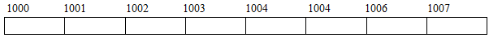
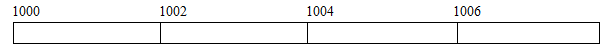
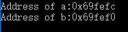
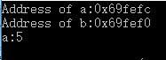
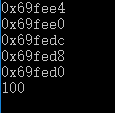
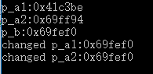
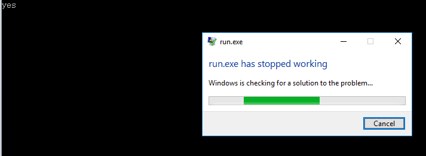
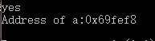
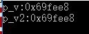
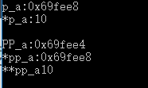

# 深度长文教你彻底掌握C++/C指针(一):基石

## 一．基础
C++或者C里面最容易让人糊涂应该是指针了,不管是初学者甚至是有经验的童鞋有时候在用指针的时候也会出现一些很隐蔽的错误.
指针本身就是一个很绕的概念,而指针又能够和很多的结构比如数组(二维数组),字符串,内存分配和管理等等一些联系起来变成更加绕的概念.所以基础不好的同学常常会犯一些很无厘头的错误,但是高手也会犯错误,而且更加隐蔽.
接下来所有的文章内容并不能够保证你能够完完全全避免开发中的错误,但是文章的目标是帮助很多童鞋对于指针概念做一个系统性的归纳.减少犯错误的几率.或者是帮助刚刚入门的boy更加快速深入的理解指针,把基础打得扎实一点.
恩,很多人都说指针很难,那为什么还要学指针呢?对于这样的问题,拒绝回答.

### Ⅰ.内存和地址
我们已经很熟悉一些基本的存储单位了,比如一个bit(位)用存储0或者1.也可以把几个bit合起来表示更大的数字,比如一个byte(字节)就包含了8个bit.这些都是很基础很简单的东西.然后 **我们可以把计算机的内存想象成一个字节数组,内存中的每一个地址表示一个字节**.



每个字节中都能够存储一定位数的内容,因此,每个字节都能够通过一些地址来标识.有时候,一个字节不够,怎么办呢?那么就同时用很多个字节来表示,比如一个int在我的系统里面就用了4个字节。
下面的图是上面那幅图片每两个字节合并在一起之后样子.这个因为是两个字节合并,所以它成为比一个字节更大的内存单位(废话),能够存储的信息就更多(废话).但是虽然一个字是两个字节合并的,但是它仍然只包含一个地址,也就是说,合并之后只需要一个地址来找到合并之后的内存.



因此,我们可以得到:

1. **内存中的每个位置都由一个独一无二的地址表示.**
2. **内存中的每个位置都包含一个值.**
   通俗一点,**我们可以通过一个地址,来找到内存中的某个具体位置,然后访问到(得到)该位置的值(允许的话).这就是内存和地址简单的思想**.

### Ⅱ.指针含义与创建方式
指针这个名字确实折磨过很多人,这个名字是个好名字,同时也是一个非常不好的名字. 说它好,是因为指针这个东西很形象的体现了它的功能:指针指针,指到某个地方某个位置.非常形象. 它不是个好名字是因为她的名字有时候掩盖了它的真实含义.一般来说，**指针是一个其值为地址的变量。（就是一个存储地址的变量）**
所以,要养成一种条件反射,看到指针首先不是想到他能够指向哪里,而是想到 **这个变量存放的是一个地址,是这个地址指向哪里哪里.**(比如,char类型的变量中存放的是char类型的数据.int变量中存放的是int类型的数据.指针中存放的是一个地址!!!)

反复的把上面的概念消化之后,我们就来看两个基本的运算符: **&(取址运算符)** 和* *\*(间接访问运算符/解引用指针)**

首先是&运算符:当它后面跟一个变量名的时候,给出这个变量名的地址.

``` c++
#include <iostream>

using namespace std;
int main()
{
   int a=5;
   double b=10.4;
   cout<<"Address of a:"<<&a<<endl;
   cout<<"Address of b:"<<&b<<endl;
}

```




至于*运算符:就是后面跟一个指针的时候,得到指针指向的内存中的内容.

```c++
#include <iostream>

using namespace std;
int main()
{
   int a=5;
   double b=10.4;

   cout<<"Address of a:"<<&a<<endl;
   cout<<"Address of b:"<<&b<<endl;

   cout<<"a:"<<*(&a)<<endl;
}
```



通过上面的例子你会发现,这里输出的地址是16进制的整形.其实事实上,在大多数系统的内部，**指针所存的地址值一般是一个无符号的整数**。但是，这并不代表指针和整形有一样的运算规则。指针类型是一种新的类型，而不是一种整数类型。ANSI专门为指针提供了%p输出格式

理解上面两个基本的运算符之后,就可以正式开始讲指针的创建了.
**声明指针的模板:**

>指向地址的数据类型 * 指针变量名;

其中,`*`号必须带,用以表明现在创建的是一个指针类型的变量.同时,当你看到创建变量的语句中带有星号`*`的话,那么说明那个变量必定是一个指针变量!

是不是很简单!举一个例子进一步来理解上面那个的含义.比如我想创建一个指针变量(存放地址的变量),这个指针(地址)是指向一个存储整形的内存.那么我就可以写为:`int * leo`;同理,指向char的我可以写成`char * c`;其实是很简单的.

这里结合前面的内容,简单的写一个例子,并且介绍一些写法.(最开始让初学者迷惑的地方就是这里了,因为创建时候的`*`号,解除指针时候的`*`号,各种符号混在一起,一般就直接懵逼了.但是要是好好掌握一些经验结论,这里很容易过去.)

```c++
#include <iostream>

using namespace std;
int main()
{
  int a=5,b=6,c=7,d=8;
  double e=3.1415;
  //单独赋值,并且*和p_a紧挨着
  int *p_a=&a;
  //多个赋值(既有指针,又有普通变量)
  int * p_b=&b,* p_c=&c,*p_d=&d,temp=100;

  //单独赋值,double类型
  double * p_e=&e;

  cout<<p_a<<endl<<p_b<<endl<<p_c<<endl<<p_d<<endl<<p_e<<endl;
  cout<<temp<<endl;
}
```



**上面这个例子有一些可以提炼的经验:**
首先,就是创建指向int或者double的指针的创建方式,这个前面都讲了很多次了.在这个例子里面也可以很容易的找到,所以这里就不啰嗦了.

然后就是创建时候的写法.比如 `int *p_a=&a;`这句话中,`*`号是紧挨着`p_a`的,而在`int * p_b=&b,* p_c=&c,*p_d=&d,temp=100; `这句话中,*号是可以不挨着`p_b`和`p_c`的.也就是说,创建指针变量的时候,星号的位置是很自由的.只要是出现了星号,而不管中间是不是有空格,我们便认为,这算是创建了一个指针变量.

在别人写的代码中,你会看到很多的写法,其实本质就是这样.比如有些人喜欢写成`int* p_a=&a;`在这里,`*`号紧挨着int,因为有人理解为int的指针类型即int*.所以,写法这么多,初学者肯定是会迷惑的,记住前面的经验,这样就见怪不怪了.

接下来,还是在`int * p_b=&b,* p_c=&c,*p_d=&d,temp=100;`这句话里面,最后接了一个`temp=100`,千万不要也把temp也当做了一个指针变量,他只是一个普通的变量.也就是说,同一句话里面,可以混合多种类型的赋值,指针的带`*`号,普通的不带`*`号.

### Ⅲ.使用指针
使用指针的方式有很多,我们这里谈谈最基础的,后面会更加深入的讲指针的使用.前面已经讲过了指针的创建,接下来主要是讲指针的初始化问题和赋值以及解除引用等等问题.

首先是初始化问题.在前面的那一个例子中,我们在创建指针的时候都顺便初始化了,那是不是创建指针就一定要初始化?肯定不是!创建指针的时候也可以不初始化.因为**有时候你创建一个指针只是为了后续的工作**,根本没有东西拿来初始化.那么到现在,我们解决了第一个问题,那就是**创建指针可以初始化也可以不初始化**,.那么你肯定会说,这么简单为什么要单独拿出来讲?是因为后来的某些操作是要考虑是否初始化的问题的.好了,不绕弯了,这里的操作主要是讲间接访问(解引用指针)带来的一些问题.

不多说,直接上例子.

```c++
#include <iostream>

using namespace std;
int main()
{
    int num=5;

    //p_a没有初始化
    int *p_a1,*p_a2;
    cout<<"p_a1:"<<p_a1<<endl;
    cout<<"p_a2:"<<p_a2<<endl;
    
    int *p_b=&num;
    cout<<"p_b:"<<p_b<<endl;
    
    //同类型指针可以赋值
    //没有初始化的指针依然可以被赋值(地址)
    p_a1=p_b;
    p_a2=&num;
    cout<<"changed p_a1:"<<p_a1<<endl;
    cout<<"changed p_a2:"<<p_a2<<endl;

}
```



一句一句来分析这个例子.首先我们创建了一个整形,值为5,然后我们创建了两个指向int类型的指针`p_a1`,`P_a2`,但是我们没有初始化.从最后的运行结果来看,指针不初始化是可行的.然后创建了一个指针`p_b`并且初始化了,所以从结果来看,就是num的地址.

接下来有两句:`p_a1=p_b; p_a2=&num;`

前面那句是直接把`p_b`这个指向int类型的指针直接赋给了`p_a1`这个也是指向int类型的指针,那么从效果上面来看,相当于`p_a1`和`p_b`指向同样的地址…..好了,不装逼了,因为指针就是存储地址的嘛,其实就是把这个变量中存储的地址赋给了另外一个变量…..非常简单.

后面第二句就是说,即使不初始化,我还是能够接收地址.(类比`int n;n=5`).

所以总结起来就是即使没有初始化,我依然能够两个指针之间赋值(类型肯定要一样啦)和接受地址.也没有什么困难的.那么接着看.

把上面的代码小小的改动一些,代码变成下面这样.

```c++
#include <iostream>

using namespace std;
int main()
{
    int num=5;

    //p_a没有初始化
    int *p_a1,*p_a2;
    cout<<"p_a1:"<<p_a1<<endl;
    cout<<"p_a2:"<<p_a2<<endl;
    
    *p_a1=12;
    cout<<*p_a1<<endl;

}
```


这里就加了一句`*p_a1=12;`这句话是很危险的.我们创建了一个指向int的指针,但是并没有初始化,也就是说,指针会得到一个随机的地址(至少大部分系统上面是这样),可 **创建指针的过程并不包含对于某个整形内存上空间的开辟.**

`*p_a1=12;`的过程就是把12这个整形放到p_a1指向的内存的过程.但是空间都没有开辟,怎么放呢?所以这个语句最终是不是运行成功都取决于运气.不同的系统上面可以有不同的结果.但是这样的话就算是运行成功了又有什么意义呢?

所以,其他的都不说, **至少在解引用指针的时候,你需要保证你的指针被正确的初始化或者正确的被赋过某个地址.** 不然,那样的解引用指针操作无意义且危险.

***重要:***

既然前面谈到了解引用指针(间接访问),那就再来说说指针常量与指针的强制转化.

假如我们想在一个地址500存放一个整数100,没错,我们已经知道这个地址是500了,所以我们就能够这么赋值

```c++
*500=100;
```

这句话的意思是很明确的,先把地址500解引用然后把100放进这个内存.但是这句话是错的,因为前面说过指针类型是一种特殊的类型.但是我们这里的500就是一个很普通的整形.他是能够表示500这个地址没有错,但是它的类型不适合.**因此,我们要把这个普通的整形强制转换为指向整形的指针类型**.因此可以这样写

```c++
*(int *)500=100
```
其实使用这个的机会很少,但是并不意味这个不重要,首先在某些硬件问题里面确实是想访问某些硬件上面特定的地址的时候我们可以用这个方法.后面讲到内存管理的时候,也会回来这里.

### Ⅳ.指针运算
指针的运算有**算术运算**和**关系运算(比较大小等等)**,但是在这里仅仅是提一下,因为这部分的内容是和后面指针与数组有关系的.在后面指针与数组会单独讲这些.

### Ⅴ.NULL指针和void*
有很多对于指针不是很熟悉的童鞋在上数据结构课的时候一般是很懵逼的,因为用C讲数据结构的时候,涉及到很多的内存开辟回收,以及指针问题(链式结构).然后很多人没有学好不是因为逻辑能力差,而是因为在一些代码或者是伪代码中对于指针的认识模棱两可.以至于本来代码是学习数据结构思想的好工具,变为了学习数据结构的负担.

#### 首先先讲NULL指针.
NULL指针是一种非常特殊的指针(废话,不然单独说它干嘛?),不指向任何东西.**表示不指向任何东西的指针**(哦,感觉好厉害的样子).但是事实上面,这种技巧非常有用.(当你被链表虐的时候就知道了).

我们怎么把一个指针变为NULL指针呢?很简单,赋给这个指针一个0就行了.不用转化,就是整形的0.同样,直接赋NULL也是行的.看下面的例子.

```c++
#include <iostream>

using namespace std;
int main()
{
    //测试NULL是不是0
    if(NULL==0)
        cout<<"yes"<<endl;

    //转化为NULL指针
    int *p_a=0;
    int *p_b=NULL;

}
```

例子很简单,就不解释了.

有一个非常重要的是,因为NULL不指向任何地方,所以,也就 **肯定不能够解引用** 了.这点一定要注意.因为连地址都没有,怎么得到不存在的地址中的值呢?所以要是想你的程序健壮,最好是在解引用之前加一个判断是否为NULL指针的步骤,要是你有足够的信心以后都不会有问题,那么不加也罢.

下面这个例子是当我试图对一个NULL指针解引用之后的程序运行情况.(就是上面那个例子加了一句话而已)

```c++
#include <iostream>

using namespace std;
int main()
{
    //测试NULL是不是0
    if(NULL==0)
        cout<<"yes"<<endl;

    //转化为NULL指针
    int *p_a=0;
    int *p_b=NULL;
    
    //试图解引用
    cout<<*p_a<<endl;

}
```




直接崩了,其实也挺好,至少比找不到的隐形错误要好.

前面的例子中有一句是判断`NULL==0`的,这里需要注意一下,NULL是一个预处理的变量,值为0,在头文件cstdlib中定义,(我这里并没有显式载入也能够用),因此用到NULL这个预处理变量的时候,尽量带上cstdlib头文件,规范一点,避免不必要的错误.
说到这里,其实你反而应该疑惑了,我们前面已经说过了,指针存放的是一个地址.一般来说,地址是整形没错,但是它是一种新的类型来表示地址.和整形并不能够兼容或者运算.但是当使用0来表示空指针的时候,我们便会疑惑,0到底是整形常量还是一个指针常量?

因此,在C++11中,新引入了一种特殊类型的字面值`nullptr`来初始化指针为空指针.他能够被转换成任何类型的指针.

```c++
#include <iostream>

int fun(int num)
{
    return num+10;
}
int main()
{
    //表达式0==nullptr为真值
    if(0==nullptr)
        std::cout<<"yes"<<std::endl;

    int a=5;
    int *p=nullptr;
    p=&a;
    std::cout<<"Address of a:"<<p<<std::endl;
    return 0;

}
```



讲到现在,发现前面很多的错误都是由于解引用没有初始化的指针引起来的.所以,这里提个建议,就是 **尽量定义了对象之后再定义指向这个对象的指针,对于不清楚的指向哪里的指针,一律初始化为`nullptr(C++11)`或者`NULL(0)`**.之后再判断是否指向对象再进行相应的操作.

#### 接下来讲void*.
`Void*`是一种特殊类型的指针,能够用来存放任何类型对象的地址.通俗来说,就是我不知道这个指针指向的是什么类型的对象.
要是还是理解不了那就上例子:

```c++
#include <iostream>

int fun(int num)
{
    return num+10;
}
int main()
{
    double x=25.5;
    //普通指针的话类型要严格保证
    double *p=&x;

    //void* 类型可以接受任意类型对象地址
    void *p_v=&x;
    void *p_v2=p;
    std::cout<<"p_v:"<<p_v<<std::endl;
    std::cout<<"p_v2:"<<p_v2<<std::endl;

}
```



`Void *`暂时了解到这里就行了,后面内存分配的时候还会专门和他打交道.

### Ⅵ.指针的指针
指针的指针就是指向指针的指针.再多讲就绕晕了.直接看定义和例子吧.

```c++
#include <iostream>

int main()
{
   int a=10;
   int *p_a=&a;
   int **pp_a=&p_a;

   std::cout<<"p_a:"<<p_a<<std::endl<<"*p_a:"<<*p_a<<std::endl;
   std::cout<<std::endl;

   std::cout<<"PP_a:"<<pp_a<<std::endl<<"*pp_a:"<<*pp_a<<std::endl<<"**pp_a"<<**pp_a<<std::endl;

}
```



通过这个例子,我们发现其创建方式也是和普通指针的创建方式是差不多的,除了创建时候的两个星号`**`.那创建指针必定需要指针类型,指针类型怎么选择呢?通俗一点说,就是跟着前面的走:我们发现创建整形时候使用的是`int`,比如这里的`int a=10;`.那我们创建指向a的指针的时候,肯定必须也要是int了,比如这里的`int *p_a=&a;`.最后创建指针的指针的时候,也就用int了.比如这里的` int **pp_a=&p_a;` .并不困难

另外一个就是解引用的时候,带上两个星号,就回到的最开始的那个变量.这么说有点模糊.详细来说,`**pp_a`因为`*`的从右向左的结合性,这个表达式可以写成`*(*pp_a)`,那么我们知道`pp_a`存放的是`p_a`的地址,`*pp_a`就是表示`p_a`这个地址中存放的内容即`a`的地址(不能晕!!!).那么`*(*pp_a)`就相当于`*p_a`或者`a`.

至此,基本的概念部分就结束啦.

## 参考
转自https://blog.csdn.net/xierhacker/article/details/52516742
