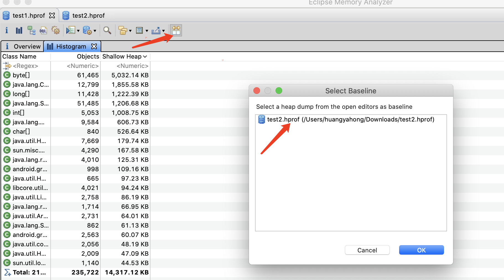
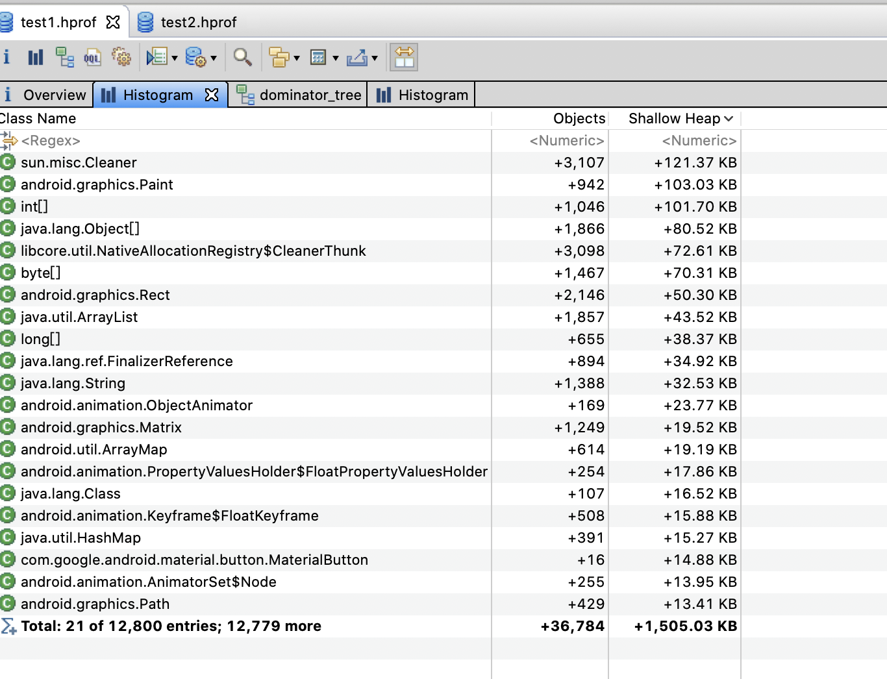
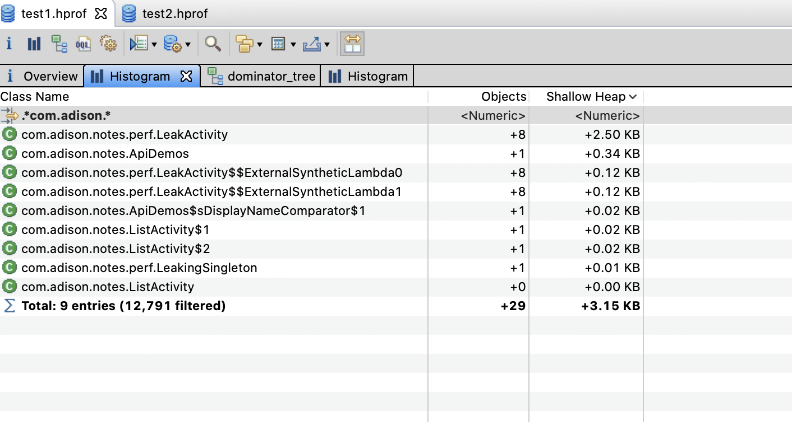
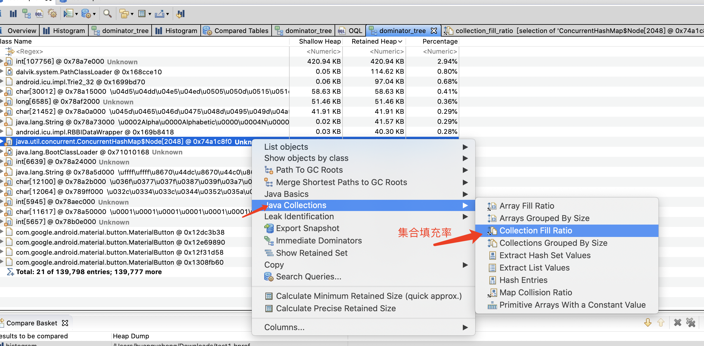
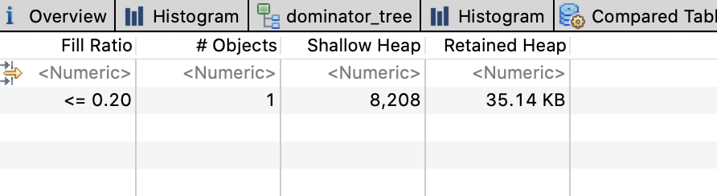
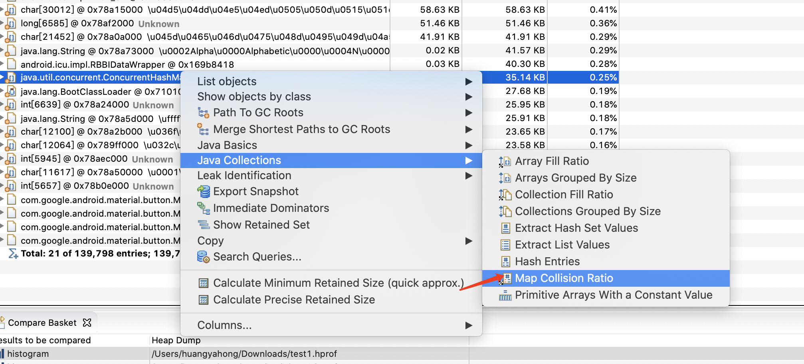
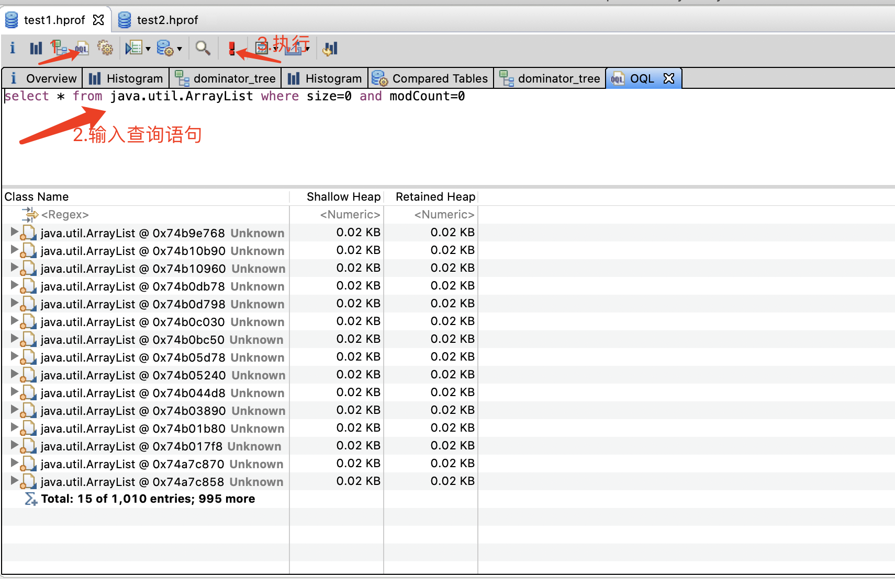
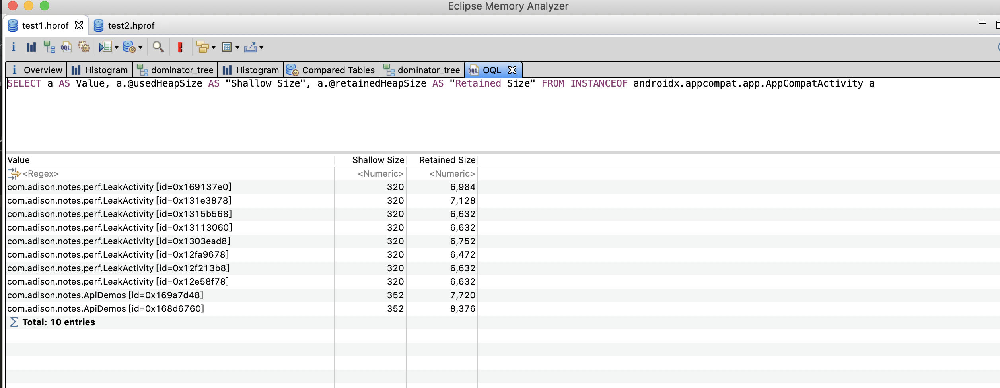

# MAT 进阶

## 1. 内存快照对比

### 1.1 使用

首先，至少打开两个hprof文件，进入`Histogram`页面，然后选择其中两个进行对比，就可以看到变化的类实例情况





### 1.2 使用场景

* 通过对比两个内存快照，可以查看内存增长原因
* 同时也可以输入过滤条件，过滤怀疑点，快速定位



## 2. 集合状态

### 2.1 集合填充率





**使用场景**：通过对 ArrayList 或数组等集合类对象按填充率聚类，定位稀疏或空集合类对象造成的内存浪费

### 2.2 HashMap 冲突率(当Hash集合中过多的对象返回相同Hash值的时候，会严重影响性能)



**使用场景**：查找导致Hash集合的碰撞率较高的罪魁祸首。

## 3. 通过OQL分析内存



### 3.1 语法

```sql
SELECT * FROM [ INSTANCEOF ] <class_name> [ WHERE <filter-expression> ]
```

* `Select `子句可以使用“*”，查看结果对象的引用实例（相当于 outgoing references）；可以指定具体的内容，如 Select OBJECTS v.elementData from xx 是返回的结果是完整的对象，而不是简单的对象描述信息)；可以使用 Distinct 关键词去重。

* `From` 指定查询范围，一般指定类名、正则表达式、对象地址。

* `Where` 用来指定筛选条件。

* 全部语法详见：[OQL 语法](https://link.juejin.cn?target=https%3A%2F%2Fhelp.eclipse.org%2Fneon%2Findex.jsp%3Ftopic%3D%2Forg.eclipse.mat.ui.help%2Freference%2Foqlsyntax.html)

* INSTANCEOF 关键字:查找属于某父类，实现某接口的对象。还有一些对象属性，如`@usedHeapSize` 表示获取占用内存值；`@retainedHeapSize`表示获取包含引用对象占用总内存值，`@GCRootInfo`表示该对象的垃圾回收根节点，判断是否仍被引用

  

**例子**：查找 size＝0 且未使用过的 ArrayList：

```sql
select * from java.util.ArrayList where size=0 and modCount=0
```

  

### 3.2 使用场景

* 一般比较复杂的问题会使用 OQL，而且这类问题往往与业务逻辑有较大关系。比如大量的小对象整体占用内存高，但预期小对象应该不会过多（比如达到百万个），一个一个看又不现实，可以采用 OQL 查询导出数据排查。
* 可以快速查找通用的组件或者其子类的内存情况，判断是否发现内存泄漏，如Activity、Fragment

**例子**：查找所有Activity

```sql
SELECT a AS Value, a.@usedHeapSize AS "Shallow Size", a.@retainedHeapSize AS "Retained Size" FROM INSTANCEOF androidx.appcompat.app.AppCompatActivity a
```




