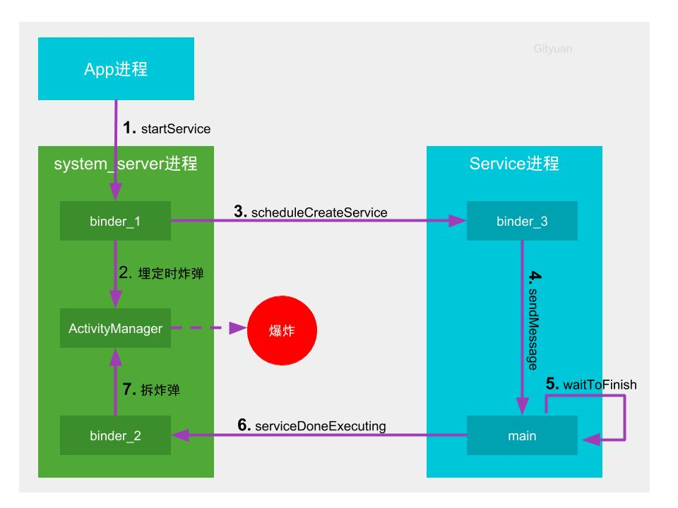
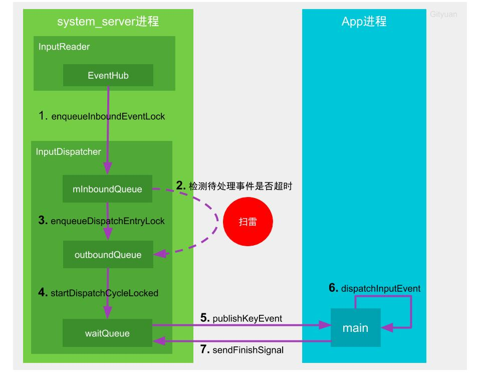

# ANR原理

## 1. ANR是什么

ANR全称是Applicatipon No Response，Android设计ANR的用意，是系统通过与之交互的组件以及用户交互进行超时监控，用来判断应用进程是否存在卡死或响应过慢的问题，通俗来说就是很多系统中看门狗(watchdog)的设计思想。

### 1.1. ANR超时阈值
不同组件的超时阈值各有不同，关于service、broadcast、contentprovider以及input的超时阈值如下表：


*(图表仅供参考，国内厂商可能会有调整，每个厂商的标准也存在差异)*

!!! note "前台与后台服务的区别"

	系统对前台服务启动的超时为20s，而后台服务超时为200s，那么系统是如何区别前台还是后台	 服务呢？
	
	在startService过程根据发起方进程callerApp所属的进程调度组来决定被启动的服务是属于	 前台还是后台。当发起方进程不等于ProcessList.SCHED_GROUP_BACKGROUND(后台进程组)	则认为是前台服务，否则为后台服务，并标记在ServiceRecord的成员变量createdFromFg。
	
	什么进程属于SCHED_GROUP_BACKGROUND调度组呢？进程调度组大体可分为TOP、前台、后台，进程优先级（Adj）和进程调度组（SCHED_GROUP）算法较为复杂，其对应关系可粗略理解	为Adj等于0的进程属于Top进程组，Adj等于100或者200的进程属于前台进程组，Adj大于200的进程属于后台进程组。关于Adj的含义见下表，简单来说就是Adj>200的进程对用户来说基本是无感知，主要是做一些后台工作，故后台服务拥有更长的超时阈值，同时后台服务属于后台进	程调度组，相比前台服务属于前台进程调度组，分配更少的CPU时间片。


!!! note "前台与后台广播区别"

	前台广播超时为10s，后台广播超时为60s，那么如何区分前台和后台广播呢？
	
	根据发送广播sendBroadcast(Intent intent)中的intent的flags是否包含FLAG_RECEIVER_FOREGROUND来决定把该广播是放入前台广播队列或者后台广播队列，前台广播队列的超时为10s，后台广播队列的超时为60s，默认情况下广播是放入后台广播队列，除非指明加上FLAG_RECEIVER_FOREGROUND标识。

## 2.ANR触发原理

通常来讲，ANR的来源分为Service、Broadcast、Provider以及Input两种。

这样区分的原因是，首先，前者发生在 应用进程 组件中的ANR问题通常是相对好解决的，若ANR本身容易复现，开发者通常仅需要确定组件的代码中是否在 主线程中做了耗时处理；而后者ANR发生的原因为 输入事件 分发超时，包括按键和屏幕的触摸事件，其整个流程相比前者而言逻辑更加复杂。而且Input类型的ANR相对于Service、Broadcast、Provider，其内部的机制又截然不同。

###  2.1  Service、Broadcast、Provider

可以把发生ANR比作是引爆炸弹，那么整个流程包含三部分组成：

1. **埋定时炸弹**：中控系统(system_server进程)启动倒计时，在规定时间内如果目标(应用进程)没有干完所有的活，则中控系统会定向炸毁(杀进程)目标。

2. **拆炸弹**：在规定的时间内干完工地的所有活，并及时向中控系统报告完成，请求解除定时炸弹，则幸免于难。

3. **引爆炸弹**：中控系统立即封装现场，抓取快照，搜集目标执行慢的罪证(traces)，便于后续的案件侦破(调试分析)，最后是炸毁目标。

   

以Service为例，来看看埋炸弹与拆炸弹在整个服务启动(startService)过程所处的环节。



**startService**(**埋定时炸弹**)

```java
//com.android.server.am.ActiveServices.java
private final void realStartServiceLocked(ServiceRecord r,
        ProcessRecord app, boolean execInFg) throws RemoteException {
    ......
    //发个延迟消息给AMS的Handler
    bumpServiceExecutingLocked(r, execInFg, "create");

    ......
    try {
        //IPC通知app进程启动Service，执行handleCreateService
        app.thread.scheduleCreateService(r, r.serviceInfo,
                mAm.compatibilityInfoForPackage(r.serviceInfo.applicationInfo),
                app.getReportedProcState());
    } catch (DeadObjectException e) {
    } finally {
    }
}

private final void bumpServiceExecutingLocked(ServiceRecord r, boolean fg, String why) {
    scheduleServiceTimeoutLocked(r.app);
    .....
}


void scheduleServiceTimeoutLocked(ProcessRecord proc) {
      ...
    //发个延迟消息给AMS里面的一个Handler, 当超时后仍没有remove该SERVICE_TIMEOUT_MSG消息，则执行service Timeout流程
    mAm.mHandler.sendMessageDelayed(msg,
            proc.execServicesFg ? SERVICE_TIMEOUT : SERVICE_BACKGROUND_TIMEOUT);
}
```

**serviceDoneExecuting**(**拆炸弹**)

```JAVA
//android.app.ActivityThread.java
@UnsupportedAppUsage
private void handleCreateService(CreateServiceData data) {
    ......
    Service service = null;
    try {
       ...
        try {
            //Service启动完成，需要通知AMS
            ActivityManager.getService().serviceDoneExecuting(
                    data.token, SERVICE_DONE_EXECUTING_ANON, 0, 0);
        } catch (RemoteException e) {
        }
    } catch (Exception e) {
    }
}

//ActiveServices.java
private void serviceDoneExecutingLocked(ServiceRecord r, boolean inDestroying,
        boolean finishing) {
    ......
    mAm.mHandler.removeMessages(ActivityManagerService.SERVICE_TIMEOUT_MSG, r.app);
    ......
}
```

**SERVICE_TIMEOUT**(**引爆炸弹**)

```java
//com.android.server.am.ActivityManagerService.java

final MainHandler mHandler;

final class MainHandler extends Handler {
    @Override
    public void handleMessage(Message msg) {
        switch (msg.what) {
        ......
        case SERVICE_TIMEOUT_MSG: {
            //这个mServices是ActiveServices
            mServices.serviceTimeout((ProcessRecord)msg.obj);
        } break;
        }
        ......
    }
    ......
}

//com.android.server.am.ActiveServices.java
void serviceTimeout(ProcessRecord proc) {
    String anrMessage = null;
    synchronized(mAm) {
        //计算是否有service超时
        final long now = SystemClock.uptimeMillis();
        final long maxTime =  now -
                (proc.execServicesFg ? SERVICE_TIMEOUT : SERVICE_BACKGROUND_TIMEOUT);
        ServiceRecord timeout = null;
        for (int i=proc.executingServices.size()-1; i>=0; i--) {
            ServiceRecord sr = proc.executingServices.valueAt(i);
            if (sr.executingStart < maxTime) {
                timeout = sr;
                break;
            }
        }
        if (timeout != null && mAm.mProcessList.mLruProcesses.contains(proc)) {
            anrMessage = "executing service " + timeout.shortInstanceName;
        }
    }

    if (anrMessage != null) {
        //触发ANR,appNotResponding方法来处理ANR的流程（弹出app无响应弹窗、dump堆栈什么的）
        mAm.mAnrHelper.appNotResponding(proc, anrMessage);
    }
}
```


> broadcast、provider跟service超时机制大抵相同，不过provider的超时是在provider进程首次启动的时候才会检测，当provider进程已启动的场景，再次请求provider并不会触发provider超时。

###  2.2  Input

input的超时检测机制跟service、broadcast、provider截然不同，为了更好的理解input过程先来介绍两个重要线程的相关工作：

- InputReader线程负责通过EventHub(监听目录/dev/input)读取输入事件，一旦监听到输入事件则放入到InputDispatcher的mInBoundQueue队列，并通知其处理该事件；
- InputDispatcher线程负责将接收到的输入事件分发给目标应用窗口，分发过程使用到3个事件队列：
  - mInBoundQueue用于记录InputReader发送过来的输入事件；
  - outBoundQueue用于记录即将分发给目标应用窗口的输入事件；
  - waitQueue用于记录已分发给目标应用，且应用尚未处理完成的输入事件；

input的超时机制并非时间到了一定就会爆炸，而是处理后续上报事件的过程才会去检测是否该爆炸，所以更像是扫雷的过程，具体如下图所示。



图解：

1. InputReader线程通过EventHub监听底层上报的输入事件，一旦收到输入事件则将其放至mInBoundQueue队列，并唤醒InputDispatcher线程
2. InputDispatcher开始分发输入事件，设置埋雷的起点时间。先检测是否有正在处理的事件(mPendingEvent)，如果没有则取出mInBoundQueue队头的事件，并将其赋值给mPendingEvent，且重置ANR的timeout；否则不会从mInBoundQueue中取出事件，也不会重置timeout。然后检查窗口是否就绪(checkWindowReadyForMoreInputLocked)，满足以下任一情况，则会进入扫雷状态(检测前一个正在处理的事件是否超时)，终止本轮事件分发，否则继续执行步骤3。
   - 对于按键类型的输入事件，则outboundQueue或者waitQueue不为空，
   - 对于非按键的输入事件，则waitQueue不为空，且等待队头时间超时500ms
3. 当应用窗口准备就绪，则将mPendingEvent转移到outBoundQueue队列
4. 当outBoundQueue不为空，且应用管道对端连接状态正常，则将数据从outboundQueue中取出事件，放入waitQueue队列
5. InputDispatcher通过socket告知目标应用所在进程可以准备开始干活
6. App在初始化时默认已创建跟中控系统双向通信的socketpair，此时App的包工头(main线程)收到输入事件后，会层层转发到目标窗口来处理
7. 包工头完成工作后，会通过socket向中控系统汇报工作完成，则中控系统会将该事件从waitQueue队列中移除。

!!! question "input超时机制为什么是扫雷，而非定时爆炸呢？"

	由于对于input来说即便某次事件执行时间超过timeout时长，只要用户后续在没有再生成输入事件，则不会触发ANR。 这里的扫雷是指当前输入系统中正在处理着某个耗时事件的前提下，后续的每一次input事件都会检测前一个正在处理的事件是否超时（进入扫雷状态），检测当前的时间距离上次输入事件分发时间点是否超过timeout时长。如果前一个输入事件，则会重置ANR的timeout，从而不会爆炸。


### 2.3 appNotResponding

无论ANR的来源是哪里，最终都会走到 *ProcessRecord* 中的 *appNotResponding*，这个方法包括了ANR的主要流程。

```java

void appNotResponding(String activityShortComponentName, ApplicationInfo aInfo,
    String parentShortComponentName, WindowProcessController parentProcess,
    boolean aboveSystem, String annotation, boolean onlyDumpSelf) {
    
    //......

    final boolean isSilentAnr;
    synchronized (mService) {
    // PowerManager.reboot() can block for a long time, so ignore ANRs while shutting down.
    if (mService.mAtmInternal.isShuttingDown()) {
        Slog.i(TAG, "During shutdown skipping ANR: " + this + " " + annotation);
        return;
    } else if (isNotResponding()) {
        Slog.i(TAG, "Skipping duplicate ANR: " + this + " " + annotation);
        return;
    } else if (isCrashing()) {
        Slog.i(TAG, "Crashing app skipping ANR: " + this + " " + annotation);
        return;
    } else if (killedByAm) {
        Slog.i(TAG, "App already killed by AM skipping ANR: " + this + " " + annotation);
        return;
    } else if (killed) {
        Slog.i(TAG, "Skipping died app ANR: " + this + " " + annotation);
        return;
    }

    // In case we come through here for the same app before completing
    // this one, mark as anring now so we will bail out.
    setNotResponding(true);

    // Log the ANR to the event log.
    EventLog.writeEvent(EventLogTags.AM_ANR, userId, pid, processName, info.flags,
            annotation);

    // Dump thread traces as quickly as we can, starting with "interesting" processes.
    firstPids.add(pid);

    // Don't dump other PIDs if it's a background ANR or is requested to only dump self.
    isSilentAnr = isSilentAnr();

    //......
}
```

先是一长串if else，给出了几种比较极端的情况，会直接return，而不会产生一个ANR，这些情况包括：进程正在处于正在关闭的状态，正在crash的状态，被kill的状态，或者相同进程已经处在ANR的流程中。

另外很重要的一个逻辑就是判断当前ANR是否是一个SilentAnr，所谓“沉默的ANR”，其实就是后台ANR，后台ANR跟前台ANR会有不同的表现：**前台ANR会弹无响应的Dialog，后台ANR会直接杀死进程**。决定是前台或者后台ANR取决于该应用发生ANR时 **对用户是否可感知**，比如拥有当前前台可见的activity的进程，或者拥有前台通知的fg-service的进程，这些是用户可感知的场景，发生ANR对用户体验影响比较大，故需要弹框让用户决定是否退出还是等待，如果直接杀掉这类应用会给用户造成莫名其妙的闪退。**后台ANR相比前台ANR，只抓取发生无响应进程的trace，也不会收集CPU信息**，并且会在后台直接杀掉该无响应的进程，不会弹框提示用户。另外，如果在开发者选项中勾选了“显示后台ANR”，那么全部ANR都会被认为是前台ANR。


我们继续分析这个方法：

```java
if (!isSilentAnr && !onlyDumpSelf) {
    int parentPid = pid;
    if (parentProcess != null && parentProcess.getPid() > 0) {
        parentPid = parentProcess.getPid();
    }
    if (parentPid != pid) firstPids.add(parentPid);

    if (MY_PID != pid && MY_PID != parentPid) firstPids.add(MY_PID);

    for (int i = getLruProcessList().size() - 1; i >= 0; i--) {
        ProcessRecord r = getLruProcessList().get(i);
        if (r != null && r.thread != null) {
            int myPid = r.pid;
            if (myPid > 0 && myPid != pid && myPid != parentPid && myPid != MY_PID) {
                if (r.isPersistent()) {
                    firstPids.add(myPid);
                    if (DEBUG_ANR) Slog.i(TAG, "Adding persistent proc: " + r);
                } else if (r.treatLikeActivity) {
                    firstPids.add(myPid);
                    if (DEBUG_ANR) Slog.i(TAG, "Adding likely IME: " + r);
                } else {
                    lastPids.put(myPid, Boolean.TRUE);
                    if (DEBUG_ANR) Slog.i(TAG, "Adding ANR proc: " + r);
                }
            }
        }
    }
}

//......

// don't dump native PIDs for background ANRs unless it is the process of interest
String[] nativeProcs = null;
if (isSilentAnr || onlyDumpSelf) {
    for (int i = 0; i < NATIVE_STACKS_OF_INTEREST.length; i++) {
        if (NATIVE_STACKS_OF_INTEREST[i].equals(processName)) {
            nativeProcs = new String[] { processName };
            break;
        }
    }
} else {
    nativeProcs = NATIVE_STACKS_OF_INTEREST;
}

int[] pids = nativeProcs == null ? null : Process.getPidsForCommands(nativeProcs);
ArrayList<Integer> nativePids = null;

if (pids != null) {
    nativePids = new ArrayList<>(pids.length);
    for (int i : pids) {
        nativePids.add(i);
    }
}
```

发生ANR后，为了能让开发者知道ANR的原因，方便定位问题，**会dump很多信息到ANR Trace文件里，**上面的逻辑就是选择需要dump的进程。ANR Trace文件是包含**许多进程**的Trace信息的，因为产生ANR的原因有可能是其他的进程抢占了太多资源，或者IPC到其他进程（尤其是系统进程）的时候卡住导致的。

选择需要dump的进程是一段挺有意思逻辑，我们稍微分析下：需要被dump的进程被分为了firstPids、nativePids以及extraPids三类：

- **firstPIds**：firstPids是需要首先dump的重要进程，发生ANR的进程无论如何是一定要被dump的，也是首先被dump的，所以第一个被加到firstPids中。如果是SilentAnr（即后台ANR），不用再加入任何其他的进程。如果不是，需要进一步添加其他的进程：如果发生ANR的进程不是system_server进程的话，需要添加system_server进程；接下来轮询AMS维护的一个LRU的进程List，如果最近访问的进程包含了persistent的进程，或者带有*BIND_TREAT_LIKE_ACTVITY*标签的进程，都添加到firstPids中。
- **extraPids**：LRU进程List中的其他进程，都会首先添加到lastPids中，然后lastPids会进一步被选出最近CPU使用率高的进程，进一步组成extraPids；
- **nativePids**：nativePids最为简单，是一些固定的native的系统进程，定义在WatchDog.java中。

拿到需要dump的所有进程的pid后，AMS开始按照firstPids、nativePids、extraPids的顺序dump这些进程的堆栈：

```java
File tracesFile = ActivityManagerService.dumpStackTraces(firstPids,
        isSilentAnr ? null : processCpuTracker, isSilentAnr ? null : lastPids,
        nativePids, tracesFileException, offsets);
```
这里也是我们需要重点分析的地方，我们继续看这里做了什么，跟到AMS里面，

```java
//frameworks/base/services/core/java/com/android/server/am/ActivityManagerService.java：
public static Pair<Long, Long> dumpStackTraces(String tracesFile, ArrayList<Integer> firstPids,
        ArrayList<Integer> nativePids, ArrayList<Integer> extraPids) {
		//这是一个重要的变量，规定了我们dump所有进程的最长时间，因为dump进程所有线程的堆栈，本身就是一个重操作，何况是要dump许多进程，所以规定了发生ANR之后，dump全部进程的总时间不能超过20秒，如果超过了，马上返回，确保ANR弹窗可以及时的弹出（或者被kill掉）
    long remainingTime = 20 * 1000;
    
    //......

    if (firstPids != null) {
        int num = firstPids.size();
        for (int i = 0; i < num; i++) {
            //......
            final long timeTaken = dumpJavaTracesTombstoned(pid, tracesFile,
                                                            remainingTime);

            remainingTime -= timeTaken;
            if (remainingTime <= 0) {
                Slog.e(TAG, "Aborting stack trace dump (current firstPid=" + pid
                        + "); deadline exceeded.");
                return firstPidStart >= 0 ? new Pair<>(firstPidStart, firstPidEnd) : null;
            }
            //......
        }
    }

    //......
}

private static long dumpJavaTracesTombstoned(int pid, String fileName, long timeoutMs) {
    final long timeStart = SystemClock.elapsedRealtime();
    boolean javaSuccess = Debug.dumpJavaBacktraceToFileTimeout(pid, fileName,
            (int) (timeoutMs / 1000));
    //......
    return SystemClock.elapsedRealtime() - timeStart;
}
```

再一路追到native层负责dump堆栈的 ***system/core/debuggerd/client/debuggerd_client.cpp***：

```c++

bool debuggerd_trigger_dump(pid_t tid, DebuggerdDumpType dump_type, unsigned int timeout_ms, unique_fd output_fd) {
    pid_t pid = tid;
    //......

    // Send the signal.
    const int signal = (dump_type == kDebuggerdJavaBacktrace) ? SIGQUIT : BIONIC_SIGNAL_DEBUGGER;
    sigval val = {.sival_int = (dump_type == kDebuggerdNativeBacktrace) ? 1 : 0};
    if (sigqueue(pid, signal, val) != 0) {
      log_error(output_fd, errno, "failed to send signal to pid %d", pid);
      return false;
    }
    //......
    LOG(INFO) << TAG "done dumping process " << pid;
    return true;
}
```

这里会通过 *sigqueue*向需要dump堆栈的进程发送SIGQUIT信号，也就是signal 3信号，而发生ANR的进程是一定会被dump的，也是第一个被dump的。

**每一个应用进程都会有一个SignalCatcher线程，专门处理SIGQUIT**

```java
//art/runtime/signal_catcher.cc
void* SignalCatcher::Run(void* arg) {
    //......
    // Set up mask with signals we want to handle.
    SignalSet signals;
    signals.Add(SIGQUIT);
    signals.Add(SIGUSR1);
    while (true) {
        int signal_number = signal_catcher->WaitForSignal(self, signals);
        if (signal_catcher->ShouldHalt()) {
            runtime->DetachCurrentThread();
            return nullptr;
        }
        switch (signal_number) {
            case SIGQUIT:
                  signal_catcher->HandleSigQuit();
                  break;
            case SIGUSR1:
                  signal_catcher->HandleSigUsr1();
                  break;
            default:
                  LOG(ERROR) << "Unexpected signal %d" << signal_number;
                  break;
        }
    }
}
```

*WaitForSignal* 方法调用了 *sigwait* 方法，这是一个阻塞方法。这里的死循环，就会一直不断的等待监听SIGQUIT和SIGUSR1这两个信号的到来。

SignalCatcher 线程接收到信号后，首先 Dump 当前虚拟机有关信息，如内存状态，对象，加载 Class，GC 等等，接下来设置各线程标记位(check_point)，以请求线程起态(suspend)。其它线程运行过程进行上下文切换时，会检查该标记，如果发现有挂起请求，会主动将自己挂起。等到所有线程挂起后，SignalCatcher 线程开始遍历 Dump 各线程的堆栈和线程数据，结束之后再唤醒线程。期间如果某些线程一直无法挂起直到超时，那么本次 Dump 流程则失败，并主动抛出超时异常。

.png)

所以ANR整个过程：**当应用发生ANR之后，系统会收集许多进程，来dump堆栈，从而生成ANR Trace文件，收集的第一个，也是一定会被收集到的进程，就是发生ANR的进程，接着系统开始向这些应用进程发送SIGQUIT信号，应用进程收到SIGQUIT后开始dump堆栈。**

.png)

事实上进程发生ANR的整个流程，也只有dump堆栈的行为会在发生ANR的进程中执行。这个过程从收到SIGQUIT开始（圈1），到使用socket写Trace（圈2）结束，然后再继续回到server进程完成剩余的ANR流程。


## 参考

[彻底理解安卓应用无响应机制](http://gityuan.com/2019/04/06/android-anr/)

[微信Android客户端的ANR监控方案](https://mp.weixin.qq.com/s?__biz=MzAwNDY1ODY2OQ==&mid=2649288031&idx=1&sn=91c94e16460a4685a9c0c8e1b9c362a6&chksm=8334c9ddb44340cb66e6ce512ca41592fb483c148419737dbe21f9bbc2bfc2f872d1e54d1641&scene=178&cur_album_id=1955379809983741955#rd)

[今日头条 ANR 优化实践系列 - 设计原理及影响因素](https://mp.weixin.qq.com/s?__biz=MzI1MzYzMjE0MQ==&mid=2247488116&idx=1&sn=fdf80fa52c57a3360ad1999da2a9656b&chksm=e9d0d996dea750807aadc62d7ed442948ad197607afb9409dd5a296b16fb3d5243f9224b5763&token=569762407&lang=zh_CN&scene=21#wechat_redirect)


